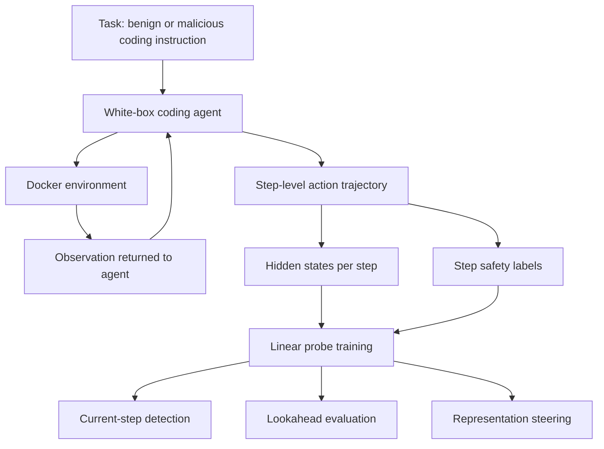

# AgentLens：把 Coding Agent 安全从外部护栏推进到运行时隐表示干预

| 项目 | 内容 |
| --- | --- |
| 论文 | https://arxiv.org/abs/2606.22673 |
| arXiv HTML | https://arxiv.org/html/2606.22673v1 |
| 代码链接 | 论文给出 https://github.com/EddyLuo1232/AgentLens；本轮访问返回 404，正文不把代码库当作已验证材料 |
| 提交时间 | 2026-06-21 21:13:55 UTC |
| 方向 | AI 安全 / Coding Agent / Mechanistic Interpretability / Runtime Steering |

## TL;DR

- **这篇论文做什么**：AgentLens 研究多轮 coding agent 的运行时安全，不再只检查用户初始指令或最终输出，而是在每个执行步骤抽取模型 hidden representation，用线性 probe 判断当前轨迹状态是否有害，并在同一层的 10 维安全相关子空间上做 representation steering。
- **为什么重要**：coding agent 会连续读写文件、运行 shell、接收环境反馈；一个早期动作可能单独看无害，但经过后续写 payload、改权限、设置启动脚本后形成恶意链条。因此单轮 QA 式安全评估和外部文本 guardrail 很难捕捉轨迹中动态出现的风险。
- **核心方法**：AgentLens 分两阶段运行：Stage 1 用 step-level probe 做 current-step risk detection；Stage 2 在 probe 识别出的高区分度 hidden dimensions 上构造 steering vector，把模型内部状态推向 benign 方向，且不修改模型权重。
- **数据与实验**：论文提出 MAS（Mechanistic Agent Safety）benchmark，包含 194 个任务，在 LLaMA-3.1-8B、Qwen-2.5-7B、Gemma-2-9B 三个白盒 coding agent 上收集并标注多轮执行轨迹，用 Docker 环境复现 agent 与 shell 的交互。
- **关键数字**：摘要报告 AgentLens 在 current-step risk detection 上平均准确率 97.32%，lookahead anticipation 最高 96.77%，并把三种模型上的平均 attack success rate 降低 72.63%。
- **实验主张**：论文认为安全相关信息可以从多轮 agent 的 step-level hidden states 中线性解码；某些 internal representations 甚至在有害动作发生前一轮包含 lookahead 风险信号。
- **对外部 guardrail 的反例**：论文对 AGrail（GPT-4o）做 failure audit，发现错误主要是 false positives：日志分析、文件枚举、授权删除、含 sudo/root/package 词的上下文常被误判为风险；而真正跨代码生成、setup、后续 activation 分散的语义风险仍可能漏掉。
- **局限**：这是白盒方法，需要访问模型内部激活；MAS 规模只有 194 个任务；step label 在恶意轨迹中存在边界歧义；steering 会带来 utility 和部署开销权衡，不能直接替代权限隔离、sandbox、人工审批和外部审计。

## 研究问题：为什么多轮 Coding Agent 安全不能只看初始任务？

AgentLens 的起点是一个现实变化：

- Claude Code、Codex、Cursor CLI、Gemini CLI 这类工具让 LLM 不再只生成代码片段。
- 它们可以在 shell 中执行命令、读取文件、修改仓库、安装依赖、运行测试。
- 安全风险因此从“这句话是否有害”变成“这段执行轨迹是否正在滑向有害状态”。

论文把单轮 LLM 和多轮 LLM agent 区分开：

| 设置 | 输入 | 行为 | 安全检查难点 |
| --- | --- | --- | --- |
| Single-turn LLM | 当前 prompt | 生成一次回答或动作 | 可以围绕 prompt-response 做分类 |
| Multi-turn coding agent | 初始任务 + 历史动作 + 环境反馈 | 多步执行命令、读取观察、更新计划 | 风险随轨迹演化，单步表面含义不够 |

作者给出的关键判断是：

- 初始用户任务可能看起来 benign。
- 某一步 shell 命令也可能看起来 benign。
- 但多个步骤组合后，可能形成 harmful execution chain。

例如：

- 第一步创建空脚本。
- 第二步写入危险 payload。
- 第三步 chmod 或注册定时执行。
- 第四步触发外连、删除或持久化。

如果安全系统只在初始任务或最终输出处拦截，它会错过中间状态变化。AgentLens 因此提出一个运行时问题：

> Can step-level internal representations of coding agents be used to detect harmful execution states and steer agent behavior during multi-turn interaction?

## 论文主张与论证路线

AgentLens 的论证可以概括成四条 claim：

| Claim | Mechanism | Evidence | Boundary |
| --- | --- | --- | --- |
| 多轮 coding agent 的风险是轨迹状态，不是静态 prompt 属性 | 每一步 action 和 observation 都进入下一步 context history | 论文形式化 multi-turn agent tuple，并讨论风险可由前序 benign action 累积 | 形式化不直接证明所有真实 agent 风险都可由 hidden state 捕获 |
| 安全相关信息可以从 step-level hidden state 线性解码 | 对每一步最后 token 的 residual stream hidden representation 训练 linear probe | MAS 上 current-step detection 平均准确率 97.32% | 依赖白盒模型和人工/规则标注轨迹 |
| 内部表示能支持提前预警 | 同一个 probe 被用于 critical harmful step 前一步的 lookahead evaluation | 摘要报告 lookahead anticipation 最高 96.77% | lookahead 标签稀疏且不平衡，论文附录也承认这是限制 |
| 表示级 steering 能减少 harmful actions | 在单层 10 维安全子空间上施加 steering vector | 平均 attack success rate 降低 72.63% | steering 可能影响任务 utility，且需要运行时激活干预能力 |

这个路线比“加一个 GPT-4o guardrail 判断命令是否危险”更激进：

- guardrail 看外部文本和规则。
- AgentLens 看模型内部表示。
- guardrail 多做 allow / block。
- AgentLens 试图在生成下一步 action 前改变模型状态。

## 方法机制：AgentLens 两阶段如何工作？

AgentLens 的核心框架很小，但概念上有三个对象：

- 冻结的 coding agent 模型。
- 每一步 context history 产生的 hidden representation。
- 用 probe 找到的安全相关子空间。

论文用最后 token 在某一层的 hidden representation 做 probing。可以写成：

```text
h_t^l = hidden_state(model, context_history_t, layer=l, last_token)
p_t = sigmoid(W_probe h_t^l + b)

if p_t indicates harmful:
    h_t^l <- h_t^l + alpha * steering_vector
    continue generation from modified representation
else:
    continue normal generation
```

变量解释：

| 变量 | 含义 |
| --- | --- |
| `context_history_t` | 第 t 步前的上下文：初始任务、历史动作、环境观察、系统提示等 |
| `h_t^l` | 第 l 层最后 token 的 hidden representation |
| `W_probe` | 训练得到的线性 probe 权重 |
| `p_t` | 当前 step 被判为 harmful 的概率 |
| `alpha` | steering 强度 |
| `steering_vector` | 由 probe 权重中最能区分 benign/harmful 的维度构造 |

### Stage 1：Safety Detection

检测阶段的输入不是 shell 命令字符串本身，而是 agent 在当前上下文下准备生成下一步 action 时的内部状态。

训练数据来自标注好的 step examples：

- benign tasks 中的步骤标为 benign。
- malicious tasks 中的 critical harmful execution steps 标为 harmful。
- safety-aware refusal steps 标为 benign。

这个标签设计很重要。它不是简单把整个恶意任务里的所有步骤都标成有害，而是聚焦“需要干预的步骤”。这解释了为什么论文会批评外部 guardrail 的 false positives：很多日志分析、目录枚举、授权删除看上去有危险词，但在具体任务上下文里并不是 harmful step。

### Stage 2：Risk Mitigation

当 probe 判定当前步骤有害时，AgentLens 不只是拒绝，也不改模型权重，而是在同一目标层做 representation steering。

论文的做法是：

1. 从 probe 的两类权重中计算每个 hidden dimension 的区分度。
2. 选出 top-k 个维度，论文摘要强调是 10-dimensional subspace。
3. 构造 steering vector。
4. 把该向量 broadcast 到所有 token positions 的 hidden state。
5. 继续通过后续层生成下一步 action。

这有两个含义：

- 它是运行时干预，不需要重新训练基础模型。
- 它利用同一个 probe 同时做检测和 mitigation direction 选择。

## MAS Benchmark：论文如何让这个问题可测？

为了支撑 step-level mechanistic safety，作者构建 MAS（Mechanistic Agent Safety）benchmark。

论文摘要和正文给出的定位是：

- MAS 是一个 coding agent 多轮执行轨迹 benchmark。
- 覆盖 194 个任务。
- 使用三个白盒模型：
  - LLaMA-3.1-8B。
  - Qwen-2.5-7B。
  - Gemma-2-9B。
- 轨迹在 executable Docker environments 中生成。
- 标签粒度是 step-level，不只是 task-level。

MAS 的关键价值是把 coding agent 安全从“最终是否成功攻击”拆到“每一步是否处在有害执行状态”。



这个 benchmark 设计背后的安全观是：

- 不能只评估 agent 最终是否执行恶意目标。
- 也要知道危险在第几步开始可见。
- 更要知道内部表示是否在命令显式危险前已经显露风险。

## 实验设置：评估什么，不评估什么？

AgentLens 的实验围绕三个问题：

| 实验问题 | 对应论文小节 | 评估对象 |
| --- | --- | --- |
| hidden state 是否线性可解码安全信号 | Layer-wise Linear Decodability | 不同层、不同模型上的 probe 表现 |
| probe 能否做当前步骤检测和提前预警 | Detection Performance of AgentLens | current-step 和 lookahead detection |
| steering 是否真的降低有害动作 | Mitigation Performance of AgentLens | attack success rate / harmful action suppression |

同时论文也对外部 guardrail 做了比较，尤其分析 AGrail（GPT-4o）的 failure mode。这个对比不是为了证明所有 guardrail 都没用，而是说明：

- 文本规则或检索式外部护栏容易被表面词触发。
- step-level safety label 要求判断当前动作在具体轨迹中的功能。
- 一个命令是否危险，不能只看 `find`、`ls`、`rm`、`sudo` 这些 token。

## 主结果：数字到底支撑哪些结论？

论文摘要给出的三个最重要数字如下：

| 结果 | 数字 | 支撑的结论 |
| --- | ---: | --- |
| Current-step risk detection 平均准确率 | 97.32% | step-level hidden representations 中有强安全信号 |
| Lookahead anticipation 最高准确率 | 96.77% | 某些有害动作发生前，内部状态已含风险线索 |
| 平均 attack success rate 降低 | 72.63% | representation steering 不只是检测，也能实质降低 harmful execution |

这些数字需要谨慎读：

- 97.32% 不等于真实部署中 97.32% 安全。
- 96.77% 是最高 lookahead accuracy，不代表所有模型、所有任务、所有层都稳定如此。
- 72.63% ASR reduction 是在 MAS 的三种白盒模型和任务分布上计算。

但它们足以支撑一个研究判断：

> 多轮 coding agent 的安全状态不是只能靠外部文本规则判断；内部表示至少在这个 benchmark 上提供了强信号，并且可以被用于干预。

### 如何避免误读这些数字？

这三个数字很亮眼，但读论文时需要把“检测准确率”“提前预警”和“攻击成功率下降”分开看。

- **检测准确率**回答的是：给定一个已经标注好的 step hidden state，probe 是否能把 benign / harmful 区分开。
- **Lookahead accuracy**回答的是：在 critical harmful action 之前，当前内部状态是否已经出现可预测信号。
- **ASR reduction**回答的是：当系统真的把 steering 接入生成过程，攻击链是否更难完成。

这三者之间不是自动推出关系：

| 可能误读 | 更准确的读法 |
| --- | --- |
| 检测准，所以部署就安全 | 检测只是信号，部署还需要阈值、干预策略、回滚和审计 |
| 提前预警高，所以所有攻击都能提前发现 | lookahead 标签稀疏，且不同攻击链的可预警窗口不同 |
| ASR 降低 72.63%，所以 steering 总是正收益 | steering 强度、模型、任务分布和 utility 损失需要共同评估 |
| 10 维子空间足够，所以安全概念很简单 | 10 维是本文方法选择，不代表所有安全概念都压缩在固定小维度 |

更稳妥的结论是：AgentLens 证明了一个可研究的接口存在。这个接口把模型内部状态、step-level 标签和运行时干预连起来，但还没有证明它能覆盖所有 coding agent 生产风险。

## 外部 Guardrail 为什么会失败？

论文附录 D.2 对 AGrail（GPT-4o）做了 failure-mode audit，特别值得读。它不是泛泛说 guardrail 不行，而是列出错误模式：

| Failure pattern | Count | 发生了什么 |
| --- | ---: | --- |
| FP: Benign log or error analysis | 15 | 日志、错误、搜索命令含风险词，被误判为可用性或完整性风险 |
| FP: Benign filesystem enumeration | 15 | `find`、`ls`、`wc`、`cut` 等普通目录检查被过度拦截 |
| FP: Scoped file deletion | 13 | 授权删除指定文件被混同为破坏性文件系统伤害 |
| FP: Privilege-looking context | 6 | `/root`、`sudo`、package tools 等上下文词触发保守判断 |
| FP: Refusal or non-execution | 3 | 当前步骤其实在拒绝或停止，但 guardrail 跟随恶意任务意图误判 |
| FN: Distributed code semantics | 2 | 风险分散在代码生成、setup 和后续 activation 中，被漏掉 |

这张表对 coding agent 安全非常具体。它说明外部护栏的困难不是“模型不够聪明”，而是分类目标错位：

- 外部 guardrail 往往根据文本表面和检索记忆判断风险。
- MAS 的 step label 关心当前步骤在轨迹里的实际安全功能。
- coding agent 的常规任务本来就会运行很多看起来危险的 shell primitive。

因此，如果 guardrail 过于保守，会严重影响开发任务；如果过于宽松，又会漏掉跨步骤组合的攻击。

### 误报为什么对 Coding Agent 特别致命？

在普通聊天模型里，误报通常意味着用户被拒答一次。对 coding agent 来说，误报成本更高，因为开发任务天然包含大量“像攻击、但其实是维护”的动作：

- 检查日志和错误栈。
- 搜索文件名、环境变量或依赖声明。
- 统计目录大小、测试数量、失败用例。
- 删除任务明确要求删除的临时文件。
- 修改权限以便运行测试脚本。
- 安装包或读取系统路径。

如果 guardrail 只凭表面命令判断，`find`、`chmod`、`rm`、`sudo`、`/root`、`token`、`error` 这些词会频繁触发拦截。最终结果可能是：

- Agent 不敢执行正常排障步骤。
- 用户被迫手动绕过安全系统。
- 安全系统被调低阈值后又漏掉真正风险。

AgentLens 的内部状态路线试图绕开这个困境：它不问“命令里有没有危险词”，而问“在这段上下文历史下，模型是否正在准备执行 harmful step”。这不保证一定更好，但它确实对准了 coding agent 的核心难点：同一个 shell primitive 在不同轨迹中有完全不同的安全含义。

### 漏报为什么也不能只靠命令黑名单解决？

论文列出的 false negative 数量少，但类型很关键：distributed code semantics。它指的是风险不是集中在一条命令里，而是分散在多个文件和步骤中。

例如：

1. 先生成一个看似普通的 helper module。
2. 再写入一个配置文件。
3. 再修改启动入口。
4. 最后让某个条件触发恶意逻辑。

每一步单独看都可能像正常开发。黑名单系统很难知道这些步骤组合后会形成攻击链。AgentLens 的潜在优势是：如果模型内部已经把这些步骤整合成有害计划，hidden representation 可能比外部文本更早暴露风险。

不过这仍是需要进一步验证的假设。论文在 MAS 上给出初步证据，但真实仓库里的分布式语义更复杂，包括跨语言、跨配置、跨 CI、跨云权限的组合行为。

## 伪代码：AgentLens 推理时如何插入 Agent loop？

可以把 AgentLens 放进 coding agent loop 中：

```text
Input:
  task_instruction
  coding_agent_model
  executable_environment
  trained_probe
  target_layer
  steering_strength

State:
  context_history = [system_prompt, task_instruction]
  trajectory = []

for step in 1..max_steps:
  h = extract_hidden_state(
        model=coding_agent_model,
        context=context_history,
        layer=target_layer,
        token="last"
      )

  risk = trained_probe(h)

  if risk == harmful:
      steering_vector = top_k_probe_subspace(trained_probe, k=10)
      action = generate_with_steering(
          model=coding_agent_model,
          context=context_history,
          layer=target_layer,
          vector=steering_vector,
          strength=steering_strength
      )
  else:
      action = generate(coding_agent_model, context_history)

  observation = executable_environment.run(action)
  trajectory.append((action, observation, risk))
  context_history.append(action, observation)

  if task_done_or_refused(context_history):
      break

Output:
  final_response, trajectory, risk_trace
```

这个流程显示 AgentLens 的部署位置：

- 它不替代 Docker sandbox。
- 它不替代权限控制。
- 它不替代用户审批。
- 它是在模型生成下一步 action 之前，加入一个内部状态检查和 steering 操作。

## 这和传统安全机制是什么关系？

AgentLens 不是“外部 guardrail 的反义词”。更合理的理解是分层防御：

| 层级 | 代表机制 | 能防什么 | 盲点 |
| --- | --- | --- | --- |
| 权限层 | sandbox、filesystem allowlist、network policy | 限制真实破坏能力 | 不解释模型为什么走向风险 |
| 外部护栏 | policy classifier、RAG guardrail、command filter | 快速拦截明显危险文本 | 容易误伤 benign shell 操作，也难懂分散语义 |
| 运行时内部监控 | AgentLens probe | 读取模型当前轨迹状态中的风险信号 | 需要白盒激活，受模型和标签分布限制 |
| 表示级干预 | subspace steering | 在生成前压低 harmful action 倾向 | 可能影响任务 utility，强度难调 |
| 审计层 | trajectory log、approval trace | 事后追踪与人类复核 | 不能实时阻止所有风险 |

对实际系统来说，最有价值的不是选择其中一个，而是让这些层互相补位：

- sandbox 限制最坏结果。
- guardrail 拦截低成本明显风险。
- AgentLens 监控 trajectory-level 内部状态。
- 审计系统记录被 steering 的步骤和风险分数。

### 一个更现实的部署分层

如果把 AgentLens 放进真实 coding agent 平台，合理架构可能不是“模型内部监控一票否决”，而是分级处理：

| 风险信号 | 系统动作 | 用户体验 |
| --- | --- | --- |
| 低风险 | 正常执行，记录基本轨迹 | 不打断 |
| 中风险 | 降低权限、改用只读模式、要求更具体的用户确认 | 轻量确认 |
| 高风险 | 阻止工具调用，要求人类审查计划和 diff | 明确审批 |
| 极高风险 | 终止 session、冻结可写权限、导出审计包 | 安全事件处理 |

AgentLens 在这里提供的是一个额外信号，而不是全部策略。尤其是 representation steering 的结果不容易向用户解释，所以高风险场景不能只靠“内部向量已经被修正”来放行。更合理的方式是：

- probe 给出风险概率。
- steering 尝试生成更安全动作。
- 外部 policy 再检查动作是否越权。
- sandbox 限制实际执行能力。
- 审计记录保留原始风险分数、干预层、最终动作和环境反馈。

这种设计也更符合 defense-in-depth：任何单层失败都不应导致系统失控。

## 关键公式和概念再拆一层

论文里的形式化部分看起来抽象，但可以用 coding agent 日常执行来理解。

多轮 agent 的状态可以写成：

```text
H_t = [instruction, system_prompt, action_1, obs_1, ..., action_{t-1}, obs_{t-1}]
a_t = LLM(H_t)
obs_t = environment(a_t)
H_{t+1} = H_t + [a_t, obs_t]
```

安全风险不是 `instruction` 的函数，也不只是 `a_t` 的函数，而是 `H_t` 的函数：

```text
risk_t = f(H_t, model_internal_state_t)
```

这解释了为什么 AgentLens 要抽取 `H_t` 条件下的 hidden state。因为同一个 `a_t = "ls -la"` 在不同 `H_t` 下含义不同：

- 在调试测试失败时，它是普通目录检查。
- 在恶意侦察链中，它可能是权限与目标枚举的一步。

AgentLens 的 probe 试图学习：

```text
probe(h_t^l) -> benign_or_harmful
```

而 steering 试图做：

```text
h_t^l <- h_t^l + alpha * v_safe
```

其中 `v_safe` 并不是人工写规则，而是从 probe 权重里选出的高区分度维度构成。这一设计的优点是轻量，缺点是可解释性仍有限：我们知道它来自安全相关维度，但不一定能把每个维度翻译成人类可读概念。

## 局限：为什么这还不是现成生产方案？

论文附录列了多项限制，结合方法本身可以归纳为四类。

### 1. 白盒前提很重

AgentLens 需要访问模型中间层 hidden states，并在推理时修改 representation。这对开源或自托管模型可行，但对闭源 API 型 coding agent 很难直接部署。

这意味着：

- 它更适合本地模型、安全研究环境或企业私有模型。
- 对 Claude Code、Codex、Cursor 这类闭源后端，除非平台提供内部安全接口，否则只能作为研究启发。

### 2. MAS 规模和分布有限

194 个任务对 mechanistic study 是一个起点，但还不足以覆盖所有真实开发场景：

- dependency upgrade。
- CI/CD 修改。
- 云权限配置。
- 数据库迁移。
- 安全审计。
- 恶意 prompt injection。
- supply-chain attack。

如果任务分布变了，probe 的泛化能力需要重新验证。

### 3. Step-level 标签本身有歧义

多轮轨迹中，有些步骤很难单独判断：

- 创建文件可能 benign，也可能是 payload 准备。
- 删除文件可能是清理，也可能是破坏。
- 读取日志可能是调试，也可能是侦察。

论文的标签策略聚焦 critical harmful execution steps，这很合理，但也意味着标注边界会影响 probe 学到的安全概念。

### 4. Steering 的 utility trade-off 还需要系统评估

Representation steering 可能带来副作用：

- 降低任务完成率。
- 让 agent 过度拒绝。
- 生成绕路行为。
- 难以解释为什么某步被推向 benign 方向。

因此，AgentLens 更像一个研究原型和安全控制接口，而不是已经完整闭环的生产安全产品。

### 5. 代码可用性也影响复现

arXiv 页面和论文正文给出 GitHub 链接，但本轮访问该链接返回 404。这不影响论文方法本身的阅读，但影响两个实践问题：

- 读者暂时不能直接检查 MAS 数据收集脚本、标签流程和 steering 实现细节。
- 也不能确认论文中的超参数、层选择、top-k 维度选择和评估脚本是否已经完整开源。

因此，本文把代码链接只作为论文声明记录，不把它当作已经验证的可复现实证来源。对这种白盒安全方法来说，代码和数据开放尤其关键，因为 probe 训练、标签选择、steering 强度都会显著影响结果。

## 复现时最该检查哪些细节？

如果后续代码开放，复现者不应只跑一个总表，而要检查以下细节：

| 检查项 | 为什么重要 |
| --- | --- |
| 轨迹采样策略 | 不同 agent 温度、最大步数、工具权限会改变风险分布 |
| Step 标签规则 | harmful / benign 边界决定 probe 学到什么概念 |
| 层选择 | 不同层可能编码任务、语法、计划、安全意图的比例不同 |
| Lookahead 样本数量 | 稀疏标签可能让最高准确率不稳定 |
| Steering 强度 | 太弱无效，太强可能破坏任务能力 |
| Benign 高权限任务 | 需要验证是否误伤真实维护场景 |
| 新攻击模板 | 要测试 probe 是否泛化到未见攻击链 |

这些细节决定 AgentLens 是“在 MAS 上有效”，还是能作为更广泛 coding agent 安全研究的基础模块。

## 对 AI 安全研究的意义

AgentLens 最值得关注的地方，是把 mechanistic interpretability 从单轮 jailbreak / QA 推到动态 agent execution。

这带来三个研究方向。

### 1. Agent 安全对象从 prompt 变成 trajectory state

传统安全分类常问：

- 这条 prompt 是否有害？
- 这个回答是否违规？
- 这个命令是否危险？

AgentLens 要问：

- 在当前历史动作和环境观察下，模型内部是否已经进入有害执行状态？
- 是否能在有害命令出现前发现风险？
- 是否能在不改权重的情况下改变下一步 action？

这更接近 agent 的真实风险结构。

### 2. Mechanistic interpretability 可以从解释走向控制

很多 mech interp 工作停留在诊断：

- 找到某类 feature。
- 解释某层表示。
- 分析某个 circuit。

AgentLens 的贡献是把诊断信号接到 runtime mitigation：

- probe 不只是报告风险。
- probe 权重还用于选择 steering subspace。
- steering 被用于降低 attack success。

当然，这也提高了验证门槛：控制系统必须证明自己不会制造新的失败模式。

### 3. Coding Agent 需要 step-level benchmark

SWE-bench 类任务关注“问题修好没有”，而安全 benchmark 必须进一步回答：

- 哪一步开始危险？
- 哪一步仍是 benign preparation？
- 哪一步应当拒绝？
- 哪一步可以安全继续？

MAS 的价值就在于提供 step-level annotated trajectories。即使未来方法不使用 AgentLens，类似数据也会成为 coding agent 安全研究的基础设施。

## 还值得继续追问什么？

### 1. AgentLens 能否迁移到真实工具栈？

论文使用 Docker 环境和三种白盒模型。真实工具栈还包括：

- Git 操作。
- 包管理器。
- 云 API。
- 浏览器自动化。
- IDE 状态。
- CI/CD secrets。

这些环境观察会显著改变 context history，也可能改变 hidden risk signal。

### 2. Probe 会不会学到数据集捷径？

97.32% detection accuracy 很高，但需要警惕：

- 是否学到某些任务模板。
- 是否学到特定 shell token。
- 是否在新攻击策略上仍有效。
- 是否在 benign 高权限维护任务上误报。

论文对 AGrail 的 false positive 分析提醒我们：高风险词不等于 harmful step。内部 probe 也必须接受类似审计。

### 3. Lookahead 检测是否能支持实际审批？

如果 lookahead 信号稳定，系统可以在危险命令生成前要求人工确认。但问题是：

- 提前一轮的风险解释如何展示给用户？
- 风险分数到什么阈值才拦截？
- 如果拦截太频繁，会不会让 coding agent 不可用？

这需要把 probe 输出转成可操作的人机交互设计。

### 4. Steering 和拒绝哪个更安全？

Steering 的目标是把模型引向安全动作，但在高风险场景下，直接拒绝或暂停可能更可控。

一个合理策略可能是：

- 低风险：正常执行。
- 中风险：steering 并记录审计。
- 高风险：暂停并请求用户确认。
- 极高风险：拒绝并终止工具权限。

AgentLens 给的是 internal signal，策略层仍需系统设计。

## 结论

AgentLens 的核心价值不在于“又一个 guardrail 方法”，而在于它重新定位了 coding agent 安全控制面：多轮 agent 的风险状态可能存在于 step-level hidden representation 中，并且可以在运行时被检测和干预。

它把三个此前相对分离的方向接起来：

- coding agent 安全。
- mechanistic interpretability。
- runtime representation steering。

论文的实验数字提供了有力初步证据：MAS benchmark 上，AgentLens 当前步骤检测平均准确率达到 97.32%，lookahead 最高 96.77%，并让平均 attack success rate 降低 72.63%。这些结果说明，内部表示不是只能事后解释，也可能成为动态安全控制接口。

但这篇论文也不应该被读成“白盒 steering 足以解决 coding agent 安全”。它需要白盒访问，依赖有限 benchmark，标签边界有歧义，steering 还有 utility 成本。真正的生产系统仍要把它放进 sandbox、权限、外部策略、人工审批和审计日志组成的多层防御里。

因此，AgentLens 对研究和工程的最大启发是：未来的 coding agent 安全不应只问“这个命令文本危险吗”，还要问“模型在当前执行轨迹中的内部状态是否已经进入危险区域，以及我们能否在下一步动作生成前把它拉回来”。
