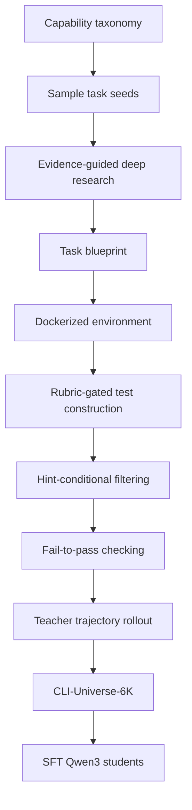
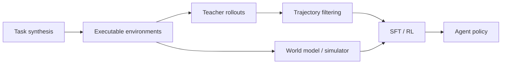

# CLI-Universe：终端 Agent 后训练为什么需要“可执行任务合成引擎”

| 项目 | 信息 |
| --- | --- |
| 论文 | CLI-Universe: Towards Verifiable Task Synthesis Engine for Terminal Agents |
| 方向 | 大模型后训练 / Terminal Agent / 可验证数据合成 |
| arXiv | https://arxiv.org/abs/2606.22883 |
| HTML | https://arxiv.org/html/2606.22883v1 |
| Hugging Face Paper | https://huggingface.co/papers/2606.22883 |
| 发布时间 | 2026-06-22 05:50:23 UTC |
| 核心对象 | `CLI-Universe` 合成引擎与 `CLI-Universe-6K` 轨迹数据 |

### TL;DR

- **这篇论文解决的问题**：Terminal Agent 的训练瓶颈不是缺少“看起来像任务”的文本，而是缺少可执行、可验证、有真实工程路径、能提供强监督信号的训练任务。
- **核心做法**：作者提出 `CLI-Universe`，把任务合成拆成三层：多维能力 taxonomy 采样、证据引导的深度研究、Docker 化环境与多阶段可执行验证。
- **数据构造原则**：候选任务不是从表面 artifact 直接改写成 benchmark，而是先定义领域、技能类型、能力点和工程支柱，再用真实技术材料落地成 blueprint。
- **验证机制**：每个任务要经过 rubric-gated test construction、hint-conditional filtering、strict fail-to-pass checking；整个流程会丢弃约三分之二候选，只保留真实、可验证、非平凡的任务。
- **训练证据**：作者用 6,000 条高密度轨迹微调 Qwen3 系列；`CLI-Universe-32B` 在 Terminal-Bench 2.0 达到 **33.4%**，成为 32B 及以下开源数据训练模型的新 SOTA。
- **迁移证据**：同一模型在 BFCL v4 从 Qwen3-32B 的 **46.7** 提到 **58.0**，在 VitaBench 从 **15.4** 提到 **27.0**，说明收益不只来自 Terminal-Bench 过拟合。
- **消融证据**：删除任一验证组件都会造成约 **3-6 分**损失；不同 teacher 的轨迹蒸馏也能有效，Kimi-K2.6 teacher 得到 **33.4**，DeepSeek-V4-Pro teacher 得到 **31.2**。
- **失败边界**：训练后模型的失败重心从 frontier baselines 常见的验证不足，转向执行侧的 step repetition；这说明数据提升了“会做和会检查”，但还没有解决长程执行中的循环、上下文保持和终止识别。

### 1. 研究问题：为什么 Terminal Agent 的数据不能只靠“多生成一些任务”？

Terminal Agent 的特殊之处在于：它不是一次性回答问题，而是在 shell、文件系统、包管理器、测试框架和长程任务目标之间反复交互。

这让训练数据必须同时满足几件事：

| 要求 | 对训练数据的含义 | 不满足时的后果 |
| --- | --- | --- |
| 可执行 | 任务必须能在真实或隔离环境里运行 | 模型学到的是文本模板，不是操作能力 |
| 可验证 | success / failure 必须能由测试、文件、命令结果判定 | reward 或 SFT 标签变成主观判断 |
| 非平凡 | 解法不能只是一两个命令或照抄说明 | 轨迹没有长程规划、调试和恢复信号 |
| 工程真实 | 任务要来自真实工具、库、系统约束 | 模型上线后遇到真实环境会迁移失败 |
| 监督密集 | 每条轨迹要包含探索、诊断、修复、验证 | 后训练只能学最终答案，学不到过程控制 |

作者批评的旧路线是“retrofitting surface-level artifacts into tasks”。这类数据可能规模很大，却常见三类弱点：

- **指令模糊**：任务描述像需求，但没有足够约束，导致多种解都可以自圆其说。
- **执行路径浅**：模型几步就能完成，无法训练长程状态跟踪和多轮修复。
- **测试脆弱**：测试只覆盖 happy path，模型可以靠猜测或过拟合通过。

因此，CLI-Universe 的问题定义不是：

> 怎样自动生成更多 terminal tasks？

而是：

> 怎样生成“可以当后训练监督信号”的 terminal tasks？

这个差异很关键。前者追求数量，后者追求任务的可验证性、失败可归因性和过程学习价值。

### 2. 论文主张：高质量任务合成要从 capability specification 开始

CLI-Universe 的第一层不是让 LLM 随机编题，而是先定义多维能力 taxonomy。

可以把每个候选任务看成一个四元组：

```text
task_seed = (domain, skill_type, capability, engineering_pillar)
```

变量含义：

| 变量 | 作用 | 示例性解释 |
| --- | --- | --- |
| `domain` | 任务所在技术领域 | 数据处理、系统管理、机器学习、安全、软件工程 |
| `skill_type` | Agent 需要展示的操作类型 | 诊断、构建、转换、修复、集成、验证 |
| `capability` | 更细的能力点 | 命令行调试、依赖安装、格式转换、测试设计 |
| `engineering_pillar` | 工程约束或产物类型 | Docker 环境、文件输出、服务启动、benchmark 验收 |

这种设计有两个意义：

- **覆盖空间可控**：研究者能知道数据到底覆盖了哪些能力，而不是事后从任务标题里猜。
- **难度可以组合**：一个任务可以同时要求环境理解、文件操作、依赖安装和测试修复。
- **后训练更可解释**：如果某类任务提升或退化，可以回到 taxonomy 分析数据来源。

论文真正强调的是“structured capability specification”。这意味着任务合成不是纯 prompt engineering，而是一种数据工程系统。

### 3. CLI-Universe 的流水线：从候选想法到可训练轨迹

作者把任务合成做成多阶段 pipeline。每一步都在减少噪声，而不是把噪声留给模型训练时自己消化。



每个节点的作用可以拆开看：

| 阶段 | 输入 | 输出 | 过滤掉什么 |
| --- | --- | --- | --- |
| taxonomy sampling | 能力维度组合 | 候选任务种子 | 单一、重复、覆盖不均的想法 |
| evidence-guided research | 真实技术材料 | grounded blueprint | 空泛、不可执行、缺少背景的题目 |
| Docker instantiation | blueprint | 隔离环境 | 依赖不清、无法复现的任务 |
| test construction | 任务目标与 rubric | 验收测试 | 只看表面文件、不检查语义的测试 |
| hint filtering | 有/无提示条件 | 难度筛选 | 太容易或只能靠隐藏提示完成的任务 |
| fail-to-pass | 初始失败 + 正解通过 | 可验证监督 | 测试本来就过、正解也过不了的任务 |

论文说整个 pipeline 从候选生成到验证会丢弃约三分之二候选。

这个数字的意义不是“丢弃率越高越好”，而是说明作者把数据质量门槛前置到了训练之前：

```text
retention_rate ≈ 1 / 3

training_value = executable(task)
               × verifiable(task)
               × nontrivial(task)
               × trajectory_quality(task)
```

如果其中任一项接近 0，这条轨迹对后训练的价值也会接近 0。

### 4. 为什么“证据引导深度研究”是关键环节？

Terminal tasks 最容易伪造。一个 LLM 可以很快写出“请修复某库的配置问题”这种题目，但这不代表任务真的有工程含量。

CLI-Universe 把 evidence-guided deep research 放在 blueprint 之前，是为了让任务来源有外部锚点：

- 真实文档能提供正确命令、配置格式、约束和错误场景。
- 真实 issue / docs / examples 能提示任务里的边界条件。
- 技术材料能帮助测试覆盖语义，而不是只检查文件是否存在。

可以把它理解为从“编题”转向“研究后建模”：

| 路线 | 任务来源 | 主要风险 |
| --- | --- | --- |
| 表面 artifact 改写 | README、脚本、文件名、代码片段 | 任务像真实任务，但目标浅、测试弱 |
| 纯 LLM 想象 | prompt 生成需求 | 容易产生不存在的库行为或不可复现环境 |
| CLI-Universe | 能力组合 + 真实材料研究 | 成本高，但任务更接近工程事实 |

这也是论文对 Agent 后训练的一个隐含判断：

- SFT/RL 数据不只是“答案数据”。
- 它本质上是“环境和任务分布设计”。
- 对 Terminal Agent 来说，分布质量往往比轨迹数量更重要。

### 5. 可执行验证：为什么 fail-to-pass 比“看起来正确”更重要？

CLI-Universe 训练的是能操作终端的 Agent，所以监督不能停留在人工读答案或 LLM judge。

论文里的核心验证思想可以写成：

```text
valid_task(t) =
  initial_state(t) fails tests
  ∧ solution_trajectory(t) passes tests
  ∧ tests align with rubric(t)
  ∧ no shortcut/hint leakage dominates
```

其中 `fail-to-pass` 是最重要的门槛：

- 初始环境必须失败，说明任务不是本来就完成。
- 正确解必须通过，说明测试是可满足的。
- 测试必须对应 rubric，说明通过不是碰巧。
- hint 条件要能区分“任务本身可解”和“只有隐藏提示才能解”。

用后训练视角看，fail-to-pass 检查提供的是 reward anchor：

| 验证项 | 对训练信号的贡献 |
| --- | --- |
| 初始失败 | 防止模型学到无操作也成功 |
| 正解通过 | 确认任务有可达目标状态 |
| rubric gating | 把测试与真实需求绑定 |
| hint filtering | 控制难度与信息泄漏 |
| Docker 隔离 | 降低环境漂移和不可复现 |

这类验证比“模型生成了合理解释”更接近真实 agent deployment，因为真实终端任务最终要落到文件、命令、测试、服务状态和外部效果上。

### 6. 算法流程：一个可复用的数据合成伪代码

下面用论文机制重写一版更适合工程复现的伪代码。

```text
Input:
  taxonomy T = {domain, skill_type, capability, engineering_pillar}
  research_corpus R
  teacher_models M
  verification_budget B

State:
  candidates = []
  verified_tasks = []
  trajectories = []

for each sampled combination c in T:
  seed = propose_task_seed(c)
  evidence = retrieve_and_read(R, seed)

  if evidence is insufficient:
    continue

  blueprint = write_task_blueprint(seed, evidence)
  env = build_docker_environment(blueprint)
  tests = construct_tests_with_rubric(blueprint)

  if not rubric_aligned(tests, blueprint):
    continue

  if initial_state_passes(env, tests):
    continue

  solution = produce_reference_solution(env, blueprint)

  if not solution_passes(env, tests, solution):
    continue

  if hint_condition_suggests_leakage_or_triviality(env, blueprint):
    continue

  verified_tasks.append((blueprint, env, tests))

for task in verified_tasks:
  for teacher in M:
    traj = rollout_terminal_agent(teacher, task)
    if trajectory_is_successful_and_useful(traj):
      trajectories.append(traj)

Output:
  CLI-Universe-6K = select_high_density_trajectories(trajectories, n=6000)
```

失败边界也要写进算法：

- 如果 evidence 不足，不能让 LLM 补全不存在的事实。
- 如果测试不对齐 rubric，即使任务能跑也不能进入训练集。
- 如果初始状态已通过测试，任务没有监督价值。
- 如果参考解也无法通过，测试或环境本身不可靠。
- 如果 hint 泄露主要答案，轨迹会训练出依赖提示而非真实解决能力。

### 7. 训练设置：为什么 6K 轨迹能打出强效果？

论文最引人注意的结果是：只用 6,000 条轨迹，Qwen3-32B 微调后在 Terminal-Bench 2.0 达到 **33.4%**。

这不是“少量数据奇迹”，而是三个因素叠加：

| 因素 | 作用 |
| --- | --- |
| 高密度任务 | 每个任务都经过能力采样和真实材料 grounding |
| 可执行验证 | 轨迹成功与否有环境和测试锚点 |
| teacher rollout | 学生学习的不只是最终 patch，而是多轮命令、诊断和验证路径 |

论文附录给出 SFT 训练设置：

| 超参数 | 值 |
| --- | --- |
| Optimizer | AdamW |
| LR scheduler | cosine_with_min_lr |
| Warmup ratio | 0.03 |
| Weight decay | 0.01 |
| Max gradient norm | 1.0 |
| Epochs | 5 |
| Per-device batch size | 1 |
| Gradient accumulation steps | 4 |
| Context length | 64K |
| Precision | bf16 |
| GPUs | 32 NVIDIA H200 |
| Global batch size | 64 |

这个设置说明作者不是在做轻量 toy fine-tune。64K context 对 Terminal Agent 很重要，因为轨迹会包含长命令输出、错误日志、文件内容和多轮验证。

### 8. 主结果：Terminal-Bench 2.0 上的 SOTA 意义

论文报告 `CLI-Universe-32B` 在 Terminal-Bench 2.0 上达到 **33.4%**。

作者强调的比较点有三层：

| 比较层 | 结论 |
| --- | --- |
| 同尺度开源模型 | 32B 及以下、开源数据训练模型的新 SOTA |
| 更大开权模型 | 超过一些参数量高一个数量级的模型 |
| 原始 Qwen3 baseline | SFT 后显著提升，说明任务轨迹提供了有效监督 |

更重要的是跨 benchmark 迁移：

| Benchmark | Qwen3-32B | CLI-Universe-32B | 变化 |
| --- | ---: | ---: | ---: |
| BFCL v4 | 46.7 | 58.0 | +11.3 |
| VitaBench | 15.4 | 27.0 | +11.6 |

这两个结果支撑一个有限但重要的 claim：

- CLI-Universe 不只是在 Terminal-Bench 2.0 的任务格式上过拟合。
- 训练学到的工具编排、环境状态跟踪、多步规划能力可以迁移到函数调用和多轮工具使用。
- 但迁移仍然是 benchmark 级证据，不等于生产终端 Agent 的可靠性已经解决。

### 9. 消融：哪些组件真的在贡献性能？

论文的 Figure 3 重点回答三个问题：

| 问题 | 对应实验 | 论文给出的结论 |
| --- | --- | --- |
| pipeline 组件是否必要 | 删除单个验证组件 | 任一组件移除都会带来约 3-6 分损失 |
| 模型尺度是否影响收益 | 8B / 14B / 32B Qwen3 对比 | 三个尺度都有提升，32B 最强 |
| 数据来源是否比数量重要 | 6K matched data volume 对比 | CLI-Universe 比 TerminalTraj / Nemotron 同量数据更有效 |

消融最值得注意的是：验证组件不是“发布前清洗”，而是训练性能的一部分。

可以把它写成一个后训练数据质量公式：

```text
SFT_gain ≈ f(task_diversity,
             evidence_grounding,
             execution_depth,
             verification_strength,
             teacher_trajectory_quality)
```

如果只扩大 `task_diversity`，但 `verification_strength` 很弱，模型可能学到更多格式习惯，却不一定学到可完成任务的行为。

### 10. Teacher 选择：不是只有单一 frontier model 才能生成好数据

论文比较不同 teacher 的轨迹蒸馏效果：

| Teacher | Student | 数据量 | Terminal-Bench 2.0 |
| --- | --- | ---: | ---: |
| Kimi-K2.6 | Qwen3-32B | 6K trajectories | 33.4 |
| DeepSeek-V4-Pro | Qwen3-32B | 6K trajectories | 31.2 |

这个结果的含义很实际：

- CLI-Universe 的有效性不完全依赖某一个 teacher。
- 只要任务、环境、测试和轨迹筛选足够强，不同高能力 teacher 都能产生有价值监督。
- teacher 仍然影响上限，但 pipeline 提供了跨 teacher 的稳健性。

这对开源后训练尤其重要。很多团队拿不到同一个闭源 teacher 或长期稳定 API，如果 pipeline 只绑定某个 teacher，复现价值会下降。

### 11. 类别表现：哪些任务提升最大，哪些仍然困难？

论文在 Terminal-Bench 2.0 细分类别上观察到，Qwen3-32B baseline 在多数类别接近零，而 CLI-Universe training 解锁了多类能力。

提升较明显的类别包括：

- Data Processing
- Machine Learning
- Data Querying
- Model Training
- System Administration
- Security
- Software Engineering

仍然困难的类别包括：

- Video Processing
- Games

这个分布很有解释价值：

| 类别 | 为什么可能受益 |
| --- | --- |
| 数据处理 / 查询 | 输出格式、命令组合、脚本修复较容易用测试验证 |
| 机器学习 / 模型训练 | 任务路径长，但日志、文件、指标可被环境检查 |
| 系统管理 / 安全 | 命令行状态变化明确，适合 fail-to-pass 验证 |
| 视频处理 | 依赖媒体工具链、二进制输出和视觉语义，测试更难 |
| 游戏 | 状态空间和交互规则复杂，终端任务形式未必覆盖核心能力 |

这说明 CLI-Universe 不是万能生成器。它最适合那些可以被 Docker 环境和测试语义稳定约束的任务。

### 12. 失败模式研究：训练后模型为什么仍然会失败？

论文最有价值的部分之一是 error study。

作者在 Terminal-Bench 2.0 上对每个模型每个任务跑两条轨迹，并用 Codex + GPT-5.4 将失败轨迹归因到 9 类 failure modes，分为三大类：

| 大类 | 子类 |
| --- | --- |
| Execution | disobey specification、step repetition、unaware of termination |
| Coherence | context loss、task derailment、reasoning-action mismatch |
| Verification | premature termination、no/incorrect verification、weak verification |

frontier baselines 的失败主要集中在 Verification：

- Claude-Opus-4.6、GPT-5.3-Codex、GLM-5、DeepSeek-V4-Pro 的 Verification failure 占比约 **47%-60%**。
- Opus 更偏 weak verification：它会检查，但检查太浅。
- GPT 系路线更偏 no/incorrect verification：它常常跳过或做错检查。

CLI-Universe-32B 的失败分布发生了变化：

- Verification 占比下降到 **27%**。
- Execution 成为最大类，占 **44%**。
- step repetition 上升到 **23%**，明显高于 frontier baselines 的 **0-7%**。

这个转移非常重要。

它说明 CLI-Universe 的训练确实改善了“任务是否完成要检查”的习惯，但模型仍会在长程执行中卡住。

### 13. 失败案例细读：模型不是不会说，而是不会稳定推进

附录给了多个失败轨迹例子，这些比单个总分更能说明 Terminal Agent 的真实瓶颈。

| 失败模式 | 案例 | 本质问题 |
| --- | --- | --- |
| Disobey Task Specification | `sam-cell-seg` 要求输出 CSV 文件路径，模型中途改成目录语义 | 早期理解正确，后续改写丢失约束 |
| Step Repetition | `build-pov-ray` 357 turns 内反复 curl/find/grep | reasoning 说要换策略，但 action 没变 |
| Unaware of Termination | `compile-compcert` 硬 120s timeout，模型把 timeout 扩到 72000s | 没识别系统性环境限制 |
| Context Loss | `make-mips-interpreter` 反复重新读取 entry point 和 BSS | 长轨迹里不能保持已确认事实 |
| Task Derailment | `regex-chess` 一直用 python-chess 探查，未写 `/app/re.json` | 诊断替代了交付 |
| Reasoning-Action Mismatch | reasoning 与实际命令不一致 | 语言计划没有落实到行动 |

这些案例共同指向一个更深的问题：

> Terminal Agent 后训练不能只教模型“最终要验证”，还要教模型在长轨迹里维护状态、停止重复、识别不可改变的环境约束，并把诊断转化为交付物。

### 14. 和 OpenThoughts-Agent、Qwen-AgentWorld 的位置关系

本周已出现多篇 Agent 后训练相关工作。CLI-Universe 的位置可以这样理解：

| 工作类型 | 核心对象 | 训练信号来源 | 主要贡献 |
| --- | --- | --- | --- |
| OpenThoughts-Agent | agentic model data recipes | 多源 SFT/RL 轨迹与消融 | 解释通用 Agent 数据配方 |
| Qwen-AgentWorld | language world model | action -> observation 轨迹与世界模型 RL | 把环境反馈建模成可控模拟器 |
| CLI-Universe | terminal task synthesis engine | 可验证 Docker 任务与 teacher 轨迹 | 构造高质量、可执行、可验证训练任务 |

三者不是互相替代，而是覆盖后训练链路的不同层：

- CLI-Universe 解决“任务从哪里来、如何验证”的问题。
- OpenThoughts-Agent 解决“轨迹如何混合、过滤、训练”的问题。
- Qwen-AgentWorld 解决“环境反馈能否被学习和模拟”的问题。

如果把 Agent 后训练看成一个系统：



CLI-Universe 强化的是最左侧的 `Task synthesis -> Executable environments`。这一步如果弱，后面的 SFT/RL 会把噪声放大。

### 15. Figure / Table 证据怎么读？

论文有 5 张图和 3 张表。本篇不直接嵌入外部图片，而把关键证据转写为表格和流程。

| 图表 | 支撑的结论 | 证据边界 |
| --- | --- | --- |
| Figure 1 | CLI-Universe 是从 taxonomy 到验证任务再到训练轨迹的合成系统 | 展示 pipeline，不直接证明性能 |
| Figure 3 | 删除验证组件会掉分，模型尺度和数据质量都重要 | 数字来自作者设定的任务与训练环境 |
| Figure 4 | BFCL v4 与 VitaBench 有迁移提升，类别收益不均 | 仍是 benchmark 迁移，不是生产验证 |
| Figure 5 | 失败模式从 verification-heavy 转为 execution-heavy | 失败归因依赖 Codex + GPT-5.4 分类 |
| Table 7 | SFT 使用 64K context、32 H200、bf16、5 epochs | 成本不低，小团队复现需算资源 |
| Appendix C | step repetition、context loss 等失败案例具体可观察 | 案例说明机制，但不是统计全貌 |

最核心的证据链是：

```text
强任务合成和验证
  -> 6K 高密度轨迹
  -> Qwen3 students SFT
  -> TB 2.0 33.4%
  -> BFCL / VitaBench 迁移
  -> failure profile 从验证不足转为执行卡死
```

这条链条比单个 SOTA 数字更重要，因为它解释了模型提升在哪里、还卡在哪里。

### 16. 论文的局限：哪些结论不能过度外推？

作者在 limitation 中提到几个关键边界：

- pipeline 依赖 LLM-based agents 做 ideation、环境构建、solution generation、test construction。
- 即使有 rubric 和 executable verification，数据质量上限仍受底层模型能力约束。
- 32B 开源模型仍与最强 frontier models 有明显差距。
- 论文还没有探索更大 open-source base model 或 RL training 是否进一步缩小差距。
- 当前数据集只有 6K trajectories，规模扩大后的收益和噪声控制仍是未来工作。

我会再补充三个研究者视角的边界：

| 边界 | 为什么重要 |
| --- | --- |
| LLM judge failure attribution | 失败分类有帮助，但不等同人工审计；分类器偏差可能影响结论 |
| Docker task representativeness | Docker 化提升复现，但生产终端任务常有网络、权限、凭据和真实服务约束 |
| Teacher trajectory style | 学生可能继承 teacher 的操作风格、冗余步骤和验证习惯 |

尤其是最后一点。CLI-Universe 的任务很强，但 teacher rollout 仍可能把“如何做任务”的偏见写入学生模型。

### 17. 对 Agent 后训练的启发：数据质量正在从“过滤”变成“系统设计”

这篇论文最值得带走的不是 33.4% 这个数字，而是数据生产范式的变化。

过去常见路线是：

1. 收集大量任务或轨迹。
2. 用规则或模型过滤低质量样本。
3. 微调模型。
4. 看 benchmark 是否提升。

CLI-Universe 更像：

1. 先定义能力空间。
2. 再用真实证据构造任务。
3. 用可执行环境和测试证明任务有效。
4. 用 teacher 生成轨迹。
5. 再训练学生模型。

区别在于：质量不是末端清洗出来的，而是从任务定义开始设计出来的。

这对后续 Agent 训练有三个影响：

- **Benchmark 与 training data 的边界会变模糊**：高质量训练任务本身就需要 benchmark 级验证。
- **环境工程会成为后训练核心能力**：谁能稳定构造任务环境，谁就能得到更好的监督信号。
- **失败归因会进入数据迭代闭环**：step repetition、context loss、weak verification 不是评测报告里的注释，而是下一轮任务合成的目标。

### 18. 还值得继续追问什么？

围绕 CLI-Universe，后续最重要的问题不是“能不能生成 60K 或 600K 条轨迹”，而是：

| 追问 | 具体问题 |
| --- | --- |
| 扩展性 | retention rate 是否会随规模扩大下降？验证成本是否线性增长？ |
| 多样性 | 6K 高密度数据是否覆盖了真实终端工作的长尾？ |
| 安全性 | 安全类任务如何防止训练出危险操作或权限滥用？ |
| RL 接入 | 如果在 CLI-Universe 环境上做 RL，reward hacking 会不会重新出现？ |
| 状态保持 | step repetition 和 context loss 能否通过轨迹标注、memory 或 scratchpad 改善？ |
| 生产迁移 | Docker benchmark 能否迁移到真实 repo、CI、远程服务和权限系统？ |

这些问题决定了 CLI-Universe 能否从“高质量数据论文”变成下一代 Terminal Agent 训练基础设施。

### 结论

CLI-Universe 的贡献在于，它把 Terminal Agent 后训练的起点从“收集轨迹”前移到“合成可验证任务”。

这篇论文给出的主线很清楚：

- 没有可执行任务，就没有可靠的环境反馈。
- 没有 fail-to-pass 验证，就没有可用的监督锚点。
- 没有真实材料 grounding，就容易生成浅层伪任务。
- 没有失败模式分析，就不知道模型提升后还卡在哪里。

因此，CLI-Universe 最重要的研究价值不是证明 6K 数据就永远够用，而是证明 Agent 后训练的数据工程可以被系统化：先设计能力空间，再构造可验证环境，再生成轨迹，最后用失败归因反过来改进下一轮数据。

它也给出一个清醒边界：即使经过这样的数据训练，模型仍会出现 step repetition、context loss、task derailment 和 termination misread。也就是说，Terminal Agent 的下一步不是单纯更会调用命令，而是要在长程执行中更稳定地维护状态、识别无效循环、执行正确验证，并把诊断行动转化成真正完成的交付物。
