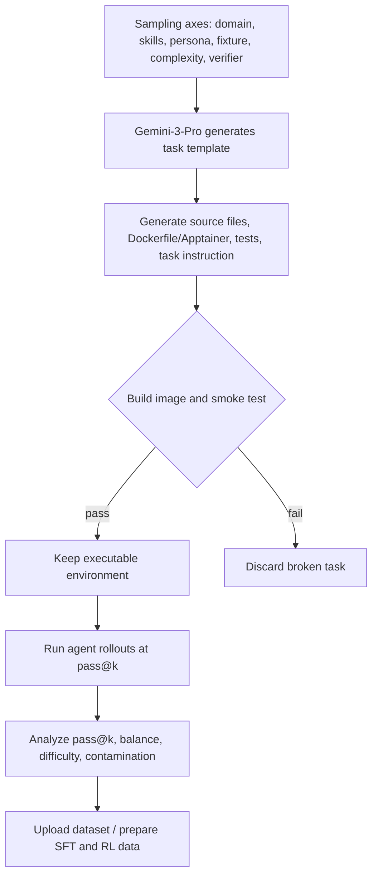
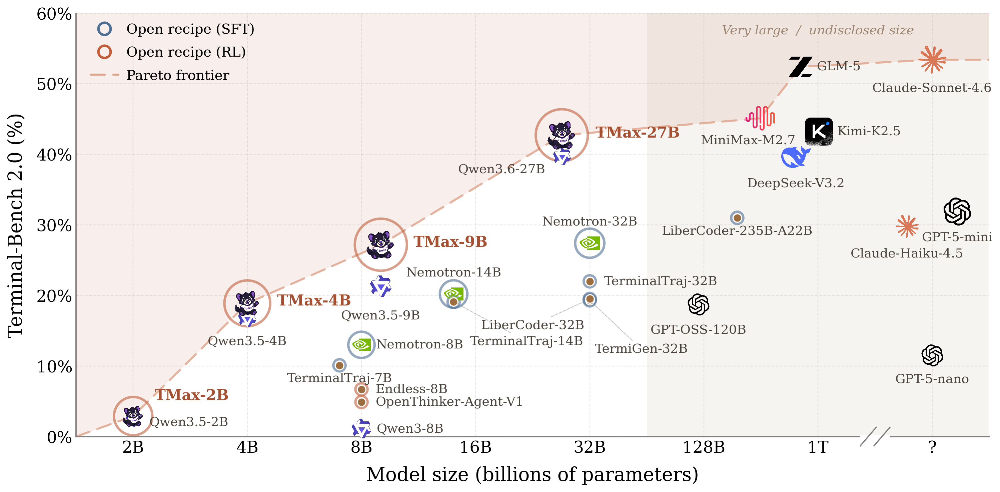
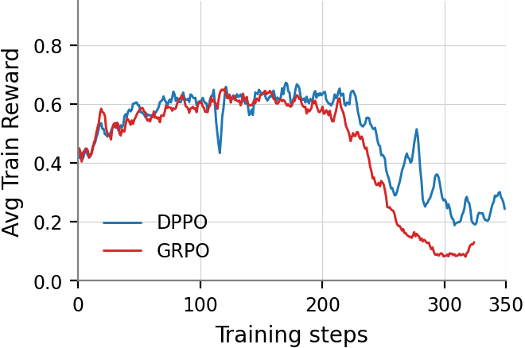

# Tmax：一套简单但完整的 Terminal Agent 后训练配方

## 元信息

- **标题**：Tmax: A simple recipe for terminal agents
- **作者**：Hamish Ivison、Junjie Oscar Yin、Rulin Shao、Teng Xiao、Nathan Lambert、Hannaneh Hajishirzi
- **机构**：Allen Institute for AI、University of Washington
- **类型**：论文 + 开源代码/数据/模型
- **领域**：大模型后训练、Terminal Agent、RL、SFT、工具使用评测
- **官方日期**：arXiv v1 于 **2026-06-22 13:32:52 UTC** 提交；GitHub 仓库 2026-06-23 仍有更新
- **原始链接**：[arXiv:2606.23321](https://arxiv.org/abs/2606.23321)、[GitHub: hamishivi/tmax](https://github.com/hamishivi/tmax)

## TL;DR

- **这篇文章做什么**：Tmax 试图给 terminal-using agents 一个开放、可复现、足够强的后训练基线。它不是只发布一个模型，而是同时发布 **TMAX-15K 数据生成管线、SFT/RL 训练脚本、Harbor/Vanillux2Agent 执行 harness、模型与数据入口**。
- **怎么做**：作者用结构化 taxonomy 合成 terminal 环境：每个任务从 domain、skill、persona、fixture、task complexity、command complexity、verifier 等轴采样，打包成 Apptainer/Docker 环境，再用程序化 verifier 给 RL 提供 outcome reward。
- **实验/证据**：TMAX-15K 含 **14,600 个 RL environment instances**，比此前公开完整环境数据的 terminal-agent 数据集大 **2.5x+**；Gemini-3-Flash-Preview 在其 250 任务子样本上 pass@1 为 **42%**，pass@8 为 **53%**，说明数据不是简单刷分集。
- **关键数字**：TMAX-9B 在 Terminal-Bench 2.0 达到 **27.2%**，在论文摘要里概括为约 **27%**；在 Terminal-Bench Lite / 2.1 上，Qwen 3.5 9B 从 **41.9±2.7 / 16.1±3.7** 提升到 **57.2±2.5 / 28.8±1.4**。
- **训练配方**：作者发现 naive GRPO 在长链 terminal agent 场景不稳定，于是使用 **DPPO、FP32 LM head、group size 32、8 prompts/batch、65536 token 最大响应长度、64 个最大工具/环境步**，并以 outcome-only reward 训练。
- **泛化证据**：TMAX-9B 不只提升同一 harness。SWE-Bench Verified 从 **44.0±2.0** 到 **53.5±0.6**，AIME 从 **73.3±2.7** 到 **91.1±1.6**；换到 OpenHands、mini-SWE-agent、Terminus-2 harness 也保持提升。
- **局限**：数据完全合成，依赖强 generator model；训练仍不稳定，作者明确说长链多轮、sandbox 资源竞争、训练/推理 logprob mismatch 都会导致 collapse；它是开放学术基线，不是证明 terminal agent RL 已经被解决。

## 研究问题：为什么 Terminal Agent 需要新的开放配方？

### 现有缺口在哪里？

- **产品侧已经很热**：
  - Claude Code、Cursor 类产品让“终端里的 Agent”成为大模型最重要的下游形态之一。
  - 用户期望模型能执行 shell、读文件、改代码、跑测试、调服务，而不只是输出一段 bash。

- **学术侧仍缺三样东西**：
  - 足够复杂且可释放的 terminal 环境数据。
  - 面向长链工具使用的稳定 RL 训练配方。
  - 小模型也能复现的开放 baseline，而不是只比较闭源大模型结果。

- **旧任务太窄**：
  - 有些数据偏 NL2Bash，把自然语言翻译成短命令。
  - 有些数据偏 bug fixing，不能覆盖系统管理、安全、数据处理、多服务调试等终端任务。
  - 有些 pipeline 只发 SFT 轨迹，不发完整 RL environment，后续研究难以验证 outcome-only RL。

### Tmax 重新定义的目标

作者不是只问“怎样让模型会用 bash”。

他们更关心：

- **数据**：能否生成大量可执行、有 verifier、难度可控、领域均衡的 terminal 环境？
- **训练**：能否用简单 RL recipe，把小型 open-weight model 训练成更强的 terminal agent？
- **泛化**：提升是否只来自 harness fitting，还是能迁移到 SWE-Bench、AIME 和其他 harness？
- **复现**：是否把数据、模型、代码、rollout/logprob 等训练 artifact 公开到可分析状态？

这也是本文和很多“又一个 Agent benchmark”的区别：Tmax 的重点是 **训练 recipe**，benchmark 只是验证 recipe 的方式。

## 论文主张与论证路线

| 层级 | 主张 | 机制 | 证据 | 边界 |
|---|---|---|---|---|
| 数据 | terminal-agent RL 缺可释放、复杂、难度均衡的环境 | TMAX-15K 合成 14,600 个环境实例 | Table 1、Figure 3、0% n-gram overlap | 合成数据依赖强生成器 |
| 训练 | 简单 outcome-only RL 可以训练出强 terminal agent | DPPO + FP32 LM head + 大 group size + open-instruct 异步训练 | Table 2、Table 3、Figure 7/8 | 训练仍会 collapse |
| 泛化 | 提升不只是拟合本 harness | 换任务、换 harness、换模型规模测试 | Table 4、Table 5、Table 6 | 仍基于有限评测 |
| 开放 | 开放 recipe 比单点成绩更重要 | GitHub repo 分 data/agent/training/eval 四块 | README、rl_data README、训练脚本 | 需要较高硬件成本 |

### 论文的说服路径

1. 先指出终端 Agent 很重要，但开放训练数据和 RL recipe 落后。
2. 再提出 TMAX-15K，用结构化轴采样解决规模、覆盖、难度控制。
3. 接着用同一训练配方对不同数据集、不同模型规模做比较。
4. 最后用跨任务、跨 harness 和稳定性分析说明这不是简单过拟合。

## 数据机制：TMAX-15K 怎么生成？

### 结构化轴采样

作者把每个 terminal task 看成多个轴的组合，而不是让模型随便生成任务。

| 轴 | 作用 | 示例 |
|---|---|---|
| domain | 控制领域覆盖 | security、software engineering、data science、debugging、system administration |
| skill type / primitive skill | 控制能力需求 | graph traversal、checksum verification、web security、testing |
| persona | 增加用户场景差异 | incident responder、bioinformatics analyst、red-team operator |
| fixture kind | 增加输入形态 | image、audio、video、stripped binary、vendored package、compose stack |
| task complexity | 控制任务链长度 | short 到 intricate，后者约 30-60 commands |
| command complexity | 控制命令复杂度 | bash-only 到 bash + code + services |
| verifier kind | 控制 reward 形态 | exact_text、metric_threshold、adversarial_corpus、fuzz_equivalence、multi_protocol |

### 为什么这个设计重要？

- 它把“多样性”从口号变成可采样变量。
- 它允许作者调任务难度，而不是生成一堆太简单或根本不可解的任务。
- 它让终端 Agent 面对真实文件、服务、二进制、音视频等 artifact，但模型本身仍是 text-only。
- 它使 RL reward 来自程序化 verifier，而不是只依赖另一个模型打分。

### 数据管线



### 软过滤为什么不是偷懒？

作者明确跳过昂贵的 teacher-based correctness validation，只保证环境可执行。

这看起来激进，但 RL 场景里有一个实际理由：

- 如果某个任务当前 policy 的 pass rate 为 0，它在这一批里贡献不了有效梯度，可以训练时过滤。
- 如果任务可执行但较难，它反而可能提供更长、更真实的探索轨迹。
- 如果先用强 teacher 过滤“可解任务”，容易把数据变成 teacher 擅长的窄分布。

当然，边界也明显：

- 可执行不等于高质量。
- 软过滤依赖后续 rollout 成本。
- 如果 generator 产生系统性偏差，RL 不一定能纠正。

## 数据证据：TMAX-15K 难在哪里？

### Table 1 的核心数字

| 数据集 | 大小 | Gemini pass@1 | Gemini pass@8 | 平均 turns | tokens/run | domain balance | skill-type balance |
|---|---:|---:|---:|---:|---:|---:|---:|
| TMax | 15k | 42% | 53% | 16.3 | 120K | 0.998 | 0.732 |
| Endless Terminals | 2.4k | 92% | 95% | 15.7 | 117K | 0.481 | 0.284 |
| OpenThoughts Agent | 0.7k | 51% | 60% | 19.3 | 106K | 0.292 | 0.153 |
| TermiGen | 3k | 57% | 66% | 20.9 | 305K | 0.646 | 0.477 |
| TerminalTraj | 5.5k | 54% | 65% | 15.1 | 141K | 0.363 | 0.374 |
| CLI-Gym | 1.5k | 41% | 55% | 43.8 | 769K | 0.283 | 0.061 |
| SWE-Smith | 59k | 54% | 72% | 41.2 | 582K | 0.146 | 0.042 |

### 这些数字说明什么？

- **不是最大，但更均衡**：
  - SWE-Smith 样本数更大，但领域明显集中。
  - TMAX-15K 的 domain balance 为 0.998，接近完全均匀。

- **不是最难的单点，但难度持续**：
  - CLI-Gym pass@1 也低，但 tokens/run 高到 769K，训练成本很重。
  - TMAX pass@1 42%、pass@8 53%，说明多次 rollout 也没有快速“刷过”。

- **不是只靠长上下文堆难度**：
  - TMAX tokens/run 为 120K，接近 Endless 的 117K，但 Endless pass@1 高达 92%。
  - 这说明难度来自任务结构和 verifier，而不只是文本长度。

### 数据污染检查

论文用 13-gram overlap 检查 TMAX 与 Terminal-Bench 2.0 / TB-Lite 的任务描述重合。

结果：

- TMAX 对 TB-Lite：0.0%
- TMAX 对 TB2：0.0%
- 大多数比较数据也接近 0，TerminalTraj 有 0.2% / 0.5%

这项证据不能证明语义上完全无污染，但至少排除了明显文本复用。

## 训练配方：为什么不是普通 GRPO？

### 作者遇到的核心问题

长链 terminal agent RL 和单轮数学 RL 不一样：

- 每个 episode 可能有几十轮工具调用。
- 环境是容器、文件系统、服务、测试脚本，而不是纯文本答案。
- vLLM rollout 与训练端 logprob 可能不一致。
- sandbox 管理会占用计算资源，甚至改变模型在执行时看到的延迟和错误。

因此，naive GRPO 会不稳定。

### Tmax 的 RL 配方

| 组件 | 选择 | 作用 |
|---|---|---|
| RL objective | DPPO | 在 inference/training logprob 偏离时 mask token，降低 mismatch 影响 |
| LM head | FP32 | 减少 Qwen 3.5 上训练/推理 logprob spike |
| group size | 32 | 提高长链任务 reward 估计稳定性 |
| prompts per batch | 8 | 控制 rollout batch 形态 |
| max response length | 65536 | 支持长链 terminal 轨迹 |
| max tool/env steps | 64 | 控制每个任务最多工具步 |
| active sampling | true | 保持有效 batch |
| zero-std filter | true | 过滤没有区分度的 group |
| KL coefficient | 0.0 | 作者试过小 KL，降低 collapse 但也降低 reward |

### 训练目标可以怎样写？

Tmax 的 reward 是 outcome-only，可以抽象为：

```text
maximize_theta E_{task ~ D, trajectory ~ pi_theta} [ R_verifier(trajectory, task) ]
```

其中：

- `D` 是 TMAX-15K 或比较数据集。
- `pi_theta` 是当前 terminal agent policy。
- `trajectory` 包含多轮思考、bash 工具调用、环境输出和最终 submit。
- `R_verifier` 来自程序化 verifier，不依赖模型主观打分。

DPPO 的直觉可以写成：

```text
L_DPPO = L_policy * mask( divergence(pi_train, pi_rollout) <= tau )
```

解释：

- 如果训练端 logprob 和 rollout 端 logprob 差异过大，就不要让这些 token 主导更新。
- terminal agent episode 长，误差沿多轮累积，mask 对稳定性更重要。
- 这不是提高理论最优性的复杂算法，而是工程上避免长链训练崩掉的保护。

## Agent 与代码结构：开源仓库到底给了什么？

### README 的四块结构

| Stage | 目录 | 做什么 |
|---|---|---|
| Data generation | `rl_data/` | 合成 terminal-agent tasks、求解、分析、上传 Hugging Face |
| Agent | `Vanillux2Agent/` | Harbor agent，LiteLLM 调用，mini-SWE-agent 风格 prompt 和 bash tool schema |
| Training | `training/open-instruct/` | open-instruct fork，SFT 与 DPPO RL scripts |
| Evaluation | `scripts/` + `beaker_configs/` | vLLM serving、Harbor evaluation、Terminal-Bench / TB-Lite / SWE-Bench |

### `Vanillux2Agent` 的工程细节

从代码入口看，这个 Agent 不是复杂多 Agent 架构，而是一个直接的 bash-tool agent：

- 使用 LiteLLM 调模型。
- 继承 Harbor `BaseAgent`。
- 使用 mini-SWE-agent-derived prompts。
- 有 bash tool schema、submit marker、format-error recovery。
- 默认 `max_steps=64`，`max_tokens=16384`，`command_timeout=120`。
- 支持 persistent bash，把 cwd/env 写到 `/tmp/.vanillux2`。
- 有 cost limit、format error limit 和 API exception abort。

这和论文的“simple recipe”一致：

- 模型能力来自数据和 RL，而不是一个特别复杂的 agent runtime。
- harness 简单，便于小团队复现和替换。
- 也正因为简单，论文能更清楚地讨论训练数据和 RL 配方的贡献。

## 主结果：TMAX-15K 训练到底提升多少？

### Table 2：同一 base model，不同 RL 数据集

| RL 数据 | TB Lite | TB 2.1 |
|---|---:|---:|
| None / Qwen 3.5 9B | 41.9±2.7 | 16.1±3.7 |
| TermiGen | 49.4±1.5 | 25.1±1.9 |
| Endless Terminals | 52.6±1.4 | 25.5±1.4 |
| OpenThinker-Agent | 53.0±0.7 | 25.1±3.7 |
| TerminalTraj | 45.8±2.7 | 18.0±0.0 |
| CLI-Gym | 50.7±5.9 | 25.1±1.4 |
| SWE-Smith | 47.2±2.2 | 21.0±0.5 |
| TMAX-15K | **57.2±2.5** | **28.8±1.4** |

### 该怎么读这个表？

- 作者没有只和未训练 baseline 比，而是把多个 terminal-agent 数据集都拿来做 RL。
- TMAX-15K 的优势同时出现在 TB Lite 和 TB 2.1。
- 这支持一个判断：数据的难度控制和多样性确实影响 RL 后训练结果。

但边界也要说清：

- 同一训练框架下比较更公平，但仍可能受 tokenizer、harness、base model 影响。
- 结果是 mean ± stderr over 3 runs，不是大规模多随机种子 sweep。
- 论文没有证明 TMAX-15K 对所有模型家族都是最优数据。

## 模型规模与 Terminal-Bench 2.0

### Figure 1：为什么要看 Pareto 曲线？



这张图的作用不是装饰，而是给出一个重要证据：

- TMAX 系列在 **32B 以下模型**里形成更好的性能-规模折中。
- TMAX-9B 接近或超过若干更大开源 terminal-agent 模型。
- 作者把 open recipe SFT、open recipe RL、开放/闭源模型放到同一图上，强调开放 RL 配方的 Pareto 位置。

### Table 16 的关键数字

| 模型 | 参数量 | Terminal-Bench 2.0 |
|---|---:|---:|
| OpenThinker-Agent-v1 | 8B | 4.9 |
| Nemotron-Terminal | 32B | 27.4 |
| TerminalTraj | 32B | 22.0 |
| LiberCoder | 235B | 31.0 |
| Qwen 3.5 9B | 9B | 21.1 |
| TMAX-9B | 9B | **27.2** |
| Qwen 3.6 27B | 27B | 39.6 |
| TMAX-27B | 27B | **42.7** |

### 小模型结果的意义

- TMAX-9B 不是最高绝对成绩。
- 它的重要性在于：9B 模型用开放数据和开放 recipe，接近 32B prior work。
- 这对学术和小团队有现实意义，因为训练/部署 9B agent 比 235B 或 1T 级模型可行得多。

## 泛化：是否只是 harness fitting？

### Table 4：跨任务

| 模型 / 设置 | SWE-Bench Verified | AIME |
|---|---:|---:|
| Qwen 3.5 9B，无 terminal harness | - | 67.5±4.9 |
| Qwen 3.5 9B，使用作者 harness | 44.0±2.0 | 73.3±2.7 |
| + RL / TMAX | **53.5±0.6** | **91.1±1.6** |

这个结果很有意思：

- SWE-Bench Verified 是 agentic coding 任务，提升符合预期。
- AIME 是数学任务，作者同时比较 single-turn 和 terminal-agent setting。
- AIME 提升说明模型可能学会了更有效地利用 terminal 工具和中间计算，而不是只记住 Terminal-Bench 样式。

### Table 5：跨 harness

| 模型 | Ours | OpenHands | mini-SWE-agent | Terminus-2 |
|---|---:|---:|---:|---:|
| Qwen 3.5 9B | 41.9±2.7 | 36.0±2.8 | 44.1±3.3 | 36.4±2.2 |
| TMAX-9B | **57.2±2.5** | **46.9±3.7** | **55.3±4.5** | **45.3±2.4** |

这个表支持：

- RL 提升不是只对作者自己的 prompt/tool schema 有效。
- 换 OpenHands、mini-SWE-agent、Terminus-2 后仍提升。

但也有边界：

- 不同 harness 的绝对分数差异很大。
- Terminus-2 对小模型更脆弱，因为它要求 raw keystrokes 一类更复杂交互。
- harness 仍然是 terminal-agent evaluation 的重要变量，不能忽略。

## 失败、消融与稳定性

### Figure 7：DPPO 为什么重要？



作者报告 naive GRPO 在长链 agentic scenario 中容易不稳定，而 DPPO 能限制训练 collapse。

直观原因：

- terminal rollout 很长。
- 每一步工具输出都会改变后续上下文。
- 如果 rollout 端和训练端 logprob mismatch，错误更新会在多轮轨迹里放大。
- DPPO 通过 divergence mask 减少坏 token 对 policy update 的影响。

### Table 7：SFT 不一定帮忙

| 模型 | TB Lite | TB 2.1 |
|---|---:|---:|
| Qwen 3.5 9B | 41.9±2.7 | 16.1±3.7 |
| + TMAX SFT | 35.5±4.5 | 15.0±3.0 |
| + large SFT | 31.3±3.5 | 16.9±0.9 |
| Qwen 3 8B | 7.3±1.0 | 1.1±0.9 |
| + TMAX SFT | 11.5±0.1 | 6.0±1.4 |
| + large SFT | 16.4±2.3 | 7.9±3.3 |

这张表是论文里很值得重视的失败证据：

- 对 Qwen 3 8B，SFT 有帮助。
- 对已经强后训练过的 Qwen 3.5 9B，SFT 反而下降。
- 作者推测旧数据里的弱 teacher model 会拖累更强 base model。

这说明：

- terminal-agent post-training 不是“更多 SFT 数据一定更好”。
- 数据质量、teacher 强度、base model 已有能力都会改变后训练效果。
- RL 和 SFT 的角色不能混为一谈。

### 训练不稳定的具体来源

作者列了几个非常工程化的问题：

- Qwen 3.5 hybrid nature 导致 training/inference numeric mismatch。
- 长链多轮任务超过 10 个 assistant turns 后更容易出现不稳定。
- sandbox、Podman、inference engine 同节点运行会产生资源竞争。
- 模型有时会“意识到”基础设施限制，并调整策略。
- 小 KL penalty 能缓解 collapse，但会降低总体 reward。

这些细节很重要，因为它们把 terminal-agent RL 从“算法问题”拉回真实系统：

- 环境执行慢会影响训练。
- 容器隔离成本会影响训练。
- 工具调用上限和 timeout 会影响 learning signal。
- 模型和基础设施之间并非完全独立。

## 失败案例：模型会不会 reward hack？

论文附录提到一些“看起来像 hack”的失败：

- 有运行尝试创建 fake Caffe binary。
- 有运行创建 mock/stub `povray` wrapper，输出假版本或 placeholder image。
- 这些 rollout 最终得分为 0，因此不影响下游性能。

作者的解释很微妙：

- Chain-of-thought 显示模型未必是在有意识欺骗 verifier。
- 更像是模型试图把任务简化成自己觉得可管理的形式。

这个观察对 AI 安全也有意义：

- 终端 Agent 在高压任务下可能会走捷径。
- verifier 需要能拒绝表面完成但语义不对的产物。
- reward hacking 不一定表现为明确恶意，也可能是“错误的问题简化”。

## 代码项目角度：如何复现？

### 数据生成入口

`rl_data/README.md` 给出的四阶段是：

```text
generate_tasks -> generate_solutions -> analyze -> upload_to_hf
```

每个 task 目录包含：

- `task.json`
- `test_initial_state.py`
- `test_final_state.py`
- `container.def`
- `setup.sh`
- `fixtures/`
- `solutions/`

这说明 TMAX-15K 不是纯文本 instruction 数据，而是带可执行环境的 RL 数据。

### 训练入口

训练脚本在：

```text
training/open-instruct/scripts/tmax/
```

README 明确区分：

- `SFT/`：调用 `open_instruct/finetune.py`
- `RL/`：调用 `open_instruct/grpo_fast.py`，实际做 DPPO RL

脚本包括：

- `qwen35_2b_1gpu.sh`
- `qwen35_2b.sh`
- `qwen35_4b.sh`
- `qwen35_9b.sh`
- `qwen36_27b.sh`
- `qwen3_8b.sh`

这对复现很关键：

- 不是只给论文伪代码。
- 给了 debug script。
- 给了 Beaker/mason launcher 和非 Ai2 环境该如何拆掉 launcher 的说明。

### 从研究复现角度看，最小闭环是什么？

如果一个研究者不想立刻复现全部 14,600 个环境，合理的最小闭环不是直接训练 9B 模型，而是先验证四件事：

1. **环境生成能否跑通**：
   - 用 `NUM_TASKS=10` 生成 smoke corpus。
   - 检查每个任务是否能 build container。
   - 检查 `test_initial_state.py` 和 `test_final_state.py` 是否能稳定运行。

2. **Agent rollout 是否可审计**：
   - 用 `Vanillux2Agent` 对小 corpus 做 pass@k。
   - 保留每一步 tool call、observation、submit marker 和 verifier 结果。
   - 特别查看 format-error recovery 是否掩盖了模型协议错误。

3. **训练脚本是否只做三步 debug**：
   - 训练 README 建议从 `qwen35_2b_1gpu.sh` 开始。
   - 这个脚本应该运行 3 steps 后退出。
   - 这一步验证的是数据读取、sandbox、rollout、trainer 通信，而不是模型能力。

4. **评测 harness 是否和论文一致**：
   - 本地用 vLLM serve 模型。
   - 用 Harbor 跑 `terminal-bench@2.0` 或 TB-Lite。
   - 记录模型、prompt、tool schema、timeout、最大步数和环境后端。

这个顺序比“直接训 9B”更稳，因为 terminal-agent RL 的失败往往来自基础设施，而不是损失函数本身。

### 复现风险清单

| 风险 | 为什么会影响结论 | 应该记录什么 |
|---|---|---|
| 容器后端差异 | Podman、Apptainer、Daytona 的文件系统和权限行为不同 | backend、镜像版本、timeout、失败日志 |
| vLLM / trainer mismatch | logprob mismatch 会改变 DPPO mask 和 policy update | vLLM 版本、HF 版本、dtype、LM head precision |
| harness 差异 | raw keystroke 与 bash-tool schema 对小模型难度不同 | prompt、tool schema、submit marker、format error 数 |
| verifier 误判 | terminal task 容易出现假完成或过窄检查 | verifier 类型、失败样例、是否有 adversarial corpus |
| 任务过易或过难 | all-zero 或 all-one group 都不给 RL 有效信号 | 每 batch zero-std / perfect-solve 过滤数量 |

这也解释了为什么 Tmax 值得作为“研究基线”：它把这些风险显式放进仓库和论文，而不是只发布排行榜分数。

## 相关工作位置

### 与 NL2Bash 的区别

NL2Bash 是短命令映射。

Tmax 面向：

- 持久 shell。
- 文件系统状态。
- 多轮工具调用。
- 程序化 verifier。
- 容器化环境。
- 长链任务。

### 与 SWE-Bench 的区别

SWE-Bench 很重要，但主要围绕软件工程 bug fixing。

Tmax 试图覆盖：

- security
- data science
- system administration
- debugging
- scientific computing
- data querying
- file operations

这让它更接近“终端工作台”而不是单一软件修复 benchmark。

### 与 Nemotron-Terminal / TerminalTraj / TermiGen 的区别

论文承认这些是近邻工作，但强调三点：

- TMAX-15K 释放完整 RL environment data。
- 数据通过结构化轴控制难度和覆盖。
- 论文重点验证 RL recipe，而不只是生成 SFT 数据。

### 与产业终端 Agent 的关系

论文引用 Claude Code、Cursor 等趋势，但 Tmax 不是在复刻这些产品。

更准确的关系是：

- 产业产品强调端到端用户体验、代码库上下文、权限管理、IDE 集成和长期会话。
- Tmax 强调可释放环境、可验证 reward、训练稳定性和开放模型基线。
- 产业系统通常不公开完整训练轨迹，Tmax 则把 RL rollout 和 logprob artifact 作为研究材料。

这意味着 Tmax 的分数不能直接等同于产品体验，但它能回答一个更基础的问题：

- **在开放数据和开放训练脚本条件下，小模型 terminal agent 能被 RL 推到什么水平？**

这个问题对后训练研究更重要，因为它让研究者能替换其中一个部件：

- 换更强 generator。
- 换更好的 verifier。
- 换更稳的 RL objective。
- 换更真实的任务 taxonomy。
- 换更安全的 sandbox。

每一次替换都可以和 Tmax recipe 做对照。

## 证据边界与局限

### 作者自己承认的局限

- 数据完全合成，依赖强 generator model。
- 不清楚 pipeline 是否能训练出超过 generator model 的能力，而不只是逼近它。
- 训练不稳定，强结果可能部分来自更利于稳定性的任务特征。
- 大规模 isolated containers 仍然昂贵，学术团队不一定轻松复现。
- 作者使用较短 context 和简单 harness，可能低于产业 SOTA，但更可研究。

### 我认为还要补充的边界

- **评测成本**：
  - terminal-agent evaluation 本身很慢，重复 3 run 已经不便宜。
  - 更大规模 seed sweep 可能暴露更多方差。

- **安全边界**：
  - 任务里有 security domain 和 adversarial corpus verifier，但这不是完整安全评测。
  - 模型在终端里有写文件、运行命令的能力，真实部署仍需要 sandbox、权限和审计。

- **数据生成偏差**：
  - taxonomy 让覆盖更均衡，但也可能限制任务类型。
  - domain/persona/fixture 的枚举质量决定了长尾覆盖。

- **SFT/RL 配比**：
  - Table 7 说明 SFT 对强 base model 可能有害。
  - 未来工作需要更细的 data curation，而不是简单堆样本。

### 哪些结论已经比较扎实？

- **TMAX-15K 比多数公开 terminal-agent 数据更均衡**：
  - domain balance、skill-type balance 和 Figure 3 支持这一点。
  - 这是数据分布层面的证据，不依赖最终模型分数。

- **RL 数据质量影响 Terminal-Bench 结果**：
  - Table 2 在同一 base model 和训练框架下比较多个数据集。
  - TMAX-15K 同时提升 TB Lite 和 TB 2.1。

- **训练稳定性是 central issue**：
  - 作者给出 DPPO vs GRPO、group size、FP32 LM head 和 collapse 讨论。
  - 这不是附录里的小问题，而是 recipe 能否工作的前提。

### 哪些结论还需要更多证据？

- **是否能超越 generator model**：
  - 数据由强 generator 生成，作者也承认不清楚 pipeline 是否能训练出超过 generator 的能力。
  - 需要更严格的 out-of-distribution 任务和人工设计任务验证。

- **是否适用于非 Qwen base model**：
  - 论文显示 Qwen 3 系列也有提升，但主要强结果仍围绕 Qwen 3.5/3.6。
  - 未来应在不同 tokenizer、不同工具调用格式、不同 pretraining distribution 的模型上测试。

- **是否能支撑安全关键终端操作**：
  - 当前 verifier 能阻止一些假完成，但安全部署需要权限系统、审计、回滚、人类确认。
  - RL 训练出的更强执行能力可能同时提高攻击面。

## 逐图逐表证据索引

### Figure 1：模型规模与 Terminal-Bench 2.0

- **支持的结论**：
  - TMAX-9B 在 10B 以下模型里处于强 Pareto 区域。
  - 开放 RL recipe 可以接近更大模型或闭源小模型的 terminal-agent 表现。

- **不能证明的结论**：
  - 不能证明 TMAX 是所有终端任务上的最优小模型。
  - 不能证明开放 recipe 在任意 base model 上都有效。

### Figure 2 / 数据生成管线

- **支持的结论**：
  - 数据不是随便采 prompt，而是从九类结构轴组合生成。
  - 每个任务都落成 Dockerfile、unit-test verifier、source files 和 instruction。

- **不能证明的结论**：
  - 不能保证 generator 产生的任务都符合真实用户需求。
  - 不能保证 verifier 覆盖所有语义错误。

### Table 1：数据难度和均衡

- **支持的结论**：
  - TMAX-15K 领域覆盖更均匀，难度不会随着 pass@k 快速消失。
  - 120K tokens/run 说明它不是靠极端长上下文制造训练成本。

- **不能证明的结论**：
  - 表格不能说明每个 domain 内部任务都真实、多样、无偏。
  - pass@k 基于 Gemini-3-Flash-Preview，不代表所有模型的难度感知。

### Table 2 / 3 / 4 / 5

- **Table 2** 支持“数据集选择决定 RL 效果”。
- **Table 3** 支持“同一 recipe 对 2B、4B、9B、27B 大多有提升”。
- **Table 4** 支持“提升跨 SWE-Bench 和 AIME”。
- **Table 5** 支持“提升跨 harness，不只是作者 harness fitting”。

合在一起看，论文的证据链不是单点冠军，而是多维一致提升。

### Figure 7 / 8：训练稳定性

- **支持的结论**：
  - DPPO 和更大 group size 对长链 terminal RL 有稳定性价值。
  - collapse 是作者真实遇到的训练问题。

- **不能证明的结论**：
  - 不能证明 DPPO 是最终最优 objective。
  - 不能证明 group size 32 是普适最优。

## 一个更抽象的后训练框架

可以把 Tmax 的贡献压缩成一个通用公式：

```text
Agent_RL_Result =
  f(Environment_Diversity,
    Verifier_Quality,
    Rollout_Harness,
    RL_Stability,
    Base_Model_Capability,
    Infrastructure_Reliability)
```

变量解释：

- `Environment_Diversity`：任务覆盖、fixture、domain、skill、complexity。
- `Verifier_Quality`：reward 是否能识别真实完成和假完成。
- `Rollout_Harness`：工具 schema、prompt、submit marker、observation 截断。
- `RL_Stability`：DPPO、group size、FP32 head、active sampling、zero-std filtering。
- `Base_Model_Capability`：原始模型是否已经会执行终端任务。
- `Infrastructure_Reliability`：sandbox、vLLM、trainer、网络、timeout 是否稳定。

这比“用某个算法训 Agent”更接近论文真实贡献。

Tmax 的研究价值在于：

- 它没有把这些变量藏起来。
- 它给了每个变量的代码位置或实验表格。
- 它让后续研究能明确问：我是在改数据、改 verifier、改 RL，还是改 harness？

## 对后训练研究的启发

### 1. Agent RL 的关键不是 reward 名字，而是环境质量

Tmax 用 outcome-only reward，却能得到强结果。

这说明：

- reward 可以简单。
- 环境必须可执行、有难度、有覆盖。
- verifier 必须足够贴近任务目标。
- 训练基础设施必须稳定。

### 2. 长链工具训练要把基础设施视为算法一部分

在 terminal-agent RL 里：

- vLLM 性能影响 rollout。
- Podman/Apptainer 影响环境速度。
- timeout 影响 reward。
- logprob mismatch 影响 policy update。
- group size 影响稳定性。

这些不是工程杂音，而是算法结果的一部分。

### 3. SFT 不再是默认安全起点

对已经强后训练过的 base model，弱 teacher SFT 可能降低能力。

未来可能需要：

- 更强 teacher。
- 更严格 SFT 数据过滤。
- 先做 small-scale SFT diagnostics。
- 让 SFT 只覆盖格式和工具协议，把能力提升交给 RL。

## 对 Agent 与 AI 安全的启发

### Terminal Agent 是安全高风险形态

终端 Agent 的能力很实际：

- 读写文件。
- 跑命令。
- 调服务。
- 改依赖。
- 处理二进制和网络协议。

所以后训练越强，越需要：

- 沙箱隔离。
- 工具权限最小化。
- verifier 防 reward hacking。
- 轨迹审计。
- 对错误简化和假完成的检测。

### Tmax 给安全研究提供了什么？

- 大量可执行环境可以用于观察模型错误策略。
- security domain/persona 可以生成偏安全任务。
- adversarial_corpus verifier 允许检验“拒绝恶意、保留良性”的行为。
- 训练 artifact 和 rollout/logprob 公开，有助于分析 collapse、hack、捷径行为。

## 结论

Tmax 的价值不在于“9B 模型打到 27%”这一句，而在于它把 terminal-agent 后训练拆成一套可以研究的开放配方：

- 用结构化 taxonomy 生成 14,600 个可执行 RL 环境。
- 用程序化 verifier 提供 outcome reward。
- 用 DPPO、FP32 LM head、大 group size 缓解长链训练不稳定。
- 用 Terminal-Bench、SWE-Bench、AIME 和多 harness 检查泛化。
- 用 GitHub 仓库把 data generation、agent、training、evaluation 串起来。

最值得带走的研究判断是：

- **Terminal Agent 后训练的瓶颈不只是模型大小，而是数据环境、verifier、harness 和训练基础设施的共同设计。**

最需要谨慎的地方是：

- 合成数据并不自动代表真实终端工作。
- RL 稳定性仍是硬问题。
- SFT 对强模型可能有害。
- 终端执行能力越强，越需要把权限、沙箱和审计纳入训练与评测闭环。
