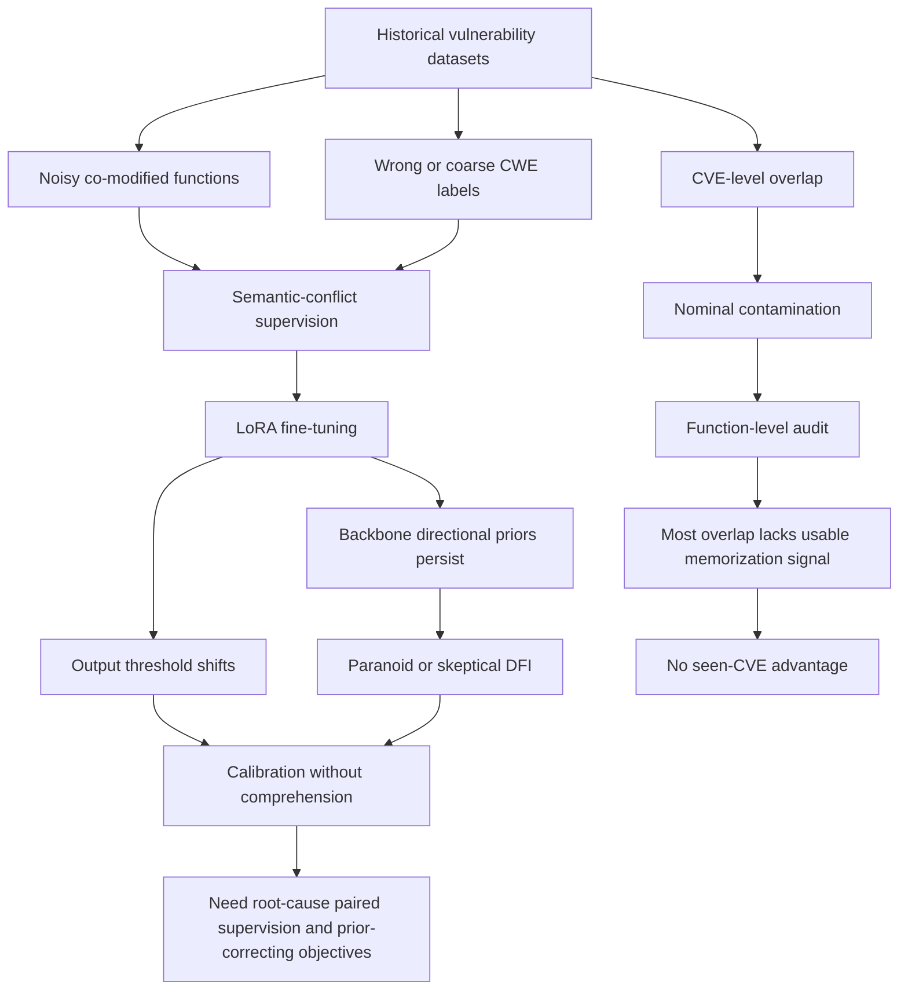

# Calibration Without Comprehension：微调为什么没有教会模型理解系统软件漏洞？

| 项目 | 内容 |
| --- | --- |
| 论文 | [Calibration Without Comprehension: Diagnosing the Limits of Fine-Tuning LLMs for Vulnerability Detection in Systems Software](https://arxiv.org/abs/2606.20502) |
| 作者 | Arastoo Zibaeirad, Marco Vieira |
| 版本 | arXiv:2606.20502v1，2026-06-18 提交 |
| 方向 | AI for Security / LLM 漏洞检测 / 后训练评测 |
| 本轮选择 | Scout 表中 ToolPrivBench、NRT-Bench、VIMPO、THUDM/slime、Defensive Misdirection 已在 data 历史命中；本篇未命中 `2606.20502`、标题或 canonical URL，且有完整 PDF/HTML 与清晰实验表格。 |

## TL;DR

- **这篇论文做什么**：作者提出 CWE-Trace，用 834 个手工审查的 Linux kernel 漏洞/补丁样本、417 个 CVE、74 个 CWE，测试 LLM 是否真的能做系统软件漏洞检测，而不是在有污染的数据集上对标签分布做拟合。
- **它怎么做**：CWE-Trace 把样本分成历史集 PBD（2024 及以前）和泄漏无关集 LFD（2025），保留 vulnerable-patched 成对代码和跨文件上下文；评测 8 个原始 LLM 与 15 个 LoRA 微调变体，任务覆盖非定向检测、带 CWE hint 的定向检测、CWE-1000 层级分类。
- **关键证据**：最佳二分类检测 Overall 只有 **52.1%**，只比随机高 **2.1 个百分点**；精确 CWE Top-1 低于 **1.3%**；DFI 显示模型不是“接近随机但平衡”，而是有强烈方向性偏置，范围从 **-85.5pp** 到 **+94.8pp**。
- **污染结论**：CVE 级重叠不是可用记忆信号。作者核查 PrimeVul、MegaVul、LineVul 中的重叠样本后发现，约 **31.3%** 带错误 CWE 标签，结合函数缺失和跨数据集映射，约 **84%** 的名义污染样本没有可用记忆价值。
- **微调结论**：LoRA 微调主要改变输出阈值和覆盖率，不稳定地改变真正的安全推理。Qwen3-4B 的提升多来自少弃答；DeepSeek-R1 在检测上变差，却在粗粒度 CWE root 分类上提升，说明“检测”和“理解”是解耦能力。
- **局限**：实验集中在 Linux kernel/C、zero-shot 提示、LoRA 监督微调和 5 个常用漏洞数据集；不能推出所有语言、所有 prompt 工程、DPO/对比学习或 agentic 工具流都会失败。
- **最重要的带走点**：如果漏洞检测数据没有对齐到 root-cause function 和成对补丁上下文，微调很容易学到“更敢判安全/更敢判危险”的校准策略，而不是学会漏洞因果结构。

## 研究问题：为什么“微调后分数变高”仍然可能不代表安全理解？

### 作者真正反驳的是什么？

- 漏洞检测领域常见的乐观叙事是：
  - LLM 在代码任务上越来越强；
  - 用漏洞数据集做 SFT 或 LoRA 后，benchmark 分数会提升；
  - 因此模型应当获得了某种可迁移的安全推理能力。

- 论文认为这个推理链有三个缺口：
  - **数据污染缺口**：历史 CVE 可能出现在预训练或微调数据中，模型也许只是记住了样本。
  - **上下文缺口**：真实 Linux kernel 漏洞常依赖宏、结构体、跨文件状态和补丁上下文，孤立函数片段会把问题改写成更简单的任务。
  - **指标缺口**：只看二分类准确率会遮住方向性偏置；只看 exact CWE 会把“同一大类但错分支”和“完全无关”混成同一种错误。

### 论文如何重新定义问题？

作者没有问“LLM 能不能在某个漏洞 benchmark 上超过旧模型”，而是问：

- **在尽量减少污染和标签错位后，LLM 是否还能稳定识别真实系统软件漏洞？**
- **微调改变的是漏洞语义理解，还是输出分布的阈值？**
- **模型错的时候，是不知道、总说有漏洞、总说没漏洞，还是能到达正确 CWE 层级但错在兄弟分支？**

这个问题设定很重要，因为安全场景里错误成本不对称：

| 失败类型 | 表面分数可能怎样 | 实际安全含义 |
| --- | --- | --- |
| 总说 vulnerable | 召回高、误报高 | 安全团队被告警淹没，模型不适合 triage |
| 总说 safe | 准确率在安全样本多时看似不错 | 漏洞被漏掉，风险更隐蔽 |
| 会猜大类但不会定位 CWE | root accuracy 可能可看 | 不能支持修复、复现和责任边界判断 |
| 污染样本上表现好 | benchmark 提升 | 不一定能处理未来漏洞 |

## 论文主张与论证路线

| Claim | Mechanism | Evidence | Boundary |
| --- | --- | --- | --- |
| 现有 LLM 漏洞检测接近随机 | 用 context-aware vulnerable-patched pair 测试 8 个原始模型 | 最佳 Overall 为 CodeLlama 的 52.1%，多数模型在 49%-53% 附近 | 这是 zero-shot 设置，不排除更强提示或工具流改善 |
| 近随机不是“均衡不确定” | DFI 拆分 vulnerable 和 safe 两侧准确率 | GPT-4.1-mini 为 skeptical，PBD DFI -85.5pp；DeepSeek-R1 为 paranoid，PBD DFI +94.8pp | DFI 是行为指标，不直接解释内部表征 |
| 微调主要改变校准阈值 | 15 个 LoRA 变体在 PBD/LFD、covered/uncovered CWE、seen/clean CVE 上对比 | Qwen3-4B 提升多来自 coverage 上升；Llama3.1 和 DeepSeek-R1 常退化 | 只覆盖 LoRA 和 5 个主流漏洞数据集 |
| CVE 级污染没有带来可测优势 | 对重叠 CVE 做函数级和标签级审计 | 281 个污染样本中 88 个 CWE 错标，LineVul 8 个污染 CVE 的 vulnerable function 都在 held-out | 不等于污染永远无害，只说明 CVE-overlap 太粗 |
| CWE 理解仍很浅 | 用 Top-k、MRR、HDD 看层级错误 | LFD 上 exact Top-1 很低，lateral error 均值 86.5% | LFD 只有 19 个 CWE，类别空间比 PBD 小 |

## 方法机制：CWE-Trace 如何避免把问题测歪？

### 数据集构造

CWE-Trace 的核心不是“更多样本”，而是让样本单位更接近真实漏洞因果：

- 从 Linux kernel CVE 修复提交中抽取 vulnerable 和 patched 代码。
- 保留 L1 和 L2 两种上下文：
  - **L1**：单文件、单函数。
  - **L2**：多函数或多文件，包含宏、结构体、全局变量等非函数元素。
- 对修复提交做手工审查：
  - 去掉文档、测试、格式化等非安全变更；
  - 去掉上下文无法恢复的硬件相关或条件编译路径；
  - 去掉 singleton CWE，因为无法支持稳定的类内分类评估。

| 数据集 | 样本数 | CWE 数 | 平均文件/函数 | vulnerable/patched 平均行数 |
| --- | ---: | ---: | ---: | ---: |
| PBD（历史，2024 及以前） | 628 | 74 | 1.5 / 2.0 | 109.4 / 114.1 |
| LFD（泄漏无关，2025） | 206 | 19 | 1.1 / 1.3 | 60.9 / 63.6 |

### 为什么 CVE-2024-41010 是关键例子？

论文用 Figure 1 说明一个常见陷阱：

- 如果只看 `sch_ingress.c` 的局部函数，Use-After-Free 不明显。
- 需要同时查看 `tcx.h` 里的类型定义和布尔 flag，才知道生命周期条件如何改变。
- 这说明“函数片段 benchmark”可能没有测漏洞理解，而是在测模型是否能从局部模式猜标签。

### 三个任务如何拆开能力？

| 任务 | 输入 | 输出 | 它测什么 |
| --- | --- | --- | --- |
| Task 1：非定向检测 | 代码块，不给 CWE hint | vulnerable / safe / abstain | 模型是否能主动发现漏洞 |
| Task 2：定向检测 | 代码块 + 目标 CWE hint | 是否存在该 CWE | 模型能否验证一个具体安全假设 |
| Task 3：CWE 分类 | vulnerable 代码 | ranked CWE list | 模型能否定位根因类别，而非只报“有问题” |

这种设计把两个容易混淆的能力分开：

- **检测能力**：判断代码是否有漏洞。
- **理解能力**：说出漏洞属于哪个 CWE root、class、base 或 variant。

## 公式与指标：DFI 和 HDD 为什么比 accuracy 更有解释力？

### 检测指标

论文先用标准二分类量：

```text
Coverage = (N - A) / N

Acc_std = (TP + TN) / N
```

- `A` 是弃答数量。
- `Coverage` 说明模型是否愿意给出结论。
- `Acc_std` 把弃答当错，便于跨模型比较。

### DFI：把“近随机”拆成两种相反坏法

论文定义 Directional Failure Index：

```text
DFI = (VD + TVD) / 2 - (PV + TPV) / 2
```

变量解释：

- `VD`：vulnerable 样本上非定向检测正确率。
- `PV`：patched/safe 样本上非定向验证正确率。
- `TVD`：带 CWE hint 时 vulnerable 样本检测正确率。
- `TPV`：带 CWE hint 时 patched/safe 样本验证正确率。

解释规则：

- `DFI > 0`：paranoid，模型偏向报 vulnerable，误报高。
- `DFI < 0`：skeptical，模型偏向报 safe，漏报高。
- `DFI ≈ 0`：才可能是比较平衡的决策。

这就是论文题目中 “calibration without comprehension” 的关键证据：模型可以通过调阈值让平均准确率接近 50%，但 DFI 显示它没有学会使用代码证据。

### HDD：把 CWE 错误放回 taxonomy 里看

HDD 由两部分组成：

```text
Distance(p, g) = up(p, LCA) + down(LCA, g)

DirectionGap(p, g) = depth(p) - depth(g)
```

变量解释：

- `p` 是预测 CWE。
- `g` 是真实 CWE。
- `LCA` 是 CWE taxonomy 中 `p` 和 `g` 的最近公共祖先。
- `Distance` 衡量两者在 CWE 图上隔了多少边。
- `DirectionGap` 判断预测更浅、更深，还是同层侧向错误。

HDD 让错误分成五类：

| 类型 | 含义 | 安全 triage 价值 |
| --- | --- | --- |
| exact | 完全命中真实 CWE | 可直接支持修复定位 |
| shallow | 预测是祖先类 | 知道大方向，但缺根因 |
| deep | 预测是子类 | 可能过度具体化 |
| lateral | 同层或兄弟分支错误 | 看似专业，但根因错位 |
| invalid | 不能映射到 CWE | 不可操作 |

## 实验设置：模型、微调和污染控制

### 原始模型

论文评测 8 个 vanilla 模型：

| 类别 | 模型 |
| --- | --- |
| Code-specialized | CodeLlama 7B、StarCoder2 7B、Qwen3-Coder 30B |
| General | Mistral v0.3 7B、Llama3.1 8B、DeepSeek-R1 7B、Qwen3 4B、GPT-4.1-mini |

作者还固定开源模型的 Hugging Face commit SHA，以减少 post-release update 对污染分析的干扰。

### 微调设计

微调不是只跑一个模型，而是做了 3 x 5：

| Backbone | 微调数据集 |
| --- | --- |
| Qwen3-4B | Devign、LineVul、PrimeVul、MegaVul、VDISC |
| DeepSeek-R1-32B | Devign、LineVul、PrimeVul、MegaVul、VDISC |
| Llama3.1-8B | Devign、LineVul、PrimeVul、MegaVul、VDISC |

LoRA 配置：

- rank `r = 16`
- alpha `32`
- dropout `0`
- 学习率 `2e-4`
- cosine decay、5% warmup
- batch size `64`
- 对 attention 和 FFN projection 全部应用 LoRA

### 训练数据偏斜

漏洞数据集普遍 safe 样本占多数：

| 数据集 | 规模 | Vulnerable | Non-vulnerable | 训练任务 |
| --- | ---: | ---: | ---: | --- |
| Devign | 27k | 12.4k | 14.9k | B |
| LineVul | 189k | 10.9k | 177.7k | B+T+R |
| VDISC | 1.29m | 83k | 1.21m | B+T+R |
| PrimeVul | 235k | 7.0k | 228.8k | B+T+R |
| MegaVul | 339k | 17.4k | 322.2k | B+T+R |

这解释了为什么作者关注“输出阈值”：

- 如果 safe 样本远多于 vulnerable，模型很容易学到保守策略。
- 如果训练集的 co-modified context function 被误标，模型会学到冲突监督。
- 如果 CWE 标签是症状而非根因，定向检测会被错误 label 拉偏。

## 结果一：漏洞检测不是平衡随机，而是方向性崩塌

### 原始模型整体接近随机

Table VI 的核心结论：

| 模型 | PBD Avg | LFD Avg | Overall | DFI 特征 |
| --- | ---: | ---: | ---: | --- |
| CodeLlama | 50.2 | 53.9 | 52.1 | paranoid，PBD +67.8pp |
| Qwen3-Coder | 51.3 | 50.5 | 50.9 | paranoid，中等偏正 |
| GPT-4.1-mini | 49.6 | 51.5 | 50.6 | skeptical，PBD -85.5pp |
| DeepSeek-R1 | 50.0 | 49.8 | 49.9 | 极端 paranoid，PBD +94.8pp |
| Qwen3-4B | 14.3 | 9.5 | 11.9 | coverage 很低，近乎弃答 |

重点不是最高分只有 52.1%，而是这些 50% 附近的分数来自完全不同的失败模式。

### DFI 如何解释两个极端？

- **DeepSeek-R1**：
  - PBD 上 VD 96.1、PV 4.5、TVD 98.7、TPV 0.7。
  - 它几乎总把复杂 C 代码判成 vulnerable。
  - 因此看起来召回强，但 false positive 会淹没安全团队。

- **GPT-4.1-mini**：
  - PBD 上 VD 5.7、PV 93.6、TVD 8.0、TPV 91.1。
  - 它几乎总把代码判成 safe。
  - 因此看起来 patch verification 好，但漏掉真实漏洞。

- **Qwen3-4B**：
  - PBD coverage 只有 36.9%，Overall 11.9。
  - 它不是“判断错”，而是大量不输出可用判断。

### 上下文深度没有自动解决问题

Table VIII 把 L1 和 L2 分开：

| 组别 | Split | L1 Acc | L2 Acc | L2 - L1 |
| --- | --- | ---: | ---: | ---: |
| Vanilla | PBD | 44.0 | 46.2 | +2.3 |
| Vanilla | LFD | 46.2 | 44.1 | -2.1 |
| Fine-tuned | PBD | 41.7 | 43.3 | +1.6 |
| Fine-tuned | LFD | 42.0 | 41.2 | -0.8 |

这说明更长上下文不是自动答案：

- 上下文可以暴露漏洞条件。
- 但模型必须有能力使用这些条件。
- 如果主导因素是方向性先验，更多上下文只会被同一个偏置解释。

## 结果二：微调改变输出策略，不稳定地改变安全推理

### Qwen3-4B 的提升主要是少弃答

Qwen3-4B 原始 coverage 很低，微调后 coverage 提升到 90% 左右。

这带来表面提升：

- MegaVul-FT、PrimeVul-FT、LineVul-FT 等都让模型更愿意输出二分类。
- 但这种提升不等于学会 CWE 语义。
- Figure 3(a) 显示 covered CWE 和 uncovered CWE 上的提升差异很小，更像全局响应策略变化。

### Llama3.1 和 DeepSeek-R1 常被微调拉坏

| Backbone | 微调后的检测走势 | 论文解释 |
| --- | --- | --- |
| Llama3.1-8B | 多数中性或变差，Devign-FT 最差到 PBD Overall 1.3 | 二分类弱监督可能抹掉已有结构知识 |
| DeepSeek-R1-32B | LFD 上多为退化，最高退化约 29.1pp | paranoid 先验被放大或转成保守阈值 |
| Qwen3-4B | 大幅提升但主要来自 coverage | 从不回答变成回答，不等于真正理解 |

### 检测和理解是解耦的

论文最有意思的反转是：

- DeepSeek-R1 在 RQ1 检测任务中很难改善。
- 但在 RQ2 粗粒度 CWE root 分类中，DeepSeek-R1-32B 的微调变体提升最大。

作者的解释很直接：

- paranoid 模型几乎总说“有漏洞”。
- 只要它愿意给出某个 CWE，粗粒度 root coverage 就会上升。
- 这不代表它能区分 vulnerable 和 patched，也不代表能定位根因。

## 结果三：污染不是这组实验里的主因，但原因比“没有污染”更复杂

### CVE 级重叠为什么太粗？

很多污染讨论只问：

- 这个 CVE 是否出现在训练数据？
- 这个 commit 是否被某个数据集收录？

论文认为这不够，因为系统软件漏洞检测的单位是 root-cause function 和上下文。

如果训练数据里出现的是：

- 同一 CVE 的其他 co-modified safe function；
- 不同子系统里的同名 CVE 映射；
- 带错误 CWE 标签的样本；
- held-out split 里的 vulnerable function；

那模型就没有获得可用记忆信号。

### Table X 的标签审计

| 数据集 | 重叠样本 | CWE 正确 | CWE 错误 | 标签准确率 |
| --- | ---: | ---: | ---: | ---: |
| PrimeVul | 88 | 61 | 27 | 69.3% |
| MegaVul | 144 | 94 | 46 | 67.1% |
| LineVul | 49 | 38 | 11 | 77.6% |
| Combined | 281 | 193 | 84 | 68.7% |

含义：

- `84 / 281 = 31.3%` 的污染样本带错误 CWE 标签。
- LineVul 的 8 个 verified contaminated CVE 中，vulnerable function 都只在 held-out split，训练只看到 safe variants。
- 结合函数缺失、错标签和语义冲突，作者估算约 84% 的名义污染样本没有可用 memorization signal。

### 这不是在说污染无所谓

论文的边界很清楚：

- 它没有证明所有污染都不会影响 LLM 评测。
- 它证明的是：**CVE identifier overlap 不是足够细的污染代理变量**。
- 对 context-aware function-level evaluation，必须核查函数、标签、上下文三者是否真的重叠。

这对安全 benchmark 很关键，因为很多“污染检测”工具只做到 URL、CVE、commit 或题目级别。

## 结果四：CWE 分类能猜大类，但很难精确定位

### 粗粒度 root 分类比二分类更好

RQ2 显示：

- StarCoder2 在 LFD Root-Micro@1 达到 61.0%。
- Qwen3-4B 在 LFD 达到 59.2%。
- GPT-4.1-mini 的 LFD Macro@1 最好，为 23.8%。

但 Macro@1 明显更低，说明模型偏向常见 root family。

### exact CWE 仍然没有解决

RQ3 的核心发现：

- LFD 上最佳 vanilla Top-1 是 GPT-4.1-mini 的 14.71%。
- 最佳 MRR 是 27.55%。
- exact CWE ranking 仍然远低于可运营水平。
- 一些模型如 DeepSeek-R1 和 StarCoder2 的 Top-1 甚至为 0。

### lateral error 是最普遍的错法

Figure 5(c) 和 Table IX 显示：

- LFD 上 8 个 vanilla 模型的 lateral error 均值是 86.5%。
- 它们常到达正确层级深度，却落在错误兄弟分支。

| CWE | Exact | Hierarchical | Unrelated | Support |
| --- | ---: | ---: | ---: | ---: |
| CWE-416 | 5.6% | 88.1% | 6.3% | 805 |
| CWE-125 | 23.6% | 68.6% | 7.8% | 322 |
| CWE-476 | 7.6% | 85.2% | 7.2% | 290 |
| CWE-667 | 0.0% | 91.3% | 8.7% | 138 |
| CWE-787 | 2.9% | 89.9% | 7.2% | 138 |

这是一种特别危险的“半懂”：

- 预测看起来像安全术语。
- 层级深度也合理。
- 但根因分支错了，修复建议可能完全偏离。

## 伪代码：CWE-Trace 评测流程

```text
Input:
  CVE fix commits from Linux kernel
  CWE-1000 taxonomy graph
  vanilla LLMs M
  fine-tuned LLM variants F

State:
  PBD = historical samples up to 2024
  LFD = leakage-free samples from 2025
  paired_samples = vulnerable/patched context-aware code pairs

For each CVE fix commit:
  extract vulnerable pre-fix code
  extract patched post-fix code
  preserve interacting functions, macros, structs, globals
  if change is documentation/test/cosmetic:
    discard
  if context cannot expose the flaw:
    discard
  if CWE is singleton and cannot support class metrics:
    discard
  assign sample to PBD or LFD by CVE date

For each model in M + F:
  For each sample in PBD and LFD:
    run Task 1: non-targeted vulnerability detection
    run Task 2: targeted detection with CWE hint
    if sample is vulnerable:
      run Task 3: ranked CWE classification

  compute:
    standard accuracy and coverage
    DFI for directional failure
    CGR for CWE hint gain
    Top-k and MRR for ranking
    HDD distance and direction profile

Output:
  detection reliability
  contamination effect
  backbone prior signature
  fine-tuning transfer pattern
  CWE hierarchy error structure

Failure boundary:
  if a model improves only by reducing abstention or shifting thresholds,
  do not count it as security comprehension.
```

## Mermaid：论文的因果链条



## Figure/Table 逐项证据解读

### Figure 1：CVE-2024-41010 说明为什么孤立函数不够

- 作用：证明真实漏洞可能依赖跨文件类型和状态定义。
- 支撑的 claim：漏洞检测不能只拿短函数片段做 benchmark。
- 不能证明的东西：它只是一个例子，不能单独证明所有 L2 样本都更难。

### Figure 2：CWE-Trace pipeline

- 作用：把数据抽取、时间切分、任务设计和指标放在同一个框架里。
- 支撑的 claim：作者不是只新增数据集，而是在控制污染、上下文和错误类型。
- 不能证明的东西：pipeline 语言无关，但实验仍只在 Linux kernel/C 上跑。

### Table VI：检测分数和 DFI

- 作用：显示平均准确率附近的模型可能有相反偏置。
- 支撑的 claim：accuracy 不能区分 skeptical 和 paranoid。
- 关键数字：
  - CodeLlama Overall 52.1。
  - GPT-4.1-mini PBD DFI -85.5。
  - DeepSeek-R1 PBD DFI +94.8。

### Figure 3：微调、label-space 和污染的机制分析

- 作用：回答“微调是否在见过的 CWE 或见过的 CVE 上更有效”。
- 支撑的 claim：提升不随 label-space 覆盖或 seen-CVE 明显变化。
- 边界：图中是 delta 分析，不替代更细的因果干预实验。

### Figure 4：Root-Micro@1 的 backbone-dependent transfer

- 作用：显示 DeepSeek-R1-32B 在粗粒度 CWE root 分类上每个微调数据集都提升，而 Llama3.1-8B 每个都下降。
- 支撑的 claim：微调 recipe 不是通用答案，backbone 先验决定迁移方向。
- 边界：root-level 分类比 exact CWE 宽松，不能等同于修复级理解。

### Figure 5 / Table IX：HDD 和 lateral error

- 作用：说明模型错在正确深度的错误分支，而不是完全不知道 CWE。
- 支撑的 claim：MRR 和 HDD 弱耦合，层级距离是独立诊断维度。
- 边界：CWE taxonomy 本身也有版本和结构选择，HDD 不直接证明内部 reasoning。

### Table X：污染样本标签审计

- 作用：把“CVE 重叠”拆成是否函数级重叠、是否标签正确、是否存在语义冲突。
- 支撑的 claim：名义污染大多没有可用记忆信号。
- 关键数字：combined 281 个样本中 84 个 CWE 错误，准确率 68.7%。

## 相关工作位置：它和已有漏洞检测评测差在哪？

### 和传统漏洞数据集相比

| 传统数据集问题 | CWE-Trace 的处理 |
| --- | --- |
| 文件级标签把安全修复和无关改动混在一起 | 手工审查 root-cause code 和 patched pair |
| 函数片段丢掉宏、结构体、跨文件依赖 | 保留 L1/L2 context-aware blocks |
| 历史 CVE 容易污染 | PBD/LFD 时间切分，并做函数级污染审计 |
| 只看 binary accuracy | 加 DFI、HDD、MRR、Top-k、coverage |

### 和“LLM 不能可靠找漏洞”类工作相比

这篇论文更进一步的地方在于：

- 不只说模型分数低，而是解释低分背后的方向性先验。
- 不只说污染是威胁，而是证明 CVE-level overlap 为什么在这里没有转成可用记忆。
- 不只测原始模型，也系统跑了 15 个 LoRA 微调变体。
- 不只做 exact CWE 分类，还用 taxonomy distance 看“错得有多接近”。

## 结论与局限

### 论文最强结论

- 当前 LLM 在 Linux kernel 漏洞检测上没有表现出可靠的系统软件安全推理。
- 微调常常是在改变输出分布，而不是改变决策策略。
- benchmark 污染需要从 CVE 级进入函数级、标签级和上下文级核查。
- 漏洞检测模型评测必须报告方向性失败，否则 50% 左右的 accuracy 没有解释力。

### 主要局限

- **语言和代码域**：只测 Linux kernel/C；Java、Python、Rust 和用户态服务可能有不同难度。
- **提示设置**：主要是 zero-shot；few-shot、CoT、RAG、agentic workflow 未系统评测。
- **训练方法**：只覆盖 LoRA SFT；DPO、对比学习、RL、full fine-tuning 可能改变结论。
- **模型范围**：模型选择覆盖典型 code/general 模型，但不是所有商业模型和最新 checkpoint。
- **上下文环境**：没有重建完整 build environment，一些硬件路径和条件编译复杂样本被排除。

## 领域延伸：这对 AI 安全和后训练意味着什么？

### 1. 安全后训练要对齐“根因单位”，不是对齐“提交单位”

漏洞修复 commit 不是天然训练样本。

更合理的数据单位应当是：

- root-cause function；
- 触发漏洞所需的最小上下文；
- vulnerable-patched pair；
- 正确 CWE root 与 exact CWE；
- 可解释的修复前后差异。

如果训练样本仍是 co-modified function 或文件级标签，模型会学到“这个 commit 附近有风险”的弱关联，而不是学到漏洞因果。

### 2. DFI 应成为安全模型评测的默认指标

安全模型不是只要 accuracy 高就够。

至少要同时报告：

- vulnerable recall；
- safe verification；
- abstention coverage；
- DFI；
- hint gain；
- exact CWE 和 HDD。

否则一个模型可以靠“全报危险”获得召回，也可以靠“全报安全”在安全样本多的数据集上看起来不错。

### 3. 后训练目标应该直接惩罚方向性坍缩

论文没有实现 DPO 或对比学习，但它给了清晰目标：

- vulnerable 和 patched pair 必须成对出现。
- reward 不应只奖励 binary label。
- 应奖励模型引用具体代码证据。
- 应惩罚同一证据下的 paranoid/skeptical 固定输出。
- 应把 exact CWE、root CWE、HDD distance 纳入训练反馈。

一个可测试的训练目标可以是：

```text
Reward =
  + exact vulnerable/patched decision
  + correct root CWE
  + smaller HDD distance
  + evidence span grounded in code
  - large DFI over paired batches
  - unsupported CWE hallucination
```

### 4. Agentic 安全工具链要把模型输出当 triage 信号，而不是最终判断

如果模型有稳定方向性先验，那么把它接进漏洞扫描 Agent 时，需要额外约束：

- 对 paranoid 模型：
  - 强制生成 counter-evidence；
  - 要求验证 patched path；
  - 限制告警升级阈值。

- 对 skeptical 模型：
  - 强制枚举潜在内存生命周期；
  - 对跨文件状态做检索；
  - 对 high-risk CWE 降低漏报容忍度。

- 对所有模型：
  - 把 CWE 预测映射到 taxonomy；
  - 报告 HDD-style 近邻而非只报一个 CWE；
  - 让静态分析、符号执行或 fuzzing 参与复核。

## 还值得继续追问什么？

- 如果用 CWE-Trace 的 vulnerable-patched pair 做 DPO，DFI 能否显著收敛到 0？
- 如果把模型限制为必须引用宏、结构体或跨文件状态，lateral error 会不会下降？
- 如果引入 CodeQL/Semgrep/编译器错误/静态切片作为工具，Agent 是否能突破 zero-shot LLM 的方向性先验？
- 如果按 CWE root 分层采样训练，Macro@1 是否能提升，还是仍被常见类别支配？
- 如果迁移到 Rust 的 ownership/lifetime bug，paranoid/skeptical 先验是否相同？
- 如果模型先做 patch-diff verification，再做 vulnerable detection，能否减少“全报危险”的策略？

## 方法论补充：为什么这篇论文比一个负面 benchmark 更重要？

### 它把“模型不行”改写成“评测要能解释不行在哪里”

很多安全评测只给一个总分，然后把模型按 leaderboard 排序。

这篇论文的价值在于把失败拆成可诊断组件：

- `Coverage` 说明模型是否愿意承担判断。
- `DFI` 说明模型偏向漏报还是误报。
- `CGR` 说明 CWE hint 是否真的让模型利用了目标假设。
- `HDD` 说明模型错在 taxonomy 的哪个方向。
- seen-CVE / clean-CVE 对比说明污染是否真的转化为可用记忆。

这种拆法让后续研究能提出更具体的修复目标，而不是只说“换更大模型”。

### 它对 AI for Security 的提醒是：安全数据的标签单位必须可审计

安全数据集最容易出现一种结构性错觉：

- commit 是安全修复，所以 commit 里所有 touched function 都被当成 vulnerable；
- CVE 有一个 CWE 标签，所以所有相关函数都继承同一个 CWE；
- 模型微调后更常输出某类标签，于是 benchmark 分数看起来上升。

但真实漏洞往往只由其中一个 root-cause path 触发。

如果训练单位不对齐，模型学到的就是“这个补丁附近的代码有安全味道”，而不是：

- 哪个状态变量失效；
- 哪个生命周期被破坏；
- 哪个边界检查缺失；
- patched version 为什么关闭了攻击路径。

### 它给 Agent 安全评测一个可迁移模板

虽然本文不是 Agent 论文，但它的方法可以直接迁移到安全 Agent：

| CWE-Trace 组件 | Agent 安全中的对应问题 |
| --- | --- |
| vulnerable-patched pair | unsafe/safe tool trajectory pair |
| DFI | Agent 是否总升级权限或总拒绝操作 |
| HDD | Agent 错误是否落在同类权限/同类攻击路径 |
| seen-CVE audit | 任务轨迹是否只是训练数据复现 |
| LFD temporal split | 新漏洞、新工具、新 API 的未来泛化 |

这意味着安全 Agent 的 benchmark 不应只看是否完成任务，还要看失败方向。

例如一个代码修复 Agent：

- 总是拒绝修改，安全但无用；
- 总是大胆改动，完成率高但引入漏洞；
- 能指出大类风险，但无法定位触发点；
- 在旧 CVE 上表现好，但遇到新 API 就崩。

这些失败如果没有 DFI/HDD 一类指标，很容易被总分平均掉。

## 参考链接

- [arXiv abstract](https://arxiv.org/abs/2606.20502)
- [arXiv HTML full text](https://arxiv.org/html/2606.20502v1)
- [arXiv PDF](https://arxiv.org/pdf/2606.20502)
- [arXiv API metadata](https://export.arxiv.org/api/query?id_list=2606.20502)
