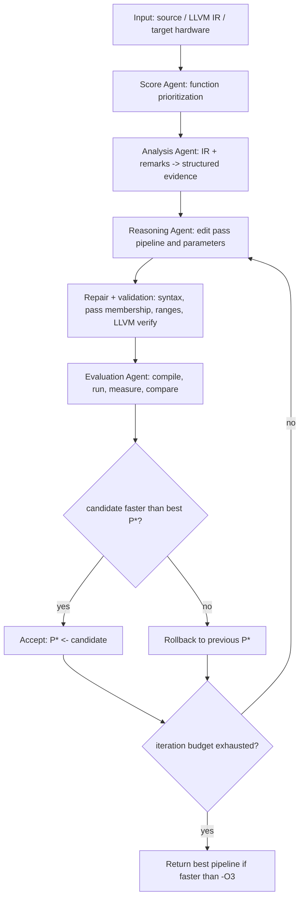

# AutoPass：把 LLM Agent 放进 LLVM 调优闭环，而不是让它凭直觉猜 pass

## 元信息

| 字段 | 内容 |
|---|---|
| 标题 | AutoPass: Evidence-Guided LLM Agents for Compiler Performance Tuning |
| 作者 | Zepeng Li, Jie Ren, Zhanyong Tang, Jie Zheng, Zheng Wang |
| 类型 | arXiv 论文，cs.SE / cs.AI |
| 版本 | arXiv:2606.20373v1，2026-06-18 15:35:40 UTC 提交 |
| 主题 | 大模型 Agent、编译器优化、LLVM pass pipeline、运行时反馈、自动调优 |
| 原始链接 | https://arxiv.org/abs/2606.20373v1 |

## TL;DR

- **这篇论文做什么**：AutoPass 试图解决 LLVM 性能调优里的 phase ordering 问题：不是只让 LLM 看代码然后生成优化建议，而是把 LLM 拆成 Score、Analysis、Reasoning、Evaluation 四个 Agent，接入 LLVM IR、优化 remarks、硬件信息和真实运行时间，逐轮编辑 pass pipeline。
- **它怎么做**：系统从 `-O3` pipeline 出发，先用 Score Agent 选出值得放进上下文的函数，再由 Analysis Agent 把 IR 和 `-Rpass/-Rpass-missed/-Rpass-analysis` 变成结构化证据；Reasoning Agent 生成 pass 顺序和参数；Evaluation Agent 编译、验证、跑三次取均值，并用 rollback 策略只接受比当前最优 pipeline 更快的候选。
- **关键证据**：论文在 Intel Core i9 x86-64 和 Raspberry Pi 5 ARM64 上，用 cBench、PolyBench、CoreMark、MiniFE、LULESH 评测。开启 rollback 时，AutoPass R3 在 10 个平台-套件组合中拿下 9 个最佳；平均相对 `-O3` 的几何加速为 x86-64 上 1.043 倍、ARM64 上 1.117 倍。
- **最有信息量的数字**：无 rollback 的 cBench 上，x86-64 从 R1 的 1.010 倍提升到 R3 的 1.040 倍，退化样本从 13 个降到 6 个；ARM64 从 R1 的 1.004 倍提升到 R3 的 1.109 倍，胜出样本从 15 个升到 27 个。Score Agent 的 Top-10 选择达到 1.0333 倍，接近 OpenTuner 500 轮的 1.0335 倍。
- **为什么它是 Agent 论文**：核心不是“LLM 写编译参数”，而是多 Agent 分工、工具调用、状态压缩、候选修复、真实环境反馈和 rollback 的闭环。它把 Agent 的可解释行动约束在编译器允许的 pass 集合里，避免把幻觉直接送进目标设备。
- **主要局限**：实验只覆盖 LLVM 17.0.6、两类硬件和若干 benchmark；论文没有公开完整代码仓库，source e-print 抓取也不稳定；Evaluation Agent 需要真实编译运行，调优成本仍然存在；结果是 benchmark 级证据，不等于生产负载、不同输入分布和更大代码库上都能保持同等收益。

## 1. 论文真正要回答的问题是什么？

### 1.1 不是“LLM 会不会优化代码”，而是“LLM 能不能安全地改编译器策略”

- LLVM 这类现代编译器把优化拆成很多 pass，例如：
  - loop unroll；
  - instruction scheduling；
  - register allocation；
  - inlining；
  - vectorization；
  - LICM；
  - tail-call elimination。
- 工程上常用 `-O3`、`-Oz` 这样的固定优化等级，但固定 pipeline 有一个结构性问题：
  - 某个 pass 是否有效取决于程序结构；
  - pass 顺序会改变后续 IR；
  - pass 参数会影响代码体积、缓存压力和向量化收益；
  - 同一套策略在 x86-64 与 ARM64 上可能产生完全不同的收益。
- 因此论文把问题定义成 **phase ordering + parameter tuning**：
  - 给定一个程序、目标硬件和有限运行预算；
  - 从 `-O3` 出发；
  - 找到更快的 pass sequence 和参数；
  - 同时避免因为 LLM 幻觉、错误 pass、激进优化导致性能退化。

### 1.2 为什么传统路线不够？

| 路线 | 典型代表 | 优点 | 论文指出的限制 |
|---|---|---|---|
| 固定 heuristic | LLVM `-O3` | 稳定、通用、无需额外 profile | 无法针对单个程序和硬件重排 pipeline |
| PGO / AutoFDO / CSSPGO | 运行 profile 驱动启发式 | 利用真实运行信息 | 多数仍在固定 `-O3` 结构内调参，对 profile 代表性敏感 |
| 搜索式 autotuning | OpenTuner | 能探索任意组合 | 评测次数贵，少轮预算下波动大，多轮预算仍有回退风险 |
| 学习式策略 | Autophase、CompilerGym、MLGO 等 | 可学习 compiler policy | 需要大量离线训练，迁移到新程序、硬件、版本时成本高 |
| 直接 LLM 推理 | 代码或 IR 输入 LLM | 可读语义，低训练成本 | 静态推理无法预测微架构、缓存、运行噪声造成的真实性能 |

**AutoPass 的切入点**：

- 不把 compiler 当黑盒，只看最终时间；
- 不把 LLM 当全知模型，只让它生成一次答案；
- 不训练新模型，而是在推理期把 compiler evidence 和 runtime evidence 喂回 agent；
- 不允许模型随意发明 pass，而是限制在 `-O3` 初始 pass 集合与合法参数范围内。

### 1.3 为什么本轮选 AutoPass，而不是更靠前的 ToolPro？

Scout 表里 ToolPro 排名第一，理由很充分：它讨论 agentic web service、tool program、sandbox 和 exactly-once 副作用，和 MCP 风格工具接口高度相关。但本轮主 Agent 选择 AutoPass，主要基于三个判断：

| 判断维度 | ToolPro | AutoPass | 本轮取舍 |
|---|---|---|---|
| 证据密度 | 需要进一步确认完整正文和实验表 | PDF 可抽取，Table 3-10、Figure 2-5 和 Qsort trace 都完整 | AutoPass 更适合一次性写到 5000 汉字以上 |
| 主题覆盖 | Agent 工具接口治理 | Agent 工作流、工具调用、真实环境反馈、代码性能优化 | AutoPass 仍严格落在 llm-agent / coding-agent 范围内 |
| 可解释性 | 可能更偏系统接口设计 | 有明确 claim → mechanism → evidence → boundary 链条 | AutoPass 更容易给出公式、伪代码、表格和失败案例 |
| 重复风险 | Scout 标低到中 | items 与 known-links 未命中标题、arXiv ID、DOI；旧正文只把它列为候选 | 两者都可选，AutoPass 的实验材料更稳 |

这个选择不是否定 ToolPro，而是遵守“质量优先、每次优先深读 1 篇”的策略：当候选都符合窗口和去重要求时，优先选证据链更完整、能独立支撑长文的材料。

## 2. AutoPass 的系统结构：四个 Agent 各自负责什么？



### 2.1 Score Agent：先把上下文问题降维

- LLM 上下文再大，也不适合把整个项目的 LLVM IR 直接塞进去。
- Score Agent 的任务不是生成优化策略，而是 **决定哪些函数值得后续 Agent 细读**。
- 它读取项目层级、调用图和静态 IR 特征，抽取：
  - basic block 数；
  - loop 数；
  - call 数；
  - conditional branch 数。
- 这些特征不是最终性能模型，而是把上下文资源投到高影响区域：
  - block 多，说明 CFG 复杂，可能涉及指令缓存和控制流；
  - loop 多，说明 unroll、vectorize、LICM 等 pass 有机会；
  - call 多，说明 inline 与 interprocedural 行为可能重要；
  - branch 多，说明预测、布局、block placement 可能影响性能。

### 2.2 Analysis Agent：把 IR 和 compiler remarks 翻译成可推理证据

- Analysis Agent 做两类抽取：
  - **semantic hint inference**：从符号名、metadata、IR 形态判断函数像排序、stencil loop、memory kernel 还是 I/O-bound routine；
  - **remark-guided structural analysis**：读取 `-Rpass`、`-Rpass-missed`、`-Rpass-analysis`，把 missed vectorization、inlining opportunity、loop transform 等信号归类。
- 输出不是自然语言长解释，而是 normalized JSON summary：
  - semantic hints；
  - categorized compiler remarks；
  - 与目标硬件相关的约束。
- 这一层的作用是把“LLM 看代码猜优化”改成“LLM 读 compiler 已经暴露的中间证据”。

### 2.3 Reasoning Agent：只在受限空间里编辑 pipeline

- Reasoning Agent 从标准 `-O3` pipeline 出发，做三件事：
  - 选择 pass；
  - 重排 pass；
  - 调整参数，例如 unroll factor、inline threshold、SLP vectorization threshold。
- 它不能直接把候选送去跑，而要先过确定性修复和验证：
  - 修复括号或 schema 错误；
  - 把无效 pass token 映射到合法 pass；
  - 检查所有 pass 是否属于初始 `-O3` pass set；
  - 检查参数范围；
  - 调用 LLVM 编译和 verify。
- 这个设计很关键：论文承认 LLM 会输出 malformed syntax 和 hallucinated pass names，但用编译器边界把幻觉截住。

### 2.4 Evaluation Agent：真实跑出来的慢，就是慢

- Evaluation Agent 不做“看起来合理”的判断，而是：
  - 编译候选 pipeline；
  - 验证二进制；
  - 运行目标 benchmark；
  - 收集 runtime、hardware counter、更新后的 compiler remarks；
  - 与 `-O3` 和当前最优 `P★` 对比。
- 它把失败候选转成下一轮反馈：
  - 哪个参数过激；
  - 哪类 pass 带来缓存压力；
  - 哪些 remark 显示机会还没被处理；
  - 下一轮应该保守还是继续扩大搜索。

## 3. 核心算法：rollback 把 Agent 推理变成可控搜索

### 3.1 论文里的接受规则可以写成一个很简单的公式

设：

- `P0`：固定参考 pipeline，也就是 LLVM `-O3`；
- `P★`：当前已验证的最优 pipeline；
- `P(t)`：第 `t` 轮 Reasoning Agent 生成的候选 pipeline；
- `t(P)`：pipeline `P` 跑三次后的平均运行时间。

接受规则：

```text
if P(t) compiles and verifies and t(P(t)) < t(P★):
    P★ <- P(t)
else:
    rollback to P★
```

报告加速比时：

```text
speedup(P) = t(P0) / t(P)
```

最终返回：

```text
return P★ only if speedup(P★) > 1
otherwise return -O3
```

### 3.2 这个公式为什么重要？

- 它把 LLM 的“建议”转成了一个有限预算搜索过程。
- 它区分了两个基准：
  - `-O3` 是全局报告基准；
  - `P★` 是局部接受基准。
- 它让失败候选仍有价值：
  - 失败候选不被采用；
  - 但失败原因会压缩成反馈；
  - 下一轮 Reasoning Agent 用这个反馈修正参数。

### 3.3 rollback 与普通 early stopping 的区别

| 机制 | 触发依据 | 保留什么 | 丢弃什么 | 对 Agent 的意义 |
|---|---|---|---|---|
| early stopping | 若继续搜索收益不足就停止 | 当前最好结果 | 后续探索机会 | 主要节省预算 |
| rollback | 候选慢于 `P★` 或验证失败 | 当前已验证最优 pipeline | 慢候选的执行权 | 防止错误行动污染最终状态 |
| feedback compression | 候选失败后仍总结原因 | 失败诊断、counter、remarks | 原始冗余日志 | 把失败变成下一轮可用上下文 |
| final guard | `P★` 不快于 `-O3` 时返回 `-O3` | 稳定 baseline | 无收益 pipeline | 防止“为了改而改” |

AutoPass 的关键不是单独某一步，而是这四个机制连起来：

- rollback 保证系统不会因为模型一轮自信输出就退化；
- feedback compression 让失败仍能产生学习信号；
- final guard 让论文报告的收益以 `-O3` 为硬基准；
- validation 把语法错误、幻觉 pass、越界参数挡在运行前。

### 3.4 伪代码

```text
Input:
  program source, target hardware, baseline pipeline P0 = -O3
  iteration budget B, legal pass set S, parameter bounds R

State:
  P★ = P0
  history = []

for round in 1..B:
  selected_functions = ScoreAgent(program, static_features)
  evidence = AnalysisAgent(IR, optimization_remarks, selected_functions)
  candidate = ReasoningAgent(P★, evidence, runtime_feedback, hardware)

  repaired = repair_syntax_and_pass_names(candidate, S)
  if not validate_schema_params_and_llvm(repaired, R):
    history.append(failed_validation(repaired))
    continue

  runtime = mean(run(repaired), repeats=3)
  feedback = EvaluationAgent(runtime, counters, remarks, P★, P0)

  if runtime < mean_runtime(P★):
    P★ = repaired
  else:
    rollback_to(P★)

  history.append(feedback)

Output:
  P★ if mean_runtime(P★) < mean_runtime(P0), else P0

Failure boundary:
  invalid syntax, hallucinated pass, parameter out of range,
  failed LLVM verify, runtime regression, benchmark noise.
```

## 4. 实验设置：它不是只在一个 benchmark 上讲故事

### 4.1 硬件平台

| 平台 | ISA | CPU | RAM |
|---|---|---|---|
| Server | x86-64 | Intel Core i9 @ 3.50GHz | 64GB |
| Raspberry Pi 5 | ARM64 | Cortex-A76 @ 2.40GHz | 8GB |

### 4.2 Benchmark 套件

| Suite | 数量 | 论文里的评测角色 |
|---|---:|---|
| cBench | 31 | 通用 whole-program phase-ordering robustess |
| PolyBench | 30 | loop-intensive kernel，关注 vectorization、tiling、unrolling |
| CoreMark | 1 | 嵌入式 CPU 快速回归检查 |
| MiniFE | 1 | HPC sparse linear algebra proxy，强调 memory access pattern |
| LULESH | 1 | shock hydrodynamics proxy，考验 compute-memory 交互 |

### 4.3 baseline

- `-O3`：所有 speedup 的参考基准。
- Instrumentation-based PGO：插桩收集 profile。
- AutoFDO：采样式 profile。
- CSSPGO：只在 x86-64 上比较。
- OpenTuner：
  - 3 iterations：与 AutoPass 相同调优预算；
  - 500 iterations：作为高预算搜索参考。

### 4.4 LLM backend

- 主实验使用 DeepSeek-V3.2。
- 后续扩展到 ChatGPT-4o、Qwen3、Gemini 3 Flash。
- 论文强调 AutoPass 是 inference-only：
  - 不离线训练；
  - 不微调；
  - 每个新程序通过 compiler evidence 和 runtime feedback 调优。

### 4.5 评测协议里最容易被忽略的细节

- 每个候选 pipeline 的运行时间取三次执行均值：
  - 这比单次运行稳；
  - 但不等于完全消除系统噪声；
  - 对嵌入式平台尤其要注意温度、频率、后台负载。
- OpenTuner 3 轮与 AutoPass 预算对齐：
  - 这是最公平的主对照；
  - 因为 AutoPass 也是小轮数调优；
  - OpenTuner 500 轮更像“高预算上界”，不能直接当同成本 baseline。
- `-O3` 既是起点也是报告基准：
  - 这使 AutoPass 不需要从随机 pipeline 开始；
  - 也让它更接近实际工程，因为开发者通常不会放弃 `-O3` 的已知稳定性；
  - 但这也意味着结论主要是“受限编辑 `-O3` pipeline 有收益”，不是“全局最优 compiler policy”。

## 5. 主结果：rollback 下 AutoPass 在 9/10 个平台-套件组合最佳

### 5.1 Table 5 的关键信息

| 平台 | Suite | AutoPass R3 | AutoPass R1 | 最接近的传统 baseline | 观察 |
|---|---|---:|---:|---:|---|
| x86-64 | cBench | 1.059 | 1.046 | Instr.PGO 1.037 / OpenTuner 1.035 | R3 继续拉开差距 |
| x86-64 | PolyBench | 1.009 | 1.005 | CSSPGO/AutoFDO/OpenTuner 约 1.006-1.009 | 提升小，但无明显输给 baseline |
| x86-64 | CoreMark | 1.137 | 1.117 | OpenTuner 1.093 | 嵌入式风格单测上收益明显 |
| x86-64 | MiniFE | 1.008 | 1.000 | Instr.PGO 1.003 / CSSPGO 1.006 | 稀疏线性代数上收益有限 |
| x86-64 | LULESH | 1.102 | 1.089 | Instr.PGO 1.101 | 几乎与 PGO 打平但略高 |
| ARM64 | cBench | 1.111 | 1.055 | OpenTuner 1.088 | 反馈轮带来明显收益 |
| ARM64 | PolyBench | 1.149 | 1.129 | PGO/FDO/OpenTuner 约 1.011-1.012 | ARM64 loop kernel 上优势最大 |
| ARM64 | CoreMark | 1.091 | 1.006 | Instr.PGO 1.091 | R3 才追平最佳 |
| ARM64 | MiniFE | 1.068 | 1.039 | Instr.PGO 1.023 | memory pattern 上有可见收益 |
| ARM64 | LULESH | 1.046 | 1.004 | Instr.PGO 1.040 | 小幅胜出 |

**读法**：

- AutoPass 不是每个 suite 都暴涨；
- 更可信的结论是：
  - 在少轮预算下，比 OpenTuner 稳；
  - 比 PGO 更能改变 pipeline 拓扑；
  - ARM64 上收益大于 x86-64，说明它确实利用了目标硬件差异。

### 5.2 为什么 ARM64 更明显？

- 论文的解释是：嵌入式 ARM64 平台上，默认 `-O3` 更保守。
- 这种保守主要体现在：
  - 避免过度 unroll；
  - 避免代码体积压力；
  - 对 vectorization 更谨慎。
- AutoPass 通过真实运行反馈找到安全的激进点：
  - 哪些 loop 可以更激进；
  - 哪些 vectorization 在 ARM64 上值得做；
  - 哪些参数会把收益变成 cache pressure。

### 5.3 对 Table 5 的审慎解读

| 问题 | 可以从 Table 5 得出的结论 | 不能从 Table 5 得出的结论 |
|---|---|---|
| AutoPass 是否有效？ | 在这些 benchmark 和硬件上，R3 通常优于 PGO、FDO、少轮 OpenTuner | 所有真实业务负载都会同等加速 |
| 反馈是否必要？ | R3 普遍高于 R1，尤其 ARM64 cBench、PolyBench、CoreMark | 反馈轮数越多一定越好 |
| PGO 是否过时？ | PGO 在若干场景接近或低于 AutoPass | PGO 没价值，或不应与 AutoPass 组合 |
| LLM 是否理解编译器？ | Agent 能把 compiler evidence 转成有效 pipeline edit | 模型拥有完整 compiler correctness 知识 |

这张表更像是一个系统论文的可行性证据，而不是最终性能冠军声明。它证明的重点是：在强约束、少轮预算和真实测量条件下，LLM Agent 可以参与 compiler tuning；它没有证明 AutoPass 总能超过高预算手工调优或领域专家。

## 6. 没有 rollback 会怎样？Table 6 说明反馈不是装饰

### 6.1 cBench 无 rollback 的结果

| 平台 | 方法 | Geo. Mean | Wins | Losses | Max | Min |
|---|---|---:|---:|---:|---:|---:|
| x86-64 | AutoPass R3 | 1.040 | 25 | 6 | 1.366 | 0.784 |
| x86-64 | AutoPass R1 | 1.010 | 18 | 13 | 1.275 | 0.753 |
| x86-64 | Instr.PGO | 0.997 | 21 | 10 | 1.186 | 0.454 |
| x86-64 | CSSPGO | 0.993 | 16 | 15 | 1.151 | 0.801 |
| x86-64 | AutoFDO | 0.987 | 14 | 17 | 1.095 | 0.748 |
| x86-64 | OpenTuner 3 iter | 0.991 | 19 | 12 | 1.165 | 0.544 |
| x86-64 | OpenTuner 500 iter | 1.057 | 23 | 8 | 1.644 | 0.861 |
| ARM64 | AutoPass R3 | 1.109 | 27 | 4 | 2.040 | 0.961 |
| ARM64 | AutoPass R1 | 1.004 | 15 | 16 | 2.028 | 0.728 |
| ARM64 | Instr.PGO | 0.999 | 21 | 10 | 1.156 | 0.497 |
| ARM64 | AutoFDO | 1.019 | 21 | 10 | 1.110 | 0.882 |
| ARM64 | OpenTuner 3 iter | 1.079 | 26 | 5 | 2.622 | 0.769 |
| ARM64 | OpenTuner 500 iter | 1.126 | 26 | 5 | 2.756 | 0.844 |

### 6.2 这张表支持了三个判断

- **R1 不是最终答案**：
  - x86-64 R1 只有 1.010 倍，13 个 loss；
  - R3 到 1.040 倍，loss 降到 6 个。
- **OpenTuner 高预算能追求峰值，但风险没有消失**：
  - ARM64 500 iter 到 1.126 倍；
  - 但仍有 5 个 loss，最差 0.844。
- **AutoPass 的优势不是搜索空间更大，而是证据压缩更好**：
  - 它用 compiler remarks 和 runtime evidence 指导下一轮；
  - 所以少轮预算下能比盲搜更稳定。

## 7. RQ3：它真的会按硬件改变策略吗？

### 7.1 pass coverage 的证据

论文用 compiler optimization remarks 统计某个 pass 在 benchmark 中“有效应用”的次数，然后比较 AutoPass 与 `-O3`：

- Increased：比 `-O3` 更多；
- Decreased：比 `-O3` 更少；
- Unchanged：基本不变。

关键数字：

- loop-unrolling coverage：
  - x86-64 上 90.3% benchmark 增加；
  - ARM64 上 93.5% benchmark 增加。
- LICM coverage：
  - 约 55%-61% 程序增加。
- SLP vectorization：
  - x86-64：32.3% 增加，35.5% 减少；
  - ARM64：41.9% 增加，25.8% 减少。

### 7.2 解释

- AutoPass 并非简单“更多优化就是更好”。
- 它对 unrolling 的总体态度更积极，同时增加 LICM 来抵消 loop body 变大后的重复计算。
- 它对 vectorization 有架构差异：
  - ARM64 上更愿意增加 SLP；
  - x86-64 上更平衡，甚至经常减少 SLP。
- 这说明系统学到的不是一个固定 recipe，而是从 evidence 到 target-specific decision 的映射。

### 7.3 Edit Similarity 说明 pipeline 没有被乱改

| 指标 | AutoPass vs `-O3` x86 | AutoPass vs `-O3` ARM | AutoPass x86 vs ARM |
|---|---:|---:|---:|
| Geo. Mean ± SD | 0.943 ± 0.050 | 0.930 ± 0.042 | 0.917 ± 0.046 |
| Min | 0.768 | 0.821 | 0.800 |
| Max | 1.000 | 1.000 | 0.988 |

**读法**：

- 相似度很高，说明 AutoPass 主要是受限编辑，不是彻底重写 pipeline。
- 但跨架构相似度略低，说明同一程序在 x86 与 ARM 上会生成不同 pipeline。
- 这比“全局套一个激进 pass 序列”更可信。

## 8. Score Agent 和消融：哪一层最重要？

### 8.1 Score Agent 不只是复制 PGO hot function

| Top-k | OpenTuner 500 iter | PGO-hot | Score Agent | PGO 与 Score 重叠率 |
|---:|---:|---:|---:|---:|
| Top-5 | 1.0335 | 1.0277 | 1.0270 | 32.2% |
| Top-10 | 1.0335 | 1.0277 | 1.0333 | 35.5% |
| Top-20 | 1.0335 | 1.0219 | 1.0221 | 31.6% |

**解释**：

- Top-10 时 Score Agent 的 1.0333 几乎追平 OpenTuner 500 iter 的 1.0335。
- PGO-hot 与 Score Agent 的重叠率只有约三分之一。
- 这说明 Score Agent 排序的不是“运行最热”的函数，而是“改它最可能带来端到端收益”的函数。

### 8.2 Agent ablation

| 配置 | Round 1 | Round 2 | Round 3 | 论文中的含义 |
|---|---:|---:|---:|---|
| No Evaluation Agent | - | 0.961 ± 0.181 | 0.961 ± 0.122 | 没有真实反馈，后续轮会不稳定 |
| No Reasoning Agent | 0.910 ± 0.135 | 0.823 ± 0.360 | 0.870 ± 0.301 | 没有推理，pass selection 会严重伤害性能 |
| No Analysis Agent | 0.969 ± 0.113 | 0.977 ± 0.135 | 1.019 ± 0.089 | 没有 IR/remarks 结构化证据，收敛更慢 |
| Full AutoPass | 1.010 ± 0.121 | 1.016 ± 0.125 | 1.020 ± 0.116 | 完整系统最稳 |

### 8.3 最关键的结论

- Reasoning Agent 是效果核心：
  - 没它，系统不仅没法优化，甚至会系统性退化。
- Evaluation Agent 是稳定性核心：
  - 没它，后续 round 没有真实纠错信号。
- Analysis Agent 是收敛效率核心：
  - 没它，系统需要靠后续反馈弥补初始证据缺失。

## 9. Qsort trace：论文最值得细读的失败案例

### 9.1 Round 1 为什么失败？

Qsort 的 IR 放得进上下文，所以这个案例不需要 Score Agent。Analysis Agent 看到的证据包括：

- 目标函数 `qsortx`：
  - 198 blocks；
  - 12 calls；
  - 16 loops。
- compiler remarks：
  - `slp-vectorizer` 有 13 次 `NotBeneficial`；
  - `loop-vectorize` 有 3 次 `NonReductionValueUsed`；
  - 也存在 4 次 `Vectorized`。

Reasoning Agent 于是生成了激进策略：

| 参数 | Round 1 选择 | 直觉 |
|---|---:|---|
| `unroll_count` | 8 | 更积极展开 loop |
| `unroll_threshold` | 600 | 放宽 unroll 限制 |
| `inline_threshold` | 800 | 允许更多 inline |
| `slp_threshold` | -5 | 让 SLP vectorizer 更愿意介入 |
| `mcpu` | skylake | 面向 Intel i9 x86-64 |

### 9.2 真实运行反馈推翻了静态直觉

| 指标 | `-O3` / baseline | Round 1 | 变化 |
|---|---:|---:|---:|
| 平均运行时间 | 1.5355s | 1.5474s | +0.77%，变慢 |
| 指令数 | 28.69B | 28.03B | -2.3%，看似更少 |
| L1 miss | 约 0.96M | 约 2.25M | +133.1% |

这个失败非常有价值：

- 指令数下降不等于性能提升；
- 过度 unroll 和过低 SLP threshold 可能引入代码膨胀和缓存压力；
- x86-64 上“更激进 vectorization”不一定划算；
- Evaluation Agent 必须使用真实 runtime data，而不是让 LLM 对自己的方案评分。

### 9.3 后续 round 如何修正？

- Evaluation Agent 把失败压缩成下一轮指令：
  - unroll 更保守；
  - 避免 non-beneficial vectorization；
  - 不引入无关新 pass；
  - 保留与 Qsort bottleneck 相关的调参。
- 论文报告的恢复路径：
  - Round 2 基本移除回归；
  - Round 3 运行时间到 1.4941s；
  - 相对 `-O3` 达到 1.028 倍。

**这个案例是全文的机制证明**：

- AutoPass 不只是“找到一个快 pipeline”；
- 它展示了“为什么上一轮错了、下一轮怎样修”的证据链；
- 这种可诊断性是传统黑盒搜索很难提供的。

## 10. 不同 LLM backend：反馈闭环比单个模型首轮能力更重要

### 10.1 Table 10 的结果

| 平台 | 模型 | R1 Geo. Mean | R3 best Geo. Mean | 观察 |
|---|---|---:|---:|---|
| x86-64 | DeepSeek-V3.2 | 1.010 ± 0.121 | 1.040 ± 0.114 | 主实验模型，首轮就较强 |
| x86-64 | ChatGPT-4o | 0.992 ± 0.128 | 1.029 ± 0.105 | 首轮略低于 `-O3`，反馈后转正 |
| x86-64 | Qwen3 | 0.995 ± 0.116 | 1.040 ± 0.105 | R3 追平 DeepSeek |
| x86-64 | Gemini 3 Flash | 1.008 ± 0.105 | 1.040 ± 0.099 | 首轮可用，R3 稳定提升 |
| ARM64 | DeepSeek-V3.2 | 1.004 ± 0.215 | 1.109 ± 0.206 | ARM64 上反馈收益更大 |
| ARM64 | ChatGPT-4o | 0.989 ± 0.242 | 1.088 ± 0.211 | 从退化修正到增益 |
| ARM64 | Qwen3 | 0.975 ± 0.193 | 1.080 ± 0.227 | 首轮较弱，R3 可恢复 |
| ARM64 | Gemini 3 Flash | 0.922 ± 0.199 | 1.091 ± 0.225 | 首轮明显退化，闭环修正最明显 |

### 10.2 这说明什么？

- AutoPass 的价值不应只归功于 DeepSeek-V3.2。
- 它更像一个 **模型无关的 agentic control loop**：
  - 弱首轮模型可以被 runtime feedback 拉回；
  - 强首轮模型也能继续迭代改进；
  - 输出空间受 compiler validation 约束，降低模型差异造成的灾难性后果。
- 这对 Agent 系统设计很重要：
  - 当行动空间有强约束工具时，系统结构可能比单次模型能力更关键；
  - 但前提是反馈是真实、低噪声、可归因的。

## 11. 与相关工作的关系：它站在三条线的交叉处

### 11.1 与 classical autotuning 的关系

- OpenTuner、TVM、genetic algorithms 等方法把优化看成搜索。
- AutoPass 也搜索，但它不是盲搜：
  - 初始点是 `-O3`；
  - 候选由 compiler evidence 引导；
  - 失败被解释成下一轮 prompt；
  - 真实运行决定接受或 rollback。

### 11.2 与 PGO / FDO 的关系

- PGO 类方法利用 profile 改 heuristic。
- AutoPass 利用 profile / runtime evidence 改 pipeline 拓扑和参数。
- 论文批评 PGO 的核心不是“没有运行数据”，而是：
  - 通常仍受默认 pipeline 结构限制；
  - profile 代表性不好时容易误导；
  - 对复杂 pass 交互的探索不足。

### 11.3 与 ML compiler optimization 的关系

- MLGO、ACPO、Autophase、CompilerGym 等方法把 optimization policy 学出来。
- AutoPass 的差异：
  - 不离线训练；
  - 不依赖固定特征到动作的 learned mapping；
  - 把每个新任务当成推理和闭环控制问题。

### 11.4 与 LLM for code optimization 的关系

- 许多 LLM 优化工作停在 source-level rewrite、SIMD code synthesis、program repair 或单点 transformation。
- AutoPass 进入 compiler pass-pipeline 层：
  - 操作对象不是源码 patch；
  - 是 LLVM pass sequence 与参数；
  - 正确性首先由 compiler verify 和 benchmark 运行筛掉。

## 12. 证据边界与可复现性问题

### 12.1 论文强证据

- 有明确硬件：
  - Intel Core i9 x86-64；
  - Raspberry Pi 5 ARM64。
- 有多套 benchmark：
  - 31 个 cBench；
  - 30 个 PolyBench；
  - 3 个单 benchmark proxy。
- 有 baseline：
  - PGO；
  - AutoFDO；
  - CSSPGO；
  - OpenTuner 3 iter；
  - OpenTuner 500 iter。
- 有消融：
  - 去掉 Evaluation；
  - 去掉 Reasoning；
  - 去掉 Analysis；
  - 比较 Score Agent 与 PGO-hot。
- 有 trace case：
  - Qsort 展示失败、诊断、修正、恢复。

### 12.2 论文弱证据

- 没看到完整官方代码仓库：
  - arXiv PDF 内出现匿名 4open.science 链接；
  - 当前没有可稳定复现的公开 GitHub release。
- benchmark 仍偏标准化：
  - 生产服务可能有更复杂输入分布；
  - profile 与线上行为偏移仍会影响调优。
- rollback 依赖测量稳定性：
  - 三次运行取均值不一定覆盖噪声环境；
  - hardware counter 归因可能在多进程、DVFS、热降频环境中变复杂。
- pass 空间被限制在 `-O3` 初始集合：
  - 降低幻觉和风险；
  - 也限制了发现非默认 pass 组合的能力。
- 正确性验证没有被展开成等价性证明：
  - compiler verify 和 benchmark 通过说明候选可运行；
  - 但对所有输入保持语义等价仍依赖 LLVM pass 合法性和测试覆盖。

### 12.3 如果要复现实验，最需要补齐什么？

| 缺口 | 为什么重要 | 需要的材料 |
|---|---|---|
| 完整代码与脚本 | 仅靠论文描述无法复现 agent orchestration、repair、validation 细节 | GitHub 仓库、Dockerfile、LLVM patch、prompt 模板 |
| benchmark 输入 | 性能调优对输入分布敏感 | cBench、PolyBench、CoreMark、MiniFE、LULESH 的具体输入与运行命令 |
| 运行环境控制 | ARM64 和 x86 的噪声来源不同 | governor 设置、温控、重复次数、counter 采集方式 |
| pass 合法集合 | 幻觉 pass 的修复依赖候选集合 | LLVM 17.0.6 中 `-O3` 展开的完整 pass list |
| LLM 调用配置 | Agent 输出受温度、系统提示、上下文截断影响 | model version、temperature、max tokens、retry 策略 |

这也是 AutoPass 当前最主要的研究边界：论文机制很完整，但公开材料仍不足以让第三方快速复现 Table 5-10 的所有数字。

## 13. 对 Agent 研究的启发

### 13.1 AutoPass 展示了“工具约束型 Agent”的可行路线

这篇论文最值得借鉴的不是具体 speedup，而是系统形态：

- Agent 不直接执行危险动作；
- 每个动作都先过 schema、合法 pass、参数范围、编译 verify；
- 真实运行结果覆盖模型自评；
- rollback 使失败不会污染最终输出；
- 失败诊断被压缩成下一轮上下文。

### 13.2 这种结构适合哪些问题？

适合：

- 行动空间可枚举或可验证；
- 每次行动能获得真实反馈；
- 反馈成本可接受；
- 失败可以 rollback；
- 需要解释为什么改动有效或无效。

不适合：

- 每次试错代价极高；
- 反馈极噪声且难以归因；
- 行动不可回滚；
- 合法性边界模糊；
- 任务收益无法短周期测量。

### 13.3 与 AI 安全的交叉点

- AutoPass 不是安全论文，但它有安全意义：
  - LLM 的输出被工具边界约束；
  - 幻觉 pass 被 deterministic repair / validation 拦住；
  - 性能退化被 runtime evidence 和 rollback 拦住；
  - Agent 决策链可追踪。
- 这对应一种 practical containment：
  - 不要求模型绝不犯错；
  - 要求错误在系统层面被隔离、诊断、回滚。

### 13.4 对 coding agent 的具体启发

AutoPass 可以被看成 coding agent 的一个更窄但更严格版本：

- coding agent 常见动作是改源码、跑测试、看日志；
- AutoPass 的动作是改 compiler pass、跑 benchmark、看 compiler remarks；
- 两者共同点是：
  - 都需要工具反馈；
  - 都需要避免一次性大改；
  - 都需要把失败日志压缩成下一轮行动；
  - 都需要硬性验证门禁。

差异也很重要：

| 维度 | 普通 coding agent | AutoPass |
|---|---|---|
| 行动空间 | 源码任意修改，空间极大 | `-O3` pass 集合内的受限编辑 |
| 正确性信号 | 单元测试、类型检查、人工 review | LLVM verify、benchmark 是否可运行 |
| 目标函数 | 功能正确、可维护、性能、风格混合 | 主要是 runtime speedup |
| 失败回滚 | 依赖版本控制或人工判断 | pipeline 级自动 rollback |
| 可归因性 | 日志和 diff 可能复杂 | pass edit、counter、remarks 更结构化 |

因此，AutoPass 给 coding agent 的直接启发是：如果能把行动空间变窄、反馈变结构化、失败自动回滚，LLM 的不稳定性会更容易被系统吸收。

## 14. 还值得继续追问什么？

### 14.1 能否和 PGO 组合，而不是替代 PGO？

- 论文把 PGO 当 baseline，但实际工程里更自然的问题是组合：
  - PGO 负责提供 profile；
  - AutoPass 负责重排 pipeline 和调参；
  - Evaluation Agent 判断 profile-driven 改动是否真的加速。
- 这会带来新问题：
  - profile 输入偏移时，Agent 是否会被误导；
  - Score Agent 是否应该同时看 profile hotness 和结构化 IR；
  - rollback 是否能识别 profile 过拟合导致的跨输入退化。

### 14.2 能否把目标函数从速度扩展到多目标？

目前论文主要优化 runtime speedup。真实部署常常同时关心：

- 二进制体积；
- 编译时间；
- 内存峰值；
- 能耗；
- tail latency；
- 不同输入规模下的稳定性。

如果目标函数变成多目标，Evaluation Agent 需要从单一接受规则变成 Pareto 或约束优化：

```text
accept P(t) if:
  runtime improves
  and binary_size <= budget
  and compile_time <= budget
  and no regression on required input classes
```

这会使 prompt、反馈压缩和 rollback 都更复杂。

### 14.3 能否处理大型生产代码库？

- Score Agent 的设计正是为了上下文限制，但大型代码库会出现更多边界：
  - 跨模块 inline；
  - LTO；
  - 动态链接；
  - 多 workload profile；
  - 长时间 benchmark 成本。
- 可能需要分层策略：
  - 函数级筛选；
  - 模块级 pipeline；
  - 全程序级验证；
  - 灰度流量级回归检测。

如果这条线成立，AutoPass 就不只是 compiler paper，而会变成一种“受约束 Agent 控制复杂工具链”的通用模板。

## 15. 结论

- AutoPass 把 LLM Agent 从“代码建议器”推进到“受约束的 compiler tuning controller”。
- 论文最强主张是：
  - 在有限 target-side execution budget 下；
  - 用 compiler-internal evidence + measured runtime feedback；
  - 可以比 PGO、少轮 OpenTuner 和单轮 LLM 推理更稳定地提升性能。
- 它的最重要机制不是某个 prompt，而是：
  - Score 降维；
  - Analysis 证据化；
  - Reasoning 受限行动；
  - Evaluation 真实反馈；
  - validation 与 rollback 兜底。
- 它的主要边界也很清楚：
  - 代码未完整公开；
  - benchmark 规模有限；
  - 调优仍需要真实运行；
  - rollback 只能防性能退化，不能自动证明全输入语义等价。

对大模型 Agent 研究来说，这篇论文的价值在于给出了一种可落地范式：**让 Agent 在强工具边界里行动，让环境证据纠正模型推理，让失败成为下一轮可压缩的状态，而不是把一次 LLM 输出当成最终答案。**
