# Patch the Planet：把 AI 安全能力从“发现漏洞”推进到“落地补丁”

### 元信息与 TL;DR

- **主文**：[Patch the Planet: a Daybreak initiative to support open source maintainers](https://openai.com/index/patch-the-planet/)
- **相关背景**：[Daybreak: Tools for securing every organization in the world](https://openai.com/index/daybreak-securing-the-world/)
- **发布方**：OpenAI
- **发布日期**：2026-06-22
- **类型**：官方安全项目说明 / AI for Security 工程报告
- **本轮定位**：AI 安全不只看模型能不能找漏洞，而是看发现、验证、去重、修补、测试、披露、维护者接受这条链路能不能闭环。

**TL;DR**

- Patch the Planet 是 OpenAI Daybreak 下的开源安全行动，联合 Trail of Bits、HackerOne、Calif、研究者和维护者，把 GPT-5.5-Cyber、Codex Security 与人工安全工程师接到真实开源项目里，目标不是制造更多漏洞报告，而是帮助维护者把高置信问题修掉。
- 它选择的初始项目集中在共享基础设施：cURL、NATS Server、pyca/cryptography、Sigstore、aiohttp、Go、freenginx、Python、python.org 等；Daybreak 背景页还说已有 30 多个开源项目承诺参与。这里的安全收益不是单项目收益，而是下游生态收益。
- 工作流强调“人类专家在环”：每个 engagement 先和维护者对齐需求、偏好和披露流程；安全工程师再做验证、去重、严重性校正、补丁开发、测试和协调披露。OpenAI 明确承认模型会产生大量 false positives，所以不能把原始发现直接丢给维护者。
- 关键证据包括：Trail of Bits 把安全工程师全职投入 19 个开源项目；已识别数百个安全问题并合并数十个补丁；五天初始 sprint 产出 fuzzing harness、历史 CVE 变体分析、差分测试、威胁模型、扩展测试套件和去重/过滤/补丁生成工作流。
- Daybreak 侧给出模型与产品数字：Codex Security research preview 已扫描 30,000 多个 codebase、30 million 多个 commits；人类 reviewer 手动标记 70,000 多个 findings fixed，系统自动判定 500,000 多个 findings fixed；GPT-5.5-Cyber 在 CyberGym 达到 85.6%，对比 GPT-5.5 的 81.8%，在 ExploitGym 为 39.5% 对比 25.95%，SEC-bench Pro 为 69.8% 对比 63.1%。
- 最值得注意的局限是：官方披露仍保留很多项目细节和 exploit mechanics；许多 finding 仍在 coordinated disclosure；指标来自 OpenAI/合作方叙述，不等于独立 benchmark；该方案依赖 trusted defender access、人工复核、项目同意和治理边界，不能被理解为“模型自动修复全网漏洞”。

### 这篇文章真正关心的问题是什么？

Patch the Planet 不是一个普通产品发布。它回应的是 AI for Security 里正在变得尖锐的矛盾：

- **模型更会找问题**：
  - 能读大代码库；
  - 能追踪 attack path；
  - 能写 PoC；
  - 能生成 patch；
  - 能基于覆盖率继续扩展 fuzzing surface。
- **维护者更容易被淹没**：
  - 报告数量上升；
  - false positive 变多；
  - 复现成本仍在；
  - 修补和回归测试需要项目上下文；
  - 协调披露仍需要人工判断。

OpenAI 在 Daybreak 背景文里把瓶颈判断说得很直接：过去的稀缺点是漏洞发现，现在瓶颈转向 patching。也就是说，安全能力的评价标准要从：

```text
Can the model find a plausible vulnerability?
```

转成：

```text
Can the system help verified defenders land a safe, tested fix?
```

这个转变很重要，因为它把 AI 安全从“生成发现”推向“维护者负担管理”。如果模型只提高 report throughput，而不提高 confirmed fix throughput，它可能反而伤害开源生态。

### Daybreak 与 Patch the Planet 的关系

可以把 Daybreak 理解为 OpenAI 的防御性网络安全能力总框架，把 Patch the Planet 理解为其中面向开源基础设施的落地项目。

| 层级 | 角色 | 重点 |
|---|---|---|
| Daybreak | 总框架 | 模型、Codex Security、partner program、trusted access、关键基础设施协作 |
| GPT-5.5-Cyber | 专项模型 | 更强也更少无谓拒绝，面向已验证防御者的授权安全工作 |
| Codex Security | 产品/工作流 | 扫描代码、验证 reachability、生成证据、提出 patch、导出到安全系统 |
| Patch the Planet | 开源行动 | 与维护者、Trail of Bits、HackerOne、Calif 协作，把 finding 变成 fix |

这组关系说明：Patch the Planet 不是单独把模型开给维护者，而是把模型能力放进一个有人工复核和披露流程的安全工程系统里。

### 运行机制：从维护者协商开始，而不是从扫描开始

官方描述里最重要的流程点是“每个合作先和维护者咨询”。这和很多自动扫描工具不同。

```mermaid
flowchart LR
  A["Maintainer consultation"] --> B["Scope / preference / disclosure process"]
  B --> C["AI-assisted vulnerability research"]
  C --> D["Triage and deduplication"]
  D --> E["Expert reproduction and severity review"]
  E --> F["Patch development"]
  F --> G["Tests / CI / differential checks"]
  G --> H["Coordinated disclosure"]
  H --> I["Maintainer-controlled landing"]
```



这个流程隐含了三条原则：

1. **项目主权优先**：
   - 维护者定义优先级；
   - 维护者定义接受什么形式的 patch；
   - 维护者决定补丁如何合并和披露。
2. **AI 不直接面对维护者 backlog**：
   - 发现先经过专家复现；
   - false positive 被过滤；
   - duplicate 被剔除；
   - 严重性会被重新评估。
3. **产出不止一个补丁**：
   - fuzzing harness；
   - threat model；
   - property-based tests；
   - CI/CD 改进；
   - 历史 CVE 变体分析 pipeline；
   - 差分测试框架。

这也是本文最值得读的地方：AI 不是被包装成“自动安全工程师”，而是被放在安全工程师可以控制、审计和纠偏的流水线里。

### 初始项目：为什么这些开源基础设施值得优先？

官方列出的初始参与者包括：

| 项目 | 生态位置 | 安全意义 |
|---|---|---|
| cURL | 网络请求基础工具和库 | 下游依赖极广，协议解析和边界输入风险高 |
| NATS Server | 消息系统 / 云原生基础设施 | 影响服务间通信、认证和多租户隔离 |
| pyca/cryptography | Python 加密库 | 密码学 API 和实现错误的下游风险巨大 |
| Sigstore | 软件供应链签名与验证 | 直接影响制品 provenance 和供应链信任 |
| aiohttp | Python 异步 HTTP 框架 | Web 服务和客户端场景广泛 |
| Go project | 编程语言与标准库 | runtime、network、crypto、toolchain 均有基础设施属性 |
| freenginx | Web server | 网络边界和 HTTP 实现风险集中 |
| Python / python.org | 语言运行时与生态入口 | 包管理、解释器、网站与发布链路都属于关键面 |

这些项目共同特点是：

- 下游数量大；
- 维护者时间有限；
- 漏洞影响跨组织传播；
- 安全修复需要极强项目上下文；
- 单个高质量 patch 的外部性很高。

Daybreak 背景文引用 Linux Foundation / Harvard 研究称，被研究的广泛使用项目中，94% 的项目少于 10 名开发者负责一年新增代码的 90% 以上。这个数字解释了为什么“给维护者更多 report”不是解决方案：维护者缺的不是噪声，而是经过复现和测试的可合并修复。

### 三类核心工作流

Patch the Planet 的早期 field notes 提到三个特别有信息量的工作流。

#### 1. 一天内搭建 fuzzing lab

官方说 Trail of Bits 工程师用 repeated Codex `/goal` runs 和 GPT-5.5-Cyber，在不到一天内搭出覆盖多入口、变体构建、平台和新测试种子的 fuzzing lab；人工工程师设定目标并优化提示，系统根据 coverage feedback 扩展更多 surface 和 edge cases。

它说明了一个新的分工：

| 人类工程师 | AI 系统 |
|---|---|
| 设定安全目标 | 生成 harness 和 glue code |
| 判断哪些 surface 值得扩展 | 根据 coverage feedback 继续探索 |
| 过滤弱候选 | 产出更多候选输入和构建组合 |
| 复现与确认漏洞 | 提供可运行证据和 patch 初稿 |

这里的关键不是“模型会 fuzzing”，而是 fuzzing lab 的搭建成本被压缩。过去很多安全团队知道应该 fuzz，却卡在 harness、构建矩阵、依赖 shim 和平台差异上。Codex 如果能把这些工程胶水快速铺开，就能让专家把时间花在结果判断上。

#### 2. 历史 CVE 驱动的变体发现

官方描述的变体发现 pipeline 可以整理成如下伪代码：

```text
Input:
  historical_cve_feed
  target_repositories
  project_docs
  threat_models

State:
  vulnerability_patterns = extract_patterns(historical_cve_feed)
  candidate_queue = []
  confirmed_findings = []

Loop:
  for pattern in vulnerability_patterns:
    for repo in target_repositories:
      candidates = codex_search(repo, pattern)
      for candidate in candidates:
        if issue_gate(candidate) == "weak":
          continue
        if false_positive_judge_1(candidate) == "reject":
          continue
        if false_positive_judge_2(candidate) == "reject":
          continue
        if duplicate_check(candidate, confirmed_findings):
          continue
        route_to_security_engineer(candidate)

Output:
  valid_non_duplicate_findings
  reproduction_notes
  patch_or_test_recommendations
```

这个流程把多年公开漏洞历史变成了可复用搜索策略。它比“让模型自由找漏洞”更稳，因为输入是已知漏洞模式，输出要经过 issue gate、两个 false-positive judge、duplicate check 和人工确认。

#### 3. 差分测试与规格驱动测试

差分测试的假设很朴素：

- 同一协议的不同实现，在同一输入下通常应表现一致；
- 行为分歧可能表示 bug；
- 但要比较不同实现，必须写大量 shim 和 harness。

Codex 的价值在于生成和迭代这些 glue code，使多个实现能被同一套输入驱动。官方说这把原本可能需要数周或数月的工作压缩到数天。

规格驱动测试则进一步把项目规范、RFC、威胁模型变成 invariant tests 和 property-based tests。这比单个漏洞修复更有长期价值，因为它留下的是防回归基础设施。

### 关键数字与证据表

以下数字来自 OpenAI 官方 Patch the Planet / Daybreak 页面，需要按官方叙述理解，不能当作独立第三方评测。

| 证据点 | 数字 / 描述 | 对日报读者的意义 |
|---|---:|---|
| Patch 初始 sprint | 五天，多个项目 | 强调短周期安全工程冲刺，而非长期论文实验 |
| Trail of Bits 投入 | 19 个开源项目，全职安全工程师 | AI 工作流被专家团队承接，不是无人值守 |
| 安全问题 | 数百个 issues identified | 仍需区分 identified 与 confirmed/fixed |
| 补丁 | 数十个 patches merged | 比单纯 report 更接近真实风险降低 |
| Codex Security 扫描 | 30,000+ codebases | 展示产品级覆盖规模 |
| commits 扫描 | 30 million+ commits | 展示历史代码扫描和变更分析规模 |
| 人工标记 fixed | 70,000+ findings | 说明人类复核仍是核心环节 |
| 自动判定 fixed | 500,000+ findings | 说明系统有大规模状态跟踪能力 |
| CyberGym | 85.6% vs GPT-5.5 81.8% | 专项 cyber 模型在复现已知漏洞上更强 |
| ExploitGym | 39.5% vs 25.95% | 对已知漏洞变成可工作 exploit 的能力提升明显 |
| SEC-bench Pro | 69.8% vs 63.1% | 长程漏洞发现和 PoC 生成能力提升 |

最应关注的是最后三项和前面工作流的结合：能力提升本身有双用途风险，所以 OpenAI 把 GPT-5.5-Cyber 放在 trusted defenders、scoped controls、monitoring 和 review 语境里发布，而不是面向所有人开放无限制能力。

### Trail of Bits 第一周战果：为什么公共清单比宣传数字更有用？

Trail of Bits 同日发布的说明给了更细的第一周公开口径：

- 19 个项目参与第一周工作；
- 超过 30 个项目已经加入整体 initiative；
- 公开清单里有 64 个 pull requests；
- 公开清单里有 51 个 issues；
- 其中 19 个 issues 已经 closed with a fix；
- 37 个 patches 已经 merged；
- 多个私有渠道报告尚未公开，包括 HackerOne、GitHub security advisories、邮件列表和 private forks。

这些数字比“数百个问题”更有解释价值，因为它把安全产出拆成了不同状态：

| 状态 | 含义 | 为什么不能混用 |
|---|---|---|
| discovered bug | 模型或工程师发现可疑问题 | 可能包含重复、误报、低严重性 |
| filed issue | 已经提交给项目或公开追踪 | 仍不等于项目确认 |
| closed with fix | issue 有修复闭环 | 更接近真实风险降低 |
| pull request | 有补丁或工程改进 | 可能是测试、CI、供应链工具，不一定是漏洞修复 |
| merged patch | 项目已接受变更 | 仍需要发布和下游采用 |
| private disclosure | 出于安全原因未公开 | 当前公开数字通常低估真实工作 |

这套状态划分值得成为以后 AI 安全项目的报告模板。否则，一个系统很容易用“发现数量”制造进展幻觉，却没有说明这些发现到底是否被复现、是否被项目接受、是否进入 release。

### 项目级例子：不是所有贡献都叫 CVE

Trail of Bits 的说明还展示了几个具体项目方向。这些例子说明 Patch the Planet 的“补丁”不是狭义漏洞补丁，而是安全工程能力补齐。

| 项目 / 场景 | 公开描述里的工作 | 更深一层的意义 |
|---|---|---|
| python.org | 增加 zizmor CI scanning，修复其发现的问题，强化 release-file 与 metadata validation，收紧 deletion scoping，补 release tooling 安全细节 | 把一次扫描转成持续 CI 控制，减少以后同类错误再次出现 |
| RustCrypto | 对 big-integer library 做 correctness fixes，并推进 serde encoding support 与 HPKE DHKEM suite IDs | 密码学库里的 correctness 与 interoperability 本身就是安全基础 |
| SimpleX | storage accounting 与 service restart 修复 | 看似普通工程问题，但会影响服务可靠性和滥用边界 |
| PyPI Warehouse | 管理员 quarantine 确认流程更清晰 | 供应链平台的管理动作需要防误操作与可审计性 |
| aiohttp | 维护者在数小时内修复多个 client/server 路径问题，其中 7 个在 5 小时窗口内完成 | 高质量维护者响应与清晰报告可以显著压缩修复时间 |
| PyCA / X.509 | 用差分测试比较密码学库行为，发现 AES-GCM 和 X.509 相关问题 | 协议实现之间的行为差异可以成为高信号测试入口 |

这里的启发是：AI 生成的安全工作不应只追求“爆点漏洞”。很多基础设施项目更需要：

- 把缺失的 CI 检查补上；
- 把危险的管理动作加确认；
- 把 release pipeline 的边界条件加测试；
- 把规范中的 invariant 写成 property tests；
- 把历史上容易错的编码/解析路径纳入差分测试。

这些工作短期看不一定有 CVE 编号，但对生态安全更稳。

### 维护者指导：AI 时代的安全报告应该先降噪

Trail of Bits 给维护者的建议很直接：AI-generated bug reports 的核心挑战是 deduplication、false-positive filtering 和 severity correction。

可以把维护者侧防线拆成三层：

1. **去重层**：
   - 用 affected code lines、stack trace、root cause、patch location 做聚类；
   - 把同一问题的多个模型报告合并；
   - 优先自动化，因为技术难度相对最低。
2. **误报过滤层**：
   - 要求报告给出可执行复现；
   - 要求对照项目 threat model；
   - 要求说明攻击者能力和前置条件；
   - 对无法触发或不违反安全边界的报告降级。
3. **严重性校正层**：
   - 不让模型默认把所有问题评成 critical；
   - 明确什么是项目关心的安全边界；
   - 明确哪些行为属于兼容性问题、正确性问题或真正漏洞；
   - 使用项目文档、security policy、AGENTS.md 给 AI 研究者提供上下文。

这对维护者很实用，因为未来“AI 帮你找漏洞”可能会以两种形式出现：

- 可信团队带着复现、补丁和测试来协作；
- 大量外部报告带着漂亮文本但缺少证据涌入。

Patch the Planet 试图代表第一种；维护者仍要防第二种。

### 一个更完整的 AI 安全修复指标框架

如果要评估 Patch the Planet 或类似系统，建议不要只看 `findings`。可以拆出四类指标。

| 指标组 | 示例指标 | 用途 |
|---|---|---|
| 发现质量 | confirmed / raw、duplicate rate、false-positive rate、reproduction success rate | 判断模型输出是否会淹没人工 |
| 修复质量 | patch acceptance rate、test pass rate、regression rate、maintainer requested changes | 判断补丁是否能进入真实项目 |
| 维护者负担 | maintainer review hours per merged fix、reports per accepted fix、time-to-clarification | 判断系统是否真的减负 |
| 长期韧性 | new harness count、CI checks added、property tests added、recurrence rate | 判断是否留下可复用防线 |

一个理想目标不是：

```text
maximize(raw_findings)
```

而是：

```text
maximize(accepted_fixes + durable_security_infrastructure)
subject to maintainer_burden <= acceptable_threshold
```

这条公式解释了为什么 Patch the Planet 把 Trail of Bits 放在中间层。安全专家不是低效环节，而是控制噪声、建立信任、让输出可合并的关键约束。

### 对 Agent 产品的工程启发

Patch the Planet 也可以反过来启发通用 coding agent 和安全 agent 产品设计。

1. **目标应写成可验证闭环**：
   - “找漏洞”太宽；
   - “给出可复现证据、最小补丁、测试和 disclosure note”更接近可执行任务。
2. **Agent 应输出状态机，而不是一次性答案**：
   - candidate；
   - needs reproduction；
   - duplicate；
   - false positive；
   - confirmed；
   - patch proposed；
   - tests passing；
   - maintainer submitted；
   - merged。
3. **项目文档要成为 Agent 输入的一部分**：
   - threat model；
   - security policy；
   - coding style；
   - release process；
   - AGENTS.md；
   - known false-positive patterns。
4. **默认要有多级 judge**：
   - 静态证据 judge；
   - 动态复现 judge；
   - 严重性 judge；
   - duplicate judge；
   - human reviewer。
5. **补丁必须绑定测试资产**：
   - 单个 code diff 不够；
   - fuzz seed、regression test、property test、CI check 才能让项目长期受益。

这说明未来高质量安全 Agent 可能不是聊天窗口，而是一个围绕 issue lifecycle、patch lifecycle 和 disclosure lifecycle 设计的工作台。

### 为什么“人工复核”不是装饰？

官方反复强调 human review，原因很现实：

- frontier 模型能找更多候选；
- 候选越多，false positives 越多；
- 维护者 backlog 已经很重；
- 错误 severity 会误导项目优先级；
- 没有复现证据的报告通常不能行动；
- 没有测试的 patch 可能制造回归；
- 披露节奏错误可能扩大风险。

因此 Patch the Planet 的人工复核至少承担六件事：

1. **复现证据**：
   - 确认候选漏洞是否真实存在；
   - 检查触发条件；
   - 排除环境偶然性。
2. **项目上下文检查**：
   - 阅读项目文档；
   - 对照 threat model；
   - 确认行为是否违反规格。
3. **去重**：
   - 合并同一根因的多个报告；
   - 避免维护者重复处理。
4. **严重性校正**：
   - 判断 exploitability；
   - 判断 reachability；
   - 判断下游影响。
5. **补丁开发**：
   - 让 patch 符合项目风格；
   - 加测试；
   - 避免破坏兼容性。
6. **协调披露**：
   - 跟随项目既有渠道；
   - 控制公开时机；
   - 保护尚未修复的用户。

这一点对 AI 安全社区很关键：如果系统设计没有把人工复核作为容量约束的一部分，它就可能把“安全能力”变成“维护者 DDoS”。

### 从 findings 到 fixes：评价指标应该怎么改？

传统漏洞发现系统容易报告：

```text
number_of_findings
```

Patch the Planet 暗示更合理的指标是一个漏斗：

```text
raw_candidates
  -> plausible_candidates
  -> reproduced_issues
  -> non_duplicate_confirmed_issues
  -> patches_with_tests
  -> maintainer_accepted_patches
  -> deployed_fixes
```

可以定义一个更有用的效率指标：

```text
Fix Yield = deployed_fixes / raw_candidates
```

还可以定义维护者负担指标：

```text
Maintainer Burden = maintainer_review_hours / deployed_fixes
```

如果 AI 系统让 `raw_candidates` 增长 100 倍，但 `deployed_fixes` 只增长 2 倍，且 `maintainer_review_hours` 暴涨，那不是成功。Patch the Planet 的设计目标正是把漏斗中段交给专业安全团队和自动化过滤系统，尽量让维护者看到更少、更可行动的结果。

### 和普通漏洞扫描器有什么不同？

| 维度 | 传统扫描 / SAST | Patch the Planet 式 AI-assisted security |
|---|---|---|
| 输入 | 规则、模式、静态分析 | 代码、历史 CVE、coverage、规格、项目上下文 |
| 输出 | finding / alert | finding、证据、patch、tests、CI 改进 |
| 验证 | 常依赖用户复核 | 专家复现 + judge + duplicate filtering |
| 适配 | 规则工程为主 | 模型生成 glue code、harness、patch |
| 主要风险 | 漏报、误报、规则维护 | 误报规模、双用途能力、自动 patch 回归 |
| 成功标准 | 找到问题 | 安全修复被维护者接受并部署 |

这不是说传统扫描器会被替代。更合理的理解是：AI 系统把扫描、fuzzing、差分测试、variant search、patch generation、report writing 连接成更长的链路，传统工具仍会作为其中的证据来源和验证器。

### 双用途边界：为什么 GPT-5.5-Cyber 必须被治理？

Daybreak 背景页给出的模型能力数字很强，尤其是 ExploitGym 和 SEC-bench Pro。这类能力天然双用途：

- 防御者可以用它复现漏洞、验证修复；
- 攻击者也可能用它加速 exploit development；
- 更少拒绝对授权安全工作有益；
- 但更少拒绝也需要更强身份、范围和监控控制。

官方给出的治理语境包括：

- continued limited release；
- trusted defenders；
- stronger verification；
- monitoring；
- scoped controls；
- human review；
- 与 CAISI、ONCD、OSTP 等机构沟通。

日报读者应该把这看成一个安全产品发布里的关键条件，而不是脚注。越强的 cyber model 越需要把“谁能用、在哪个范围用、日志怎么保留、输出怎么复核、误用怎么阻断”写进系统。

### 证据边界与局限

这篇官方文章的局限同样重要。

| 局限 | 影响 |
|---|---|
| 很多项目细节未披露 | 读者不能独立复现具体漏洞链路 |
| exploit mechanics 被保留 | 安全上合理，但降低技术可验证性 |
| many findings 仍在 coordinated disclosure | 当前数字不是最终修复清单 |
| 指标来自发布方与合作方 | 需要后续第三方复盘和项目维护者反馈 |
| “hundreds identified” 不等于 “hundreds fixed” | finding、confirmed、merged、deployed 要分开 |
| Codex Security fixed 判定需要定义 | 自动判定 fixed 的标准、误判率和回归检查仍需透明 |
| AI 生成 patch 有回归风险 | 必须依赖测试、review 和 maintainer control |

因此，最稳妥的结论不是“AI 已经能自动修复开源安全”，而是：

- AI 正在显著降低某些安全工程前置成本；
- 真实风险降低仍取决于人类复核、测试、披露和维护者接受；
- 好的 AI security 项目应该把维护者负担作为核心约束，而不是只追求发现数量。

### 这对 AI 安全研究有什么启发？

#### 1. 安全评测要从 exploit success 扩展到 remediation success

CyberGym、ExploitGym、SEC-bench Pro 都在衡量模型做安全任务的能力。Patch the Planet 提醒我们还需要另一类评测：

- patch 能否通过原项目测试？
- patch 是否引入兼容性回归？
- finding 是否被维护者认为可行动？
- report 是否给出最小复现？
- severity 是否合理？
- disclosure 是否符合项目政策？

这类评测更难，但更接近防御价值。

#### 2. Agent 工作流要把 false-positive filtering 当成一等环节

变体发现 pipeline 里的 issue gate、两个 false-positive judge、duplicate check 很关键。未来的安全 Agent 可能不该被设计成“一个模型直接报告”，而应设计成多级筛选系统：


如果没有这些门，模型能力越强，噪声越可能成为系统性风险。

#### 3. 开源安全更需要“补丁基础设施”，不是只需要“聪明模型”

文章提到的 reusable security infrastructure 比单个漏洞更值得关注：

- fuzzing harness；
- historical-CVE analysis pipelines；
- differential-testing systems；
- threat models；
- expanded test suites；
- CI/CD improvements；
- software-supply-chain tooling。

这些资产会在 sprint 结束后继续服务项目。对开源生态来说，留下工具和测试，往往比提交一次性报告更重要。

### 结论

Patch the Planet 的核心贡献不是展示 GPT-5.5-Cyber 又能找到多少漏洞，而是把 AI for Security 的目标从“生成更多发现”改写为“帮助维护者落地更高质量修复”。

这件事有三个值得记住的判断：

1. **发现不是终点**：
   - 真正保护用户的是验证、补丁、测试、披露和部署。
2. **AI 必须进入工程漏斗**：
   - 从 CVE 模式抽取到 fuzzing，从 judge 到去重，从 patch 到 CI，每一步都要可审计。
3. **维护者 agency 是安全边界的一部分**：
   - 开源项目不能变成 AI report 的接收端垃圾箱；维护者应控制优先级、披露流程和合并节奏。

如果后续 OpenAI、Trail of Bits 和参与项目能发布更细的技术报告，最值得追踪的不是“又找到多少 CVE”，而是这些工作流能否稳定提高 `deployed_fixes / maintainer_review_hour`。这才是 AI 辅助开源安全从演示走向基础设施的关键指标。
