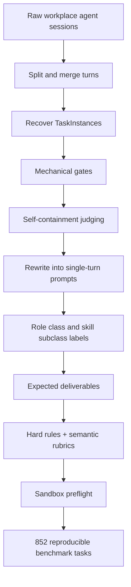
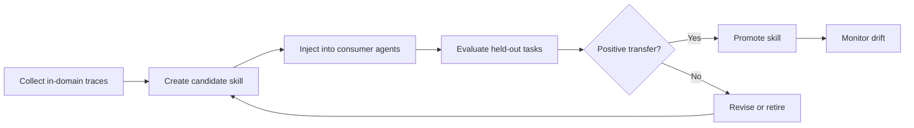
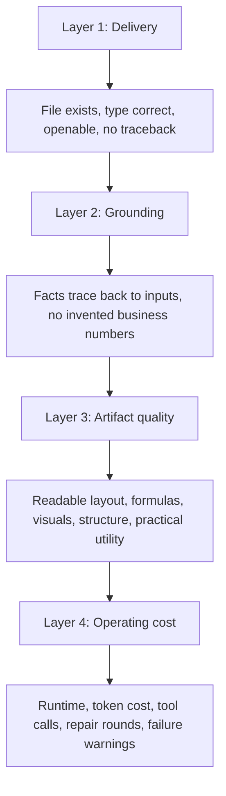

# EnterpriseClawBench：企业 Agent 评测不能再只问“哪个模型最强”

原文链接：[EnterpriseClawBench: Benchmarking Agents from Real Workplace Sessions](https://arxiv.org/abs/2606.23654)

项目页面：[EnterpriseClawBench leaderboard](https://frontisai.github.io/EnterpriseClawBench/)

代码仓库：[FrontisAI/EnterpriseClawBench](https://github.com/FrontisAI/EnterpriseClawBench)

发布时间：2026-06-22

类别：大模型 Agent / 企业工作流评测 / artifact-centric benchmark

### TL;DR

- 这篇论文要解决的问题不是“再做一个 agent 排行榜”，而是指出：**企业 agent 的真实任务由文件、工具、流程、产物、视觉质量、成本、运行时和 harness 共同决定，不能把结果压成单一模型分数**。
- EnterpriseClawBench 从真实企业 agent session archive 出发，经过切分、合并、fixture 恢复、脱敏恢复、网络依赖检查、自包含判断、prompt 重写、role/skill taxonomy、hard rules 和语义 rubric，得到 **852 个可复现任务**。
- 由于原始企业数据包含内部会话、附件、工具 trace 和业务产物，完整 benchmark 数据不公开；论文公开的是可复用的 **construction protocol、evaluation harness、judge routing、leaderboard 与 smoke-test 示例**。
- 手工审计的 **120-task Lite subset** 上，最佳组合只有 **0.663**，来自 Codex + GPT-5.5，说明企业 artifact 任务远未饱和。
- 论文最关键的实验结论是：排名由 **harness-model coupling** 强烈塑造。同一个 Claude-family 模型在 Claude Code、DeepAgents、OpenClaw 中可保持 0.62-0.64 区间，但在 Hermes 下跌到 0.458，提示评测必须报告 harness + model，而不是只报告 model。
- 全量 852 任务的 scalability check 中，DeepAgents/GPT-5.5 得分 **0.766**，Sonnet 4.6 为 **0.749**，Haiku 4.5 为 **0.632**，GPT-4.1-mini 为 **0.336**；这个排序和 Lite 子集大体一致。
- 局限同样重要：数据来自单一企业部署，完整数据不能公开；视觉 judge 与 human audit 的相关性很弱，尤其 visual split Spearman 为 **-0.259**，说明多模态产物评测还很不稳定。

### 1. 研究问题：企业 Agent 的“真实任务”到底难在哪里？

企业 agent 任务和标准网页 QA、单轮代码修复、纯文本问答不一样。

- 输入不是一段 prompt，而是混合材料：
  - Excel、PDF、网页、截图、邮件、文档；
  - 内部链接和工具页面；
  - 业务上下文和组织约定；
  - 多个互相引用的附件。
- 输出也不是一句答案，而是可交付 artifact：
  - slide deck；
  - spreadsheet；
  - HTML 页面；
  - JSON / code；
  - report；
  - 多文件组合。
- 成功标准不是“语义差不多”，而是多维组合：
  - 文件是否存在；
  - 类型是否正确；
  - 能否打开；
  - 是否有 traceback；
  - 是否替换了占位符；
  - 内容是否 grounded；
  - 视觉布局是否可用；
  - 是否符合业务任务的交付意图。

论文因此把问题重写成：

| 传统评测问法 | EnterpriseClawBench 的问法 |
|---|---|
| 哪个模型分数最高？ | 哪个 harness-model 组合能稳定交付企业 artifact？ |
| 输出文本是否正确？ | 产物文件、视觉质量、业务相关性和可用性是否同时达标？ |
| benchmark 是否公开？ | 如果真实企业数据不能公开，构建协议和评测协议能否复用？ |
| 单任务 skill 是否有效？ | 从同一任务类别蒸馏的 skill 能否迁移到 held-out 任务？ |
| 一次性 score 是否足够？ | 成本、runtime、tool call、warnings 和 score 之间是什么关系？ |

这篇论文的核心价值在这里：它把 agent 评测从“模型能力排序”推进到“企业工作流系统评估”。

### 2. 论文主张与论证路线

作者的主张可以拆成四条。

| Claim | Mechanism | Evidence | Boundary |
|---|---|---|---|
| 企业 agent benchmark 应来自真实 workplace sessions | 从内部 session archive 恢复 task、fixture、prompt、artifact 和 rubric | 5,291 个 raw TaskInstances 被过滤成 852 个 final tasks | 完整数据因隐私不能公开，外部只能复用协议 |
| 评测必须报告 harness-model 组合 | 同时跑 Claude Code、Codex、DeepAgents、Hermes、OpenClaw 等 harness 与多种模型 | Lite 上最佳为 Codex/GPT-5.5 的 0.663；Claude-family 在 Hermes 下明显掉分 | harness 版本、权限策略、sandbox 约束会影响结果 |
| artifact-centric evaluation 需要 hard rules + semantic judges | hard rules 检查文件属性；text/visual judge 评价质量 | 评价维度覆盖 grounded accuracy、task relevance、depth、utility、communication | visual judge 校准仍弱，human correlation 显示不稳定 |
| skill 应作为 task-class transfer 来测 | 从 frontend page generation 的 in-domain traces 蒸馏 skill，再注入 consumer 测 held-out tasks | GPT-5.5 作为 skill creator 平均 +0.0681；Haiku 4.5 平均 -0.0941 | 只覆盖一个 subclass，skill 效果高方差 |

这条论证路线不是“我们有一个更大 benchmark”，而是：

1. 企业任务必须来自真实 session，才包含真实 artifact 需求。
2. 真实数据不可发布，所以协议比数据本身更可复用。
3. 企业 agent 的得分不是模型属性，而是 harness-model-artifact-judge 的组合属性。
4. 如果企业组织真的把 skills 当资产，skill evaluation 必须测迁移，而不是只看单题加分。

### 3. Benchmark 构建：从噪声会话到可复现任务

EnterpriseClawBench 的 pipeline 是全文最值得细读的部分。



每一层 gate 都在解决企业数据的一个现实问题。

| Pipeline 阶段 | 要解决的问题 |
|---|---|
| split / merge turns | 原始 session 不是天然的一题一例，可能跨多个回合 |
| fixture lookup | 任务依赖的附件、文件、输入材料必须找回 |
| redaction recovery | 脱敏内容要能恢复成可运行、可评测的安全版本 |
| network dependency check | 不能让任务依赖不可访问的内部网页或临时链接 |
| self-containment judge | 单题 prompt 必须包含完成任务所需信息 |
| prompt rewrite | 把真实会话改写成可复现单轮任务 |
| role / skill labeling | 后续才能按企业角色和任务类别分析 |
| hard rules | 文件类型、数量、非空、可打开等客观条件 |
| semantic rubrics | 评估内容是否准确、深入、可用、沟通清楚 |
| sandbox preflight | 上传输入、执行 agent、下载输出、judge routing 都要可运行 |

数量变化：

| 阶段 | 数量 |
|---|---:|
| Raw TaskInstances | 5,291 |
| Final benchmark tasks | 852 |
| Lite manually audited subset | 120 |

这个漏斗说明两个事实。

- 企业真实 session 非常脏：
  - 需要大量过滤、恢复、重写和审计；
  - 直接把 session 丢给 agent 做 benchmark 不可复现。
- 可复现任务只是原始需求的一部分：
  - 被过滤掉的可能不是“不重要任务”；
  - 而是当前协议下无法稳定评测的任务。

### 4. 任务分类：为什么 role-class 和 skill-subclass 很关键？

论文把任务组织成 role class 与 role-specific skill subclass。

核心统计：

- 7 个明确 role classes；
- 45 个 role-specific skill subclasses；
- 输入和输出文件类型都高度异质；
- expected deliverables 数量超过 852，因为部分任务要求多个产物。

这不是简单的标签工程。

它带来三个评测能力：

1. **角色难度分析**
   - 产品/项目、工程/IT 任务占比较大；
   - finance、marketing、sales、executive、HR/admin 构成长尾；
   - 不同模型在不同企业角色上的弱点不同。
2. **artifact-type 分析**
   - HTML、code/JSON、spreadsheet、presentation、PDF 等格式会改变排名；
   - 视觉产物的 judge 可能产生分数膨胀。
3. **skill transfer 评测**
   - skill 不再是某一道题的 prompt trick；
   - 而是某个 task class 的可迁移操作资产。

这点和企业落地强相关。

- 企业不会只问“某个模型会不会做一道题”；
- 更关心“一个部门的一类任务能否被稳定提炼成流程、规范和 skill”。

### 5. Evaluation harness：为什么不能只报告模型名？

EnterpriseClawBench 评估的是 harness-model combinations。

论文覆盖的 harness 包括：

- Claude Code；
- Codex；
- DeepAgents；
- Hermes；
- OpenClaw。

覆盖的模型包括：

- GPT-5.5；
- Sonnet 4.6；
- Opus 4.6；
- Haiku 4.5；
- Kimi K2.6；
- MiniMax-M3；
- GPT-4.1-mini；
- Qwen3-235B-A22B；
- DeepSeek V4 Pro。

runner 记录的不只是 score。

| 记录项 | 为什么重要 |
|---|---|
| completion | 任务是否完成 |
| runtime | 企业执行成本和等待时间 |
| token use | 成本与可扩展性 |
| monetary cost | 部署预算 |
| tool calls | harness 是否允许充分探索环境 |
| evidence warnings | 产物或 trace 是否有风险信号 |
| output files | artifact 是否真的交付 |
| temporary files | 是否产生无关噪声 |

这就是论文的一个核心判断：agent benchmark 不能只写“GPT-5.5 得分多少”，而要写“Codex/GPT-5.5 在这个 harness、sandbox、judge routing 和 artifact protocol 下得分多少”。

### 6. Scoring：hard rules 与 semantic judges 的双层结构

评分分两层。

#### 6.1 Hard rules

Hard rules 检查 objective delivery。

- 必须产出某种文件类型；
- 文件数量正确；
- 文件非空；
- 能打开；
- 没有 traceback；
- 没有未替换 placeholder；
- 必要输出在 `/workspace/outputs` 里稳定存在。

这些规则解决的是“交付物是否存在且基本可用”。

#### 6.2 Semantic judges

Semantic judge 评价五个维度。

| 维度 | 问题 |
|---|---|
| grounded accuracy | 是否忠实于输入资料 |
| task relevance | 是否回答了任务 |
| substantive depth | 是否有足够实质内容 |
| practical utility | 是否能被业务使用 |
| communication quality | 表达与结构是否清晰 |

路由按模态区分。

- 文本可抽取输出：
  - 走 text judge。
- HTML、slides、PDF、spreadsheets、images：
  - 渲染成 screenshot 或 page image；
  - 走 visual judge。

这个设计很贴近企业 artifact。

- 一个 spreadsheet 可能公式正确但视觉混乱；
- 一个 slide deck 可能排版好但事实错误；
- 一个 HTML 页面可能能打开但没有完成业务约束。

因此 hard rules 和 semantic judges 必须共同存在。

### 7. 主结果：120-task Lite 仍远未饱和

论文的主 leaderboard 使用手工审计的 120-task Lite subset。

最重要的结论：

- 最佳组合：Codex + GPT-5.5；
- 得分：0.663；
- 含义：即使强模型和强 harness，企业 artifact 任务仍有大量未解决空间。

这和许多 public benchmark 的饱和状态形成对比。

| benchmark 维度 | 常见 public agent benchmark | EnterpriseClawBench |
|---|---|---|
| 任务来源 | 人工编写或公开环境 | 真实企业 session |
| 输出 | 常常是文本或代码补丁 | 多种业务 artifact |
| 成功标准 | 单一 pass / score | hard rules + text/visual semantic score |
| 系统变量 | 常突出模型 | 强调 harness-model coupling |
| 成本报告 | 经常缺失 | 报告 cost / time |
| skill eval | 少见或单题级 | task-class transfer |

Lite 子集的意义不是“少量任务足够”，而是：

- 120 个任务经过手工审计；
- 适合做主 leaderboard；
- 852 全量集用于自动 pipeline 的 scalability check。

### 8. Harness-model interaction：最值得工程团队警惕的结果

论文明确指出：leaderboard 受 model-harness coupling 强烈影响。

最典型例子是 Claude-family under Hermes。

| 观察 | 解释 |
|---|---|
| Sonnet 4.6 在 Claude Code、DeepAgents、OpenClaw 中约 0.62-0.64 | harness 允许它充分执行环境探查、脚本运行和多步修复 |
| Sonnet 4.6 在 Hermes 下跌到 0.458 | runtime approval、delegation 或 trace 截断打断了 artifact-writing loop |
| 同模型在其他 harness 能完成同类任务 | 这更像 harness compatibility 问题，不是模型单独能力问题 |

这个结果对 agent 平台非常关键。

- 模型需要主动探测环境；
- 需要执行脚本；
- 需要读取失败信息；
- 需要修复 artifact；
- 需要把最终文件稳定写到输出目录。

如果 harness 在这些地方过度阻断或路由错误，强模型也会掉分。

这也解释了为什么企业评测不能只说“我们接入了某个 frontier model”。

- frontier model 只是 agent system 的一部分；
- harness 的权限模型、工具接口、文件输出约定、trace 管理和错误恢复同样是能力。

### 9. 成本、角色与 artifact 类型：分数背后的结构

#### 9.1 成本-分数关系不是线性的

论文观察到 cost-score scatter 呈现类似 log-like 的形状。

- 从低成本系统到中等成本系统：
  - 分数提升明显；
  - 更强模型和更完整工具调用带来可靠性收益。
- 从中等成本到更高成本：
  - 边际收益下降；
  - 高成本不保证高分。
- Hermes/Claude-family 是异常点：
  - 模型成本高；
  - score 没有相应提高；
  - 原因是 harness mismatch。

可以用一个简化关系表达：

```text
Score ~= f(model_capability, harness_fit, artifact_type, judge_route, cost_budget)
```

其中 `model_capability` 不是唯一主变量。

| 变量 | 影响 |
|---|---|
| `model_capability` | 语言、规划、视觉、代码与工具使用能力 |
| `harness_fit` | 权限、工具、输出目录、trace、恢复机制 |
| `artifact_type` | spreadsheet、HTML、slide、PDF 的难度不同 |
| `judge_route` | text judge 与 visual judge 校准不同 |
| `cost_budget` | 允许多少工具调用、修复轮次和模型调用 |

#### 9.2 Role-class effects

论文发现 GPT-5.5 是更稳的 generalist。

但不同角色难度差异明显。

- marketing 更难；
- finance / operations 更难；
- 这些任务经常结合：
  - 重文档理解；
  - 数据校准；
  - 公司特定 convention；
  - 复杂展示产物。

可能原因：

- 公开数据里这类企业内部任务更少；
- 模型知道通用表达，但不一定知道公司语境；
- artifact 既要内容准确，又要符合业务呈现习惯。

#### 9.3 Artifact-type effects

交付格式会改变排序。

- GPT-5.5 在 HTML、code/JSON 和 delivery-heavy categories 上强；
- Opus 4.6 在 spreadsheets 上强；
- spreadsheets 和 presentations 在视觉 judge 下可能出现分数膨胀。

这说明 benchmark 需要同时报告 artifact type。

- 一个系统可能擅长网页；
- 另一个系统可能擅长表格；
- 平均分会掩盖这种结构性差异。

### 10. 全量 852 任务 scalability check

论文在 852-task set 上跑了四个 DeepAgents 组合。

| Model | Score | Text | Visual | Rule |
|---|---:|---:|---:|---:|
| GPT-5.5 | 0.766 | 0.813 | 0.642 | 0.959 |
| Sonnet 4.6 | 0.749 | 0.793 | 0.634 | 0.957 |
| Haiku 4.5 | 0.632 | 0.666 | 0.542 | 0.963 |
| GPT-4.1-mini | 0.336 | 0.383 | 0.213 | 0.817 |

这个表支撑两个结论。

1. 自动构建出的 852-task full set 保留了主 leaderboard 的大体排序。
   - GPT-5.5 仍最强；
   - Sonnet 4.6 接近；
   - Haiku 中等；
   - GPT-4.1-mini 明显弱。
2. Rule 分数不等于整体质量。
   - Haiku 的 Rule 为 0.963，略高于 GPT-5.5 的 0.959；
   - 但整体 Score 明显低；
   - 说明“交付了文件”不等于“交付了好文件”。

这正是 artifact-centric benchmark 的必要性。

- rule 层保证存在性；
- semantic 层保证质量；
- text / visual 拆开才能看出模型弱点。

### 11. Skill evaluation：企业 skills 应该按任务类别迁移来测

EnterpriseClawBench 还做了一个很有意思的 skill injection 实验。

设置：

- 选择一个 subclass：frontend page generation；
- 每个 consumer agent 先跑 10 个 in-domain tasks；
- 收集 execution traces、delivered artifacts、Sonnet 4.6 judge feedback；
- skill creator 基于这些材料蒸馏 agent-specific skill；
- 把 skill 注入同一个 consumer agent；
- 在 5 个 held-out 同类任务上评估 no-skill 到 skill-injected 的分数变化。

核心结果：

| Creator model | 平均影响 |
|---|---:|
| GPT-5.5 | +0.0681 |
| Kimi K2.6 | +0.0518 |
| Haiku 4.5 | -0.0941 |

论文强调两个关系。

1. Skill-creation ability 不等于 skill-consumption ability。
   - Haiku 4.5 作为 creator 弱；
   - 但 DeepAgents/Haiku 4.5 作为 consumer 可以从部分 skills 中受益。
2. 强 consumer 也会受 creator 质量影响。
   - Codex/GPT-5.5 在三个 creator 下都提升；
   - Hermes/Kimi K2.6 与 OpenClaw/Kimi K2.6 会被 Haiku-created skill 伤害。

这个实验对企业 agent 平台的启发很直接。

- skill 不能只看“写得像不像规范”；
- 必须看它对 held-out 同类任务的迁移；
- 应该报告 creator-consumer matrix；
- 弱 skill 可能降低强 agent 表现。

### 12. Judge reliability：视觉产物评测仍是薄弱环节

论文做了 LLM judge ablation 与 human calibration audit。

LLM-LLM 相关性：

- GPT-5.4-text 与 Sonnet 4.6 text judge：
  - Spearman `rho = 0.918`；
  - 覆盖 1,853 个 case。
- GPT-5.4-visual 与 Sonnet 4.6 visual judge：
  - Spearman `rho = 0.866`；
  - 覆盖 1,428 个 case。

但 human calibration audit 更谨慎。

| Scope | n | Human mean | Sonnet mean | MAE | Spearman |
|---|---:|---:|---:|---:|---:|
| Overall | 48 | 0.571 | 0.498 | 0.219 | 0.263 |
| Text | 24 | 0.476 | 0.504 | 0.134 | 0.790 |
| Visual | 24 | 0.666 | 0.492 | 0.303 | -0.259 |

这张表很重要。

- Text judge 与人类排序较一致；
- Visual judge 与人类排序不稳定；
- Visual MAE 也更高；
- Overall Spearman 只有 0.263。

因此，EnterpriseClawBench 虽然强调 visual artifact，但也承认视觉评测还不成熟。

这对后续研究提出了明确问题：

- 多页 PDF 如何按任务要求评分？
- slide deck 的版式、事实、层级、信息密度如何权衡？
- spreadsheet 的公式正确性、视觉布局、业务可用性如何同时判？
- LLM visual judge 的绝对分数能否跨 judge 混用？

论文给出的答案是否定的：不同 judge 的绝对分数不能混用；更强 judge 往往更保守；中间排名最不稳定。

### 13. 和相关 benchmark 的位置关系

论文把 EnterpriseClawBench 和已有 benchmark 做了定位。

| Benchmark | Tasks | Real-source | Artifact types | Multimodal | Skill eval | Cost/time | Reported combos |
|---|---:|---|---|---|---|---|---:|
| Workspace-Bench | 388/100 | Yes | Many | Yes | No | Partly | 28 |
| EnterpriseBench | 500 | No | N/A | No | No | Partly | 10 |
| WildClawBench | 60 | No | Many | Yes | Yes | Yes | 31 |
| ClawBench | 153 | No | N/A | Yes | No | No | 7 |
| Claw-SWE-Bench | 350/80 | Yes | N/A | No | No | Partly | 17 |
| SkillsBench | 87 | No | Many | Yes | Yes | Partly | 18 |
| EnterpriseClawBench | 852/120 | Yes | Many | Yes | Yes | Yes | 32 |

这个表说明它的差异化位置。

- 它不是第一个 workspace/enterprise benchmark；
- 也不是第一个 multimodal artifact benchmark；
- 它的组合特点是：
  - real-source；
  - artifact-centric；
  - cost/time；
  - harness-model combos；
  - task-class skill transfer；
  - 852 full + 120 Lite。

最值得讨论的是数据不可发布的问题。

- 从科学复现角度，这是明显限制；
- 从企业隐私角度，这是合理边界；
- 因此作者把可复用贡献放在协议、taxonomy、harness 和 judge calibration 上。

### 14. 局限：这篇论文哪些结论不能外推？

#### 14.1 单一企业部署

数据来自一个企业 deployment。

这意味着：

- 角色分布可能不代表所有公司；
- 内部工具链会影响任务形态；
- 中文/英文、行业、组织流程都可能有偏差；
- benchmark 中的 artifact 类型不等于所有企业需求。

#### 14.2 完整数据不发布

论文明确说明不发布 full benchmark data，因为包含：

- internal sessions；
- attachments；
- tool traces；
- business artifacts。

这会限制外部独立复现。

外部研究者能复用的是：

- pipeline；
- harness；
- leaderboard protocol；
- public smoke tests；
- taxonomy 思路；
- judge routing 设计。

#### 14.3 LLM judge 仍不够可靠

尤其 visual artifacts。

- Human audit 的 visual Spearman 是负数；
- visual MAE 高于 text；
- spreadsheet/presentation 可能有 score inflation。

这意味着所有视觉任务分数都应该带校准语境阅读。

#### 14.4 Skill 实验范围有限

skill injection 只在 frontend page generation subclass 上做。

因此不能直接推出：

- skills 对 finance spreadsheet 是否同样有效；
- skills 对 PPT / PDF / code artifact 是否同样有效；
- creator-consumer matrix 是否跨任务类别稳定。

但它提出了正确的评测形式：按 task class 做 held-out transfer，而不是单题 prompt improvement。

### 15. 对 Agent 研究的启发

#### 15.1 Agent 评测要从 model leaderboard 变成 system leaderboard

EnterpriseClawBench 强迫我们区分：

- model；
- harness；
- sandbox；
- tool permissions；
- artifact protocol；
- judge route；
- cost budget；
- skill layer。

一个系统得分可以写成：

```text
S = w_rule * S_rule
  + w_text * S_text
  + w_visual * S_visual
  - w_cost * C
  - w_time * T
  - w_warning * W
```

变量解释：

| 变量 | 含义 |
|---|---|
| `S_rule` | 文件交付和硬规则得分 |
| `S_text` | 文本语义质量 |
| `S_visual` | 视觉 artifact 质量 |
| `C` | 成本 |
| `T` | 运行时间 |
| `W` | evidence warnings 或执行异常 |

实际部署中，各企业可以调整权重。

- 财务报告可能更重 accuracy；
- marketing 页面可能更重 visual；
- CI 自动化可能更重 runtime 和 deterministic output；
- 高风险业务可能更重 warnings。

#### 15.2 Harness 设计是能力，不是包装

论文的 Hermes 例子说明：

- approval checks；
- delegation；
- trace truncation；
- output directory policy；
- sandbox 权限；
- script execution 能力；
- multi-step repair loop；

这些都能改变最终 score。

因此 agent 平台评估要把 harness 当成一等对象。

#### 15.3 Skill 应该有生命周期

企业 skills 不能只靠人工感觉好不好。

一个更严格的 skill 生命周期应包括：



EnterpriseClawBench 的 matrix 只是一个开端，但方向正确：

- skill creator 质量要测；
- consumer 适配性要测；
- 负迁移要测；
- 不同 task class 要分开测。

### 16. 结论

EnterpriseClawBench 的价值不在于给出一个最终排名，而在于改变了企业 agent 评测的基本单位。

最重要的结论有五个。

1. 企业 agent 任务应以真实 workplace sessions 为源头，但要经过严格可复现 pipeline。
2. 评测对象应是 harness-model combination，而不是孤立模型。
3. Artifact delivery 需要 hard rules、text judge、visual judge 和成本/runtime 一起报告。
4. 120-task Lite 上最佳只有 0.663，说明企业 artifact agent 仍远未饱和。
5. Skill evaluation 应按 task-class held-out transfer 做，而不是把 skill 当单题 prompt。

它的局限也同样清楚。

- 单企业数据；
- 数据不可公开；
- visual judge 不稳定；
- skill 实验范围有限。

但从研究者视角看，这篇论文提供了一个很重要的方向：未来 agent benchmark 不应只追求更难题目，而应更像真实企业系统验收，报告产物、流程、成本、工具、视觉质量、技能迁移和系统耦合。只有这样，agent 评测才会从“模型榜单”变成“可部署系统的诊断工具”。

### 17. 更细读一层：为什么 construction protocol 比公开数据更重要？

这篇论文最容易被误读的地方是：完整数据不公开，所以贡献是否变弱？

我的判断是：科学复现确实受损，但方法论贡献并没有消失。

原因在于企业 agent 评测会长期面对同一个张力：

- 数据越真实，越可能包含内部业务信息、客户材料、员工行为、工具 trace 和商业策略；
- 数据越可公开，越可能被清洗成不像真实企业任务的“模拟题”；
- 如果只追求公开性，就会把评测重新推回 public web、toy workspace 或人工编写任务。

EnterpriseClawBench 的回答是公开协议，而不是公开全部样本。

这个选择至少保留了三类可复用资产。

| 可复用资产 | 复用方式 |
|---|---|
| Task recovery pipeline | 其他企业可以从自己的 agent sessions 恢复任务，而不是照搬数据 |
| Role / skill taxonomy | 可以对照自己的组织角色重建 task-class 结构 |
| Evaluation harness | 可以用同样的 hard rules、judge routing、artifact capture 和成本记录方式验收系统 |

这让 benchmark 从“公共排行榜”变成“企业内部可执行审计流程”。

对研究社区而言，它不如完整开放数据理想；对企业 agent 平台而言，它更接近未来真实评测形态。

### 18. 任务重写与 rubric 的隐含难点

从真实 session 到 benchmark prompt，中间不是简单脱敏。

真实 session 里经常有这些问题：

- 用户只说“按刚才那份材料整理一下”，但 benchmark 需要恢复“刚才那份材料”；
- 原始链接可能指向内部系统，外部环境不可访问；
- agent 输出可能依赖已经打开的页面、缓存文件或历史上下文；
- 用户的成功标准隐含在组织习惯里，而不是写在 prompt 中；
- 最终产物可能在多个文件之间分散，不能只看 chat response。

因此 prompt rewrite 不是润色，而是把隐式上下文显式化。

一个合格的 EnterpriseClawBench task 至少要满足：

1. 输入材料可上传；
2. 任务目标可单轮理解；
3. 交付物类型清楚；
4. hard rules 可机械检查；
5. semantic rubric 能解释什么叫好；
6. judge 能拿到足够 evidence；
7. agent 的输出文件能从 sandbox 中下载。

这也是为什么作者要做 sandbox preflight。

如果某个任务在人工看来很真实，但无法上传输入、无法稳定执行、无法下载产物或无法路由 judge，它就不是一个好 benchmark item。

### 19. 为什么 Lite 子集和 full set 要分开读？

论文同时使用 120-task Lite 和 852-task full set，这不是重复。

二者承担不同证据功能。

| 子集 | 作用 | 读法 |
|---|---|---|
| 120-task Lite | 手工审计，主排行榜更可信 | 用来比较 32 个 harness-model 组合 |
| 852-task full | 自动 pipeline 的规模验证 | 用来确认构建流程没有只在小样本上成立 |

如果只看 Lite：

- 质量更高；
- 但可能担心样本太少、筛选偏差大。

如果只看 full：

- 覆盖更广；
- 但自动构建和 judge 噪声更大。

论文把两者结合起来：

- Lite 证明主结论；
- full set 证明 ranking trend 和 unsaturated 性质在更大规模上仍能看到；
- 这比单独报一个大而粗的 leaderboard 更稳。

### 20. 对后续 benchmark 设计的具体建议

基于这篇论文，我认为后续企业 agent benchmark 至少应该报告以下字段。

| 字段 | 为什么必须报告 |
|---|---|
| Harness name and version | 同模型在不同 harness 下会显著变动 |
| Model name and decoding / tool policy | 否则无法解释能力和成本 |
| Sandbox permission profile | 权限不足会让任务失败，权限过大又改变安全边界 |
| Expected artifact schema | 不同文件类型需要不同 judge 和 hard rules |
| Text / visual / rule split score | 平均分会掩盖失败模式 |
| Runtime and cost | 企业部署一定关心预算和延迟 |
| Tool calls and repair rounds | 能体现 agent 是否真正探索并修复 |
| Judge identity and calibration | 不同 judge 绝对分数不可混用 |
| Human audit sample | 尤其用于校准 visual artifacts |
| Skill creator / consumer matrix | skill 是系统资产，不是单模型属性 |

这个字段清单看起来繁琐，但正是企业 agent 和普通聊天模型评测的分界线。

普通模型评测可以只问答案是否正确；企业 agent 评测必须问交付物是否稳定、是否可打开、是否符合业务约束、成本是否可接受、系统失败时能否定位到 harness、model、judge、tool 或 skill 的哪一层。

### 21. 一个更实用的验收框架

如果把 EnterpriseClawBench 的思想落到企业内部，可以形成四层验收。



这四层可以帮助解释失败。

- Delivery 失败：
  - 多半是 harness、权限、路径或输出协议问题。
- Grounding 失败：
  - 多半是检索、文件读取、上下文管理或模型理解问题。
- Artifact quality 失败：
  - 多半是格式生成、视觉排版、表格公式或信息设计问题。
- Operating cost 失败：
  - 多半是工具调用过多、模型太贵、反复修复或 judge 过慢。

这个分层比单一 score 更接近工程调试。

### 22. 研究者视角的最后判断

EnterpriseClawBench 提醒我们，agent 的能力不是悬浮在模型参数里的抽象能力，而是在具体工作系统里表现出来的执行能力。

一个 agent 之所以能交付企业任务，至少依赖：

- 模型是否能规划；
- harness 是否允许执行；
- 文件系统是否稳定；
- 工具调用是否可观测；
- 输出目录是否有约定；
- judge 是否能评估目标模态；
- skill 是否真的迁移；
- 成本是否可接受。

这也是为什么 0.663 的最佳 Lite 分数反而有价值。

它说明真实企业 artifact 任务还有很大空间，尤其是在多文件、多模态、长上下文、业务约束和系统耦合上。下一阶段 agent 研究如果只继续刷公开网页任务或纯代码补丁，很可能会错过企业部署中最常见、也最难诊断的失败模式。
