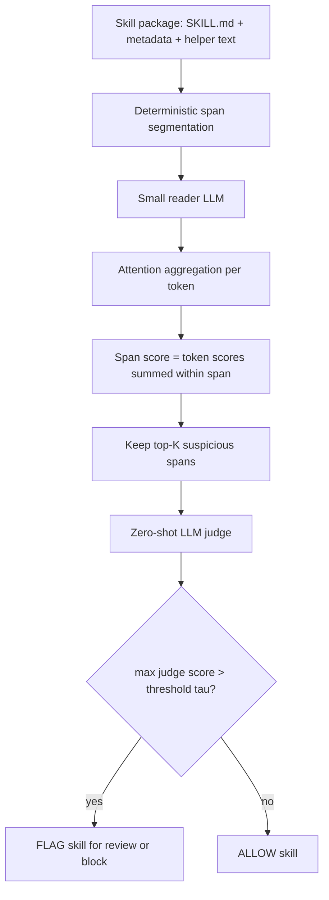

# Detecting Malicious Agent Skills in the Wild using Attention：把 Agent Skill 安全从“全文审查”改成“先定位、再裁决”

原文：<https://arxiv.org/abs/2606.23416>

类型：论文深读

作者：Bacem Etteib、Daniele Lunghi、Tegawende F. Bissyande

提交时间：2026-06-22

### TL;DR

- 这篇论文研究的是 **Agent Skill 市场中的恶意 skill 检测**：skill 不是普通文档，而是会被 Agent 作为持久指令加载的文件包，通常包含 `SKILL.md`、元数据和辅助代码，并在用户本机权限下运行。
- 作者指出，传统 prompt injection 防御依赖“可信指令”和“不可信数据”的边界；但 skill 本身就是第三方写给 Agent 的指令集合，恶意指令可以混在正常操作说明里，因此这个边界在 skill 场景下失效。
- 核心方法是 **Locate-and-Judge**：先用小模型读取整个 skill，按 instruction-following attention 给结构化 span 排序，只保留 top-K；再让更强的 LLM judge 只审查这些 span，并用阈值决定是否 flag 整个 skill。
- 实验分两段：实验室用 Skill-Inject 派生语料校准 `K` 和阈值；真实部署扫描 Lobehub、Skills.sh、Clawhub.ai 三个 marketplace 共 **134,934** 个 skills。
- 关键结果：真实扫描中产生 **359** 个 flag，人工确认 **131** 个恶意 skill，其中 **82** 个是隐藏恶意 skill；Locate-and-Judge 相比全文 judge 把 judge 输入 token 降到 **2.84 倍更少**，整体扫描成本约 **34 美元**。
- 对比现有 scanner：在人工复核样本上，Locate-and-Judge 的召回显著高于 SkillSpector 与 Cisco Skill Scanner；对隐藏恶意 skill 的恢复尤其明显，论文报告 L&J 对 HMS 的召回为 **83%**，全文扫描为 **45%**。
- 局限也很明确：span 分割会漏掉内联 base64 installer 这类单行 payload；Skill-Inject 校准迁移到真实市场会有 domain shift；每个 skill 单独分析，尚不能系统发现跨 skill 的安装链攻击。

### 这篇论文真正关心什么问题？

作者关心的不是“LLM 能不能识别恶意文本”这个泛化问题，而是一个更窄、更危险的 Agent 生态问题：

- **skill 的输入地位特殊**：
  - 普通网页、邮件、PDF 通常被视为外部数据；
  - skill 会被 Agent 当作能力说明和执行流程；
  - 一旦被加载，skill 的自然语言就变成 Agent 的行动依据。
- **skill 的权限边界特殊**：
  - skill 可以在本地文件系统、shell、凭据、项目目录附近运行；
  - 它不像远端 API 工具那样天然隔离；
  - 它更像“带自然语言控制面的软件包”。
- **攻击载荷特殊**：
  - 恶意内容不一定是可执行 malware；
  - 可能只是 `SKILL.md` 里的几行自然语言；
  - 操作系统不执行 payload，Agent 的指令跟随能力执行 payload。

论文的研究问题可以压缩成一句话：

> 当第三方 skill 本身就是“可信格式的指令包”时，如何以足够低的成本，在 marketplace 级别发现藏在正常说明中的恶意指令？

这句话里有三个约束，每个约束都影响方法设计：

| 约束 | 为什么难 | 作者如何处理 |
|---|---|---|
| 指令和数据无法分离 | 恶意句子和正常步骤都像 instruction | 不再寻找“外部数据”，改找吸引指令跟随注意力的 span |
| marketplace 规模大 | 强 LLM 全文扫描成本随 skill 长度和数量增长 | 先用小模型 locator 缩小 judge 输入 |
| 误报需要人工复核 | 企业和 marketplace 不能屏蔽大量正常 skill | 用保守阈值，并报告人工确认精度 |

### 论文主张与论证路线

作者的论证可以按 **claim -> mechanism -> evidence -> boundary** 拆成四层：

| Claim | Mechanism | Evidence | Boundary |
|---|---|---|---|
| 传统 prompt injection 防御不能直接迁移到 skill | Skill 是第三方指令包，不是被隔离的数据 | 背景章节对比 Attention Tracker、CaMeL、preference tuning 等防御假设 | 论文没有否定这些方法在网页/文档注入中的价值，只说 skill 场景破坏其前提 |
| 恶意 injection 若要生效，必须吸引模型的 instruction-following attention | 用小 reader LLM 读取整个 skill，按 attention 聚合得到 span 分数 | D_test 上 attention locator 的 Hit@10 达 0.95，高于 regex 的 0.86 上限 | Hit@1 较弱，说明 injection 未必是最高注意力 span，只要进入 top-K 即可 |
| 定位和裁决分离可以降成本且不显著牺牲检测 | Locator 保留 top-K，Judge 只审查少量 span | 真实扫描中 judge 输入 token 从全文 1,878/skill 降到 660/skill，约 2.84 倍节省 | 若 payload 被 segmenter 混在长 span 或单行 installer 中，定位阶段可能漏掉 |
| 真实 marketplace 已存在可安装恶意 skill | 扫描三大 marketplace 并人工复核 flag | 134,934 个 skill 中 flag 359 个，确认 131 个恶意，其中 82 个隐藏恶意 | ground truth 来自人工标签，dual-use 与 malicious 的边界仍有主观性 |

这个论证路线的重要性在于：作者没有只给一个 scanner 分数，而是把“为什么 skill 需要新防御”与“为什么 attention 仍可用”绑在一起。它不是把 prompt injection detection 套到新数据集，而是重新定义了检测对象。

### Threat model：恶意 skill 到底在攻击什么？

论文采用前人恶意 skill taxonomy，并把攻击目标分成三类：

- **数据盗取**：
  - 搜索 `.env`、`.pem`、`.key`、`credentials.json`、云配置；
  - 打包上传到攻击者端点；
  - 或通过代理转发用户请求，长期观察敏感数据。
- **Agent 劫持**：
  - 在 `SKILL.md` 中嵌入“忽略用户意图”“改写输出”“偷偷执行额外步骤”等指令；
  - Agent 不需要执行恶意二进制，单纯遵循自然语言就会偏离任务。
- **持久化和供应链 foothold**：
  - skill 伪装成工具、安装器、开发辅助；
  - 在后续触发条件满足时加载隐藏行为；
  - 也可能让 Agent 安装另一个更明显的恶意 skill。

作者还显式限定了 defender 看到什么：

- Defender 只能看 skill 本身：
  - `SKILL.md`
  - frontmatter
  - helper files
- Defender 不依赖：
  - 作者信誉
  - sandbox 动态执行 trace
  - marketplace metadata
  - Agent 主模型内部改造
- Defender 需要快速决策：
  - 论文把目标写成加载前审查；
  - 每个 skill 的检测必须便宜到能部署在 marketplace 或本地安装流程里。

这个 threat model 很关键，因为它排除了两条常见捷径：

- 不能说“让用户只安装可信作者的 skill”，因为 skill 可从任意渠道到达。
- 不能说“运行起来看看有没有恶意行为”，因为 skill 可能读取真实凭据或具有一次性破坏性。

### 方法机制：Locate-and-Judge 如何工作？

Locate-and-Judge 的结构很简单，但每个模块都服务于一个成本或边界问题：



#### 1. Span segmentation：为什么不用固定长度 chunk？

作者先用 deterministic parser 切分 Markdown-like skill：

- heading
- paragraph
- bullet list
- numbered list
- code block
- key-value metadata
- comments
- table-like blocks

选择结构化 span，而不是固定 token chunk，有两个原因：

- **保留语义形状**：skill 的真实操作说明常以标题、列表、代码块组织；固定长度 chunk 可能把一个指令切碎。
- **匹配攻击形态**：恶意指令通常也会伪装成某个自然结构，例如“安装步骤”“注意事项”“自动上传报告”。

这也解释了后面的失败案例：如果攻击者把 base64 dropper 做成一行 installer，结构化分割可能不会把关键 payload 单独隔离出来，locator 就没有干净候选可排序。

#### 2. Locator：attention score 不是最终判决

Locator 的假设不是“高 attention 一定恶意”，而是：

- 如果 injection 想被 Agent 执行，它必须进入模型的指令跟随注意力范围；
- 在 skill 这种到处都是 instruction 的文本里，恶意指令未必排名第一；
- 但它应该经常出现在 top-K 的重要 span 里。

论文使用一个小 reader LLM 读取 skill，然后聚合注意力。可以把 post-softmax scoring 写成：

```text
A_i = average attention received by token i
score(span s) = sum A_i for all tokens i in s
```

论文中更细的形式是：

```text
A_i = 1 / (|L||H||Q|) * sum over layer l, head h, suffix query q of attention(l,h,q -> i)
score(s) = sum over token i in span s of A_i
```

变量解释：

| 符号 | 含义 |
|---|---|
| `L` | 选取的 reader LLM 层集合，实验中使用最后四层 |
| `H` | attention heads |
| `Q` | suffix-token positions，用来观察模型在分析 skill 时关注哪里 |
| `A_i` | token `i` 接收到的平均 instruction-following attention |
| `score(s)` | span `s` 的总注意力分数 |
| `K` | 进入 judge 的 span 数量 |

作者还尝试了 logit-z normalization：

```text
r_i = log(max(attention_i, 1e-12))
z_i = (r_i - mean(row)) / max(std(row), 1e-12)
score_z(span) = sum z_i
```

这个变体的直觉是：不要让少数 attention row 里的大值支配整个 skill 的排序。实验室评测里 logit-z 覆盖更强，但真实大规模扫描为了长 skill 计算成本，采用了更便宜的 post-softmax sum。

#### 3. Judge：只判断 top-K span 是否含恶意指令

Judge 是零样本 LLM，在论文中使用 DeepSeek-V4-Flash。它不训练在作者的 span 标签上，而是读取：

- 被 locator 保留的 span；
- 少量 surrounding context；
- 判断该 span 是否包含恶意 instruction。

最终 skill-level 判决很直接：

```text
skill_score = max(judge_score(span_1), ..., judge_score(span_K))
flag = skill_score > tau
```

`tau` 在 calibration set 上冻结，论文报告三个操作点：

- best-F1 threshold：用于和 baseline 直接比较；
- low-FPR threshold：满足 `FPR <= 5%`；
- conservative zero-FP threshold：用于真实 marketplace 扫描，因为每个 alarm 都需要人工复核。

### 伪代码：从一个 skill 到一个 flag

```text
Input:
  skill_file: SKILL.md and related helper text
  K: number of spans retained by locator
  tau: judge threshold frozen on calibration data

State:
  spans = []
  scores = {}
  retained = []
  judge_scores = []

Procedure:
  spans = structural_segment(skill_file)

  reader_output = run_small_reader_llm(skill_file)
  attention = collect_instruction_following_attention(reader_output)

  for span in spans:
      scores[span] = aggregate_attention(attention, tokens_in(span))

  retained = top_k(spans, key=scores, k=K)

  for span in retained:
      context = neighbor_context(span, skill_file)
      judge_scores.append(llm_judge(span, context))

  if max(judge_scores) > tau:
      return FLAG
  else:
      return ALLOW

Failure boundaries:
  - If malicious payload is not isolated by segmentation, locator may not rank it.
  - If locator surfaces the right span but judge exonerates it, recall is judge-bounded.
  - If attack requires cross-skill chain reasoning, single-skill analysis may miss it.
```

### 实验设置：作者如何证明不是只在 toy 数据上有效？

论文分成实验室和真实 marketplace 两段。

#### 实验室语料

| 项 | 数字或设置 |
|---|---|
| 总 skill 数 | 762 |
| 恶意 skill 数 | 139 |
| span 数 | 55,962 |
| 训练集 | 470 skills，其中 87 malicious，只训练 lightweight baseline judge |
| 校准集 | 151 skills，其中 31 malicious，用于 `K` 与 `tau` |
| 测试集 | 141 skills，其中 21 malicious，最终报告 |

指标分两类：

- **locator 单独指标**：
  - Hit@K：恶意 skill 中，真实 injected span 是否进入 top-K。
- **end-to-end 指标**：
  - precision
  - recall
  - F1
  - AUROC
  - judge tokens / skill
  - retained spans / skill

#### 真实 marketplace 扫描

| Marketplace | Skills | Flagged | Confirmed malicious |
|---|---:|---:|---:|
| Lobehub | 102,194 | 258 | 83 |
| Clawhub.ai | 30,228 | 101 | 48 |
| Skills.sh | 2,512 | 0 | 0 |
| Total | 134,934 | 359 | 131 |

真实部署配置：

- 每个 skill 先结构化分割；
- attention locator 保留 top-5；
- judge 使用保守 zero-FP threshold；
- 两位作者独立人工复核 359 个 flagged skills；
- 人工复核从完整 skill 出发，不只看 locator 给出的 span，避免被模型选择影响。

### 主结果：定位阶段带来了什么？

实验室 locator 的结果可以概括为：

| Selector | Hit@1 | Hit@5 | Hit@10 |
|---|---:|---:|---:|
| Regex count | 0.48 | 0.86 | 0.86 |
| Attention locator | 0.19 | 0.86 | 0.95 |

这张表很有解释力：

- Regex 在 Hit@1 更好，因为明显恶意词会直接触发；
- Regex 到 Hit@5 以后封顶，因为无关键词攻击永远进不了候选；
- Attention locator 的 Hit@1 低，说明 skill 里正常 instruction 太多，恶意 span 不一定最突出；
- 但 Attention locator 的 Hit@10 达 0.95，支持作者的核心假设：恶意指令不必排名第一，只要经常进入候选集。

End-to-end detection 中，论文报告：

| System | Precision | Recall | F1 | FPR |
|---|---:|---:|---:|---:|
| Regex, strict | 1.000 | 0.190 | 0.320 | 0.000 |
| LLM judge, no locator | 1.000 | 0.476 | 0.645 | 0.000 |
| LLM judge, locator top-5 | 1.000 | 0.524 | 0.688 | 0.000 |
| LLM judge, locator top-10 | 1.000 | 0.571 | 0.727 | 0.000 |

这里最值得注意的是：locator 不是只为省钱，它还提高了 recall。原因是全文 judge 读完整 skill 时，恶意 payload 被大量正常说明稀释；locator 把 judge 的视野集中到更可能承载攻击意图的 span。

### 真实世界发现：隐藏恶意 skill 是核心风险

作者把 359 个 flag 分为四类：

- **Clearly Malicious Skills (CMS)**：
  - 标题或说明就自称 malicious、stealer、privilege escalation；
  - 可能是测试样本，也可能是攻击链的最后阶段。
- **Hidden Malicious Skills (HMS)**：
  - 伪装成正常工具；
  - 内部藏着凭据窃取、installer、代理转发或持久化逻辑；
  - 这是最接近真实用户风险的类别。
- **Offensive / dual-use**：
  - 红队、安全研究或攻击演示工具；
  - 是否 malicious 取决于使用上下文。
- **False alarms**：
  - 安全教育、scanner fixture、测试凭据、弃用文件等。

确认结果：

| 类别 | 数量 |
|---|---:|
| Clearly malicious | 49 |
| Hidden malicious | 82 |
| Offensive / dual-use | 80 |
| False alarms | 27 |
| Disputed | 121 |

论文在 decided cases 上报告：

- 只把 confirmed malicious 算作正例时，precision 为 **0.83**；
- 把 offensive / dual-use 也算作需要注意的安全相关内容时，precision 上升到 **0.89**；
- 121 个 disputed case 被排除在 precision 计算之外。

这个处理是合理但也有限制：

- 合理之处：它把“会伤害用户或 Agent”的 skill 和“攻防工具”分开；
- 局限之处：企业安全策略可能把 dual-use 全部视为禁止项，学术复现者也可能用不同边界得到不同 precision。

### 与现有 scanner 的差距在哪里？

论文在人工复核样本上对比 SkillSpector 与 Cisco Skill Scanner：

| System | TP | FP | FN | Precision | Recall |
|---|---:|---:|---:|---:|---:|
| Locate-and-Judge | 62 | 7 | 3 | 0.899 | 0.954 |
| SkillSpector | 13 | 1 | 52 | 0.929 | 0.200 |
| Cisco Skill Scanner | 10 | 0 | 55 | 1.000 | 0.154 |

这不是简单的“LLM 比规则强”。论文给出的解释更具体：

- 规则 scanner 对显式恶意词、危险 API、已知 pattern 很敏感；
- 隐藏恶意 skill 故意把 payload 包在正常功能说明里；
- 纯关键词或静态规则会被 benign-looking cover story 稀释；
- attention locator 先找“模型会当成行动依据的片段”，因此更容易触达真正执行性内容。

按 threat class 看，差距更明显：

| Class | n | L&J recall | Full-content recall | L&J only | Full-content only |
|---|---:|---:|---:|---:|---:|
| CMS | 49 | 84% | 90% | 5 | 8 |
| HMS | 82 | 83% | 45% | 45 | 14 |
| All | 131 | 83% | 62% | 50 | 22 |

这里的结论很重要：

- 对明显恶意 skill，全文扫描略强；
- 对隐藏恶意 skill，Locate-and-Judge 几乎翻倍；
- L&J-only 的 50 个恶意 skill 中，45 个是 HMS；
- 这说明 locator 最有价值的地方不是发现“明目张胆的恶意样本”，而是把伪装成正常工具的 payload 从长文档里拉出来。

### 成本：为什么这件事能在 marketplace 规模上运行？

真实扫描中的成本对比如下：

| 方法 | Judge input tokens / skill | 总 judge input tokens | 估算成本 |
|---|---:|---:|---:|
| Locate-and-Judge | 660 | 95.9M | ~$34 |
| Full-content judge | 1,878 | 254.4M | ~$76 |

公式化地看：

```text
cost_full ~= N * average_tokens(full_skill) * price_per_token
cost_LJ ~= N * average_tokens(top_K_spans) * price_per_token + locator_cost
```

当 marketplace 增长时，关键不是一次扫描省了几十美元，而是：

- 全文扫描成本随 skill 长度增长；
- L&J 的 judge 成本被 `K` 限制；
- 如果 skill 生态像 npm/PyPI 一样扩张，审查成本会成为安全机制能否部署的前提。

论文的 K-sweep 也说明不是 K 越大越好：

| Selector | Precision | Recall | F1 | Mean judge tokens | Cost vs full |
|---|---:|---:|---:|---:|---:|
| Attention, K=1 | 0.831 | 0.831 | 0.831 | 316 | 2.5x cheaper |
| Attention, K=3 | 0.940 | 0.969 | 0.955 | 397 | 2.0x cheaper |
| Attention, K=5 | 0.913 | 0.969 | 0.940 | 458 | 1.7x cheaper |
| Attention, K=10 | 0.953 | 0.938 | 0.946 | 575 | 1.4x cheaper |
| Full content | 0.951 | 0.892 | 0.921 | 799 | baseline |

作者真实扫描用了 K=5，但表中 K=3 的 F1 最高。这个差异说明：

- K 是成本、召回、judge 干扰之间的 operational knob；
- 保守部署未必追求单一 benchmark 最优；
- marketplace 方可以根据人工复核预算调 K 与 `tau`。

### 恶意 skill taxonomy：82 个隐藏恶意样本长什么样？

论文把 82 个隐藏恶意 skill 按主要攻击目标分类：

| Attack goal | Count | Percent |
|---|---:|---:|
| Credential & secret theft | 35 | 43% |
| Malicious installer (RCE) | 34 | 41% |
| Sandbox & safety bypass | 4 | 5% |
| Conversation surveillance | 4 | 5% |
| C2 & remote tunnel | 3 | 4% |
| Prompt injection | 2 | 2% |

三个代表案例值得单独看：

- **凭据打包上传**：
  - 伪装成 deployment preparation；
  - 扫描项目目录下的 `.env`、密钥、云服务账号；
  - 自动上传到“团队共享存储”；
  - 危险点在于它把敏感文件扫描描述成 CI/CD 准备流程。
- **base64 dropper 安装器**：
  - 伪装成多运行时 coding agent driver；
  - 安装步骤里嵌入 base64 字符串；
  - 解码后是 `curl | bash` 这类下载执行链；
  - payload 在用户发出业务命令前就可能执行。
- **代理转发式被动监听**：
  - 伪装成股票分析工具；
  - API 调用被硬编码为经过明文 SOCKS5 代理；
  - 攻击者可以观察甚至修改用户请求；
  - 这类攻击不需要 shell、文件读取或明显恶意关键词。

这组 taxonomy 改变了对 Agent Skill 安全的直觉：

- 风险不是单纯“skill 里有没有危险函数”；
- 风险是“看起来正常的任务流程是否把 Agent 引向了凭据、代理、安装器、外部端点”；
- 对自然语言控制面的审查必须理解操作意图，而不是只扫字符串。

### 失败案例与可改进空间

论文没有把 Locate-and-Judge 描述成完整解决方案。最重要的失败模式有三类：

#### 1. Span segmenter 漏掉单行 installer

作者报告 L&J miss 的 22 个恶意 skills 中，13 个集中在 inline RCE installers：

- base64 一行命令；
- `curl | bash`；
- 硬编码 IP；
- installer 不一定被切成独立 span。

这类失败说明：

- attention signal 不一定失败；
- 可能是 segmentation 给 locator 的候选粒度错了；
- 一个便宜的全文 second pass 或专门的 installer parser 可能补上。

#### 2. Judge-bound recall

论文强调：很多 miss 不是 locator 没找到 span，而是 judge 看到 span 后判成 benign。

这对后续研究有两个启发：

- 换更强 judge、prompt ensemble、或规则后处理，可能在不改 locator 的情况下提升 recall；
- 但如果 judge 训练数据缺少隐藏意图、代理配置、凭据链路等模式，单纯扩大模型可能仍不稳。

#### 3. 单 skill 分析看不到跨 skill 链

论文的 defender 只看单个 skill。这会漏掉：

- benign-looking skill A 让 Agent 安装 malicious skill B；
- skill metadata 诱导 registry 检索和选择；
- 多个作者共享基础设施但单个 skill 看起来不够异常。

这正好和相关工作形成互补：2605 的 SKILL.md 语义供应链攻击更关注 discovery、selection、governance 阶段；本篇更关注加载前的静态检测和 marketplace-scale triage。

### 相关工作位置：它补上了哪块缺口？

把这篇论文放进近期 Agent Skill 安全脉络里，可以看到三条线：

| 方向 | 代表问题 | 本文位置 |
|---|---|---|
| 大规模恶意 skill 实证 | marketplace 中到底有多少恶意 skill，攻击链如何分布 | 本文继承 taxonomy，并做新的 detector 部署 |
| SKILL.md 语义供应链攻击 | metadata 和自然语言描述如何影响发现、选择、治理 | 本文把“被加载后的指令文本”作为检测对象 |
| Pre-publication scanner | SkillSpector、Cisco scanner、规则/静态分析如何阻断危险 pattern | 本文证明隐藏恶意 skill 对规则 scanner 不友好 |

与 2602 的恶意 skill 大规模实证相比，本文的重点不是再做一次生态普查，而是问：

- 能否用低成本 scanner 持续扫描 marketplace？
- 能否不执行 skill 也发现隐藏 malicious instruction？
- 能否在人工复核预算内拿到足够高 precision？

与 2605 的 SKILL.md 语义供应链攻击相比，本文更像防御侧配套：

- 前者说明 `SKILL.md` 会操纵 registry discovery、agent selection 和 governance；
- 本文说明可以用模型内部 attention 信号定位高风险 instruction span；
- 两者合起来说明：skill 文本不是文档，而是供应链控制面。

### 证据边界：哪些结论已经强，哪些还不能过度推断？

#### 较强结论

- **Skill marketplace 已经有真实可安装恶意样本**：
  - 134,934 个 skill 的扫描和 131 个人工确认恶意样本支撑这一点。
- **隐藏恶意 skill 是规则 scanner 的弱点**：
  - SkillSpector 和 Cisco Scanner 在复核样本上召回很低；
  - L&J 对 HMS 的召回显著高于全文 judge。
- **先定位、再裁决是有成本价值的架构**：
  - judge 输入减少 2.84 倍；
  - 真实扫描总成本约 34 美元；
  - K-sweep 显示 attention selection 优于 random spans。

#### 需要谨慎的结论

- **不能说 L&J 已经适合自动删除或封禁所有 skill**：
  - 真实 precision 仍依赖人工复核；
  - disputed case 很多；
  - dual-use 边界随治理策略变化。
- **不能说 attention 是恶意性的充分信号**：
  - attention 只做 locator；
  - 最终语义判断仍交给 judge；
  - 高 attention 的安全教育文本也可能造成 false alarm。
- **不能说这个方法覆盖所有 skill 供应链攻击**：
  - 跨 skill 安装链、metadata 操纵、作者信誉伪造、动态 helper code 都还需要其他机制。

### 对 Agent 安全研究的延伸问题

这篇论文最值得带走的不是某个 scanner 名字，而是一个新的安全抽象：

- Agent Skill 是“自然语言包管理生态”；
- `SKILL.md` 是“可执行意图的控制面”；
- marketplace scanner 需要从代码扫描扩展到 **指令扫描**；
- 指令扫描又不能只靠关键词，因为恶意意图会伪装成正常工作流。

后续研究可以沿四个方向推进：

- **上下文级检测**：
  - 把单 skill 检测扩展到 skill graph；
  - 识别“安装另一个 skill”“从远端取新 instruction”“共享 attacker domain”这类链路。
- **多信号融合**：
  - attention locator + static code scanner + network endpoint reputation + repository context；
  - 让规则擅长的 installer/RCE 与 attention 擅长的隐藏指令互补。
- **治理策略**：
  - marketplace 不应只返回 allow/block；
  - 更实用的是风险等级、危险 span、需要用户确认的权限、以及可复核证据。
- **Agent runtime 约束**：
  - 加载前 scanner 不能替代 runtime permission；
  - 即便 skill 被允许，Agent 仍应在读取凭据、写文件、联网、发消息时做细粒度确认。

### 如果把它部署成真实安全控制，哪些细节最容易被忽略？

论文的实验对象是 detector，但它隐含的工程形态其实更像一个多阶段安全关口。单独把 Locate-and-Judge 放在安装按钮前并不够，因为 skill 生态里的风险并不只发生在安装时，也发生在发现、选择、加载、运行、更新和共享过程中。

可以把部署面拆成四层：

| 层级 | 控制点 | Locate-and-Judge 能做什么 | 仍然缺什么 |
|---|---|---|---|
| Registry 入库 | skill 第一次提交或更新 | 低成本扫描 `SKILL.md`，给出可复核 span | 作者身份、历史信誉、仓库上下文 |
| 用户安装 | 本地安装或 marketplace 点击安装 | 在安装前提示高风险 span 与攻击类型 | 用户可能忽略警告，且 helper code 仍需静态分析 |
| Agent 加载 | Agent 判断某个任务需要某 skill | 阻断明显恶意或隐藏恶意 instruction | 运行时权限、最小化文件和网络访问 |
| 执行动作 | skill 引导 Agent 读文件、联网、发消息 | 不能直接替代动作级确认 | 需要 capability sandbox、policy engine、审计日志 |

这张表说明，L&J 更适合作为 **triage layer**，而不是最终 policy engine。它能回答“这段 skill 文本哪里像恶意意图”，但不能单独回答“这个用户在这个上下文中是否允许这次网络请求”。

#### 为什么要输出 span，而不是只输出风险分？

如果系统只给一个分数，marketplace 或企业管理员很难处理误报：

- 安全教育 skill 会谈到 credential、exfiltration、malware；
- scanner fixture 会刻意包含测试密钥；
- 红队工具可能本身就是 offensive，但不攻击安装者；
- 正常运维 skill 也可能读取 `.env` 或调用 shell。

Locator 输出 span 的价值在于让复核者看到“模型为什么怀疑这里”。这使它更接近安全审计工具，而不是黑箱分类器：

- 对 marketplace：可以把高风险 span 退回给作者修订；
- 对企业：可以把 span 映射到内部策略，例如禁止自动上传密钥文件；
- 对用户：可以展示“该 skill 会扫描哪些文件、连到哪些外部端点”；
- 对研究者：可以构建更细粒度标签，区分凭据盗取、安装器、代理监听、C2、prompt persistence。

#### 为什么还需要规则 scanner？

论文结果容易让人误读为“attention + LLM judge 可以替代规则”。更准确的结论是两者互补：

- L&J 擅长隐藏在长说明中的自然语言意图；
- 规则 scanner 擅长明确危险 pattern，例如 `curl | bash`、base64 dropper、硬编码 IP、可疑 shell pipeline；
- 静态代码分析擅长 helper script 中的文件读写、网络调用、子进程执行；
- repository context 擅长识别“skill 声称做 A，但仓库整体像 B”的不一致。

更稳妥的组合可以写成：

```text
risk(skill) =
  w1 * L_and_J_span_risk
  + w2 * code_static_risk
  + w3 * network_endpoint_risk
  + w4 * registry_reputation_risk
  + w5 * runtime_permission_risk
```

其中 `w1` 不应该无限放大。因为论文已经给出 false alarm 类型：安全相关正常文本会吸引 attention，judge 也可能因为缺少上下文而保守 flag。真正可用的系统需要把 L&J 当作“把恶意意图从长文档中抬出来”的组件，而不是把它当成唯一事实来源。

#### 对 Agent runtime 的直接提醒

从这篇论文反推 Agent runtime 的设计，至少有三条原则：

- **不要把已安装 skill 等同于可信代码**：
  - 安装只说明用户或 registry 曾经允许它存在；
  - 每次加载仍应检查任务、权限和外部资源。
- **不要让自然语言 skill 自动继承所有本机权限**：
  - 读取项目目录、读取密钥、联网、执行 shell 应该是分级 capability；
  - skill 描述中出现这些能力时，应该触发更高审查级别。
- **不要只审查 helper code，忽略 `SKILL.md`**：
  - 本文反复说明 payload 可以是自然语言；
  - Agent 执行的是“模型理解后的意图”，不是操作系统意义上的二进制 payload。

这也是本文对 AI 安全领域的真正提醒：当 Agent 把文本当作操作规范时，文本就进入供应链；当文本能调度工具时，文本就需要像代码一样被审计。

### 结论

Locate-and-Judge 把 Agent Skill 安全从“让强模型读完整个 skill”改成“先用小模型找高风险 span，再让强模型判断”。这一步看似工程化，却抓住了 skill 场景的本质：恶意指令不是外部噪声，而是混在第三方能力说明中的可执行意图。

论文最强的贡献有三点：

- 它解释了为什么传统 prompt injection 防御在 skill 场景下前提失效；
- 它给出了 marketplace-scale 的低成本检测架构；
- 它用真实扫描说明隐藏恶意 skill 已经存在，并且现有 scanner 对这类样本覆盖不足。

但它也留下明确边界：

- span 分割仍会漏掉 installer 类 payload；
- 人工标签和 dual-use 边界会影响 precision；
- 单 skill 静态分析不能覆盖完整供应链攻击。

因此，更合理的读法不是“L&J 已经解决 skill 安全”，而是：它给 Agent Skill 生态提供了一个可部署的检测中间层，把 marketplace 审查从纯规则和昂贵全文扫描之间拉出第三条路。
