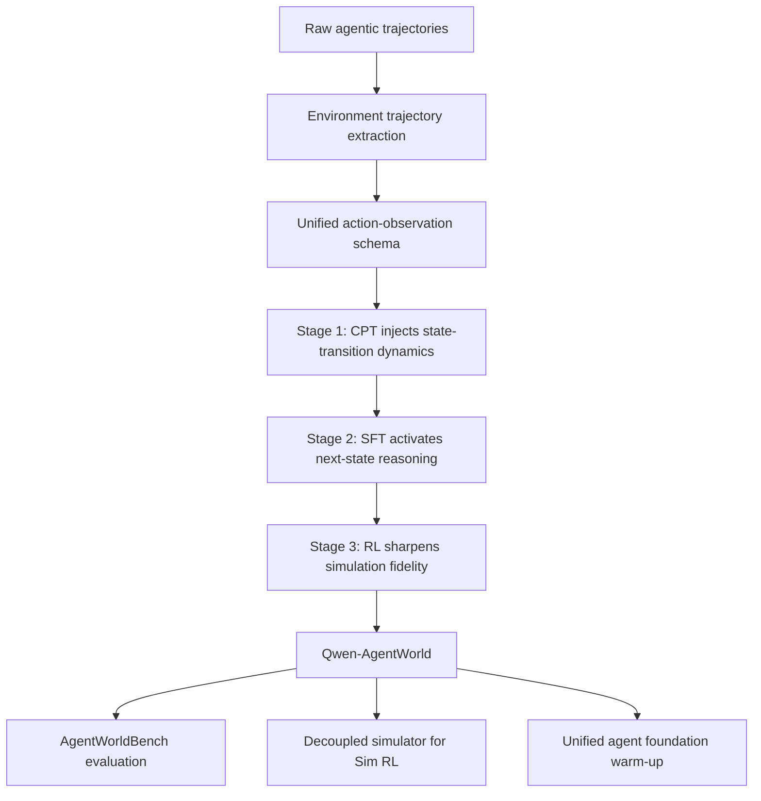

# Qwen-AgentWorld：把 Agent 后训练从“真实环境交互”扩展到“可控语言世界模型”

### 元信息

| 字段 | 内容 |
|---|---|
| 论文 | Qwen-AgentWorld: Language World Models for General Agents |
| 作者 | Qwen Team |
| arXiv | https://arxiv.org/abs/2606.24597 |
| 官方代码 | https://github.com/QwenLM/Qwen-AgentWorld |
| 模型 | https://huggingface.co/Qwen/Qwen-AgentWorld-35B-A3B |
| 数据集 | https://huggingface.co/datasets/Qwen/AgentWorldBench |
| 发布时间 | 2026-06-23 |
| 方向 | 大模型 Agent、Agent 后训练、语言世界模型 |

### TL;DR

- **这篇论文的问题**：当前 LLM Agent 训练主要学习从状态到动作的 policy，却缺少一个能预测“动作执行后环境会怎样变化”的通用语言世界模型。作者把 world model 从机器人和视频预测语境迁移到 Agent 的文本/工具/GUI 环境里。
- **核心做法**：Qwen-AgentWorld 将 MCP、Search、Terminal、SWE、Android、Web、OS 七类交互环境统一成 `(action, observation)` 轨迹，用 **CPT → SFT → RL** 三阶段训练语言世界模型。CPT 注入环境状态转移和专业知识，SFT 激活显式 next-state prediction，RL 用五维 rubric 与 rule verifier 混合奖励提高仿真保真度。
- **关键资产**：论文发布两个尺度的语言世界模型：`Qwen-AgentWorld-35B-A3B` 与 `Qwen-AgentWorld-397B-A17B`；同时发布 `AgentWorldBench`，包含 7 个领域、2,170 个评测样本、平均 22.8 turns，每个样本都有真实环境执行得到的 ground-truth observation。
- **主结果**：在 AgentWorldBench 上，`Qwen-AgentWorld-397B-A17B` 总分 **58.71**，高于 GPT-5.4 的 **58.25**；35B 版本从对应 base 的 **47.73** 提升到 **56.39**，提升 **8.66** 分。
- **后训练证据**：把 Qwen-AgentWorld 当作可控模拟器做 Sim RL，在 OpenClaw 上把 Claw-Eval 从 **65.4** 提到 **69.7**，QwenClawBench 从 **47.9** 提到 **55.0**；在 WideSearch 的 fictional-world simulation 中，35B agent 的 F1 Item 从 **34.02** 提到 **50.31**。
- **统一 Agent 证据**：把 LWM RL 当成 agent foundation warm-up 后，不再追加微调，Terminal-Bench 2.0 从 **33.25** 到 **39.55**，SWE-Bench Verified 从 **64.47** 到 **67.86**，WideSearch F1 Item 从 **33.38** 到 **46.17**，BFCL v4 平均从 **62.29** 到 **71.25**。
- **局限**：Search 仍是最难领域，最好分数也只有 **37.82**；GUI 领域仍落后于更强多模态模型；Sim RL 的收益强依赖 controllable simulation instruction；语言世界模型用“概率仿真”换取跨域泛化，不能替代可执行环境的确定性验证。

### 1. 研究问题：Agent 为什么需要语言世界模型？

论文从一个很朴素但被 Agent 研究长期绕开的二分开始：

| 组件 | 学什么 | 典型训练对象 | 当前 Agent 研究状态 |
|---|---|---|---|
| Policy | `state -> action` | 选择工具、命令、点击、搜索 query | 研究很多，SFT/RL/benchmark 都围绕它展开 |
| World model | `(state, action) -> next state` | 预测工具响应、终端输出、网页变化、文件系统状态 | 在 LLM Agent 中缺少通用版本 |

作者认为，通用 Agent 不能只学“下一步做什么”。它还要能在行动前估计：

- 这个命令会不会失败？
- 工具 API 返回的数据结构是什么？
- 搜索页面会不会泄露目标答案？
- GUI 点击后 accessibility tree 如何变化？
- 先前对文件、数据库、页面状态的修改，是否会影响后续 observation？

这正是语言世界模型要处理的任务。它不是生成一段自然语言解释，而是在完整上下文和当前 action 给定时，预测真实环境下一轮 observation。

可以把问题写成一个条件生成公式：

```text
给定：
  c       = system prompt，包括任务描述、动作空间、初始状态、示例和模拟指令
  o_<=t   = 到当前轮为止的环境 observation 历史
  a_<=t   = 到当前轮为止的 agent action 历史

学习：
  o_hat_{t+1} = f_theta(c, o_<=t, a_<=t)

目标：
  让 o_hat_{t+1} 尽可能接近真实环境产生的 o_{t+1}
```

这个公式的关键不是“多一个预测头”，而是把 Agent 交互中的一切环境反馈统一成可训练的语言目标：文件内容、HTTP 结果、shell prompt、diff、UI hierarchy、browser accessibility tree、桌面窗口状态，都变成 `observation`。

### 2. 论文主张与论证路线

| Claim | Mechanism | Evidence | Boundary |
|---|---|---|---|
| LLM Agent 可以用单一语言世界模型覆盖多类环境 | 七类 domain 统一成 action/observation schema | MCP、Search、Terminal、SWE、Android、Web、OS 都进入同一训练与评测框架 | GUI 只用文本化状态，不直接建模截图像素 |
| 世界模型训练能显著提高环境仿真质量 | CPT 注入环境知识，SFT 激活 next-state reasoning，RL 提升 fidelity | AgentWorldBench 上 397B-A17B 总分 58.71，超过 GPT-5.4 的 58.25 | Search 分数仍低，事实实时性与长链检索仍难 |
| 语言世界模型可作为 decoupled simulator 支持 Agent RL | 用 Qwen-AgentWorld 生成可控环境交互，训练 policy agent | OpenClaw、Tool Decathlon、MCPMark、WideSearch 都有 Sim RL 增益 | uncontrolled Sim RL 可能无效甚至退化 |
| 世界模型训练也可以作为统一 agent foundation warm-up | 让模型先学预测后果，再进入多轮 tool-calling 任务 | 七个 agent benchmark 均有提升，BFCL v4 平均 +8.96 | 只证明 warm-up 后迁移有效，不等于所有 policy 都会自动调用外部模拟器 |
| RL 不只是改善格式，还能改善微观保真度 | 五维 judge reward + rule verifier + tag extraction | URL realism、byte arithmetic、Notion schema consistency 都变好 | reward 仍可能被 judge 偏置影响，需要 rule anchor |

<u>最重要的转变</u>：论文不是把 Agent 训练扩大到更多真实 sandbox，而是提出另一条扩展轴：先训练一个能“想象环境反馈”的模型，再用它生成更多、更可控、更难、更便宜的训练经验。

### 3. 方法机制：统一七类环境

作者把七个 domain 分成文本环境与 GUI 环境，但训练接口保持一致。

| Domain | Action | Observation | 主要考验 |
|---|---|---|---|
| MCP | JSON tool call | tool response、文件、数据库、协议返回 | factual world knowledge |
| Search | web search / extractor | query、snippet、page content、conversation history | factual world knowledge 与泄漏控制 |
| SWE | read/edit/bash 等工具 | 文件内容、diff、测试输出、编译错误 | 代码执行推理 |
| Terminal | bash commands / keystrokes | stdout、stderr、shell prompt、文件系统状态 | 长上下文因果推理 |
| Android | touch / swipe / type | UI view hierarchy 与 app state | 视觉状态推理 |
| Web | click / type / navigate | accessibility tree 与 browser state | DOM/页面状态推理 |
| OS | mouse / keyboard | window、app、文件状态 | 桌面状态推理 |

论文强调两类环境差异：

- **Stateless-looking 环境**：例如 Search，看似没有显式状态，但模型必须从对话历史里推断已经查过什么、哪些信息可以暴露、下一次 query 应该返回什么。
- **Stateful 环境**：例如 Terminal、SWE、OS，文件、进程、数据库、窗口状态会被动作改变，后续 observation 必须保持一致。

统一 schema 可以写成：

```text
system_prompt :=
  task_description
  + action_space
  + initial_state
  + demonstrations
  + simulation_instruction

turn_t := (action_t, observation_t)

trajectory :=
  system_prompt + [turn_1, ..., turn_T]
```

这里的 `simulation_instruction` 非常关键。它让世界模型不只是“模拟平均真实世界”，还可以模拟指定条件：

- 终端中 `/tmp` 只剩 2GB，安装 CUDA 版 torch 会在解包阶段失败。
- Search snippet 只能给部分线索，不能直接泄露完整答案。
- MCP 服务偶发超时、分页、权限拒绝或批量操作部分失败。

这为后面的 controllable Sim RL 铺路：训练 agent 时，环境可以被系统性地调难，而不是被真实世界随机分布牵着走。

### 4. 三阶段训练：CPT injects, SFT activates, RL sharpens

论文的训练路线不是简单微调，而是把 world modeling 从 CPT 阶段就设为目标。



#### 4.1 CPT：先注入世界知识和状态转移

CPT 数据来自三类来源：

- **Dedicated agent infrastructure**：容器、MCP servers、persistent terminal、Android、browser、desktop OS 等真实环境后端。
- **Open interaction traces**：开放轨迹和工具交互记录。
- **Specialized-domain corpora**：工业控制、网络安全、法律、医疗、金融、时事和百科知识等专业语料。

作者的判断是：只靠交互轨迹不足以模拟真实专业环境。例如医院系统、合规平台、金融工具、搜索引擎结果，都需要模型有领域知识，否则只能模仿格式，不能预测内容。

#### 4.2 SFT：把 next-state prediction 变成显式思考模式

SFT 阶段从 10,250 个候选 query 中，通过三路 rollout 与 judge 选择保留 7,094 条轨迹，整体保留率 **69.2%**。

| Domain | Candidate | Retain rate | Final SFT | Avg turns |
|---|---:|---:|---:|---:|
| MCP | 261 | 68.6% | 179 | 24.3 |
| Search | 1,466 | 71.1% | 1,042 | 3.3 |
| Terminal | 1,826 | 86.5% | 1,580 | 5.9 |
| SWE | 402 | 61.9% | 249 | 26.9 |
| Android | 1,975 | 67.7% | 1,337 | 15.9 |
| Web | 2,697 | 59.5% | 1,605 | 3.0 |
| OS | 1,623 | 67.9% | 1,102 | 5.4 |
| Total | 10,250 | 69.2% | 7,094 | 8.5 |

SFT 的作用不是扩大数据量，而是让模型在输出 observation 前显式分析：

- 当前 action 请求了什么；
- 历史状态中哪些字段会影响结果；
- 输出格式应该像哪个工具或界面；
- 哪些事实不能泄露，哪些错误必须忠实复现。

#### 4.3 RL：用 rubric 和 rule verifier 共同塑形

RL 阶段使用 GSPO。难点在于 LWM RL 的 prompt 和 output 极不对称：

- prompt 常常是数万 token 的历史轨迹；
- output 只是下一轮 observation；
- 计算主要花在处理长上下文，而不是生成。

作者把 RL prompt 上限设为 **128k tokens**，并设计两类奖励：

| 奖励信号 | 作用 | 风险 | 论文中的缓解 |
|---|---|---|---|
| 五维 rubric judge | 评价 Format、Factuality、Consistency、Realism、Quality | judge 偏置、主观评分、reward hacking | calibrated prompt、content-type classification |
| Rule-based verifier | 对可执行事实给 0/1 correctness | 覆盖面有限 | 只作为二元 anchor |

混合比例是：

```text
Reward = 0.9 * RubricReward + 0.1 * RuleReward

RubricReward = mean(format, factuality, consistency, realism, quality)
RuleReward   = executable_verifier(prediction, ground_truth)
```

这套设计针对三个失败模式：

- **Reward collapse from multi-turn expansion**：如果一条长轨迹展开成多个训练样本，样本共享长前缀，reward variance 会坍缩。作者改为 RL pool 中每条轨迹只取一个 turn。
- **Sparse or unstable reward shaping**：pairwise reference reward 太稀疏，Turing-test reward 假阴性高；五维 rubric 更稳定。
- **Reward hacking through self-praise**：模型可能在预测中加入“操作成功且字段正确”之类自夸句子骗 judge。作者用 rule verifier、deterministic exact-match 和严格 tag extraction 防止思考区或自评影响分数。

### 5. AgentWorldBench：怎么评估语言世界模型？

AgentWorldBench 的设计重点是：每个 prediction 都要与真实环境 observation 对齐，而不是让 judge 主观判断“像不像”。

| Domain | Samples | Avg turns | 来源含义 |
|---|---:|---:|---|
| MCP | 286 | 23.1 | API server、数据库、协议响应 |
| Search | 458 | 15.5 | 搜索结果、snippet、页面内容 |
| Terminal | 354 | 26.7 | shell、文件系统、进程行为 |
| SWE | 472 | 28.1 | IDE、代码修改、测试与编译错误 |
| Android | 200 | 37.8 | 移动 UI 层级变化 |
| Web | 200 | 14.2 | 浏览器 DOM / accessibility 状态 |
| OS | 200 | 12.7 | 桌面文件、窗口、应用状态 |
| Total | 2,170 | 22.8 | 七域统一评测 |

五维评分分别是：

- **Format**：输出是否符合真实工具/界面格式。
- **Factuality**：可验证事实是否与 ground truth 一致。
- **Consistency**：是否保持历史状态、跨 turn 引用和内部字段一致。
- **Realism**：是否像真实环境会给出的 response。
- **Quality**：是否完整、可用、符合任务语境。

作者还补充 rule-based verification，专门测三类能力：

- controllability：是否遵守显式 simulation instruction；
- error handling：是否忠实复现权限拒绝、超时、错误码、失败类型；
- long-context consistency：早先状态变化是否影响后续结果。

### 6. 主结果：世界模型训练带来了什么？

AgentWorldBench 主表最直接的结论是：Qwen-AgentWorld 的 397B 版本在总分上略高于 GPT-5.4，而 35B 版本的训练收益更大。

| Model | MCP | Search | Terminal | SWE | Android | Web | OS | Avg |
|---|---:|---:|---:|---:|---:|---:|---:|---:|
| GPT-5.4 | 70.10 | 37.26 | 53.69 | 66.29 | 60.00 | 51.80 | 68.58 | 58.25 |
| Claude Opus 4.8 | 54.93 | 35.14 | 59.18 | 64.10 | 61.50 | 54.66 | 66.62 | 56.59 |
| Qwen3.5-35B-A3B | 57.87 | 25.98 | 46.13 | 47.58 | 53.18 | 47.10 | 56.27 | 47.73 |
| Qwen-AgentWorld-35B-A3B | 64.79 | 36.69 | 53.96 | 65.63 | 58.17 | 49.55 | 65.92 | 56.39 |
| Qwen3.5-397B-A17B | 68.31 | 30.81 | 55.30 | 64.44 | 54.90 | 48.55 | 60.85 | 54.74 |
| Qwen-AgentWorld-397B-A17B | 68.24 | 37.82 | 57.73 | 68.49 | 60.20 | 50.98 | 67.89 | 58.71 |

几个细节比“第一名”更重要：

- **Search 是瓶颈**：最高只有 37.82，说明动态网页事实、snippet 构造、检索链一致性仍是语言世界模型的硬问题。
- **SWE 与 Terminal 更受益**：这些领域有明确状态转移、错误输出、文件系统和命令语义，适合语言模型通过长上下文推理学习。
- **GUI 仍有多模态缺口**：论文用 accessibility tree / UI hierarchy 表示 GUI，没有直接用截图；因此在 GUI 平均上不如一些强多模态前沿模型。
- **35B 提升更大**：从 47.73 到 56.39，说明 world-model training 对较小 agentic base 的结构性补强更明显。

### 7. 消融与失败：什么条件下 Sim RL 才有效？

论文最有价值的反例来自 MCP controllable Sim RL。

| Setting | Tool Decathlon | MCPMark Avg |
|---|---:|---:|
| Qwen3.5-35B-A3B-SFT | 32.4 | 21.5 |
| Sim RL with Qwen-AgentWorld | 31.5 | 24.6 |
| Controlled Sim RL with Qwen-AgentWorld | 36.1 | 33.8 |
| Delta controlled vs base | +3.7 | +12.3 |

这里有一个重要负结果：普通 Sim RL 在 Tool Decathlon 上从 **32.4** 掉到 **31.5**。也就是说，世界模型不是一接上 RL 就会提升 Agent。

真正有效的是 **controlled simulation**：

- 用自然语言指令让模拟器返回分页、部分结果、间歇错误、批量操作局部失败；
- 让 agent 暴露在真实环境中少见但工程上关键的边界条件；
- 通过更困难但可控的反馈，训练 agent 处理多步工具链。

这个结论对 Agent 后训练很关键：语言世界模型的价值不只是“省掉真实环境成本”，而是提供真实环境难以稳定生成的教学分布。

### 8. WideSearch：虚构世界为什么能训练真实搜索 Agent？

Search 领域的实验更进一步。作者构造 **1k** 个完全自洽的虚构搜索环境，每个环境由 **300-500 rows** 的关系数据库支撑，再反向生成自然语言查询。

训练逻辑是：

```text
Input:
  fictional database D
  synthetic documents P
  generated query q
  simulator instruction s
  agent policy pi

Loop:
  agent emits web_search(q_t)
  Qwen-AgentWorld returns partial snippets, not full answer
  agent decides whether to refine query or call web_extractor
  simulator returns page content constrained by fictional world D
  verifier computes answer F1 against SQL-grounded answer

Output:
  policy updated to search, extract, aggregate, and cross-check
```

WideSearch 结果：

| Model | F1 Item | F1 Row |
|---|---:|---:|
| Qwen3.5-35B-A3B-SFT | 34.02 | 13.72 |
| Sim RL controlled | 50.31 | 24.21 |
| Delta | +16.29 | +10.49 |
| Qwen3.5-397B-A17B-SFT | 70.11 | 45.69 |
| Sim RL controlled | 73.98 | 51.74 |
| Delta | +3.87 | +6.05 |

虚构世界的价值在于防止捷径：

- 答案不存在于真实互联网，agent 不能靠参数记忆直接回答。
- snippet 被设计成只给部分线索，agent 必须调用 page extraction。
- 所有答案来自数据库执行和验证，避免纯 LLM 自说自话。

论文还对比 Real RL：在前 60 steps，Sim RL 的 F1 Item 到 **50.3%**，Real RL 到 **45.6%**。更有解释力的是工具调用行为：

- 两者都把 `web_search` 从约 5 次降到约 3.5 次；
- Sim RL 把 `web_extractor` 从 2.5 次升到 4.0 次；
- Real RL 反而把 `web_extractor` 从 2.5 次降到 1.5 次。

这说明 controllable simulator 不只提升分数，还改变了 agent 的信息获取习惯：它学会主动打开页面，而不是满足于 snippet。

### 9. 统一 Agent Foundation：预测后果会迁移到行动能力吗？

论文的第二条路线不是把世界模型当外部环境，而是把 LWM RL 当作 agent foundation warm-up。关键设定是：

- 在单轮、非 agentic 的 next-state prediction 轨迹上做 LWM RL；
- 不追加额外微调；
- 直接评估多轮 tool-calling agent 任务。

结果如下：

| Benchmark | Base | w/ LWM RL | Delta |
|---|---:|---:|---:|
| Terminal-Bench 2.0 | 33.25 | 39.55 | +6.30 |
| SWE-Bench Verified | 64.47 | 67.86 | +3.39 |
| SWE-Bench Pro | 42.18 | 47.42 | +5.24 |
| WideSearch F1 Item | 33.38 | 46.17 | +12.79 |
| WideSearch F1 Row | 13.27 | 20.14 | +6.87 |
| Claw-Eval | 53.60 | 64.88 | +11.28 |
| QwenClawBench | 39.76 | 49.43 | +9.67 |
| BFCL v4 Avg | 62.29 | 71.25 | +8.96 |

这张表支撑了论文最强的 claim：世界模型训练不只是让模型更会“扮演环境”，也会让 agent 更会行动。

作者进一步用 Terminal-Bench 2.0 的 mailman case 解释机制：

- LWM RL 前，模型遇到 Postfix recipient rejection 后，以为修改 `transport_maps` 就能路由到 LMTP，于是陷入无效探索。
- LWM RL 后，模型预测到 `local_recipient_maps` 会先于 transport routing 拒绝 unknown recipient，因此先修 local recipient table。

论文把这种能力称为 prediction-driven action refinement。量化上，在包含显式环境预测的 turn 中，预测准确率从 **69.9%** 到 **78.3%**，提升 **8.4** 点。

### 10. Figure/Table 证据逐项解读

| 证据 | 支撑什么 | 不能证明什么 |
|---|---|---|
| Figure 1 | Qwen-AgentWorld 有两种用法：decoupled simulator 与 unified foundation model | 不能说明两条路线在所有任务上都同样有效 |
| Table 1 | 七类环境可以统一成 action/observation 表示 | 不能说明文本化 GUI 等同于视觉 world model |
| Table 2 | RL pool 覆盖 92,308 条训练轨迹，平均 19,443 tokens、13.4 turns | 不公开完整训练数据，外部难以复现实验规模 |
| Table 5 | AgentWorldBench 上 397B-A17B 总分领先，35B 提升大 | 搜索和 GUI 的绝对分数仍不高 |
| Table 6 | OpenClaw Sim RL 中好 simulator 明显优于 Qwen3.6-Plus | 只覆盖 OpenClaw 相关环境，不代表所有 agent RL |
| Table 7 | controllable simulation 是 MCP Sim RL 成功前提 | uncontrolled simulation 失败说明 simulator 接入方式很敏感 |
| Table 8 | fictional-world Search 能训练真实检索行为 | 虚构世界需要强合成与验证 pipeline，不是免费数据 |
| Table 9 | LWM RL warm-up 跨 7 个 agent benchmark 迁移 | 还不能证明 agent 会稳定、策略性地调用显式 world model |
| Figure 12 | thinking trace 中有 self-correction、leakage prevention、causal reasoning | CoT 分析依赖可见 reasoning trace，不一定等于全部内部机制 |
| Table 10 | rule-based verifier 复核 controllability、error handling、long-context consistency | rule verifier 只能覆盖可程序化检查的子能力 |

### 11. 与相关工作的关系

论文把自己放在三条线的交叉处：

| 相关线索 | 代表问题 | Qwen-AgentWorld 的位置 |
|---|---|---|
| 传统 world model | 学物理世界、视频状态、机器人 dynamics | 转向语言环境与工具环境 |
| Agent RL 环境扩展 | 生成更多 sandbox、网页、终端、SWE 任务 | 用一个语言模型替代部分环境执行 |
| Agent foundation training | 让模型通过交互轨迹获得 tool-use 能力 | 先学习预测 environment feedback，再迁移到 action selection |

与代码生成环境不同，语言世界模型牺牲了一部分确定性，换来更大覆盖面：

- 搜索引擎、MCP 服务、企业 API、GUI 状态很难全部程序化；
- 语言模型可以模拟这些复杂环境的“概率行为”；
- 但当任务要求强验证、强安全边界或不可逆操作时，仍需要真实环境或 rule verifier。

这也是论文的证据边界：它证明语言世界模型是一个可训练、可评测、可用于后训练的组件，但没有证明它能替代真实环境。

### 12. 结论与局限

#### 12.1 我认为最值得带走的判断

- **Agent 后训练会从“收集真实轨迹”走向“设计可控环境分布”**。Qwen-AgentWorld 的关键贡献不是又做了一个 benchmark，而是展示了如何系统性地控制环境困难度。
- **世界模型训练可能成为 Agent foundation model 的预热阶段**。先学 `(state, action) -> next state`，再学 `state -> action`，比只做 action imitation 更接近真实规划。
- **Search 与 GUI 是下一阶段硬问题**。Search 的低绝对分数说明事实实时性、信息边界和检索链一致性仍难；GUI 缺截图输入则限制了视觉状态预测。
- **奖励设计是成败核心**。五维 rubric、rule verifier、tag extraction、单 turn RL sampling 这些工程细节，比“用 RL 优化世界模型”这个口号更关键。

#### 12.2 主要局限

- **数据与训练细节复现有限**：论文公开模型、benchmark 和代码入口，但 10M+ 交互轨迹与 in-house 训练数据无法完整复刻。
- **评测仍依赖 LLM judge**：虽然有 ground truth 和 rule verifier，主分数仍受 judge prompt、judge model 和 content classification 影响。
- **文本 GUI 不是视觉 GUI**：Android/Web/OS 用 accessibility tree 或 UI hierarchy 表示，不能覆盖截图、布局细节、视觉遮挡等像素级问题。
- **可控模拟需要强先验设计**：WideSearch 的成功依赖数据库、合成文档、SQL ground truth、检索约束和 validation pipeline；换一个领域未必容易复制。
- **Sim-to-real routing 仍未解决**：实际系统需要判断什么时候相信 LWM、什么时候调用真实环境、什么时候要求 human review。论文把这列为 future work，说明部署链路仍未闭环。

### 13. 继续追问

- 如果语言世界模型生成的环境反馈被 agent 当真，如何防止训练出只适应模拟器偏差的 policy？
- Agent 是否应该显式调用 world model 做 lookahead，还是像论文 warm-up 那样把预测能力内化进 reasoning trace？
- 对安全关键任务，world model 的 output 是否必须附带不确定性、可验证约束或 simulator provenance？
- 当真实环境有权限、隐私和不可逆副作用时，LWM 能否成为默认 dry-run 层？
- 如果未来 GUI world model 融合截图、accessibility tree 与事件流，评测应如何同时衡量视觉正确性、交互可执行性和状态一致性？

### 14. 一句话总结

Qwen-AgentWorld 的意义在于，它把 Agent 后训练里的“环境”从昂贵、不可控、难扩展的真实系统，部分转化为可训练、可评测、可调难度的语言世界模型；但它同时提醒我们，模拟器质量、控制指令、奖励锚点和 sim-to-real 边界，才是这条路线能否真正改进 Agent 的决定性变量。
