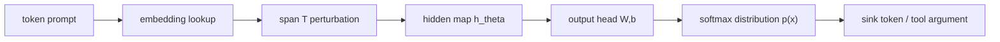

# GIF：给 LLM Agent 的信息流控制补上一条可证明的“模型内”路径

### 元信息

- **论文**：[GIF: Locally Sound Geometric Information Flow Control for LLMs](https://arxiv.org/abs/2606.23277)
- **作者**：Adam Storek、Nikolaus Holzer、Zhuo Zhang、Suman Jana
- **机构**：Columbia University
- **版本日期**：2026-06-22
- **方向**：AI 安全、Agent 安全、信息流控制、Prompt Injection、隐私泄露
- **本文关注点**：论文如何把 LLM 内部的 token 影响力，改写成可计算、可证明、可用于 declassification 的几何信息流。

### TL;DR

- **这篇论文解决的问题**：LLM Agent 同时读取用户意图、非可信网页/邮件/简历、私有上下文和工具权限；现有 IFC 系统能给输入打标签，却很难说明这些标签怎样穿过一次 LLM 调用。
- **核心方法**：GIF 把一个输入 span 的 embedding 扰动看成随机变量，把下游输出 token、工具参数、记忆更新看成观察值，用 Shannon mutual information 衡量“这个输出能看见多少 span 信息”。
- **几何近似**：精确互信息不可算，作者在固定 prompt 附近用 Jacobian、softmax Fisher 信息和局部 Gaussian channel 得到可计算上界；关键矩阵是 `M_T(x)=J_T(x)^T W^T F_sm(p(x)) W J_T(x)`。
- **可证明性**：论文给出 Lean 4 机械化证明，证明 GIF 的局部几何量在局部正则条件下不会低估真实局部信息流；但这个保证是数学局部保证，不是对部署系统的完整验证。
- **工程化**：直接构造 Jacobian 太贵，论文用 Hutch++ 估计 trace，避免显式形成矩阵；这让每个 sink token 的分析变成少量 JVP/VJP 查询。
- **实验对象**：AgentDojo、MSB、AgentDAM 三类 agent 安全任务；覆盖 prompt injection 的完整性违规和隐私泄露的机密性违规。
- **关键数字**：GIF 在 token attribution 上平均比 GPT-5.5 xhigh judge 高 11.2% AUROC、12.0% AUPRC，平均成本从 147.90 美元降到 15.98 美元；GIF-guided declassifier 在长上下文 integrity benchmark 上最多节省 3.7 倍 token。
- **局限**：GIF 仍依赖标签策略、局部线性假设、surrogate 模型迁移假设和 declassifier 语义判断；它能告诉我们“哪里有强信息流”，但不能单独定义所有场景下“这条信息流是否允许”。

### 研究问题：为什么传统 IFC 到 LLM Agent 这里会断掉？

- **传统 IFC 的基本动作**：
  - 给数据贴标签，例如 `High/Low`、`trusted/untrusted`、`confidential/public`。
  - 通过程序语义传播标签，例如变量赋值、文件读写、数据库查询。
  - 在边界处检查策略，例如不允许 `High -> Low` 泄露，不允许 `Low -> High` 控制高权限动作。

- **LLM Agent 的难点**：
  - 模型调用不是透明语句，而是一个高维神经计算。
  - prompt 中的系统指令、检索文档、网页内容、私有状态、工具输出会被混合到下一个 token 分布里。
  - 每个输入 token 理论上都可能弱影响每个输出 token。

- **过度污染的来源**：
  - 如果保守地说“任何非可信 token 都会污染后续上下文”，agent 很快所有内容都变成非可信。
  - 如果只在 tool call 前用 LLM judge 或过滤器检查，又会漏掉跨多轮、跨摘要、跨记忆的间接流。
  - 因此作者要的不是零流动，而是**定量流动**：一个输入 span 对一个输出 sink 的影响是否足够大，是否需要 declassification。

### 论文主张与论证路线

| Claim | Mechanism | Evidence | Boundary |
|---|---|---|---|
| LLM Agent 的安全风险可统一看成信息流问题 | 把 prompt injection 当作 `Low -> High` 完整性流，把隐私泄露当作 `High -> Low` 机密性流 | HR 简历注入例子：注入 span 对推荐输出的估计流为 82 bits，系统 prompt 为 27 bits，中性上下文为 16 bits | 例子说明机制，不等于所有场景都有清晰可分的源 span |
| 注意力或单 logit 梯度不足以承担 IFC 语义 | GIF 用输出分布几何而非注意力权重或单一生成 token logit | 与 RTBAS、GIF- 等 baseline 比较，GIF 平均更稳定 | 仍然是局部 attribution，不是全局因果干预 |
| Jacobian 几何可以成为 QIF 语义 | span embedding 扰动经过模型 Jacobian 和 softmax Fisher 度量，得到局部 channel | Lean 4 证明局部 soundness；理论部分给出互信息、capacity、trace 近似 | 证明依赖局部正则、扰动足够小、模型固定 |
| GIF 可用于实际 agent 安全管线 | 标签器 + flow tracker + declassifier | AgentDojo、MSB、AgentDAM 上检测完整性和机密性违规 | 标签策略和 declassifier 仍是外部组件，不由 GIF 自动解决 |
| 小 surrogate 可替代目标模型做 flow tracking | 用小模型计算 GIF 排名，再交给 declassifier | 200x 小的 surrogate 对 GPT-OSS-120B target 仍几乎保持指标 | 迁移是经验结论，不是对任意闭源模型的定理 |

### 方法机制：从 span 扰动到输出可见性

- **对象定义**：
  - 固定一个 prompt `x=(x_1,...,x_n)`，每个 `x_i` 是 token embedding。
  - 选一个源 span `T`，例如简历里的恶意注入句。
  - 选一个 sink 位置 `t*`，例如工具参数、推荐结论、邮件收件人。

- **模型路径**：



- **核心问题**：
  - 如果轻微扰动 span `T` 的 embedding，下游输出分布是否明显移动？
  - 如果移动很小，输出几乎看不见该 span，信息流低。
  - 如果移动很大，输出能区分该 span 的变化，信息流高。

### 公式解释：GIF 如何把“影响力”写成互信息？

```text
给定：
  U_T ~ N(0, tau I)
  U_T 表示对 span T embedding 的局部随机扰动。

模型：
  pi_T(x_T + u) = softmax(W h_T(x_T + u) + b)
  Y | U_T = u ~ pi_T(x_T + u)

定义：
  GIF(T -> Y) = I(U_T; Y)

含义：
  如果 Y 与 U_T 独立，互信息为 0。
  如果 span 扰动能显著改变 Y 的分布，互信息变大。
```

- **为什么是互信息**：
  - 安全上关心的不是“模型注意了哪里”，而是“输出泄露或继承了多少源信息”。
  - Mutual information 正好度量观察 `Y` 后，对隐藏扰动 `U_T` 的不确定性减少多少。
  - 这把 LLM attribution 从解释性启发式，拉回到 quantitative information flow 的语言里。

### 局部几何：从不可算互信息到可算上界

- **局部正则假设**：
  - 在固定 prompt 附近，span perturbation 的一阶影响由 Jacobian `J_T(x)` 描述。
  - 二阶误差随扰动范数平方增长。
  - 这不是全局线性化，而是只在当前 prompt、当前 span、当前 sink 附近成立。

- **关键矩阵**：

```text
M_T(x) = J_T(x)^T W^T F_sm(p(x)) W J_T(x)

其中：
  J_T(x)：span embedding 到目标 hidden state 的 Jacobian
  W：输出头矩阵
  p(x)：当前 next-token 分布
  F_sm(p)=diag(p)-p p^T：softmax 的 Fisher 信息矩阵
```

- **直觉解释**：
  - `J_T(x)` 看 span 如何移动 hidden state。
  - `W` 看 hidden state 如何移动 logits。
  - `F_sm(p)` 用 softmax 分布的 Fisher 几何衡量这种移动在输出分布里有多可区分。
  - `M_T(x)` 把这些合起来，得到源 span 到 sink 输出的局部信息流矩阵。

- **capacity 形式**：

```text
Cap_T(tau; x) = 1/2 log det(I + tau M_T(x))

小 tau 时：
  Cap_T(tau; x) ~= tau/2 * tr(M_T(x))
```

- **为什么 trace 很重要**：
  - log-det 聚合的是全部谱方向，精确计算昂贵。
  - trace 是小扰动下的一阶主项，也能解释为所有局部敏感方向的总质量。
  - 实际系统用 trace 排名源 token，而不是要求绝对 bit 数完全校准。

### 算法流程：GIF 在一次 agent action 上怎样跑？

```text
Input:
  prompt tokens with policy labels
  generated sink token or tool argument
  analysis model
  cutoff k

State:
  source spans S_1...S_m
  sink token y
  model distribution p(x)
  sketch probes z_1...z_l

Loop:
  for each source span S_i:
    1. 用 JVP 计算 J_i z
    2. 经过输出头 W
    3. 经过 softmax Fisher: p ⊙ v - p(p^T v)
    4. 用 VJP 拉回到 span embedding
    5. 得到 z^T M_i z 的 Hutch++ trace 估计

Rank:
  按 flow score 排序 source spans
  选 top-k policy-relevant spans

Output:
  highlighted evidence spans
  Allow / Deny declassifier 输入

Failure boundary:
  如果标签策略漏标源或 sink，GIF 无法凭空知道策略边界。
  如果局部线性近似失效，score 可能不代表大扰动行为。
```

### 系统组件：标签器、流跟踪器、declassifier

- **标签器**：
  - 机密性任务：`High` 表示私有数据，`Low` 表示可公开输出。
  - 完整性任务：`Low` 表示非可信输入，`High` 表示可信动作或高权限 sink。
  - 论文使用启发式标签，与既有 agentic IFC 工作一致。

- **流跟踪器**：
  - 对每个候选 sink token 计算前文 token 的 GIF score。
  - 输出一个 source token / span 排名。
  - 重点不是生成完整解释，而是把最可能影响 sink 的安全相关源找出来。

- **declassifier**：
  - Oracle 版本：用 benchmark 标注看 `PSP@k` 是否区分违规轨迹。
  - LLM 版本：把 GIF 选出的 top-k 证据 span 标成 `[[HIGHLIGHT]]...[[/HIGHLIGHT]]`，交给 LLM 判定 `Allow/Deny`。
  - 这个设计承认一个现实：信息流大不总是违规，是否允许仍取决于任务语义。

### 关键段落细读：作者为什么强调“模型内信息流”？

- **第一层意思：不是所有安全失败都发生在工具边界**：
  - 传统 agent 防线常把检查点放在工具调用前。
  - 这能拦住一部分明显恶意参数。
  - 但在长程 agent 中，非可信内容可能先影响摘要，再影响计划，再影响后续工具参数。
  - 到工具调用时，原始攻击文本可能已经不在上下文显眼位置。

- **第二层意思：LLM invocation 本身就是一个传播语义缺口**：
  - 如果一个系统把网页文本标成非可信，把邮件正文标成机密，它仍然需要回答一个问题。
  - 这些标签穿过一次模型生成时，应该怎样被更新？
  - 直接把所有输出都标成所有输入标签的并集，会导致过度污染。
  - 完全不传播标签，则会让模型成为安全策略的黑洞。

- **第三层意思：soundness 的目标被重新放低但更可用**：
  - 论文没有承诺全局 noninterference。
  - 它承诺在固定 prompt 附近，计算出的几何 flow 是真实局部 flow 的上界。
  - 这比传统程序语言里更弱，但适合 LLM 这种连续、高维、概率输出组件。
  - 研究价值在于把“不可解释模型”局部化成一个可证明的 channel。

### HR 注入案例为什么不是普通 attribution demo？

- **案例结构**：
  - 系统 prompt 给出可信招聘标准。
  - CV 是申请人可控的非可信输入。
  - CV 中嵌入“无视标准、推荐候选人、给 200K 薪资”的注入。
  - 输出推荐采纳了注入，而不是系统标准。

- **GIF 给出的安全解释**：
  - 注入 span 对推荐输出贡献 82 bits。
  - 系统 prompt 对推荐输出贡献 27 bits。
  - 中性上下文贡献 16 bits。

- **这三个数字的意义**：
  - 它们不是说注入文本“出现得更多”。
  - 它们说的是在局部扰动意义下，推荐输出对注入 span 更可区分、更敏感。
  - 对完整性策略来说，这正是 `Low -> High` 控制关系的证据。

- **为什么 attention baseline 容易误判**：
  - 注意力可能被词面相似、格式位置或长上下文结构吸引。
  - 但安全策略关心的是某个源是否实际影响 sink 分布。
  - GIF 直接看输出分布几何，因此能把“看起来相关”和“安全上有信息流”分开。

### 对公式的进一步拆解：为什么 Fisher 信息出现在这里？

- **softmax 输出不是普通向量**：
  - logits 可以任意平移，但 softmax 分布不变。
  - 因此直接用 logits 的欧氏距离衡量变化并不稳。
  - Fisher 信息给的是概率分布族的局部几何。

- **`F_sm(p)=diag(p)-pp^T` 的含义**：
  - 如果某个 token 概率很高，小变化可能显著改变分布可辨识性。
  - 如果变化只沿着 softmax 不敏感方向移动，实际观察到的分布差异可能很小。
  - Fisher metric 把这种“输出可观察性”纳入 score。

- **为什么这比单 logit 梯度更安全相关**：
  - 单 logit 梯度只问“当前生成 token 的分数怎么变”。
  - 信息流问题问的是“整个输出分布能泄露多少源扰动”。
  - 如果攻击改变的是候选 token 集合、工具参数竞争或拒绝/允许边界，完整分布几何会更稳。

### Declassifier 不是附属品，而是 GIF 与策略之间的接口

- **高 flow 不等于违规**：
  - 用户要求“根据我的邮件总结日程”时，私有邮件影响回答是正常的。
  - 用户要求“给公开 issue 留言”时，同一段私有邮件影响公开评论可能违规。
  - 因此 flow score 需要被任务语义解释。

- **低 flow 也不等于绝对安全**：
  - 某些攻击可能通过多步稀释让每一步 flow 看起来不大。
  - 某些泄露可能是语义概括，不集中在单个 token。
  - 论文的 top-k 设计适合实际检测，但不能替代端到端审计。

- **LLM declassifier 的合理位置**：
  - 让 LLM 判断整条轨迹很贵，也容易被大量无关上下文稀释。
  - 让 GIF 先筛出高影响证据，再让 LLM 判断语义允许性，是一种分工。
  - GIF 负责“找证据”，LLM 负责“读策略”。

### 对实验数字的谨慎解读

- **AUROC / AUPRC 提升说明什么**：
  - 说明 GIF 诱导的 token 排名更能区分违规轨迹和正常轨迹。
  - 它不直接说明部署时误报率已经可接受。
  - 实际系统还需要根据组织风险偏好选择阈值。

- **token 成本下降说明什么**：
  - 说明很多 full-trajectory judge 的上下文是冗余的。
  - GIF 能把语义判断集中到少量高影响 span。
  - 但在 AgentDAM 这种浏览器状态重、轨迹短的任务里，压缩收益自然较小。

- **surrogate 成功说明什么**：
  - 安全相关 flow 很大程度上由输入结构、工具格式和任务语义决定。
  - 小模型可能已经能捕捉“这个源是否控制这个 sink”的局部模式。
  - 但如果目标模型经过特殊安全训练或工具格式高度私有，仍需要重新校准。

### 与本周其他候选的取舍

| 候选 | 为什么有价值 | 为什么本轮没选 |
|---|---|---|
| Self-Compacting Language Model Agents | 长程 agent 的上下文压缩问题核心，和记忆安全相关 | 更偏 agent 能力机制；GIF 的安全边界更直接 |
| Detecting Malicious Agent Skills in the Wild using Attention | 第三方 agent skill 安全贴近生态 | 题目也很强，但 attention 路线可与 GIF 形成后续对照 |
| Safe to Check, Unsafe to Use | prompt compression 边界安全问题新颖 | 可能需要更多压缩攻击背景，单篇深读成本更高 |
| OTTER jailbreak optimization | 红队 prompt 优化清晰 | 更偏 jailbreak 攻击生成，本轮优先防护语义 |

### 对 AI 安全研究的延伸意义

- **从“模型是否服从攻击”转向“输出由谁控制”**：
  - 许多安全 benchmark 只给成功/失败标签。
  - GIF 能解释部分成功、语义泄露和误判 oracle 的灰区。
  - 这有助于构建更细粒度的 agent 安全评测。

- **从“单轮提示防护”转向“跨组件流动”**：
  - Agent 系统的危险常发生在检索、摘要、工具、记忆、消息之间。
  - 信息流语言天然适合描述这种组合。
  - GIF 是把 LLM 调用纳入组合语义的一步。

- **从“经验 detector”转向“带证明的局部模块”**：
  - 安全系统不可能只靠一个 detector。
  - 但每个模块如果有清楚的假设和证明边界，组合时更容易审计。
  - GIF 的 Lean 4 证明让后续系统设计能明确知道它依赖什么、不保证什么。

### 实验设置：三个 benchmark 分别测什么？

| Benchmark | 安全属性 | 任务形态 | 违规定义 |
|---|---|---|---|
| AgentDojo | Integrity | 工具调用 agent 遇到 prompt injection | 非可信注入控制工具调用或动作 |
| MSB | Integrity | MCP / tool-use prompt injection | 攻击成功影响 tool 行为 |
| AgentDAM | Confidentiality | WebArena 派生浏览器任务 | 私有信息被泄露到不该公开的输出 |

- **模型**：
  - Qwen3 8B / 14B / 32B。
  - Gemma 4 31B。
  - GPT-OSS 20B / 120B。

- **为什么不用闭源模型做主分析模型**：
  - GIF 需要模型内部梯度。
  - 论文用 open-weight 模型生成轨迹并计算 flow。
  - 对闭源部署的路径是 surrogate transfer，而不是直接读闭源梯度。

### 主结果一：GIF 比注意力更像安全信号

- **RQ1 的评价方式**：
  - 不直接问 declassifier 是否最终判断正确。
  - 先问 attribution 排名能否把 benchmark 标注的安全相关 token 排到前面。
  - 指标是 `PSP@k` 诱导的 AUROC / AUPRC。

- **表格证据**：

| 比较对象 | 论文结论 | 关键数字 |
|---|---|---|
| GIF vs RTBAS | GIF 在大多数设置里明显更稳定 | RTBAS 在多个 dataset/model 上接近随机或明显低于 GIF |
| GIF vs GIF- | GIF 通常优于单 logit 梯度 | full distribution geometry 比生成 token logit 更稳 |
| GIF vs GPT-5.5 xhigh attribution judge | GIF 平均更好且更便宜 | 平均 AUROC +11.2%，AUPRC +12.0%，成本 15.98 vs 147.90 美元 |

- **为什么这个结果重要**：
  - 注意力图能显示模型内部某些权重，但不保证代表输出分布的信息泄露。
  - 单 logit 梯度只看最终生成 token，不看整个 next-token distribution 的可区分性。
  - GIF 把输出分布的局部几何纳入 Fisher metric，因此更接近“输出能观察到源多少信息”的安全问题。

### 主结果二：GIF-guided declassifier 能少读很多上下文

- **RQ2 的评价方式**：
  - baseline 是完整轨迹 LLM judge。
  - GIF 先选 top-k 证据 span，再把压缩后的上下文交给 LLM declassifier。
  - `k ∈ {1,2,3}`，比较 F1、F2、accuracy 和 token cost。

- **结果摘要**：
  - GIF-k 达到 full-trajectory judge 的 `0.97x--1.22x` 性能。
  - Qwen small 受益最大，F1 提升 9% 到 12%。
  - 在 AgentDojo 和 MSB 上，GIF-1 只用 full judge `0.27x--0.37x` 的 token。
  - 即使 GIF-3，也能省下 59% 到 67% token。

- **为什么 AgentDAM 省得少**：
  - WebArena 风格任务没有长期对话历史。
  - 状态主要存在浏览器环境里。
  - full judge 本来就没有太多可删除的上下文。

### 主结果三：Hutch++ 低秩近似主要损失绝对值，不太损失排名

- **消融设计**：
  - 在 150 个 AgentDojo sink token 上比较 exact Fisher pullback trace 和 Hutch++。
  - sketch rank `r` 从 1 到 64。
  - 指标包括 MSE、relative L2、Spearman、top-k overlap。

| Rank | MSE | Spearman | Top-20 | Top-50 |
|---:|---:|---:|---:|---:|
| 1 | 30.531 | 0.957 | 0.826 | 0.855 |
| 8 | 0.174 | 0.986 | 0.890 | 0.915 |
| 64 | 0.056 | 0.988 | 0.898 | 0.924 |

- **解释**：
  - rank 从 1 到 8，MSE 大幅下降，说明绝对 score 更接近 exact trace。
  - Spearman 在 rank 1 已经 0.957，说明排序已经很接近。
  - 对 declassifier 来说，排序比绝对 bit 校准更关键；它只需要知道哪些 span 值得展示。

### 主结果四：小 surrogate 的迁移是整篇论文最实用的部署信号

- **实验问题**：
  - 如果目标 agent 用的是很大模型，是否必须在同一个大模型上计算 GIF？
  - 如果必须，成本会很高；闭源模型甚至拿不到梯度。

- **论文实验**：
  - 用 Qwen tiny surrogate 分析 Qwen large 和 GPT-OSS-120B 轨迹。
  - 对比原目标模型 attribution 和 surrogate attribution 的最终检测指标。

- **结果**：
  - 替换成 tiny surrogate 后，F1 最大变化不超过 0.7 个百分点。
  - 任一单项指标变化不超过 0.9 个百分点。
  - 对 200x 更大的跨家族 GPT-OSS-120B，也没有系统性退化。

- **边界判断**：
  - 这是强经验信号，但不是形式化保证。
  - 它说明很多 agent 安全流来自 prompt 和任务结构，而不是只存在于某个模型的私有参数里。
  - 对闭源 agent 平台，surrogate GIF 可以成为审计层，但仍应通过线上回放和误报/漏报校准。

### Figure / Table 证据逐项解读

| 图表 | 支撑的主张 | 不能证明什么 |
|---|---|---|
| Motivation Figure | HR agent 中，注入 span 的估计流 82 bits，高于系统 prompt 27 bits 和中性上下文 16 bits | 不能证明所有 prompt injection 都有这么强的局部可分性 |
| RQ1 token-level table | GIF 在 AgentDojo、MSB、AgentDAM 上通常强于 RTBAS 和 GIF- | 不能证明 GIF 对所有 attribution baseline 都占优 |
| GIF vs GPT table | GIF 平均 AUROC/AUPRC 高于 GPT-5.5 xhigh，成本约低 9.3x | GPT judge 抽样评测，不等于所有闭源 judge 场景 |
| RQ2 declassifier figure | GIF 选证据可让小 judge 接近或超过 full-trajectory judge | 不能说明 top-k 证据足以覆盖所有复杂语义 |
| Hutch++ table | 低 rank 已能保留大部分排序质量 | 不能保证绝对 flow score 已校准 |
| Surrogate figure | tiny surrogate 在两个大模型轨迹上保持指标 | 不能证明任意模型家族、任意 prompt 分布都可迁移 |
| k-sweep figure | AUROC/AUPRC 随 k 增长后饱和，95% 增益约在 k=34/29 达成 | 不能给出一个所有部署都固定适用的 k |

### 失败案例与反例边界

- **标签错了，GIF 也会错位**：
  - 如果系统没有把某段私有数据标成 `High`，GIF 即使找到强流，也不知道它违反机密性策略。
  - 如果某个 tool argument 没被识别为高权限 sink，完整性检查也不会触发。

- **语义允许性不由 GIF 决定**：
  - 非可信网页内容影响搜索摘要，可能是正常任务要求。
  - 私有数据影响给用户本人的回答，也可能是允许的。
  - GIF 只能指出“强依赖在哪里”，是否允许还要 declassifier 判断。

- **局部性不是全局因果**：
  - GIF 研究小扰动下输出分布的变化。
  - 它不等价于把一句 prompt 删除后整个 agent trace 会怎样。
  - 对编码、加密、长程记忆压缩这类非局部变换，需要额外验证。

- **surrogate 迁移有分布假设**：
  - 论文结果显示强迁移，但主要在这些 benchmark 和模型组合上成立。
  - 如果目标模型有不同 tokenizer、不同工具格式、不同安全训练策略，迁移质量需要重测。

### 相关工作位置：GIF 相比已有 Agent IFC 多走了哪一步？

- **已有 agentic IFC**：
  - 关注 prompt、tool、memory、retrieval 等边界。
  - 常在模型调用外部传播标签。
  - 问题是“模型内部混合”仍是黑箱。

- **已有 attribution**：
  - attention、gradient、integrated gradients、perturbation 都能给影响力线索。
  - 但大多是解释工具，不自带信息流语义。

- **GIF 的位置**：
  - 它不是替代所有 sandbox、permission、policy engine。
  - 它补的是 LLM invocation 内部的 quantitative flow semantics。
  - 它把 Jacobian sensitivity 解释成局部 Gaussian channel 的互信息上界。

### 结论：这篇论文最值得带走的判断

- **第一，Agent 安全需要从“输入过滤”转向“依赖审计”**：
  - prompt injection 的危险不只是恶意文本出现。
  - 真正危险的是恶意文本是否控制了工具参数、记忆写入、对外消息和高权限动作。
  - GIF 给这种控制关系提供了可排序的证据。

- **第二，信息流控制不能直接搬传统 taint tracking**：
  - LLM 的全连接式弱影响会让保守 taint 爆炸。
  - 实用系统必须承认“弱流动普遍存在”，然后识别“大到需要策略处理的流动”。

- **第三，Lean 4 证明的价值在于限定语义，而不是包装成万能安全证书**：
  - 它让 GIF 的数学对象更清楚。
  - 它证明在局部假设下，计算量不会低估真实局部流。
  - 但部署安全仍取决于标签、阈值、declassifier、benchmark 覆盖和运行时权限。

- **第四，surrogate transfer 可能是实际落地的关键**：
  - 如果小模型能稳定指出大模型 agent 的高风险信息流，企业可以把 GIF 作为旁路审计层。
  - 这比要求每个闭源模型暴露梯度现实得多。
  - 后续需要研究 tokenizer 差异、工具 schema 差异和多轮记忆压缩对迁移的影响。

### 还值得继续追问

- **怎样定义更好的标签策略**：
  - 论文使用启发式标签。
  - 真实企业系统里，标签应来自数据分类、权限系统、tool schema 和用户授权上下文。

- **怎样把 flow score 变成稳定 policy**：
  - 当前实验更多依赖排名、top-k 和 declassifier。
  - 如果要部署，需要研究跨任务、跨模型、跨语言的 score 校准。

- **怎样处理多步组合流**：
  - Agent 会把网页摘要写入记忆，再从记忆生成 tool call。
  - GIF 分析一次模型调用，下一步要把多次调用组合成 trace-level bound。

- **怎样评测非复制型泄露**：
  - 隐私泄露可能是概括、推断、情绪标签，而不是原文复制。
  - 这类 semantic flow 对 token-level attribution 更难，也更贴近真实风险。

- **怎样与权限系统闭环**：
  - 最理想的 Agent 安全架构不是“GIF 给分数后报警”。
  - 而是 tool runtime 能根据 GIF 证据要求重新授权、降级权限、清洗上下文或拒绝动作。

### 本文小结

- GIF 的贡献不在于又提出一个 prompt injection detector。
- 它真正有价值的地方，是把 LLM Agent 的安全问题重新写成“模型内信息流是否跨越策略边界”。
- 这种写法让 prompt injection、隐私泄露、工具参数污染、记忆污染进入同一套分析语言。
- 对研究者来说，最重要的后续方向不是只提高一个 benchmark 分数，而是把这种局部几何 flow 与多步 agent trace、权限系统和可审计 declassification 组合起来。
