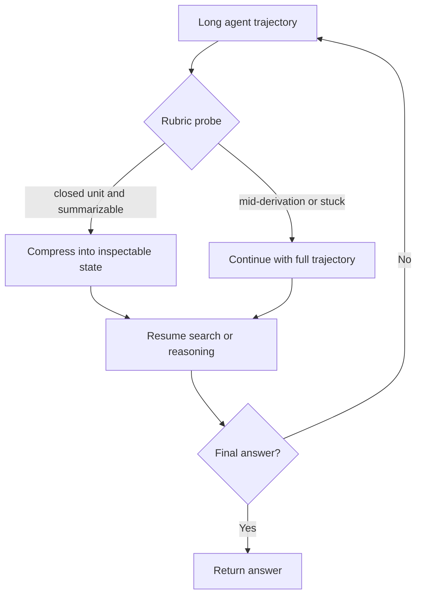

# Self-Compacting Language Model Agents：让 Agent 自己判断何时压缩上下文

## 元信息与 TL;DR

- **论文**：Self-Compacting Language Model Agents
- **链接**：[https://arxiv.org/abs/2606.23525](https://arxiv.org/abs/2606.23525)
- **版本日期**：arXiv v1，2026-06-22
- **方向**：大模型 Agent、长程上下文管理、推理时 scaffold
- **核心问题**：长程 Agent 的工具调用、搜索轨迹和中间推理会越来越长；旧错误、废弃搜索线索和半成品推导会产生 context rot。现有系统多按固定 token 阈值压缩，但固定阈值不知道 Agent 当前是在“刚完成一个子任务”，还是“正处在推导中间”。

### TL;DR

- **这篇文章做什么**：提出 **SELFCOMPACT**，一个不训练模型的推理时 scaffold，让语言模型在轻量 rubric 的约束下自己决定何时把长轨迹压缩成摘要。
- **怎么做**：系统暴露一个 summarization tool；每隔若干 token 或若干工具调用，追加一个 rubric probe，让模型输出 `COMPRESS` 或 `CONTINUE`。只有 rubric 判断“子任务闭合、信息可被 3-5 条事实保留、不是卡住状态”时，才用同一个模型生成摘要并重置上下文。
- **实验设置**：作者在 **6 个 benchmark** 和 **7 个开源/可访问模型** 上评估：数学侧是 IMO-Answerbench、HMMT Nov 2025、HMMT Feb 2026；搜索侧是 BrowseComp、BrowseComp-Plus、DeepSearchQA。
- **关键数字**：数学任务中，SELFCOMPACT 在 12 个模型-任务单元里拿到 **11 个最佳**；Qwen3.5-9B 相比无压缩 baseline 分别提升 **16.4、10.0、18.1** 点。Agentic search 中，BrowseComp-Plus 相比无压缩提升 **+8.5、+9.2、+5.3** 点，且单题成本下降 **33%-67%**。
- **最重要证据**：Table 1 说明 rubric-gated 压缩在匹配 token 预算下优于固定间隔；Table 4 同时给出准确率和美元成本；Table 5/6 的消融显示“只给工具、没有 rubric”会掉回接近固定间隔。
- **局限**：只评估开放权重或通过 OpenRouter 部署的模型，没有验证 frontier API 模型；方法仍依赖人工写 rubric；压缩内容是否忠实、是否遗漏安全关键状态，还没有用 adversarial setting 系统测试。

## 研究问题：上下文变长后，坏信息不是静止的

作者的出发点不是“上下文窗口太小”，而是更细的 **context rot**：

- 长程推理会积累早期错误，例如错误 case split、错误候选、失败搜索路径。
- 这些内容即使后来不再有用，也会继续作为条件上下文影响后续生成。
- 固定阈值压缩只能处理“长度超了”，不能处理“什么时候压缩才不伤害当前推理”。

可以把论文的问题写成一个决策问题：

```text
给定原始问题 x、当前轨迹 y_1:t、摘要工具 S，
系统要决定：
  1. 现在是否应该压缩？
  2. 如果压缩，哪些状态必须被保留？
  3. 如果不压缩，是否只是继续让坏上下文污染生成？
```

论文真正追问的是：**LM Agent 能不能在不训练的情况下识别自己的上下文状态，并在合适边界上压缩？**

### 为什么固定阈值不够？

| 策略 | 触发条件 | 典型失败 | 论文里的判断 |
|---|---:|---|---|
| 无压缩 | 从不压缩 | 长轨迹累积旧错误，工具搜索陷入重复 | 成本高，困难问题上容易被旧线索锚定 |
| reactive compaction | 快到上下文上限才压缩 | context rot 已经影响了很多步 | 太晚，主要是防溢出 |
| fixed-interval compaction | 每 16k token 或 30% context 压缩 | 可能在推导中间擦掉关键事实 | 比无压缩好，但时间点盲目 |
| SELFCOMPACT | rubric 判断子任务闭合时压缩 | rubric 写错会误判状态 | 把“何时压缩”变成可 scaffold 的能力 |

Figure 1 的 BrowseComp 例子非常能说明这点：固定间隔摘要在中途抹掉已验证事实，模型重新搜索并猜成 Morel Mushroom；SELFCOMPACT 则在每个验证事实闭合后压缩，最终保留 Agaricus、Bon 1983、Clash 1981、Harryhausen 等事实，答出 Medusa mushroom。

## 论文主张与论证路线

作者的论证不是“摘要有用”这么宽泛，而是把摘要拆成 **工具、触发时机、保真边界** 三个层次。

| Claim | Mechanism | Evidence | Boundary |
|---|---|---|---|
| 长程 Agent 的压缩时机应依赖轨迹结构，而不是 token 数 | rubric probe 检查“是否闭合”“是否可摘要”“是否卡住” | Figure 1、Figure 2、BrowseComp-Plus 质性案例 | rubric 是人工写的，跨任务泛化没有被证明 |
| 工具本身不够，模型需要可执行的判断准则 | summarization tool + rubric 二件套 | Table 5/6：去掉 rubric 后准确率明显下降 | 不同模型对工具调用能力不同，弱模型可能仍不稳定 |
| 压缩不一定更贵，若能复用 KV cache 反而降成本 | probe 和 summarizer 都追加到现有前缀，摘要后缩短后续 prompt | Table 4、Table 9：搜索任务成本下降 30%-70% 量级 | 依赖 provider cache 计费和实现假设，本地数学任务只报告 token 预算 |
| 训练不是必要条件 | 不做 SFT/RL，只在 inference-time 加 scaffold | 7 个模型、6 个 benchmark 的主结果 | RL 可能进一步学会何时压缩，论文没有否定训练路线 |

这个表的关键是：SELFCOMPACT 不把“总结”当成文本处理功能，而把它看成一个 **Agent 状态转换算子**。压缩后的状态不是原上下文的附属品，而是后续 Agent 继续行动的唯一记忆。

## 方法机制：SelfCompact 的状态机

论文的设定如下：

- 原始 prompt：`x`
- 当前生成轨迹：`y_1:t`
- 模型：`π`
- 摘要工具：`S(x, y_1:t) -> ỹ`
- rubric prompt：`P_R`
- summarizer prompt：`P_S`
- 探测间隔：`N`
- 步数或轮数预算：`T`

核心循环可以写成：

```text
Input: prompt x, model π, probe interval N, budget T
State: context C = x

for t = 1 ... T:
  y_t = π(C)
  C = C + y_t

  if y_t is final answer:
    return y_t

  if t mod N == 0:
    C_probe = C + rubric_prompt
    r_t = π(C_probe)  # COMPRESS or CONTINUE

    if r_t == COMPRESS:
      summary = π(C + summarizer_prompt)
      C = x + summary
    else:
      C = C  # probe is discarded; original trajectory unchanged

return last output
```

### 这个设计里有三个容易被忽略的点

1. **rubric probe 不污染主轨迹**
   - probe 只是追加到一份检查上下文里；
   - 如果结果是 `CONTINUE`，probe 和 verdict 被弹出；
   - 这避免了“模型看到自己刚才被要求判断是否卡住”后改变后续行为。

2. **summarizer 使用同一个模型**
   - 没有外部 verifier；
   - 没有另一个专门摘要模型；
   - 论文强调的是 scaffold，而不是多模型系统。

3. **压缩是硬重置**
   - 一旦 `COMPRESS`，`y_1:t` 被 `ỹ` 替换；
   - 摘要里没保留的信息就真的丢失；
   - 因此 rubric 必须判断当前状态是否适合不可逆压缩。

## Rubric：论文真正的机制核心

数学任务和搜索任务的 rubric 不一样。这个区分很重要，因为作者并没有声称有一个通用“压缩魔法提示词”。

### 数学 rubric

数学侧在每轮边界问三个问题：

| 问题 | 含义 | 触发作用 |
|---|---|---|
| `Q1 ANSWER` | 最新一轮是否给出具体最终答案，例如 `boxed{}` | 若是，压缩并保留答案 |
| `Q2 STUCK` | 最近两轮是否没有新增非平凡事实 | 判断是否陷入重复 |
| `Q3 HAS-NEXT` | 是否能写出精确下一步 | 如果卡住但有下一步，可压缩成新的起点 |

触发规则可以写成：

```text
COMPRESS iff Q1 = Y or (Q2 = Y and Q3 = Y)
```

这条规则背后的研究判断是：

- 如果已经有答案，摘要的目标是 **锁定答案并保留验证路径**。
- 如果卡住但下一步明确，摘要的目标是 **清掉噪声并保留下一步行动**。
- 如果既没有答案、也没有清晰下一步，压缩可能只是掩盖混乱。

### 搜索 Agent rubric

搜索侧要求四个条件同时成立：

| 条件 | 检查什么 | 为什么必要 |
|---|---|---|
| `C1 CLOSED-UNIT` | 最近消息是否是闭合单元，而不是半句话或半个查询 | 防止中断正在形成的搜索思路 |
| `C2 SUMMARIZABLE` | 关键信息能否压成 3-5 条可引用事实 | 防止把分散的负例、排除路径丢掉 |
| `C3 PROGRESS` | 自上次压缩后是否有新事实或新子问题 | 防止重复压缩同一段无进展轨迹 |
| `N1 NOT-STUCK` | 当前不是会被摘要掩盖的卡住状态 | 防止把错误 lead 固化进摘要 |

搜索侧的设计更像一个研究员自检表：**现在是否已经完成一个可被保存的子任务？保存后是否会丢掉未来需要的排除证据？**

## 成本公式：为什么多一次 probe 还能更便宜？

作者的成本分析依赖一个关键事实：probe 和摘要调用都追加到现有上下文上，因此可以复用 KV cache；压缩后，后续每次调用读的是短摘要，而不是完整长轨迹。

论文主文使用单费率近似：

```text
COST(q) = (p_cache * N_prompt + p_out * N_out) / 10^6
```

变量解释：

| 变量 | 含义 |
|---|---|
| `q` | 单个问题 |
| `p_cache` | 每百万 cached input token 的价格 |
| `p_out` | 每百万 output token 的价格 |
| `N_prompt` | 整条轨迹所有 LLM 调用累计 prompt token |
| `N_out` | 整条轨迹所有 LLM 调用累计 output token |

更细的 Appendix D 把 prompt 拆成：

```text
Cost = (p_in * N_prefill + p_cache * N_cached + p_out * N_out) / 10^6
```

这里的直觉是：

- 压缩前缀长度为 `T`；
- 摘要长度为 `t~`；
- 压缩后每次后续调用都从 `T` 变成 `t~`；
- 如果 `T / t~` 足够大，probe 和 summarizer 的一次性开销会被后续调用摊薄。

论文报告搜索摘要常把 **50k-100k token** 压成约 **1k-3k token**，也就是 **20-80 倍**缩短。这个数量级解释了为什么它在 BrowseComp-Plus 上既涨准确率，又降美元成本。

## 实验设置：两个任务族，六个 benchmark

### 数学多轮推理

| 组成 | 设置 |
|---|---|
| 模型 | Qwen3-4B-Instruct-2507、Qwen3-30B-A3B-Instruct-2507、Qwen3.5-4B、Qwen3.5-9B |
| benchmark | IMO-Answerbench、HMMT Nov 2025、HMMT Feb 2026 |
| 推理 | vLLM，本地服务 |
| 采样 | temperature 1.0，top-p 0.7，每题 16 个 samples |
| 单轮限制 | 每轮最多 16,384 tokens，最多 12 rounds |
| 摘要长度 | 最多 512 tokens |
| baseline | 无压缩、固定 16k token 间隔摘要、SELFCOMPACT |

数学侧的 fair comparison 是：固定间隔摘要和 SELFCOMPACT 使用相近 token 预算，而不是让某一方无限多想。

### Agentic search

| 组成 | 设置 |
|---|---|
| 模型 | GLM-4.7-Flash、MiniMax-M2.5、Mimo-V2-Flash |
| benchmark | BrowseComp、BrowseComp-Plus、DeepSearchQA |
| 样本 | 每个 benchmark 150 题 |
| scaffold | ReAct 风格搜索、访问页面或 benchmark 文档 |
| 搜索工具 | Serper API、crawl4ai、BrowseComp-Plus corpus |
| baseline | 无压缩、30% context 固定阈值摘要、delete-all、keep-last-N、SELFCOMPACT |

搜索侧还有一个 backstop：如果 prompt 超过模型上下文的 30%，就强制 `COMPRESS`。这说明 SELFCOMPACT 不是完全放任模型决定，而是在安全上限内做结构性判断。

## 主结果：数学任务上，rubric-gated 压缩几乎全面胜出

Table 1 的主结果可以压缩成下面这个表：

| 模型 | 最值得看的变化 | 论文结果含义 |
|---|---|---|
| Qwen3-4B-Instruct-2507 | 平均 38.7 → 41.5 → 45.1 | 固定摘要有帮助，rubric 再提升 |
| Qwen3-30B-A3B-Instruct-2507 | 平均 50.6 → 54.9 → 56.4 | 大模型也受益，但 HMMT Feb 固定间隔略高 |
| Qwen3.5-9B | 平均 32.5 → 40.1 → 47.3 | 思考关闭模型尤其受益，HMMT Feb 提升 18.1 点 |
| Qwen3.5-4B | 平均 21.9 → 30.7 → 33.8 | 小模型也能从 rubric 中获益 |

作者强调“11/12 个单元最佳”，但更有解释力的是 Table 2 和 Table 3：

- 固定间隔摘要在 Qwen3-4B 的 IMO-Answerbench 上会产生 **Wrong→Correct 1486** 次；
- 也会产生 **Correct→Wrong 1009** 次；
- 也就是说摘要总体有帮助，但 **40.4% transition 是退化**；
- 如果有 oracle 能在答案已经正确时跳过压缩，准确率可到 **52.9%**，比固定间隔高 **11.5** 点。

这说明论文的研究空间不是“要不要摘要”，而是：

```text
摘要是高方差操作：
  好时能去掉噪声；
  坏时会抹掉正确中间态。
SelfCompact 的价值在于降低坏摘要的概率。
```

## 搜索任务：准确率和成本同时改善

Table 4 同时报告准确率和单题成本，信息量很高。

| 模型 | BrowseComp-Plus 无压缩 | BrowseComp-Plus SELFCOMPACT | 成本变化 |
|---|---:|---:|---:|
| GLM-4.7-Flash | 45.6，$0.12 | 54.1，$0.04 | -67% |
| MiniMax-M2.5 | 62.0，$0.19 | 71.2，$0.07 | -63% |
| Mimo-V2-Flash | 57.6，$0.24 | 62.9，$0.16 | -33% |

整体准确率也呈现稳定顺序：

```text
No Compaction < Fixed-interval <= SELFCOMPACT
```

这个结果重要的地方在于：SELFCOMPACT 不是用更多上下文换准确率，而是在更短后续上下文中保留更有用状态。

Figure 2 解释了触发时机：

- 固定阈值压缩集中在 30% context 附近；
- SELFCOMPACT 的触发分布更靠左；
- 这意味着 rubric 常在“子任务刚闭合”时提前压缩，而不是等垃圾上下文堆到阈值。

Figure 3 解释了收益位置：

- 简单题上三种策略差距小；
- 最难的两个 difficulty bins 上，SELFCOMPACT 相比 30% threshold 高 **5-20 pp**；
- 这符合方法直觉：越长程、越多搜索分支、越容易被旧线索锚定的问题，越需要结构性压缩。

## 消融：没有 rubric，只给工具并不可靠

论文最关键的消融是 Table 5 和 Table 6。

| 实验 | 无压缩 | 固定间隔 | SelfCompact 无 rubric | SelfCompact |
|---|---:|---:|---:|---:|
| GLM-4.7-Flash Agentic Search Avg. | 36.6 | 41.5 | 41.0 | 46.4 |
| Qwen3-4B IMOBench | 38.9 | 41.4 | 40.9 | 45.5 |

这直接排除了一个简单解释：**不是模型只要有 summarization tool 就会自然学会何时用。**

作者观察到：

- 一些模型会在不合适的位置反射式调用工具；
- 一些模型几乎不调用；
- 无 rubric 的自我决定在数学和搜索上都掉到接近固定间隔；
- 只有把“什么时候可以压缩”写成可检查条件，工具调用才变稳定。

这里有一个对 Agent 设计很有启发的结论：**模型的元认知能力可以被 scaffold 外置，而不一定要被权重内化。**

## Figure/Table 逐项证据解读

| 证据 | 支持什么 | 不能证明什么 |
|---|---|---|
| Figure 1 | 固定间隔可能抹掉已验证事实；结构性压缩能保留闭合事实 | 只是单个 BrowseComp 案例，不能单独证明总体效果 |
| Table 1 | 数学多轮推理中，SELFCOMPACT 在匹配预算下多数最好 | 只覆盖 Qwen 系列，且数学任务的摘要质量依赖特定 prompt |
| Table 2 | 固定摘要既能修正答案，也会把正确答案变错 | transition 计数不是最终任务级泛化证明 |
| Table 3 | “跳过有害摘要”有很大 oracle headroom | oracle 不可实际获得，只说明时机选择有价值 |
| Table 4 | 搜索任务中准确率和成本同时改善 | 成本依赖 OpenRouter 价格和 cache 假设 |
| Figure 2 | SELFCOMPACT 常早于固定 30% 阈值压缩 | 早压缩不一定总好，必须配合 Figure 3 和 Table 4 看 |
| Figure 3 | 难题收益更大 | difficulty 用无压缩输出 token 近似，不是独立难度标注 |
| Table 5/6 | rubric 是关键；只给工具不够 | 还不能说明当前 rubric 是最优 rubric |
| Table 9/10 | 成本和 token accounting 支撑“更便宜”主张 | 数学侧是本地 vLLM token 预算，不是实际美元成本 |

## 三个质性案例：固定压缩如何固化错误线索

Appendix E 的三个 BrowseComp-Plus 案例都指向同一个机制：固定间隔摘要会把当前上下文里的错误探索“整理得更像事实”，然后反复喂给后续 Agent。

### Case A：Whitesnake

- 固定间隔策略不断总结 Keith Richards、Pete Townshend、Bryan Ferry 等错误候选。
- 每次摘要都把错误 shortlist 带回起点。
- SELFCOMPACT 等到约 118.6k token 后才压缩，把约束而不是错误候选压进摘要。
- 后续 Agent 跳出旧名单，测试 David Coverdale，答出 Whitesnake。

### Case B：Majida El Roumi

- 固定间隔把 Rachmaninoff / All by Myself 这个错误 lead 固化进摘要。
- Agent 后续一直在 Western pop 路径上循环。
- SELFCOMPACT 在纠正到 Albinoni's Adagio 后压缩。
- 后续能定位 Majida El Roumi 和 “Habibi”。

### Case C：Raheem Sterling

- 固定间隔反复总结无果的 minute fingerprint 搜索。
- Agent 被困在 stadium/team 随机尝试里。
- SELFCOMPACT 直到找到 Tottenham vs Chelsea 后才压缩。
- 摘要保留比赛身份，后续确认 75 分钟进球助攻者是 Raheem Sterling。

这三个案例说明：压缩不是简单“降噪”。在长程搜索里，摘要会改变后续探索的先验。如果压缩发生在错误 lead 尚未被纠正时，它会把错误 lead 变成更强的提示。

## 相关工作位置：它和训练式压缩、KV cache 压缩不在同一层

论文把相关工作分成三层：

| 方向 | 代表问题 | SELFCOMPACT 的位置 |
|---|---|---|
| Frontier agent auto compaction | 到阈值自动压缩，避免上下文爆掉 | 同样做 compaction，但触发条件不是固定长度 |
| 学习式长程压缩 | 通过 SFT/RL 学会何时、如何压缩 | 不训练，靠 inference-time rubric |
| KV cache eviction/compression | 在注意力或缓存层面减少计算/内存 | SELFCOMPACT 保留自然语言摘要，可检查、可覆盖 |

这个定位很清楚：SELFCOMPACT 不是替代 KV cache 压缩，也不是否认 RL；它是在应用层 Agent scaffold 里解决“何时把轨迹转换成可读状态”的问题。

## 证据边界与可复现性问题

这篇论文的证据强，但边界也明显。

### 已经比较扎实的部分

- 主结果覆盖数学和搜索两个不同任务族。
- 数学侧给出匹配 token 预算的比较。
- 搜索侧同时给出准确率、单题成本和更细 token accounting。
- 消融明确指出 rubric 贡献，而不是简单工具贡献。
- 质性案例解释了固定间隔为什么会失败。

### 仍然需要谨慎的部分

- **模型范围**：没有测试 GPT、Claude、Gemini 等 frontier 系统；作者自己也承认这些模型可能已有更强元认知。
- **rubric 工程量**：数学和搜索各有一套 rubric，跨任务需要重新写；这不一定是通用自动化方案。
- **摘要忠实性**：论文主要看最终任务准确率，没有专门做摘要遗漏、误写、证据污染的系统安全评测。
- **安全边界**：对 AI 安全来说，压缩可能丢掉权限边界、用户约束、攻击痕迹；这类 adversarial memory safety 没有展开。
- **成本假设**：OpenRouter cache 价格和 provider 行为会变化；Table 9 的两费率分析缓解了问题，但部署者仍需按自己的计费系统重算。

## 放到 Agent 领域继续看：上下文压缩正在变成控制问题

这篇论文最值得带走的不是“做摘要”，而是一个更一般的 Agent 设计范式：



### 为什么这是控制问题，而不是简单的提示词优化？

把 SELFCOMPACT 放到 Agent runtime 里看，压缩点相当于一次 **状态提交**。提交之前，轨迹里还保留大量原始搜索路径、错误尝试、负例和未完成推理；提交之后，系统只剩摘要这个可读状态。这个动作同时改变三件事：

- **可见状态**：后续模型不再看到原始细节，只看到摘要里的事实和下一步。
- **行动倾向**：摘要会强化某些候选，弱化或删除另一些候选。
- **错误恢复能力**：如果摘要漏掉关键负例，Agent 可能重复搜索；如果摘要固化错误 lead，Agent 会更难跳出。

因此，压缩策略其实是在回答一个控制问题：

| 控制变量 | 朴素做法 | SELFCOMPACT 的改写 |
|---|---|---|
| 何时保存状态 | 到固定 token 阈值就保存 | 子任务闭合、信息可压缩、不是卡住时保存 |
| 保存什么 | 让摘要器尽量概括全文 | 要求保留可引用事实、答案、下一步或已验证约束 |
| 何时继续原轨迹 | 阈值没到就继续 | 即使阈值附近，如果处于 mid-derivation 也继续 |
| 如何观测风险 | 看上下文长度 | 看是否卡住、是否有进展、是否可用少量事实表达 |

这解释了为什么 Table 5/6 的消融很关键。没有 rubric 时，模型虽然“会调用工具”，但它没有稳定的控制律；固定间隔有控制律，但控制变量错了，只看长度；SELFCOMPACT 的贡献是把控制变量换成轨迹结构。

### 部署到真实 Agent 时，哪些状态不能随便压？

论文主要测试数学和搜索，但实际 Agent 还会面对代码仓库、终端、浏览器、文件系统和安全策略。若直接套用这个方法，至少要把摘要状态分成几类：

| 状态类型 | 是否适合普通摘要 | 风险 |
|---|---|---|
| 已验证事实 | 适合压缩成短事实 | 需要保留来源或证据位置 |
| 错误候选与负例 | 只适合选择性保留 | 丢掉后会重复搜索，保留过多会锚定错误 |
| 用户约束 | 不应被普通摘要随意改写 | 漏掉会造成越权、格式错误或删除禁令失效 |
| 工具权限与安全边界 | 应单独进入不可变状态 | 摘要误写可能导致危险操作 |
| 未完成推导 | 通常不适合压缩 | 会抹掉中间变量和依赖关系 |
| 已闭合子任务 | 适合压缩 | 仍需说明“已证明什么、没证明什么” |

这也是本文和 AI 安全的连接点：长程 Agent 的记忆压缩不只是效率优化，也会影响约束保持、审计可追踪性和攻击面。一个恶意网页、恶意 issue 或恶意工具输出，可能诱导 Agent 在摘要中保留攻击者希望保留的内容，同时丢掉原始安全提醒。论文没有测试这种 adversarial compression，但它给出了一个可扩展入口：rubric 可以要求每次压缩前显式检查不可丢弃约束。

### 这篇论文对后训练路线的启发

作者刻意选择 training-free，是为了隔离 rubric 的贡献。但从结果看，后训练反而有几个自然方向：

- **把 rubric verdict 蒸馏进模型**
  - 用 SELFCOMPACT 生成 `COMPRESS/CONTINUE` 轨迹；
  - 训练模型在没有外部 probe 时预测压缩点；
  - 目标不是让模型更会摘要，而是更会判断状态边界。

- **把摘要质量纳入 reward**
  - 不只奖励最终答对；
  - 还奖励摘要后能否避免重复搜索、能否保留负例、能否保留安全约束；
  - 对代码 Agent 来说，可以用测试通过率、文件 diff 稳定性和工具调用减少量构造 reward。

- **训练分层记忆写入策略**
  - 短期摘要用于继续推理；
  - 长期记忆只写入稳定事实；
  - 安全约束进入只读 guard state；
  - 这样可以避免一个摘要同时承担事实压缩、计划延续和安全记忆三种任务。

这说明 SELFCOMPACT 不只是一个可直接复现的 scaffold，也可以作为后训练数据生成器：它把“何时压缩”变成了可记录、可审计、可学习的离散行为。

未来可以继续追问几件事：

- **能否自动学习 rubric？**
  - 当前 rubric 是人工写的；
  - 可以把 `COMPRESS/CONTINUE` 作为 policy learning 的 action；
  - Table 3 的 oracle headroom 暗示学习策略还有空间。

- **能否验证摘要的安全完整性？**
  - Agent 压缩后可能忘记权限、约束、禁止操作、负例搜索；
  - 安全 Agent 需要区分“任务事实摘要”和“不可丢弃的治理状态”。

- **能否做多级记忆？**
  - 当前是一次硬替换；
  - 更复杂系统可能需要短期 trace、长期 evidence store、不可变 audit log 三层；
  - rubric 不只决定是否摘要，也决定写入哪一层记忆。

- **能否把压缩点作为可观测指标？**
  - 如果 Agent 频繁在卡住状态压缩，可能说明任务分解失败；
  - 如果从不压缩，可能说明 rubric 太保守或模型不会承认闭合；
  - 压缩时间分布本身可以成为 Agent runtime 的健康信号。

## 结论

SELFCOMPACT 的贡献在于把长程 Agent 的上下文管理从 **长度阈值问题** 改写成 **轨迹状态判断问题**。

它用一个非常工程化的组合完成这件事：

- 一个可调用的摘要工具；
- 一个要求引用证据的轻量 rubric；
- 一个不污染主轨迹的 probe；
- 一个硬重置的自然语言摘要状态；
- 一组数学和搜索任务上的系统实验。

从证据看，它确实说明：**开放权重模型未必天然知道何时压缩自己的上下文，但可以被 rubric scaffold 出这项能力。**

这对 LLM Agent 的后续研究很有现实意义。随着任务从单轮问答走向长程搜索、代码修改、桌面操作和安全审计，核心问题不再只是“模型能不能多想一点”，而是“哪些历史应该继续作为状态存在，哪些应该被压成可检查、可恢复、不会污染后续行动的记忆”。
