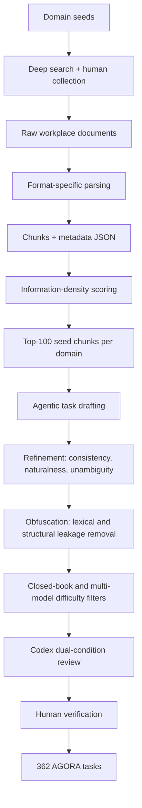

# AGORA：把办公文档 Agent 评测从“读到信息”推进到“在档案里查证、换算和计算”

| 字段 | 内容 |
|---|---|
| 论文 | AGORA: An Archive-Grounded Benchmark for Agentic Workplace Document Reasoning |
| arXiv | https://arxiv.org/abs/2606.24526 |
| arXiv HTML | https://arxiv.org/html/2606.24526 |
| 发布时间 | 2026-06-23 12:57:18 UTC |
| 机构 | Fudan University, Zhejiang University, Shanghai Qiji Zhifeng Co., Ltd. |
| 类型 | 大模型 Agent benchmark / workplace document reasoning |
| 本文关注 | archive-grounded reasoning、bash tool agent、跨文档证据、数值答案、失败模式 |

### TL;DR

- **AGORA 研究什么**：论文不是再做一个普通 RAG QA 集，而是定义 **archive-grounded workplace document reasoning**：Agent 只能访问一个固定办公档案目录，必须自己用 bash 查找文件、读取表格或报告、对齐术语/单位/时间，再提交一个可验证的数值答案。
- **为什么重要**：企业里的知识工作不是“把问题丢给长上下文模型”。真实任务常见于财务报表、统计年鉴、政策文件、行业报告和表格附件之间，证据稀疏、命名混乱、时间窗口不一致。AGORA 把这个痛点压成可复现实验。
- **数据规模**：AGORA 有 **362 个问题**、**8 个职业域集合**、**9,664 个真实文档**、约 **372M tokens**。每个任务都绑定一个 domain archive，文档总量远超任何模型上下文，因此 Agent 不能穷举阅读。
- **构造方法**：作者用三阶段 agentic pipeline 构造 benchmark：先做多域文档收集与解析，再从高信息密度 chunk 合成跨文档问题，最后通过闭卷过滤、多模型难度过滤、Codex 双条件审查和人工核验保留 362 道题。
- **实验设置**：八个模型在同一 `mini-swe-agent` harness 下评估，只暴露 bash 工具；每题运行在隔离 E2B sandbox，无互联网，最多 **200 turns** 和 **3,600 秒**，输出 `<answer>...</answer>` 后结束。
- **关键结果**：最强的 Gemini-3.1-Pro 只有 **59.39%** overall accuracy；GPT-5.5 为 **54.70%**，GLM-5.1 为 **50.00%**。三个低阶/小模型落到 **11.33% / 6.35% / 3.04%**，几乎不能稳定完成任务。
- **最有价值的发现**：AGORA 显示“模型强弱”不是一个全局标量。Gemini-3.1-Pro 总分第一，但 Finance 只有 **41.03%**；GPT-5.5 总分第二，却在 Business 只有 **38.00%**。单域 benchmark 会掩盖这些 domain-model 交互。
- **局限**：数据集只保留 362 道高质量题，覆盖八类职业域但不穷尽所有企业场景；数据来自公开 workplace 文件，只限研究用途；随着预训练语料扩大，benchmark 文档可能被未来模型吸收，闭卷过滤会逐渐失效。

### 研究问题：为什么“办公档案推理”不是普通 RAG？

论文要回答的核心问题可以拆成三个层次：

| 层次 | 普通任务常见假设 | AGORA 要测试的能力 |
|---|---|---|
| 证据位置 | 相关段落已经被检索器放到上下文 | Agent 要在庞大目录里规划搜索路径 |
| 证据形态 | 文本片段或单表格直接包含答案 | 证据分散在多文件、多格式、多时间口径里 |
| 评估方式 | 人评或 LLM judge 判断答案质量 | 每题有唯一数值答案，可确定性验证 |

作者把这个能力称为 **archive-grounded reasoning**。这个词的重点不是“文档很多”，而是三件事同时成立：

1. **Archive-groundedness**：可用证据被限制在固定档案中，不能上网，也不能依赖模型记忆。
2. **Agentic exploration**：Agent 必须主动调用工具，例如 `ls`、`grep`、`find`、`python3`、`awk`，并根据中间结果调整计划。
3. **Evidence integration**：最终答案来自跨文件证据整合，而不是单次检索命中。

这让 AGORA 和常见多跳问答拉开了距离。HotpotQA、MuSiQue、FRAMES 等任务能测试跨段落组合，但语料结构比较均质。TAT-QA、FinanceBench 能测试财报或表格，但通常更接近阅读理解。GAIA、BrowseComp 测 agentic search，却不是固定内部档案。OfficeQA Pro 最接近，但主要来自一个 U.S. Treasury Bulletins 源，域覆盖有限。

AGORA 的主张是：如果要评估企业 Agent 是否能做真实知识工作，benchmark 必须同时压住 **多文件、固定档案、主动探索、确定性评分、跨域覆盖** 这几条约束。

### 任务定义：一个问题、一个档案目录、一个数值答案

每个 AGORA task 的形式可以写成：

```text
Input:
  q: natural-language workplace query
  D_k: one domain-specific document archive
  Tools: bash commands in an isolated Linux sandbox

Process:
  agent explores D_k
  agent finds sparse evidence across files
  agent reconciles terminology, units, dates, assumptions
  agent computes a final numeric answer

Output:
  <answer>formatted_numeric_answer</answer>
```

这个定义里有两个关键设计。

第一，答案必须是 **single verifiable numeric answer**。作者牺牲了开放式报告写作，换来确定性评分。这样可以避免 LLM-as-judge 的噪声，也能让不同模型在同一任务上被严格比较。

第二，Agent 被限制在 paired collection 中。它不能用互联网补外部常识，也不能把任务变成 open-web browsing。这一点很接近企业内网环境：Agent 面对的是一个组织内部档案，而不是整个公开网络。

可以把一个任务看成如下约束优化：

```text
Given archive D and query q:
  maximize correctness(answer)
  subject to:
    evidence(answer) subset D
    calls <= 200
    time <= 3600 seconds
    final answer matches required numeric format
```

这个形式解释了为什么“更长上下文”不是直接答案。AGORA 的总档案是 372M tokens，单个 domain collection 也足以超过模型窗口。即使模型上下文继续变长，任务仍会考验搜索策略、文件定位、证据优先级和中间计算。

### 数据组成：八个职业域如何分布？

AGORA 的八个 domain 来自官方职业分类系统抽象，覆盖农业、建筑、商业、教育、金融、医疗、法律和技术制造。论文 Table 2 给出组成：

| Domain | 文档数 | Tokens | 问题数 | 观察 |
|---|---:|---:|---:|---|
| Agriculture, Resources & Energy | 118 | 38M | 71 | 问题最多，文档少但长文档/统计资料密集 |
| Architecture, Construction, Real Estate & Facilities | 1,005 | 48M | 29 | 文档多，问题少，可能更强调精确定位 |
| Business, Management, Marketing & Sales | 358 | 22M | 50 | tokens 最少但模型差异很大 |
| Education, Science & Academia | 152 | 29M | 49 | 涉及统计年鉴、政策口径和年度对齐 |
| Finance & Economics | 5,966 | 117M | 39 | 文档数和 tokens 最大，检索噪声最高 |
| Healthcare & Medicine | 1,233 | 41M | 34 | 数据族、口径、类别定义容易混淆 |
| Law | 285 | 30M | 35 | 法条、发布日期、条款粒度构成难点 |
| Technology, Software & Manufacturing | 547 | 47M | 55 | 技术报告、产品数据和代码/生产资料混合 |
| **Overall** | **9,664** | **372M** | **362** | 每题都必须在绑定域内查证 |

这个表很重要，因为它说明 benchmark 难度不是简单由“问题数”决定。Finance 有 5,966 个文档，但只有 39 题；Agriculture 只有 118 个文档，却有 71 题。也就是说，AGORA 不是按文件数量平均采样，而是按高质量可验证任务筛选。

对 Agent 来说，这带来两个后果：

- **检索策略必须 domain-aware**：Finance 可能需要先缩小数据源；Agriculture 可能更需要理解单个年鉴或报告里的表格结构。
- **总分不能代表部署风险**：某模型在总体上高分，不代表它能在特定企业域中可靠工作。

### 构造管线：作者如何避免“题目泄露答案”？

AGORA 的构造管线分为三大阶段：



#### Phase 1：文档收集与预处理

作者先从职业分类系统中抽取八个 domain seeds，再用 deep-search agent 找公开 workplace documents。文档格式覆盖：

| 格式 | 解析方式 | 为什么这样处理 |
|---|---|---|
| PDF | 用 `dots.ocr` 转 Markdown，再按 5 页窗口分 chunk | PDF 经常包含表格、脚注、跨页数据 |
| Markdown | 8,000-token sliding window，800-token overlap，7,200-token stride | 保留长报告上下文，同时控制 chunk 粒度 |
| Excel | 每个非空 sheet 变成一个 compact table profile | 记录列名、数据类型、摘要统计、样例行 |
| CSV | 按单 sheet profile 处理 | 统一成 Agent 可读的文本化结构 |

这一步的选择说明作者不是把 benchmark 简化成“纯文本 QA”。他们保留了真实办公数据的异质性，但又把所有格式规范化为 bash agent 能读的文本。

#### Phase 2：信息密度评分与 seed chunk

Appendix B 给了一个机械评分函数。对文本 chunk `c` 和元数据 `m`，评分大致是若干信号的 capped sum：

```text
score(c, m) =
  min(5 * 1000 * |N(c)| / |c|, 30)
  + min(tokens(c) / 50, 20)
  + table_or_sheet_signals(c, m)
  - hard_filter_penalty(c)
```

变量解释：

| 变量 | 含义 | 作用 |
|---|---|---|
| `N(c)` | chunk 中的 numeric tokens 集合 | 奖励含数字、金额、计数、测量值的证据 |
| `|c|` | chunk 长度 | 避免只因文档长就得高分 |
| `tokens(c)` | token 数 | 稍微奖励能容纳跨行计算的大 chunk |
| `table_or_sheet_signals` | 行数、列数、数值列、时间列、年份跨度、表格标记 | 奖励表格和时间序列 |
| `hard_filter_penalty` | 少于 20 tokens 或目录页等结构性垃圾 | 直接排除低信息 chunk |

Excel/CSV 还会加上：

- `rows / 100`，上限 15；
- `cols`，上限 10；
- `2 * numeric_columns`；
- 如果有时间列，加 8；
- `2 * (year_max - year_min)`，上限 10。

Markdown 有表格加 10，有列表加 3；PDF OCR 后含表格加 12。每个 domain 最终保留 top-100 seed chunks。

这个评分函数不是质量判断，而是“给 task synthesis 找入口”。它偏向数字、表格、时间序列和结构化证据，因为 AGORA 的最终答案需要确定性数值验证。

#### Phase 3：合成、混淆与质量控制

任务合成阶段不是一次生成题目就结束。作者让 agent 从 seed chunk 出发，用语义检索跨文档找 bridging facts，生成候选题、参考推理路径和 verification code，然后经过三类强化：

1. **Drafting**：围绕 seed chunk 找跨文件证据，生成问题、推理链和验证代码。
2. **Refinement**：检查自然性、一致性、答案唯一性、问题与证据链是否对齐。
3. **Obfuscation**：移除两类泄露：
   - lexical leakage：题干关键词一两次搜索就能直接打到证据；
   - structural leakage：题干直接暴露本应推断的实体或中间对象。

质量控制更像一个分层漏斗：

| 过滤环节 | 目的 | 被淘汰的题 |
|---|---|---|
| DeepSeek-V4-Pro closed-book | 排除可凭参数知识回答的题 | 不需要档案即可答出 |
| 三模型 panel | 保证难度 | GPT-5.5、DeepSeek-V4-Flash、DeepSeek-V4-Pro 都能答对 |
| Codex query-only review | 检查题干本身是否泄露或歧义 | 没有证据链也能走捷径 |
| Codex query+reasoning-path review | 检查参考链是否有效 | 有证据仍无法唯一推导 |
| Human annotation | 最终核验 | 逻辑、答案或文件证据不稳 |

这个构造方式的取舍很清楚：AGORA 不是追求题量，而是追求每题能真的区分“会查证的 Agent”和“会猜的模型”。

### 实验设置：为什么只给 bash？

作者把八个模型都放进 `mini-swe-agent`，只暴露 bash 工具。这是一个很强的控制变量。

| 设置 | 具体值 | 影响 |
|---|---|---|
| Agent harness | `mini-swe-agent` | 避免复杂框架差异掩盖模型差异 |
| 工具 | bash commands | 能 `ls/find/grep/python3/jq/sed/awk/cat`，但没有高层检索 UI |
| 环境 | E2B isolated sandbox | 文档挂载为本地目录，无互联网 |
| 终止 | 输出 `<answer>...</answer>` | 统一提交流程 |
| 预算 | 200 interaction turns / 3,600 seconds | 同时考察规划效率和资源管理 |
| 上下文 | 各模型原生最大上下文 | 不强行统一窗口，贴近模型实际能力 |
| 温度/推理 | temperature 1.0，reasoning effort 最大 | 尽量给模型发挥空间 |

评估模型包括：

- Gemini-3.1-Pro；
- GPT-5.5；
- GLM-5.1；
- DeepSeek-V4-Pro；
- DeepSeek-V4-Flash；
- Qwen3.5-35B-A3B；
- Gemini-3.1-Flash-Lite；
- Qwen3.5-9B。

这套设置的优点是简单、可复现、接口统一。缺点也明显：它测的是“模型 + bash-only minimal harness”的能力，不等同于一个商业 RAG/Agent 产品的端到端表现。真实系统可能有结构化解析、专用检索器、权限图谱、缓存、引用追踪和表格执行器。

但正因为它简化，AGORA 的结论更锋利：当只给一个通用 shell，模型是否能自己把档案研究做完？

### 主结果：没有模型超过 60%

论文 Table 3 是核心证据。八个模型按 overall accuracy 排序：

| Model | Agri | Arch | Biz | Edu | Fin | Health | Law | Tech | Overall |
|---|---:|---:|---:|---:|---:|---:|---:|---:|---:|
| Gemini-3.1-Pro | 66.20 | 68.97 | 72.00 | 59.18 | 41.03 | 64.71 | 51.43 | 49.09 | **59.39** |
| GPT-5.5 | 60.56 | 58.62 | 38.00 | 48.98 | 53.85 | 52.94 | 62.86 | 61.82 | **54.70** |
| GLM-5.1 | 59.15 | 58.62 | 38.00 | 34.69 | 56.41 | 50.00 | 51.43 | 52.73 | **50.00** |
| DeepSeek-V4-Pro | 43.66 | 55.17 | 42.00 | 38.78 | 46.15 | 50.00 | 51.43 | 47.27 | **45.86** |
| DeepSeek-V4-Flash | 45.07 | 41.38 | 34.00 | 46.94 | 38.46 | 44.12 | 31.43 | 36.36 | **40.06** |
| Qwen3.5-35B-A3B | 7.04 | 6.90 | 12.00 | 12.24 | 2.56 | 17.65 | 17.14 | 16.36 | **11.33** |
| Gemini-3.1-Flash-Lite | 4.23 | 6.90 | 2.00 | 10.20 | 5.13 | 5.88 | 2.86 | 12.73 | **6.35** |
| Qwen3.5-9B | 2.82 | 0.00 | 8.00 | 2.04 | 0.00 | 0.00 | 5.71 | 3.64 | **3.04** |

几个判断值得单独拆开。

#### 1. “60% 天花板”说明任务不是格式问题

每题都有唯一数值答案，且评分只做格式归一化。最强模型 59.39%，不是因为答案风格没被 judge 喜欢，而是因为它没有找到、没有正确抽取或没有正确运用证据。

这和很多开放式 agent benchmark 不一样。开放式任务失败时，常常很难区分“答案不够好”“评审不稳定”“任务定义模糊”。AGORA 把这些噪声压低，所以 40-60% 这个区间更像真实能力缺口。

#### 2. 模型形成两个 tier

前五个模型在 **40.06%-59.39%** 之间，后三个模型在 **3.04%-11.33%** 之间。论文指出 tier gap 是 **28.73 points**，大于任一 tier 内部差距。

这说明 AGORA 不是一个所有模型都均匀变差的 hard benchmark。它有明显门槛：一旦模型在长程证据纪律、工具调用和中间状态管理上不够强，准确率会接近地板。

#### 3. 单域成绩会重排 leaderboard

总分第一的 Gemini-3.1-Pro 在 Business 最高 **72.00%**，但 Finance 只有 **41.03%**。GPT-5.5 在 Business 只有 **38.00%**，却在 Law 和 Tech 分别达到 **62.86%**、**61.82%**，并领先这些域。

这意味着企业部署不能只看一个 aggregate benchmark。一个金融档案 Agent、法律档案 Agent、技术制造档案 Agent 的风险曲线可能完全不同。

### 失败模式：模型主要不是“算错”，而是“查证错”

作者人工标注所有 wrong traces，并归为五类：

| Failure mode | 缩写 | 含义 |
|---|---|---|
| Incomplete Inspection | II | 漏掉必需文档或证据链的一部分 |
| Evidence Misidentification | EM | 看到了相关文件，但抽取了错误值 |
| Resource Exhaustion | RE | 上下文、turn、时间或 sandbox 预算耗尽 |
| Instruction Non-Following | INF | 忽略题目显式约束、口径、格式或步骤 |
| Hallucination | HAL | 编造答案，或忘记前面已经找到的证据 |

论文 Figure 5 的三点结论很关键：

1. 几乎所有模型的错误都主要集中在 **II、EM、INF**，也就是证据定位、证据识别和指令约束执行。
2. **Resource Exhaustion** 很依赖模型：GPT-5.5 的 top failure 是 RE，比例 **24.59%**；DeepSeek-V4 系列接近 0，均不超过 **1.10%**；Gemini-3.1-Flash-Lite 高达 **69.61%**。
3. **Hallucination** 在 frontier tier 中低于 **12%**，但在小模型中接近 **40%**。

这对 Agent 研发有直接含义：

- 只优化最终计算器不够，因为错误更早发生在证据链阶段。
- 只加长上下文也不够，因为 incomplete inspection 和 evidence misidentification 是路径选择问题。
- 小模型不是简单慢一点或笨一点，而是在证据纪律上出现质变。

可以用一个错误传播式表示：

```text
P(correct)
  = P(find all required evidence)
  * P(identify correct values | evidence found)
  * P(follow constraints | values identified)
  * P(compute and format correctly | prior steps)
```

AGORA 的失败分析说明，当前瓶颈主要在前三项，而不是最后的算术。

### 交互轮数：搜索越久不一定越接近答案

Figure 6 按提交答案时的 interaction turns 统计正确/错误分布。论文观察到：

- 正确答案集中在低到中等 turn counts；
- 拖到很深预算的 episodes 大多是错误；
- 长轨迹常常代表方向丢失和重复探索，而不是逐步收敛。

这和真实 Agent 调试经验一致。一个 Agent 如果前 20-40 步没有建立正确证据地图，后面很容易进入“继续 grep、继续翻文件、继续修补假设”的循环。预算越大，未必越安全；缺少证据状态管理时，预算只是放大漂移。

更合理的策略不是无限加 turns，而是显式维护：

| 状态 | 需要记录什么 |
|---|---|
| Evidence map | 哪些文件支持哪些中间变量 |
| Missing slots | 最终公式还有哪些变量未查到 |
| Unit/time assumptions | 当前使用的单位、年度、口径 |
| Rejected paths | 哪些文件或解释已被排除，为什么 |
| Verification code | 最终答案由哪些可复算步骤得到 |

AGORA 没有直接提出这种系统，但它的 failure modes 指向这个方向：Agent 需要可审计的证据状态，而不只是更强的语言模型。

### Figure/Table 证据逐项解读

| 论文证据 | 支持的 claim | 不能证明什么 |
|---|---|---|
| Figure 1 | AGORA 总规模为 372M tokens、9,664 文档、362 问题；最强模型不到 60% | 不能说明真实企业 Agent 产品也只有 60%，因为产品可能有更强工具链 |
| Table 1 | AGORA 同时满足 Multi-file、Archive-grounded、Agentic，区别于 HotpotQA、TAT-QA、GAIA、BrowseComp 等 | 不能说明这些旧 benchmark 没价值，只说明覆盖维度不同 |
| Figure 2 | 任务需要 bash 探索、分析和提交单一答案 | 不能覆盖 GUI 或多模态办公软件操作 |
| Figure 3 | 构造管线包含数据收集、任务合成、质量控制三阶段 | 不能完全消除合成题偏差 |
| Table 2 | 八个 domain 的文档、tokens、问题数分布很不均匀 | 不能推出哪个 domain 本质更难，因为模型-domain 交互很强 |
| Table 3 | 八模型准确率分成 frontier tier 和 near-floor tier；没有模型超过 60% | 不能把分数外推到其他 harness 或检索增强系统 |
| Figure 4 | 同一模型在不同 domain 上有大幅残差，leaderboard 会重排 | 不能说明 domain 标签本身就是唯一难度来源 |
| Figure 5 | 错误主要来自证据定位/识别/指令执行，而不是单纯幻觉 | 失败标注仍是人工归类，类别之间可能重叠 |
| Figure 6 | 长轨迹多数不代表收敛，而是方向丢失 | 不能说明所有任务都应早停，只说明无结构探索会浪费预算 |

### 与 OfficeQA Pro、Workspace-Bench 的位置关系

AGORA 处在一个很具体的位置：它比普通 RAG benchmark 更 agentic，又比开放式工作流 benchmark 更可确定评分。

| Benchmark | 主要对象 | AGORA 的差异 |
|---|---|---|
| OfficeQA Pro | 企业 grounded reasoning，主要基于 U.S. Treasury Bulletins | AGORA 扩展到八个职业域，并强调跨域 rank inversion |
| Workspace-Bench | 大规模 workspace file dependency 和任务执行 | AGORA 更专注固定档案中的数值问答和 deterministic evaluation |
| GAIA / BrowseComp | open-web agentic reasoning | AGORA 禁止互联网，测试内部档案而非开放网络搜索 |
| HotpotQA / MuSiQue / FRAMES | 多跳文本 QA | AGORA 加入文件系统导航、表格/报告/单位换算和 bash 工具调用 |

所以 AGORA 的贡献不是“我比所有 benchmark 都难”。它更像一个窄而深的探针：当 Agent 面对企业档案目录时，能不能把证据链完整走完？

### 证据边界与局限

AGORA 的设计很强，但也要小心解读。

#### 1. 362 题是质量优先，不是规模优先

362 个问题对高质量跨文档任务来说并不少，但从统计覆盖上看仍有限。特别是每个 domain 的题数不均，Architecture 只有 29 题，Healthcare 34 题，Finance 39 题。单个 domain 的分数会有方差。

#### 2. Bash-only harness 是控制变量，也是限制

真实企业系统可能具备：

- OCR/解析质量更高的 document pipeline；
- 结构化表格查询；
- hybrid search；
- 权限和元数据索引；
- 引用追踪；
- 自动单位换算；
- task-specific verifier。

AGORA 的结果不能直接等同于这些系统的产品表现。但它能评估底层模型在最小工具条件下的自主档案探索能力。

#### 3. 合成题可能带来分布偏差

任务由 agentic pipeline 合成，再经人工核验。这个流程比人工从零写题更可扩展，但可能偏向“能被构造器想到的跨文件数值题”。一些真实办公任务，例如写报告、做判断、生成策略建议、审查合同风险，不会被 AGORA 覆盖。

#### 4. 数据泄露风险会随时间上升

论文的 Responsible NLP 部分指出，公开 workplace documents 未来可能进入预训练语料。随着模型训练数据扩大，closed-book filtering 的保护会变弱。AGORA 的长期可用性需要版本化、隐藏测试集或持续更新。

#### 5. 数据使用只限研究目的

作者说明 AGORA 数据来自公开来源，但受原始访问条件约束，数据集严格用于 academic research。若后续开源数据或评测平台，使用者需要尊重原始来源条款。

### 研究者视角：AGORA 对 Agent 训练有什么启发？

AGORA 最值得带走的不是“某模型得了多少分”，而是它把 workplace Agent 的能力拆成了可训练、可诊断的中间环节。

#### 1. Agent 后训练需要“证据状态”监督

如果错误主要是 II、EM、INF，训练目标不能只奖励最终答案。更合理的 supervision 包括：

- 哪些文件是必需证据；
- 每个中间变量来自哪个文件、哪一行或哪张表；
- 哪些候选证据被拒绝；
- 当前答案公式缺哪个 slot；
- 最终计算代码是否可复算。

这类监督可以构造成 trajectory-level reward：

```text
R = R_answer
  + lambda_1 * R_evidence_coverage
  + lambda_2 * R_value_identification
  + lambda_3 * R_constraint_following
  - lambda_4 * R_unproductive_turns
```

其中：

- `R_answer` 是最终数值是否正确；
- `R_evidence_coverage` 奖励找到全部必需文件；
- `R_value_identification` 奖励抽对变量；
- `R_constraint_following` 奖励单位、时间、格式、过滤条件正确；
- `R_unproductive_turns` 惩罚重复搜索和无效探索。

AGORA 本身未提供这样的训练框架，但它的 verification code、reference reasoning path 和 failure annotations 说明这条路线可行。

#### 2. 检索器不是 Agent 的全部，规划器也不是全部

AGORA 的任务要求先检索、再抽取、再对齐、再计算。单独强化一个组件会遇到瓶颈：

| 只优化的部分 | 仍会失败的地方 |
|---|---|
| 更强 embedding retrieval | 题干经过 obfuscation，直接关键词可能失效 |
| 更大上下文窗口 | 372M tokens 无法整体塞入，且噪声会干扰 |
| 更强计算器 | 变量抽错或单位错时，计算越精确越危险 |
| 更多 turns | 如果没有证据状态，长轨迹会重复探索 |
| 更强 LLM judge | AGORA 直接数值评分，不需要 judge；失败在执行链里 |

这提示 Agent 系统应该把检索、证据地图、约束跟踪、代码执行和答案验证组合起来，而不是把它们都压给一个 prompt。

#### 3. 企业 Agent 评估应该按 domain 报告

AGORA 的 domain residual 是论文最实用的发现之一。部署一个“企业文档 Agent”时，平均分意义有限；应该按业务域和文件类型报告：

- 财务报表；
- 法律条款；
- 医疗统计；
- 建筑/地产报告；
- 教育统计年鉴；
- 技术制造手册；
- 销售/商业分析材料。

每个 domain 还应该继续拆出文件格式、时间跨度、单位换算、跨文档 hop 数和表格复杂度。否则，一个总体 leaderboard 可能把真正危险的域隐藏起来。

### 结论

AGORA 的贡献在于，它把办公档案 Agent 的评测从“能不能回答文档问题”推进到“能不能在固定档案中主动查证、跨文件整合、遵守口径并提交可验证数值答案”。

它的证据很明确：

- 数据上，AGORA 覆盖 **8 个 domain、9,664 文档、372M tokens、362 问题**；
- 方法上，构造管线结合文档解析、信息密度评分、任务合成、泄露混淆、多层质量控制和人工核验；
- 实验上，八模型在统一 bash-only harness 下评估，最强模型也只有 **59.39%**；
- 分析上，失败主要不是幻觉，而是证据查找、证据识别、指令约束和资源管理。

对 Agent 研究来说，AGORA 最重要的提醒是：可靠的 workplace Agent 不是“会调用工具的聊天模型”，而是一个能维护证据状态、检查中间变量、复算答案、控制搜索预算的档案推理系统。后续真正有价值的改进，应该把最终答案奖励拆成证据覆盖、变量抽取、口径对齐、计算可复现和轨迹效率这些可诊断目标。
