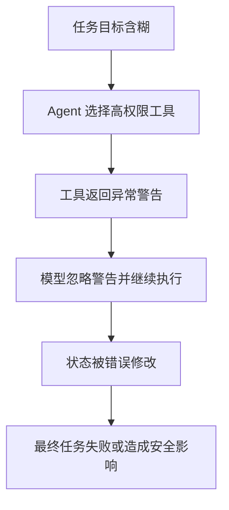

# SAFARI: 把长程 Agent 失败从“看完整条轨迹”改成主动调查

## 元信息

- **标题**：SAFARI: Scaling Long Horizon Agentic Fault Attribution via Active Investigation
- **类别**：大模型 Agent / Agent 可观测性 / 故障归因
- **原文**：[arXiv:2606.24626](https://arxiv.org/abs/2606.24626)
- **HTML 全文**：[arXiv HTML](https://arxiv.org/html/2606.24626)
- **会议页面**：[AIWILD / OpenReview 条目](https://openreview.net/forum?id=tXVNXhps8B&referrer=%5Bthe+profile+of+Sambit+Sahu%5D%28%2Fprofile%3Fid%3D~Sambit_Sahu2%29)
- **相关代码背景**：[TRAIL benchmark](https://github.com/SalesforceAIResearch/TRAil)、[Who&When benchmark](https://github.com/ServiceNow/WhoWhen)
- **时间窗口证据**：arXiv v1 在 2026-06-23 提交，OpenReview 页面显示 2026-06-24 修改，落在本周 UTC 窗口内。

## TL;DR

- **这篇论文研究什么**：SAFARI 处理长程 Agent 轨迹里的故障归因问题。给定一次失败任务、上千步交互和多个候选根因，模型不再被要求一次性读完整日志，而是像调试员一样分轮提出调查问题、调用检索工具、逐步缩小根因。
- **核心方法是什么**：论文把故障归因改写成主动调查任务，定义由 `Identify`、`Localize`、`Validate`、`Refine` 组成的循环；每一轮只读取与当前假设相关的轨迹片段，并用 evidence set 维护已经看到的证据。
- **训练数据怎么来**：作者用 Gemini 2.5 Pro 生成调查轨迹，把 AIWILD、TRAIL、Who&When 三类数据转成 274 个任务、2,600 条多轮调查示范，再用这些示范训练小型开源模型。
- **关键数字是什么**：在 8B 量级模型上，SAFARI 式微调把 4,000 token 上下文设置的总体准确率从基线约 28.5% 提到约 54.1%；在 64,000 token 上下文设置下也从约 38.3% 提到约 55.8%。这说明收益不只是“塞不进上下文”导致的。
- **证据边界在哪里**：最强证据来自 Table 2 到 Table 7 对不同上下文、模型规模和 benchmark 的对比；但任务总量仍只有数百级，示范轨迹由强模型合成，且评价目标是离线根因判断，不能直接证明生产 Agent 监控系统已经可部署。
- **为什么值得读**：Agent 可靠性讨论常停在“失败了要审日志”。SAFARI 更具体地提出：长程轨迹的关键瓶颈不是日志缺失，而是调查预算、证据检索、假设更新和根因定位之间的决策问题。

## 研究问题：为什么长程 Agent 失败不能只靠长上下文

这篇论文的起点很明确：Agent 失败归因通常发生在任务已经失败以后，工程师需要回答三个问题。

1. **哪里出错**：是哪一步、哪个工具调用、哪个中间状态把任务带偏。
2. **为什么出错**：是模型误解目标、环境反馈误导、工具返回异常、上下文遗漏，还是多个子错误叠加。
3. **下一次怎么防**：需要改 prompt、改工具权限、加验证器、换策略，还是把某类任务交给人类。

论文认为，现有做法有一个隐藏假设：只要把完整轨迹放进上下文，模型就能自己归因。这个假设在长程 Agent 上很脆弱。

| 难点 | 传统长上下文读法的问题 | SAFARI 重新定义的问题 |
|---|---|---|
| 轨迹很长 | 关键错误可能只占少数片段，完整阅读稀释注意力 | 先提出调查假设，再按需检索片段 |
| 错误延迟显现 | 根因发生在早期，失败表现在后期 | 区分 symptom、trigger、root cause |
| 多工具交互 | 工具输出、模型计划、环境状态相互影响 | 把证据拆成可验证的观察集合 |
| 预算有限 | 人或模型不可能无限读日志 | 把归因写成分轮决策过程 |

因此，论文并不是单纯提出一个新 benchmark，而是在问：**长程 Agent 的故障归因能否从静态分类任务变成主动信息获取任务？**

这个问题对 Agent 安全也重要。很多安全事故不是模型一开始就输出危险内容，而是模型在多步环境中持续累积偏差：先误读权限，再错误选择工具，再忽略异常反馈，最后造成数据泄露、错误修改或不可恢复操作。若归因系统只看最后一步，它会把“结果错误”误判成“局部工具失败”，看不到前面的策略偏差。

## 论文主张与论证路线

作者的论证可以整理成 claim → mechanism → evidence → boundary。

| Claim | Mechanism | Evidence | Boundary |
|---|---|---|---|
| 长程 Agent 故障归因不应等同于一次性阅读完整轨迹 | 把任务转成主动调查：提出问题、检索片段、验证假设、更新结论 | Table 2 显示 SAFARI 微调模型在有限上下文下显著超过直接判别基线 | 只覆盖论文选取的三类数据源，不能说明所有生产日志都适合相同工具接口 |
| 主动调查能力可以通过合成轨迹训练出来 | 用 Gemini 2.5 Pro 生成多轮调查示范，再蒸馏给 8B/14B 模型 | Table 3、Table 4 对不同模型和上下文长度给出稳定提升 | 示范来自强模型，存在风格迁移与 teacher bias |
| 收益不只是上下文长度不足 | 在 64K 上下文下 SAFARI 仍超过长上下文基线 | Table 5/6 的长上下文对照支持“调查策略”本身有价值 | 64K 仍不是无限上下文，且长上下文模型的提示设计会影响结论 |
| 故障归因需要拆分为定位、解释和验证 | 论文用 evidence gathering 过程约束模型不要直接猜答案 | 附录示例展示模型逐步检查轨迹片段后收敛到根因 | 自动评价是否完全捕捉“解释质量”仍有限 |

这个论证顺序有一个值得注意的设计：作者没有把 SAFARI 包装成“更会读长文本的模型”，而是把它描述成一种 **调查协议**。模型的能力不是一次读完所有证据，而是在有限证据下知道接下来该问什么。

## 方法机制：SAFARI 如何把日志审计变成调查循环

论文中的 SAFARI 可以理解成一个带工具的 fault attribution policy。输入不是普通摘要，而是一组结构化对象。

| 组件 | 含义 | 对归因的作用 |
|---|---|---|
| `task description` | 原始 Agent 要完成的任务 | 定义成功条件，避免只看最终报错 |
| `trajectory` | Agent 的多步行动、观察、工具调用和环境反馈 | 提供可能的根因和症状链 |
| `candidate fault labels` | 可能的失败类型或候选责任点 | 限定最终输出空间 |
| `retrieval tools` | 按 step、关键词或片段读取轨迹 | 控制调查预算 |
| `evidence set` | 已经读取并用于判断的片段 | 防止模型凭直觉跳结论 |

主动调查循环可以写成下面的伪代码。

```text
Input:
  task T
  long trajectory R = {r_1, r_2, ..., r_n}
  candidate fault set C
  investigation budget B

State:
  hypothesis h
  evidence set E = {}
  unresolved questions Q = {}

For round t in 1..B:
  Identify:
    propose the most informative question q_t
    based on T, C, E, and current h

  Localize:
    call retrieval tool over R
    fetch trajectory spans S_t likely to answer q_t

  Validate:
    compare S_t with task success criteria
    update E = E union S_t
    mark which candidate faults remain plausible

  Refine:
    update h
    if h is sufficiently supported:
      break

Output:
  root-cause attribution
  supporting evidence spans
  uncertainty or remaining ambiguity
```

这个流程的关键不是“多看几段日志”，而是把信息获取顺序显式化。每一轮调查都必须回答：当前最能区分候选根因的问题是什么？

用公式化方式表示，SAFARI 近似在做一个带预算的信息增益问题。

```text
选择下一步调查 q_t：

q_t = argmax_q  E[ Gain(h; evidence(q, R)) - Cost(q) ]

变量解释：
- h：当前根因假设或候选 fault label 的分布
- q：下一轮调查问题
- evidence(q, R)：在轨迹 R 中由问题 q 触发检索到的片段
- Gain：新证据对候选根因不确定性的减少
- Cost：检索、阅读和推理预算
```

论文没有把它实现成严格的贝叶斯优化，但这个抽象能说明作者的意图：长程 Agent 归因的核心不是最大化阅读量，而是最大化单位调查成本下的根因区分度。

## 数据构造：三个来源如何被改造成主动调查任务

SAFARI 的数据不是从单一合成环境来，而是拼接了三个不同侧面的 Agent 故障来源。

| 数据源 | 原始关注点 | 转成 SAFARI 后的作用 |
|---|---|---|
| AIWILD | 开放环境中的 Agent 任务和失败记录 | 提供长程、开放式、非完全结构化的失败案例 |
| TRAIL | trace reasoning 与 issue localization | 提供更接近轨迹定位的监督信号 |
| Who&When | 多 Agent 或多角色流程中的责任与时序归因 | 强化“谁在什么时候导致偏差”的判断 |

作者把这些数据转成 274 个任务，再生成 2,600 条调查轨迹。这个比例说明每个任务会有多条调查示范，而不是只给一个标准答案。

为什么需要多条示范？原因有三点。

1. **同一故障可以从不同问题进入**：有人先查最终失败，有人先查关键工具调用，有人先查计划偏离。
2. **调查路径本身是训练目标**：只给最终 root cause 会训练出猜答案模型；给路径才能训练出“下一步该查什么”。
3. **长程轨迹需要局部证据对齐**：每个结论都要绑定到可检索片段，防止模型用常识替代证据。

这里也出现第一个证据边界：训练轨迹由 Gemini 2.5 Pro 生成。它让数据构造变得可扩展，但也会把 teacher 的调查风格、偏好和错误传给 student。若 teacher 倾向于某类解释，student 可能学到的是“像 teacher 一样归因”，而不一定是最可靠的因果诊断。

## 实验设置：作者到底在比较什么

论文的实验主线围绕两个问题展开。

1. **SAFARI 训练是否优于直接给模型完整问题和轨迹？**
2. **当上下文变长时，主动调查策略是否仍然有用？**

实验中常见的比较对象可以概括如下。

| 设定 | 输入方式 | 预期检验点 |
|---|---|---|
| Direct baseline | 直接给任务、轨迹或截断轨迹，让模型输出归因 | 检验普通指令跟随和长上下文阅读能力 |
| SAFARI-style inference | 模型分轮调用工具读取片段后输出归因 | 检验主动调查策略 |
| Context-length variants | 4K、16K、64K 等不同上下文预算 | 区分“上下文塞不下”和“不会调查” |
| Model-size variants | 8B、14B 等不同 student | 检验方法是否只对单一模型有效 |

评价指标主要看最终归因是否正确，同时附带分析调查步骤是否能定位到支持证据。这里需要区分两个层次。

- **分类正确**：最终选对 root cause 或 fault label。
- **调查可信**：模型的中间证据确实支持最终结论。

论文的主要数字强调第一层，附录示例和分析补充第二层。对生产 Agent 监控而言，第二层往往更重要，因为错误的“正确答案”解释会误导修复方向。

## 主结果：SAFARI 的收益来自调查策略，不只是上下文长度

论文最直观的结果是：小模型经过 SAFARI 轨迹训练后，在长程故障归因上明显超过直接判别基线。

| 设置 | 基线表现 | SAFARI 后表现 | 论文想证明什么 |
|---|---:|---:|---|
| 8B / 4K 上下文 | 约 28.5% | 约 54.1% | 有限上下文下，主动检索和调查能补足读不完整轨迹的问题 |
| 8B / 64K 上下文 | 约 38.3% | 约 55.8% | 即使能看更多文本，调查协议仍带来额外收益 |
| 多数据源综合 | 各源基线差异较大 | SAFARI 普遍更稳 | 方法不是只记住某一个 benchmark 的格式 |

这些数字的含义不能简单理解为“准确率翻倍”。更准确的解释是：

1. **长上下文确实有帮助**：基线从短上下文到长上下文会改善，说明部分错误来自证据不可见。
2. **长上下文不够**：64K 基线仍落后于 SAFARI，说明模型即便看到更多内容，也不一定知道哪些片段关键。
3. **调查轨迹是额外监督**：SAFARI 训练的不是最终标签，而是如何获取和组织证据。

这对 Agent 评测有一个重要启发：当任务失败时，完整日志不是答案本身。日志只是证据库，归因系统还需要一套面向根因的查询策略。

## 消融与失败边界：哪些部分不能省

论文的消融重点在于上下文、工具使用、训练数据和模型规模。可以把结论拆成四类。

| 消融方向 | 观察 | 对方法的解释 |
|---|---|---|
| 去掉主动调查 | 退化成直接判别，准确率下降 | 中间调查步骤不是装饰，而是主要监督信号 |
| 缩短上下文 | 直接基线掉得更明显 | SAFARI 通过按需读取缓解截断损失 |
| 换模型规模 | 大模型更强，但小模型仍因训练受益 | 方法可被蒸馏，不只是 frontier model 的 prompt trick |
| 换数据源 | 不同来源难度不同 | 故障归因依赖轨迹结构，不能只看平均分 |

失败边界同样值得强调。

- **多根因问题仍困难**：真实 Agent 失败常有多个责任点，论文设置更像“找主要根因”，不等于完整因果图。
- **工具检索质量会成为瓶颈**：如果轨迹检索工具漏掉关键片段，再好的调查策略也会被误导。
- **合成示范可能过于整洁**：真实工程日志有噪声、缺字段、重复事件和异常格式，论文数据不能完全覆盖。
- **评价可能奖励标签正确而非修复有用**：生产排障关心“能否指导修复”，而不只是 root-cause label 匹配。

这些边界不削弱论文价值，反而说明 SAFARI 的定位：它是从“长日志分类”走向“主动调查”的第一步，而不是完整 AIOps 或 Agent 安全运维系统。

## Figure / Table 证据解读

原文的表格比图片更关键，因此这里用文字和表格解释，不本地化外部图片。

| 证据位置 | 支撑的结论 | 不能证明什么 |
|---|---|---|
| Table 2 | SAFARI 训练在总体准确率上超过直接基线 | 不能证明每一种失败类型都被同等改善 |
| Table 3 | 不同模型规模下方法仍有收益 | 不能排除特定模型架构或 tokenizer 对结果有影响 |
| Table 4 | 不同数据源合并训练有助于泛化 | 不能证明跨真实企业日志仍能泛化 |
| Table 5/6 | 长上下文下主动调查仍有增益 | 不能证明无限上下文也不需要调查 |
| 附录案例 | 调查问题能逐步定位证据 | 案例是说明性证据，不等于大规模人工解释质量评估 |

最值得带走的是 Table 5/6 的含义。很多长程 Agent 论文会把问题归因于 context window，不断扩大窗口或压缩轨迹。SAFARI 的结果提醒我们：**看得见不等于会诊断**。在根因归因任务里，模型还需要知道如何提出能区分假设的问题。

## 与相关工作的关系

SAFARI 位于三条研究线的交叉点。

1. **Agent trace analysis**
   - 这条线关注如何从轨迹中定位失败步骤。
   - TRAIL 和 Who&When 提供了更早的轨迹推理与责任归因任务。
   - SAFARI 的增量是把“读轨迹并判断”改成“主动调查轨迹”。

2. **Long-context reasoning**
   - 这条线通常问模型能否在长文本中找到答案。
   - SAFARI 的结果表明，长上下文只是必要条件之一；任务还需要面向假设的证据选择。

3. **Agent safety and observability**
   - 这条线关心工具调用、权限、环境状态和多步失败。
   - SAFARI 没有直接做防御策略，但提供了事故后归因的训练范式。

如果把它放到 AI 安全语境里，SAFARI 更接近 **post-incident forensics for agents**。它不是阻止 Agent 犯错，而是让系统在犯错后更快、更有证据地解释错在哪里。

## 对 Agent 安全和后训练的延伸

SAFARI 对后续研究有三个直接启发。

### 1. 后训练不只训练行动，也应训练调查

Agent 后训练常见目标是提高任务成功率：更会规划、更会调用工具、更会修复错误。SAFARI 暗示另一类能力同样重要：当任务失败时，模型能不能调查自己或其他 Agent 的失败。

这可以形成一个双策略训练目标。

```text
Policy pair:
  actor policy pi_a: choose actions to solve task
  auditor policy pi_o: choose investigations to explain failure

Training objective:
  maximize task success for pi_a
  maximize attribution accuracy and evidence sufficiency for pi_o
  penalize unsupported explanations
```

这种 actor-auditor 分离对安全有意义。行动模型追求完成任务，审计模型追求证据充分，两者目标不同，可以互相制衡。

### 2. Agent 日志格式会影响可归因性

SAFARI 默认轨迹能被检索和切片。如果生产系统日志没有结构化 step、tool call、observation、state diff、权限上下文，主动调查会很困难。

因此，Agent 平台应把可归因性作为日志设计目标。

| 日志字段 | 为什么重要 |
|---|---|
| step id | 支持定位根因发生时间 |
| tool name and arguments | 判断是否选错工具或传错参数 |
| observation | 区分环境异常和模型误读 |
| state diff | 识别哪一步改变了关键状态 |
| policy rationale | 辅助判断计划偏离，但不能当作唯一证据 |
| permission context | 判断失败是否来自过度授权或权限不足 |

这也是论文对工程实践最直接的提醒：没有可检索、可对齐、可引用的轨迹，就很难训练可靠的归因模型。

### 3. 安全事故调查需要多根因输出

SAFARI 当前更偏向主要根因识别，但真实安全事故常是链式的。



如果只输出一个 root cause，系统可能把事故归为“忽略警告”，却漏掉上游的“高权限工具选择”和“任务目标含糊”。下一步研究可以把 SAFARI 的单点归因扩展成因果链恢复。

## 局限与可复现性判断

这篇论文的可复现性中等偏上，但仍有几个缺口。

- **数据规模可读但不算大**：274 个任务、2,600 条调查轨迹足以验证方法方向，但不足以覆盖真实 Agent 事故分布。
- **teacher 依赖明显**：Gemini 2.5 Pro 生成示范让数据质量较高，但复现者需要同等级 teacher 或公开生成轨迹。
- **日志接口假设较强**：论文中的轨迹能被检索工具访问；真实平台可能存在缺字段、隐私脱敏和日志截断。
- **解释质量评价不足**：最终准确率是必要指标，但还需要人工或自动方式评价证据是否充分、结论是否可修复。
- **安全部署仍需额外约束**：若审计模型能读取敏感轨迹，它自身也需要访问控制、脱敏和审计日志。

因此，SAFARI 最适合被看作一种研究范式：把长程 Agent 失败归因从静态阅读任务改成主动调查任务。它还不是完整产品方案，但给出了清晰的训练数据结构、推理协议和评测方向。

### 还缺哪类实验

如果沿着作者的路线继续推进，最需要补的是三组更接近真实系统的实验。

| 缺口 | 需要的实验 | 为什么重要 |
|---|---|---|
| 噪声日志 | 在缺字段、重复事件、错误时间戳、脱敏文本上重测 | 真实 Agent 平台很少给出论文里那样整洁的轨迹 |
| 反事实修复 | 让模型不仅找根因，还提出最小修复并回放验证 | 安全审计最终要服务修复，而不是只写事故摘要 |
| 对抗性归因 | 在被污染的观察、误导性工具输出、攻击者插入日志下测试 | 攻击者可能诱导审计系统把责任归给无关步骤 |

这三组实验会把 SAFARI 从“离线归因 benchmark”推向“事故调查系统”。尤其是对抗性归因很关键：如果攻击者知道审计模型会检索哪些字段，就可能构造看似合理的错误证据，把根因从真实攻击步骤转移到普通环境异常。长程 Agent 的安全审计不能只假设日志诚实，还要考虑日志本身被部分污染、部分缺失或被权限策略遮蔽时，模型是否会给出过度自信的结论。

## 结论

SAFARI 的价值在于把一个含糊的问题具体化。过去我们说“Agent 失败后要看日志”，但没有说模型应该如何看、先看哪里、如何验证假设、如何在预算内收敛到根因。

这篇论文给出的答案是：

1. 把轨迹当作证据库，而不是一段必须完整塞进上下文的文本。
2. 把归因当作主动调查，而不是一次性分类。
3. 用合成调查轨迹训练小模型，让它学会提出下一步问题。
4. 用不同上下文长度和数据源验证，说明收益来自调查策略，而不只是上下文窗口。

对 Agent 研究者来说，SAFARI 的下一步问题也很清楚。

- 如何从单根因走向多根因因果链？
- 如何评价解释是否真的帮助修复？
- 如何把审计模型接入生产日志而不引入新的隐私和权限风险？
- 如何把 actor 的行动训练与 auditor 的调查训练结合起来？

这些问题比单纯提高 benchmark 分数更接近长程 Agent 的真实可靠性难题。SAFARI 的贡献不是宣称已经解决 Agent 故障归因，而是把“失败后如何调查”变成了一个可训练、可评测、可继续扩展的研究对象。
