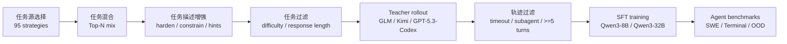
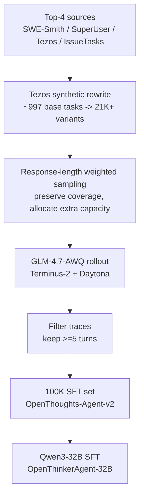
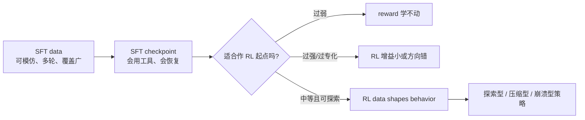

# OpenThoughts-Agent：把 Agent 后训练从“单榜刷分”拉回数据配方实验

### 元信息

- **论文**：[OpenThoughts-Agent: Data Recipes for Agentic Models](https://arxiv.org/abs/2606.24855)
- **版本**：arXiv v1，2026-06-23 17:34:29 UTC
- **项目代码**：[open-thoughts/OpenThoughts-Agent](https://github.com/open-thoughts/OpenThoughts-Agent)
- **项目主页**：[OpenThoughts](https://www.openthoughts.ai/)
- **HF Paper**：[huggingface.co/papers/2606.24855](https://huggingface.co/papers/2606.24855)
- **类别**：大模型后训练 / Agent 训练数据 / 工具调用与终端任务

### TL;DR

- **这篇文章做什么**：OpenThoughts-Agent 研究如何为通用 Agentic LLM 构造开放的 SFT 与 RL 数据，而不是只针对 SWE-Bench 或 Terminal-Bench 这类单一榜单调一套数据。
- **怎么做**：作者搭出六阶段 SFT 数据管线，逐阶段做 100+ 个受控消融；每个 10K 规模 SFT 消融都用 Qwen3-8B、GLM-4.7-AWQ teacher、Terminus-2 harness、Daytona sandbox 与三类核心 benchmark 评估。
- **关键证据**：最终 100K SFT 数据训练 Qwen3-32B，得到 OpenThinkerAgent-32B；它在七个 Agent benchmark 平均 **44.8%**，超过 Nemotron-Terminal-32B 的 **40.9%**，并在 SWE-Bench Verified **54.0%**、Terminal-Bench 2.0 **26.2%** 上领先。
- **训练配方**：SFT 里最重要的不是 teacher 越强越好，而是任务源、任务混合、多样性和长轨迹过滤；RL 里最重要的是 reward 数据源是否诱导合适行为，`pymethods2test` 在 8B 设置下最强。
- **关键数字**：任务源选择带来最大波动，95 个来源里 SWE-Smith、StackExchange SuperUser、StackExchange Tezos、IssueTasks 居前；Top-4 混合优于单一 Top-1；`>=5 turns` 轨迹过滤在三项核心评测里最稳；32B 100K SFT 约 5 小时 wall time，8B RL hero run 用 24xA100 约 46 小时。
- **局限**：RL 只在 8B 上系统研究，SFT 基模主要固定在 Qwen3 家族，最大 SFT 数据只有 100K 轨迹；论文没有证明这些趋势能直接外推到 32B RL、多百万轨迹、Qwen3.5/其他基模或真实生产 Agent。

### 研究问题：Agent 后训练到底缺什么？

- 论文关心的不是“又一个 coding agent 模型分数更高了吗”。
- 它真正追问的是：
  - **训练数据从哪里来**，才不会只学会一个 benchmark 的格式。
  - **任务、teacher、轨迹过滤、数据规模**分别贡献多少。
  - **SFT 与 RL**能否在 Agent 场景里组合，而不是各自为政。
  - **开放研究**能否拿到足够细的数据配方，而不是只看到模型权重和最终分数。

| 旧问题 | 论文改写后的问题 | 为什么重要 |
|---|---|---|
| 哪个开源 Agent 模型分数最高 | 哪类数据配方能稳定训练通用 Agent | 分数可能来自 harness、榜单污染或单任务专化 |
| 多收集 SWE 数据是否足够 | 不同任务源、混合、过滤是否改变泛化 | Agent 需要代码、终端、工具、医疗、金融、多步 QA |
| 强模型当 teacher 是否必然更好 | teacher 轨迹是否适合学生模仿 | 高分 teacher 可能太短、太隐式、太难蒸馏 |
| RL 是否只要 verifier reward | 哪类 RL 数据会诱导探索、压缩或崩溃 | 同一 RLOO 管线会因数据源学出相反行为 |

### 论证路线：claim -> mechanism -> evidence -> boundary

| Claim | Mechanism | Evidence | Boundary |
|---|---|---|---|
| Agent SFT 数据源是最大杠杆 | 任务描述决定要学的环境、技能与失败模式 | 95 个任务源排名中，SWE-Bench Verified-100 可差约 30pp，Terminal-Bench 2.0 可差约 10pp | 只覆盖论文收集到的任务源，不等于全域最优 |
| 混合比单源更稳 | Top-4/Top-8 降低单 benchmark 过拟合 | Top-4 混合在核心三项平均上超过 Top-1 | 混合过宽到 Top-16 在 100K 时反而伤害 |
| 最强 teacher 不一定最好 | 学生需要可模仿的轨迹，不只需要 teacher 自身高分 | GPT-5.3-Codex 在 teacher 消融中弱于 GLM-4.7-AWQ，Terminal-Bench 约低 5pp | 这是给定 harness、任务源、学生模型下的结论 |
| 长轨迹过滤有用 | 多轮轨迹包含探索、修正、工具调用结构 | `>=5 turns` 过滤优于 timeout/subagent 过滤 | 长轨迹不是越长越好，RL 部分显示过度探索会崩 |
| 100K SFT 能跨 benchmark 泛化 | 合成任务扩增补足任务描述多样性瓶颈 | 32B 100K 在七项平均 44.8%，超过 Nemotron-Terminal-32B | OOD 仍有 MedAgentBench 等项目不占优 |
| RL 数据源决定学到的行为 | 相同 RLOO 管线在不同 reward 数据上诱导探索或压缩 | `pymethods2test` 最强，`llm-verifier-freelancer` 则让策略变短 | RL 结论只在 8B、24xA100、指定环境下验证 |

### 六阶段 SFT 管线：作者把“数据配方”拆成可消融变量

论文的核心贡献，是把 Agent SFT 数据整理为 `(task, trajectory)` 对：

- `task`：Agent 要解决的问题说明，例如 GitHub issue、终端任务、StackExchange 问题。
- `trajectory`：teacher agent 在 sandbox 里执行任务的多轮记录，包括思考、工具调用、环境反馈、最终答案。

作者没有把这当成一次性抓数据，而是拆成六个可以独立替换的阶段：



**实验设计的重点**：

- 每个阶段只改一个变量，其他步骤保持一致。
- 每次 10K 轨迹规模，先训练 Qwen3-8B 以降低成本。
- 核心评测包括：
  - OpenThoughts-TBLite，100 个 Terminal-Bench 风格任务。
  - SWE-Bench Verified-100，按 repo 分层抽样。
  - Terminal-Bench 2.0，89 个手工验证任务。
- OOD 评测暂时不参与数据管线选择，只在最终模型上测：
  - Aider Polyglot。
  - BFCL-Parity。
  - MedAgentBench。
  - GAIA-127。
  - FinanceAgent-Terminal。

### 公式解释：作者怎样把多个 benchmark 合成一个选择信号？

论文没有直接用三个 benchmark 的原始平均做选择。

原因很简单：

- SWE-Bench、TBLite、Terminal-Bench 的分数范围不同。
- 某个 benchmark 的绝对分数波动大，会不公平地主导平均。
- 作者想让每个 benchmark 对阶段选择有相同权重。

他们对每个候选策略 `s`、每个 benchmark `b` 计算：

```text
z(s, b) = (acc(s, b) - mean_b) / std_b

score(s) = average_b z(s, b)
```

变量含义：

- `acc(s, b)`：策略 `s` 在 benchmark `b` 上的准确率。
- `mean_b`：同一阶段所有候选策略在 benchmark `b` 上的平均准确率。
- `std_b`：同一阶段所有候选策略在 benchmark `b` 上的标准差。
- `score(s)`：跨 benchmark 的标准化平均分，用来排序候选策略。

这个处理让论文的管线选择更像“找稳健数据配方”，而不是“被某个榜单牵着走”。

### 第一层证据：任务源比花哨增强更重要

任务源消融是全文最重要的表之一。

作者测试 95 种任务生成策略，覆盖：

- 合成 issue-resolution 任务。
- 人类写的终端/基础设施问题。
- StackExchange 各领域问题。
- 代码修复、单测、Dockerfile、bash、pytest、Junit 等变体。
- AgentTuning、Mind2Web、WebShop 等已有 Agent 数据。

排名靠前的来源很有启发：

| 排名 | 任务源 | SWE-Bench Verified-100 | OT-TBLite | Terminal-Bench 2.0 | 解释 |
|---:|---|---:|---:|---:|---|
| 1 | SWE-Smith | 32.33 | 17.63 | 6.37 | 强代码 issue 源，SWE 表现突出 |
| 2 | StackExchange SuperUser | 13.33 | 16.68 | 10.86 | 人类基础设施问题更贴近终端任务 |
| 3 | StackExchange Tezos | 16.33 | 16.94 | 9.36 | 小众技术域反而提供复杂命令/协议语境 |
| 4 | IssueTasks | 24.00 | 16.44 | 6.74 | 合成 issue 能补代码修复能力 |
| 95 | AgentTuning-OS | 0.00 | 5.64 | 0.37 | 旧 Agent 数据不自动迁移到这些 harness |

关键判断：

- **任务源本身决定了能力边界**。
- Coding 数据不必然带来 terminal 泛化。
- Terminal 问题也不必然带来 SWE 修复能力。
- “看起来像 Agent 数据”的老数据集，未必能训练当前 coding/terminal harness。

### 第二层证据：Top-4 混合优于单榜专化

作者随后问：

- 如果已经知道任务源排名，直接用 Top-1 是否最好？
- 还是要混合 Top-2、Top-4、Top-8？

结果是 Top-4 混合最好。

| 混合策略 | SWE-Bench Verified-100 | OT-TBLite | Terminal-Bench 2.0 | 论文结论 |
|---|---:|---:|---:|---|
| Top-4 | 29.33 | 17.00 | 8.24 | 三项更均衡 |
| Top-2 | 29.00 | 18.12 | 7.12 | 接近 Top-4，但终端略弱 |
| Top-8 | 28.00 | 15.86 | 8.61 | 混合更宽但不稳定 |
| Top-1 | 30.67 | 14.80 | 4.49 | SWE 强，Terminal 明显掉 |

这部分的意义不是“Top-4 是永恒答案”。

更准确的读法是：

- 单一高分来源会把模型拉向某个 benchmark。
- 适度混合能把 Agent 训练从榜单专化推向跨任务泛化。
- 过宽混合也会引入低质量或不相干技能，后面 100K 实验里 Top-16 变差就是提醒。

### 第三层证据：任务增强不如任务过滤

作者尝试了多种 LLM-driven augmentation：

- 加约束。
- harden 任务。
- 跨来源混合。
- 加 trace hints。
- 原始任务与增强任务混合。

结果并不支持“增强越多越好”。

原始无增强在 Table 4 里排第一，说明很多增强只是改写表面要求，没有真正增加可学习的任务分布。

相比之下，任务过滤更有效：

| 过滤策略 | 平均效果 | 直觉 |
|---|---:|---|
| GPT-5 response length 最长 | 最好，约比 random 高 3pp | 需要更长回答的问题通常更复杂 |
| GPT-5 response length 最短 | 次优 | 短任务也可能清晰，但难度不足 |
| AskLLM | 接近次优 | LLM 直接判断难度有信号 |
| Embedding diversity | 弱 | 语义分散不等于任务有训练价值 |
| Random baseline | 最弱 | 没有利用难度信号 |

这里可以抽象成一个过滤公式：

```text
keep(task) = top_k(score(task))

score(task) ~= response_length(GPT-5, task)
```

这个公式不是说 response length 就是真理。

它说明：

- 对 Agent 训练，任务是否能诱导长程解决过程，比任务表面是否多样更重要。
- 简单 embedding diversity 可能找到“不同话题”，但找不到“需要工具调用和多步修正的难题”。

### 第四层证据：最强 teacher 不是最好 teacher

这部分是论文里最值得后训练研究者记住的一点。

作者比较多个 teacher：

- GLM-4.7-AWQ。
- Kimi K2.5。
- GLM 5。
- GLM-4.6-AWQ。
- GPT-5.3-Codex。

结果中，GPT-5.3-Codex 虽然在相关任务上很强，却不是最好的 SFT teacher。

论文给出的现象：

- GLM-4.7-AWQ 排第一。
- GPT-5.3-Codex 在 Terminal-Bench 2.0 上比 GLM-4.7-AWQ 低约 5pp。
- Kimi K2.5 与 GLM 5 接近，但没有明显超过 GLM-4.7-AWQ。

可能机制：

- 强 teacher 可能跳步太多，轨迹对学生不可模仿。
- 强 teacher 的策略可能依赖隐含先验，而不是显式工具探索。
- 学生模型需要的是“可蒸馏的行为记录”，不是 teacher 的最终高分。
- 如果 teacher 轨迹太短、太干净、太少自我修正，SFT 学不到长程 Agent 的决策结构。

### 第五层证据：`>=5 turns` 过滤抓住了 Agent 轨迹的核心

轨迹过滤实验比较了：

- 删除 timeout 轨迹。
- 删除 subagent 轨迹。
- 删除少于 5 turn 的轨迹。

最好的是 `Min turns >= 5`。

| 轨迹过滤 | SWE-Bench Verified-100 | OT-TBLite | Terminal-Bench 2.0 | 解释 |
|---|---:|---:|---:|---|
| `>=5 turns` | 29.00 | 19.10 | 11.61 | 保留多轮探索、观察、修正 |
| filter timeouts | 26.67 | 18.03 | 10.49 | 删除失败运行有用，但信号较弱 |
| filter subagent traces | 23.00 | 17.31 | 10.86 | 子代理不是主要噪声来源 |

这说明：

- Agent 学到的不是单步答案。
- 轨迹中的“试错 -> 观察 -> 修正 -> 再执行”才是 SFT 的核心监督。
- 过滤短轨迹可能等于过滤掉“太简单、太直接、没有策略结构”的样本。

但这条结论也有边界：

- SFT 里长轨迹有利。
- RL 里过度探索会让 reward 后期崩塌。
- 因此“长”只是质量代理，不是目标函数本身。

### 扩到 100K：瓶颈从样本数转向任务描述多样性

作者尝试几种扩展方式：

1. 对同一任务描述生成更多 rollout。
2. 从原始来源拿更多任务描述。
3. 合成增强任务描述。
4. 引入更多初始任务源。

最重要的发现：

- 只对同一任务多生成 rollout，会在 31.6K 到 100K 附近平台化。
- 平台化说明瓶颈不是“trajectory 数量”，而是“task description 多样性”。
- 引入 Top-8、Top-16 更多源并不稳定，Top-16 甚至伤害三项 benchmark。
- 有效办法是对 Tezos 这类稀缺但高价值来源做合成任务描述扩增。

最终 v2 数据的构造逻辑：

- 保留 Top-4 任务源。
- 对 Tezos 的 997 个独特任务做合成改写。
- 把表面形式从约 902 扩到 21K+。
- 用 GPT-5-nano response-length 信号做加权采样。
- 继续用 GLM-4.7-AWQ 生成 rollout。
- 过滤少于 5 turns 的轨迹。
- 最终得到 100K agentic traces。



### 主结果：32B SFT 不是只赢一个榜

最终 32B 模型结果如下。

| Benchmark | OpenThinkerAgent-32B | Nemotron-Terminal-32B | 读法 |
|---|---:|---:|---|
| Average, 7 benchmarks | 44.8 | 40.9 | 平均 +3.9pp |
| SWE-Bench Verified | 54.0 | 41.9 | issue 修复能力强 |
| Terminal-Bench 2.0 | 26.2 | 25.1 | 终端任务小幅领先 |
| Aider Polyglot | 32.4 | 24.9 | 多语言编辑泛化较好 |
| BFCL-Parity | 85.9 | 69.1 | 工具调用能力明显领先 |
| MedAgentBench | 47.8 | 62.6 | 医疗 Agent 反而落后 |
| GAIA-127 | 23.6 | 22.3 | 多步 QA 小幅领先 |
| FinanceAgent-Terminal | 44.0 | 40.7 | 金融终端任务小幅领先 |

这张表不能只读成“新 SOTA”。

更有价值的读法是：

- 数据配方确实带来跨 benchmark 改进。
- 但 MedAgentBench 明确提醒：这不是万能 Agent 数据。
- 训练源偏代码、终端、基础设施，医疗 EHR 环境需要不同数据分布。
- BFCL-Parity 的大幅领先说明工具调用格式和多步执行监督可能有迁移价值。

### SFT 训练设置：开放配方的可复现含义

论文给了比较具体的训练设置。

32B SFT 共同设置：

| 项 | 设置 |
|---|---|
| Base model | Qwen/Qwen3-32B |
| Optimizer | AdamW，beta=(0.9, 0.98)，weight decay 0.04 |
| Learning rate | 4e-5 |
| Schedule | cosine，warmup ratio 0.1 |
| Global batch size | 96 |
| Sequence cutoff | 32,768 tokens |
| Precision | BF16 |
| Distributed | DeepSpeed ZeRO-3 |
| Hardware | 24 nodes，JUPITER Booster，每节点 4xGH200 |
| 100K wall time | 约 5 小时 |

8B SFT 共同设置：

- Base model：Qwen/Qwen3-8B。
- Chat template：`qwen3_nothink`。
- 训练 7 epochs。
- 100K 规模约 30 小时。
- 其余优化器、batch、context、BF16、ZeRO-3 与 32B 同族。

这些细节的意义：

- 论文不是只发布一个排行榜数字。
- 它把 compute、context、batch、epoch、gradient clipping 和硬件规模放进可讨论范围。
- 复现仍然很重，但不再是“数据是什么完全不知道”的状态。

### RL 部分：同一算法，数据源会学出相反行为

论文没有把 RL 作为主线做全尺度扩展。

它选择在 8B 上问一个更窄的问题：

- 如果 RLOO、reward、环境、超参基本固定，只换 RL 数据源，会发生什么？

RL 设定：

| 项 | 设置 |
|---|---|
| Starting point | GLM-4.7 distilled SWE-Smith 8B checkpoint |
| Algorithm | RLOO，per-prompt std normalization |
| Reward | verifier binary success |
| GPUs | 24xA100 80GB |
| Steps | 48 |
| Batch | 64 prompts，每 prompt 8 samples |
| Generation | vLLM async，16 inference engines |
| Max generation | 4,096 tokens |
| Context | 32,768 tokens |
| Rollout environment | Harbor / Terminus-2 |
| Sandbox | 1 vCPU，2GB RAM，2GB storage |
| Runtime | 约 46 小时 |

RL 数据源消融结果：

| RL source | Raw average | Normalized | 解释 |
|---|---:|---:|---|
| `pymethods2test` | 21.72 | +1.73 | 最强，单函数 Python contract + unittest |
| `r2egym` | 17.42 | +0.50 | repo bug 修复类任务有效 |
| `nemotron-code-oracle` | 16.17 | +0.22 | 有一定信号 |
| `llm-verifier-freelancer` | 15.27 | -0.24 | OOD 有竞争力，但核心较弱 |
| `nl2bash` | 14.08 | -0.70 | 工具使用域更散 |

最有意思的是行为分析。

`pymethods2test` 让策略变得更愿意探索：

- think tokens / trace 增加 116%。
- self-correction phrases 增加 81%。
- tool calls / trace 增加 31%。
- mean turns / trace 增加 32%。
- 同时 tool error rate 只上升约 4.1pp。

`llm-verifier-freelancer` 则让策略收缩：

- turn 数减少。
- tool call 减少。
- think token 减少。
- self-correction 减少。
- reward 更平滑上升。

这说明 RL 数据源不是“提供 reward 的题库”这么简单。

它会塑造策略风格：

- 中等难度、未饱和、需要努力的问题，会奖励更多探索。
- 已经比较容易或 reward 更平滑的问题，会奖励压缩路径。
- 探索过头会崩：hero run 后期 reward 从约 0.51 collapse 到约 0.13，部署 checkpoint 取在 collapse 之前。

### 失败与边界：论文最该保留的怀疑

这篇论文很强，但不能过度外推。

### Detail inventory：把可复现信息单独摊开

为了避免把论文读成“作者说分数更高”，这里把可复现线索整理成研究清单。

| 维度 | 论文提供的细节 | 可复现意义 | 仍缺什么 |
|---|---|---|---|
| 方法名 | OpenThoughts-Agent SFT pipeline、OpenThoughts-Agent-v2、OpenThinkerAgent-32B | 能把数据、模型、训练流程分开讨论 | v2 资源在主页/HF collection 中仍需要与论文版本逐项对齐 |
| 数据单元 | `(task, trajectory)` | 训练监督不只是答案，而是完整执行过程 | 轨迹质量仍依赖 teacher 与 sandbox 成功率 |
| Teacher | GLM-4.7-AWQ 默认 teacher | 证明较旧 teacher 也可能更适合蒸馏 | 没有解释所有 teacher 轨迹风格差异 |
| SFT 规模 | 10K 消融，最终 100K | 小规模先选配方，大规模再验证 scaling | 100K 之外趋势未知 |
| 核心 benchmark | TBLite、SWE-Bench Verified-100、Terminal-Bench 2.0 | 管线选择不只追一个榜 | 这些仍是离线 sandbox 任务 |
| OOD benchmark | Aider、BFCL、MedAgentBench、GAIA、FinanceAgent-Terminal | 检查跨域泛化 | 医疗场景明显不占优 |
| RL 算法 | RLOO，binary verifier reward | 可隔离数据源影响 | 只在 8B hero 设置系统验证 |
| 行为分析 | turn、token、tool call、self-correction、timeout | 解释 reward 背后的策略变化 | 行为标签依赖统计和 LLM judge，仍需更硬的机制实验 |

### Figure/Table 证据逐项读法

#### Figure 1：不是“大数据必胜”，而是同等规模下的曲线比较

- Figure 1 比较不同 open data 在多个训练规模下的表现。
- 论文强调 OpenThoughts-Agent-SFT 在 matched training set size 下超过替代数据。
- 这比只报告 100K 最终点更有说服力，因为它排除了“只是样本更多”的一部分解释。
- 但 Figure 1 不能证明无限 scaling 后仍领先，只说明在论文测试的规模区间里曲线更好。

#### Figure 2：六阶段管线是论文的“实验骨架”

- Figure 2 的作用不是画流程图装饰。
- 它定义了每个消融变量的位置：
  - source。
  - mix。
  - augmentation。
  - task filter。
  - teacher。
  - trajectory filter。
- 如果没有这个骨架，Table 2 到 Table 7 会变成互不相干的经验表。

#### Table 1：主结果最好和最弱项同时成立

- OpenThinkerAgent-32B 在七项平均上领先。
- SWE-Bench Verified 与 Terminal-Bench 2.0 是最核心证据。
- BFCL-Parity 的领先说明工具调用格式可能被 SFT 迁移。
- MedAgentBench 落后于 Nemotron-Terminal-32B，说明数据源覆盖不足会在专业环境里显形。

#### Table 2/12/13：任务源是最大方差来源

- Full ranking 展示 95 个来源，不是只挑几个正例。
- 排名末尾的 AgentTuning-OS、Mind2Web、WebShop 提醒：
  - 旧 Agent benchmark 数据不一定训练新终端/代码 Agent。
  - Web 或 OS 任务表面相似，不代表 verifier 与执行轨迹相容。
- 这也是为什么论文的结论不能简化为“多收 Agent 数据”。

#### Table 6：teacher 的“可模仿性”比 teacher 分数更重要

- GPT-5.3-Codex 低于 GLM-4.7-AWQ，是全文最反直觉的消融。
- 论文没有给完整机制解释，但这个结果足够改变训练策略：
  - 选 teacher 时要看轨迹是否可蒸馏。
  - 要检查 turn 数、工具调用、错误恢复、最终 patch 结构。
  - 不能只用 teacher 在 benchmark 上的最终 pass rate 做选择。

#### Table 20/21/22：RL 结果需要行为层证据

- Table 20 回答“是不是随机种子运气”。
- 三个近似复现实验的 spread 约 1.6 到 2.0 点，低于主结果增益。
- Table 21 说明 hero RL checkpoint 不是单纯格式更好，而是更愿意探索。
- Table 22 说明另一个 RL 数据源会诱导相反行为：更短、更少工具、更少自我修正。

这三张表合在一起，给后训练研究一个很清楚的范式：

```text
RL claim 不能只写 reward 上升。

必须同时写：
1. reward 是否稳定；
2. eval 是否复现；
3. 行为统计怎样变；
4. 失败模式是否一起移动；
5. 这种行为是否能解释 benchmark 增益。
```

### 失败案例：过度探索是同一机制的另一面

`pymethods2test` 的 hero run 很有意思，因为它不是一路单调变好。

论文描述的动态更像：

- reward 从约 0.47 推到约 0.51。
- 策略开始更努力探索。
- turn、think token、自我修正、工具调用都增加。
- 后期探索过度，timeout 上升，reward collapse 到约 0.13。
- 最终采用的是 collapse 前的 checkpoint。

这说明 RL 数据源的“好”不是静态属性。

更准确地说：

- 中等难度任务提供了探索压力。
- 探索压力带来了更高 pass rate。
- 同一压力过强时会把策略推向长思考、低产出、超时。
- 因此 checkpoint selection 和 reward dynamics 监控是训练配方的一部分，不是训练后的运维细节。

### 对 AI 安全的间接意义：开放 Agent 能力必须绑定 sandbox 语境

这篇论文不是安全论文，但它反复出现 sandbox、verifier、timeout、human oversight。

这些元素对 AI 安全很关键：

- Agent 模型提升的是“在环境里行动”的能力。
- 训练轨迹包含 shell、文件、测试、网络或工具接口。
- 如果训练数据强化了更强探索和更多工具调用，部署侧就必须更认真处理权限。
- 论文 broader impact 提到 dual-use，这不是模板句；它和 RL 行为分析直接相关。

安全视角下，最值得继续追问的是：

- `>=5 turns` 过滤是否也会强化越权探索倾向。
- RL 中“更多工具调用”何时是能力，何时是风险。
- verifier reward 是否会诱导规避测试而不是修复问题。
- sandbox 里的成功策略迁移到真实系统时，权限边界怎样保持。
- 训练数据 release 是否需要携带任务危险度、权限需求、可执行副作用标签。

#### 1. RL 只在 8B 上系统验证

- 32B 主结果主要来自 SFT。
- RL 结果证明 SFT+RL 在 8B 上可以组合。
- 它没有证明同一 RL recipe 在 32B 上仍然有效。

#### 2. 基模选择没有充分消融

- 主要 SFT 从 Qwen3 家族开始。
- Qwen3.5 或其他基模可能改变数据配方排序。
- 论文自己也把移植到 Qwen3.5 作为未来方向。

#### 3. 100K 之外的 scaling 仍未知

- 100K 已经展示合成任务多样性的价值。
- 但多百万 trajectory regime 是否仍由同一瓶颈主导，没有证据。

#### 4. Benchmark 仍然是 sandbox 化任务

- Daytona/Harbor/Terminus-2 提高可复现性。
- 但真实生产 Agent 有权限、网络、长期状态、用户偏好、安全审计等额外变量。
- 因此不能把这些分数直接等价为生产部署可靠性。

#### 5. 开放 release 有双重影响

- 数据、pipeline、模型开放有利于学术和独立研究。
- Agent 能力本身也有 dual-use 风险。
- 论文建议用 sandboxing 与 human oversight，这一点在后续应用里不是附录，而是前提。

### 与相关工作的关系：它接上了 OpenThoughts，但问题更难

OpenThoughts 之前做的是 reasoning data recipe。

那类任务通常更接近：

- 数学。
- 代码题。
- 科学问答。
- 静态推理。

OpenThoughts-Agent 面对的是更复杂的监督对象：

- 任务不是只有 prompt 和 answer。
- 过程包含环境状态、工具调用、文件系统、shell 输出、错误恢复。
- 结果经常由外部 verifier 判定。
- 成功路径可能很长，而且同一任务有多条可行路径。

所以这篇论文的增量在于：

- 把 DataComp/OpenThoughts 的“系统性数据配方实验”搬到 Agent。
- 把 agentic SFT 从“某个 benchmark 的训练集”扩展到“跨任务的管线变量”。
- 把 RL 数据源从“能不能 learn”推进到“学出什么行为风格”。

### 研究者视角：后训练应该把数据当成可实验系统

这篇论文对 Agent 与后训练研究的启发，可以收束成三个问题。

#### 问题一：Agent 数据的最小可解释单元是什么？

不是单条 prompt。

更像是：

```text
unit = {
  task_source,
  task_description,
  environment,
  teacher_policy,
  trajectory_length,
  verifier,
  failure_mode
}
```

如果只保存最终对话，很难知道模型学到的是：

- 任务域。
- teacher 习惯。
- harness 技巧。
- verifier 偏差。
- 还是长轨迹修正能力。

#### 问题二：SFT 与 RL 的数据目标是否应该分离？

论文暗示二者目标不同：

- SFT 需要可模仿的长程解决过程。
- RL 需要能诱导正确行为搜索的 reward 分布。
- 高 SFT 分数不一定是最好的 RL 起点。
- 中等强度 SFT checkpoint 可能比强 SFT checkpoint 更适合继续 RL。

这会影响后续训练 pipeline：



#### 问题三：Agent benchmark 的平均分还不够

论文的行为分析非常重要。

只看 `pass@1`，我们会漏掉：

- 模型是更会探索，还是只是少犯格式错误。
- 模型是更快完成，还是更容易 timeout。
- reward 上升是否伴随行为 collapse。
- OOD 增益来自泛化，还是来自更短路径偏好。

后续 Agent 评测应该至少同时报告：

- pass rate。
- timeout rate。
- tool call count。
- tool error rate。
- self-correction markers。
- mean turns。
- conversation tokens。
- reward trajectory。
- pre/post trace pair judge。

### 结论：这不是“又一个 Agent 模型”，而是一份数据工程实验报告

OpenThoughts-Agent 最有价值的地方，不是 OpenThinkerAgent-32B 在七个 benchmark 平均 44.8%。

更重要的是：

- 它把 Agent 后训练的核心变量公开化。
- 它证明任务源、混合、teacher、轨迹过滤和扩展方式都能被系统消融。
- 它给出一个反直觉结果：最强 teacher 不一定最好，最长或最花哨增强也不一定最好。
- 它展示 RL 数据源会改变行为风格，而不只是提高或降低平均分。

对下一阶段开放 Agent 研究来说，真正值得沿着这篇论文继续追问的是：

- 如何把 100K 轨迹扩到百万级，同时不丢失任务多样性。
- 如何在 32B 或更大模型上验证 SFT+RL 组合。
- 如何把 safety、权限、审计、长期状态纳入训练数据。
- 如何设计能区分“探索能力”和“无效拖延”的 reward。
- 如何让开放数据配方覆盖医疗、金融、浏览器、企业软件和安全响应等更高风险环境。

这篇论文给出的答案仍然有限。

但它把问题问对了：Agent 后训练的研究对象，不应该只是模型，而应该是数据配方、环境、teacher、verifier 和行为动力学组成的完整系统。
