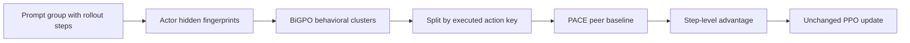

### 元信息与 TL;DR

| 字段 | 内容 |
|---|---|
| 原文 | [BiPACE: Bisimulation-Guided Policy Optimization with Action Counterfactual Estimation for LLM Agents](https://arxiv.org/abs/2606.25556) |
| 版本 | arXiv:2606.25556v1，2026-06-24 08:32:42 UTC 提交 |
| 作者 | Hanyang Wang, Weijieying Ren, Yuxiang Zhang, Ding Cao, Zhizhao Zeng, Ke Zeng, Tianxiang Zhao |
| 机构 | University of Chicago, Stanford University, HKUST(GZ), USTC, Meituan |
| 方向 | 大模型后训练；LLM Agent RL；stepwise credit assignment；critic-free policy optimization |
| 代码状态 | 论文和 Hugging Face paper 页都指向 `github.com/TianxiangZhao/BiPACE`；本轮 `git ls-remote` 返回 repository not found，因此本文只把论文和公开正文作为可验证证据 |

**TL;DR：**

- 这篇论文研究 **LLM Agent 长程 RL 后训练中的 step-level credit assignment**：GRPO/GiGPO 这类 critic-free group-based RL 不训练 value network，而是用多条 rollout 之间的相对回报估计优势；问题在于，它默认被放进同一组的 step 可以互相比较。
- 作者指出现有 agentic stepwise estimator 有一个双侧错误，叫 **state-action credit mismatch**：状态侧用精确 observation hash 太细，很多本该共享 continuation value 的 step 被拆成 singleton，step-level advantage 变成 0；动作侧用组内统一均值太粗，把状态价值和动作特异信用混在一起。
- **BiPACE** 是一个 drop-in advantage estimator，不加 critic、不加 auxiliary loss、不加额外 rollout，只替换 GiGPO 的 step-level 分组与基线：**BiGPO** 用 actor 自己 late-layer hidden state 的 cosine clustering 近似 bisimulation state neighborhood，**PACE** 在每个 behavioral cluster 内按 action key 做 peer baseline，形成局部的 `Q_b(s,a)-V_b(s)`。
- 主要公式可以理解为：先把 step record `r=(s_t,a_t,R_t)` 聚成行为等价簇 `C_b`，再把同动作子集 `C_{b,a}` 的平均回报当作非参数 `Q_b(s,a)`，把全簇平均当作 `V_b(s)`，最终优势为 `A = Q_b(s,a)-V_b(s)`；如果同动作 peer 不足，则回退到 RLOO/保守估计。
- 实验证据覆盖 **ALFWorld、WebShop、TextCraft**，backbone 包括 **Qwen2.5-7B** 和 **Qwen2.5-1.5B**。在 ALFWorld/Qwen2.5-7B 上，BiPACE_Q 把 overall validation success 从 GiGPO 的 **90.8** 提到 **97.1±0.9**，三个 seed 都越过 95%；Qwen2.5-1.5B 上达到 **93.5±1.2**，而 GiGPO 为 **86.7**。
- 机制证据不是只看最终分数：GiGPO 在 ALFWorld 的 step group singleton fraction 早期为 **34.2%**，到 iteration 140 仍有 **20.7%**；附录诊断显示 actor-hidden grouping 在 ALFWorld-7B 把 singleton 从 **27.3%** 降到 **18.0%**，在 TextCraft-7B 从 **50.3%** 降到 **22.4%**。
- 动作侧消融同样关键：ALFWorld/Qwen2.5-7B 上，state-only 只有 **93.0±1.3**，first-token PACE 为 **95.8±0.4**，action-tag 为 **93.0±1.1**，Q-style PACE 达到 **97.1±0.9**；这说明提升不是单靠“更粗分组减少 singleton”，而是状态聚合和动作条件基线一起工作。
- 局限也清楚：方法依赖 actor hidden state 能反映任务中的行为等价；在所有状态都高度相似的环境中可能退化成 batch-level baseline；训练初期 hidden geometry 还没被任务塑形；论文声称有代码，但公开仓库本轮不可访问，因此复现实证仍要等代码或日志真正可用。

### 研究问题：为什么 step-level group RL 会在 Agent 任务里失真？

LLM Agent 的后训练和单轮数学题不同，轨迹通常是：

- 多轮对话或环境交互；
- 部分可观测状态；
- 工具调用、网页动作、文本游戏或家庭环境动作；
- 稀疏 terminal reward；
- 很多中间步骤没有直接监督。

如果只用整条轨迹的终局回报训练，credit assignment 会太粗：

```text
prompt -> rollout_1 -> terminal reward
prompt -> rollout_2 -> terminal reward
prompt -> rollout_3 -> terminal reward
```

GRPO/RLOO 一类方法的吸引力在于：

- 不训练额外 critic；
- 不需要给每一步人工标注 reward；
- 可以利用同一 prompt 下多条 rollout 的相对表现；
- 工程上比 full value model 更简单。

GiGPO 进一步把这个想法推到 step level：

```text
同一 prompt 下的多个 rollout
  -> 抽取 step record
  -> 按 observation hash 分组
  -> 在组内用 return-to-go 做 local advantage
```

论文真正质疑的是一个很隐蔽的前提：

> 被放进同一组的 step，必须在 credit assignment 上可以互相替代。

这个前提在 Agent 环境里不稳，因为“同一个 observation 字符串”和“同一个 continuation value”不是一回事。

### 作者的 claim → mechanism → evidence → boundary

| 层次 | 论文主张 | 机制 | 证据 | 边界 |
|---|---|---|---|---|
| Claim 1 | 现有 stepwise group estimator 存在 state-action credit mismatch | observation hash 太细；组内均值太粗 | singleton fraction 长期不低；state-only 和 action-side 消融分离 | 诊断主要来自 ALFWorld/TextCraft/WebShop |
| Claim 2 | actor hidden state 可作为经验性的 bisimulation proxy | 用 late-layer normalized hidden state 做 cosine clustering | singleton 降低、group size 与 pair volume 增加 | 这不是严格证明的真实 bisimulation，只是 policy-induced approximation |
| Claim 3 | action-conditioned peer baseline 能恢复动作特异信用 | 在 behavioral cluster 内按 action key 估计 `Q_b(s,a)-V_b(s)` | Q-style PACE 优于 state-only、first-token 和 action-tag | action key 解析必须稳定；同动作 peer 过少时需要 fallback |
| Claim 4 | BiPACE 是低侵入替换 | 不改 PPO objective，不加 critic/loss/rollout | 论文报告额外开销为单步训练 wall time 的 11.3% | 更大 rollout budget 下 clustering 的绝对成本会随 `O(GT)` 增长 |

这张表说明论文不是在提出一个新的大训练框架，而是在修正一个局部但关键的 estimator：

- 训练循环仍是 PPO/GRPO/GiGPO 式；
- rollout 数量不变；
- terminal reward 不变；
- policy objective 不变；
- 变化只发生在 “哪些 step 互相比较” 和 “比较时减掉什么 baseline”。

### 方法机制：BiPACE 拆成 BiGPO 和 PACE

#### 1. GiGPO 的隐含估计对象

设一个 prompt group 里有多条 rollout，每条 rollout 有 step：

```text
r_i = (s_i, a_i, R_i)
```

其中：

| 符号 | 含义 |
|---|---|
| `s_i` | step 的 observation / state representation |
| `a_i` | 当前 step 执行的动作或生成片段 |
| `R_i` | 从该 step 往后的 return-to-go 或终局回报变体 |
| `C` | 被认为可比较的一组 step records |

GiGPO 用 exact observation hash 得到 cluster：

```text
C_h = {r_i : hash(obs_i) = h}
```

然后在 `C_h` 里计算相对优势。

问题是：

- 如果 `C_h` 只有一个元素，局部标准化/均值比较没有信号；
- 如果两个状态表面不同但 continuation value 一样，hash 会把它们拆开；
- 如果同一 cluster 中动作不同，共用一个均值会把动作特异影响抹掉。

#### 2. State side：BiGPO 用 actor-hidden geometry 替代 observation hash

BiGPO 的核心是：

```text
z_i = normalize(phi_theta(s_i))
```

其中：

- `phi_theta(s_i)` 是 actor 在固定 late layer 的 hidden state；
- `normalize` 后用 cosine distance；
- cluster 半径由 `epsilon` 控制；
- greedy clustering 只在同一 prompt group / rollout budget 内做。

直觉是：

- 如果 actor 处理两个 observation 的内部表示很近；
- 且它们在当前策略下具有相似行动倾向；
- 那么它们更可能共享 continuation value；
- 这种近似比 surface hash 更接近 bisimulation 的“价值保持”含义。

这不是数学上直接恢复 MDP 的 bisimulation quotient。

更谨慎地说，论文把它当作：

```text
policy-induced empirical bisimulation proxy
```

也就是“由当前 actor 表示诱导出来的行为相似性代理”。

#### 3. Action side：PACE 在 cluster 内估计动作条件基线

有了 behavioral cluster `C_b` 后，PACE 不再只减去全簇平均，而是拆成：

```text
V_b = mean_{r_j in C_b} R_j
Q_b(a) = mean_{r_j in C_b, action_key(a_j)=action_key(a)} R_j
A_i = Q_b(a_i) - V_b
```

变量解释：

| 变量 | 解释 |
|---|---|
| `C_b` | BiGPO 得到的行为状态簇 |
| `V_b` | 该簇的平均 continuation value |
| `C_{b,a}` | 同一簇内执行相同 action key 的 peer set |
| `Q_b(a)` | 同动作 peer 的平均 return，作为局部动作价值 |
| `A_i` | step `i` 的 action-conditioned local advantage |

这个形式像非参数的 `Q(s,a)-V(s)`。

它的好处是：

- 不需要训练 value network；
- 不引入额外 rollout；
- 不把所有动作都和同一个粗均值比较；
- 如果同动作 peer 足够多，可以给动作本身分配更清晰的 credit。

#### 4. 伪代码：BiPACE 改的到底是哪一步？

```text
Input:
  prompt group P
  sampled rollouts tau_1 ... tau_G
  actor pi_theta
  terminal / return-to-go rewards R
  clustering radius epsilon

State:
  step_records = []
  behavioral_clusters = []

For each rollout tau_g:
  For each step t:
    collect r = (s_t, a_t, R_t)
    compute hidden fingerprint z_t = normalize(phi_theta(s_t))
    append (r, z_t) to step_records

For each prompt group:
  cluster step_records by cosine distance between z_t
  each cluster C_b is a behavioral state neighborhood

For each cluster C_b:
  If |C_b| is singleton:
    use fallback or zero step-level signal
  Else:
    compute V_b = average return in C_b
    split C_b by action_key(a_t)
    For each step r_i in C_b:
      If same-action peer set has enough records:
        compute Q_b(a_i) from same-action peers
        A_i = Q_b(a_i) - V_b
      Else:
        fallback to RLOO / conservative local estimator

Output:
  step-level advantages A_i
  unchanged PPO / GRPO-style policy update
```

这段伪代码的重点是：BiPACE 不负责发明新 reward。

它只回答：

- 哪些 step records 可以比较？
- 比较时应该减掉 state baseline 还是 action-conditioned baseline？
- 当 peer set 不足时如何保守回退？

### 理论分析：为什么作者要引用 bisimulation？

论文借 bisimulation 的目的，不是把 LLM Agent 环境完整形式化成干净 MDP。

它想表达一个更窄的条件：

```text
如果两个状态在未来回报上等价或近似等价，
那么它们可以共享 baseline；
如果它们只是字符串完全相同，
这种“完全相同”未必是正确的等价关系。
```

#### 1. observation hash 是过细 partition

exact hash 的问题是：

- 不同自然语言描述可能指向同一任务状态；
- 网页/游戏/家庭环境的 observation 会带无关 token；
- agent 的历史上下文不同，但当前可行动空间和 continuation value 可能相近；
- hash 把这些全部拆开，导致 singleton。

论文用 singleton fraction 把这个问题量化：

| 诊断 | 数字 | 含义 |
|---|---:|---|
| ALFWorld GiGPO iteration 10 singleton | 34.2% | 训练早期三分之一 step group 无法产生 step-level signal |
| ALFWorld GiGPO iteration 140 singleton | 20.7% | 即使训练到后期，仍有明显局部信号损失 |
| singleton cluster 的 step-level advantage | 0 | 组内没有可比较 peer，局部标准化退化 |

这解释了为什么“用 step-level credit”本身不够。

如果分组方式错了，step-level estimator 只是形式上更细，实际没有更多可用信号。

#### 2. actor hidden state 是可学习的相似性坐标

BiGPO 的假设是：

```text
d_phi(s_i, s_j) = 1 - cosine(normalize(phi_theta(s_i)), normalize(phi_theta(s_j)))
```

当 `d_phi` 小于半径 `epsilon` 时，两个 step record 进入同一 behavioral cluster。

这有一个重要含义：

- 分组会随 actor 更新而变化；
- 它不是静态 lexical hash；
- 它反映当前策略“如何看待状态”；
- 它可能捕获 observation 表面之外的任务相关相似性。

附录的 lexical hash 对照很关键：

| 分组方式 | ALFWorld/Qwen2.5-7B Val @max |
|---|---:|
| Actor-Hidden BiPACE_Q | 97.1 |
| HashNgram lexical coarsening | 95.4 |
| State-only baseline | 93.0 |

这个结果说明：

- 只要把 hash 变粗，确实能减少 singleton 并带来收益；
- 但 actor-hidden geometry 仍比静态 lexical coarsening 高 1.7pp；
- 因此论文的机制不是简单的“扩大组大小”，而是让组更贴近策略行为。

### 实验设置：它到底在哪些任务上验证？

论文的实验覆盖三类 agent 环境：

| 环境 | 类型 | 为什么适合测 credit assignment |
|---|---|---|
| ALFWorld | 文本化家庭任务 / embodied instruction following | 长程、多步骤、稀疏成功信号，容易出现中间步骤信用分配问题 |
| WebShop | 网页购物环境 | 需要搜索、比较、选择商品，状态有文本冗余和动作分支 |
| TextCraft | 文本游戏 / crafting | observation 更稀疏，exact hash 更容易造成 singleton |

模型规模：

- Qwen2.5-7B；
- Qwen2.5-1.5B。

比较对象：

| Baseline | 角色 |
|---|---|
| GRPO | trajectory-level group-relative baseline |
| GiGPO | step-level exact observation hash baseline |
| State-only | 只替换状态分组，不做动作条件 PACE |
| PACE first-token / action-tag / Q-style | 不同动作侧 peer key 与估计方式 |
| HashNgram | 静态 lexical coarsening，用来检验 actor-hidden geometry 是否必要 |

评估指标主要是 validation success / peak success，以及达到固定成功率阈值所需训练步数。

论文强调三点：

- end-task performance；
- sample efficiency；
- mechanism diagnostics。

这种组织比只报一个最终平均分更有说服力，因为它把“为什么有效”和“是否有效”分开验证。

#### 训练读法：它不是简单比较 reward，而是在比较 estimator

读这篇论文时，一个容易误解的地方是把 BiPACE 当成新的 reward shaping 方法。

实际上，论文刻意把可变因素压到很窄：

| 组件 | 是否改变 | 说明 |
|---|---|---|
| 环境任务 | 否 | 仍是 ALFWorld、WebShop、TextCraft |
| terminal reward | 否 | 不引入新的人工 step reward |
| rollout budget | 否 | 不靠采更多轨迹获得优势 |
| PPO objective | 否 | 论文强调 only advantage estimator changes |
| step grouping | 是 | observation hash 改为 actor-hidden clustering |
| local baseline | 是 | cluster mean 改为 action-conditioned peer baseline |

这个控制设计很重要。

如果一个方法同时改变 reward、rollout、prompt、数据过滤和 optimizer，很难知道收益来自哪里。

BiPACE 的主张更可检验：

```text
在相同 rollout 和 reward 下，
只改变 step record 的比较单位与动作侧 baseline，
是否能改善 agent RL？
```

因此，读实验时应优先看三类证据：

- **机制指标**：singleton、group size、pairs/step；
- **估计器消融**：state-only、first-token、action-tag、Q-style；
- **跨环境主结果**：ALFWorld、WebShop、TextCraft 是否同向。

#### 公式对照：GRPO、GiGPO、BiPACE 的差别

可以用同一条线索理解三个方法。

**GRPO：轨迹级比较**

```text
A_rollout_i = normalize(R_i within prompt group)
```

它的问题是：

- 回报只在整条 trajectory 上比较；
- 中间 step 只共享同一个 trajectory-level credit；
- 对长程任务来说，成功或失败由哪一步造成不清楚。

**GiGPO：step 级比较，但使用 exact observation group**

```text
C_h = { step i | hash(obs_i) = h }
A_step_i = normalize(R_i within C_h)
```

它的改进是：

- 把 credit 分配推进到 step；
- 试图让同 observation 的 step 互相比较；
- 不需要训练 critic。

它的新问题是：

- `hash(obs)` 太严格，表面不同的等价状态被拆开；
- singleton 产生 0 step signal；
- 组内均值没有区分不同动作。

**BiPACE：step 级比较，并显式拆 state / action**

```text
C_b = { step i | cosine(phi(s_i), center_b) <= epsilon }
V_b = mean(R_j for j in C_b)
Q_b(a_i) = mean(R_j for j in C_b and key(a_j)=key(a_i))
A_step_i = Q_b(a_i) - V_b
```

这条公式说明：

- `C_b` 解决“哪些状态可比较”；
- `V_b` 代表局部状态价值；
- `Q_b(a_i)` 代表同类动作的局部动作价值；
- `A_step_i` 才是动作相对于状态邻域的差异。

这也是为什么论文叫 **Bisimulation-Guided** 和 **Action Counterfactual Estimation**：

- 前半句处理状态等价；
- 后半句处理动作反事实；
- 两者缺一不可。

### 主结果：BiPACE 的提升来自哪里？

#### 1. ALFWorld 是最强证据

论文摘要和正文报告：

| 设置 | GiGPO | BiPACE_Q | 提升 |
|---|---:|---:|---:|
| ALFWorld / Qwen2.5-7B | 90.8 | 97.1±0.9 | +6.3pp |
| ALFWorld / Qwen2.5-1.5B | 86.7 | 93.5±1.2 | +6.8pp |

这里最关键的不是“更高”，而是稳定性：

- 7B 设置下，BiPACE_Q 三个 seed 都达到 95%；
- GiGPO 在相同预算内没有任何 seed 达到这个阈值；
- 附录给出 7B 三个 seed 的 peak：97.7%、96.1%、97.7%；
- 这支持“提升不是单个 lucky seed”的判断。

#### 2. WebShop 与 TextCraft 是跨环境证据

Figure 1 给出三个可读的峰值差距：

| 图中设置 | BiPACE_Q 相对 GiGPO 的峰值差距 |
|---|---:|
| ALFWorld / Qwen2.5-1.5B | +4.7pp |
| WebShop / Qwen2.5-7B | +6.2pp |
| TextCraft / Qwen2.5-1.5B | +6.2pp |

这些数字的作用是：

- 证明方法不是只对 ALFWorld tuning；
- 在网页任务和文本 crafting 任务上仍有收益；
- TextCraft 的稀疏 observation 进一步支持“hash singleton tax”这个机制解释。

#### 3. sample efficiency 不是附带结果

Figure 1 下半部分比较达到固定 success threshold 所需步数，报告了多个 speedup：

- ALFWorld 上有 1.33x、1.28x、1.18x、1.27x 等阈值 speedup；
- WebShop 上有 1.57x、1.38x、1.55x、1.24x；
- TextCraft 上有 1.33x、2.00x、1.20x、1.67x；
- 若 GiGPO 未达到阈值，图中用 `never -> step` 标记。

这说明 BiPACE 的收益不只体现在最终 peak，也体现在更早获得可用策略。

对于 agent RL，sample efficiency 很重要，因为 rollout 不是廉价 token 生成：

- 环境交互慢；
- 工具调用可能有外部成本；
- 网页/游戏环境需要状态管理；
- 多 seed 和长 horizon 会迅速放大预算。

### 消融：为什么不是“随便换个更粗分组”？

论文最有价值的部分之一，是把状态侧和动作侧拆开。

#### 1. PACE estimator variants

ALFWorld/Qwen2.5-7B 的附录表 L.1：

| 变体 | Peak (%) |
|---|---:|
| GiGPO | 90.8±1.3 |
| State-only | 93.0±1.3 |
| first-token | 95.8±0.4 |
| action-tag | 93.0±1.1 |
| Q-style | 97.1±0.9 |

这组数字可以读出三层结论：

- **State-only 有用但不够**：把 observation hash 换成 actor-hidden cluster，peak 从 90.8 到 93.0，说明 singleton tax 的确存在。
- **动作 key 设计很敏感**：first-token 有明显收益，action-tag 却退回 93.0，说明动作侧抽象不是随便分桶。
- **Q-style 最强**：同动作 peer baseline 与全簇 state baseline 的组合，最接近论文想要的 `Q_b(s,a)-V_b(s)`。

#### 2. PACE row-mix diagnostics

表 L.2 给出 ALFWorld/Qwen2.5-7B iteration 150 附近的统计：

| 统计项 | 数值 |
|---|---:|
| Rows entering PACE branch | 80.2% |
| Rows falling back to RLOO leave-one-out | 17.9% |
| Singleton rows | 1.9% |
| Multi-member clusters with >=2 distinct actions | 58.3% |
| Mean unique action keys per cluster | 2.76 |
| `<action>` parse rate | >0.99 |

这张表回答一个实际疑问：

> PACE 会不会只是论文里的理想估计，真实训练时根本没有足够同动作 peer？

至少在这个设置下，答案是否定的。

80.2% 的 rows 进入 PACE branch，singleton rows 只有 1.9%，且多成员 cluster 中有 58.3% 包含至少两个 distinct action。

#### 3. Policy-state reuse diagnostics

表 L.3 对比 exact observation hash 和 actor-hidden grouping：

| 设置 | 分组方式 | Singleton | Avg size | P90 size | Pairs/step |
|---|---|---:|---:|---:|---:|
| ALFWorld-7B | GiGPO obs. hash | 27.3% | 7.5 | 16.3 | 37k |
| ALFWorld-7B | BiPACE actor-hidden | 18.0% | 11.7 | 26.7 | 48k |
| TextCraft-7B | GiGPO obs. hash | 50.3% | 7.1 | 16.1 | 143k |
| TextCraft-7B | BiPACE actor-hidden | 22.4% | 21.6 | 53.0 | 314k |

这张表是论文机制链条的核心证据：

- ALFWorld singleton 降低 9.3pp；
- TextCraft singleton 降低 27.9pp；
- TextCraft mean group size 约三倍；
- matched-pair volume 在 ALFWorld 增加 1.3x，在 TextCraft 增加 2.2x。

换句话说，BiGPO 确实给 PACE 创造了更多可比较 peer，而不是只在最终指标上碰巧更好。

### Figure 与 Table 证据怎么读？

#### Figure 1：性能曲线和阈值步数

Figure 1 的作用有两个：

- 上半部分：展示不同 benchmark 和 model scale 下的 validation success 曲线与 peak gap；
- 下半部分：展示达到固定 success threshold 的步数，强调 sample efficiency。

这张图支持的结论：

- BiPACE_Q 通常更早跨过实用阈值；
- GiGPO 有些阈值在预算内达不到；
- peak gap 和 speedup 同时出现，说明不是“慢慢训练也许一样”的情形。

它不能单独证明的结论：

- 不能证明所有 Agent 环境都适用；
- 不能证明 hidden state clustering 总是优于 task-specific state abstraction；
- 不能证明 action key 抽取在开放工具环境里总是稳定。

#### Figure 2：方法流程图

Figure 2 把 BiPACE 的数据流拆成三段：



这张图的重点是“compose rather than stack”：

- PACE 需要一个行为上 coherent 的 cluster；
- BiGPO 提供这个 cluster；
- 如果状态簇本身不可靠，动作侧 peer baseline 也会被污染。

#### Table L.1/L.2/L.3：机制验证比主表更重要

如果只看主结果，BiPACE 像是又一个调参后的 RL estimator。

但三张附录表把机制拆开：

| 表 | 回答的问题 |
|---|---|
| L.1 | 动作侧估计器哪种有效？ |
| L.2 | Q-style PACE 在训练中有没有足够 peer？ |
| L.3 | actor-hidden grouping 是否真的减少 singleton、增加 pair volume？ |

因此本文最值得带走的不是“97.1 比 90.8 高”，而是：

```text
更合理的 state equivalence
  -> 更少 singleton
  -> 更多可比较 peer
  -> action-conditioned baseline 可用
  -> step-level advantage 更接近局部 Q-V
  -> agent RL 更稳定
```

### 失败模式与边界：什么时候 BiPACE 可能没用？

论文附录 M 给出两个失败/弱化场景。

#### 1. 状态过于均匀

如果环境中所有 observation 在 actor hidden space 里都非常接近，例如高度相似的 synthetic Sokoban grid，BiGPO 可能把几乎所有 step 合到一个 giant cluster。

这时问题从“hash 太细”变成“cluster 太粗”：

- state baseline 变成 batch-level baseline；
- step-level factorization 失去意义；
- 方法可能退化到接近 GRPO。

这类失败可以提前诊断：

| 诊断信号 | 可能含义 |
|---|---|
| singleton 很低但 giant cluster 很大 | 分组过粗 |
| mean group size 异常大 | hidden geometry 没有区分行为状态 |
| P90 size 远大于平均 | 少数大簇吞掉大量 step |
| 不同 action 的 return 分布混杂 | state cluster 不是价值等价 |

#### 2. RL 初期 hidden geometry 尚未任务化

训练 step 0 时，actor hidden state 主要反映预训练语言模型的统计偏置，而不是当前任务的 value geometry。

这意味着：

- 初期 cluster 可能偏粗；
- 语义相似不等于任务价值相似；
- adaptive epsilon 需要等任务相关几何开始出现后再校准。

论文的处理是：

- 不在初始化时固定半径；
- 在第一个训练 step 上运行 adaptive epsilon heuristic；
- 随 actor 更新，让 hidden geometry 更贴近当前任务。

这个设计合理，但仍留下一个边界：

- 如果任务 reward 太稀疏、RL 太短、actor 表示没有形成稳定任务结构；
- 那么 hidden-state cluster 可能一直只是语义/表面相似，而不是价值相似。

### 和近期 Agent 后训练工作的关系

本周已经出现多篇 Agent RL/后训练论文，BiPACE 的位置可以这样分：

| 主题 | 关心的问题 | BiPACE 的区别 |
|---|---|---|
| Progress Advantage | 如何利用 progress signal 修正长程任务奖励 | 更偏 reward/advantage 进展信号 |
| Harness Design and Post-Training | 评测 harness 如何改变 agent 后训练结论 | 更偏 benchmark 与训练环境设计 |
| JERP | 如何联合学习 experiential rules 和 policies | 更偏规则/策略联合学习 |
| RiVER | 无 ground-truth 优化任务能否用于 RL | 更偏 reward construction 和实例内排序 |
| BiPACE | step records 之间到底能不能互相比较 | 更偏 advantage estimator 的比较单位和局部 baseline |

BiPACE 的贡献边界很窄，但正因为窄，论证链条更清楚：

- 它不重新定义任务；
- 不引入新 benchmark；
- 不要求人工 step labels；
- 不声称解决所有 long-horizon RL；
- 只把 group-based estimator 的“比较对象”换成更接近行为等价的对象。

### 对后训练研究的启发：credit assignment 不是只有 reward design

很多 Agent RL 讨论会把失败归因于 reward：

- reward 太稀疏；
- reward model 不准；
- verifier 太弱；
- benchmark 太短；
- rollouts 不够。

BiPACE 提醒另一个维度：

> 即使 reward 没变，advantage estimator 的比较单位也会改变学习信号。

可以把 Agent 后训练拆成四层：

| 层 | 典型问题 | BiPACE 涉及程度 |
|---|---|---|
| Reward | 成功/失败如何打分 | 不直接改变 |
| Rollout | 采样多少轨迹、探索哪些动作 | 不直接改变 |
| Grouping | 哪些 step 可以互相比较 | 核心改变 |
| Baseline | 减掉 state value 还是 action-conditioned value | 核心改变 |

这对后续研究有两个直接问题：

1. **representation-induced grouping 是否可以推广？**

   - actor hidden state 是最方便的选择；
   - 但也可以考虑 environment state encoder、tool schema encoder、web DOM encoder；
   - 不同表示可能对应不同的价值等价关系。

2. **action key 的粒度如何选择？**

   - first-token 太粗；
   - full action string 太细；
   - tool-call schema、function name、argument template、网页动作类型可能更适合真实工具 Agent；
   - PACE 的成败很可能取决于 action abstraction 是否稳定。

### 可复现性与代码边界

论文正文和 Hugging Face paper 页都写到代码链接：

```text
https://github.com/TianxiangZhao/BiPACE
```

但本轮检查结果是：

```text
git ls-remote https://github.com/TianxiangZhao/BiPACE.git HEAD
-> Repository not found
```

因此，当前可验证证据包括：

- arXiv abstract / PDF / HTML；
- 论文里的主结果、附录表和失败模式；
- Hugging Face paper page 对发布时间与摘要的镜像；
- 论文中报告的代码链接文本。

当前不可验证或需等待的部分：

- released code 的具体实现；
- `step_norm_reward_cacb` hook 细节；
- SwanLab logs；
- clustering 半径 adaptive heuristic 的真实工程默认值；
- action key parser 在不同环境中的鲁棒性。

这不推翻论文结论，但会影响复现信心：

- 可以把 BiPACE 当作值得阅读和比较的 estimator proposal；
- 不应在代码公开前把 97.1±0.9 当成已独立复现的工程事实；
- 后续如果仓库开放，最应该先检查 grouping、fallback、action key parse 和 seed/log 完整性。

#### 复现时应优先核对哪些清单？

如果后续代码仓库开放，我会优先看下面几项，而不是直接跑默认脚本：

| 检查项 | 为什么重要 |
|---|---|
| hidden layer 选择 | actor-hidden geometry 来自 late layer，层数会影响状态聚类 |
| `epsilon` 自适应策略 | 半径过小退化为 hash-like singleton，过大退化为 giant cluster |
| greedy clustering 顺序 | 非对称/顺序敏感实现可能改变 cluster 组成 |
| action key 抽取 | PACE 的 peer set 完全依赖 action abstraction |
| fallback 条件 | 同动作 peer 不足时如何回退会影响稳定性 |
| reward normalization | 局部 return-to-go 标准化细节可能改变优势尺度 |
| seed 与 validation checkpoint | 论文强调三 seed 和阈值步数，必须复核是否完整 |
| 日志指标 | singleton、PACE branch ratio、pairs/step 应与论文表 L.2/L.3 对齐 |

这些检查能区分三种情况：

- 方法机制确实复现；
- 最终分数接近但机制指标不一致；
- 机制指标一致但某些 benchmark 分数受实现或环境版本影响。

对研究者来说，第二种和第三种都很有信息量。

如果最终分数复现不了，但 singleton 确实下降、PACE branch 确实有足够 peer，那么问题可能在环境版本、reward 或超参。

如果最终分数高但 singleton / row-mix 对不上，反而要怀疑是否有其他实现因素在起作用。

### 反向审稿：这篇论文还缺什么证据？

从审稿视角看，BiPACE 的主线扎实，但还有几个缺口。

#### 1. 缺少更开放工具环境的动作抽象测试

WebShop 和 TextCraft 已经比单轮 QA 复杂，但它们的 action space 仍相对结构化。

真实 coding agent 的动作可能包括：

- shell 命令；
- 文件编辑 diff；
- 测试运行；
- 浏览器点击；
- API 调用；
- 多工具组合。

这些动作如何提取 `action_key` 并不显然。

例如：

```text
pytest tests/test_a.py
pytest tests/test_b.py
```

它们是同类 action 还是不同 action？

再例如：

```text
sed -n '1,120p' foo.py
sed -n '1,120p' bar.py
```

它们在工具类型上相同，但在任务状态上可能完全不同。

PACE 的动作侧收益能否迁移到这种环境，需要专门验证。

#### 2. 缺少与 learned critic 的成本-收益比较

BiPACE 的优势之一是不训练 critic。

但研究问题也可以反过来问：

- 如果训练一个小 value head；
- 或用 process reward model 给 step 打分；
- 或用 verifier 产生中间 reward；
- 它们与 BiPACE 的样本效率、计算成本、稳定性如何比较？

论文证明 BiPACE 优于 GRPO/GiGPO，并分析了 stepwise group estimator 内部的问题。

但它还没有回答：

```text
当我们愿意付出 learned critic / PRM 成本时，
BiPACE 是否仍是最优性价比选择？
```

#### 3. 缺少分布外任务的 representation drift 分析

actor-hidden clustering 的好处来自“表示随策略更新”。

但这也带来风险：

- 训练中表示空间会漂移；
- cluster 的语义可能变化；
- 不同 seed 的 hidden geometry 可能不同；
- 分布外任务上，语言相似性和价值相似性可能重新错配。

论文已有 failure-mode 分析，但还可以进一步报告：

| 诊断 | 可能回答的问题 |
|---|---|
| cluster assignment stability | 同一类状态在训练中是否频繁换簇 |
| per-cluster return variance | cluster 是否真的 value-consistent |
| action-key entropy | 每个 cluster 内动作是否足够多样 |
| seed-wise cluster agreement | 不同 seed 学到的 behavioral partition 是否相似 |

这些指标会让“policy-induced bisimulation proxy”从直觉变成更可审计的对象。

### 结论与继续追问

BiPACE 的核心价值是把 Agent 后训练里一个常被忽略的问题具体化：

```text
step-level credit assignment 不只是把轨迹切成 step；
还必须回答哪些 step 有资格互相比较。
```

论文给出的答案是：

- 用 actor hidden state 近似行为状态等价；
- 用 action-conditioned peer baseline 分离动作信用；
- 保持训练目标和 rollout 预算基本不变；
- 用 singleton、group size、pair volume、PACE row mix 来证明机制确实发生。

我认为它最适合被放在三条后续研究线上继续验证：

1. **真实工具 Agent 的 action abstraction**

   - WebShop/TextCraft 已有动作结构；
   - 真实 coding agent / browser agent 的动作更复杂；
   - 需要比较 function name、argument schema、diff operation、shell command template 等不同 action key。

2. **表示空间与价值等价的错配**

   - actor hidden state 可能捕捉语言语义；
   - 但 reward-relevant state 可能依赖环境变量、文件系统、网页 DOM、工具返回值；
   - 如果这些信息没有进入稳定表示，BiGPO 会把不该合并的状态合并。

3. **从 estimator 诊断走向训练监控**

   - singleton fraction；
   - PACE branch ratio；
   - same-action peer count；
   - action parse rate；
   - giant cluster warning。

这些指标不只是论文里的分析图表，也可以成为 Agent RL 训练时的健康检查。

如果未来的 Agent 后训练系统仍采用 critic-free group-relative RL，那么 BiPACE 至少给出一个很实用的判断标准：

> 在相信 step-level advantage 之前，先检查你的 step groups 是否真的代表行为等价，以及动作侧 baseline 是否真的在比较同一类动作。
