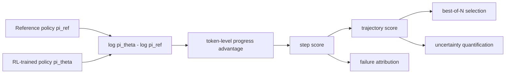
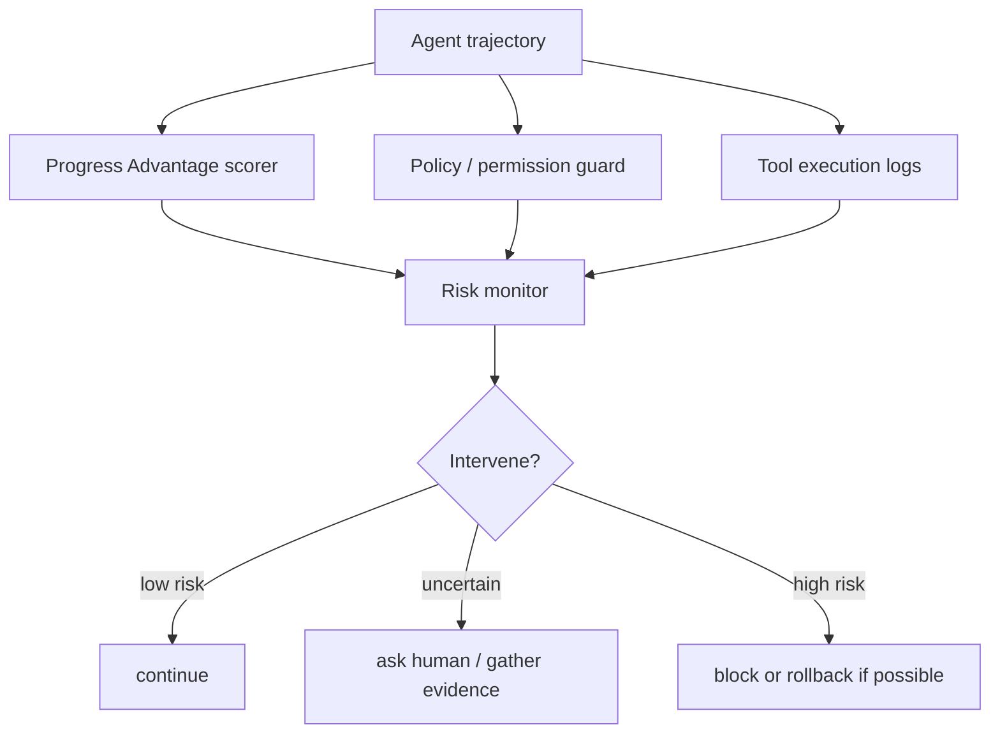

# Neglected Free Lunch from Post-training: Progress Advantage for LLM Agents

### 元信息

| 项目 | 内容 |
|---|---|
| 论文 | Neglected Free Lunch from Post-training: Progress Advantage for LLM Agents |
| 作者 | Changdae Oh, Wendi Li, Seongheon Park, Samuel Yeh, Tanwi Mallick, Sharon Li |
| 机构 | University of Wisconsin-Madison, Argonne National Laboratory |
| 时间 | arXiv v1: 2026-06-24 17:54:08 UTC |
| 链接 | [arXiv](https://arxiv.org/abs/2606.26080), [PDF](https://arxiv.org/pdf/2606.26080), [Code](https://github.com/deeplearning-wisc/progress-advantage) |
| 主题 | 大模型后训练、LLM Agent、过程奖励、测试时扩展、不确定性量化、失败归因 |

### TL;DR

- 这篇论文讨论一个很具体的问题：Agent 轨迹需要**步骤级评分**，但传统 process reward model 在长时程、工具调用、随机环境反馈、不可逆动作里很难标注，也很难用 Monte Carlo 反复回滚估计。
- 作者的核心主张是：标准 RL 后训练已经留下了一个可直接使用的信号。给定 RL 后的策略 `pi_theta` 和参考策略 `pi_ref`，二者在已执行动作上的对数概率比可以恢复一个优势函数，作者称为 **progress advantage**。
- 关键公式是 `A(s,a) = beta * log pi_theta(a|s) / pi_ref(a|s)`。它不是声称恢复随机 Agent 环境里的绝对 reward，而是恢复动作相对该状态平均动作的 advantage，因此更适合比较“这一步有没有推动任务完成”。
- 实验覆盖三类用途：best-of-8 测试时扩展、轨迹级成功/失败不确定性量化、Who & When 失败步归因。数据包括 BFCLv4-MT、WebShop、AgentDojo、tau2-bench、Who & When；模型族包括 Gemma4、Qwen3.5、Qwen3、Olmo3。
- 关键数字：best-of-8 平均成功率里，Progress Advantage 在 Gemma4-4B / Qwen3.5-9B 上达到 **38.8 / 62.1**，明显高于 Mean-of-N 的 **33.1 / 54.7**，也高于 WildReward、ThinkPRM 等训练型 reward model；tau2-Airline UQ 上多数组合 AUROC 最优，例如 Gemma4-4B 达 **0.865**。
- 论文边界同样重要：它依赖可用的策略/参考策略 checkpoint pair；参考策略太远会混入分布差异，太近会信号太弱；不同任务需要不同 token/step 聚合；它主要是推理期评分与监控信号，不等于训练出一个通用安全审计器。

### 研究问题：为什么 Agent PRM 特别难？

- 数学推理里的 PRM 往往可以这样做：
  - 把解题过程拆成 step。
  - 让人或强模型标注每一步是否合理。
  - 或者从某个中间状态继续采样，看最终正确率。

- Agent 环境不太允许这套流程原样搬过来：
  - **长时程**：一次任务可能有上百个 token 级动作和多个工具调用。
  - **状态性**：网页、数据库、邮箱、购物车、客服系统会被动作改变。
  - **不可逆**：发送邮件、删除文件、下单、取消订单不能随便回滚。
  - **随机反馈**：工具输出、用户回应、环境返回并不是确定的文本续写。
  - **跨域迁移差**：为某个环境训练的 PRM 很可能只学到该环境的格式和分布。

- 论文真正想补的空白不是“又训练一个 Agent reward model”，而是问：
  - 既然后训练已经让策略学会偏好某些动作，
  - 能不能把这个偏好从 checkpoint pair 里读出来，
  - 并把它当作 Agent 运行时的步骤级进展信号？

### 论文主张与论证路线

| Claim | Mechanism | Evidence | Boundary |
|---|---|---|---|
| 随机 Agent 环境里，直接用 log-ratio 当 reward 不严谨 | 随机转移会引入 value residual，绝对 reward 不能靠策略比值完全恢复 | Remark 1 给出随机 MDP 下 reward 多出 `V(s)-E[V(s')]` 项 | 这一步否定的是“绝对奖励恢复”，不是否定 log-ratio 的用途 |
| log-ratio 可以恢复 advantage | KL-regularized RL 的最优策略满足 soft Bellman 固定点，逐状态优化给出 `A=beta log(pi*/pi_ref)` | Proposition 1 在 stochastic MDP 下推导优势函数 | 需要策略接近相应 RL 目标的最优解；实际模型只是近似 |
| clipping 型 RL 也可纳入解释 | per-sample ratio 约束会局部隐含小 KL 约束 | Proposition 2 说明 DAPO / Dr. GRPO 类 clipping surrogate 仍可看作保守 KL 约束 | 这是局部、小 epsilon、共享 support 附近的近似，不是任意训练流程都成立 |
| 该信号能做推理期评分 | 将 token 级 advantage 聚合成 step 或 trajectory score | 表 2、表 3、图 2 在 TTS、UQ、FA 上验证 | 聚合策略敏感，不能把一个固定平均公式套到所有任务 |
| 它比纯置信度更像“目标进展” | reference policy offset 消掉常见文本/工具字符串频率偏差 | 图 3 中 tool call 和政策约束词被 progress advantage 正向奖励 | 仍依赖参考策略质量；参考策略选错会退化 |

### 方法机制：从后训练 checkpoint 里读出进展信号

论文从一个 KL 正则 RL 目标开始：

```text
max_pi E[ sum_t r(s_t,a_t) - beta * log( pi(a_t|s_t) / pi_ref(a_t|s_t) ) ]
```

变量含义：

| 符号 | 含义 |
|---|---|
| `s_t` | 到第 t 步为止的完整上下文，包含用户输入、模型动作、工具返回、环境观察 |
| `a_t` | 当前 token 或动作 token，论文在 token-level MDP 上建模 |
| `pi_theta` | RL 后训练得到的行为策略，也就是要评分的 agent policy |
| `pi_ref` | 参考策略，可以是 base model、SFT model，或上一轮在线 RL policy |
| `beta` | KL 正则强度；实际评分时会作为比例项，不改变排序时常可忽略 |
| `A(s,a)` | advantage，表示在状态 `s` 采取动作 `a` 相对该状态平均动作的额外价值 |

核心公式：

```text
ProgressAdvantage(s_t, a_t)
  = beta * [ log pi_theta(a_t | s_t) - log pi_ref(a_t | s_t) ]
  = beta * log( pi_theta(a_t | s_t) / pi_ref(a_t | s_t) )
```

为什么这是 Agent 场景里的关键转向：

- 如果目标是恢复 reward：
  - 随机环境会出现下一状态价值项；
  - 工具反馈和用户回应让 `E[V(s_{t+1})]` 无法从两个 policy 分布里消掉；
  - 所以 log-ratio 不是严格的绝对 reward。

- 如果目标是恢复 advantage：
  - advantage 本来就是 `Q(s,a)-V(s)`；
  - 它关心“当前动作比该状态下平均动作好多少”；
  - 状态难度本身被扣掉，更适合跨步骤比较。

这也是论文题目里“free lunch”的含义：不是免费得到新能力，而是后训练过程中本来就产生的 policy/reference 差异，过去没有被充分用于 Agent 运行时评分。

### 随机 MDP：论文真正修正了什么？

确定性文本推理里，已有工作常把隐式 reward 写成：

```text
r(s_t,a_t) = beta * log( pi*(a_t|s_t) / pi_ref(a_t|s_t) )
```

但在 Agent 随机环境里，论文指出还会有残差：

```text
r(s_t,a_t)
  = beta * log( pi*(a_t|s_t) / pi_ref(a_t|s_t) )
    + V*(s_t) - E_{s_{t+1} ~ f(.|s_t,a_t)}[ V*(s_{t+1}) ]
```

这个式子说明：

- 工具调用之后的观察可能随机。
- 用户下一句话可能随机。
- 网页或外部 API 状态可能随机。
- 因此绝对 reward 里有下一状态价值的期望项。

论文的聪明之处是把目标改成 advantage：

```text
A*(s,a) = Q*(s,a) - V*(s)
        = beta * log( pi*(a|s) / pi_ref(a|s) )
```

这个转换的研究意义：

- 它避免了“随机转移下无法恢复 reward”的硬障碍。
- 它保留了足以做 policy improvement 和动作评价的量。
- 它把 Agent 评分从“这一步绝对赚了多少 reward”改成“这一步相对当前状态是否更有进展”。

### 从 token 到 step，再到 trajectory

公式给出的是 token 级分数，但 Agent 任务通常要评分：

- 一个工具调用 step。
- 一段自然语言回复。
- 一条完整轨迹。
- 多条 candidate trajectory 中哪条最可能成功。

论文列出几类聚合方式：

| 聚合方式 | 直觉 | 适合场景 |
|---|---|---|
| `sum_t A_t` | 累加整段进展 | 轨迹总进展，容易受长度影响 |
| `mean_t A_t` | 长度归一化 | 不同长度轨迹比较 |
| `sum_t w_t A_t` | 加入位置权重 | 已知某些位置更关键时 |
| `min` / `max` extreme token | 捕捉最差或最好关键 token | 失败归因、关键步骤监控 |

伪代码可以写成：

```text
Input:
  trajectory tau = [(s_1, a_1), ..., (s_T, a_T)]
  post-trained policy pi_theta
  reference policy pi_ref
  token aggregation token_agg
  step aggregation step_agg

State:
  scores = []

Loop:
  for each agent step j in tau:
    action_tokens = tokens emitted in step j
    policy_logps = log pi_theta(token | prefix) over action_tokens
    ref_logps = log pi_ref(token | prefix) over action_tokens
    token_adv = beta * (policy_logps - ref_logps)
    step_score = token_agg(token_adv)
    append step_score to scores

Output:
  trajectory_score = step_agg(scores)
  failure_step = argmin(scores) or argmin(cumsum(scores))
```

代码仓库里的实现也对应这个逻辑：

- `pa/scoring.py`：一次前向提取 policy/reference 的 log-prob。
- `pa/aggregations.py`：实现 token 和 step 聚合。
- `runners/tau2_bon.py`：best-of-N 测试时扩展。
- `runners/tau2_uq.py`：轨迹级不确定性量化。
- `runners/fa.py`：Who & When 失败归因。

### Figure 1 的证据功能：它不是架构炫图，而是两段论

原论文 Figure 1 分成两部分：

- 左侧：RL 后训练下的 policy/reference ratio 可以导出 implicit advantage。
- 右侧：这个 advantage 可以给 Agent 轨迹中的工具调用和自然语言步骤打分。

用 Mermaid 可概括为：



这个图支撑的不是“模型会更聪明”，而是一个更窄的判断：

- 后训练 checkpoint pair 可以被当作 scoring instrument。
- scoring 可以落在 token、step、trajectory 三个层级。
- 这让 PRM 从“额外训练模型”变成“复用已有策略差异”。

### 实验设置：五个 benchmark 与四个模型族

论文的实验不是单一 benchmark，而是三个应用视角：

| 应用 | 任务 | 评价指标 | 数据/环境 |
|---|---|---|---|
| Test-time scaling | 生成 8 条轨迹，选择最高分轨迹 | success rate | BFCLv4-MT、WebShop、AgentDojo、tau2-Airline |
| Uncertainty quantification | 用轨迹分数预测成功/失败 | AUROC | tau2-Airline、tau2-Retail |
| Failure attribution | 定位决定性错误发生在哪一步 | step-level accuracy / MAE | Who & When |

模型族：

- Gemma4-4B。
- Qwen3.5-9B。
- Qwen3-14B。
- Olmo3-7B。
- 附录还列出 Qwen2.5-7B-Instruct / Qwen2.5-7B 等 policy pair。

对照方法：

- 训练型 reward model：WildReward-8B、ThinkPRM-7B、ThinkPRM-14B、AgentPRM。
- 置信度方法：Self-Certainty、DeepConf Tail、DeepConf B10。
- Oracle 或生成基线：Pass@N、Greedy Decoding、Mean-of-N。

### 结果一：best-of-8 测试时扩展

表 2 的核心不是说 progress advantage 达到 oracle，而是说明它在无额外训练的情况下能稳定选出更好的候选轨迹。

关键均值：

| Scoring | Gemma4-4B 平均成功率 | Qwen3.5-9B 平均成功率 | 是否额外训练 |
|---|---:|---:|---|
| Pass@N oracle | 45.4 | 67.5 | 否，但不可部署为真实选择器 |
| Greedy Decoding | 33.4 | 54.6 | 否 |
| Mean-of-N | 33.1 | 54.7 | 否 |
| WildReward-8B | 33.1 | 54.8 | 是 |
| ThinkPRM-14B | 33.6 | 54.9 | 是 |
| Self-Certainty | 29.0 | 51.5 | 否 |
| DeepConf B10 | 27.4 | 55.8 | 否 |
| Progress Advantage | **38.8** | **62.1** | 否 |

对这些数字的读法：

- Progress Advantage 没有达到 Pass@N oracle，说明它不是完美验证器。
- 它显著高于 Mean-of-N，说明它确实利用了多样本候选里的可选择性。
- 它高于训练型 RM，说明“领域无关 checkpoint pair 信号”在这些 Agent 任务中比通用 PRM 更贴近成功轨迹。
- 提升最明显的场景是 WebShop 和 tau2-Airline，这些任务里探索性采样能产生更好轨迹，评分器有空间做选择。

### 结果二：不确定性量化

UQ 任务问的是：

- 给定一条已生成的 Agent 轨迹，
- 只看轨迹分数，
- 能不能预测它最终会成功还是失败？

表 3 在 tau2-Airline / tau2-Retail 上报告 AUROC。重点数字：

| Domain | Model | Progress Advantage | 主要强基线 |
|---|---|---:|---:|
| tau2-Airline | Gemma4-4B | **0.865** | Self-Certainty 0.840 |
| tau2-Airline | Qwen3.5-9B | 0.720 | Sonnet-4.6 0.726 |
| tau2-Airline | Qwen3-14B | **0.739** | DeepConf Tail 0.682 |
| tau2-Airline | Olmo3-7B | **0.799** | Sonnet-4.6 0.715 |
| tau2-Retail | Gemma4-4B | 0.690 | Sonnet-4.6 0.852 |
| tau2-Retail | Qwen3.5-9B | 0.678 | Sonnet-4.6 0.899 |
| tau2-Retail | Qwen3-14B | 0.650 | Sonnet-4.6 0.864 |
| tau2-Retail | Olmo3-7B | 0.664 | ThinkPRM-7B 0.670 |

边界要读清：

- 在 tau2-Airline 上，Progress Advantage 很强，常常超过训练型 RM 和置信度方法。
- 在 tau2-Retail 上，它不是全胜；Sonnet-4.6 judge 明显更强。
- 这说明 progress advantage 更像一个低成本、可本地部署、无需标注的监控信号，而不是替代所有 judge / evaluator。

表 4 还有一个重要外推：

- 用 Gemma4-4B 的 progress advantage 去评分 Qwen3.5-9B / Qwen3-14B 生成的轨迹。
- AUROC 达到 **0.754 / 0.727**。
- 这表明它可能作为外部轨迹 scorer 使用，但论文只在有限设置里验证，不能直接扩展到任意模型/任意工具环境。

### 结果三：失败归因

Who & When 任务问：

- 多 Agent 系统到底是哪一步造成决定性失败？
- 给定完整轨迹，预测 `t_err`。
- 论文用最低 step reward 或最低累计 reward 位置作为错误步候选。

这部分的意义：

- 失败归因比轨迹级成功预测更细。
- 训练型 outcome reward model 无法自然给出 step signal。
- Progress Advantage 虽不是为 Who & When 专门训练，但在 Hand-Crafted split 上接近 AgenTracer。

研究上更值得注意的是：

- 作者没有把它包装成完整 debug 系统。
- 它只是提供一个“哪里最不像 RL 后训练会鼓励的进展动作”的定位信号。
- 真正部署还需要结合工具日志、环境状态、权限边界和可解释 trace。

### 为什么纯 log probability 不够？

图 3 给出一个 tau2-Airline 例子：

- 用户要取消一个 reservation。
- Agent 需要调用 `get_reservation_details` 和 `get_user_details`。
- 然后根据票种、保险、时间窗口等政策约束拒绝或继续。

纯 `log pi_theta` 的问题：

- 工具调用字符串往往低频，容易被打低分。
- 领域政策词也可能因为 token 频率而低分。
- 这会把“正确但稀有的动作”误判成低质量动作。

Progress Advantage 的修正：

- 它比较的是后训练策略相对参考策略的概率提升。
- 如果后训练让模型更偏好正确工具调用，即使该字符串绝对概率不高，log-ratio 仍可能为正。
- 这使它更像“后训练学到了什么目标导向偏好”的探针。

### 聚合策略：论文里最容易被忽略的工程细节

Progress Advantage 不是拿一个公式直接平均就结束。论文图 4 和仓库 README 都强调：

- Gemma4-4B 在 WebShop best-of-8 可用 `max/min` 之类组合。
- Qwen3.5-9B 可用 `min/last` 等组合。
- UQ 场景可能需要不同 token 和 step 聚合。

实践含义：

- 如果任务关心“任何一步出错就失败”，`min` 或 bottom-tail 聚合会更合理。
- 如果任务关心“整体轨迹是否稳定推进”，mean 聚合更合理。
- 如果某些位置特别关键，比如最终提交答案、执行下单、确认取消，位置权重可能更合理。

这也构成局限：

- 论文证明了 token-level advantage 的理论含义。
- 但从 token 到 task-level 的聚合仍是任务设计问题。
- 因此它是一个信号源，不是一个零配置 evaluator。

### 参考策略选择：太远和太近都不好

论文 4.5 节讨论 reference policy 的影响：

- `pi_ref` 太远：
  - log-ratio 可能反映通用分布变化；
  - 例如风格、格式、tokenization 偏好；
  - 不一定反映任务进展。

- `pi_ref` 太近：
  - log-ratio 绝对值太小；
  - 好动作和坏动作区分不足；
  - 评分器变钝。

- 合适的 pair：
  - 应该来自同一后训练链条；
  - 最好是 RL 前后的相邻或语义上对应 checkpoint；
  - 工业模型如果不公开中间 checkpoint，这个方法就会受限。

这点对真实部署很关键：

- 开源模型生态更容易使用该方法。
- 闭源 API 如果只给最终模型 logits，且不给 reference policy，就很难复现。
- 即便有两个模型，也需要确认它们真的是同一训练链条上的 reference/behavior pair。

### 与 Agent 安全和监控的关系

这篇论文不属于传统安全论文，但它对 Agent 安全很有用：

- Agent 风险常常不是最终一句话错，而是中间步骤偏航。
- 权限、工具、环境状态让“错误发生在哪一步”变得重要。
- Progress Advantage 可以作为运行时监控的一路信号：
  - 工具调用是否相对 reference 更像后训练鼓励的动作。
  - 轨迹整体是否像成功轨迹。
  - 哪一步出现异常低进展。

但安全边界也要明确：

- 它不是 policy enforcement。
- 它不能阻止越权工具调用。
- 它不能替代 sandbox、approval、audit log、least privilege。
- 它可能被分布外任务、恶意 prompt、错误 reference pair 影响。

更稳妥的架构应该是：



### 实验细读：为什么三类任务能互相支撑？

论文把 Progress Advantage 放进三个任务，并不是简单堆 benchmark。三类任务分别检查同一个信号的不同性质：

| 任务 | 检查的问题 | 如果失败说明什么 |
|---|---|---|
| best-of-8 | 分数能否在同一 prompt 的多条候选里挑出更可能成功的轨迹 | 信号不能区分探索采样里的好坏路径 |
| UQ | 分数能否跨任务样本预测一条轨迹成败 | 信号只在同 prompt 排序有效，不能做运行时监控 |
| FA | 分数能否定位轨迹里最可疑的一步 | 信号只会给全局印象，不能支持调试和责任归因 |

这三个任务串起来后的论证更强：

- best-of-8 证明它有**选择能力**。
- UQ 证明它有**校准或排序能力**。
- FA 证明它有**局部定位能力**。

但三者也暴露了不同边界：

- best-of-8 的上限由 Pass@N 决定；如果采样根本没有产生成功轨迹，任何 scorer 都无能为力。
- UQ 的 AUROC 依赖正负样本分布；tau2-Retail 上 Sonnet judge 更强，说明 progress advantage 不是 universal judge。
- FA 的最低分 step 可能只是“模型不熟悉的格式”而非真正错误；所以还需要结合工具返回、环境状态和任务规则。

### 失败案例怎么理解？

论文没有把失败案例展开成大段故事，但从方法本身可以推断几类高风险场景：

| 场景 | 风险 | 应对方式 |
|---|---|---|
| 新工具 schema 与训练期差异大 | reference offset 可能把格式新颖性误判成低进展 | 用少量标注轨迹校准聚合方式，或加入 tool schema aware features |
| 任务成功依赖罕见但必要的高风险动作 | 低频动作可能仍被打低分 | 与权限系统分离：低分触发确认，不直接阻断 |
| reference policy 与 behavior policy 非同源 | log-ratio 混入模型族差异 | 只使用同一后训练链条 checkpoint pair |
| 攻击者诱导模型输出“训练偏好强”的表面模式 | 分数可能被形式上的目标导向语言欺骗 | 结合环境验证器、工具执行结果和安全策略 |
| 长轨迹里早期小错被后续补救 | `min` 聚合可能过度惩罚早期错误 | 采用累计恢复感知聚合，而非单点最低分 |

这个表对实践很重要：Progress Advantage 适合做“告警、排序、证据线索”，不适合单独做“允许/拒绝”的最终裁决。

### 采用检查表：什么时候值得用？

如果要在一个真实 Agent 系统里采用这篇论文的方法，可以先问六个问题：

1. 是否有同源的 `pi_theta` 和 `pi_ref`？
   - 有：可以尝试。
   - 没有：只能退而求其次用 confidence 或外部 judge。

2. 是否能访问动作 token 的 log-prob？
   - 有：可按论文计算 token-level advantage。
   - 没有：只能做黑盒采样比较，方法核心会丢失。

3. 任务失败是否具有局部步骤结构？
   - 有：FA 和 step monitor 有价值。
   - 没有：只做 trajectory-level UQ 可能更合适。

4. 工具调用是否有清晰 action span？
   - 有：可以按工具调用、自然语言回复、确认步骤切片。
   - 没有：需要先定义 step boundary，否则 token 分数难解释。

5. 是否有少量验证集调聚合？
   - 有：可以比较 mean、sum、min、max、last、bottom-tail。
   - 没有：建议从保守平均和最低分双轨输出开始，不做硬决策。

6. 是否有独立安全控制？
   - 有：progress advantage 可作为 monitor 输入。
   - 没有：先补权限、沙箱和审计，否则评分信号会被过度赋权。

### 一个更具体的部署形态

在生产 Agent 里，这个方法可以被拆成四个服务边界：

| 服务 | 输入 | 输出 | 注意点 |
|---|---|---|---|
| Logprob service | 当前轨迹、policy、reference | 每个 action token 的两组 log-prob | 成本约为两个模型前向；可缓存 prefix |
| Segmenter | 消息、工具调用、环境观察 | step/action span | 必须稳定处理工具 JSON、自然语言和 observation |
| Aggregator | token advantage | step score、trajectory score | 聚合策略按任务验证，不要只用默认均值 |
| Monitor | score、权限、环境日志 | continue / ask / block 建议 | 最终动作必须由策略系统裁决 |

这样的拆分让论文方法更像一个观测组件，而不是把 Agent 框架重写一遍。

### 与 AsyncOPD 一类后训练系统的区别

同一轮 Scout 里还有 AsyncOPD 这类候选，它研究的是如何让 on-policy distillation 的训练流水线更快、更稳。Progress Advantage 的位置不同：

- AsyncOPD 关心训练时：
  - rollout、teacher scoring、learner update 如何异步。
  - stale data 如何影响 KL estimator。
  - 吞吐能否提高同时保持 accuracy。

- Progress Advantage 关心推理时：
  - 已经训练好的 policy/reference pair 能否拿来评分。
  - 不额外训练 PRM 时能否做 trajectory selection。
  - 能否监控成功概率和定位失败步骤。

这说明后训练研究正在分成两条互补路线：

- 一条让训练更高效。
- 一条让训练产物更可解释、更可监控。

Progress Advantage 属于第二条路线，它把 checkpoint pair 当成测量仪器。

### 与后训练研究的关系

论文对后训练领域的一个启发是：

- 后训练产物不只有最终 policy。
- policy/reference 差异本身可以成为诊断对象。
- RL 训练不只是“把模型变强”，还在 token/action 层写入了偏好结构。

这会引出几个研究问题：

- 能否在训练时显式约束 progress advantage 的可解释性？
- 能否让模型提供更稳定的 reference checkpoint，而不是只发布最终模型？
- 能否把 progress advantage 和 verifier、critic、judge 组合起来，降低单一评分器偏差？
- 在多轮在线 RL 里，reference 应该选初始 SFT、上一轮 policy，还是滑动平均 policy？

### 相关工作位置判断

| 方向 | 代表问题 | 这篇论文的位置 |
|---|---|---|
| PRM for reasoning | 如何给数学/代码步骤打分 | 借鉴过程评分，但转向随机 Agent 环境 |
| Implicit PRM | 如何从策略概率恢复奖励信号 | 修正 deterministic 假设，转向 advantage |
| Best-of-N / test-time scaling | 如何从多条候选中选一条 | 提供无需额外训练的 trajectory scorer |
| Agent UQ | 如何预测交互式轨迹成功/失败 | 用 progress advantage 做轨迹级 AUROC |
| Failure attribution | 哪个 Agent / 哪一步导致失败 | 用最低 step score 定位 decisive error |

最核心的定位：

- 它不是一个新 RL 算法。
- 它不是一个新 Agent 框架。
- 它是一个从 RL 后训练 checkpoint pair 中抽取过程评价信号的方法。

### 可复现性与代码状态

官方代码仓库在 2026-06-24 随论文发布初始代码。README 给出：

- 安装依赖：
  - PyTorch。
  - Hugging Face Transformers。
  - NumPy / SciPy / scikit-learn。
  - 可选 vLLM，用于 ThinkPRM 或 rollout 工作。

- 数据处理：
  - 轨迹 artifact 约 67 MB。
  - 通过 `python -m pa.data --scenario all` 按需从 Hugging Face dataset 拉取。

- 三类复现脚本：
  - `scripts/tau2_uq_onpolicy.sh`。
  - `scripts/webshop_bon8.sh`。
  - `scripts/fa.sh`。

- 主要模块：
  - `pa/models.py` 维护 policy pair。
  - `pa/scoring.py` 做 log-prob 提取。
  - `pa/trajectory.py` 把 tau2 / Who & When 消息渲染成 action span。
  - `runners/baselines.py` 复现 WildReward / ThinkPRM 基线。

这对论文可信度有帮助，但也要注意：

- 仓库目前是初始代码库，commit 很少。
- 论文中的完整大表和所有模型族复现仍需要本地 GPU 与模型权限。
- README 写明 trajectory artifacts 不直接提交，需要外部拉取。

### 局限与失败场景

| 局限 | 为什么重要 | 可能影响 |
|---|---|---|
| 依赖 policy/reference pair | 许多闭源模型不提供 reference checkpoint | 难以作为通用 API 监控方案 |
| 聚合策略敏感 | token advantage 到 step/trajectory 不是唯一映射 | 不同任务需要调参或验证 |
| 不是绝对 reward | 随机 MDP 下 reward 多出 value residual | 不能把分数解释成真实环境收益 |
| 分布外风险 | reference offset 可能在新工具/新格式上失真 | 安全监控可能漏报或误报 |
| benchmark 有限 | 五个 benchmark 覆盖面仍有限 | 物理机器人、浏览器自动化、代码修改等场景需再验证 |
| 只是一种信号 | 无执行权限控制能力 | 不能替代 policy guard、sandbox、审计和人类确认 |

### 研究者视角的结论

- 这篇论文最值得带走的不是“又一个 reward baseline 赢了几张表”，而是一个概念转移：
  - 后训练的 policy/reference 差异可以作为推理期过程信号。
  - 在 Agent 随机环境里，应把它解释为 advantage，而不是 reward。
  - 这个解释给了 best-of-N、UQ、failure attribution 一个共同信号源。

- 对 Agent 研究来说，它提供了一个低成本中间层：
  - 不需要额外训练 PRM。
  - 不需要逐步人工标注。
  - 不需要对不可逆环境做大规模回滚采样。
  - 只要能访问合适的 checkpoint pair 和 token log-prob，就能部署评分。

- 对后训练研究来说，它提醒我们：
  - RL 后训练的可用产物不止最终行为策略。
  - reference policy 不是训练完就丢掉的历史文件。
  - 二者差分可能成为解释、监控、选择和诊断 Agent 的核心对象。

- 下一步最值得追问的问题：
  - 能否为 progress advantage 设计跨任务稳定的聚合选择准则？
  - 能否把它和权限策略结合，让低进展高风险动作触发 approval？
  - 能否在在线 RL 中维护 reference ensemble，减少 reference 选取偶然性？
  - 能否用它解释“后训练到底改变了哪些工具调用偏好”？
  - 能否在安全关键 Agent 中证明它的漏报率、误报率和攻击鲁棒性？

### 一句话总结

Progress Advantage 的价值在于：它把 RL 后训练留下的策略差异，转译成 Agent 运行时可用的步骤级进展信号；它不是万能奖励模型，但在测试时扩展、不确定性量化和失败归因上，给出了一个理论上更干净、工程上更便宜、实验上有竞争力的选择。
