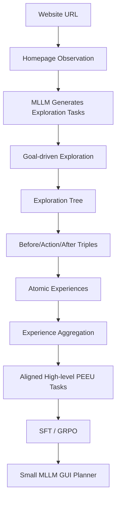

# PEEU：让 GUI Agent 从自主探索和 hindsight 经验里学会高层规划

## 元信息

| 项目 | 内容 |
|---|---|
| 论文 | Empowering GUI Agents via Autonomous Experience Exploration and Hindsight Experience Utilization for Task Planning |
| 作者 | Tianyi Men, Zhuoran Jin, Pengfei Cao, Yubo Chen, Kang Liu, Jun Zhao |
| 版本 | arXiv:2606.27330v1 |
| 时间 | 2026-06-25 17:44:48 UTC |
| 会议状态 | Accepted to ACL 2026 Main |
| 方向 | 大模型 Agent / 多模态 Web GUI Agent / 后训练数据构造 |
| 原文 | https://arxiv.org/abs/2606.27330 |

## TL;DR

- **这篇论文做什么**：PEEU 研究小型开源多模态模型如何在真实网站 GUI 上获得更强的任务规划能力。作者不把训练样本写成单步点击、输入、滚动，而是让 Agent 先在网站里自主设定探索目标，再把探索轨迹反过来重写成与真实结果严格对齐的高层任务。
- **核心方法**：PEEU 分成两段。第一段是 planning tree exploration，给定一个网站 URL，由探索模型从首页生成任务列表并执行探索，形成以首页为根的探索树。第二段是 planning experience utilization，把每一步前后截图和动作总结成 atomic experience，再聚合成更严格、更贴合轨迹结果的高层任务，用于 SFT 和 GRPO。
- **为什么重要**：论文反驳了一个常见直觉：会做单步 GUI 操作，不等于会做长程 Web 任务。TDHAF 分析显示，低层任务训练在 ID 低层测试上可以很高，但迁移到高层任务时急剧下降；高层任务训练反而能更好地下传到中低层并提升 OOD 覆盖。
- **实验设置**：主实验使用 WebVoyager 风格真实网站任务，训练模型为 Qwen2.5-VL-3B-Instruct 和 Qwen2.5-VL-7B-Instruct；探索和经验总结使用 GPT-4o；SFT 用 llama-factory，GRPO 用 verl；训练在 4 张 A800 上完成。训练规模包括 Allrecipes 约 0.1k 轨迹，以及额外 2k 轨迹；测试覆盖 7 个未见网站。
- **关键数字**：在 Qwen2.5-VL-7B、2k trajectories 设置下，PEEU-SFT 总体准确率达到 **30.6%**，高于 Coarse-SFT 的 **19.0%**、Atomic-SFT 的 **21.7%**，也高于 Qwen2.5-VL-32B vanilla 的 **22.7%**。在 0.1k 轨迹设置下，7B 的 PEEU-GRPO 达到 **19.9%**，高于 Atomic-GRPO 的 **10.0%**。
- **TDHAF 证据**：3B 低层训练在 ID low 的 Step SR 为 **80.5%**，但 ID high 只有 **9.1%**；7B 低层训练在 ID low 为 **89.6%**，ID high 只有 **18.8%**。高层训练的 ID coverage 更高：3B 为 **44.8%**，7B 为 **51.9%**。
- **局限**：PEEU 仍依赖 GPT-4o 探索和总结经验，训练网站与测试网站数量有限；成功率虽然相对提升明显，但绝对值仍低于 GPT-4o / Claude 3 Opus 等闭源大模型；论文没有开源模型权重或完整数据管线，复现成本较高。

## 研究问题：小模型 GUI Agent 缺的不是“会点按钮”，而是“知道为什么要这样点”

多模态 Web Agent 的典型任务不是单步识别，而是长程规划：

- 在购物网站里按颜色、评分、价格和库存筛选商品。
- 在食谱网站里找符合约束的菜谱，并打开配料和做法。
- 在 GitHub、arXiv、地图、课程平台之间完成查询、筛选、验证和汇总。

论文的出发点很清楚：

- 商业大模型能做更强的 GUI 规划，但成本、隐私和部署控制都不理想。
- 小型开源 MLLM 更适合本地化或私有化部署，但规划能力和跨网站泛化弱。
- 训练 GUI Agent 时，现有经验利用方法通常有两类偏差。

| 方法类型 | 训练信号 | 主要问题 |
|---|---|---|
| atomic-level task | 点击、输入、选择、滚动等单步任务 | 会操作控件，不等于会组合成长程计划 |
| coarse high-level task | 原始探索任务与整条轨迹 | 任务和轨迹常常不对齐，且缺少真实环境约束 |
| PEEU | 从轨迹中提取经验，再 hindsight 重写高层任务 | 用真实探索结果约束任务，使任务、轨迹、约束三者对齐 |

作者给出的 snowboard 例子很有代表性：

- 原任务要求找 “blue snowboard with 4+ stars”。
- 实际轨迹却可能点到 “yellow snowboard with 3 stars”。
- 如果直接把原任务和这条轨迹配对训练，模型会学到错误规划。
- PEEU 的做法是反过来：把轨迹转成“找黄色、3 星 snowboard”的对齐任务。

这不是简单的数据清洗，而是把失败或偏离轨迹变成可学习经验：

```text
原始高层目标: 用户想找 A
真实轨迹结果: Agent 实际到达 B
粗糙训练样本: A -> 轨迹 B  # 错配
PEEU 训练样本: B 的严格描述 -> 轨迹 B  # 对齐
```

这也是论文标题里 hindsight experience utilization 的含义：

- 先不要假设探索轨迹必须完成预设目标。
- 先承认探索轨迹揭示了网站真实结构和可达约束。
- 再从结果回看，生成与轨迹一致的高层任务。

## 论文主张与论证路线

作者的论证链条可以写成四层：

| 层次 | 主张 | 对应机制或证据 |
|---|---|---|
| Claim | 小型 MLLM 的 GUI Agent 规划弱，核心不只是缺少单步技能 | Atomic 训练在高层任务上泛化差 |
| Mechanism | 从环境探索中获得的经验可以构造更好的高层训练任务 | planning tree + atomic experience + hindsight aggregation |
| Evaluation | 高层任务训练更能支持 OOD 网站规划 | WebVoyager 7 个未见网站测试，PEEU 最高 30.6% |
| Analysis | 任务粒度决定组合泛化方向 | TDHAF 显示 bottom-up 弱，top-down 和高层 OOD 覆盖更强 |

这条路线的关键不是“PEEU 又做了一个 GUI benchmark”，而是提出一个更具体的问题：

- 如果 Agent 训练数据来自交互轨迹，任务描述应该由谁决定？
- 是人先写任务，再勉强匹配轨迹？
- 还是让轨迹揭示环境约束，再由 hindsight 生成任务？

PEEU 选择第二条路。

## 方法机制：PEEU 的两阶段数据循环

### 阶段一：Planning Tree Exploration

输入只有一个网站 URL：

| 符号 | 含义 |
|---|---|
| `URL` | 待探索网站入口 |
| `s0` | 首页观察状态 |
| `M` | 用于探索、总结和聚合的 MLLM |
| `Env` | 浏览器环境 |
| `D={d1,...,dn}` | 探索模型从首页生成的任务列表 |
| `R=(V,E)` | 以首页为根的探索树 |

作者把任务列表生成写成：

```text
D = M(s0, URL)
```

解释：

- `M` 读取首页截图和 URL。
- 它根据网站功能生成若干探索任务。
- 这些任务不是用户最终任务，而是探索环境的学习目标。

随后，Agent 在环境中执行这些任务，形成探索树：

```text
R = Explore(M, D, Env, URL)
```

探索树里，每条路径都可以展开成轨迹：

```text
tau = {(s0, a0), (s1, a1), ..., (sm, am)}
```

变量解释：

- `st`：第 `t` 步的网页视觉观察。
- `at`：第 `t` 步的动作，如 click、type、scroll、select。
- `st+1 ~ P(. | st, at)`：执行动作后进入的新观察状态。
- 多条轨迹共享首页根节点，但会覆盖不同功能分支。

这一阶段的意义是：

- 不依赖人工逐网站写任务。
- 让模型主动发现网站功能和可达路径。
- 收集真实交互约束，而不是只看首页猜任务。

### 阶段二：Planning Experience Utilization

PEEU 接着把轨迹改写为经验。

每一步的 atomic experience 来自执行前后状态差异：

```text
epsilon_t = M(st, at, st+1)
```

含义：

- `st` 是动作前截图。
- `at` 是动作。
- `st+1` 是动作后截图。
- `epsilon_t` 描述这个动作在页面语义上完成了什么。

一整条轨迹的经验是：

```text
mu = (epsilon_1, epsilon_2, ..., epsilon_T)
```

随后，模型把多条轨迹经验聚合成新的 PEEU tasks：

```text
D_tilde = (d_tilde_1, ..., d_tilde_n)
        = Phi(mu_1, mu_2, ..., mu_n, M)
```

关键是 `d_tilde` 不再是探索前猜出来的粗任务，而是探索后回看得到的严格任务。

举一个食谱网站例子：

| 步骤 | 粗任务可能写法 | 轨迹实际发现 | PEEU 任务写法 |
|---|---|---|---|
| 初始目标 | 找 4.5 星以上、儿童可参与的食谱 | 实际点到 4 星食谱 | 不再硬写 4.5 星 |
| 环境约束 | 首页不知道详情页有哪些字段 | 详情页显示配料、做法、图片 | 把配料、做法、图片纳入任务 |
| 训练信号 | 任务和轨迹错配 | 轨迹与页面真实内容一致 | 任务、约束、轨迹对齐 |

因此 PEEU 不是把探索轨迹“洗白”，而是在训练样本层面避免错配。

## 训练目标、SFT 与 GRPO

PEEU 最终训练一个 GUI 规划策略：

```text
pi: S x H x D_tilde -> A
```

变量解释：

- `S`：当前网页状态空间。
- `H`：历史状态和动作序列。
- `D_tilde`：hindsight 聚合后的高层任务描述。
- `A`：动作空间。
- `pi(st, ht, d_tilde)`：给定当前页面、历史和任务，输出下一步动作。

论文使用两种训练：

| 训练方式 | 设置 |
|---|---|
| SFT | batch size 16，learning rate 5.0e-6，5 epochs，llama-factory |
| GRPO | batch size 20，learning rate 1.0e-6，rollout size 10，7 epochs，verl |
| 硬件 | 4 张 A800 |
| 模型 | Qwen2.5-VL-3B-Instruct、Qwen2.5-VL-7B-Instruct |
| 探索模型 | GPT-4o |
| 最大探索长度 | 15 steps |

附录给出的 RL 奖励很朴素：

```text
r_format =
  1.0, if action follows required format
  0.0, otherwise

r_answer =
  1.0, if predicted answer is correct
  0.0, otherwise

R_rl = r_format + r_answer
```

这说明论文的核心不在复杂 reward engineering，而在训练数据如何构造。

如果任务与轨迹错配，即使 reward 设计再精细，也会鼓励模型拟合错误路径。

## 伪代码：从 URL 到可训练 GUI 策略

```text
Input:
  URL: website entry
  M: multimodal large language model
  Env: browser environment

State:
  s0 <- homepage state from URL
  D <- M(s0, URL)
  R <- empty exploration tree
  E <- empty experience set
  D_tilde <- empty hindsight task set

Stage 1: planning tree exploration
  for each task d_i in D:
    tau_i <- []
    while not stop and step < 15:
      observe current state s_t
      choose action a_t using M, d_i, history
      execute a_t in Env
      observe next state s_{t+1}
      append (s_t, a_t, s_{t+1}) to tau_i
    add tau_i to exploration tree R

Stage 2: planning experience utilization
  for each trajectory tau_i in R:
    for each transition (s_t, a_t, s_{t+1}):
      epsilon_t <- M(s_t, a_t, s_{t+1})
    mu_i <- sequence of epsilon_t
    d_tilde_i <- Phi(mu_i, M)
    add (d_tilde_i, tau_i) to training set

Training:
  train policy pi with SFT and optionally GRPO

Output:
  pi: task-oriented GUI planning policy
```

失败边界也很明确：

- 如果探索模型没有进入关键页面，经验里不会包含关键约束。
- 如果经验总结误读页面变化，`d_tilde` 会继承错误。
- 如果网站需要登录、频率限制或复杂动态状态，轨迹覆盖会偏。
- 如果奖励只检查格式和答案，过程安全、隐私和副作用约束仍需要额外机制。

## 主实验：同等数据规模下，PEEU 的提升来自高层对齐任务

论文主实验使用 WebVoyager 风格评测：

- 训练网站包含 Allrecipes 的 0.1k 轨迹设置。
- 另有 2k 轨迹来自此前未见网站。
- 测试包含 7 个完全排除于训练之外的网站。
- 指标是 trajectory-level success rate，也就是整条任务轨迹成功率。

### 关键结果表

| 模型与数据 | 方法 | Overall |
|---|---:|---:|
| Qwen2.5-VL-32B | Vanilla | 22.7 |
| Qwen2.5-VL-7B, 0.1k | Vanilla | 7.8 |
| Qwen2.5-VL-7B, 0.1k | Atomic-GRPO | 10.0 |
| Qwen2.5-VL-7B, 0.1k | PEEU-GRPO | 19.9 |
| Qwen2.5-VL-3B, 2k | Coarse-SFT | 13.2 |
| Qwen2.5-VL-3B, 2k | Atomic-SFT | 16.7 |
| Qwen2.5-VL-3B, 2k | PEEU-SFT | 19.8 |
| Qwen2.5-VL-7B, 2k | Coarse-SFT | 19.0 |
| Qwen2.5-VL-7B, 2k | Atomic-SFT | 21.7 |
| Qwen2.5-VL-7B, 2k | PEEU-SFT | 30.6 |

这组数字支持三个判断：

- **同模型同数据量时，PEEU 高于 coarse 与 atomic 任务训练**。
- **小模型经过更好的数据构造后，可以超过更大 vanilla 模型**。
- **prompt retrieval 对小模型帮助有限，直接训练更有效**。

尤其是 7B、2k 设置：

```text
PEEU-SFT - Atomic-SFT = 30.6 - 21.7 = 8.9 points
PEEU-SFT - Coarse-SFT = 30.6 - 19.0 = 11.6 points
PEEU-SFT - Qwen2.5-VL-32B vanilla = 30.6 - 22.7 = 7.9 points
```

这不是“参数更大自然更强”的故事，而是“任务描述质量改变了训练信号”。

### Prompt retrieval 为什么不够？

论文比较了 Atomic-Prompt 和 Trajectory-Prompt：

| 设置 | Vanilla | Atomic-Prompt | Trajectory-Prompt |
|---|---:|---:|---:|
| Qwen2.5-VL-3B, 0.1k | 0.2 | 0.0 | 0.0 |
| Qwen2.5-VL-7B, 0.1k | 7.8 | 3.7 | 3.7 |

作者的解释是：

- 小模型推理能力有限，额外塞入经验文本不一定能被正确利用。
- Web GUI 任务需要把经验转成可执行动作，而不只是回忆相似案例。
- 没有专门 prompt pipeline 时，retrieval 甚至可能稀释当前任务上下文。

因此，PEEU 更倾向把经验蒸馏进模型参数，而不是只在推理时检索。

## TDHAF：低层技能不自动组合成高层规划

TDHAF 是论文最有分析价值的部分。

它把 GUI 任务拆成三层：

| 粒度 | 定义 | 例子 |
|---|---|---|
| Low-level | 单步任务，只依赖当前观察 | 点击日期选择器、输入 France、选择下拉项 |
| Mid-level | 多步子任务，依赖局部历史 | 设置出发和返回日期、检查评分并预约 |
| High-level | 长程组合任务，包含多个子任务和约束 | 找到高评分、绿植环绕、有艺术品的酒店并预订 |

对应的策略形式是：

```text
Low:  a_t = pi(d_low, s_t)
Mid:  a_t = pi(d_mid, H_p:t, s_t)
High: a_t = pi(d_high, H_0:t, s_t)
```

这里的区别不只是 prompt 长短：

- Low-level 关注控件定位和动作格式。
- Mid-level 关注短链路约束。
- High-level 关注目标分解、历史保持和跨页面信息整合。

### Bottom-up 的失败

TDHAF 中，作者先看低层训练能否泛化到高层。

| 模型 | 低层训练后 ID low Step SR | 低层训练后 ID high Step SR |
|---|---:|---:|
| Qwen2.5-VL-3B | 80.5 | 9.1 |
| Qwen2.5-VL-7B | 89.6 | 18.8 |

这个结果直接否定了“先把所有 atomic skill 学好，再自然组合成长程规划”的简单想法。

它说明：

- 单步动作的 `Id / Action / Value` 能力不是高层任务成功的充分条件。
- 高层任务还需要决定子目标顺序、维护历史、处理隐藏约束。
- GUI Agent 的规划泛化更像程序组合，而不是控件识别的线性叠加。

### Top-down 的覆盖优势

作者还定义了 coverage percentage：

- 如果一个任务在多个层级都成功，记为 good generalization。
- 如果只在局部层级成功，说明训练粒度覆盖不完整。

ID setting 下：

| 模型 | Low 训练 coverage | Middle 训练 coverage | High 训练 coverage |
|---|---:|---:|---:|
| Qwen2.5-VL-3B | 3.2 | 22.7 | 44.8 |
| Qwen2.5-VL-7B | 9.1 | 36.4 | 51.9 |

OOD setting 下，趋势仍然偏向更高层训练：

| 模型 | Low 训练 coverage | Middle 训练 coverage | High 训练 coverage |
|---|---:|---:|---:|
| Qwen2.5-VL-3B | 18.9 | 24.3 | 33.8 |
| Qwen2.5-VL-7B | 25.7 | 29.7 | 37.8 |

这就是 PEEU 强调 high-level hindsight task 的直接证据：

- 高层任务训练更容易覆盖中低层。
- 低层任务训练不一定会反向组合成高层。
- OOD 泛化尤其需要任务级结构，而不是单步控件习惯。

## Figure 与 Table 证据如何支撑论文主张？

### Figure 1：把“错配轨迹”变成可学习经验

Figure 1 的功能不是装饰，而是定义 PEEU 和前人方法的差异：

| 图中元素 | 支撑的论点 |
|---|---|
| Atomic task training | 单步经验可以训练点击/输入，但缺少组合约束 |
| Coarse task training | 原始任务与实际轨迹可能错配 |
| Hindsight experience | 从真实轨迹提取 procedural experience |
| PEEU task | 把任务改写为与真实页面结果对齐的高层目标 |

最关键的证据是“turn trash into treasure”：

- 对粗训练来说，偏离目标的轨迹是噪声。
- 对 PEEU 来说，偏离轨迹仍然揭示了网站可达状态。
- 只要把任务描述改写正确，它就变成训练材料。

### Figure 2：两阶段 pipeline

Figure 2 展示从 URL 到训练样本的完整过程：



这个流程强调两件事：

- 数据来源是交互，不是离线标注表。
- 任务生成发生在探索之后，不是探索之前一次性定死。

### Table 1：PEEU 的主结果

Table 1 支撑方法有效性：

- 7B + 2k 的 PEEU-SFT 是主实验最高小模型结果。
- 3B + 2k 的 PEEU-SFT 也高于 Coarse-SFT 和 Atomic-SFT。
- 0.1k 小数据下，GRPO 版本对 7B 有明显提升。

但 Table 1 也暴露边界：

| 问题 | 证据 |
|---|---|
| 绝对成功率仍不高 | 30.6% 仍低于 GPT-4o 59.0% 和 Claude 3 Opus 56.1% |
| 网站间方差明显 | 有些网站如 Apple、Github 并非全都大幅领先 |
| 训练依赖强探索模型 | GPT-4o 负责探索和总结，开源小模型不是全流程自举 |

### Table 2 / TDHAF：为什么是高层任务？

Table 2 和 Figure 3 支撑“高层任务训练更合理”的解释。

它不是只证明 PEEU 比 baseline 高，而是解释为什么：

- 低层动作掌握不能保证高层规划。
- 高层任务训练可以向下覆盖更多子技能。
- OOD 场景里，高层结构比单步 skill 更能迁移。

这部分让论文不只是方法论文，也像是一篇 GUI Agent 泛化机制分析。

## 与相关工作的关系

PEEU 站在两条研究线交汇处。

第一条是 multimodal web navigation agent：

- WebVoyager 提供真实网站评测范式。
- Qwen2.5-VL、GPT-4o、Claude 等模型展示了大模型原生 GUI 能力。
- GUI-R1、UI-R1 等工作把 RL 或动作预测引入 GUI Agent。

第二条是 experience-based post-training：

- atomic experience 方法从状态变化里抽取单步操作经验。
- high-level trajectory 方法直接用长程任务轨迹训练。
- PEEU 的区别在于 hindsight 对齐：不是只用原始任务，也不是只用单步变化。

可以把三类方法放到一个坐标里：

| 方法 | 任务粒度 | 是否利用真实环境约束 | 主要风险 |
|---|---|---|---|
| Atomic experience | 低 | 局部利用 | 组合泛化弱 |
| Coarse trajectory | 高 | 弱，常错配 | 任务和轨迹不一致 |
| PEEU | 高 | 强，从轨迹回推 | 依赖探索和总结质量 |

PEEU 的贡献不在“第一次用轨迹训练 GUI Agent”，而在把轨迹重写为对齐任务。

## 消融、失败与边界

论文没有提供传统意义上非常细的模块消融，例如移除 experience extraction、移除 aggregation、替换探索模型后的完整表格。

但主实验和 TDHAF 已经形成几组间接消融：

| 对照 | 代表设置 | 结论 |
|---|---|---|
| PEEU vs Coarse | 7B 2k: 30.6 vs 19.0 | 仅用原始探索任务不如 hindsight 对齐 |
| PEEU vs Atomic | 7B 2k: 30.6 vs 21.7 | 单步经验不如高层任务 |
| Training vs Retrieval | 7B 0.1k: PEEU-GRPO 19.9 vs prompt 3.7 | 小模型需要参数更新，不只是检索经验 |
| High vs Low in TDHAF | 7B ID coverage 51.9 vs 9.1 | 高层训练覆盖更强 |

仍需谨慎的边界包括：

- **教师模型依赖**：GPT-4o 既用于探索，也用于状态变化总结和任务聚合；如果换成小模型或开源模型，数据质量可能下降。
- **评测环境规模**：主结果覆盖 7 个未见网站，能说明跨网站泛化趋势，但离开放互联网长尾还远。
- **成功率绝对值**：30.6% 相对强，但还不能说明小模型已经可独立承担高可靠 GUI 自动化。
- **安全与副作用**：论文关注规划成功率，没有系统处理登录、支付、隐私、不可逆动作、权限边界和审计。
- **可复现性缺口**：论文给出方法和设置，但未看到完整开源训练数据、权重和运行脚本；复现实验需要浏览器环境、GPT-4o 调用和多卡训练。

## 如何读这个结果而不误读？

这篇论文的数字很容易被简单概括成“小模型超过大模型”，但更准确的读法应该分成三层。

### 第一层：它证明的是数据构造收益，不是模型能力终局反超

PEEU-SFT 的 7B 模型在 2k trajectories 设置下达到 30.6%，确实超过 Qwen2.5-VL-32B vanilla 的 22.7%。

但这个比较有两个前提：

- 7B 是经过 PEEU 构造数据训练后的模型。
- 32B 是未经过同类 PEEU 后训练的 vanilla 模型。

因此，更稳妥的结论是：

- **同样模型规模下，PEEU 数据构造明显提升 GUI 规划成功率。**
- **经过高质量后训练的小模型，可以超过未专门后训练的大模型。**
- **不能直接推出 7B 架构整体强于 32B 架构。**

### 第二层：它证明高层任务有效，但没有证明低层任务无用

TDHAF 中低层训练向高层泛化弱，这说明 atomic skill 不是高层规划的充分条件。

但低层任务仍然有价值：

- 它帮助模型学习控件定位、动作格式和单步视觉 grounding。
- 它可能是高层训练前的基础能力。
- 它在异常恢复和局部修正中仍有意义。

PEEU 的真正论点不是“不要低层任务”，而是：

- 只靠低层任务不够。
- 长程 GUI Agent 需要直接学习高层目标与轨迹之间的对应关系。
- 高层训练样本如果错配，会比低层样本更危险，因为它会污染整个规划链。

### 第三层：hindsight 不是把失败合理化，而是重写监督目标

PEEU 的一个潜在争议是：如果 Agent 原本没完成用户目标，把轨迹改写成另一个任务，会不会是在逃避失败？

这个问题需要区分训练和评测：

| 阶段 | 是否允许 hindsight 改写？ | 原因 |
|---|---|---|
| 训练数据构造 | 可以 | 目标是把真实轨迹变成一致监督信号 |
| 线上任务执行 | 不可以随便改用户目标 | 用户目标仍是最终约束 |
| 失败分析 | 可以记录偏离结果 | 用于生成能力边界样本 |
| 评测 | 不能把失败改成成功 | 轨迹成功率仍按原任务判断 |

也就是说，PEEU 不是在评测时改答案，而是在训练前把“错配样本”改造成“对齐样本”。

这个区分很重要：

- 如果在评测阶段 hindsight 改目标，就是指标作弊。
- 如果在训练阶段 hindsight 对齐目标，就是监督信号修复。
- 如果在部署阶段记录偏离轨迹并形成新训练样本，就是持续学习闭环。

## 对 Agent 研究的启发

PEEU 最值得带走的判断是：

- Agent 训练数据的“任务描述”本身是一个学习对象。
- 轨迹不是天然正确或错误，关键在于它和任务是否对齐。
- 高层任务的泛化价值，可能大于单步动作标注的密度。

这对 GUI Agent、代码 Agent、工具调用 Agent 都有类比意义。

### 对 GUI Agent

GUI 任务经常有隐藏约束：

- 商品页面实际没有某个筛选项。
- 搜索结果排序和筛选逻辑与用户预期不同。
- 页面状态依赖滚动、弹窗、登录和地区。

PEEU 的 hindsight 思路适合这类环境：

- 先探索可达状态。
- 再把可达状态表达为任务。
- 用对齐任务训练模型，而不是强迫模型拟合不可能完成的任务。

### 对工具调用 Agent

工具调用 Agent 也常遇到类似错配：

| 场景 | 粗任务 | 实际轨迹 | Hindsight 任务 |
|---|---|---|---|
| 代码修复 | 修复某 bug | 只定位到 failing test | 生成“定位失败测试原因”的训练样本 |
| 数据分析 | 找最终结论 | 实际发现数据缺字段 | 生成“检测缺字段并解释限制”的训练样本 |
| 安全扫描 | 验证漏洞 | 实际得到不可复现证据 | 生成“记录不可复现条件”的训练样本 |

这会把失败轨迹从废样本变成能力边界样本。

### 对后训练

PEEU 也提示后训练不应只看 reward：

- 如果样本任务错配，reward 会在错误问题上优化。
- 如果任务粒度过低，模型会学到局部 skill 而非规划结构。
- 如果高层任务来自真实探索，SFT 就已经能获得显著收益。

因此，在 Agent 后训练中，数据构造可能比算法选择更先决定上限。

## 结论与继续追问

PEEU 的核心贡献可以概括为一句话：

> GUI Agent 的规划泛化，不能只靠堆单步操作经验；更有效的训练信号来自与真实探索轨迹对齐的高层 hindsight 任务。

从证据看，这个主张有三点支撑：

- WebVoyager 主实验里，PEEU 在同等数据规模下显著优于 Atomic 和 Coarse 任务训练。
- TDHAF 显示，低层技能不会自然组合成高层规划，高层训练的覆盖更强。
- Prompt retrieval 对小模型效果很弱，说明经验需要被转化为模型可内化的训练样本。

但它还没有解决全部问题：

- 如何降低 GPT-4o 作为探索和总结教师的依赖？
- 如何把安全约束、权限、审计和不可逆副作用纳入 PEEU？
- 如何在动态网页、登录状态、个性化内容和反爬限制下稳定收集探索树？
- 如何判断 hindsight 任务不是“把错误合理化”，而是真正形成可泛化经验？
- 如何把 PEEU 与在线 RL、失败回放、工具调用 trace、memory 写入结合起来？

如果后续研究能把这些问题补上，PEEU 的意义会超出 Web GUI：

- 它可以成为 Agent 训练中的一种通用数据重写范式。
- 它可以把失败轨迹变成可审计、可训练、可分类的经验。
- 它也提醒我们：Agent 能力不是单步动作集合，而是任务、环境、历史和约束共同组成的规划系统。
