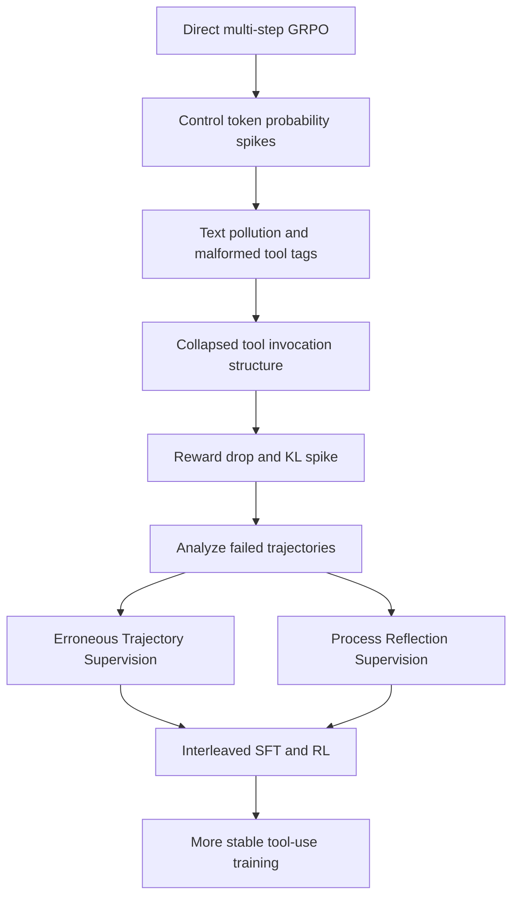

# Why Multi-Step Tool-Use RL Collapses：多步工具调用 RL 为什么会结构性坍塌？

## 元信息

- **论文**：Why Multi-Step Tool-Use Reinforcement Learning Collapses and How Supervisory Signals Fix It
- **作者**：Yupu Hao, Zhuoran Jin, Huanxuan Liao, Kang Liu, Jun Zhao
- **机构**：中国科学院自动化研究所复杂系统认知与决策智能重点实验室；中国科学院大学人工智能学院
- **发布日期**：2026-06-24 16:55:56 UTC，arXiv v1
- **原文**：[arXiv:2606.26027](https://arxiv.org/abs/2606.26027)
- **代码**：[hypasd-art/Tool-RL-Box](https://github.com/hypasd-art/Tool-RL-Box)
- **分类**：大模型后训练 / 大模型 Agent

## TL;DR

- 这篇论文研究一个很具体但重要的现象：**多步工具调用 Agent 直接做 RL 时，不只是性能涨得慢，而是可能突然坍塌到几乎不可用**。坍塌表现为 reward 突降、KL 持续飙升、工具调用结构破坏，输出退化成错误控制 token 组合。
- 作者的核心判断是：坍塌主要不是模型“不会用工具了”，而是 RL 过程放大了 `<tool_call>`、`<|im_end|>` 等控制 token 的概率，使工具调用格式边界被污染；能力仍可能被格式暴露或遮蔽。
- 实验使用 BFCL-V3 的 Base、Miss Func、Miss Param、Long Context 四类设置，训练集从前三类各抽 100 条，共 300 个问题；模型为 Qwen2.5-1.5B-Instruct 与 Qwen3-1.7B。
- 关键结果是：Qwen2.5 上 GRPO 单独训练平均分从 Vanilla 3.50 掉到 0.0；Process Reflection Supervision 达到 25.75，Erroneous Trajectory Supervision 达到 20.0。Qwen3 上 ETS 达到 23.25，是最强方法；但 SFT+RL、OPS、HBG 等多种同步或格式不匹配方法会掉到接近 0。
- 论文系统比较 SFT then RL、Off-policy Supervision、Hint-based Guidance、Erroneous Trajectory Supervision、Process Reflection Supervision，并区分同步混合与交错训练。结论是：仅把监督信号混进 RL 不够，能从失败轨迹中构造纠错 SFT、并和 RL 交错更新的策略更稳定。
- 局限是：实验集中在小模型、BFCL-V3 与 ACEBench；论文证明了工具调用格式的结构性风险，但还没有覆盖大规模闭源 Agent、真实生产工具副作用、长时间异步任务和安全约束冲突。

## 1. 研究问题：为什么工具调用 RL 比普通推理 RL 更脆？

### 1.1 多步工具调用的特殊性

- 普通文本推理主要优化自然语言 token 序列。
- 工具调用 Agent 同时要生成：
  - 自然语言；
  - 工具名；
  - 参数 JSON；
  - 开始和结束控制 token；
  - 多轮上下文中的工具反馈；
  - 后续 follow-up 的一致状态。

这导致一个关键差异：

| 任务类型 | 错误主要表现 | RL 放大的风险 |
| --- | --- | --- |
| 数学推理 | 中间推导错、最终答案错 | 奖励稀疏、探索低效 |
| 单轮函数调用 | 函数名或参数错 | 格式可校验但轨迹短 |
| 多步工具调用 | 工具顺序、格式、参数、反馈解释同时出错 | 控制 token 和结构边界被 RL 放大后污染整条轨迹 |

论文的价值就在于：它没有把坍塌泛泛归因于“RL 不稳定”，而是把失败定位到**结构 token 动力学**。

### 1.2 作者为什么说能力没有完全丢？

论文观察到一种反直觉现象：

- 在某些训练阶段，模型输出格式坏掉，评测分数接近 0。
- 但在 format OOD 或不同调用模板下，部分“坍塌”方法仍能恢复表现。
- 这说明底层工具使用能力可能仍在，只是被特定格式下的控制 token 分布遮住。

这对 Agent 后训练很重要：

- 不能只看最终 reward 曲线判断能力是否退化。
- 需要同时看工具调用结构、特殊 token 频率、输出类别迁移。
- 如果只用标量 reward 做更新，模型可能学到“更容易触发格式终止”的伪策略。

## 2. 论文主张与证据链

| Claim | Mechanism | Evidence | Boundary |
| --- | --- | --- | --- |
| 多步工具 RL 会发生结构性坍塌 | RL 放大 `<tool_call>`、`<|im_end|>` 等控制 token，导致格式边界污染 | Figure 1/2 展示 Qwen2.5 训练中 polluted/collapsed token 频率和 reward/KL 异常 | 主要在小模型与 BFCL-V3 训练设置中观察 |
| 坍塌不是纯能力丢失 | 改变格式或评测分布后，部分方法仍显示可用能力 | Table 2 的 ACEBench OOD 结果显示 GRPO/OPS/HBG 在某些 format OOD 下不完全崩 | OOD 恢复不代表真实生产稳定 |
| 监督信号必须调节结构，而不是只给更高 reward | SFT、错误轨迹监督、过程反思分别提供格式、纠错、过程解释 | Table 1 中 PRS/ETS 明显强于 GRPO-only、OPS、HBG | SFT 也会格式过拟合，不能单独依赖 |
| 交错式 RL+SFT 比同步混合更稳 | 从失败轨迹构造 SFT 数据，再和 RL 交替更新 | ETS/PRS 在 Qwen2.5 与 Qwen3 上整体更强 | 学习率、prompt 格式、thinking token 都会改变结论 |

论文的论证路线可以概括为：



## 3. 方法前提：多轮工具轨迹怎样被建模？

论文把一条工具使用轨迹写成：

```text
tau = (a_1, r_1, a_2, r_2, ..., a_T, r_T)
```

变量含义：

- `a_t`：第 `t` 步动作，可以是自然语言回复，也可以是工具调用。
- `r_t`：环境反馈，包括工具执行结果、用户响应或系统返回。
- `A`：动作空间，包含合法工具调用和普通文本。
- `R`：反馈空间，包含环境与用户反馈。

反馈函数可写为：

```text
r_t = R(a_t | a_1, r_1, ..., a_{t-1}, r_{t-1})
```

模型动作采样可写为：

```text
a_t ~ P(a_t | a_1, r_1, ..., a_{t-1}, r_{t-1})
```

这两个公式背后的意思是：

- 工具调用不是孤立 token，而是依赖完整历史。
- 每一次格式错误都可能污染后续状态。
- reward 只在完整轨迹或阶段性反馈后出现，不能直接约束每个控制 token。

## 4. 坍塌机制：从健康输出到控制 token 污染

### 4.1 四类结构状态

论文把输出分成四类：

| 状态 | 含义 | 例子或风险 |
| --- | --- | --- |
| Healthy Tool Call | 工具调用格式正确，参数完整 | `<tool_call>{...}</tool_call><|im_end|>` |
| Healthy Response | 自然语言回复，不含工具残片 | 正常解释或最终回答 |
| Text Pollution | 文本中混入不完整工具标签或控制 token | 自然语言里出现半截 `<tool_call>` |
| Collapsed | 输出退化成极简无语义终止串 | `<tool_call><|im_end|>` |

这个分类比简单的“对/错”更有信息量，因为它揭示了坍塌的过程：

1. 早期模型还能区分工具调用路径和文本回复路径。
2. RL 更新后，控制 token 在不该出现的位置增加。
3. 工具标签残片污染自然语言回复。
4. 后期概率质量集中到最短终止结构。
5. 评测中工具调用结构彻底失效。

### 4.2 为什么 RL 会放大控制 token？

论文没有把它归因于某个单一超参，而是指出几个共同因素：

- 工具调用格式里控制 token 的 reward 关联很强。
- 多步任务中一旦早期工具结构对了，最终 reward 更可能为正。
- GRPO 等方法用轨迹级 reward 更新时，可能把“成功轨迹里出现过的控制 token”过度强化。
- 特殊 token 数量少、语义密度低，一旦被放大就容易组合成无意义短序列。

可用伪代码描述这一风险：

```text
Input:
  sampled trajectory tau
  terminal reward R(tau)
  tool-control tokens C = {<tool_call>, </tool_call>, <|im_end|>}

Loop:
  if R(tau) > baseline:
    increase probability of tokens in tau
  for token in C:
    if token appears in successful trajectories:
      probability[token] may increase faster than structural context
  if probability mass concentrates on short control pattern:
    output becomes malformed or collapsed

Failure:
  reward credits the trajectory, but update cannot distinguish
  "correct control token in correct slot" from "control token anywhere".
```

这解释了为什么工具调用 RL 需要结构监督，而不仅是终局 reward。

## 5. 五类监督信号分别在修什么？

### 5.1 SFT Supervision：先给格式地基

SFT 阶段模仿专家轨迹：

```text
L_SFT(theta)
  = - average over (q, tau) in D_SFT
      sum_t log pi_theta(a_t | q, tau_<t)
```

它的作用：

- 建立基础工具调用语法。
- 提供正确 action / feedback 的局部模式。
- 降低 RL 初期探索空间。

它的局限：

- 受数据覆盖约束。
- 可能格式过拟合。
- 单独 SFT 不一定带来探索能力。

### 5.2 OPS：把 off-policy 正确轨迹混进 RL

Off-policy Supervision 把高质量 SFT 轨迹和 on-policy rollout 混合。

作者设计上刻意保持同样的 policy ratio，不额外修改 importance ratio，目的是公平比较监督信号本身。

它的问题在结果里很明显：

- 同步混合会带来更高 KL。
- 轨迹不是严格 on-policy，分布偏移可能破坏优化。
- 在 Table 1 中，OPS 对 Qwen2.5 平均只有 1.50，对 Qwen3 接近 0。

### 5.3 HBG：采样时给提示，优化时拿掉提示

Hint-based Guidance 的思路是：

- 采样时在 query 前加入正确 hint。
- 让模型更容易探索到正确轨迹。
- 做 policy optimization 时移除 hint，把轨迹当成普通 on-policy 样本。

它听起来合理，但实验表现很弱：

- Qwen2.5 平均 0.0。
- Qwen3 平均 0.75。

可能原因是：

- hint 改变了采样上下文；
- 优化时移除 hint 后，训练条件和生成条件不一致；
- 模型没有真正学到无 hint 时的结构约束。

### 5.4 ETS：从失败问题构造纠错 SFT

Erroneous Trajectory Supervision 是本文最稳的策略之一。

流程是：

1. 当前策略采样多条轨迹。
2. 找出所有采样都失败的问题。
3. 用 ground-truth solution 构造监督数据。
4. 交错执行纠错 SFT 与标准 RL。
5. 随迭代逐步提高 RL 比例。

公式上，错误集合可写为：

```text
E_k = {(q, tau_label) | all sampled tau for q have R(tau)=0}
```

监督损失：

```text
L_err(theta)
  = - average over E_k
      sum_t log pi_theta(a_t | q, tau_<t)
```

它的优势是：

- 只对模型当前真正失败的问题加监督。
- 监督信号和 on-policy 失败分布更贴近。
- 避免把所有 expert data 同步混入 RL。

### 5.5 PRS：把失败轨迹转成过程反思

Process Reflection Supervision 进一步把失败轨迹交给辅助分析器生成文本反思。

反思内容包括：

- 错误根因；
- 交互日志证据；
- 立即修复建议；
- 类似场景泛化；
- 正确工具调用格式要求。

它本质上把“过程奖励”从标量变成文本监督：

```text
R_k = {(q, tau, reflection_tau)}

L_ref(theta)
  = supervised loss on reflection text
  + supervised loss on corrected action sequence
```

这解释了为什么 PRS 在 Qwen2.5 上平均分最高：它不只告诉模型“这条错了”，还把结构错误解释成可模仿的语言模式。

## 6. 主结果：Table 1 怎么读？

### 6.1 Qwen2.5-1.5B-Instruct

| 方法 | Base | Miss Func | Miss Param | Long Context | Average |
| --- | ---: | ---: | ---: | ---: | ---: |
| Vanilla | 4.0 | 5.0 | 1.0 | 4.0 | 3.50 |
| GRPO | 0.0 | 0.0 | 0.0 | 0.0 | 0.0 |
| SFT(BFCL)+RL | 21.0 | 22.0 | 19.0 | 7.0 | 17.25 |
| SFT(ToolACE)+RL | 23.0 | 23.0 | 13.0 | 10.0 | 17.25 |
| OPS | 1.0 | 3.0 | 1.0 | 1.0 | 1.50 |
| HBG | 0.0 | 0.0 | 0.0 | 0.0 | 0.0 |
| ETS | 26.0 | 25.0 | 16.0 | 13.0 | 20.0 |
| **PRS** | **31.0** | **25.0** | **26.0** | **21.0** | **25.75** |

这个表有三个重点：

- GRPO-only 不仅没提升，还归零，说明多步工具 RL 的探索风险很高。
- 先 SFT 后 RL 能显著抬高地板，但不是最强。
- PRS / ETS 这类从失败中构造交错监督的方法更稳。

### 6.2 Qwen3-1.7B

| 方法 | Base | Miss Func | Miss Param | Long Context | Average |
| --- | ---: | ---: | ---: | ---: | ---: |
| Vanilla | 14 | 11 | 14 | 11 | 12.5 |
| SFT(BFCL) | 23 | 20 | 23 | 14 | 20 |
| GRPO | 2 | 0 | 2 | 2 | 1.5 |
| SFT(BFCL)+RL | 0 | 0 | 0 | 0 | 0 |
| OPS | 0 | 0 | 0 | 0 | 0 |
| HBG | 1 | 0 | 1 | 1 | 0.75 |
| **ETS** | **26** | **27** | **19** | **21** | **23.25** |
| PRS | 23 | 22 | 17 | 16 | 19.5 |

Qwen3 的现象更有警示意义：

- SFT(BFCL) 单独有效。
- 但 SFT 后再 RL 反而归零。
- 作者将其归因于 Qwen3 thinking 模式与 SFT 直接工具调用数据之间的格式不一致。

这说明：更强的基础模型不一定更容易 RL 后训练；如果 prompt 包装、thinking token、工具格式之间不一致，RL 仍会把结构推崩。

## 7. OOD 结果：为什么“稳定”也可能是格式假象？

Table 2 在 ACEBench 上区分两类 OOD：

- **Format and Content OOD**：工具类型、场景、调用模板都变了。
- **Content OOD**：工具类型和场景变了，但格式仍接近原训练格式。

Qwen2.5 的几个关键平均数：

| 方法 | Format+Content OOD Avg | Content OOD Avg |
| --- | ---: | ---: |
| Vanilla | 26.00 | 31.6 |
| SFT(BFCL) | 0.00 | 24.1 |
| GRPO | 24.75 | 0.0 |
| OPS | 25.75 | 23.2 |
| HBG | 22.50 | 0.0 |
| ETS | 8.75 | 21.6 |
| PRS | 12.00 | 25.8 |

这个表不能简单读成“Vanilla 最好”或“监督没用”。

更准确的读法是：

- SFT 方法在训练格式内很强，但切到 ACEBench 固定调用模板时可能彻底失效。
- GRPO-only 在某些格式 OOD 下看起来稳定，说明它没有完全丢掉能力。
- ETS/PRS 在内容 OOD 下仍有价值，但格式 OOD 暴露了监督数据绑定格式的问题。

结论是：

```text
工具调用 RL 的泛化至少有两条轴：
1. 工具内容和任务场景是否变了；
2. 工具调用语法和 prompt 包装是否变了。
```

如果只测内容 OOD，可能低估格式过拟合；如果只测格式 OOD，可能误判模型能力没有改善。

## 8. Figure 与 Table 的证据作用

### 8.1 Figure 1：控制 token 频率变化

Figure 1 把训练过程中的输出分布分成 healthy、polluted、collapsed。

它支持的结论是：

- 坍塌不是某一步突然从“会”变成“不会”。
- 坍塌有中间态：工具标签残片先污染文本输出。
- 最后才出现极简控制 token 序列占据概率质量。

### 8.2 Figure 2 / Figure 5：reward 与 KL 曲线

这些曲线说明：

- Qwen2.5 direct RL 中 reward 会突然掉下去。
- KL divergence 会持续升高，说明策略分布快速偏离参考。
- SFT(ToolACE)+RL 比 direct RL 更平滑，但不是所有模型都安全。
- 不同监督策略的 KL 动态差异，解释了同步混合为什么可能不稳。

### 8.3 Table 3：输出类型例子

Table 3 给出四类输出：

- Healthy Tool Call；
- Healthy Response；
- Text Pollution；
- Collapsed Output。

这张表的作用不是展示 benchmark 分数，而是给“结构性坍塌”一个可检查的诊断标准。

真实训练中也可以照这个思路做监控：

- 每轮统计 malformed tool tag 比例；
- 统计控制 token 出现在自然语言段落的频率；
- 单独监控 `<tool_call><|im_end|>` 这类短路模式；
- 把格式健康度作为 RL 训练早停或回滚信号。

## 9. 官方代码仓库透露的工程边界

官方仓库 `Tool-RL-Box` 建在 `verl-tool` 与 `veRL` 之上，README 说明它面向 function-calling agents 的工具增强 RL。

结构上包括：

| 模块 | 作用 |
| --- | --- |
| `verl_tool/` | agent、trainer、tool server、rollout worker |
| `verl/` | veRL 训练框架子模块 |
| `benchmarks/ACEBench` | OOD 评估 |
| `examples/train/fcl/` | SFT、RL、evolution、hint、replace 训练脚本 |
| `process_error_idx.py` | 筛选错误轨迹用于 SFT |
| `process_reward_pr.py` | LLM judge 分析多轮工具交互并生成增强数据 |
| `process_format_error.py` | 工具调用格式诊断与坍塌可视化 |
| `compute.py` | token probability 分析工具 |

这说明论文不是只有观察结果，而是配套了训练和诊断工具。

但仓库也显示现实成本：

- Qwen2.5-1.5B 与 Qwen3-1.7B 训练都需要 2 张 GPU。
- 依赖 `vllm`、`flash-attn`、`verl` 等训练栈。
- 需要 W&B 等实验记录。
- 评测和训练脚本分散在 examples 与 benchmark 目录中。

因此，它适合研究复现和二次开发，不是一个即插即用的生产 Agent RL 平台。

## 10. 相关工作中的位置

### 10.1 相对工具学习

工具学习过去常见路线是：

- 合成高质量工具轨迹；
- SFT 模仿工具调用；
- 设计 better prompt / reasoning framework；
- 用 RL 提升任务成功率。

这篇论文补的不是“再合成更多数据”，而是指出：

- RL 在结构化输出上会改变控制 token 分布。
- 能力提升和格式健康是两回事。
- 训练曲线必须同时看 reward、KL、token 类型频率和 OOD 格式泛化。

### 10.2 相对数学 RL / expert trajectory

数学推理里的 expert trajectory 通常是一串自然语言或公式步骤。

多步工具调用里的 expert trajectory 额外包含：

- 工具边界；
- 参数 schema；
- API 反馈；
- 多轮状态；
- 用户 follow-up。

因此，把 LUFFY、ReLIFT 这类 expert replacement 或交错 SFT 思路搬到 Agent 场景时，必须处理结构 token 的特殊风险。

论文中 OPS 效果弱，正好说明：

- 不是有 expert data 就够；
- 同步混入 off-policy 轨迹可能扰乱 RL；
- 错误驱动、过程反思、交错更新更接近当前策略的问题分布。

## 11. 局限与失败边界

### 11.1 小模型和特定 benchmark 的边界

实验模型是：

- Qwen2.5-1.5B-Instruct；
- Qwen3-1.7B。

这使论文适合观察机制，但不能直接推出：

- 70B 级模型会同样坍塌；
- 闭源模型 API fine-tuning 会同样坍塌；
- 生产 Agent 的所有工具链都能用 ETS/PRS 修好。

### 11.2 监督信号也会制造新问题

SFT 和 PRS 不是免费午餐：

- SFT 可能绑定特定工具调用格式。
- PRS 可能引入辅助 LLM 的偏见。
- ETS 依赖 ground-truth solution。
- Hint guidance 可能让采样条件和训练条件不一致。
- off-policy 混合可能提高 KL，扰乱 on-policy 优化。

所以，监督信号要被当作结构正则，而不是更多数据越多越好。

### 11.3 安全角度还缺什么？

结构坍塌和安全失败相邻但不等价。

还需要进一步研究：

- 工具权限是否被错误调用；
- 高风险 API 是否在坍塌前出现异常概率；
- 结构健康度是否能预测安全事故；
- 监督信号会不会让模型更会“合法格式地执行危险动作”；
- PRS 生成的反思是否可能泄露工具策略或越权路径。

## 12. 对后训练研究的启发

### 12.1 RL 训练要监控结构，而不只是 reward

这篇论文给 Agent 后训练一个直接建议：

- reward 曲线；
- KL 曲线；
- 格式合法率；
- 控制 token 频率；
- Text Pollution 比例；
- Collapsed Output 比例；
- format OOD 与 content OOD 分开测。

这些应该一起进入训练 dashboard。

更具体地说，一个多步工具调用 RL 训练日志至少应拆成三层：

| 层级 | 观测对象 | 为什么必须单独看 |
| --- | --- | --- |
| 轨迹级 | 最终 reward、任务成功率、平均步数 | 判断任务是否真的完成，但太晚发现结构错误 |
| 分布级 | KL、控制 token 概率、特殊 token entropy | 判断策略是否向短路格式漂移 |
| 结构级 | tool schema 合法率、JSON parse 率、污染文本比例 | 判断输出是否仍能被 harness 执行 |

如果只看轨迹级 reward，训练系统会错过两个早期信号：

- reward 还没掉，但控制 token 已经开始进入自然语言段落；
- 某些 prompt 下格式还健康，但另一种调用模板已经完全失效。

这也是本文和普通 RLHF 稳定性论文的差异：它关心的不是“偏好优化是否过拟合 reward model”，而是“结构化执行协议是否仍然可被解析和执行”。

### 12.2 失败样本是训练资源

ETS 和 PRS 的共同点是：它们不把失败轨迹丢掉。

失败轨迹可以提供：

- 哪些 query 当前策略完全解决不了；
- 哪些前缀容易走向错误工具；
- 哪类控制 token 先污染；
- 哪些 ground-truth action 应该被重新注入；
- 哪些过程解释能变成 SFT 文本。

这比单纯扩大 SFT 数据更有针对性。

可以把失败样本分成三类处理：

| 失败类型 | 训练用途 | 风险 |
| --- | --- | --- |
| 工具格式坏掉 | 用 schema-correct 轨迹做 ETS | 可能只学会模板，不学会任务 |
| 工具选择错 | 用 ground-truth action 做纠错 SFT | 需要可靠标签 |
| 过程判断错 | 用 PRS 生成反思文本 | 依赖辅助 LLM 的分析质量 |

这给后训练流程一个新循环：

```text
on-policy rollout
  -> classify failure type
  -> build targeted supervision
  -> short SFT correction
  -> resume RL exploration
  -> evaluate ID and OOD format
```

相比一次性 SFT，这种循环更接近模型当前的失败分布；相比 pure RL，它又给结构 token 提供了明确边界。

### 12.3 Agent RL 需要把“格式泛化”显式纳入评测

论文最容易被忽略的发现是 ACEBench OOD：

- 内容变了是一种 OOD。
- 工具调用格式变了是另一种 OOD。
- 二者叠加时，SFT 类方法可能瞬间失效。

这对 Agent 评测有实际意义：

```text
一个工具 Agent benchmark 不应只换任务，
还应换 tool schema、调用包装、系统 prompt、返回格式。
```

否则，我们测到的可能只是“适应某一种工具调用模板”的能力。

一个更完整的 Agent RL benchmark 可以至少包含四个切面：

- **同格式同工具**：检查训练内任务是否学会。
- **同格式新工具**：检查内容 OOD。
- **新格式同工具**：检查格式 OOD。
- **新格式新工具**：检查最接近真实迁移的复合 OOD。

论文 Table 2 的价值就在于，它证明这四个切面不能互相替代。

例如：

- SFT(BFCL) 在内容 OOD 还有 24.1 平均分，但在 format+content OOD 是 0。
- GRPO 在 format+content OOD 有 24.75，但在 content OOD 是 0。
- PRS 在 content OOD 有 25.8，但 format+content OOD 只有 12.0。

这些交叉结果说明“泛化”不是单一指标。对工具 Agent 来说，格式本身就是任务的一部分。

## 13. 如果把这篇论文放到 Agent 安全里看

### 13.1 结构坍塌会变成执行风险

工具调用格式错误不只是 benchmark 分数问题。

在真实系统里，它可能导致：

- 工具调用被 parser 拒绝，任务中断；
- 参数 JSON 被截断，工具收到默认值；
- 工具名被污染，触发错误 API；
- 结束 token 提前出现，系统以为任务完成；
- 自然语言和工具调用边界混淆，审计日志难以解释。

因此，结构健康度应当被视为安全属性的一部分。

### 13.2 监督信号也可能引入安全假象

ETS 和 PRS 能稳定格式，但稳定格式不等于安全。

需要额外检查：

- 纠错轨迹是否包含越权工具使用；
- 反思文本是否鼓励绕过用户确认；
- ground-truth 是否只优化任务成功而忽略权限边界；
- OOD 格式下模型是否仍遵守安全策略；
- 过程反思是否把敏感工具操作步骤固化进模型。

这意味着安全版本的 PRS 不能只问“哪里错了”，还应问：

```text
这一步是否违反权限？
是否需要用户确认？
是否触发不可逆操作？
是否应该调用更低风险工具？
是否需要拒绝或降级执行？
```

### 13.3 训练稳定性和权限控制要分层

这篇论文解决的是训练稳定性和结构监督问题。

它不能替代：

- 工具沙箱；
- API 权限最小化；
- 人类确认；
- 速率限制；
- 审计日志；
- 运行时策略引擎。

但它可以给这些系统提供早期信号：

- 如果 Text Pollution 升高，暂停训练或回滚 checkpoint。
- 如果 Collapsed Output 出现，拒绝部署该 checkpoint。
- 如果 format OOD 大幅下降，不把模型放入多工具生产环境。
- 如果高风险工具调用附近控制 token 异常升高，触发额外审查。

## 14. 复现与工程实践建议

### 14.1 复现时不要只跑最终 checkpoint

Appendix D 报告了训练过程中的中间评估，因为有些模型在中间阶段表现很好，但最终 checkpoint 反而坍塌。

这给复现者一个具体建议：

- 每隔固定 step 保存 checkpoint。
- 对每个 checkpoint 跑 Base、Miss Func、Miss Param。
- 同时记录 reward、KL、格式合法率。
- 不要只汇报最后一步。
- 选择 checkpoint 时同时看 ID 和 OOD。

否则，很容易把“训练后期坍塌”误读为“方法整体无效”，或者把“中间峰值”误读为“稳定可部署”。

### 14.2 学习率不是小问题

Figure 4 显示，Qwen2.5 上不同学习率会改变监督信号效果：

- 过小学习率可能让更新太保守，无法真正稳定多轮行为。
- ToolACE SFT 在某些设置下会先因分布不匹配受损，再被 RL 部分恢复。
- ETS 对学习率更敏感，较大学习率能带来更强纠错效果。

这说明工具 RL 的超参不能照搬普通 SFT 或数学 RL。

应单独调：

- SFT 学习率；
- RL 学习率；
- SFT/RL 交错比例；
- 每轮错误样本数量；
- control token 相关正则；
- format OOD 早停阈值。

### 14.3 thinking token 是一个被低估的变量

Qwen3 的分析特别值得注意。

作者认为，Qwen3 在 RL 阶段加入 thinking-related tokens，而 SFT 数据只有直接工具调用输出；这种 SFT 分布和 RL 采样格式不一致，会造成结构漂移。

这对很多 Agent 训练都适用：

- 训练时是否打开思考模式；
- 工具调用前是否允许自然语言推理；
- 思考内容是否进入监督数据；
- 工具调用 schema 是否和推理 wrapper 共存；
- 推理 wrapper 是否会影响控制 token 概率。

如果这些没有统一，模型可能不是“不会用工具”，而是“被两套格式拉扯”。

## 15. 结论

- 这篇论文把多步工具调用 RL 的失败从“RL 不稳定”具体化为“控制 token 的结构性坍塌”。
- 它证明 direct GRPO 在小模型工具场景下可能把性能打到 0，同时保留一部分被格式遮蔽的能力。
- 它系统比较多种监督信号，发现 ETS/PRS 这类交错、错误驱动、过程反思式方法更能稳定训练。
- 它也提醒研究者：SFT 可以救格式，也可以制造格式过拟合；RL 可以带来探索，也可以放大错误控制 token。
- 对未来 Agent 后训练来说，关键不是在 SFT 和 RL 之间二选一，而是把结构健康、失败样本、过程反思和 OOD 格式泛化纳入同一个训练闭环。
