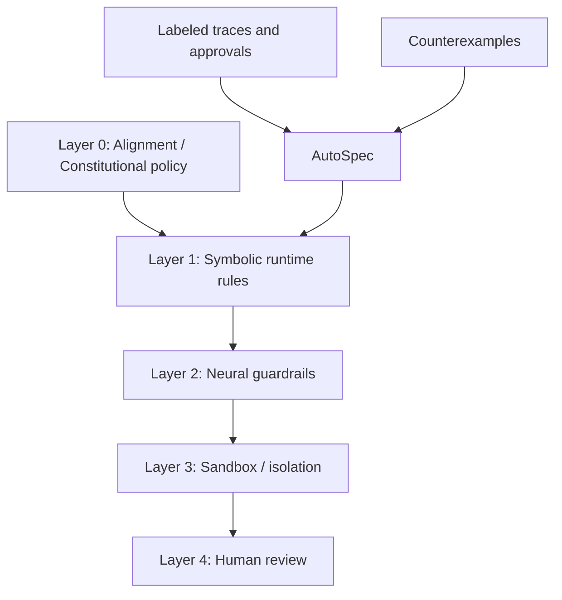
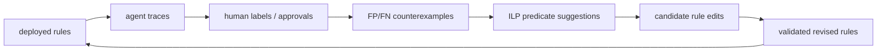

# AutoSpec：用 ILP 让 LLM Agent 的安全规则从反例中演化

## 元信息

| 项目 | 内容 |
|---|---|
| 论文 | AutoSpec: Safety Rule Evolution for LLM Agents via Inductive Logic Programming |
| 作者 | Pingchuan Ma, Zhaoyu Wang, Zimo Ji, Yuguang Zhou, Zhantong Xue, Zongjie Li, Shuai Wang, Xiaoqin Zhang |
| 版本 | arXiv:2606.24245v2 |
| 时间 | v1: 2026-06-23；v2: 2026-06-24 |
| 方向 | AI 安全 / LLM Agent 运行时安全 / 形式化规则演化 |
| 原文 | https://arxiv.org/abs/2606.24245 |

## TL;DR

- **这篇论文要解决的问题**：LLM Agent 会调用工具、读写文件、执行代码、控制机器人；人工写的安全规则可解释，但很容易在模型、工具、任务和环境变化后变脆，出现两类错误：误拦安全操作，或漏掉危险行为。
- **AutoSpec 的核心方法**：把已经部署的专家规则看成初始规则集，用带标签的执行轨迹找出 false positive 和 false negative，再用归纳逻辑编程（ILP）挑出最能区分这些反例的谓词，最后通过 CEGIS 风格循环生成、验证和接受规则编辑。
- **它不是黑盒分类器**：输出仍是可审计的符号规则，形如“某工具调用满足这些谓词时拦截，但满足例外谓词时放行”，适合放在 AgentSpec 这类运行时 enforcement 层里。
- **实验覆盖两个域**：代码执行域和具身家庭机器人域，共 291 条执行轨迹；代码执行轨迹来自安全相关操作与良性 counterpart，具身域来自 SafeAgentBench / AI2-THOR 风格任务。
- **关键数字**：AutoSpec 在代码执行域达到 Precision 0.960、Recall 1.000、F1 0.980；在具身域达到 Precision 0.925、Recall 0.942、F1 0.933。相对启发式 CEGIS，ILP 指导最高带来约 4.8 倍 F1 提升。
- **收敛情况**：代码执行域 4 轮收敛，具身域 5 轮收敛；70/30 初始任务与 incoming task 切分下，F1 泛化差距分别约 1.6 和 4.7 个百分点。
- **局限**：结果依赖谓词库质量、标签质量和两个实验域；规则仍只覆盖被谓词表达出来的安全属性，历史性和时序性约束需要更丰富的谓词或未来扩展。

## 研究问题：为什么 Agent 安全规则需要“演化”？

LLM Agent 的风险不只来自模型回答错误，而来自“回答可以变成动作”：

- 代码 Agent 可能执行 shell 命令、修改文件、上传日志。
- 数据分析 Agent 可能读取凭据、调用外部 API、拼接敏感上下文。
- 具身 Agent 可能搬动物体、靠近热源、处理易碎物品。

传统规则很适合拦截确定性危险动作：

- 拦截 `rm -rf /` 这样的破坏性命令。
- 禁止读取系统文件或凭据目录。
- 禁止机器人在危险区域附近执行某些动作。

但论文指出，真正困难在于规则会随着 Agent 环境变化而漂移：

| 变化来源 | 对规则的影响 |
|---|---|
| 模型升级 | 新模型可能用新的工具调用路径规避旧谓词 |
| 工具增加 | 新工具产生新事件类型，旧规则看不到 |
| Prompt 修改 | Agent 的任务分解方式变化，危险行为组合变多 |
| 工作负载变化 | 原本危险的模式可能在新场景下变成良性 |
| 攻击演化 | 攻击者会把单个安全动作组合成危险链条 |

因此，静态规则会同时面临两个方向的错误：

| 错误 | 含义 | 对 Agent 系统的影响 |
|---|---|---|
| False Positive | 安全轨迹被规则拦截 | 用户工作流被打断，规则被绕开或关闭 |
| False Negative | 危险轨迹没有被拦截 | 数据泄露、破坏性执行、物理世界风险 |

论文的关键判断是：

> 运行中的 Agent 会自然产生轨迹、拦截结果和人工审批信号。与其把这些反馈只当日志，不如把它们变成规则维护的训练数据。

这就是 AutoSpec 的位置：它不是重新训练 Agent，也不是用一个 LLM classifier 替换规则，而是在**保留符号规则可解释性**的前提下，让规则从反例中迭代修正。

## 论文主张与论证路线

作者的论证可以压缩成四步：

| 层次 | 主张 | 证据或机制 |
|---|---|---|
| Claim | LLM Agent 的安全 guardrail 需要持续维护 | 规则在开放环境中会产生 FP/FN，人工维护跟不上变化 |
| Mechanism | CEGIS 可以用反例驱动规则修正 | 每轮先找误判轨迹，再生成候选规则编辑 |
| Search | ILP 能从反例中挑出有用谓词 | 谓词组合空间很大，ILP 用最小符号假设缩小搜索 |
| Evidence | AutoSpec 在两个域显著提升 F1 | 291 条轨迹，F1 达到 0.980 / 0.933，优于专家规则、LLM classifier、无 ILP CEGIS 和随机搜索 |

这条路线的重点不是“ILP 比 LLM 更聪明”，而是：

- 安全 enforcement 层需要确定性。
- 审计人员需要知道哪条谓词触发了拦截。
- 工程团队需要能局部修改规则，而不是调一个黑盒分类器的 prompt。
- 反例数量通常比全量轨迹少，CEGIS + ILP 可以把问题变成局部修补。

## 方法机制：AutoSpec 如何把反例变成规则编辑？

### 输入、状态与输出

AutoSpec 的输入可以写成一个小型合成问题：

| 符号 | 含义 |
|---|---|
| `R0` | 初始专家规则集 |
| `D_L` | 带标签的 Agent 执行轨迹集合 |
| `P` | 谓词库，每个谓词判断事件或上下文的一个布尔属性 |
| `K` | 最大迭代轮数 |
| `theta` | 目标分数阈值 |
| `R*` | 迭代后得到的规则集 |

论文把目标写成：

```text
R* = argmax_R S(R)
subject to R in Edit*(R0, P)
```

变量解释：

- `Edit*(R0, P)`：从初始规则出发，通过若干次规则编辑可以到达的所有规则集。
- `S(R)`：候选规则的评分函数，论文使用 F1、Precision、未解决反例数、规则复杂度做字典序比较。
- `P`：谓词库是表达能力边界。没有谓词表达的安全属性，AutoSpec 不能凭空学出。

### 主循环

AutoSpec 的循环是 CEGIS 风格：

```text
Input:
  R0: initial expert rules
  D_L: labeled traces
  P: predicate library
  K: max iterations
  theta: target score

State:
  R <- R0

For i in 1..K:
  if S(R) >= theta:
    return R

  CE <- MineCounterexamples(R, D_L)
  if CE is empty:
    return R

  suggestions <- LearnILP(CE, D_L, P)
  candidates <- CandidateGen(R, CE, suggestions)
  best <- SelectBest(candidates, D_L)

  if S(best) > S(R):
    R <- best
  else:
    return R

Output:
  R
```

这个流程的意义在于把搜索空间逐层缩小：

1. **Counterexample mining**：不用全空间找规则，只看当前规则错在哪里。
2. **ILP predicate learning**：不用枚举全部谓词组合，只找能区分 FP/FN 的小谓词组。
3. **Candidate generation**：不用随意改 DSL，只允许几类可审计编辑。
4. **Verification**：不用相信 ILP 的建议，所有候选都在带标签轨迹上重新评分。

### 四类规则编辑

论文把规则看成 `(g, phi)`：

- `g` 是 trigger，限定规则检查什么事件，例如 PythonREPL 的 `before_action`。
- `phi` 是谓词组合，判断该事件是否危险。

表格化理解四类操作：

| 编辑 | 作用 | 适合修什么错误 | 直观解释 |
|---|---|---|---|
| AddConjunct | 给规则增加一个必须满足的谓词 | False Positive | 让规则更窄，减少误拦 |
| AddException | 增加例外条件 | False Positive | 命中危险模式但满足安全例外则放行 |
| AddDisjunct | 新增一条规则分支 | False Negative | 让规则更宽，捕捉遗漏危险 |
| Relax | 删除某个限制谓词 | False Negative | 放松过窄规则，提高召回 |

一个简化例子：

```text
初始规则:
  r0(e) = destructive_os_inst(e)

误拦安全临时文件删除后:
  r1(e) = destructive_os_inst(e) AND NOT is_temp_file(e)

又发现 shutil.rmtree 漏拦后:
  r2(e) = r1(e) OR uses_shutil_rmtree(e)
```

这里的关键不是公式复杂，而是每次变化都能被审计：

- 哪条轨迹触发了修正？
- 哪个谓词被加入或删除？
- 精确率和召回率如何变化？
- 新规则有没有增加未解决反例？

## ILP 的角色：不是直接写规则，而是挑谓词

### 为什么不用普通启发式？

假设一个代码执行域有 20 个谓词，每次编辑可以选择不同谓词和不同操作：

- 单步编辑已经有几十种候选。
- 多步编辑会指数增长。
- 不同谓词之间还有组合关系，例如“读凭据 + 外部主机”才危险。

如果只用覆盖率排序，系统可能选到“看起来常见但不真正区分错误”的谓词。论文实验中，无 ILP 的启发式 CEGIS 在代码执行域 held-out F1 只有 0.480；在 RQ2 的 in-sample 轨迹上也只有 0.203。

### ILP 学什么？

AutoSpec 把当前反例转成 ILP 学习任务：

| 数据角色 | 在 ILP 中的含义 |
|---|---|
| False Negative | 正例：危险但没被拦，应该找到覆盖它们的谓词 |
| False Positive | 负例：安全但被误拦，应该避免覆盖它们 |
| `holds(trace, event, predicate)` | 某谓词是否在某条轨迹的某事件上成立 |

ILP 输出一个简洁假设：

```text
H = (p11 AND p12 AND ...)
    OR
    (p21 AND p22 AND ...)
    OR ...
```

这不是最终规则，而是建议：“这些谓词组合最能解释当前错例。”

### 从 ILP 假设到规则修正

AutoSpec 再根据错误方向选择编辑：

| 错误方向 | ILP 发现的谓词如何用 |
|---|---|
| FN：危险没拦住 | 用 AddDisjunct 或 Relax 扩大覆盖 |
| FP：安全被误拦 | 用 AddConjunct 或 AddException 收紧覆盖 |

论文里的 running example 是网络安全规则：

```text
r0(e) = net_call(e)

Iteration 1:
  发现很多 package-manager 脚本被误拦
  学到 is_pkg_mgr 可以区分它们
  r1(e) = net_call(e) AND NOT is_pkg_mgr(e)

Iteration 2:
  发现一个 credential exfiltration 通过 subprocess 漏拦
  学到 rd_cred AND ext_host
  r2(e) = r1(e) OR (rd_cred(e) AND ext_host(e))
```

这个例子说明两点：

- 安全规则不是越严越好；过严会把正常运维、依赖安装、脚本执行全部拦掉。
- 安全规则也不是单动作判断；读凭据本身、访问网络本身都可能是合法的，组合起来才可能构成泄露。

## 实验设置：两个域、四类 baseline、三组问题

### 研究问题

论文围绕三个问题评估：

| RQ | 问题 | 对应证据 |
|---|---|---|
| RQ1 | AutoSpec 能否提升规则效果？ | 与专家规则、LLM classifier、无 ILP CEGIS、随机搜索比较 |
| RQ2 | ILP 是否真的提高搜索效率？ | 收敛曲线、候选数、运行时间、启发式对比 |
| RQ3 | 学到的规则是否可迁移、可理解？ | incoming task 泛化与 10 名实践者用户研究 |

### 数据集

论文使用两个安全域，共 291 条轨迹：

| 域 | 规模 | 任务类型 | 风险类型 |
|---|---:|---|---|
| 代码执行 | 191 条轨迹 | shell / Python / 文件与网络相关执行 | 破坏性命令、系统文件、外部请求、敏感 I/O |
| 具身 Agent | 100 条轨迹 | AI2-THOR 风格家庭机器人任务 | 靠近危险区域、粗暴处理易碎物、液体靠近电子设备、碰撞风险 |

代码执行域的轨迹很短，论文给出的范围是 1 到 9 个事件，平均约 1.4 个事件。具身域更强调状态与动作上下文，机器人可使用 16 种 primitive action，例如寻找、拾取、切割等。

### 谓词库示例

| 域 | 示例谓词 |
|---|---|
| Code | `destructive_os_inst`, `involve_system_file`, `high_risk_syscall`, `execute_script`, `write_to_io`, `submit_post_request` |
| Embodied | `near_danger_zone`, `handling_fragile_object`, `carrying_liquid`, `source_is_heat` |

这些谓词是 AutoSpec 的“感知器官”。如果一个安全问题不能被谓词表达，ILP 再强也只能返回“不知道怎么修”。

### Baseline

| Baseline | 含义 | 为什么重要 |
|---|---|---|
| B1 Expert Rule | 人工写的 AgentSpec 安全规则 | AutoSpec 的起点，也是现实部署常见方式 |
| B2 LLM Classifier | 用少量示例让 LLM 判断轨迹安全/危险 | 代表“用神经分类器替代规则”的路线 |
| B3 CEGIS w/o ILP | 去掉 ILP，只用启发式谓词排序 | 验证 ILP 是否真有价值 |
| B4 Random Search | 随机采样规则编辑 | 验证搜索空间是否能靠运气解决 |

## 主结果：F1 提升来自同时修 FP 和 FN

### RQ1 效果对比

| 方法 | Code Precision | Code Recall | Code F1 | Code FP/FN | Embodied Precision | Embodied Recall | Embodied F1 | Embodied FP/FN |
|---|---:|---:|---:|---:|---:|---:|---:|---:|
| Expert Rule | 0.544 | 0.974 | 0.698 | 31/1 | 1.000 | 0.327 | 0.493 | 0/35 |
| LLM Classifier | 1.000 | 0.684 | 0.813 | 0/12 | 0.842 | 0.923 | 0.881 | 9/4 |
| CEGIS w/o ILP | 1.000 | 0.316 | 0.480 | 0/26 | 1.000 | 0.500 | 0.667 | 0/26 |
| Random Search | 0.536 | 0.974 | 0.692 | 32/1 | 1.000 | 0.327 | 0.493 | 0/35 |
| AutoSpec | 0.960 | 1.000 | 0.980 | 2/0 | 0.925 | 0.942 | 0.933 | 4/3 |

这张表最重要的不是 AutoSpec 分数最高，而是不同方法的错误模式：

- **专家规则在代码域过宽**：Recall 0.974，但 Precision 只有 0.544，产生 31 个 FP。
- **专家规则在具身域过窄**：Precision 1.000，但 Recall 只有 0.327，漏掉 35 个危险案例。
- **LLM classifier 比静态规则灵活**，但仍有不可忽略的漏拦或误拦，而且输出边界难审计。
- **无 ILP CEGIS 极度保守**：Precision 高，但 Recall 很低，说明仅凭启发式覆盖很难找到真正能补漏的谓词组合。
- **AutoSpec 同时平衡两端**：代码域只剩 2 个 FP、0 个 FN；具身域为 4 个 FP、3 个 FN。

### 为什么这不是简单过拟合？

论文特别说明了协议差异：

- RQ1 中，方法在 seed split 上演化，然后在 disjoint held-out split 上评估。
- 算法保证的是 seed 分数单调改进，不保证 held-out 一定单调。
- 因此无 ILP CEGIS 在 held-out 上低于专家规则，是一种泛化失败，而不是算法逻辑矛盾。

这点很关键，因为它防止读者误读：

> 规则编辑越多不一定越好。没有好的谓词选择，CEGIS 也可能把规则修到 seed 上看似合理，但在新任务上更差。

## 搜索效率：ILP 贵一点，但质量差距很大

### 收敛轨迹

论文给出两个域的收敛情况：

| 域 | 起点 | 收敛轮数 | 最终结果 |
|---|---:|---:|---|
| Code | RQ2 中从弱 seed 近似 F1 0 开始 | 4 轮 | F1 0.980 |
| Embodied | 从专家 guardrail F1 0.493 开始 | 5 轮 | F1 0.933 |

具身域的曲线更慢：

```text
0.493 -> 0.771 -> 0.835 -> 0.870 -> 0.885 -> 0.933
```

这反映了两个事实：

- 具身安全更依赖上下文和状态，单个谓词不容易一次解释大多数反例。
- 迭代上限会影响最终质量；论文中具身域在第 5 轮仍有提升，说明更长预算可能继续改进。

### ILP 与启发式比较

| 方法 | Code Iterations | Code F1 | Code Candidates | Code Time | Embodied Iterations | Embodied F1 | Embodied Candidates | Embodied Time |
|---|---:|---:|---:|---:|---:|---:|---:|---:|
| Heuristic | 2 | 0.203 | 197 | 4.4s | 4 | 0.758 | 372 | 4.3s |
| ILP | 4 | 0.980 | 319 | 20.1s | 5 | 0.933 | 600 | 11.8s |

这组结果支持一个工程判断：

- ILP 的时间成本更高。
- 但这一步可以异步离线运行，不在用户请求路径上。
- 对运行时安全规则来说，20 秒级后台规则维护成本通常可以接受。
- 如果没有 ILP，规则质量不足以部署，节省的时间没有意义。

## 消融：哪些组件最关键？

代码执行域消融结果：

| 变体 | F1 | Iterations | Candidates |
|---|---:|---:|---:|
| AutoSpec Full | 0.98 | 4 | 319 |
| 去掉 ILP guidance | 0.20 | 2 | 197 |
| 去掉 failure-driven branches | 0.97 | 6 | 677 |
| 去掉 multi-step edits | 0.72 | 10 | 300 |

三条结论：

1. **ILP 是核心组件**：去掉后 F1 从 0.98 掉到 0.20，说明谓词选择不是可有可无的优化。
2. **multi-step edits 处理组合风险**：只允许单步编辑会把 F1 降到 0.72，并让迭代数升到 10。
3. **failure-driven branches 更像效率组件**：去掉后 F1 仍有 0.97，但候选数从 319 增到 677，迭代数从 4 增到 6。

这也解释了 AutoSpec 的设计分工：

- ILP 决定“看哪些谓词”。
- 多步编辑决定“怎么组合修补”。
- failure-driven branch 决定“漏拦危险如何快速补分支”。

## 泛化与可用性：规则是否能给人看？

### Incoming task 泛化

论文用 70/30 split 模拟未来工作负载：

| 域 | 初始任务 F1 | Incoming task F1 | 差距 |
|---|---:|---:|---:|
| Code | 0.973 | 0.957 | 1.6 个百分点 |
| Embodied | 0.889 | 0.842 | 4.7 个百分点 |

这说明学到的不是完全记忆训练轨迹，而是部分捕获了跨任务安全模式。不过，具身域差距更大，也提示：

- 物理环境状态更复杂。
- 谓词库可能没覆盖足够多状态变量。
- incoming task 的物体、位置和动作组合更容易产生新型边界案例。

### 人类可解释性研究

用户研究包含 10 名有一年以上 ML 系统开发或部署经验的实践者，比较 AutoSpec 规则与 LLM classifier 决策解释。

| 维度 | AutoSpec | LLM classifier | 含义 |
|---|---:|---:|---|
| Interpretability | 4.97 | 3.45 | 能否看懂为什么拦截 |
| Actionability | 4.83 | 2.73 | 能否明确知道怎么修改 |
| Trust | 4.80 | 2.77 | 是否敢放进生产 |

参与者在 120 次 pairwise comparison 中有 101 次偏好 AutoSpec，约 84.2%。这部分证据对 Agent 安全特别重要：

- 审计不是只要一个“unsafe”标签。
- 安全团队需要定位触发谓词。
- 工程团队需要知道新增例外是否会打开新漏洞。
- 事故复盘需要规则版本和反例链条可追溯。

## 与 Agent 安全栈的关系

论文没有把 AutoSpec 包装成单层万能防线，而是放在 defense-in-depth 中：



这种定位很合理：

- Alignment 约束模型倾向，但不能证明每次工具调用安全。
- Neural guardrail 能理解语义，但边界难审计。
- Sandbox 限制最坏后果，但不能判断任务层意图。
- Human review 成本高，不能覆盖所有动作。
- Symbolic rules 便宜、确定、可审计，但需要持续维护。

AutoSpec 的价值就在于维护 Layer 1：

- 用运行时轨迹发现规则漂移。
- 用 ILP 把反例压缩成谓词建议。
- 用候选验证避免盲目接受学习结果。
- 保留规则 DSL 的确定性和审计性。

## 关键边界与威胁

### 谓词库是能力上限

AutoSpec 的所有学习都发生在谓词库上：

```text
predicate: event/context -> true/false
rule: predicate composition -> allow/block
```

因此，如果系统缺少“读凭据后外发”这样的跨事件谓词，它可能只能看到“读凭据”和“网络请求”两个局部事实。论文承认，历史性、状态性和时序性属性需要编码进谓词，或在未来引入 LTL 等更原生的时序约束。

### 标签质量决定修正方向

AutoSpec 把人工安全/不安全标注当成 ground truth。如果标签偏了：

- FP/FN 的方向会反。
- ILP 会学习错误谓词。
- 规则会被系统性修坏。

这在真实生产中很关键。审批日志不是天然高质量数据，可能受值班人员经验、任务压力和策略变更影响。

### 两个实验域还不等于全部 Agent 场景

论文覆盖代码执行与具身任务，已经比只做 toy shell 命令强，但仍有外推限制：

- 浏览器 Agent 的 DOM 与授权上下文更复杂。
- 多 Agent 协作中的责任归因更难。
- 长期记忆和 RAG 的污染不是单次工具调用可完全表达。
- 企业 SaaS Agent 的权限边界通常依赖组织、角色和数据分级。

### 规则优化可能和可用性目标冲突

F1 是必要指标，但不是唯一部署目标：

- 某些高危行为需要极高 recall，即使牺牲 precision。
- 某些高频内部工作流需要低 FP，否则用户会绕开系统。
- 不同组织对数据泄露、破坏性命令、机器人安全的代价函数不同。

AutoSpec 的评分函数目前是通用分类指标加复杂度约束。真实系统可能需要引入风险加权：

```text
Score(R) =
  w_recall_high_risk * Recall(high_risk)
  + w_precision_workflow * Precision(common_workflow)
  - w_complexity * RuleComplexity
  - w_unresolved * UnresolvedCounterexamples
```

这不是论文失败点，而是从研究原型走向策略系统时必须补上的策略层。

## 相关工作位置判断

AutoSpec 位于几个方向的交叉处：

| 方向 | 代表问题 | AutoSpec 的区别 |
|---|---|---|
| LLM Agent runtime enforcement | 如何在工具调用前后拦截危险动作 | 不只执行固定规则，而是演化规则 |
| Neural guardrails | 如何用模型判断是否安全 | 输出不是黑盒分数，而是符号规则 |
| CEGIS | 如何用反例驱动程序/规则合成 | 结合 ILP 缩小谓词搜索空间 |
| ILP | 如何从逻辑事实中学习规则 | 不直接替换 guardrail，而是提出编辑建议 |
| AgentSpec / formal methods | 如何表达可执行安全约束 | 在既有 DSL 上做增量修补 |

我认为论文的最大贡献不是提出了某个新谓词，而是把 Agent 安全维护重构成一个可循环的工程流程：



这比“每次事故后人工加 if 条件”更系统，也比“训练一个安全分类器”更可审计。

## 研究者视角的继续追问

### 1. 如何把策略代价显式放进搜索？

目前 AutoSpec 的评分以 F1 和 Precision 为主。Agent 安全中，不同错误的成本差距很大：

- 漏掉凭据外传比误拦一次依赖安装严重得多。
- 机器人靠近热源比误报一个普通抓取任务严重得多。
- 企业内敏感数据泄露可能需要按数据级别加权。

后续可以把评分函数扩展为风险敏感目标，而不是单一 trace-level F1。

### 2. 谓词库如何自动扩展？

论文提到未解决反例能提示“需要新谓词”。这很有价值，但还没有完全自动化：

- 哪些 unresolved counterexample 暗示同一个缺失概念？
- 新谓词由谁写？LLM 能否提出候选谓词实现？
- 谓词实现本身如何测试和审计？

一个自然延伸是“AutoSpec for predicate authoring”：让系统不仅编辑规则，还建议新的可测试谓词。

### 3. 能否处理跨轨迹、跨会话、长期记忆风险？

许多 Agent 安全问题不是单条 trace 内发生：

- 攻击者今天写入记忆，几天后诱导 Agent 使用。
- 一个 Agent 收集信息，另一个 Agent 外发。
- 多次看似普通的工具调用累计形成权限提升。

AutoSpec 可以通过状态谓词表达部分历史，但这会把复杂性推给谓词工程。未来如果结合时序逻辑、信息流标签或 provenance graph，可能更适合长期 Agent 系统。

### 4. ILP 与 LLM 能否协作？

论文把 LLM classifier 作为 baseline，但 LLM 也可以在别的位置帮忙：

- 从自然语言安全策略生成初始谓词候选。
- 给 unresolved counterexample 聚类命名。
- 解释 ILP 发现的谓词组合给审计人员。
- 生成新的红队轨迹补充训练集。

关键是 LLM 不应替代最终 enforcement 边界，而应服务于可审计规则的生成、解释和测试。

## 结论

AutoSpec 把 LLM Agent 安全中的一个现实痛点讲清楚了：**规则不是一次写完的安全资产，而是需要随 Agent 环境持续演化的运行时程序**。

它的技术路线有三个值得保留的判断：

1. **保留符号规则**：安全 enforcement 层需要确定性、低延迟和可审计性。
2. **用反例驱动维护**：真实 Agent 的 FP/FN 是最有价值的规则修补信号。
3. **用 ILP 缩小搜索**：在谓词组合空间里，启发式覆盖远远不够，最小逻辑假设能更好地找到可泛化编辑。

从实验看，AutoSpec 在 291 条轨迹、两个 Agent 安全域上显著提升了 F1，并在收敛、泛化、可解释性用户研究上给出了比较完整的证据。但它仍依赖谓词库、标签质量和有限实验域。对研究者来说，下一步不是简单把它包装成“自动安全”，而是把它接入更现实的策略代价、谓词生成、长期记忆和多 Agent provenance 中，形成能被安全团队持续审计的 Agent 运行时治理循环。
