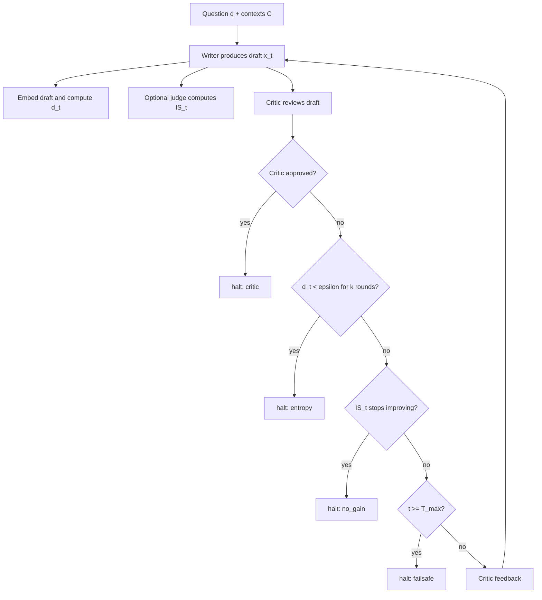

### 元信息与 TL;DR

| 字段 | 内容 |
|---|---|
| 原文 | [Semantic Early-Stopping for Iterative LLM Agent Loops](https://arxiv.org/abs/2606.27009) |
| 版本 | arXiv:2606.27009v1，2026-06-25 13:24:21 UTC 提交 |
| PDF | [arXiv PDF](https://arxiv.org/pdf/2606.27009) |
| 代码 | [SahilShrivastava-Dev/semantic-halting-problem](https://github.com/SahilShrivastava-Dev/semantic-halting-problem) |
| 作者 | Sahil Shrivastava |
| 方向 | 大模型 Agent；多 Agent 循环；语义早停；RAG 评测；token 成本控制 |

**TL;DR：**

- 这篇论文研究一个很常见但经常被工程默认值掩盖的问题：Writer -> Critic 这类迭代式 LLM Agent loop 到底应该什么时候停？多数系统只用 `max_iterations`，它只看轮数，不看答案是否还在变化。
- 作者提出 **SHP / Semantic Halting Problem**：把每一轮草稿 `x_t` 映射到本地 embedding，计算相邻草稿的余弦距离 `d_t`；当语义距离在 patience window 内持续低于阈值，并且质量分数不再提升时，可以停止循环。
- 论文最重要的贡献不是“证明 LLM loop 是收敛映射”。相反，作者明确撤回了早期的 Banach contraction 说法，只保留可证明的确定性终止、良定义性、halt-priority consistency，并把语义距离趋降降级为经验猜想。
- 实验设计有一个关键优点：每个问题只生成一次完整 Writer -> Critic trajectory，然后把所有 stopping policy 回放到相同草稿上；LLM judge 调用也缓存。因此不同策略看到完全相同的候选答案，比较的是停止规则，而不是采样噪声。
- HotpotQA 测试 split 只有 60 个问题，但结果很有信息量：judge-free `entropy_only` 相比 `fixed_k6` 节省 **38% operational tokens**，质量变化 `Delta IS = -0.004`，`p = 0.81`，没有可检测质量损失。
- 反直觉点在于：完整 quality-gated `shp` 因每轮都要调用 judge，token 成本反而比 `fixed_k6` 高 **129%**，质量同样没有提升。这说明“更聪明的停止器”如果把评测成本算进运行成本，可能比固定轮数更贵。
- 最值得继续研究的是 oracle gap：`oracle_is` 用平均 2.73 轮达到 `+0.115` Information Score，`p ~= 4e-11`，远高于所有实际策略。论文把问题从“何时停止”推进到“如何在线识别哪一轮最好”。
- 局限很清楚：评测依赖 LLM judge；HotpotQA 答案短，很多问题第一轮 grounded draft 已足够；N=60 使 TOST 非劣检验置信区间偏宽；结论不能直接外推到长文写作、代码修复、工具调用规划或高风险执行型 Agent。

### 研究问题：为什么 `max_iterations` 是一个语法开关？

迭代式 Agent 的典型形态是：

```text
Question + Context -> Writer -> Draft
Draft -> Critic -> Feedback
Feedback -> Writer -> Revised Draft
repeat until stop
```

工程系统通常这样停：

```text
for t in 1..max_iterations:
    draft = writer(...)
    feedback = critic(...)
return last_draft
```

这个规则的问题不在于简单，而在于它完全不看语义：

| 场景 | 固定轮数的错误 | 语义早停想捕捉的信号 |
|---|---|---|
| 简单问题 | 第 1-2 轮已经答完，但继续花 token | 草稿间语义距离快速趋近 0 |
| 困难问题 | 轮数到上限就截断，可能错过后续改进 | 质量仍在提升，不应因计数器停止 |
| 循环空转 | 第 4-6 轮只是换说法 | 相邻 embedding 距离持续低于阈值 |
| judge 成本过高 | 每轮评测可能比省下的生成更贵 | 区分运行 token 和评测 token |

论文关心的是一个更窄的问题：

- 固定 topology：主要讨论 Writer -> Critic 顺序循环；
- 固定任务：多跳 RAG 问答 HotpotQA；
- 固定候选轨迹：先生成完整轨迹，再回放停止策略；
- 固定度量：Information Score 由 RAGAS-style 指标组合而成。

这使结论更可检验：

- 它不是泛泛宣称“Agent 会收敛”；
- 它也不是提出一个万能 planner；
- 它是在一个受控 harness 中衡量停止规则的成本和质量。

### 方法机制：SHP 的两个信号和四级 halt cascade

#### 1. 语义距离信号

论文定义场景：

```text
scenario = (q, C, g)
q: question
C: retrieved context passages
g: ground-truth answer
```

每轮 Writer 产生草稿：

```text
x_1, x_2, ..., x_t
```

冻结的 embedding map：

```text
phi(x_t) = e_t in R^384
```

相邻草稿的语义距离：

```text
d_t = 1 - cos(e_t, e_{t-1})
    = 1 - <e_t, e_{t-1}> / (||e_t|| * ||e_{t-1}||)
```

变量含义：

| 变量 | 含义 | 论文中的作用 |
|---|---|---|
| `x_t` | 第 `t` 轮草稿 | 被 Writer 生成，被 Critic 审阅 |
| `e_t` | 草稿 embedding | 本地模型产生，不消耗 API judge token |
| `d_t` | 相邻草稿语义距离 | 越小表示新草稿和旧草稿越接近 |
| `epsilon` | 语义收敛阈值 | 实验里使用 `0.06` |
| `k` | patience window | 避免一次偶然低距离触发停止 |

直观判断是：

```text
if d_t < epsilon for k consecutive rounds:
    answer has semantically converged
```

但作者没有把这写成定理。

他们只把它作为经验猜想：

- 平均距离是否下降，要在轨迹上测；
- 单条轨迹未必单调；
- 即使语义距离下降，也不保证质量上升；
- 因此必须保留 failsafe，而不是把收敛当安全保证。

#### 2. Information Score 质量信号

论文把 RAG 质量指标组合成 Information Score：

```text
IS_t = sum_{m in M} w_m * metric_m(x_t)
```

其中：

| 符号 | 含义 |
|---|---|
| `M` | RAGAS-style metric 集合 |
| `metric_m(x_t)` | 第 `m` 个指标对草稿 `x_t` 的分数 |
| `w_m` | 指标权重，满足 `w_m >= 0` 且 `sum w_m = 1` |
| `IS_t` | 第 `t` 轮草稿的综合质量分数，范围 `[0,1]` |

重要细节是：

- `IS_t` 由 judge 产生；
- judge 调用有 token 成本；
- 如果在线策略每轮都算 `IS_t`，它必须为这些评测 token 付费；
- 论文因此把 operational tokens 和 evaluation tokens 分开记账。

这个拆分很关键：

| 成本类型 | 谁承担 | 是否应算入线上策略成本 |
|---|---|---|
| Writer / Critic 生成 | 实际 Agent loop | 是 |
| 在线每轮 judge | 如果策略运行时需要质量门控 | 是 |
| 离线评测 judge | 研究者衡量策略好坏 | 否，属于测量仪器 |

#### 3. 四级 halt cascade

论文的停止规则按优先级检查：

| 优先级 | 信号 | 停止原因 | 解释 |
|---:|---|---|---|
| 1 | Critic approval | `critic` | Critic 明确批准 |
| 2 | Semantic convergence | `entropy` | `d_t < epsilon` 持续 `k` 轮 |
| 3 | No information gain | `no_gain` | `IS_t` 不再上升 |
| 4 | Hard cap | `failsafe` | 到达 `T_max`，无条件停止 |

可以写成伪代码：

```text
Input:
  question q
  contexts C
  max rounds T_max
  threshold epsilon
  patience k

State:
  previous embedding e_prev
  distance history D
  score history S
  feedback from Critic

for t in 1..T_max:
    x_t = Writer(q, C, feedback)
    e_t = Embed(x_t)
    d_t = 1 - cosine(e_t, e_prev)        if t > 1
    IS_t = Judge(x_t, q, C)              if quality gate is enabled

    if Critic says APPROVED:
        return x_t, reason = critic

    if last k distances are below epsilon:
        return x_t, reason = entropy

    if quality gate enabled and IS_t <= previous best:
        return x_t, reason = no_gain

    feedback = Critic(q, C, x_t)
    e_prev = e_t

return x_Tmax, reason = failsafe
```

Mermaid 表达如下：



### 理论部分：作者证明了什么，又没有证明什么？

这篇论文最值得肯定的地方，是它没有用漂亮但站不住脚的数学包装工程直觉。

作者明确说：

- 早期版本曾声称 Writer -> Critic 更新是 Banach contraction；
- 这个说法不成立，因为 LLM 生成没有已证明的 Lipschitz constant `< 1`；
- API 调用也不保证严格确定性；
- 因此不能推出唯一固定点或全局语义收敛。

保留下来的理论声明更朴素：

| 声明 | 是否证明 | 依赖 |
|---|---|---|
| Deterministic termination | 证明并 machine-check | 无条件 failsafe |
| Well-definedness | 证明并 machine-check | embedding、距离、权重、IS 都有定义域 |
| Halt-priority consistency | 证明并 machine-check | 一个共享 halt cascade，避免实现漂移 |
| Semantic non-expansiveness | 未证明，只做经验检验 | 观察 `d_t` 是否平均下降 |

这对 Agent 研究有两个启发：

- **安全性质和经验性质要分开**：能保证的是“总会停”，不能保证的是“会停在语义最优处”。
- **形式化证明不能替代评测**：即使停止算子良定义，质量是否保持仍要看 benchmark 和 judge。

换句话说：

```text
Theorem:
  loop halts by T_max

Not theorem:
  loop converges to best answer
  cosine distance monotonically decreases in every trajectory
  quality improves with more rounds
```

### 实验协议：为什么 trajectory replay 很关键？

如果直接让每个 stopping policy 单独运行 Agent，比较会混入大量噪声：

- Writer 采样不同；
- Critic 反馈不同；
- 检索上下文可能不同；
- judge 调用次数不同；
- API 波动影响成本和质量。

论文采用更公平的 protocol：

| 步骤 | 做法 | 作用 |
|---|---|---|
| 1 | 每个问题先生成完整 trajectory 到 `T_max` | 所有策略共享同一批草稿 |
| 2 | 对每个 stopping policy 回放同一 trajectory | 比较停止规则，而不是比较采样 |
| 3 | judge 结果缓存 | 每个草稿最多评测一次 |
| 4 | operational / evaluation token 分离 | 避免把研究测量成本误算为线上成本 |
| 5 | paired statistics | 同一问题上比较不同策略，降低方差 |

数据与模型设置：

| 项 | 设置 |
|---|---|
| 数据 | HotpotQA multi-hop RAG |
| split | dev 20，test 60，合计约 80 个场景 |
| Writer / Critic | 8B instruction model |
| Judge | RAGAS-style quality judge |
| embedding | 本地 sentence embedding，README 指向 `BAAI/bge-small-en-v1.5` |
| baselines | `fixed_k1`、`fixed_k3`、`fixed_k6`、`critic_only`、`random_stop`、`oracle_is` |
| 统计 | paired t-test、Wilcoxon、Cohen's d、TOST non-inferiority、Holm correction、bootstrap CI |

`fixed_k6` 是主要 baseline：

```text
fixed_k6 = max_iterations baseline
```

因此所有 token saving 和 `Delta IS` 都相对它解释。

### 结果一：开发集已经暴露了 full SHP 的成本陷阱

论文 Table II 给出 development split 结果。

| Policy | 平均轮数 | operational tokens | 相对 fixed_k6 | Final IS |
|---|---:|---:|---:|---:|
| `fixed_k6` | 6.0 | 11,281 | baseline | 0.651 |
| `entropy_only` | 4.05 | 7,068 | -37% | 0.661 |
| `fixed_k3` | 3.0 | 5,217 | -54% | 0.629 |
| `fixed_k1` | 1.0 | 1,548 | -86% | 0.661 |
| `shp` full | 2.95 | 25,670 | +128% | 0.651 |
| `oracle_is` | 3.1 | 33,007 | +193% | 0.782 |

这个表的读法不是“full SHP 轮数少，所以更便宜”。

相反：

- full SHP 平均只跑 2.95 轮；
- 但每轮要调用 judge；
- judge 成本超过省下的 Writer / Critic 成本；
- 因此总 operational tokens 是 baseline 的 2.28 倍。

这给 Agent 系统设计一个现实约束：

```text
如果 early stopping 的判定器本身很贵，
它省下的循环成本可能被判定成本吃掉。
```

### 结果二：测试集确认 judge-free 语义早停省钱但不显著伤质

论文 Table III 是测试集 `N = 60` 的 realized results。

| Policy | 平均轮数 | Tokens vs baseline | Delta IS | p 值 | 非劣结论 |
|---|---:|---:|---:|---:|---|
| `fixed_k6` | 6.0 | baseline | baseline | - | - |
| `entropy_only` | 3.92 | -38% | -0.004 | 0.81 | 未形式认证，但点估计近似持平 |
| `critic_only` | 6.0 | 0% | 0.000 | - | - |
| `fixed_k3` | 3.0 | -53% | +0.001 | 0.97 | 未形式认证，但点估计近似持平 |
| `fixed_k1` | 1.0 | -86% | +0.030 | 0.17 | yes |
| `shp` full | 2.40 | +129% | -0.004 | 0.78 | no |
| `oracle_is` | 2.73 | +170% | +0.115 | 3e-11 | yes |

关键结论有三层：

1. **效率结论成立**：
   - `entropy_only` 省 38% operational tokens；
   - 质量点估计只低 `0.004`；
   - `p = 0.81` 表示没有检测到质量差异。

2. **full SHP 反而失败**：
   - 不是因为停止太晚；
   - 也不是因为质量太差；
   - 而是因为每轮质量 judge 太贵。

3. **最优轮次仍未解决**：
   - `oracle_is` 证明每个问题常有更好的轮次；
   - 但这个 oracle 是离线知道所有轮次分数后选的；
   - 线上策略还不知道如何无代价找到它。

可以把论文的核心结论压缩成：

```text
when-to-stop for efficiency: mostly solved here
which-round-is-best for quality: still open
```

### 结果二补充：`fixed_k1` 为什么会反直觉地赢？

Table III 里最容易被误读的数字是 `fixed_k1`。

它的结果是：

| 指标 | 数值 |
|---|---:|
| 平均轮数 | 1.0 |
| token saving | -86% |
| Delta IS | +0.030 |
| p 值 | 0.17 |
| TOST 非劣 | yes |

表面看，这像是在说：

```text
Critic loop 没用，第一轮最好。
```

但更谨慎的解读应是：

- HotpotQA 多跳问答的答案通常较短；
- Writer 和 Critic 都拿到了 retrieved contexts；
- 第一轮 grounded draft 已经能覆盖很多答案；
- 后续 Critic revision 可能改写措辞，却不增加事实；
- RAGAS-style judge 对短答案的微小措辞变化很敏感；
- 60 题规模不足以证明所有任务都“一轮最好”。

换句话说，`fixed_k1` 赢不是 Agent loop 的普遍死亡判决。

它更像一个诊断信号：

```text
如果 benchmark 里的任务不需要渐进式构造答案，
那么循环机制很可能只是在制造额外成本和 judge 噪声。
```

这对后续实验设计有直接要求：

| 想验证的能力 | 更合适的任务 |
|---|---|
| 多轮 Critic 是否能积累结构 | 长文写作、技术方案、论文审稿 |
| 多轮修订是否能修 bug | 代码修复、单测驱动 patch、静态分析 |
| 多轮工具使用是否能减少风险 | sandbox 执行、权限审批、外部状态检查 |
| 语义早停是否保留关键事实 | 多证据综述、带引用的问答、事实核验 |
| oracle gap 能否被逼近 | 有人工标注最佳轮次或 verifier 的轨迹数据 |

因此，本文的 `fixed_k1` 结果应该推动研究者重新审视 benchmark，而不是简单否定多轮 Agent。

### 评估设计细读：为什么“公平比较”比方法本身更有价值？

很多 Agent 论文会把不同策略各跑一遍，然后比较最终分数。

这种做法的问题是：

- 策略 A 和策略 B 看到的草稿不同；
- 某个策略可能刚好采样到更好答案；
- judge 调用次数不同，导致成本口径不一致；
- 失败重试、API 延迟、缓存命中都会污染结果。

SHP 的 replay 设计把这些因素压到最小：

```text
for each question:
    generate full trajectory once
    evaluate every draft once
    for each stopping policy:
        replay the same drafts
        choose the draft this policy would have returned
```

这个设计让每个策略面对同一条候选序列。

因此比较更像：

```text
given identical evidence,
which stopping rule chooses the best cost-quality point?
```

而不是：

```text
which independent run got luckier?
```

这比单个早停规则更可迁移。

未来评测其他 Agent loop 时，也可以复用这个 protocol：

| 任务类型 | 可回放对象 | 策略比较点 |
|---|---|---|
| 代码修复 | 每轮 patch、测试结果、错误日志 | 哪轮提交最小且通过测试 |
| Web agent | 每步 DOM、action、observation | 何时停止探索或提交 |
| 工具调用 QA | tool calls、retrieved docs、answer drafts | 何时停止检索 |
| 安全审计 | finding drafts、PoC 状态、证据链 | 何时停止扩展攻击路径 |
| 长文写作 | outline、draft、revision diff | 何时不再继续修订 |

这里的关键思想是：

- 先把轨迹作为研究对象；
- 再比较策略如何消费轨迹；
- 最后再讨论在线近似能否复现离线 oracle。

### 成本模型细读：为什么 operational tokens 要单独报？

论文区分两类 token，是为了防止一个常见错觉：

```text
策略少跑了几轮，所以一定更省。
```

这个推理漏掉了 stopping policy 自身的成本。

一个停止器可能包含：

- embedding 模型；
- LLM judge；
- verifier；
- retrieval coverage checker；
- static analyzer；
- unit tests；
- human approval。

其中本地 embedding 很便宜，但 LLM judge、外部 verifier 或人工审批都可能很贵。

因此更完整的成本表达是：

```text
Cost(policy)
  = Cost(writer_calls)
  + Cost(critic_calls)
  + Cost(online_judge_calls)
  + Cost(tool_verifiers)
  + Cost(latency_wait)
```

SHP 的失败项正好来自第三项：

| 策略 | 少跑 Writer/Critic | 多花在线 judge | 总成本 |
|---|---|---|---|
| `entropy_only` | 是 | 否 | 降低 |
| `shp` full | 是 | 是，每轮 | 上升 |
| `oracle_is` | 离线最优 | 需要看全轨迹 | 不可部署且昂贵 |

这对生产 Agent 的意义很直接：

- 如果任务每轮 Writer/Critic 很贵，而 verifier 很便宜，早停收益大；
- 如果任务每轮生成便宜，而 judge 很贵，早停可能反噬；
- 如果 verifier 是真实测试套件，成本还包括 wall-clock latency；
- 如果 verifier 是人类审批，成本不应只用 token 衡量。

### 方法边界再拆解：语义相似和任务成功之间隔着什么？

SHP 用的是相邻草稿 embedding 距离。

这个信号捕捉的是：

- 主题是否还在变化；
- 表述是否大幅改写；
- 答案结构是否趋稳；
- Critic 是否只在做小修小补。

但 Agent 成功往往还包括外部状态。

可以把风险拆成三层：

| 层级 | 语义距离能否捕捉 | 例子 |
|---|---|---|
| 文本层 | 较强 | 两轮回答基本同义 |
| 事实层 | 中等 | 数字、引用、实体可能小变但影响很大 |
| 状态层 | 较弱 | 文件改动、数据库写入、工具执行、副作用 |

因此，将 SHP 用在 coding agent 或安全 agent 时，需要额外的状态 verifier。

一个更稳的组合是：

```text
semantic_distance_low
AND no_new_test_failures
AND no_new_security_risk
AND evidence_coverage_stable
AND max_rounds_not_exceeded
```

这说明 SHP 更像 halting feature，而不是完整 controller。

### 失败案例推演：如果把 SHP 直接用在代码 Agent，会发生什么？

假设一个 coding agent 正在修复 bug。

第 3 轮和第 4 轮 summary 可能很像：

```text
第 3 轮：修复边界条件并补充测试。
第 4 轮：调整边界条件，测试通过。
```

embedding 距离可能很低。

但实际状态可能完全不同：

| 维度 | 第 3 轮 | 第 4 轮 |
|---|---|---|
| patch | off-by-one 仍错 | 修正比较符 |
| tests | 1 个失败 | 全部通过 |
| lint | 未运行 | 通过 |
| risk | 未处理空输入 | 增加 guard |

如果只看语义距离，系统可能在第 3 轮停掉。

因此，Agent loop 的早停需要任务化：

- 文本任务：可用 semantic distance 作为主信号；
- RAG QA：还要看 evidence coverage；
- 代码任务：必须看 tests / diff / static checks；
- 安全任务：必须看 exploitability / policy / permissions；
- 数据任务：必须看数值一致性和 provenance。

这也是本文没有过度外推的原因。

它给出了一个可复用框架，但没有声称一个 cosine threshold 能治理所有 Agent。

### 结果三：语义距离平均下降，但不是单调定理

论文对 300 个 per-round test distances 做统计：

| 指标 | 数值 |
|---|---:|
| mean distance | 0.040 |
| median distance | 0.022 |
| max distance | 0.39 |
| 低于 `epsilon = 0.06` 的比例 | 80% |
| `d_t - d_{t-1}` one-sided Wilcoxon | `p = 1.3e-3` |
| mean OLS slope | -0.009 |
| 严格单调下降轨迹比例 | 约 5% |

这组数字说明：

- 平均趋势支持“草稿会变得更相似”；
- 但绝大多数轨迹不是严格单调；
- 单轮低距离可能只是偶然；
- 因此 patience window `k = 2` 有意义。

它也解释了为什么作者拒绝 Banach contraction：

```text
平均下降 != 每步收缩
经验趋势 != 数学保证
语义相似 != 质量最优
```

### 图表证据：不用图片也能复现论文支撑链

#### Figure 1：SHP architecture

Figure 1 展示的是数据流：

| 模块 | 输入 | 输出 | 作用 |
|---|---|---|---|
| Writer | `q, C, feedback` | `x_t` | 生成 grounded draft |
| Embed | `x_t` | `d_t` | 免费几何信号 |
| Judge | `x_t, q, C` | `IS_t` | 昂贵质量信号 |
| Critic | `q, C, x_t` | feedback / approval | 给 Writer 修订建议 |
| Halt cascade | `d_t, IS_t, feedback, t` | halt / continue | 决定返回答案还是继续 |

关键不是“有一个 Agent 图”，而是：

- Writer 和 Critic 都必须 ground on `C`；
- 早期版本曾让 Writer 从 parametric memory 回答，而 judge 却按 context faithfulness 打分；
- 作者修正了这个 silent invalidity；
- 这使结果更像 RAG loop，而不是裸 LLM 自问自答。

#### Figure 4：token saving

Figure 4 支持成本判断：

- `entropy_only` 和固定预算策略节省 token；
- full `shp` 和 `oracle` 更贵；
- 成本高的根源是 judge per round。

这张图承担的证据功能是：

```text
早停策略必须把判定成本纳入 operational cost，
否则会高估线上收益。
```

#### Figure 5：distance trajectory

Figure 5 支持经验猜想：

- 平均 `d_t` 在第一轮修订后明显下降；
- 之后贴近阈值 `epsilon = 0.06`；
- heavy tail 仍存在；
- 因此 patience window 比单点阈值更稳。

这张图不能证明：

- 每条轨迹都收敛；
- 收敛后就是最佳答案；
- 语义距离能替代质量判断。

### 代码与可复现性：README 透露了工程边界

官方仓库不是只有论文占位。

README 把核心目录拆得很清楚：

| 路径 | 作用 |
|---|---|
| `backend/shp/config.py` | 常量、阈值、ablation flags |
| `backend/shp/halting.py` | 共享 halt cascade |
| `backend/shp/semantic_entropy.py` | cosine-distance convergence signal |
| `backend/shp/agents.py` | RAG-grounded Writer / Critic |
| `backend/shp/agent_workflow.py` | LangGraph Writer -> Critic loop |
| `backend/shp/trajectory.py` | generate-once trajectory |
| `backend/shp/token_meter.py` | token accounting |
| `backend/shp/ragas_eval.py` | RAGAS batch evaluation |
| `backend/shp/theory_checks.py` | machine-checked theorem / lemma |
| `backend/experiments/run_experiment.py` | replay、policy、统计入口 |
| `backend/experiments/make_figures.py` | result rows 到 figures / tables |

README 给出的复现实验命令是：

```text
python scripts/build_dataset.py --n 80 --dev 20
python -m shp.theory_checks
python experiments/run_experiment.py --split dev  --provider nvidia --ablations
python experiments/run_experiment.py --split test --provider nvidia --ablations
python experiments/make_figures.py --run-id test_nvidia_mr6
```

这有三个正面信号：

- 理论检查有单独入口；
- 轨迹、policy、judge、统计分层清晰；
- README 明确标注实验受 free / credit-based API 预算限制。

也有两个边界：

- 仓库星标和 release 状态还很早期；
- 需要真实 API key 或 mock 模式，不能把 README 存在等同于完全独立复现。

### 与相关工作的位置关系

论文 Table IV 把相关工作按 math、architecture、problem 三轴比较。

| 工作 | 与 SHP 的关系 | SHP 的差异 |
|---|---|---|
| Alpay Algebra V | 更强理论固定点 | SHP 有运行系统和质量门控 |
| Collaborative Entropy | 多 LLM 不确定性 | SHP 看同一 loop 的跨轮语义变化 |
| AdaptOrch | 任务自适应拓扑 | SHP 固定 topology，只决定何时退出 |
| NetraAI | contraction + LLM oracle | SHP 用在文本 QA，并加入 RAG quality |
| PSMAS | 多 Agent token-efficient scheduling | SHP 决定整体 loop 是否结束 |

因此 SHP 的位置不是 orchestration framework。

更准确地说：

- AdaptOrch 解决“选什么拓扑”；
- PSMAS 解决“哪个 agent 何时激活”；
- SHP 解决“固定循环何时不再值得继续”；
- oracle gap 则提出“哪一轮最好”的下一问题。

### 消融与失败案例：为什么 full quality gate 不值得？

论文里的失败不是模型崩溃，而是成本账算错。

full SHP 的理论设计看似更完整：

```text
semantic convergence + quality non-improvement + critic + failsafe
```

但在线部署时：

- 每轮都要算 `IS_t`；
- `IS_t` 依赖 LLM judge；
- judge token 计入 operational cost；
- 省下的 Writer / Critic 轮次不足以抵消 judge 成本；
- 结果是 `+129%` token，而不是省钱。

这个失败很有价值。

它提醒 Agent 评测不要只报告：

- 平均轮数；
- 最终分数；
- 是否提前停止；
- 表面 latency。

还必须报告：

| 成本项 | 为什么重要 |
|---|---|
| 判定器成本 | stopping policy 自身可能很贵 |
| 测量成本 | 离线评测不能混入线上策略成本 |
| 轨迹生成成本 | 多策略比较需要共享 trajectory |
| judge 方差 | 非劣判断可能因噪声变宽 |
| 最优轮次缺口 | 省钱不等于找到最佳答案 |

### 证据边界：这篇论文不能证明什么？

#### 1. HotpotQA 不一定代表长任务 Agent

论文自己指出：

- HotpotQA 答案短；
- 很多问题第一轮 grounded draft 已足够；
- `fixed_k1` 甚至在测试集上最高质量；
- 这说明 benchmark under-exercises iteration。

因此不能直接推论：

- 代码修复循环第一轮也最好；
- 长文写作不需要 Critic；
- 工具调用 planner 可以少跑 38%；
- 多步骤执行型 Agent 只看语义距离即可停止。

更合理的外推是：

```text
在短答案 RAG 问答里，
语义早停是低成本效率优化；
在长任务 Agent 里，
它需要重新验证。
```

#### 2. LLM judge 仍是噪声代理

论文用 RAGAS-style 指标和更强 judge 评估质量。

但问题仍然存在：

- judge 不是人类标注；
- per-question variance 大；
- N=60 时 TOST 非劣检验没有为 `entropy_only` 正式认证；
- `Delta IS` 点估计接近 0，不等于所有应用都安全。

这使结论应写成：

```text
未检测到质量损失，
而不是已经证明任何质量损失都不存在。
```

#### 3. 语义距离可能错过“质量退化”

两个草稿语义相似，不代表：

- factuality 一样；
- citation 一样；
- tool state 一样；
- safety posture 一样；
- numerical answer 一样。

在 Agent 场景里，尤其要警惕：

| 任务 | 语义距离可能漏掉的东西 |
|---|---|
| 代码修复 | 一个变量名或边界条件改变导致测试失败 |
| 安全审计 | 语义近似但 exploit path 被删掉 |
| 数据分析 | 数字很接近但统计结论不同 |
| 多工具执行 | 文本相似但外部状态不同 |
| 合规写作 | 表述近似但法律限定词变化 |

因此，SHP 适合做 cheap stopping signal，不适合单独做 high-stakes correctness signal。

### 对 Agent 研究的延伸：从“循环越多越好”到“最佳轮次识别”

这篇论文真正改变的是问题表述。

很多 Agent 系统默认：

```text
more critique rounds -> better answer
```

SHP 的证据更接近：

```text
more rounds -> more cost
more rounds -> not necessarily better quality
best round exists -> but online identification is hard
```

这会推动三类后续研究。

#### 1. 用便宜信号筛掉明显空转

可直接借鉴的工程策略：

- 本地 embedding；
- 低阈值语义距离；
- patience window；
- unconditional failsafe；
- 不在每轮调用昂贵 judge。

适用场景：

| 场景 | 为什么适用 |
|---|---|
| RAG QA | 草稿是文本，embedding 可比 |
| 摘要修订 | 多轮可能只是措辞变化 |
| 低风险客服 | 成本比极致质量更重要 |
| 批量报告生成 | 节省 token 有直接价值 |

#### 2. 把 oracle gap 变成在线学习问题

论文的 `oracle_is` 不是可部署策略，但它定义了目标：

```text
given partial trajectory x_1..x_t,
predict whether a future round will improve final quality enough
to justify continuing.
```

可能路线：

- 学一个 best-round predictor；
- 用 cheap uncertainty / self-consistency 信号估计质量拐点；
- 用 verifier 只在候选拐点触发；
- 训练 task-specific halting policy；
- 把 `d_t`、critic confidence、retrieval coverage、answer length、citation support 组合成轻量特征。

#### 3. 把 halting 从文本语义扩展到状态语义

对于工具型 Agent，仅比较草稿文本不够。

更合理的是定义状态距离：

```text
state_t = {
  draft_text,
  tool_calls,
  observations,
  tests_passed,
  files_changed,
  retrieved_evidence,
  safety_constraints
}

D(state_t, state_{t-1}) = semantic_text_distance
                         + tool_state_delta
                         + verifier_delta
                         + safety_delta
```

这会把 SHP 推向更一般的 Agent halting：

- 文本不变但测试从 fail 到 pass，不能停；
- 文本变化大但 verifier 分数不变，可能停；
- 工具状态发生危险变化，应触发安全策略而不是继续循环；
- retrieved evidence 没有新增，可降低继续搜索价值。

### 结论：SHP 的价值在诚实成本账，而不是万能早停

这篇论文的核心贡献可以概括为三句话：

1. **固定轮数是一个内容盲的停止规则**：它在简单任务上浪费 token，在困难任务上可能截断。
2. **便宜的语义早停有现实价值**：在 HotpotQA 60 题测试集上，judge-free `entropy_only` 节省 38% operational tokens，质量点估计基本持平。
3. **昂贵的质量门控会反噬**：full SHP 轮数更少，却因每轮 judge 成本达到 +129% token，说明停止器自身也必须被纳入成本模型。

研究者视角下，最重要的边界是：

- 论文证明了“会停”，没有证明“停在最好答案”；
- 论文观察到平均语义距离下降，没有证明每条轨迹收缩；
- 论文在短答案 RAG 上有效，不代表长任务 Agent 自动成立；
- 论文发现 oracle gap，说明真正难的问题是 best-round identification。

如果把它放进 Agent 系统设计，最稳妥的用法不是让 SHP 接管全部决策，而是：

```text
cheap semantic stopper
+ unconditional failsafe
+ task-specific verifier
+ occasional expensive judge
+ explicit cost accounting
```

这比单纯调大 `max_iterations` 更研究化，也比每轮调用 judge 更工程化。
