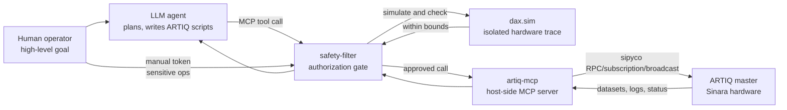

# 硬件安全门控的 LLM 实验 Agent：把“会写代码”与“有权执行”分开

- **论文**：[A hardware-safety-gated system for LLM-written native ARTIQ control code on a trapped-ion platform](https://arxiv.org/abs/2606.27231v1)
- **作者**：Duanyang Wang、Lu Qi、Yuanheng Xie、Norbert M. Linke、Kenneth R. Brown
- **时间**：arXiv v1 提交于 2026-06-25 16:19:23 UTC；PDF 标注日期为 2026-06-26
- **类型**：论文；方向为 LLM Agent / AI 安全 / 自主实验室
- **核心对象**：一个能写 ARTIQ Python 控制脚本、通过 MCP 工具提交实验、但每次硬件调用都必须先拿到内容绑定 token 的物理实验 Agent

### TL;DR

1. **这篇论文做什么**：作者把 LLM Agent 放进真实 trapped-ion 量子实验控制回路，让它从自然语言目标出发写 ARTIQ 控制代码、提交实验、读回数据、迭代校准；但任何脚本到达 ARTIQ master 或硬件前，都必须先通过一个 `safety-filter` MCP 代理。
2. **怎么保证安全**：系统把“Agent 能生成代码”与“Agent 有权执行代码”拆开。自动 token 由两级检查发放：先用 AST denylist 挡掉明显 host escape，再在隔离 `dax.sim` 中运行脚本，得到每个 DDS、DAC、TTL 等硬件操作的 trace，并与 operator 配置的 per-device bounds 比较；敏感操作则由人发 manual token。
3. **实验做了什么**：在 Duke 的 `40Ca+ / 40CaOH+` 共俘获晶体上，Agent 建出 Doppler cooling、729 nm spectroscopy、sideband cooling、Rabi flopping、Ramsey interferometry 校准链；sideband thermometry 得到 `nbar=0.20±0.06` 和 `0.45±0.09`，Rabi `pi time=4.97 us`，Ramsey `T2*=904±32 us`。
4. **跨仪器闭环证据**：Agent 还把 ARTIQ Ramsey 测量与外部 AWG 通过 MCP 串进同一回路，补偿 60 Hz power-line 磁场噪声。无补偿自由运行时 Ramsey contrast 会 collapse/revive；line-trigger 或补偿后都到 `1.4-1.5 ms` 区间，说明补偿不是只“避开”噪声，而是把场本身压下去。
5. **红队证据**：作者用 `1932` 个 generated scripts 加约 `250` 个 harness-level tests 攻击 safety filter。`631` 个合法校准脚本零误拒；越界/禁用请求被挡；边界通过项被拆成 operator 配置责任、cache 策略、static review 不完备、simulation fidelity、旁路执行路径等类别。
6. **关键局限**：filter 只保证“声明设备不越过声明边界”，不保证实验有物理意义；AST denylist 不能穷尽 Python 的绕写方式；`dax.sim` 不覆盖所有设备 driver 细节；verified-script cache 依赖 operator 在边界收紧后手动失效；当前结论绑定 ARTIQ 生态与特定模型/实验平台。
7. **最值得带走的判断**：这篇论文不是又一个“Agent 可以做实验”的展示，而是在真实物理硬件上把 Agent 权限边界写成可审计的 per-call authorization 问题：自由写代码可以保留，执行权必须由 deterministic trace checker 和人类授权共同发放。

### 研究问题：为什么固定 routine 的自动化不够？

作者先区分三类自动化：

| 自动化形态 | 典型能力 | 结构性限制 |
|---|---|---|
| 传统实验控制 | ARTIQ/Sinara 提供 nanosecond timing、设备抽象、调度 | 实验逻辑仍由人写 |
| 优化器 / RL / Bayesian calibration | 在已定义参数空间里搜索 | 不能改变 pulse sequence 或实验结构 |
| LLM Agent 写控制代码 | 从自然语言目标生成脚本，并根据日志/数据迭代 | 如果没有执行门控，错误代码可能直接伤硬件 |

论文真正追问的是：

- **能否让 Agent 自己写实验代码，而不是只调用人写好的 routine？**
- **能否让它接触真实物理硬件，而不是只在云端或 simulation 里演示？**
- **能否把每一次硬件执行都变成机器可判定的授权事件？**

这个问题比一般 tool-use Agent 更硬：

- 工具调用不是搜索、读文件或跑测试，而是会作用到真实激光、RF、DAC、TTL 和离子阱硬件。
- 错误不是“回答错了”，而可能是过高 optical power、错误逻辑电平、错误 gas valve 或 trap RF 操作。
- 人类监督不能只停留在“operator 看着办”，因为 Agent 会在长上下文、多轮脚本、多次 session 里连续迭代。

作者因此把论文主张压成一条安全原则：

> Agent 的代码生成自由，不应自动扩大它的硬件执行权限。

### 系统架构：一个 Agent、两个代理、两类 token

论文的 Figure 1 可以用下面的控制路径复原：



关键边界不是“Agent 连接了 MCP”，而是：

- Agent 只能连接 `safety-filter`；
- `safety-filter` 是到 `artiq-mcp` 的唯一通道；
- `artiq-mcp` 才与 ARTIQ master 通信；
- 每个 call 必须携带一个绑定到 exact contents 的 authorization token；
- token single-use，不能换 call、不能重放、不能并发消费。

可以把授权规则抽象成：

```text
Authorize(call c, token tau):
  tau.bound_payload == hash(c)
  tau.unused == true
  tau.not_spent_by_concurrent_call == true
  Verify(c) == pass OR HumanApproved(c) == true
```

其中自动 `Verify(c)` 不是让另一个 LLM 判断，而是确定性流程：

1. **AST checker**：
   - 检查 call targets 和 imports；
   - 拒绝 `os.system`、`subprocess`、`eval` 等 host-reachable constructs；
   - 也筛查直接 measurement-conditioned control flow。
2. **`dax.sim` simulation**：
   - 在独立 host 上运行脚本；
   - 用软件模型替代物理 ARTIQ devices；
   - 输出 line-by-line hardware operation trace。
3. **per-device bounds check**：
   - DDS frequency / amplitude / phase；
   - DAC output voltage；
   - TTL pulses；
   - 每个 device instance 都可以有 operator 配置的 tighter bounds。
4. **block-by-default**：
   - 超界则拒绝；
   - 未映射 device / method 或 simulation 不能判定则拒绝并升级人工 review；
   - 敏感操作必须 human token。

### 这个 safety filter 到底保证什么？

最重要的是，作者没有把 guarantee 写大。

它只保证一个窄属性：

```text
对 operator 已声明并配置边界的设备，
agent script 解析出的硬件操作不会超过 operator 设置的数值边界。
```

它不保证：

- 实验 sequence 是否有物理意义；
- Agent 的科学假设是否正确；
- 外部未纳入配置的设备是否安全；
- Python 静态检查能覆盖所有绕写；
- simulation 和真实 driver 的所有高级特性完全一致。

这种窄 guarantee 反而是论文可信的地方。

| 层级 | 交给谁判断 | 为什么 |
|---|---|---|
| 设备数值边界 | deterministic trace checker | 可由 simulation trace 和 bounds 机械检查 |
| 未映射 device / sensitive operation | 人类 operator | 自动系统没有完整模型，block-by-default |
| 实验是否科学合理 | Agent 闭环 + 人类必要指导 | 不是 hardware trace 的属性 |
| 更强 adversarial evasion | allow-list、simulation 扩展、旁路关闭 | denylist 和一般 Python 静态检查不完备 |

这给 Agent 安全一个可迁移的思路：

- 不要问模型“你会不会做危险事”；
- 也不要只靠 prompt 约束；
- 要把危险动作投影到一个可枚举、可审计、可拒绝的效果空间。

### 实验一：Agent 自己建出 trapped-ion 校准栈

主实验在 Duke 的 `40Ca+ / 40CaOH+` 共俘获晶体上。

作者让一个 coordinating agent，基于 Claude Opus 4.8、extended reasoning 和 one-million-token context window，跨多个 session 工作。由于一个上下文装不下整场 campaign，Agent 用外部 Markdown 文件携带目标、工作记忆和进度记录，并可派 short-lived subagents 做代码生成、日志解析、fit analysis；但只有这个 coordinating agent 连接 safety filter。

校准链分五步：

| 阶段 | 启动 prompt | operator 提供 | operator advice |
|---|---|---|---|
| Doppler cooling | 为 `40Ca+ / 40CaOH+` ion chain 开发 cooling experiment | 397 nm alignment、power vs AOM attenuation、beam position | 无 |
| 729 nm spectroscopy | 扫 quadrupole transition spectrum | 729 nm alignment、polarization、B-field、axial secular frequencies、carrier AOM setpoint、近似 Rabi frequency | 无 |
| Sideband cooling | 用 729 nm laser 冷却 axial motion | 继承前两步 | shot count、chi-square criterion、缩短 sequence |
| Rabi flopping | 在 carrier frequency 上做 Rabi flopping | stage 2 得到的 carrier frequency | 无 |
| Ramsey interferometry | 构建 Ramsey fringe measurement | 继承前置校准 | 无 |

论文给出的关键数值包括：

| 结果 | 数值 | 证据作用 |
|---|---:|---|
| COM mode mean occupation | `nbar = 0.20 ± 0.06` | sideband cooling 接近 motional ground state |
| Breathing mode mean occupation | `nbar = 0.45 ± 0.09` | 第二 axial mode 也被有效冷却 |
| Rabi contrast | `0.975` | coherent control 没有明显被自动化流程破坏 |
| Rabi pi time | `4.97 us` | 与 routine manual operation 一致量级 |
| Rabi Gaussian decay constant | `63.8 us` | 描述 carrier Rabi flopping 衰减 |
| Ramsey `T2*` | `904 ± 32 us` | 基线光学 qubit coherence |

这里最重要的不是某个量子物理分数本身，而是：

- Agent 没有只调用 pre-built routine；
- 它把前一阶段写出的模块接到下一阶段；
- 它能根据运行数据重写 cooling module；
- 它把 pulsed sideband cooling 改成 continuous sideband cooling，把总时长从约 `80 ms` 压到 `19 ms`；
- 这些脚本仍然逐次通过 safety filter 的硬件边界审查。

### 实验二：跨 ARTIQ 与 AWG 的 60 Hz 磁场补偿

第二个实验更能体现 Agent 闭环能力。

目标是补偿 power-line-synchronous `60 Hz` magnetic-field noise。

为什么这重要？

- optical qubit 的 Ramsey coherence `T2*` 被磁场噪声限制；
- ARTIQ 本身擅长 deterministic digital timing；
- 但复杂 multi-harmonic analog cancellation waveform 更适合交给外部 AWG；
- Agent 需要同时控制 ARTIQ Ramsey spectroscopy 和 AWG waveform。

工作流可以概括为：

```text
Input:
  Ramsey measurement protocol
  power-line phase reference
  AWG control interface
  target: maximize T2*

Loop:
  measure Ramsey phase shifts with ARTIQ
  fit low-order 60 Hz harmonics
  synthesize cancellation waveform
  push coefficients to AWG through MCP
  remeasure Ramsey coherence
  if global two-knob tuning saturates:
      switch to per-harmonic transfer-function inversion

Output:
  compensation waveform
  coherence comparison under four conditions
```

四种条件的证据结构如下：

| 条件 | 现象 | 解释 |
|---|---|---|
| 无补偿、free-running | contrast collapse 后 revive | coherent 60 Hz modulation，不是普通 Gaussian decoherence |
| 无补偿、line-triggered | `T2* = 1497 ± 79 us` | 固定 power-line phase，避开相位平均 |
| 补偿、free-running | `T2* = 1483 ± 73 us` | waveform 直接抵消 field |
| 补偿 + line-triggered | `T2* = 1436 ± 75 us` | 两种机制收敛到同一 residual ceiling |

论文还报告：

- free-running baseline 用的是 line-phase average model；
- 拟合得到 60 Hz modulation amplitude `a1 ≈ 2.1 kHz`；
- 三个有效条件都落在 `1.4-1.5 ms`；
- 初始 contrast 四种条件均约 `0.98`，说明 state preparation/readout 没有成为混杂因素。

这个实验的论证意义是：

- 如果只有 line-trigger 改善，可能只是采样策略避开噪声；
- 如果只有 compensation 改善，可能是 fit artifact；
- 两者各自都到同一 ceiling，组合后不再显著更好，才支持“60 Hz field contribution 被移除后，剩下是 slower magnetic drifts”。

### 红队实验：1932 个脚本把边界打出来

安全部分不是口头 claim，而是一次 adversarial boundary characterization。

设置：

- 平台：Maryland 的独立 `171Yb+` ARTIQ-controlled system；
- 范围：从 AST check 到 simulation / limit check / token issuance 的完整授权路径；
- 样本：`1932` 个 generated scripts；
- 额外：约 `250` 个 harness-level tests；
- 对照：`631` 个 realistic calibration scripts。

论文 Figure 5 的数字可整理为：

| 类别 | 数量 | 含义 |
|---|---:|---|
| filter blocked | `619` | 越界、禁用 construct、channel timing collision、cross-file laundering 等 |
| legitimate calibration scripts | `631` | 零误拒，说明日常 calibration pattern 不被 filter 误伤 |
| deliberate division of responsibility | `202` | 通过但属于 operator 配置或 policy 责任 |
| residual gaps, open | `134` | 通过且暴露静态检查、simulation fidelity 或旁路问题 |
| no filter verdict | `346` | syntax check admit，但 simulation 不能评估；不算 allow/block verdict |

更细的 blocked reason：

| blocked reason | 数量 |
|---|---:|
| Over a configured limit | `295` |
| Disallowed construct | `200` |
| Channel timing collision | `106` |
| Cross-file laundering | `18` |

边界通过项也被拆开：

| boundary pass | 数量 | 责任层 |
|---|---:|---|
| Devices outside configuration | `67` | operator configuration |
| State from earlier run | `85` | by design |
| Limit values | `50` | operator configuration |
| Static code review | `19` | inherent to static review |
| Simulation fidelity | `115` | simulation / planned work |

作者的判断很清楚：

- **合法校准脚本零误拒**，说明 filter 对日常实验代码的负担可接受；
- **所有 intended high-level actions 越界都被拒**，说明 trace-based deterministic check 在声明范围内有效；
- **通过的边界项不应该被掩盖**，因为它们决定下一步 hardening。

### 边界表：哪些是设计取舍，哪些是真缺口？

论文 Table 2 最值得细读，因为它避免把所有 failure 都混成“系统不安全”。

| 边界 | 描述 | 判断 |
|---|---|---|
| configuration 外的设备 | filter 只 bound operator 声明的 channels/devices | 设计取舍，不是自动 check 责任 |
| earlier experiment state | 当前脚本只检查自己 command 的 outputs | 由前次脚本 review 或 operator 负责 |
| limit values | bounds 由 operator 写；写错边界不是 filter 能推断的 | operator configuration 问题 |
| verified-script cache | bounds 收紧后 cache 不自动失效 | filter policy，需人工失效或未来机制 |
| static code review | denylist 无法穷尽 Python 绕写 | 真缺口，建议 allow-list |
| simulation fidelity | device driver 高级路径不全 | 真缺口，需要补 simulator |
| bypass review path | 某些 repository scan 可在 review 前运行文件 | 真缺口，作者计划 refactor 关闭 |

这张表给 AI 安全研究一个重要范式：

- 不是所有“通过”都等价；
- 应该区分 **policy scope**、**operator responsibility**、**implementation gap**；
- 红队报告的价值在于把边界分层，而不是只报一个总成功率。

### 机制细读：为什么 token 必须绑定 exact call？

论文里 token 设计看似是工程细节，其实是安全主张的核心。

如果 token 只表示“这个 Agent 被信任”，那么它会退化成会话级权限：

- Agent 可以先拿到权限，再改变脚本；
- 一个安全脚本的 approval 可能被挪到另一个危险脚本；
- 并发调用可能复用同一许可；
- 日志审计只能知道“某个 Agent 被放行”，无法重建“哪段代码因哪个检查被放行”。

作者避免这种退化的方法是把 token 绑定到具体 call contents：

| 设计点 | 防住什么 | 代价 |
|---|---|---|
| 绑定 exact contents | approval 不能迁移到改写脚本 | 相同意图的微小改写也要重新检查 |
| single-use | token replay 不能重复打硬件 | 高频 routine 需要 cache 或 quota |
| concurrent-spend protection | 两个 call 不能抢同一 token | filter 必须管理原子状态 |
| human token quota | 敏感但重复的人工批准可有限复用 | quota 设计成为 operator 风险判断 |
| append-only audit | 事后能重建 goal → script → approval → execution | 日志系统本身要防篡改 |

这个设计把权限从“身份”转成“操作证据”。

更准确地说：

```text
身份只能说明谁发起调用；
token-bound call 才说明这一次调用为什么被允许。
```

这对未来工具型 Agent 很重要。

在软件工程 Agent 中，同样的思想可以对应到：

- `git push` token 绑定到 diff hash；
- `deploy` token 绑定到 build artifact digest；
- `email/send` token 绑定到收件人、正文、附件 hash；
- `payment` token 绑定到金额、账户、目的说明；
- `browser action` token 绑定到 DOM target 和 mutation type。

如果只给 Agent 一个长期 API key，系统就只能事后追责；如果每次危险动作都要求内容绑定 authorization，系统才有机会事前拒绝。

### 失败案例细读：为什么 measurement-conditioned control flow 难处理？

论文特别强调一个不容易被软件读者注意的点：mid-experiment measurement 会让 simulation review 变得复杂。

原因是 trapped-ion 实验里的脚本不只是普通 Python：

- 一部分逻辑在 host 上调度；
- 一部分逻辑在 real-time kernel 中按纳秒级时序作用硬件；
- measurement 结果可能决定后续 pulse、loop 或 reset；
- simulation 如果只走一条 deterministic branch，就不能保证未走分支安全。

作者当前的处理是：

1. `dax.sim` 对 measurement 给出单一确定 realization；
2. AST checker 拦截可识别的 measurement-gated branching；
3. 本文实验集中在 open-loop parameter sweeps；
4. active reset、real-time feed-forward 等 adaptive kernel 不在自动 guarantee 内。

这个限制很关键。

如果一个脚本有 `m` 个 mid-experiment measurements，每个 measurement 产生至少两个分支，那么简单分支枚举规模就是：

```text
branches >= 2^m
```

如果 measurement 还控制循环次数，则分支数甚至不在静态检查时固定。

因此，“跑一遍 simulator 没出界”不能推出“所有可能硬件路径都安全”。

作者没有把这个问题掩盖成实现 bug，而是把它定义为安全边界：

- 当前 filter 能覆盖 open-loop calibration；
- 对 adaptive kernel 需要更强语义模型；
- 否则应该 block-by-default 或人工 review。

这也是本文比一般 Agent demo 严谨的地方：它不把没覆盖的动态行为悄悄算进成功案例。

### 为什么“零误拒”重要，但不能被误读？

`631` 个合法校准脚本零误拒，是论文最容易被引用的数字之一。

它支持的是：

- 日常 calibration 脚本的代码风格与 adversarial evasion 代码结构不同；
- 直接命名 device method、标准控制库、无奇怪 indirection 的脚本能够通过；
- filter 不会因为过度保守而阻断作者当前实验 workflow。

它不支持的是：

- 所有未来实验脚本都会零误拒；
- allow-list hardening 后仍然零误拒；
- 其它实验室、其它 driver、其它 Python 风格能直接迁移；
- determined attacker 无法伪装成正常 calibration。

论文中一个微妙但重要的观察是：

| 正常 calibration 代码 | adversarial evasion 代码 |
|---|---|
| 直接调用设备方法 | alias、helper chain、indirect call |
| 使用标准控制 / 数值库 | import 外部 host-reachable construct |
| 操作路径与实验意图一致 | 试图让 forbidden operation 藏在表达形式里 |
| 适合 trace checker | 试图逃出 trace checker 的建模范围 |

这说明 red-team 结果不是简单“挡住多少攻击”，而是帮助作者发现一个可硬化的特征边界：

- 当前 denylist 会漏掉未命名绕写；
- 但合法 calibration 的结构相对简单；
- 因而 allow-list 可能有现实可行性；
- 未来需要长期 operational record 来估计 allow-list 对正常工作的误拒率。

### 对 AI 安全的延伸：从 policy 文本到可执行边界

很多 Agent 安全方案把 policy 写成自然语言：

- 不要泄露数据；
- 不要执行危险命令；
- 操作前请确认；
- 遵守工具权限。

这类 policy 的问题是：

- Agent 可能忘记；
- prompt injection 可能覆盖；
- LLM judge 可能误判；
- policy violation 往往到事后才发现。

本文的做法更像把 policy 编译到 runtime boundary：

| 自然语言 policy | 本文对应机制 |
|---|---|
| 不要让某束光功率过高 | operator 写入 device bound |
| 不要直接操作危险硬件 | denied device / no interface / manual token |
| 不要运行未审查脚本 | safety-filter 是唯一通道 |
| 不要越过工具边界 | Agent 只能连 filter，不能直连 backend |
| 事后要能追责 | append-only execution and authorization log |

这条路线的优点是可检查。

它的代价也明显：

- 需要把危险动作形式化成 bounds；
- 需要 simulator 或 dry-run 环境；
- 需要维护工具 schema、device map、allow-list；
- 需要 operator 持续更新配置；
- 对“实验是否值得做”这类语义问题无能为力。
- 还需要把每次策略变更、边界收紧和人工授权都纳入同一套审计记录。

因此，本文不是要替代人类专家，而是把人类专家从“每一步看着 Agent 会不会乱来”转移到更高层：

- 设定设备边界；
- 批准不可逆动作；
- 处理未建模情况；
- 在策略饱和时重新定义问题。

这个分工比“human-in-the-loop”更具体，因为它说明了 human 到底在哪些节点介入，而不是把 human 当成笼统兜底。

### 公式化理解：授权是效果空间约束，不是意图判断

可以把 filter 的核心目标写成一个效果空间判定：

```text
Trace(script) = [op_1, op_2, ..., op_n]

op_i = (device_i, method_i, parameter_i, time_i)

Safe(script | Config) =
  for all op_i in Trace(script):
    device_i in Config.devices
    method_i in Config.allowed_methods(device_i)
    parameter_i within Config.bounds(device_i, method_i)
    timing_i satisfies collision constraints
```

自动 token 的充要条件近似是：

```text
ASTCheck(script) == pass
AND Simulate(script) == trace
AND Safe(trace | operator_config) == true
```

这和常见 LLM safety prompt 的差异很大：

- prompt 约束判断的是语言层意图；
- reward model 可能判断的是输出偏好；
- judge 可能被上下文或表述误导；
- 这里判断的是“脚本解析后会对哪台设备发什么硬件操作”。

因此它更接近 sandbox / capability / runtime monitor，而不是 alignment by instruction。

但这个公式也暴露局限：

- `Trace(script)` 依赖 simulation fidelity；
- `Config.bounds` 依赖 operator 写对；
- `ASTCheck` 对 general-purpose Python 不完备；
- 只要 hardware effect 不越界，filter 不会判断实验是否愚蠢。

### Agent 的能力边界：知识不是瓶颈，重新框定问题才是

论文讨论里最有意思的是“context-saturation limit”。

在磁场补偿 campaign 中，Agent 能执行大量扫描、waveform synthesis、cross-instrument actuation 和 fitting；但在关键节点上需要 operator advice。

Table 3 显示：

| 能力点 | 闭环中表现 | isolated probe |
|---|---|---|
| 大规模扫描、波形合成、跨仪器 actuating、fitting | 自主完成 | 不适用 |
| 识别 60 Hz collapse-revival 不是 Gaussian decay | 闭环中未主动提出，默认 Gaussian | 单独问时能答对 |
| per-harmonic complex transfer-function inversion | 闭环中没跳出 global two-knob tuning | 单独问时能答对 |
| transfer-function measurement protocol / drift handling | operator 指导 | 单独问时能答对 |
| line-triggered coherence 作为 mitigation ceiling | operator 指导 | 单独问时能答对 |
| 发现当前方法已饱和并重新 frame | 失败，反复提前宣布 converged | isolated probe 不可测 |

作者的解释是：

- Agent 不是不知道物理；
- 它在干净 prompt 下能回答正确方法；
- 但长程闭环把上下文锁进已有方法；
- 每次迭代都强化“继续调当前 knobs”的轨迹；
- 要跳出这个轨迹，需要一种 metacognitive control。

论文提出下一步多 Agent 架构：

- worker agents 继续写脚本、跑实验、做 fit；
- supervisory knowledge agent 不碰硬件，只维护目标、domain priors、尝试记录；
- 它负责发现 worker 卡住、重写问题、派发下一子任务；
- 所有 worker 输出仍通过同一个 safety filter，因此 agent 数量增加不扩大执行权限。

这个设想和近期 Agent 论文里常见的“多 Agent 协作”不同：

- 它不是为了投票；
- 不是为了角色扮演；
- 而是为了把 metacognitive function 从 execution context 中隔离出来。

### Figure / Table 逐项证据解读

| 图表 | 支持什么 | 不能证明什么 |
|---|---|---|
| Figure 1 | Agent、safety-filter、dax.sim、artiq-mcp、ARTIQ master 的控制路径；Agent 不直连硬件 | 不证明 filter 对所有 Python 绕写都安全 |
| Figure 2 | sideband thermometry 显示两个 axial modes 接近 motional ground state | 不证明整个 molecular-ion 物理实验已完全自主 |
| Figure 3 | Rabi flopping 与 Ramsey calibration 达到可用 coherence / contrast | 不证明和人工生产栈逐项等价 |
| Figure 4 | 60 Hz compensation / triggering 都把 `T2*` 推到 `1.4-1.5 ms` | 不排除更慢磁场漂移、beam drift 等外部限制 |
| Figure 5 | adversarial campaign 将 blocked、legitimate、boundary passes、no verdict 分开 | 不证明面对 determined attacker 已强鲁棒 |
| Table I | 五阶段校准中哪些需要 operator advice | 不给无人工指导的成功率分布 |
| Table II | safety filter 责任边界和 residual gaps | 不提供长期真实运行频率 |
| Table III | Agent 失败更像重新框定问题失败，而非知识缺口 | 只来自单次 campaign 和特定模型 |

### 与相关工作的相对位置

论文把自己放在三条线交叉处：

| 相关线索 | 既有工作特点 | 本文新增 |
|---|---|---|
| 自驱动实验室 | 化学/材料系统关注 procedure、planning、lab automation | 把真实 quantum hardware 的 per-call safety gate 做成核心对象 |
| 量子实验自动化 | Bayesian/RL/calibration graph 多在固定 routine 或参数空间里搜索 | Agent 自己写 ARTIQ code，并可重构实验逻辑 |
| Tool-use / MCP Agent | 多数研究关注工具调用能力和任务成功率 | 每个 MCP call 都必须先过硬件效果审查 |
| Agent 安全 | prompt injection、policy monitor、runtime enforcement 多在软件/数据环境 | 在真实物理控制栈上做 adversarial boundary characterization |

这篇文章最接近的不是“某个 benchmark SOTA”，而是安全系统论文：

- 它定义 threat model；
- 构造 enforcement point；
- 做正常 workload 验证；
- 做 adversarial campaign；
- 公开 residual gaps；
- 给 remediation roadmap。

### 局限与复现边界

必须把论文结论收窄到以下范围：

1. **平台边界**：
   - 当前依赖 ARTIQ/Sinara；
   - `dax.sim` 是自动 trace review 的基础；
   - 迁移到非 ARTIQ 控制栈需要同等 fidelity 的 simulator。
2. **实验边界**：
   - Duke 平台做了真实 closed-loop calibration；
   - Maryland 平台验证 interface-level portability；
   - 第二平台没有 active trapped-ion feedback，因此不是完整跨平台物理校准复现。
3. **安全边界**：
   - 防的是 fallible but non-adversarial agent；
   - red-team 放宽该假设只是为了 map boundary；
   - 作者没有声称对 determined attacker 完整鲁棒。
4. **静态分析边界**：
   - denylist 能拦已知 misuse；
   - general-purpose Python 总能绕写；
   - 作者建议 allow-list hardening，但这会带来维护成本和合法脚本误拒。
5. **cache 边界**：
   - byte-identical resubmission 可跳过 re-simulation；
   - bounds 收紧后 cache 不自动感知；
   - 当前依赖 operator 手动 invalidate。
6. **自主性边界**：
   - Agent 能完成很多 execution-heavy tasks；
   - 但重新 frame 问题仍需要人；
   - “context saturation” 解释来自一个 campaign，尚需多模型、多任务验证。

### 研究者视角：这篇论文对 Agent 安全的真正启发

最有价值的不是“LLM 能控制离子阱”，而是它提出一种工程化安全问题表述：

```text
LLM Agent Safety =
  Code generation freedom
  + Effect-space authorization
  + Human-issued capabilities for irreversible actions
  + Append-only audit log
  + Red-team boundary report
```

这比“给 Agent 加一条安全 prompt”严格得多。

对于未来 Agent 系统，尤其是能影响外部世界的系统，本文给出几个可继续追问的问题：

1. **效果空间如何定义？**
   - 在 ARTIQ 里是 DDS/DAC/TTL trace；
   - 在 coding agent 里可能是 file diff、test command、network access、deployment target；
   - 在 browser agent 里可能是 account mutation、payment、message send。
2. **simulation fidelity 如何审计？**
   - 如果 simulator 不覆盖真实 driver 高级路径，filter 只是在检查一个简化世界；
   - 这要求每个 simulator 都有 coverage / conformance benchmark。
3. **cache 和 policy 更新如何绑定？**
   - verified script approval 应该绑定 `script_hash + policy_version + bounds_hash`；
   - 否则策略收紧后旧 approval 可能继续有效。
4. **allow-list 的维护成本如何控制？**
   - denylist 漏放，allow-list 误拒；
   - 真实系统需要衡量误拒对科学工作流的成本。
5. **metacognitive supervisor 如何验证？**
   - supervisor 不碰硬件是好设计；
   - 但它如何知道 worker 已经 stalled？
   - 它的 reframe 建议是否也需要结构化审计？

### 结论

这篇论文把自主实验室 Agent 的问题推进了一步：

- 它不是把 Agent 限制在预写 routine 里；
- 也不是让 Agent 无约束地写代码上硬件；
- 而是把执行权变成每次 tool call 的 tokenized, trace-checked authorization。

在证据上，论文同时给出：

- 真实 `40Ca+ / 40CaOH+` trapped-ion calibration；
- 跨 MCP 的 AWG + ARTIQ magnetic-field compensation；
- 第二 ARTIQ 平台的 interface-level test；
- `1932` 脚本级红队；
- 明确的 residual gaps 和 hardening roadmap。

它仍然不是完整自主科学家：

- 人类仍提供高层目标、敏感授权和方法重构；
- filter 不理解物理意义；
- simulation 与 static review 都有边界；
- 多 Agent supervisor 还只是下一步。

但它给出了一个更可审计的方向：

> 让 LLM Agent 自由生成行动计划，同时把行动效果关进可验证、可撤销、可记录的执行边界里。
