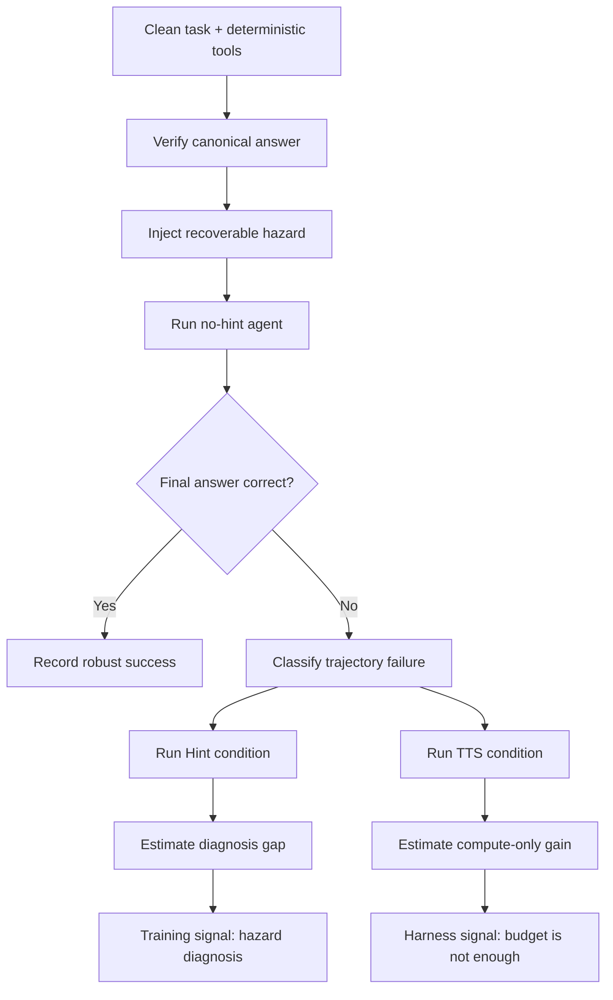

# Beyond Function Calling：工具环境不可靠时，Agent 还会不会真的完成任务？

原文：<https://arxiv.org/abs/2606.25819>

代码与数据仓库：<https://github.com/Foreverskyou/ToolBench-X>

日期：arXiv v1 提交于 2026-06-24 13:34:34 UTC；仓库创建于 2026-06-23，当前 README 说明完整代码和 benchmark 文件仍在整理中。

类型：论文；方向：大模型 Agent；关键词：tool-use agent、function calling、reliability hazard、benchmark、recovery、test-time scaling。

### TL;DR

- 这篇论文提出 **ToolBench-X**，把工具调用评测从“能否选对函数和参数”推进到“工具环境出错但仍可恢复时，Agent 能否诊断、验证、重试、回退并完成任务”。
- Benchmark 包含 **1,106 个保留任务**，覆盖 **7 个主主题、84 个子主题**，任务结构分成 **378 个 sequential、358 个 parallel、370 个 mixture**，每个任务有确定性 Python 工具和 canonical final answer。
- 作者从干净工具出发，注入 5 类可恢复 hazard：**Specification Drift、Invocation Error、Execution Failure、Output Drift、Cross-source Conflict**；每个注入实例都必须保留至少一条正确恢复路径。
- 主实验评测 **12 个模型**。最佳整体准确率只有 **0.513**，GPT-5.4 为 **0.453**，Claude-Sonnet-4.6 为 **0.410**，GPT-4o 为 **0.359**；没有模型超过 **0.60**。
- 论文最关键的证据不是“模型不够强”，而是“模型不会诊断工具环境异常”：在 200 题诊断子集上，Hint 能带来 **25.5 到 35.5 个百分点**的绝对提升，而只给更多推理轮次的 test-time scaling 只提升 **3.5 到 11.5 个百分点**。
- 失败分析显示，失败轨迹里 **Ineffective Continuation** 占 **48.6%**，**Early Abandonment** 占 **26.7%**；也就是说，很多 Agent 不是完全不继续调用工具，而是继续得没有方向。
- 局限同样清楚：任务和工具由生成流程构造，仓库目前尚未完整释放；Exact-match 适合单一 scalar 答案，但还不能覆盖开放式业务任务、真实第三方 API 波动、长期状态污染和多用户交互。

### 研究问题：为什么“函数调用正确率”不够了？

作者回应的是一个在 Agent 评测里越来越明显的错位：

- 现有评测经常问：
  - 模型能不能选对工具？
  - 参数能不能填对？
  - 多轮或并行调用能不能走完？
- 真实工具环境还会问：
  - 文档和运行时 schema 不一致怎么办？
  - 参数在 adapter 层被截断或默认化怎么办？
  - 服务 timeout 以后该重试、回退还是停止？
  - 返回值多了单位、嵌套字段或别名怎么办？
  - 多个来源给出互相矛盾的证据怎么办？

论文的切入点是：**可靠工具使用不是函数调用能力的自然延伸，而是对异常环境的诊断与恢复能力。**

这意味着一个在干净环境里很强的 tool-use Agent，不一定能在真实系统里可靠工作。因为真实系统的错误并不总是显式的：

- 有些错误像 hard failure，直接抛异常。
- 有些错误像 soft failure，返回一个看似可用但格式漂移的值。
- 有些错误像 evidence conflict，多个工具都返回“成功”，但它们不能同时为真。
- 有些错误发生在 wrapper、schema、参数绑定层，模型看到的是任务失败，但不一定知道失败来自哪里。

### 论文主张与论证路线

| Claim | Mechanism | Evidence | Boundary |
|---|---|---|---|
| 函数调用评测低估了真实 Agent 风险 | 把工具环境形式化为从干净转移核 `P0` 变成 hazard 转移核 `Ph` | MDP 公式、5 类 hazard taxonomy、与 BFCL/ToolBench 等 benchmark 对比 | 仍是构造 benchmark，不是真实生产日志回放 |
| 可恢复 hazard 能暴露更细的可靠性缺口 | 从 clean Python tools 注入 deterministic hazard，同时保留 canonical answer 和 recovery path | 1,106 retained tasks；自动恢复路径验证；800 person-hours human review | 任务由 LLM 生成后筛选，领域覆盖广但不是全分布 |
| 当前模型失败主要不是“没算够”，而是“没诊断出异常” | 比较 Baseline、Hint、Test-Time Scaling、Oracle | Hint +25.5 到 +35.5 points；TTS +3.5 到 +11.5 points；Hint 比 TTS 高 24 到 32 points | Hint 是作者知道注入故障后的诊断信号，实际部署中未必可直接获得 |
| 更多工具调用不等于更强恢复 | 引入 Average Call Expansion Ratio `R`，比较调用强度与准确率 | Pearson `r=0.326`；Doubao-Seed-2.0-Lite 准确率最高但调用扩张比不高 | 相关性分析不能证明因果，只能说明“调用数量”不是充分解释 |
| 失败需要按轨迹诊断，而不是只看最终分数 | 用 Early Abandonment、Ineffective Continuation、Under-utilization、Synthesis Failure 分类 | 8,130 条失败 no-hint 轨迹；IC 占 48.6%，EA 占 26.7% | 分类是 heuristic，依赖阈值和轨迹日志定义 |

### 方法机制：ToolBench-X 怎么构造？

作者的构造流程可以拆成 6 个层次。

1. **主题与场景生成**
   - 先定义 7 个现实主题。
   - 每个主题下生成多个子主题。
   - 任务覆盖 sequential、parallel、mixture 三种 workflow。

2. **任务与工具生成**
   - 每个任务包含一个用户请求。
   - 工具由 Python 函数实现。
   - 工具必须 deterministic。
   - 每个任务有 canonical final answer。

3. **干净路径验证**
   - 在没有 hazard 的状态下，工具链必须能得到参考答案。
   - 这一步保证任务本身不是无解题。

4. **可靠性 hazard 注入**
   - 从 clean tools 出发做 patch。
   - 注入 deterministic failure schedule。
   - 不改变任务真实答案，只改变 Agent 可观察到的工具行为。

5. **恢复路径保留**
   - 每个异常注入后仍必须存在至少一条可达路径。
   - 恢复可以是 retry、fallback、normalization、validation、cross-checking。

6. **人工与自动质量控制**
   - 5 位 PhD 学生或 PhD 审阅者参与。
   - 共 20 个工作日、800 person-hours。
   - 检查任务清晰度、工具可执行性、hazard 分类、answer leakage、exact-match 与人工语义判断是否一致。

### 五类 hazard：每一类实际考什么？

| Hazard | 出错位置 | 典型表现 | 需要的恢复动作 | 为什么难 |
|---|---|---|---|---|
| Specification Drift | 文档合同和运行时合同之间 | 字段改名、类型变化、单位变化、输出形状变了 | 把 observed runtime behavior 映射回 intended contract | 模型要意识到文档不可信，而不是机械按说明填字段 |
| Invocation Error | 调用边界、adapter、middleware | 参数丢失、重命名、截断、默认化、被 wrapper 拒绝 | 验证必需输入、重构合法调用、避免使用 misbound 参数 | 难点在调用动作本身，不是结果解释 |
| Execution Failure | 工具已经被正确调用以后 | timeout、connection error、runtime exception、parsing failure | 有界重试、fallback、不能从 partial evidence 直接结束 | 模型要区分 transient failure 和结构性错误 |
| Output Drift | 工具返回了值，但表面形式漂移 | wrapped value、附加单位、嵌套字段、别名、非 canonical 格式 | 抽取底层值并 canonicalize | 相对容易，因为信息通常还在返回值里 |
| Cross-source Conflict | 多工具证据聚合阶段 | 分支不完整、来源冲突、格式不一致 | 检查分支完整性、归一化、解决矛盾，只传播 reconciled evidence | 需要证据管理，不能只选第一个成功返回 |

### 形式化：从干净转移核到 hazard 转移核

论文把工具 Agent 写成一个序贯决策过程：

```text
M = (S, A, P)
```

变量含义：

- `S`：环境状态，包括任务上下文和历史工具输出。
- `A`：动作空间，包括 tool call、retry、fallback、verify、finish。
- `P(s_{t+1} | s_t, a_t)`：外部工具环境对动作的响应。

在干净函数调用评测里，模型面对的是：

```text
P0(s_{t+1} | s_t, call_tool(f, x)) = documented behavior of tool f on x
```

ToolBench-X 关心的是：

```text
Ph(s_{t+1} | s_t, a_t) != P0(s_{t+1} | s_t, a_t)
```

可靠性缺口可以写成：

```text
ReliabilityGap(pi) = V_P0(pi) - V_Ph(pi)
```

解释：

- `V_P0(pi)`：同一个策略 `pi` 在干净工具环境中的任务价值。
- `V_Ph(pi)`：同一个策略 `pi` 在 hazard 工具环境中的任务价值。
- 如果 gap 很大，说明模型不是不会做干净任务，而是无法在异常环境里维持证据链。

这个形式化的意义在于：它把 tool-use benchmark 从“动作是否正确”改写成“策略是否能在部分可观察异常中维护 belief、修复证据、避免过早结束”。

### 算法流程：一条任务如何从 clean 变成 ToolBench-X 实例？

```text
Input:
  Topic set D
  Task types T = {sequential, parallel, mixture}
  Hazard types H = {specification, invocation, execution, output, cross-source}
  Clean task generator G_task
  Tool generator G_tool
  Hazard injector G_hazard

State:
  Candidate tasks C
  Retained benchmark B

For each topic d in D:
  For each task_type t in T:
    Generate user requests and canonical answers with G_task
    Generate deterministic Python tools with G_tool
    Execute clean tool path
    If clean path fails or answer is ambiguous:
      reject candidate

For each valid clean candidate c:
  Select a compatible hazard h in H
  Patch clean tool module with deterministic failure schedule
  Ensure:
    clean behavior is preserved when injection is disabled
    injected behavior is observable under strict_no_hint_profile
    guided_with_hint_profile keeps the same fault schedule
    at least one recovery path still reaches canonical answer
  Run automatic recovery-path validation
  Run answer-leakage checks
  Send uncertain or complex cases to human review

Output:
  B = retained executable tasks with clean tools, hazard tools, canonical answers, metadata, and recovery hints

Failure boundary:
  Reject if final answer leaks, clean path is not deterministic, injected instance is irrecoverable, or exact-match conflicts with human semantic judgment.
```

### 数据与质量控制：数字比口号重要

| 阶段 | 数字 | 说明 |
|---|---:|---|
| 初始生成 | 2,610 raw task items | 任务先由生成流程扩大候选池 |
| 初筛后 | 1,250 candidate instances | 通过任务有效性、去重、工具可执行、clean-path 检查 |
| 自动恢复路径通过 | 1,142 | 注入后仍能走到原 reference answer |
| Answer leakage 通过 | 1,196 | prompt、工具描述、metadata、hint 不能直接泄露答案 |
| 最终保留 | 1,106 | retention rate 为 88.5% |
| 无实质修改保留 | 996 | 占 79.7% |
| 修改后保留 | 72 | 占 5.8% |
| 重新生成后保留 | 38 | 占 3.0% |
| 移除 | 144 | 占 11.5% |
| 双审样本 | 200 | 占最终 benchmark 的 18.1% |
| 初始审阅一致率 | 91.5% | 讨论后所有保留实例达成一致 |

最终任务分布：

| Workflow | 数量 |
|---|---:|
| Sequential | 378 |
| Parallel | 358 |
| Mixture | 370 |
| Total | 1,106 |

最大主题组：

| 主题 | 任务数 |
|---|---:|
| Commerce & Transactions | 234 |
| Entertainment & Media | 215 |
| Health & Wellness | 192 |

这些数字说明作者没有只做一个小型 toy set。更重要的是，论文同时披露了筛选和修订过程，让读者可以判断 benchmark 的人工质量控制成本。

### 实验设置：模型、轮次和评价规则

论文评测了 12 个模型：

| 类型 | 模型 |
|---|---|
| Proprietary | GPT-5.4、GPT-5.4-Mini、GPT-4o、Gemini-3.1-Flash、Claude-Sonnet-4.6、Doubao-Seed-2.0-Lite、Doubao-Seed-2.0-Mini |
| Open-source | DeepSeek-V4-Pro、DeepSeek-V4-Flash、GLM-5.1、MiniMax-M2.7、Kimi-K2.6、Qwen3.0-30B-A3B-Instruct、Qwen-3.5-35B-A3B |

论文正文 Table 2 展示 12 个代表模型；附录 Table 7 列出完整模型清单。评测协议的关键点：

- 统一 OpenAI-compatible API。
- 使用默认 temperature。
- 每题允许 10 轮。
- 8 parallel workers。
- 最大输出 8,192 tokens。
- 每个请求 120 秒 timeout。
- 每轮最多一个动作：tool call、retry、fallback 或 finish。
- 任务要求单一确定输出，例如 amount、date、count。
- Exact-match：去掉空白后必须和 answer string 完全一致。
- API 请求失败最多重试 3 次，指数退避 2 到 10 秒；持续失败记为任务失败。

这个设置有一个优点：它把“最终答案是否对”与“过程里是否真的处理了异常”都记录下来。也有一个边界：Exact-match 对 scalar task 很强，但对开放式计划、文本摘要、多目标优化任务会偏窄。

### 主结果：所有模型都没超过 0.60

| 模型 | Overall | Parallel | Sequential | Mixture | 最弱项之一 |
|---|---:|---:|---:|---:|---|
| Doubao-Seed-2.0-Lite | 0.513 | 0.587 | 0.439 | 0.516 | Invocation 0.353 |
| GPT-5.4 | 0.453 | 0.472 | 0.450 | 0.438 | Invocation 0.283 |
| DeepSeek-V4-Pro | 0.425 | 0.469 | 0.397 | 0.411 | Invocation 0.272 |
| GLM-5.1 | 0.420 | 0.511 | 0.357 | 0.395 | Invocation 0.318 |
| Qwen-3.5-35B-A3B-Thinking | 0.419 | 0.475 | 0.368 | 0.416 | Invocation 0.301 |
| Gemini-3.1-Flash | 0.416 | 0.528 | 0.339 | 0.386 | Invocation 0.301 |
| Claude-Sonnet-4.6 | 0.410 | 0.425 | 0.402 | 0.405 | Invocation 0.272 |
| GPT-4o | 0.359 | 0.352 | 0.386 | 0.338 | Invocation 0.249 |

三个观察最重要：

1. **最好模型也只略高于一半。**
   - Doubao-Seed-2.0-Lite 最高，但只有 0.513。
   - GPT-5.4 是 0.453。
   - 这说明 benchmark 确实击中了当前 Agent 的脆弱点。

2. **Invocation 是最难的异常类型。**
   - Output exception 平均准确率约 0.581。
   - Invocation exception 平均准确率约 0.260。
   - 差距超过 30 个百分点。

3. **并行任务比顺序任务更容易。**
   - Parallel 平均 0.421。
   - Sequential 平均 0.367。
   - 当后续调用依赖前序输出时，一个异常更容易污染整个状态链。

### 为什么 Output Drift 相对容易，而 Invocation Error 很难？

论文的结果可以从信息可见性解释：

| 异常 | Agent 是否还能看到有用信息 | 主要动作 | 难度直觉 |
|---|---|---|---|
| Output Drift | 通常能看到，只是格式漂移 | 抽取、归一化、去单位、找 canonical field | 模型可以靠语言理解修复 |
| Specification Drift | 看到运行时输出，但和文档冲突 | 重建 schema 映射 | 需要怀疑文档 |
| Execution Failure | 看到异常，但不知道是否 transient | retry、fallback、等待或换路径 | 需要错误类型判断 |
| Cross-source Conflict | 多个成功输出互相矛盾 | cross-check、reconcile、阻止 premature finish | 需要证据管理 |
| Invocation Error | 失败发生在调用边界 | 修复参数绑定、重构调用、检查 wrapper | 需要改变动作生成策略 |

这也是论文对 Agent 训练很有启发的地方：**不是所有工具错误都能靠“让模型多想一会儿”解决。** 如果错误发生在 action construction 层，模型必须学会检查自己的参数生成、调用适配器和输入完整性。

### Hint 与 Test-Time Scaling：诊断比算力更关键

作者在 200 个任务子集上设置 4 种条件：

| 条件 | 含义 | 作用 |
|---|---|---|
| Baseline | hazard 注入后无提示 | 测 no-hint 可靠性 |
| Hint | 失败后告知当前工具环境问题 | 测诊断信息价值 |
| Test-Time Scaling | 失败后多给 10 轮，但不提供 hazard 信息 | 测额外计算价值 |
| Oracle | 干净工具环境 | 测无异常上界 |

关键数字：

- Baseline 到 Oracle 有 **约 35 到 50 个百分点**的 gap。
- Hint 提升 **25.5 到 35.5 个百分点**。
- Hint 恢复了 lost accuracy 的 **约 60% 到 80%**。
- TTS 只提升 **3.5 到 11.5 个百分点**。
- GPT-5.4-Mini：
  - Hint：0.840。
  - TTS：0.520。
- Claude-Sonnet-4.6：
  - Hint：0.775。
  - TTS：0.535。

这个对比支撑了论文最核心的判断：

```text
如果更多推理轮次能解决问题：
  TTS 应该接近 Hint。

实际结果：
  Hint 远高于 TTS。

因此：
  大量失败不是因为任务无解，也不是因为轮次不够；
  而是因为 Agent 没有识别自己处在什么 hazard 里。
```

### 工具数量：更长链条会放大异常，但不是唯一解释

作者把任务按工具数分桶：

| Tool count bucket | 任务数 |
|---|---:|
| `<= 3` tools | 104 |
| `4` tools | 829 |
| `>= 5` tools | 173 |

部分模型从低复杂度到高复杂度的下降：

| 模型 | `<=3` | `>=5` | 下降 |
|---|---:|---:|---:|
| Doubao-Seed-2.0-Lite | 0.577 | 0.462 | -0.115 |
| Gemini-3.1-Flash-Lite | 0.442 | 0.318 | -0.124 |
| GLM-5.1 | 0.490 | 0.335 | -0.155 |
| GPT-4o | 0.423 | 0.301 | -0.122 |

结论要谨慎：

- 更长工具链确实更容易累积异常。
- 但趋势不是对所有模型完全单调。
- 因此难度还来自 workflow structure、hazard type、调用之间的依赖关系。

换句话说，Agent 不是只要“少调用工具”就安全，也不是只要“多调用工具”就可靠；关键是每一步能不能维护可信证据状态。

### 调用更多工具，不等于恢复更好

作者定义 Average Call Expansion Ratio：

```text
R_bar = (1 / |T|) * sum_{t in T} C_t / K_t
```

变量解释：

- `T`：任务集合。
- `C_t`：模型在任务 `t` 中实际发起的工具调用数。
- `K_t`：任务 `t` 原本指定的工具数。
- `R_bar`：模型相对于任务工具规模的平均调用强度。

关键发现：

- `R_bar` 和准确率的 Pearson 相关只有 **0.326**。
- Doubao-Seed-2.0-Lite：
  - 准确率最高：0.513。
  - 调用扩张比相对低：0.773。
- GPT-4o：
  - 调用扩张比高：0.948。
  - 准确率低：0.359。
- Qwen-3.0-30B-A3B-Instruct：
  - 调用扩张比高：0.950。
  - 准确率：0.403。

这支持一个很实用的判断：**persistence is not recovery。** 一个 Agent 遇到错误后继续调用工具，只说明它还在行动，不说明它知道应该如何恢复。

### 失败行为：最多的不是停止，而是无效继续

作者把 failed no-hint trajectories 分成 4 类：

| Failure type | 定义 | 数量 | 占比 |
|---|---|---:|---:|
| Ineffective Continuation | 错误后继续密集调用，但没有恢复 | 3,952 | 48.6% |
| Early Abandonment | 过早停止或给无效答案 | 2,172 | 26.7% |
| Answer Synthesis Failure | 工具使用了，但最终答案合成失败 | 1,091 | 13.4% |
| Under-utilization | 工具覆盖不足 | 915 | 11.3% |
| Total failed | 失败 no-hint 轨迹 | 8,130 | 100% |

模型之间也不一样：

- Qwen-3.0-30B-A3B-Instruct 和 GPT-4o 的 Ineffective Continuation 很高，说明它们会继续，但恢复策略不对。
- Kimi-K2.6 的 Under-utilization 更多，说明它可能根本没有充分探索工具。
- GPT-5.4 的失败里 IC 为 380、EA 为 135、UU 为 18、SF 为 72，显示它不是简单“少调用”，而是容易陷入错误恢复。

这类轨迹诊断比 overall accuracy 更有价值。因为两个 overall 接近的模型，失败机制可能完全不同：

- 一个需要训练“不要过早结束”。
- 一个需要训练“不要盲目重试”。
- 一个需要训练“冲突证据不能直接 finish”。
- 一个需要训练“调用边界失败要重新构造参数”。

### Figure/Table 证据逐项解读

| 图表 | 证据内容 | 支撑什么 claim | 不能证明什么 |
|---|---|---|---|
| Table 1 | ToolBench-X 与 BFCL、ToolBench、tau-bench、UltraTool、AgentNoiseBench 等对比 | ToolBench-X 的差异点是可恢复 hazard、自动 evaluation、多 workflow | 不能证明它覆盖所有真实 API 风险 |
| Figure 1 | benchmark construction pipeline | 任务不是直接脏化，而是 clean task、tool、hazard、human review 的流水线 | 图只是流程，不是质量证明；质量要看后续统计 |
| Figure 2 | domain、hazard、tool count 分布 | 数据不是单一主题或单一工具长度 | 分布广不等于真实生产分布一致 |
| Table 2 | 12 个模型主结果 | 无模型超过 0.60；Invocation、Execution、Cross-source 是硬点 | 不能解释每个失败的具体机制 |
| Figure 3 | first failed tool response 后的动作 | 错误后行为和最终准确率关联弱 | 只看第一步恢复，不能覆盖全轨迹 |
| Figure 4 | Baseline、Hint、TTS、Oracle | 诊断信息比单纯多轮推理更有用 | Hint 是外部提供，真实系统需要自己产生诊断 |
| Table 3 | 工具数量分桶 | 长链条会放大异常 | 工具数量不是唯一难度来源 |
| Figure 5 | `R_bar` 与准确率散点 | 更多调用不等于更可靠 | 相关性不是因果 |
| Figure 6 / Table 6 | 失败行为 taxonomy | 失败主要是 ineffective continuation | 分类依赖启发式阈值 |
| Appendix validation | 800 person-hours、1,106 retained tasks、91.5% agreement | benchmark 有显式质量控制 | 仍不能替代公开复现和真实用户任务验证 |

### 和相关 benchmark 的位置关系

| 工作 | 主要问题 | ToolBench-X 的差异 |
|---|---|---|
| BFCL v1/v2/v3 | 函数调用、多轮、并行工具调用 | ToolBench-X 不只看是否能调用，还看工具环境异常时是否恢复 |
| ToolBench / ToolLLM | 大规模真实 API 与工具学习 | ToolBench-X 规模小很多，但每题有 executable deterministic tools 与注入 hazard |
| tau-bench / tau2-bench | 交互式、状态化任务 | ToolBench-X 更强调工具环境可靠性破坏，而不是只强调状态任务完成 |
| StableToolBench | 让 ToolBench 评测更稳定，缓解外部 API 状态变化 | ToolBench-X 不是消除不稳定性，而是把可恢复不稳定性变成被测能力 |
| AgentNoiseBench | tool perturbation / noisy tool environment | ToolBench-X 覆盖五类结构化 hazard，并要求每个实例仍有 recovery path |
| PlanBench-XL | 大规模工具生态中的长程规划与工具检索限制 | ToolBench-X 更聚焦工具已经存在但合同、执行、输出、来源不可靠 |

这篇论文的位置可以概括为：

```text
传统函数调用评测：
  Can the model call the right tool?

长程工具规划评测：
  Can the model compose many tool calls?

ToolBench-X：
  Can the model complete the task when the tool environment is wrong but recoverable?
```

### 对 Agent 训练和评测的研究意义

1. **评测指标要从 call correctness 转向 recovery correctness。**
   - 只看函数和参数是否匹配，会漏掉异常路径。
   - 真实任务需要判断 evidence 是否完整、是否冲突、是否可用来 finish。

2. **训练数据需要包含“异常识别标签”。**
   - Hint 大幅提升说明模型缺的是 hazard diagnosis。
   - 这暗示后训练可以加入异常分类、恢复动作选择、证据状态维护。

3. **工具 Agent 的 reward 不应只奖励最终答案。**
   - 如果只奖励 answer exact-match，模型可能学到“猜测”或“过早 finish”。
   - 更合理的是过程 reward：
     - 检出异常加分。
     - 拒绝 partial evidence 加分。
     - 正确 retry/fallback 加分。
     - 使用冲突证据前做 cross-check 加分。

4. **Test-time scaling 需要和诊断器绑定。**
   - 单纯多给轮次的收益很有限。
   - 如果没有 hazard-aware diagnosis，多轮只会放大 ineffective continuation。

5. **Agent harness 需要显式暴露可靠性观测。**
   - wrapper 层不应只返回 `error`。
   - 更好的 harness 应提供错误类型、可重试性、schema diff、source provenance、confidence 和 stale markers。

### 一个可操作的 Agent 可靠性评测模板



这个模板的关键不是“制造坏工具”，而是“制造可恢复但需要诊断的工具异常”。如果任务本身不可恢复，失败不能说明 Agent 缺乏可靠性；如果异常太容易，评测又会退化成格式归一化。

### 如果把它落到真实 Agent harness，应该记录什么？

论文没有直接给生产系统方案，但它的实验设计能反推出一组很具体的 harness 需求。一个工具运行时如果只把异常压成 `error: true`，模型很难学会区分五类 hazard；如果运行时把所有细节都原样暴露，又可能泄露答案或制造安全风险。因此更合理的做法是把可观察信号结构化。

| Harness 记录项 | 对应 hazard | 训练或评测用途 |
|---|---|---|
| `schema_version_seen` 与 `schema_version_expected` | Specification Drift | 让模型学习“文档版本和运行时版本不一致”时先做 schema 映射 |
| `required_args_missing`、`coerced_args`、`dropped_args` | Invocation Error | 让模型定位失败发生在调用边界，而不是误以为工具本身无能力 |
| `retryable`、`timeout_ms`、`exception_class` | Execution Failure | 训练 bounded retry 和 fallback，而不是无限重试或直接 finish |
| `canonicalization_candidates` | Output Drift | 让模型比较原始值、单位、别名、嵌套字段和最终 scalar |
| `source_id`、`freshness`、`provenance`、`conflict_set` | Cross-source Conflict | 训练模型在证据不完整或冲突时拒绝 premature finish |

这也解释了为什么 Hint 在论文里这么有效。Hint 并不直接告诉模型答案，它提供的是 hazard 的诊断方向。真实系统中，如果 harness 能把这些方向变成受控观测，Agent 就不必完全靠语言模型从异常文本里猜测故障类型。

### 后训练可以怎样使用这类数据？

如果把 ToolBench-X 看成后训练材料，它不应只被用来做“最终答案正确/错误”的 RL。更有价值的是把轨迹拆成多个可监督目标。

| 训练目标 | 正例信号 | 负例信号 | 可能收益 |
|---|---|---|---|
| Hazard classification | 正确判断 spec/invocation/execution/output/cross-source | 把 timeout 当作参数错误，或把 conflict 当作单源成功 | 提高自诊断能力 |
| Recovery action selection | retry、fallback、normalize、cross-check 与 hazard 匹配 | 盲目重复调用、换错工具、过早 finish | 降低 ineffective continuation |
| Evidence sufficiency | 只在证据完整且一致时 finish | partial evidence、conflicting evidence、failed output 后仍回答 | 降低 answer synthesis failure |
| Argument repair | 从失败日志恢复必要参数 | 继续使用 dropped/coerced 参数 | 改善 Invocation Error |
| Verification discipline | 对异常结果做二次验证 | 相信第一个成功返回值 | 改善 Cross-source Conflict 和 Output Drift |

一个可能的训练目标可以写成：

```text
Reward = 1[final_answer_correct]
       + alpha * 1[hazard_diagnosed]
       + beta  * 1[recovery_action_matches_hazard]
       + gamma * 1[evidence_complete_before_finish]
       - lambda * 1[premature_finish_or_blind_retry]
```

变量解释：

- `alpha` 奖励诊断，不让模型只赌最终答案。
- `beta` 奖励恢复动作和异常类型匹配。
- `gamma` 奖励 finish 前的证据完整性。
- `lambda` 惩罚两类常见坏行为：过早结束和盲目继续。

这和论文失败分析直接对应：如果最大失败类是 Ineffective Continuation，训练就不能只鼓励“继续行动”；它必须鼓励“带着正确诊断继续行动”。

### 和近期 Agent 研究的关系：它补的是运行时可靠性缺口

近期很多 Agent 论文关注 planning、memory、tool discovery、multi-agent coordination 或 computer-use。ToolBench-X 的互补点在于：它不假设工具环境是静态、诚实、可完全信任的。

- 对 planning 研究：
  - 计划是否正确不够。
  - 计划执行过程中每个工具观测都可能漂移。

- 对 tool discovery 研究：
  - 找到工具不够。
  - 工具的运行时合同可能和检索到的描述不一致。

- 对 agent memory 研究：
  - 记住历史不够。
  - 历史证据可能来自曾经失败或冲突的工具轨迹。

- 对安全研究：
  - 外部工具不可靠不仅是鲁棒性问题。
  - 它还可能变成攻击面：污染输出、制造冲突、诱导模型过早 finish。

因此，这篇论文可以被看作一个桥：一端连接 Agent benchmark，另一端连接运行时监控、工具协议、后训练和 AI 安全。

### 结论与局限

论文最值得带走的判断是：

- Tool-use Agent 的可靠性瓶颈已经超出了 function calling。
- 当前模型即使能调用工具，也经常不能判断工具环境何时不可信。
- Hint 的大幅收益说明很多失败仍可恢复；TTS 的有限收益说明“多想一会儿”不能替代“知道哪里坏了”。

局限需要同时记住：

1. **代码与数据尚未完整释放。**
   - arXiv 页面声明代码和数据可用。
   - 但 GitHub README 当前只写了正在整理 codebase 和 benchmark files。
   - 因此复现性现在还不能完全验证。

2. **任务是构造分布。**
   - 论文做了人工质量控制。
   - 但真实生产系统的 API 漂移、权限失败、缓存污染、并发状态和用户交互更复杂。

3. **Exact-match 适合 scalar 答案。**
   - 这让评测自动化更清楚。
   - 但开放式 Agent 任务常常是多目标、长文本、状态变更或交互式确认。

4. **Hint 是上界式诊断信号。**
   - 它证明“如果知道 hazard，模型能恢复很多”。
   - 它没有证明模型能自主产生同样质量的诊断。

### 继续追问

- 能否把 ToolBench-X 的 hazard label 变成后训练数据，让模型学习 `diagnose -> recover -> verify -> finish` 的轨迹？
- 能否把 wrapper 层错误结构化为可学习状态，例如 `retryable=true`、`schema_diff`、`source_conflict`、`stale_field`？
- 对真实业务 Agent，哪些 hazard 应该由模型处理，哪些应该由 harness、type system、runtime monitor 或 human-in-the-loop 处理？
- 如果把任务从 scalar exact-match 扩展到状态变更型任务，recovery path 应该如何定义？
- 对多 Agent 系统，Cross-source Conflict 会不会升级成 cross-agent evidence conflict？

这篇论文的价值不在于给出一个“更难的榜单”，而在于把 Agent 可靠性问题拆成了可操作的研究对象：**错误在哪里发生、Agent 是否诊断出来、恢复动作是否匹配、最终答案是否建立在完整证据上。**
