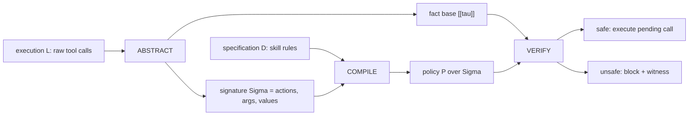

# VIGIL：把 Agent Skills 的自然语言规范变成运行时可执行约束

## 元信息

| 字段 | 内容 |
|---|---|
| 论文 | VIGIL: Runtime Enforcement of Behavioral Specifications in AI Agent Skills |
| 链接 | https://arxiv.org/abs/2606.26524v1 |
| 版本 | arXiv v1，2026-06-25 |
| 方向 | AI 安全；LLM Agent；Agent Skills；运行时策略 enforcement |
| 核心问题 | Skill 文档里写着“先验证再使用”“不能泄露 secret”“不能覆盖上下文”，但真实 Agent 执行时谁来强制这些规则？ |

## TL;DR

- **VIGIL 研究的是 Agent Skills 的运行时约束问题**：技能包常用自然语言说明权限、前置条件、数据泄露边界和产物验证要求，但当前 Agent 运行时通常只是让模型“记得遵守”，缺少独立、可阻断的执行时检查。
- **论文的关键判断是：很多违规不是单个坏工具调用，而是跨步骤的轨迹违规**。例如一个中间产物没有验证就被下游消费，最后输出格式仍然合法；单步 allowlist、sandbox 或 prompt-level guardrail 很难看见这种时间顺序和 artifact identity。
- **VIGIL 的方法是三段式**：先把工具调用日志抽象为 typed event trace 和 fact base，再把 skill 规范编译成基于当前 trace vocabulary 的 policy，最后把有限轨迹安全性质展开为 SMT 约束，用 solver 给出 safe/unsafe 和 offending witness。
- **策略语言覆盖六类常见模式**：absence、precedence、response、bounded response、resolve、until；同时支持参数约束、输出模式、状态、共享变量绑定和过去/未来 temporal shorthand。
- **实验给出清晰数字**：在 SkillsBench + Skill-Inject 的 152 条标注执行上，VIGIL 检出 72 个违规中的 69 个，FP 为 8，precision 89.6%，recall 95.8%，F1 92.6%；比最强 baseline 高 15.8 F1 points。
- **跨基准迁移也不是只赢在定制数据**：AgentDojo 上 VIGIL F1 为 94.2%，SafeAgentBench 上为 96.3%，无需每个 benchmark 单独调规则；但这两类基准更多是单步边界可见违规，所以领先幅度很小。
- **消融说明关键来自“参数 grounding”和“结构化 policy”**：去掉 argument grounding，recall 从 95.8% 掉到 63.9%；去掉 policy structure，recall 掉到 90.3%，说明只看 action name 或让 LLM 直接判案都不够。
- **真实技能包研究覆盖 216 次执行，发现 34 个确认违规**，涉及 Trail of Bits、NVIDIA、Cloudflare、Databricks、Anthropic、Microsoft Deep Wiki 等生态；NVIDIA 承认了一个 skill 规范缺口可能造成 GPU 成本风险。
- **局限同样明确**：VIGIL 依赖 trace 可观测性；如果关键行为藏在 opaque script 内部，trace 里没有事实，它会漏报。另一个边界是 specification compilation fidelity，LLM 可能把“bulk calendar edit”过度泛化成任何 calendar edit。

## 1. 论文真正要解决什么问题？

### 问题不是“Agent 能不能调用工具”，而是“调用序列是否履约”

- 现在的 Agent Skills 正在从提示词技巧变成可安装能力包：
  - assistant 平台给模型装文档处理、表格处理、邮件处理技能；
  - 云厂商把部署、集群、数据仓库操作封装成技能；
  - 安全和代码平台把 fuzzing、review、CI、secret 管理写成 reusable workflow。
- 每个 skill 往往带有自然语言边界：
  - 删除前必须确认；
  - 使用 secret 时不能通过 shell 透传；
  - 中间 artifact 被消费前必须验证；
  - CLI 版本不满足要求时必须停止；
  - 不能覆盖已有 `AGENTS.md` 或上下文文件。
- 这些规则看起来像 policy，但在很多运行时里只是**文档**：
  - Agent 自己读规则；
  - Agent 自己解释规则；
  - Agent 自己判断是否遵守；
  - 出错后再由离线日志或 LLM judge 复盘。

### VIGIL 的切入点：违规可能藏在“负空间”

论文用自动驾驶感知管线做 motivating example：

| 需求 | 人类语义 | 轨迹层含义 |
|---|---|---|
| R0 | 采样率必须是 6 FPS | 所有 sampleRate 事件都应满足 `v = 6` |
| R1 | JSON/CSR 输出交付前要验证 | handoff 前必须有 output validation |
| R2 | mask 只能在全局运动补偿后产生 | `emit_mask` 前必须出现 `globalAlign` 或 warp |
| R3 | 需要验证的 artifact 被下游消费前必须先验证 | 若 `consume(x)`，此前必须有 `valid(x)` |

关键违规发生在 R3：

- 上游 egomotion skill 生成相机运动估计 `M`；
- 下游 mask skill 消费同一个 `M`；
- 最终 CSR mask 通过 schema validation；
- 但 `M` 本身没有被验证。

这个例子重要，因为它把安全问题从“坏命令”改写成“坏历史”：

- 单个 `warp` 调用看起来合法；
- 单个 `validate_output(mask)` 也合法；
- 最终文件格式合法；
- 真正缺失的是“在消费 `M` 之前验证 `M`”这个历史事实。

### 现有防线分别缺什么？

| 防线 | 能看到什么 | 盲点 |
|---|---|---|
| sandbox / resource boundary | 文件、网络、进程、凭证边界 | 不知道 artifact 是否按 skill 规范验证 |
| action-boundary guardrail | 当前 pending tool call | 看不到几步前产生的值、前置事件和跨调用 identity |
| information-flow tracking | taint / provenance | 关注污染传播，不等价于行为义务 |
| LLM-as-judge / offline trajectory analyzer | 完整 trace 的文本 | 通常离线、非确定性、不能在调用落地前阻断 |

VIGIL 的 claim 是：

- 如果违规依赖**时间顺序**、**artifact identity**、**缺失事件**或**跨工具 value flow**，就需要一个独立于 Agent 的 trace-grounded runtime monitor。
- 这个 monitor 不能只问模型“你觉得安全吗”，而要把执行事实和 policy 编译成可判定的约束。

## 2. VIGIL 的总体机制

### 三段式：Abstract → Compile → Verify



### 每一步在论证里承担什么功能？

| 阶段 | 输入 | 输出 | 解决的难点 |
|---|---|---|---|
| ABSTRACT | 原始工具调用日志 `L` | typed events、signature、fact base | 原始日志格式混乱，必须变成可推理事实 |
| COMPILE | 自然语言 skill 规范 `D` + 当前 trace vocabulary | policy `P` | 规则必须用当前 run 里实际出现的 action、argument、value 表达 |
| VERIFY | `[[tau]]` + `P` | safe / unsafe + witness | 需要确定性 verdict，并定位 offending invocation |

### 为什么它不是“把 LTL 丢给 solver”？

论文强调 VIGIL 只处理**有限轨迹 safety patterns**，不是任意 temporal logic：

- trace 是已经观察到的有限事件序列；
- 每条 policy 展开后只对有限事件集合量化；
- 每个 action、argument、value 都来自 run 的 signature；
- 最终 SMT query 是 quantifier-free 的有限结构问题。

这让 VIGIL 的在线 check 能保持工程可部署性：

- policy compilation 可能较慢，但可以缓存；
- solver verify 路径平均 0.27 秒；
- 违规时可以从 unsatisfiable core 直接读出 witness。

## 3. Trace abstraction：把工具调用变成事实库

### Typed event 的四个字段

VIGIL 把每个工具调用抽象为：

```text
e = < a(e), e[.], s(e), o(e) >
```

变量解释：

- `a(e)`：action 类型，例如 `warpAffine`、`validate_output`、`databricks bundle deploy`；
- `e[.]`：argument map，用名字索引参数，例如 `file_path`、`target`、`transform`；
- `s(e)`：status，成功或失败；
- `o(e)`：bounded output observation，足够支持模式匹配，但不把无限输出塞进 solver。

### Signature 和 fact base

论文定义：

```text
Sigma = (A, K, V)

A = { a(e) | e in E }
K = union dom(e)
V = { e[k] | e in E and k in dom(e) } union { o(e) | e in E }
```

对应 fact base：

```text
[[tau]] =
  union_e ( { a(e), s(e), o(e) } union { e[k] | k in dom(e) } )
  union { e_i < e_j | i < j }
```

这两个对象的意义不同：

| 对象 | 角色 |
|---|---|
| `Sigma` | policy 可以使用的 vocabulary；防止编译器凭空发明 action 或 value |
| `[[tau]]` | 当前执行到底发生了什么；包括事件字段和顺序关系 |
| closed-world assumption | trace 中没有的事实视为没有发生；缺失前置检查因此可以被判为违规 |

### 为什么 argument grounding 是核心？

只知道“调用了 validate”和“调用了 consume”还不够，因为 policy 往往要求验证和消费的是同一个对象。

例如：

```text
prec(
  consume(transform = x),
  validate(target = x)
)
```

这里 `x` 把两个事件绑定到同一个 artifact：

- 如果验证的是 `mask`，消费的是 `M`，不算满足；
- 如果验证发生在消费之后，也不算满足；
- 如果 trace 中根本没有 `validate(target=M)`，closed world 会让缺失成为证据。

这解释了消融结果：去掉 argument grounding 后，VIGIL 只能做 action-level 近似，recall 直接从 95.8% 掉到 63.9%。

## 4. Policy language：从自然语言规范到六类有限轨迹规则

### 基本语法

论文的 policy language 可以概括成：

```text
P ::= { phi_1, ..., phi_m }

phi ::= abs(psi)
      | prec(psi, psi')
      | resp(psi, psi')
      | bresp_l(psi, psi')
      | rslv(psi, psi')
      | until(psi, psi', psi_b)
      | Box Theta

psi ::= action pattern
      | argument constraint
      | output pattern
      | status constraint
      | shared variable binding
      | conjunction
```

### 六种 preset form 各自对应什么直觉？

| 形式 | 直觉 | Agent skill 例子 |
|---|---|---|
| `abs(psi)` | 某类事件不能出现 | 禁止把 secret 通过 shell 参数传给 CLI |
| `prec(psi, psi')` | 做 `psi` 前必须先做 `psi'` | 删除源文件前必须验证 archive |
| `resp(psi, psi')` | 做 `psi` 后必须后续响应 | 创建临时 credential 后必须 revoke |
| `bresp_l(psi, psi')` | 响应必须在 l 步内发生 | 下载敏感文件后 l 步内清理 |
| `rslv(psi, psi')` | 最终状态必须被解决 | 最终交付 Excel 前公式错误为 0 |
| `until(psi, psi', psi_b)` | 触发后到解除前禁止坏事件 | 审批前不能执行部署命令 |

### 形式化为什么必要？

如果只让 LLM judge 看自然语言和 trace，有两个问题：

- 不能稳定阻断 pending call；
- 不能保证同一 policy 在相似 trace 上给出一致 verdict。

VIGIL 的做法是：

1. LLM 只负责把自然语言规范草拟成结构化 PolicyDocument；
2. deterministic parser 校验 policy 是否只使用 observed signature；
3. SMT 编码负责最终判断；
4. solver 的 unsat core 负责定位 witness。

也就是说，LLM 参与的是“规范翻译”，不是“是否违规”的最终判案。

## 5. SMT 编码：把每条 policy 展开成有限事件上的约束

### 以 precedence 为例

对 `prec(psi, psi')`，论文给出的核心展开可以写成：

```text
R_phi = AND_e ( psi(e) => OR_{e' < e} psi'(e') )
```

直译：

- 对每个事件 `e`；
- 如果 `e` 命中需要前置条件的 pattern `psi`；
- 那么在 `e` 之前必须存在一个事件 `e'` 命中前置 pattern `psi'`。

如果有共享变量 `x`，还要加上 value equality：

```text
R_phi(e) =
  psi(e) =>
    OR_{e' < e} ( psi'(e') AND e'[target] = e[transform] )
```

### 违规如何定位？

VIGIL 判断：

```text
unsat( [[tau]] AND R_phi )  <=>  tau does not satisfy phi
```

这里容易误解：它不是问“是否存在一个违规模型”，而是把完整 trace facts 和 policy requirement 放在一起。

- 如果 facts 与 requirement 能共存，说明 trace 满足该 requirement；
- 如果 facts 与 requirement 冲突，说明当前 trace 已经违反；
- solver 给出的 minimal unsatisfiable core 会包含造成冲突的 event condition；
- `loc(phi)` 再把该 condition 映射回 offending event。

### 运行时阻断发生在哪里？

论文把部署模型说得比较具体：

- runtime 或 gateway 在 tool pre-use hook 处暂停 pending operation；
- VIGIL 以“到目前为止的 trace prefix + pending event”做检查；
- flat prohibition 和 precondition 可在调用落地前阻断；
- response / final-state obligation 这类后续义务可在 run end 或相应 checkpoint 判断；
- unsafe 时返回 localized witness，部署环境可以 halt、rollback、replan 或 ask user approval。

这比离线安全评估强的地方在于：

- 它能在副作用发生前挡住调用；
- 它给出的是可追溯 witness，而不是一句自然语言风险解释；
- 它不把被 prompt injection 影响的 Agent 当作解释 policy 的权威。

## 6. 实验设计：作者到底怎样证明有效？

### 主数据集 SB+SI

| 数据来源 | 构造方式 | 用途 |
|---|---|---|
| SkillsBench | 筛出 skill 文档含可检查行为义务的轨迹，并人工标注 | 真实 skill 运行轨迹 |
| Skill-Inject | 用 Claude Code replay 任务，记录执行并标注 | 注入场景下的 agent skill 违规 |
| 合并结果 | 152 条执行：72 条违规，80 条 benign | 主实验 SB+SI |

作者的标注规则偏保守：

- 只有当 skill 文档中有 trace-checkable obligation 时才纳入；
- 只有当责任事件序列能从 trace 中识别时才标为违规；
- 如果只是任务质量差、规范歧义或 trace 证据不足，就不强行归类。

### Baseline 选择

| Baseline | 代表什么 | 论文中如何适配 |
|---|---|---|
| AgentSpec | action-boundary enforcement | 使用其接口能表达的最接近规则 |
| Progent | per-tool permission allowlist | 以 blocked action 作为 reported violation |
| LLM-as-judge | whole-trace informal judgment | 给 Claude Opus 4.6 完整 trace 和规范，让它输出二分类 |

这个设置有一个重要公平性边界：

- AgentSpec / Progent 不被额外赋予 VIGIL 式 trace memory；
- LLM-as-judge 不拿 VIGIL alert、SMT witness 或 ground truth；
- 所有系统用相同 policy source 和 execution trace 评分。

## 7. 主结果：VIGIL 赢在哪里？

### Table 1 的核心数字

| Benchmark | Tests | System | TP | FP | Precision | Recall | F1 |
|---|---:|---|---:|---:|---:|---:|---:|
| SB+SI | 152 | VIGIL | 69 | 8 | 89.6% | 95.8% | 92.6% |
| SB+SI | 152 | AgentSpec | 34 | 12 | 73.9% | 47.2% | 57.6% |
| SB+SI | 152 | Progent | 40 | 47 | 46.0% | 55.6% | 50.3% |
| SB+SI | 152 | LLM-as-judge | 48 | 5 | 90.6% | 66.7% | 76.8% |
| AgentDojo | 629 | VIGIL | 298 | 35 | 89.5% | 99.3% | 94.2% |
| SafeAgentBench | 546 | VIGIL | 234 | 4 | 98.3% | 94.4% | 96.3% |

### 为什么 SB+SI 上差距最大？

SB+SI 的违规更符合 VIGIL 的目标：

- 违规依赖历史 artifact；
- 违规依赖“缺少前置事件”；
- 违规需要区分相同 action 下不同 argument；
- 违规可能跨多个 skill 组合出现。

因此：

- AgentSpec / Progent 的单步边界看不到历史对象；
- Progent 的 allowlist 容易 over-block benign 调用，FP 达 47；
- LLM-as-judge 能看完整 trace，但缺形式化 grounding，漏掉 24 个 temporal violation；
- VIGIL 同时保留 trace memory、value binding 和确定性判定。

### Balanced Enforcement Error

论文还定义了一个平衡错误率：

```text
BEE = 1/2 * (FNR + FPR)
```

变量解释：

- `FNR`：真实违规但没拦住的比例；
- `FPR`：benign 执行被误拦的比例；
- BEE 把“漏拦风险”和“误拦成本”同等计入。

作者报告宏平均 BEE：

| System | Macro BEE |
|---|---:|
| VIGIL | 5.4% |
| LLM-as-judge | 12.5% |
| AgentSpec | 15.2% |

这组数字说明 VIGIL 不是靠“多报违规”堆 recall，而是在漏报和误报之间更均衡。

## 8. 消融：两个结构为什么不可替代？

### Ablation 结果

| 配置 | Precision | Recall | FPR | F1 | 主要损失 |
|---|---:|---:|---:|---:|---|
| VIGIL | 89.6% | 95.8% | 10.0% | 92.6% | - |
| w/o Argument Grounding | 78.0% | 63.9% | 16.2% | 70.2% | 不能追踪路径、模式、payload、target object |
| w/o Policy Structure | 86.7% | 90.3% | 12.5% | 88.4% | 更容易生成过宽 `abs`，漏掉时序/终态义务 |

### 解释一：没有 argument grounding，policy 退化成 action name 检查

例如一个规则是：

```text
archive(x) must be valid before removeSource(x)
```

如果没有 argument grounding：

- 系统只能知道有 `archive`；
- 也知道有 `removeSource`；
- 但不知道 remove 的是不是同一个 source；
- 更不知道 validArchive 的 target 是否匹配。

这会同时造成漏报和误报：

- 漏报：验证了另一个对象，却被误认为满足；
- 误报：对象实际已验证，但 action-only 规则没识别到匹配关系。

### 解释二：没有 policy structure，LLM 编译容易过宽或过窄

论文给出的典型 false positive 是 calendar edit：

- 原始规范只限制 **bulk modifications**；
- 编译后的 statement 丢了 `bulk` 限定；
- 结果一个 benign single-event reschedule 也被挡下。

这说明 VIGIL 的 LLM 组件仍有边界：

- 它能把自然语言转成结构化 policy；
- 但如果语义限定词丢失，solver 会严格执行错误 policy；
- 因此未来需要更强的 compilation prompting、schema validation 和人工/自动校验。

## 9. 运行时成本：慢在哪里，快在哪里？

### Runtime breakdown

| 阶段 | 平均耗时 | 占比 | 解释 |
|---|---:|---:|---|
| ABSTRACT | 0.063s | 1.4% | 解析 trace、生成 facts 和 signature |
| COMPILE | 4.05s | 92.5% | 单次 LLM policy compilation |
| VERIFY | 0.27s | 6.2% | SMT 检查与 witness 定位 |
| End-to-end | 4.38s | 100% | 每条 trace 平均总成本 |

### 为什么作者认为可部署？

- 真正在线阻断路径的 solver check 是 0.27s；
- 最大成本是 LLM 编译，但 policy 可以按 skill / bundle 缓存；
- 随 trace 变长，暴露给 COMPILE 的 vocabulary 约在 10KB 左右饱和；
- 对 coding agent 这类任务，单个 shell 命令常耗时数秒，整个任务可能持续数分钟，4 秒级策略编译不一定是主瓶颈。

需要保留的怀疑点：

- 如果每个 skill bundle 都动态变化，缓存收益会下降；
- 如果 trace collector 粒度不足，solver 再快也没事实可查；
- 如果企业 runtime 需要毫秒级延迟，COMPILE 必须离线或预编译。

## 10. 真实 skill bundle 研究：34 个确认违规意味着什么？

### 代表性发现

| 生态 | 根因 | 观察到的违规 | 影响 |
|---|---|---|---|
| Trail of Bits | ASan / fuzzer obligation 分散在多个 skill | 启用 ASan 后仍带 memory limit fuzzing | 可能漏掉 crash |
| NVIDIA | Slurm workflow 缺少 retry bound | 评估失败后无限 GPU resubmission | GPU 成本 |
| Cloudflare | 示例与 bundle secret rule 冲突 | secret 通过 shell 传入 `wrangler` | secret exposure |
| Databricks | CLI-version gate 没传播到操作 skill | 版本不满足仍执行部署命令 | partial deploy |
| Anthropic | 忽略 `data_only=True` 保存警告 | workbook 保存后公式丢失 | formula loss |
| Microsoft Deep Wiki | 忽略 never overwrite 规则 | 覆盖已有 `AGENTS.md` | context loss |

### Trail of Bits / NVIDIA 案例说明了 composition gap

Trail of Bits 的 fuzzing bundle 中：

- `address-sanitizer`、`aflpp`、`libfuzzer` 是不同 skill；
- ASan 文档说明它映射大量虚拟地址空间；
- fuzzing 时必须关闭对应 memory limit；
- AFL++ 和 libFuzzer 使用不同 flag 表达这一义务。

Agent 的错误不是“没读某一条命令说明”，而是没有把多个 skill 的义务组合起来：

- 编译时用了 `-fsanitize=address`；
- fuzzing 时没有加 `-m none` 或 `-rss_limit_mb=0`；
- trace 中每个命令都像是合法命令；
- 组合后却可能让 fuzz campaign 静默失效。

NVIDIA 案例类似：

- Slurm workflow 缺少 liveness / retry bound；
- evaluation failure 后可能反复提交 GPU 作业；
- VIGIL 把它定位为跨步骤、跨规范的组合级缺口；
- 作者报告后，NVIDIA acknowledged 这是实际成本风险。

### Databricks 案例说明了 execution gap

Databricks skill 中已有规则：

- CLI 缺失或版本低于 `v0.292.0` 时应停止；
- 不应尝试 workaround。

但 operational skills 又指导 Agent 运行：

- `databricks bundle deploy`；
- pipeline 相关命令；
- 其他部署动作。

在 probed trace 中：

- version check 返回 non-matching；
- Agent 仍继续执行 Databricks command；
- VIGIL 把它编码成 precedence rule：

```text
prec(
  databricks_command,
  successful_version_check(cli_version >= 0.292)
)
```

因为 trace 中没有满足条件的前置事件，VIGIL 阻断部署调用。

## 11. 论文的 Figure / Table 证据如何读？

| 证据 | 支持的主张 | 不能证明什么 |
|---|---|---|
| Figure 1 感知管线 | 单步合法序列也能组合成违规 | 不代表所有安全问题都能抽象为 artifact validation |
| Figure 2 生命周期 | VIGIL 可在 pending invocation 前检查 trace prefix | 没证明所有 runtime 都有可用 pre-tool hook |
| Figure 4 policy language | 六类 finite-trace safety form 覆盖许多 skill 规则 | 不覆盖任意 liveness、概率风险或开放式质量偏好 |
| Table 1 主结果 | VIGIL 在 trace-level 违规上明显优于 baseline | SB+SI 是作者构造标注集，需要更多独立复现 |
| Table 2 消融 | argument grounding 是最大贡献 | 不说明 compilation LLM 最优 |
| Table 3 真实案例 | 问题存在于实际 skill 生态 | 样本不是随机市场普查，不能估计总体发生率 |
| Table 4 runtime | SMT verify 很快，compile 是瓶颈 | 没覆盖超大企业 trace、并发 gateway、低延迟生产 SLA |

## 12. 与近期 Agent 安全工作的关系

### 和 prompt injection 防御的关系

VIGIL 不直接回答“哪些输入是恶意的”。

- CaMeL / FIDES / Progent / FORGE 这类模型外防御更关注 prompt injection、tool-call permission、上下文隔离或数据影响。
- VIGIL 更关注：给定 skill 本来有行为规范，真实 trace 是否违反。
- 它可以和 prompt-injection 防御组合：
  - injection 防御减少恶意指令进入决策；
  - VIGIL 检查即便 Agent 被影响，pending action 是否越过规范边界。

### 和 information flow tracking 的关系

VIGIL 不是传统 taint tracking：

- taint 问“某个输出是否受不可信输入影响”；
- VIGIL 问“某个行为序列是否满足 skill 的时序和对象义务”。

两者可以重叠：

- secret 透传 shell 是信息流问题；
- “secret 不能以 shell argument 传给 wrangler”也可编码为 VIGIL absence / until policy。

但 VIGIL 更强调 artifact-level obligation：

- 验证后才能消费；
- 失败后不能 retry 无界；
- 版本 gate 不满足不能部署；
- 终态交付必须满足完整性条件。

## 13. 局限与失败边界

### 边界一：trace observability

论文最重要的 false negative 来自 `secure_archive.py`：

- trace 只看到 Agent 调用了脚本；
- 脚本内部创建了非真正加密的 ZIP；
- `zf.setpassword` 对写入无效；
- 脚本随后 `unlink` 源文件；
- 这些关键行为都没有作为 tool event 暴露。

结论：

- VIGIL 的判断只能覆盖 collector 看得见的事实；
- 如果关键副作用藏在脚本、容器、远程服务或二进制内部，必须进一步 instrument；
- 这不是 SMT 层能修复的问题，而是 runtime observability 问题。

### 边界二：specification compilation fidelity

LLM 编译 policy 仍可能错：

- 把“bulk calendar modification”编译成所有 calendar edit；
- 把 temporal precondition 编成 broad absence；
- 漏掉限定词、例外条件或 scope。

这带来一个工程要求：

- production 部署不能把 LLM 编译结果直接当圣旨；
- 应有 schema validation、unsupported fallback、reviewable policy diff；
- 高风险 skill 的 policy 可能需要人工签核或单元测试。

### 边界三：policy 类型仍是 finite-trace safety

VIGIL 擅长：

- forbidden event；
- required prior event；
- required later event；
- bounded response；
- final-state resolution；
- interval guard；
- artifact identity binding。

它不直接解决：

- 统计式风险阈值；
- 长期概率安全；
- 开放式输出质量；
- “用户体验是否好”；
- 没有明确 trace obligation 的偏好类规则。

## 14. 结论：VIGIL 改变了什么？

### 最值得带走的判断

- **Agent Skills 的安全边界不能只写在文档里**。只要运行时仍让被攻击的 Agent 自己解释规范，skill ecosystem 越丰富，跨 skill 组合违规越难靠 prompt 自律解决。
- **运行时 policy 应该从“单步 allow/deny”升级到“trace-level contract checking”**。很多真实问题依赖历史、缺失事件、artifact identity 和跨调用 value flow。
- **LLM 可以参与 policy 编译，但不应负责最终 verdict**。VIGIL 的设计把可变的语义翻译和确定性的 solver checking 分开，这是它比 LLM-as-judge 更适合 runtime enforcement 的原因。
- **观测粒度决定安全上限**。如果 runtime 只记录“调用了脚本”，不记录脚本内关键副作用，那么再形式化的 policy 也只能看到表面。

### 对后续 Agent 安全研究的追问

- 如何把 VIGIL 式 trace facts 扩展到 shell script、Python helper、browser action、MCP server 内部状态？
- Skill marketplace 是否应该要求每个 skill 附带机器可检查的 policy tests，而不仅是自然语言说明？
- 复杂 skill bundle 的全局 policy 冲突能否在安装时静态检测，而不等到运行时触发？
- 当 policy compilation 由 LLM 完成时，如何构造 adversarial spec tests，专门检查限定词、scope 和 exception 是否被丢失？
- 对高风险领域，例如云部署、医疗数据、自动驾驶、金融操作，VIGIL 的 finite-trace safety form 是否足够，还是需要与权限系统、信息流和形式化流程证明结合？

## 15. 如果要复现或扩展，应该从哪里下手？

### 复现实验不应只复现最终 F1

VIGIL 这类系统的核心不只是分类准确率，而是“从规范到阻断”的整条链路。因此复现时建议拆成四个可单独失败的检查点：

| 检查点 | 应记录的变量 | 失败时说明什么 |
|---|---|---|
| Trace capture | 工具名、参数名、返回状态、输出摘要、事件顺序 | collector 看不见关键事实，后续 solver 无从判断 |
| Signature construction | action set、argument key set、value set | policy vocabulary 可能不完整或过宽 |
| Specification compilation | 每条自然语言规则对应的 form、pattern、共享变量 | LLM 可能丢失限定词、scope 或 object binding |
| SMT verification | 每条 statement 的 verdict、unsat core、localized event | 形式化规则是否真的定位到责任调用 |

这也给出了一个更细的研究问题：如果复现者只报告 VIGIL 对某个 benchmark 的 F1，却不公开 compilation error、unsupported clause、trace-observability miss，那么很难判断系统到底是“规范解释强”，还是“数据集刚好规则简单”。

### 一个更严格的复现协议

可以把每条样本拆成五份 artifact：

1. **Skill 规范原文**：只保留执行前 Agent 能看到的 skill 文档、bundle rule 和 operator rule。
2. **原始 trace**：保留 tool call、参数、状态、stdout/stderr 摘要和 artifact id。
3. **人工最小 policy**：由复现者手写一份最小可检查规则，作为 LLM compilation 的参照。
4. **VIGIL 自动 policy**：记录模型编译出的 PolicyDocument、unsupported 项和 schema validation 结果。
5. **verdict witness**：保存 solver verdict、unsat core、offending event id 和人工标签。

这样可以区分三种错误：

- **观测错误**：人工 policy 也查不出，因为 trace 没事实；
- **编译错误**：人工 policy 能查出，自动 policy 查不出或误报；
- **验证错误**：policy 正确但 SMT 编码或 witness 解析出错。

### 还可以增加哪些 adversarial case？

论文已有 opaque script 和 calendar qualifier 两类失败边界，但还可以继续构造更强压力测试：

- **同名不同对象**：两个文件都叫 `result.json`，但位于不同目录；policy 必须绑定完整路径或 artifact id。
- **晚到验证**：先消费 artifact，后面才验证；离线看全局有 validation，但 precedence 仍应失败。
- **部分验证**：只验证 schema，不验证内容约束；policy 需要区分 `validate_format(x)` 与 `validate_semantics(x)`。
- **条件例外**：普通部署需 approval，dry-run 部署不需要；编译器必须保留 mode 条件。
- **跨 skill 冲突**：一个 skill 示例推荐 shell 传 secret，另一个 bundle rule 禁止 shell secret；系统应暴露规范冲突，而不是只责怪 Agent。

这些 case 的价值在于它们都不是“恶意 prompt 是否明显”的问题，而是检查 VIGIL 的核心承诺：能否在实际 trace 里保留对象身份、时序关系和规范边界。

### 和形式化方法的连接点

VIGIL 的有趣之处在于它没有要求用户直接写完整 temporal logic，而是给出一组 agent skill 常见 form：

```text
abs, prec, resp, bresp, rslv, until
```

这更像一个受限 DSL：

- 足够表达大量运行时安全义务；
- 足够有限，能展开成 quantifier-free SMT；
- 足够贴近 skill 文档，便于从自然语言编译。

后续研究可以沿两个方向推进：

- **向上**：让 skill 作者在文档旁边写半结构化 policy hints，减少 LLM 编译歧义；
- **向下**：让 runtime 暴露更细粒度的 provenance、file diff、network request、script syscall 和 MCP server 内部操作。

如果只加强上层 policy，而不加强底层观测，VIGIL 会继续受 opaque script 限制；如果只加强底层观测，而不约束 policy language，又会让 solver 和编译器面对过大的状态空间。论文真正给出的折中是：用有限 form 管住表达能力，用 trace grounding 管住事实来源。

## 参考来源

- 原文：VIGIL: Runtime Enforcement of Behavioral Specifications in AI Agent Skills，https://arxiv.org/abs/2606.26524v1
- arXiv PDF：https://arxiv.org/pdf/2606.26524v1
- 论文源文件：arXiv e-print 2606.26524
