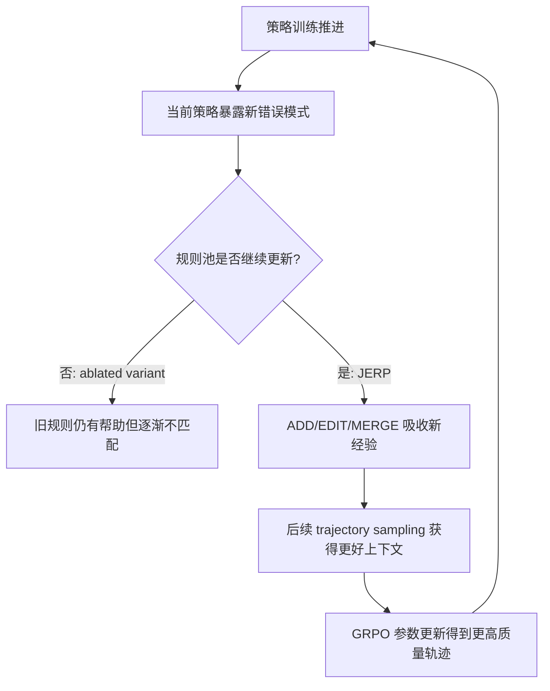

# JERP：把 Agent 的经验规则和策略参数放进同一个训练闭环

### 元信息与 TL;DR

- **论文**：Joint Learning of Experiential Rules and Policies for Large Language Model Agents
- **作者**：Shicheng Ye, Chao Yu
- **机构**：Sun Yat-sen University
- **日期**：2026-06-25
- **原文**：[arXiv:2606.27136v1](https://arxiv.org/abs/2606.27136v1)
- **方向**：大模型 Agent / 经验复用 / 强化学习后训练 / 长程交互

**TL;DR：**

- JERP 研究的问题是：多步交互 Agent 积累了很多轨迹经验后，应该只把经验写成 prompt 规则，还是只用轨迹奖励更新模型参数。作者认为这两个路径各有盲区，前者可解释但会随策略变化而过期，后者能改全局策略但对稀疏奖励里的局部错误纠偏慢。
- 方法上，JERP 为每个任务维护一个长期经验规则池 `K(d)`，每轮按 utility score 取 top-k 规则作为 working rule set，和任务描述、交互历史一起送入策略模型；同一批 trajectory group 结束后，同时做 GRPO 风格的参数更新和 contrastive reflection 风格的规则池更新。
- 规则池不是只追加文本记忆，而是用 `ADD / EDIT / UPVOTE / DOWNVOTE / MERGE` 五类结构化编辑维护：新增经验、修正规则、强化有用规则、削弱无效规则、合并语义相近规则，并用分数和容量约束做剪枝。
- 实验在 AlfWorld 和 WebShop 上做。AlfWorld 报 task success rate，WebShop 报 average score 和 success rate；训练使用 LoRA，group sampling size 为 8，discount factor 为 0.95，AlfWorld 训练 200 epochs，WebShop 训练 300 epochs。
- 主结果：JERP 在 AlfWorld overall success rate 达到 **61.5%**，高于 GRPO 的 **57.8%** 和 RLOO 的 **48.7%**；WebShop average score 为 **79.0**，success rate 为 **64.1%**，也高于 GRPO 的 **78.1 / 56.2%** 和 RLOO 的 **71.9 / 57.8%**。
- 细分结果不是全胜：AlfWorld 的 Pick 和 Look 上 GRPO 更高，JERP 的收益集中在 Clean、Heat、Cool、Pick2 这些更长、更有中间约束的任务。这支持作者的核心判断：规则池最适合保存反复出现的局部操作约束。
- 消融把规则池更新暂停在初始阶段，完整 JERP 的训练曲线持续更高；固定规则池早期仍有帮助，但后期无法吸收新轨迹暴露出来的错误模式。这个证据直接指向“动态规则池”而不是“多塞一点 prompt 记忆”。
- 局限也很清楚：论文没有公开代码；规则更新依赖冻结 LLM 生成结构化编辑，可能引入解析错误或语义漂移；top-k 规则检索只是按任务内分数排序，没有做细粒度实例检索；实验集中在 AlfWorld/WebShop，不能直接证明真实浏览器、工具调用或多 Agent 环境中同样稳健。

### 研究问题：Agent 的经验到底应该放在哪里？

作者把多步 Agent 的经验复用拆成两个常见范式：

| 范式 | 经验保存位置 | 优点 | 关键问题 |
|---|---|---|---|
| Prompt-based rule learning | 模型外部的自然语言规则、反思、手册、技能库 | 可解释、可编辑、可快速修正局部错误 | 规则只有被当前策略正确读懂才有效；策略训练后，旧规则可能过期 |
| RL policy optimization | 模型参数内部 | 改变更广泛的动作分布；不依赖每次 prompt 都塞规则 | 长程任务奖励稀疏，局部但关键的错误未必被及时归因 |
| JERP | 同一轮训练里同时更新规则池和策略参数 | 让规则池跟着策略演化，并把稳定行为逐渐吸收到参数里 | 系统更复杂，规则编辑质量和检索策略成为新瓶颈 |

这篇论文真正关心的不是“记忆会不会提升 Agent”，而是更具体的问题：

- 当 Agent 的策略参数不断变化时，外部经验规则怎样避免和新策略脱节？
- 当环境只在 episode 结束时给稀疏 reward 时，参数更新怎样获得足够细粒度的局部纠错信息？
- 能否让同一批交互轨迹承担两种功能：
  - 一方面作为 RL 的训练样本；
  - 另一方面作为规则池维护的证据材料？

这个问题对大模型 Agent 很关键。很多 Agent 系统已经有 memory、reflection、manual、skill library，但这些外部知识常常停留在 prompt 层；后训练系统则偏向把轨迹变成梯度。JERP 的贡献在于明确把二者视为同一个优化对象。

### 论文主张与论证路线

| Claim | Mechanism | Evidence | Boundary |
|---|---|---|---|
| 只靠外部规则不够，因为规则会随策略变化而过期 | 每轮训练重新用当前 trajectory group 和成功参考轨迹更新规则池 | 消融中固定规则池的变体后期提升放缓，完整 JERP 曲线更高 | 论文没有给出规则语义漂移的人工标注，只通过任务成功率间接证明 |
| 只靠参数更新也不够，因为长程任务里局部错误纠偏慢 | 同一批轨迹除用于 GRPO 外，还用于生成规则编辑操作 | JERP 在 Clean、Heat、Cool、Pick2 上超过 GRPO，这些任务中间约束更多 | Pick、Look 上 GRPO 更强，说明规则池不是所有子任务都增益 |
| 经验规则需要“维护”，不能只追加 | 使用 ADD、EDIT、UPVOTE、DOWNVOTE、MERGE 五类操作，加分数和容量限制 | Algorithm 1 把规则更新、分数更新、剪枝放入训练循环 | 规则编辑由冻结 LLM 生成，解析和质量控制仍是工程风险 |
| 规则和参数应该共享轨迹来源 | `T_d` 同时进入 `Update_theta` 和 `Update_K` | 训练目标 `J(theta, K)` 明确把策略参数和规则池共同放进 trajectory distribution | 目标写得联合，但实际更新仍是交替式两阶段近似 |
| JERP 更适合约束多、步骤长的任务 | 工作规则集在 episode 内固定，保留任务级中间约束 | Figure 4 显示中后期在 Heat、Cool、Clean、Pick2 更明显拉开 | 没有测试开放 Web、真实工具 API、长期跨任务迁移 |

这条论证路线的核心不是把“规则”和“梯度”简单相加。

- 规则池解决的是**可见的局部经验**：
  - 例如“看物体前要先打开光源”；
  - 例如“某个容器交互失败后先重新观察位置”。
- 参数更新解决的是**不可直接枚举的策略分布**：
  - 哪类动作更可能在某种历史下成功；
  - 哪类探索序列整体更优。
- JERP 试图让二者同步：
  - 规则为后续采样提供更好的上下文；
  - 采样得到的新轨迹又修正规则；
  - 稳定有效行为再通过 RL 进入参数。

### 方法机制：把 POMDP、规则池和 GRPO 拼成一个闭环

论文先把任务写成部分可观察马尔可夫决策过程：

```text
E = (S, A, O, P, Omega, R, gamma, T)

S      hidden state space
A      action space
O      observation space
P      transition function
Omega  observation function
R      reward function
gamma  discount factor
T      maximum interaction steps
```

Agent 在每个时间步看不到真实状态 `s_t`，只能基于历史：

```text
h_t = (o_0, a_0, o_1, ..., a_{t-1}, o_t)
```

JERP 相比普通 POMDP policy 多了一个外部经验入口：

```text
x_t = (d, h_t, K_tilde(d))
a_t ~ pi_theta(. | x_t)
```

变量解释：

| 符号 | 含义 | 在 JERP 中的作用 |
|---|---|---|
| `d` | 当前任务实例 | AlfWorld 中可理解为一个具体 household task，WebShop 中是一个购物需求 |
| `K(d)` | 任务 `d` 的长期经验规则池 | 存储自然语言规则及其 utility score |
| `K_tilde(d)` | 本轮 episode 使用的 working rule set | 从 `K(d)` 中按分数选 top-k，避免上下文无限增长 |
| `theta` | 策略模型参数 | 用 GRPO 风格目标更新 |
| `T_d` | 当前采样得到的 trajectory group | 同时服务于参数更新和规则更新 |
| `T_plus(d)` | 当前任务积累的成功参考轨迹 | 作为 contrastive reflection 的对照材料 |

训练目标被写成联合形式：

```text
J(theta, K) = E_{d ~ p(d)} [ E_{tau ~ p_theta(tau | d, K)} [ G(tau) ] ]
```

这个式子的重点是：

- 改 `theta` 会改变模型如何理解 prompt 和选择动作；
- 改 `K` 会改变 prompt 本身；
- 因此轨迹分布 `p_theta(tau | d, K)` 由二者共同决定。

### 算法流程：同一批轨迹走两条更新路径

JERP 的每个训练 episode 可以写成下面的伪代码：

```text
Input:
  D       training task set
  theta   initial policy parameters
  k       working rule set size
  N       trajectory group size
  T       maximum interaction steps
  E       training steps

State:
  K(d)        long-term experiential-rule pool for each task
  T_plus(d)   successful trajectory set for each task

Loop:
  for each training step e:
    sample task d
    theta_old = theta
    K_tilde(d) = topk(K(d), k)
    T_d = empty trajectory group

    for i in 1..N:
      initialize history h_i,0
      for t in 0..T-1:
        x_i,t = (d, h_i,t, K_tilde(d))
        a_i,t ~ pi_theta_old(. | x_i,t)
        execute action and update history
        append transition to tau_i
        if terminated:
          break
      compute terminal trajectory reward R(tau_i)
      add tau_i to T_d

    compute group-relative advantages from rewards
    update theta with GRPO objective

    O(d) = ReflectAndEdit(K(d), T_d, T_plus(d))
    K(d) = Apply(K(d), O(d))
    update rule scores and prune by capacity
    T_plus(d) = T_plus(d) union successful trajectories in T_d

Output:
  theta and all K(d)
```

这里有两个值得注意的设计：

1. **working rule set 在 episode 内固定**
   - 作者没有在每个时间步重新检索规则；
   - 这样可以避免上下文规则不断变化导致策略输入分布不稳定；
   - 代价是无法针对当前 observation 做更细粒度的 rule retrieval。

2. **规则池按任务维护，不做实例级语义检索**
   - 当前实现只是 task-level top-k；
   - 这让系统更简单，也方便实验；
   - 但如果任务空间变大，规则检索可能成为瓶颈。

### 公式细读：GRPO 只是第一半，规则编辑才是第二半

JERP 的参数更新使用 group-relative advantage。

对同一个任务 `d`，采样 `N` 条完整轨迹：

```text
{tau_1, tau_2, ..., tau_N}
```

每条轨迹只有终止奖励：

```text
R(tau_i) = r^{(i)}_{|tau_i|}
```

在组内计算均值和标准差：

```text
mu_d    = (1/N) * sum_j R(tau_j)
sigma_d = sqrt((1/N) * sum_j (R(tau_j) - mu_d)^2)
```

第 `i` 条轨迹的相对优势：

```text
A_i = (R(tau_i) - mu_d) / (sigma_d + delta)
A_{i,t} = A_i
```

含义是：

- 同一任务内，成功轨迹相对失败轨迹得到正优势；
- 同一条 trajectory 的所有 time steps 共享同一个 advantage；
- 这适合只有 episode 结束才有 reward 的设置；
- 但它也意味着 step-level credit assignment 仍然粗糙。

参数更新目标包含 clipped ratio 和 KL regularization：

```text
rho_{i,t}(theta) = pi_theta(a_{i,t} | x_{i,t}) / pi_theta_old(a_{i,t} | x_{i,t})

l_{i,t}(theta) =
  min(rho_{i,t} * A_{i,t}, clip(rho_{i,t}, 1-epsilon, 1+epsilon) * A_{i,t})
  - beta * KL(pi_theta(. | x_{i,t}) || pi_ref(. | x_{i,t}))
```

这个目标解释了 JERP 为什么仍然属于后训练方法：

- 它不是纯 prompt engineering；
- 它会用轨迹奖励更新 LoRA 参数；
- 它保留了 GRPO 类方法不训练独立 value model 的特点。

但论文的关键差异在第二半：

```text
O(d) = ReflectAndEdit(K(d), T_d, T_plus(d))
K(d) = Apply(K(d), O(d))
```

规则编辑操作表：

| 操作 | 输入 | 语义 | 风险 |
|---|---|---|---|
| `ADD(z)` | 新规则文本 `z` | 补充当前规则池没有覆盖的经验 | 容易把偶然成功写成过度泛化规则 |
| `EDIT(q, z)` | 目标规则 `q` 与新文本 `z` | 修正已有规则 | 可能把原本有用的限定条件改丢 |
| `UPVOTE(q)` | 目标规则 `q` | 提高 utility score | 如果反思判断错，会让坏规则更常被检索 |
| `DOWNVOTE(q)` | 目标规则 `q` | 降低 utility score | 可能过早淘汰冷门但关键规则 |
| `MERGE(Q, z)` | 多个规则 ID 和合并文本 | 压缩语义相近规则，控制池大小 | 合并会丢失细粒度条件 |

这使规则池从“日志”变成“可维护状态”。

### 实验设置：两个长程交互环境、五个 baseline

论文使用两个 benchmark：

| 环境 | 任务特征 | 指标 |
|---|---|---|
| AlfWorld | 文本家庭操作环境，部分可观察，需要多步动作序列 | 六类任务 success rate 和 overall success rate |
| WebShop | 在线购物交互环境，需要搜索、浏览、比较、购买 | average score 和 task success rate |

AlfWorld 六类任务：

- `Pick`：pick and place
- `Clean`：pick clean then place
- `Heat`：pick heat then place
- `Cool`：pick cool then place
- `Look`：look at obj
- `Pick2`：pick two obj

baseline 覆盖五种经验使用方式：

| 方法 | 经验形式 | 是否更新参数 | 是否有跨 episode 外部记忆 |
|---|---|---:|---:|
| Vanilla LLM | 直接提示 | 否 | 否 |
| ReAct | 当前 episode 的 reasoning-action loop | 否 | 否 |
| Reflexion | 自然语言反思记忆 | 否 | 是 |
| RLOO + LoRA | REINFORCE-style leave-one-out advantage | 是 | 否 |
| GRPO + LoRA | group-relative advantage | 是 | 否 |
| JERP + LoRA | GRPO 参数更新 + 动态规则池 | 是 | 是 |

核心超参数：

| Hyperparameter | AlfWorld | WebShop |
|---|---:|---:|
| Learning rate | 3e-6 | 3e-6 |
| Group sampling size | 8 | 8 |
| Reward discount factor | 0.95 | 0.95 |
| Training epochs | 200 | 300 |
| Batch size | 256 | 64 |
| LoRA rank | 64 | 64 |
| LoRA scaling factor | 64 | 64 |
| Maximum steps per episode | 50 | 15 |

实验平台也被明确给出：

- Ubuntu 22.04 LTS；
- two Intel Xeon Gold 6226R processors；
- 约 512 GB 内存；
- four NVIDIA A30 GPUs；
- 结果默认取三次独立运行平均。

### 主结果：JERP 的增益集中在“中间约束多”的任务

Table II 的核心结果如下：

| Method | AlfWorld All | WebShop Score | WebShop Success |
|---|---:|---:|---:|
| Vanilla LLM | 4.1 | 23.1 | 5.2 |
| ReAct | 12.8 | 40.1 | 11.3 |
| Reflexion | 21.8 | 55.8 | 21.9 |
| RLOO + LoRA | 48.7 | 71.9 | 57.8 |
| GRPO + LoRA | 57.8 | 78.1 | 56.2 |
| JERP + LoRA | **61.5** | **79.0** | **64.1** |

直接观察：

- 参数训练方法远强于纯 prompt 或纯反思：
  - ReAct 和 Reflexion 低于 RLOO/GRPO/JERP；
  - 这说明长程交互任务里，仅靠 test-time scaffolding 不够。
- JERP 在整体上超过 GRPO：
  - AlfWorld overall 多 **3.7 个百分点**；
  - WebShop success rate 多 **7.9 个百分点**；
  - WebShop score 只多 **0.9**，说明得分提升不如成功率提升明显。

AlfWorld 细分任务更有信息量：

| Task | GRPO | JERP | 谁更高 | 解释线索 |
|---|---:|---:|---|---|
| Pick | 78.5 | 72.2 | GRPO | 任务更短，直接策略优化足够强 |
| Look | 73.3 | 69.8 | GRPO | 规则池未必比已有策略更有帮助 |
| Clean | 50.7 | 65.4 | JERP | 多步骤操作，规则能保存中间约束 |
| Heat | 62.7 | 67.4 | JERP | 需要先找物体、加热、放置 |
| Cool | 51.7 | 60.1 | JERP | 中间状态和操作顺序更关键 |
| Pick2 | 33.9 | 42.5 | JERP | 多对象任务更容易受局部规则帮助 |

这个结果很重要，因为它避免了泛泛的“JERP 全面更强”叙述。

- 在简单或短链任务上，GRPO 可能更直接；
- 在约束多、动作链长、错误可复发的任务上，动态规则池更有价值；
- 因此 JERP 的适用边界不是“所有 Agent”，而是“存在可复用局部操作规律的长程交互任务”。

### 消融与 Figure 证据：动态规则池不是装饰

论文的关键消融是：

- 保留同样训练 pipeline；
- 规则池只在初始训练阶段更新一次；
- 后续不再根据新 interaction trajectories 补充、修改或合并规则。

Figure 3 的结论：

- 完整 JERP 在 AlfWorld 训练过程中保持更高 task success rate；
- 固定规则池变体早期仍有收益；
- 但随着策略改变，后续轨迹暴露出的错误模式无法被固定规则池吸收；
- 完整 JERP 可以继续修改规则池，所以中后期更稳。

Figure 4 的结论：

- JERP 和 GRPO 在早期接近；
- 中后期 JERP 在 Heat、Cool、Clean、Pick2 上更明显提升；
- 这些任务通常包含更长操作链和更多中间约束；
- 这和“规则池保存可复发局部经验”的机制一致。

可以把 Figure 3/4 的证据关系写成：



这张逻辑图也揭示了 JERP 的正反馈：

- 好规则提高采样质量；
- 高质量采样提高参数更新信号；
- 新策略暴露新的局部错误；
- 规则池再吸收这些错误。

但这个正反馈也可能反过来变成风险：

- 错规则可能提高坏动作出现频率；
- 坏轨迹可能诱导错误反思；
- 错误反思如果被 UPVOTE，就会进入后续 prompt；
- 论文没有系统评估这种失败链条。

### 相关工作位置：它夹在 Reflexion 和 GRPO 中间

JERP 的位置可以用一张对比表说明：

| 方向 | 代表思路 | JERP 的继承 | JERP 的差异 |
|---|---|---|---|
| Reflexion / ExpeL / AutoGuide / AutoManual | 把经验写成自然语言反思、规则或操作手册 | 规则池仍是自然语言，仍可解释 | 规则不是离线生成后固定，而是训练中持续维护 |
| Voyager / skill library | 通过技能库积累跨任务能力 | 承认外部经验库对长程任务有用 | JERP 聚焦文本规则，不是 executable skills |
| RLHF / PPO / RLOO / GRPO | 用轨迹或偏好更新参数 | 使用 group-relative advantage 和 LoRA 后训练 | 同一批轨迹还要服务于规则池编辑 |
| GiGPO | 针对多步 Agent 的相对优势估计 | 共享 trajectory-level advantage 的思路 | JERP 没有只停在 credit assignment，而是补一条规则维护支路 |

所以 JERP 的新意不是某个单独组件首次出现。

- GRPO 不是新组件；
- reflection 不是新组件；
- rule memory 不是新组件；
- LoRA 也不是新组件。

真正的组合点是：

1. 把 `K` 写进训练目标和 trajectory distribution；
2. 用同一批 `T_d` 同时更新 `theta` 和 `K(d)`；
3. 用结构化编辑操作让规则池可自动维护；
4. 用消融证明“继续维护规则池”比“初始规则池”更有价值。

### 证据边界与可复现性

这篇论文的证据是清楚的，但边界也需要保留：

- **代码未公开**
  - arXiv 页面没有关联代码；
  - 复现实验需要规则编辑 prompt、解析器、训练配置和 benchmark wrapper；
  - 论文只给出了算法级和表格级信息。

- **规则质量没有被人工细分评测**
  - 论文用最终 success rate 间接证明规则更新有用；
  - 但没有报告规则编辑准确率、坏规则比例、MERGE 丢失条件比例；
  - 因此我们不知道规则池到底学到了多少人类可审查的稳定知识。

- **检索策略较朴素**
  - 只在 task-level rule pool 内按 utility score 取 top-k；
  - 没有 instance-level semantic retrieval；
  - 作者也明确说这不是声称优于更细粒度检索。

- **credit assignment 仍然粗**
  - 轨迹终止 reward 被分配给整条 trajectory 的所有 time steps；
  - 这适合稀疏奖励，但无法指出是哪一步具体导致成功或失败；
  - 规则编辑承担了一部分局部归因，但它依赖 LLM 反思。

- **benchmark 范围有限**
  - AlfWorld 和 WebShop 都是常用交互环境；
  - 但真实工具调用、浏览器状态、账号权限、外部 API 和多 Agent 协作会带来更多不可控因素；
  - JERP 的规则池在这些环境中是否会引入安全风险，还没有实验证据。

### Detail inventory：这篇论文真正提供了哪些可检查细节？

为了避免把 JERP 写成“记忆加 RL”的口号，可以把论文里的可检查细节拆成一张 inventory：

| 维度 | 论文给出的内容 | 仍然缺少的内容 |
|---|---|---|
| 方法名 | Joint Learning of Experiential Rules and Policies, JERP | 没有开源实现名称或仓库 |
| 状态变量 | `K(d)`, `K_tilde(d)`, `T_d`, `T_plus(d)`, `theta` | 规则池容量、分数阈值、反思 prompt 细节未完整展开 |
| 训练目标 | 联合目标 `J(theta, K)`，参数侧用 GRPO surrogate | 联合目标和实际交替更新之间的收敛分析缺失 |
| 规则编辑 | `ADD / EDIT / UPVOTE / DOWNVOTE / MERGE` | 每类操作发生频率、错误率、人工审查样例缺失 |
| 数据环境 | AlfWorld 六类任务，WebShop 购物任务 | 未覆盖真实网页、真实工具 API、账号状态和权限约束 |
| baseline | Vanilla LLM, ReAct, Reflexion, RLOO, GRPO | 未比较更强的检索式 memory、process reward 或 verifier-guided Agent |
| 训练设置 | LoRA rank 64，group size 8，discount 0.95，A30 GPU 平台 | 基座模型、prompt 模板、规则容量敏感性需要更多细节 |
| 结果证据 | Table II、Figure 3、Figure 4 | 没有置信区间图，也没有规则质量人工标注 |

几个失败案例也值得单独列出来，因为它们决定 JERP 能不能走向更真实的 Agent 系统：

- **规则过拟合失败**
  - 某条规则只适用于一个房间布局或一个商品页面；
  - 反思器把它写成通用规则；
  - top-k 检索让它反复进入 prompt；
  - 策略开始学习这个局部偏差。

- **规则冲突失败**
  - 一条规则说“先检查容器是否打开”；
  - 另一条规则说“如果目标在可见位置，直接拿取”；
  - 当前论文没有描述冲突检测；
  - 冲突可能让模型在关键步骤摇摆。

- **规则污染失败**
  - 如果成功轨迹来自 reward loophole；
  - `T_plus(d)` 会把这类轨迹纳入参考集合；
  - contrastive reflection 可能把 loophole 解释成经验；
  - 后续参数更新再把这种行为内化。

- **检索不足失败**
  - task-level top-k 规则只看 utility score；
  - 当前 observation 的语义差异没有进入 retrieval；
  - 对 WebShop 这类页面状态变化大的任务，规则相关性可能随商品类别、筛选条件和页面结构变化；
  - 这也是作者在结论中提到 adaptive rule-retrieval 的原因。

从这个 inventory 看，JERP 已经把“经验状态”显式化，但还没有把“经验状态的治理”系统化。

可以把下一步研究任务拆成三类：

1. **规则验证**
   - 用小型执行器或 verifier 检查规则是否和环境 transition 一致；
   - 对规则的前提、动作、预期结果做结构化解析；
   - 在规则进入 top-k 前做冲突和过期检测。

2. **规则归因**
   - 记录每条规则被检索的 episode；
   - 估计有无该规则时的动作概率变化；
   - 用 counterfactual rollout 衡量规则贡献，而不只看最终成功率。

3. **安全治理**
   - 给规则池增加 provenance；
   - 对来自失败轨迹、成功轨迹、人工审查和自动反思的规则分级；
   - 对高权限工具调用类规则设置更严格的进入条件。

### 研究者视角：JERP 对 Agent 后训练提出了三个继续追问

**第一，规则池能不能被验证，而不只是被反思？**

- JERP 的规则是自然语言；
- 自然语言便于解释，但不保证可执行；
- 如果规则影响后续采样，它就成为训练数据分布的一部分；
- 对安全关键 Agent 来说，规则池可能需要：
  - schema；
  - static checks；
  - contradiction detection；
  - provenance；
  - rollback。

**第二，规则池是否会放大奖励黑客？**

- 如果环境 reward 可被投机利用；
- trajectory group 里的“成功轨迹”可能携带错误捷径；
- contrastive reflection 可能把捷径写成规则；
- 后续策略再因为规则提示更频繁走捷径。

这个风险可以写成：

```text
spurious success trajectory
  -> ADD misleading rule
  -> higher probability of repeating shortcut
  -> GRPO reinforces shortcut
  -> rule gets UPVOTE
```

论文没有研究这个循环，但它对 AI 安全很重要。

**第三，外部规则和内部参数的分工应该如何度量？**

JERP 的理想状态是：

- 短期、局部、可解释经验留在规则池；
- 稳定、普遍、可泛化行为逐渐进入参数。

但论文没有提供一个指标来衡量：

- 哪些规则已经被参数吸收；
- 哪些规则仍然必须放在 prompt 中；
- 哪些规则只是偶然环境 artifact；
- 什么时候应该删除规则而不是继续 DOWNVOTE。

未来工作可以考虑：

| 追问 | 可能指标 |
|---|---|
| 规则是否仍必要 | 移除该规则后的 success drop |
| 规则是否泛化 | 跨任务或跨实例迁移后的收益 |
| 规则是否安全 | 是否引入 forbidden action 或 reward hacking |
| 规则是否被参数吸收 | 不提供规则时策略是否仍执行同类行为 |
| 规则是否过期 | 不同 checkpoint 下规则收益曲线 |

### 结论：JERP 的价值在“经验同步”，不在“多一种记忆”

JERP 最值得带走的判断是：

- Agent 的经验不应该只存在 prompt 里；
- 也不应该只被压进参数里；
- 对长程交互任务，外部规则和内部策略需要共享同一条训练证据链。

这篇论文的结果支持一个有限但重要的结论：

- 在 AlfWorld 和 WebShop 这类任务中；
- 当任务含有重复出现的中间约束；
- 当训练能持续采样 trajectory group；
- 当规则编辑能被结构化解析和维护；
- 动态经验规则池可以补足 GRPO 类参数更新的局部纠错不足。

但它还不是完整的 Agent 后训练答案：

- 规则更新质量还需要可验证评测；
- reward hacking 风险还需要压力测试；
- 检索需要从 task-level top-k 走向 instance-aware；
- 多 Agent、真实工具和安全约束下的行为边界仍未覆盖。

从研究路线看，JERP 更像一个清晰的中间层：

- 在 Reflexion 的外部记忆之上，加入参数后训练；
- 在 GRPO 的参数后训练之外，保留可检查规则状态；
- 在 Agent 经验复用问题上，把“写规则”和“训模型”改成同一个闭环里的两个更新算子。

这也是它对大模型 Agent 方向的主要启发：真正困难的不是让 Agent 记住经验，而是让经验在策略演化时保持可用、可修正、可逐步内化。
