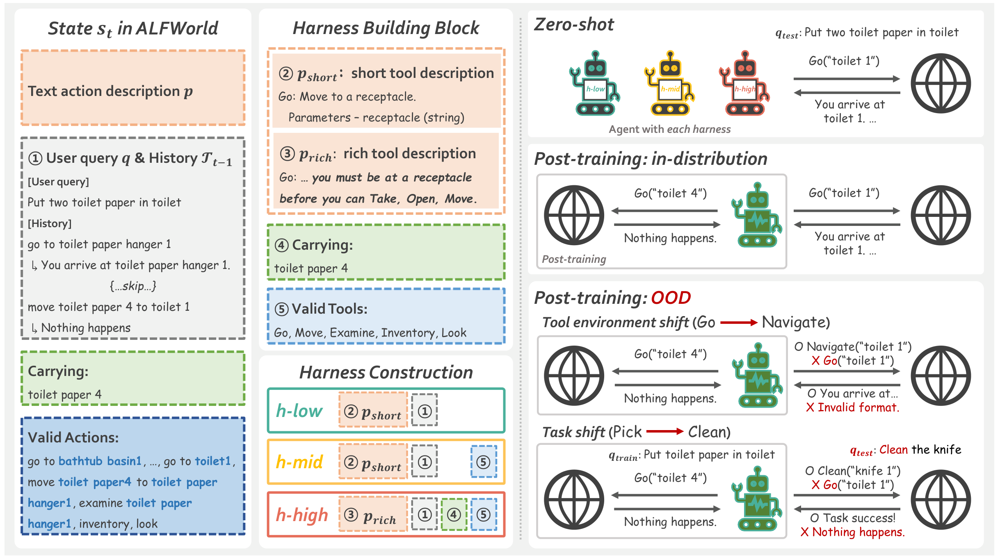
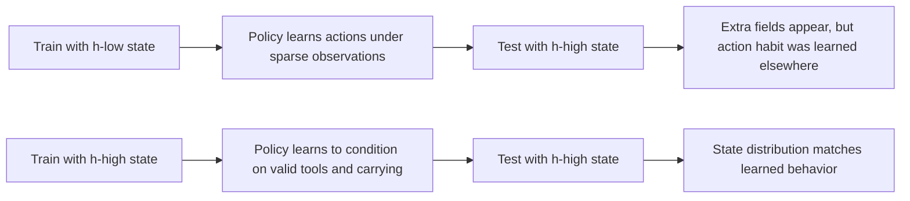
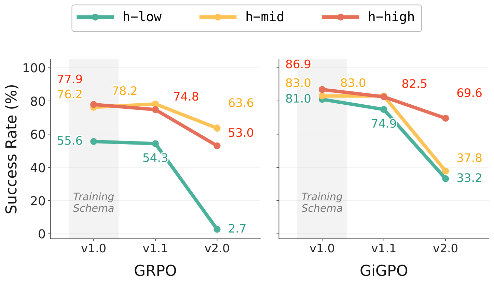
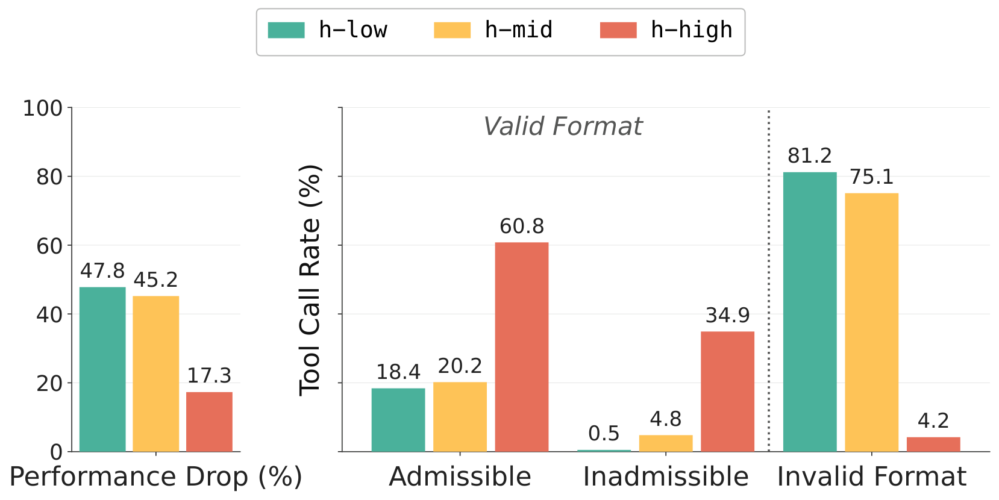

# The Interplay of Harness Design and Post-Training in LLM Agents

| 字段 | 内容 |
|---|---|
| 论文 | The Interplay of Harness Design and Post-Training in LLM Agents |
| 方向 | 大模型 Agent / 后训练 |
| 原始链接 | [arXiv](https://arxiv.org/abs/2606.25447), [PDF](https://arxiv.org/pdf/2606.25447), [Source](https://arxiv.org/e-print/2606.25447) |
| 时间 | 2026-06-24 06:23:02 UTC 提交 |
| 对象 | ALFWorld 工具型 Agent、harness 设计、GRPO/GiGPO 后训练、任务迁移与工具环境迁移 |

### TL;DR

- 这篇论文研究一个在 Agent 后训练里经常被当成“工程细节”的变量：**harness**，也就是包住 LLM 的脚手架，决定工具怎么描述、每步 observation 带什么辅助信息、环境怎么把工具结果重建成下一步状态。
- 作者把 ALFWorld 改造成可控的工具调用 benchmark，同时独立改变三件事：`h-low / h-mid / h-high` 三层 harness、`v1.0 / v1.1 / v2.0` 三种工具 schema、`t-easy / t-med / t-hard` 三组任务难度。
- 核心结论是：harness 不能只在推理期临时加上；它会改变后训练学到的策略。训练时就带 harness 的模型，在 in-distribution、工具环境迁移和任务迁移里都明显强于“先用低信息 harness 训练、测试时再补强 harness”的模型。
- 关键数字很直接：Qwen2.5-7B 用 GRPO 时，`h-mid` 训练时使用比 post-hoc 使用高 **20.7** 分，`h-high` 高 **22.5** 分；同一模型在强工具迁移 `v2.0` 下，GRPO + `h-low` 只有 **2.7%** 成功率，低于未后训练 base model 的 **13.5%**。
- 工具环境迁移的失败不是“模型不会做任务”，而是接口适配崩了：Qwen2.5-7B + GiGPO + `h-low` 在 `v2.0` 下 **81.2%** 工具调用返回 `Invalid tool format`；`h-high` 则能产生 **95.7%** 格式有效调用，但还有 **34.9%** 是当前状态不可执行的调用。
- 论文的边界也清楚：实验只在 ALFWorld 上，harness 只有三档手工构造，后训练只看 Qwen2.5-3B/7B 与 GRPO/GiGPO；结论更像“受控环境下的机制证据”，不是所有 Agent 平台的通用定律。

### 研究问题：为什么 harness 不能继续被当成固定背景？

很多 Agent 论文会把工具、提示词、状态拼接和环境反馈包装成一个默认实现，然后只比较模型或训练算法。

这篇论文认为这个做法漏掉了一个关键交互：

| 传统视角 | 本文视角 |
|---|---|
| harness 是工程实现，固定即可 | harness 是学习环境的一部分 |
| 后训练只优化 LLM policy | 后训练优化的是“policy 在某个 harness 下的行为” |
| 工具接口变化只是部署问题 | 工具接口变化会改变 action space 的表面形式 |
| 测试时补强 prompt 可能足够 | 训练时没见过该状态表示，post-hoc 补强恢复有限 |

作者把问题写成三个研究问题：

1. **RQ1：** zero-shot 里 harness 越丰富越强，这个趋势在后训练后还成立吗？
2. **RQ2：** harness 可以训练后再加，还是必须训练时就在场？
3. **RQ3：** harness-aware post-training 能否提升工具环境迁移和任务迁移鲁棒性？

这三个问题的共同点是：它们不把 harness 当作“外部提示技巧”，而是把它放进 Agent 的状态转移结构里。

### 形式化：Agent 看到的状态不是环境本身，而是 harness 重建后的状态

论文先把多步工具调用写成序列级 MDP。

给定：

- `p`：system prompt；
- `q`：用户任务；
- `T_{t-1}`：前 `t-1` 步工具调用历史；
- `a_t = pi(s_t)`：Agent 在第 `t` 步生成的动作 token 序列；
- `TE`：tool environment，既负责执行工具，也负责重建下一步状态。

状态与转移可以压缩成：

```text
s_t = (p, q, T_{t-1})
  -- agent generates a_t -->
(p, q, T_{t-1}, a_t)
  -- TE returns e_t -->
(p, q, T_{t-1}, a_t, e_t)
  -- TE reconstructs T_t -->
s_{t+1} = (p, q, T_t)
```

关键不在公式本身，而在 `TE` 的第二个角色：

| 阶段 | `TE` 做什么 | harness 影响在哪里 |
|---|---|---|
| Tool calling phase | 对 `a_t` 执行工具，返回 `e_t` | 判断工具名、参数和当前状态是否有效 |
| State reconstruction phase | 把历史、动作、反馈重组为 `T_t` | 决定下一步是否显示 valid tools、carrying、丰富工具说明 |

因此，harness 不是提示词里的一段装饰；它改变了 `s_t` 的信息内容，也改变了 policy 学到的条件分布。

### Benchmark：作者如何把 ALFWorld 改成可控实验台？

作者选择 ALFWorld，因为它本来就是文本式家庭任务环境，共 **3,827** 个任务实例，包含六类活动。

| 分组 | 任务类型 | 最少子目标数 | 示例 |
|---|---:|---:|---|
| `t-easy` | Pick, Look | 4 / 3 | 把盘子放到咖啡桌；在灯下查看书 |
| `t-med` | Clean, Heat, Cool | 5 | 清洗刀后放进抽屉；加热杯子后放到桌上 |
| `t-hard` | Pick 2 | 8 | 把两支铅笔放进抽屉 |

作者把原始文本动作改写为工具调用：

```text
原始 ALFWorld 动作:
go to drawer 1

工具调用形式:
Go(receptacle="drawer 1")
```

这个改写让作者能把 Agent 的失败拆成两类：

- **规划失败：** 任务目标或子目标顺序错了。
- **接口失败：** 意图对了，但工具名、参数名、schema 或当前状态不接受。

### 三层 harness：信息量如何逐级增加？

论文设计了三种 harness，每一层只比上一层多一点明确辅助信息。

| Harness | 工具描述 | 每步历史里的 `Valid tools` | 每步历史里的 `Carrying` | 设计成本 |
|---|---|---:|---:|---|
| `h-low` | 短描述 | 无 | 无 | 最低 |
| `h-mid` | 短描述 | 有 | 无 | 中等 |
| `h-high` | 丰富描述，含前置条件和工具关系 | 有 | 有 | 最高 |

`h-low` 只告诉模型工具的大概含义，例如 `Go: Move to a receptacle`。

`h-high` 会把隐含环境知识写出来，例如：

- 你必须先在某个 receptacle 位置，才能 `Take` 或 `Open`；
- 你一次只能携带一个 object；
- `Move` 在 object 和 receptacle 都匹配目标时完成任务；
- `Inventory` 可以查询当前携带物，但 `h-high` 直接把携带物放进每步状态。

作者强调：`h-mid` 和 `h-high` 不免费。

它们需要：

- 专家手工理解环境；
- 或者通过探索交互发现 admissible tools、物体携带状态和工具前置条件；
- 或者通过自动 harness search 生成并验证。

这也是论文的重要立场：**不是说 harness 越丰富越无成本，而是说它的成本必须进入后训练设计。**



### 三种 tool schema：工具环境迁移是怎么构造出来的？

为了测试部署时工具接口变化，作者构造了三种工具 schema。

| Schema | 变化 | 同一个“去 drawer 1”的合法形式 |
|---|---|---|
| `v1.0` | 原始 13 个工具 | `Go(receptacle="drawer 1")` |
| `v1.1` | 工具名和参数名改写 | `NavigateTo(destination="drawer 1")` |
| `v2.0` | 在 `v1.1` 基础上合并工具，13 个变 5 个 | `ReceptacleControl(action="navigate_to", target="drawer 1")` |

这里的设置很有价值：底层功能不变，任务也不变，但 action interface 变了。

这就隔离出一个问题：

> Agent 到底学会了“可迁移的工具使用策略”，还是只记住了训练时的工具表面形式？

如果模型在 `v2.0` 下输出 `GoTo("countertop 1")` 或 `goto_dresser()`，它的意图可能接近正确，但环境仍会返回 `Invalid tool format`。

### 后训练算法：GRPO 和 GiGPO 分别承担什么角色？

作者不把重点放在提出新 RL 算法，而是用两种已有后训练算法作为分析工具。

| 算法 | Advantage 粒度 | 作用 |
|---|---|---|
| GRPO | episode-level group-normalized advantage | 常见、计算相对高效，但长程任务里 credit assignment 粗 |
| GiGPO | episode-level + step-level advantage | 通过相似状态分组给步骤分配更细粒度 advantage |

GRPO 目标可简写为：

```text
J(theta) = E [
  sum_i sum_t sum_k min(
    rho_tk^i * A^i,
    clip(rho_tk^i, 1-epsilon, 1+epsilon) * A^i
  )
  - beta * KL(pi_theta || pi_ref)
]

rho_tk^i = pi_theta(a_tk^i | s_<tk^i) / pi_old(a_tk^i | s_<tk^i)
A^i = (R^i - mean({R^j})) / std({R^j})
```

GiGPO 的关键变化是加入步骤级项：

```text
J_GiGPO(theta) uses:
  A^i + omega * A_t^i

A_t^i = (R_t^i - mu_g) / sigma_g
```

变量解释：

- `R^i` 是整条 episode reward；
- `R_t^i` 是从第 `t` 步开始的 step-level return；
- `g` 是相似起始状态的分组；
- `omega` 控制步骤级 advantage 的权重；
- `beta` 控制 KL penalty；
- 环境反馈 token 会被 mask，参数更新只依赖 Agent 自己生成的 token。

实验设置也比较具体：

| 项目 | 设置 |
|---|---|
| 开源模型 | Qwen2.5-3B-Instruct, Qwen2.5-7B-Instruct |
| 闭源 zero-shot 参考 | GPT-5 Mini, reasoning effort high |
| 训练算法 | GRPO, GiGPO |
| 训练步数 | 500 steps |
| 每 prompt 采样轨迹数 | `G = 8` |
| 学习率 | `1e-6` |
| batch | 每步 16 个任务 prompt |
| rollout | vLLM, temperature 1.0 |
| 每 episode 最大轮数 | 50 turns |
| reward | 成功 `10`，每个 invalid action `-0.1` |
| 评测 | ALFWorld test split 274 games，140 seen / 134 unseen |
| 随机种子 | 开源模型 3 seeds，报告均值和标准差 |
| 计算量 | 约 1,800 H200 GPU-hours |

### RQ1：zero-shot 的 harness 增益，会延续到后训练后吗？

论文先看 zero-shot。

最直观的现象是：harness 信息越多，成功率越高，而且模型越强，吃到的 harness 增益越大。

| 模型 | `h-low` all | `h-high` all | 增益 |
|---|---:|---:|---:|
| Qwen2.5-3B-Instruct zero-shot | 1.3 | 13.9 | +12.6 |
| Qwen2.5-7B-Instruct zero-shot | 7.4 | 29.0 | +21.6 |
| GPT-5 Mini zero-shot | 28.1 | 68.3 | +40.2 |

这说明 harness 不是弱模型的拐杖。强模型反而更能利用它，因为强模型有能力把丰富约束转化成可执行计划。

后训练后，这个趋势大体保留。

| 模型/算法 | `h-low` all | `h-mid` all | `h-high` all |
|---|---:|---:|---:|
| Qwen2.5-3B + GRPO | 56.0 | 61.7 | 69.7 |
| Qwen2.5-3B + GiGPO | 65.6 | 83.2 | 82.1 |
| Qwen2.5-7B + GRPO | 55.6 | 76.2 | 77.9 |
| Qwen2.5-7B + GiGPO | 81.0 | 83.0 | 86.9 |

两个细节值得注意：

- Qwen2.5-3B + GRPO + `h-high` 达到 **69.7**，超过 GPT-5 Mini zero-shot + `h-high` 的 **68.3**。
- Qwen2.5-7B + GRPO + `h-low` 只有 **55.6**，比 Qwen2.5-3B + GRPO + `h-high` 低 **14.1** 分。

这不是在说小模型永远能靠 harness 反超大模型，而是在说明：

> 同一个后训练算法的效果，可能被状态呈现方式强烈调制；模型规模不是唯一决定项。

### RQ2：训练后再加 harness，为什么恢复不了训练时使用 harness 的收益？

这是论文最有行动意义的部分。

作者比较两种路线：

| 路线 | 训练时 | 测试时 |
|---|---|---|
| Training-time harness | `h-mid` 或 `h-high` | 同一个 harness |
| Post-hoc harness | `h-low` | 测试时临时切到 `h-mid` 或 `h-high` |

结果是：post-hoc 加 harness 恢复很有限。

| 模型/算法 | Post-hoc `h-mid` 相对 training-time | Post-hoc `h-high` 相对 training-time |
|---|---:|---:|
| Qwen2.5-3B + GRPO | -4.2 | -10.1 |
| Qwen2.5-3B + GiGPO | -13.9 | -14.5 |
| Qwen2.5-7B + GRPO | -20.7 | -22.5 |
| Qwen2.5-7B + GiGPO | -3.4 | -4.7 |

这里的解释不是“测试时提示词不好”，而是更结构化：

1. 后训练期间，policy 学到的是 `pi(a | s)`。
2. `s` 由 harness 决定。
3. 如果训练时 `s` 里没有 valid tools 或 carrying，policy 没有在这些条件下学习如何利用它们。
4. 测试时突然加入这些字段，可能提供有用信息，但不会自动改变已学会的动作生成习惯。

可以把它理解为状态分布偏移：



这对真实 Agent 后训练很重要：

- 如果部署时准备使用权限提示、工具约束、检索摘要、记忆状态或安全策略；
- 那么这些信息最好从后训练阶段就进入状态；
- 否则测试时补进去，只是给模型看到了更多字，不等于它学会了在这些字上做条件决策。

### RQ3-A：工具环境迁移下，harness-aware post-training 如何防止接口崩溃？

工具环境迁移分两档：

- `v1.1`：只改工具名和参数名，功能保持；
- `v2.0`：进一步把 13 个工具合并成 5 个高层工具，动作通过 `action` 参数区分。

论文最尖锐的数字出现在 `Qwen2.5-7B + GRPO`：

| 设置 | `v1.0` | `v1.1` | `v2.0` |
|---|---:|---:|---:|
| zero-shot `h-low` | 7.4 | 7.9 | 13.5 |
| GRPO `h-low` | 55.6 | 54.3 | 2.7 |
| GRPO `h-mid` | 76.2 | 78.2 | 63.6 |
| GRPO `h-high` | 77.9 | 74.8 | 53.0 |
| GiGPO `h-low` | 81.0 | 74.9 | 33.2 |
| GiGPO `h-high` | 86.9 | 82.5 | 69.6 |

`h-low` 下，后训练在 `v1.0` 和 `v1.1` 还能工作，但在强迁移 `v2.0` 下崩到 **2.7**。

这个结果反直觉的地方是：

- base model zero-shot `h-low` 在 `v2.0` 还有 **13.5**；
- 但经过 GRPO 后训练的 `h-low` 只有 **2.7**；
- 也就是说，后训练不是单调增强，可能让模型更过拟合训练时接口。



### 失败案例：模型生成了“看起来合理但不存在”的工具名

论文给出 `v2.0` 下的失败样例。

| Harness | 训练时合法形式 `v1.0` | 测试时合法形式 `v2.0` | Agent 输出 |
|---|---|---|---|
| `h-low` | `Go(receptacle="countertop 1")` | `ReceptacleControl(action="navigate_to", target="countertop 1")` | `GoTo("countertop 1")` |
| `h-low` | `Go(receptacle="shelf 1")` | `ReceptacleControl(action="navigate_to", target="shelf 1")` | `GoToLocation("shelf 1")` |
| `h-mid` | `Go(receptacle="countertop 1")` | `ReceptacleControl(action="navigate_to", target="countertop 1")` | `navigate_to("countertop 1")` |
| `h-mid` | `Go(receptacle="dresser 1")` | `ReceptacleControl(action="navigate_to", target="dresser 1")` | `goto_dresser()` |

这些输出的共同点是：语义上像“去某处”，但不符合 active schema。

这说明工具迁移中的失败不只是规划能力不足，而是表面接口和环境 validator 没对齐。

### 工具调用拆解：`h-high` 解决了格式问题，但还没完全解决可执行性

作者进一步拆工具调用：

| 类别 | 含义 |
|---|---|
| admissible | 格式正确，且当前状态可执行 |
| inadmissible | 格式正确，但当前状态不可执行，例如环境返回 `Nothing happens` |
| invalid | 格式错误、工具名不存在或参数错误 |

Qwen2.5-7B + GiGPO 在 `v2.0` 下的关键结果：

| Harness | 强迁移表现 |
|---|---|
| `h-low` | `Invalid tool format` 占 **81.2%**；性能下降 **47.8** 分 |
| `h-mid` | `Invalid tool format` 占 **75.1%**；性能下降 **45.2** 分 |
| `h-high` | **95.7%** 工具调用格式有效；但 **34.9%** 是当前状态不可执行；性能从 **86.9** 降到 **69.6**，下降 **17.3** 分 |



这个拆解很关键，因为它把“鲁棒性”拆成两层：

1. **Schema-level robustness：** 是否会用新接口说话。
2. **State-level robustness：** 是否知道当前状态下哪个工具可执行。

`h-high` 主要解决第一层，并部分帮助第二层；但即使 `h-high` 也没有完全解决状态可执行性。

这让论文结论更克制：

- harness-aware post-training 提升 OOD 鲁棒性；
- 但它不是完美的工具迁移算法；
- 工具 schema 强变动下，仍需要更好的环境建模、状态跟踪或在线适配。

### RQ3-B：任务迁移下，harness 是否帮助跨任务泛化？

任务迁移把训练任务限制在某个难度组，然后测试其他任务组。

作者重点报告 Qwen2.5-7B。

一个代表性设置是：在 `t-hard` 的 Pick 2 上训练，然后看其它任务是否也受益。

| 算法 | `h-low` all | `h-high` all | 增益 |
|---|---:|---:|---:|
| GRPO | 33.1 | 50.6 | +17.5 |
| GiGPO | 28.8 | 73.4 | +44.6 |

具体到 OOD 任务：

- GRPO 下，`Heat` 从 `h-low` 的 **0.9** 上升到 `h-high` 的 **29.1**。
- GiGPO 下，`Cool` 从 `h-low` 的 **0.0** 上升到 `h-high` 的 **51.4**。

这个结果支持一个更细的解释：

> informative harness 不只是提高已训练任务表现，还能把可复用的工具前置条件、携带状态、可行动作集合暴露给模型，使它在新任务组合里更容易迁移。

但这里也不能过度解读。

任务迁移仍然发生在 ALFWorld 这个单一环境内部，工具集合和实体类型高度共享。它证明的是“同一工具世界内，不同任务组合之间的迁移”，不是跨网站、跨 API、跨真实软件系统的泛化。

### 论文主张如何被证据支持？

可以把全文论证压成一个 claim → mechanism → evidence → boundary 表。

| Claim | Mechanism | Evidence | Boundary |
|---|---|---|---|
| harness 是后训练变量，不是固定工程背景 | harness 改变 `p` 和 `T_t`，即改变 policy 条件状态 | zero-shot 与 post-training 都随 harness 信息量提升 | 只测三层手工 harness |
| harness 必须训练时就在场 | 训练时状态分布决定 policy 如何利用 auxiliary fields | post-hoc `h-mid/h-high` 显著低于 training-time，Qwen2.5-7B + GRPO 差 20.7/22.5 分 | GiGPO + 7B 的 post-hoc gap 较小，说明算法和模型会调节强度 |
| harness-aware post-training 提升工具迁移鲁棒性 | richer harness 暴露工具前置条件、valid tools、carrying，有助于适配新 schema | `v2.0` 下 GRPO + `h-low` 2.7，而 `h-mid` 63.6、`h-high` 53.0 | `h-high` 仍有 34.9% inadmissible calls |
| 低信息 harness 的后训练可能过拟合接口 | policy 学到训练时工具表面形式，强 schema 迁移时输出伪工具名 | `h-low/h-mid` 在 `v2.0` 下 invalid format 达 81.2%/75.1% | 只分析 ALFWorld-style tool calls |
| harness 帮助任务迁移 | 通用工具约束帮助跨任务组合复用 | `Heat`、`Cool` 等 OOD 任务随 harness 提升 | 任务仍共享同一环境和工具语义 |

### 这篇论文对 Agent 后训练的真正提醒是什么？

它最重要的提醒不是“多写一点 prompt 有用”。

更准确地说，是下面三点：

1. **后训练数据必须包含部署时会出现的状态结构。**
   - 如果生产 Agent 会显示权限、工具白名单、检索摘要、记忆状态；
   - 后训练时就应该让模型在这些字段下学习；
   - 不要指望测试时把字段补上就能完全恢复。

2. **工具环境迁移要拆成 schema-level 与 state-level。**
   - schema-level 是工具名、参数、调用格式；
   - state-level 是当前状态下是否可执行；
   - `h-high` 能显著降低格式错误，但还不能消除不可执行调用。

3. **后训练可能放大接口过拟合。**
   - `h-low` + GRPO 在 `v1.0` 下成功率很高；
   - 但在 `v2.0` 下低于未训练 base model；
   - 因此“训练后分数高”不等于“部署接口变化后鲁棒”。

### 复现实验时最该检查哪些细节？

如果要复现实验或迁移到别的 Agent benchmark，我会优先检查这些变量：

| 检查项 | 为什么重要 |
|---|---|
| harness 字段是否固定 | 如果训练和测试状态模板不同，结果不能直接比较 |
| 工具 schema 是否只改表面形式 | 否则无法区分接口迁移和任务能力变化 |
| invalid / inadmissible / failed task 是否分开统计 | 单一 success rate 会掩盖失败原因 |
| 训练时是否 mask 环境反馈 token | 否则 loss 可能学到环境文本而不是 Agent 动作 |
| post-hoc harness 是否与 training-time harness 对照 | 这是判断“补提示是否足够”的关键 |
| 是否报告 task-level breakdown | All score 可能掩盖某些任务完全崩溃 |

### 如果把结论迁移到真实工具 Agent，应该怎么改实验？

真实 Agent 的工具环境通常比 ALFWorld 更乱。

它不只是 `Go` 改成 `NavigateTo`，还可能出现：

- 工具权限随用户、组织、时间变化；
- 参数 schema 从必填变成可选，或从字符串变成结构体；
- 工具返回错误码、分页、异步任务 ID，而不是确定性的文本反馈；
- 同一个工具调用可能有副作用，例如发邮件、下单、改数据库；
- 运行时存在外部状态漂移，例如网页 DOM、文件系统、API quota 或登录态变化。

如果沿用本文思路，一个更贴近真实系统的实验应该至少增加四组变量。

| 新变量 | 对应真实问题 | 应该观察什么 |
|---|---|---|
| 权限 harness | 哪些工具可见、哪些动作需要确认 | 模型是否把“可见”误当成“允许执行” |
| 错误反馈 harness | 工具失败时返回短错误码还是可解释诊断 | 模型能否恢复，还是重复同一错误 |
| 记忆 harness | 历史任务、用户偏好、长期记忆是否进入状态 | 模型是否过度依赖旧记忆，造成隐私或过时信息问题 |
| 安全 policy harness | 自然语言规则、policy-as-code、运行时 guardrail 如何呈现 | 模型是否把策略当建议，而不是硬约束 |

这类扩展会把论文里的两个失败层次继续拆开：

1. **格式层失败：** 工具调用不符合 schema。
2. **状态层失败：** 调用格式正确，但当前状态不可执行。
3. **权限层失败：** 调用可执行，但当前用户、任务或风险级别不允许。
4. **副作用层失败：** 调用本身成功，但产生不可逆或难审计的外部影响。

这也是为什么 harness-aware post-training 不能替代安全系统。

它能让模型更好地读懂状态、工具和约束，但最终仍需要：

- 工具层 permission check；
- 高风险动作二次确认；
- 可回滚或沙箱化执行；
- 结构化审计日志；
- 对 prompt injection 和越权调用的运行时拦截。

换句话说，本文证明的是“把约束放进训练状态会让模型更会用约束”，不是“约束写进 prompt 就足以保证安全”。

### 为什么 All score 不够，必须看失败类型？

论文的另一个方法论贡献，是把同一个成功率背后的失败机制拆出来。

例如，两个系统都可能在 `v2.0` 下成功率下降 20 分，但原因完全不同：

| 系统 A | 系统 B |
|---|---|
| 大量 `Invalid tool format` | 大量 `Nothing happens` |
| 没学会新接口 | 会说新接口，但不会判断当前状态 |
| 需要 schema augmentation 或接口随机化训练 | 需要更好的状态跟踪、前置条件建模和反馈利用 |

如果只看任务成功率，两个系统都会被写成“鲁棒性下降”。

但对修复来说：

- `Invalid tool format` 应该从工具 schema、函数签名、参数校验样例入手；
- `Nothing happens` 应该从环境状态、物体位置、携带物、前置条件入手；
- 最终任务失败还要看是早期步骤错、关键子目标漏掉，还是最后一步放错位置。

因此，真实 Agent 后训练报告最好至少包含：

```text
success_rate
format_valid_rate
state_admissible_rate
permission_allowed_rate
recovery_after_error_rate
irreversible_action_rate
```

这些指标能把“模型没有能力”拆成更可修的工程问题。

### 与近期 Agent / 后训练工作的关系

这篇论文和近期几类工作形成互补关系。

| 方向 | 典型关注点 | 本文补上的缺口 |
|---|---|---|
| Tool-use RL / GRPO / GiGPO | 如何让模型学会多步工具调用 | 状态脚手架会改变 RL 学到什么 |
| Agent benchmark | 测模型能否完成任务 | benchmark harness 本身可能包含 oracle-like 信息 |
| Tool evolution / API drift | 部署后工具接口变化 | harness-aware training 能否缓解 schema drift |
| Harness search / prompt optimization | 推理期找更好脚手架 | harness 应与后训练共同设计 |
| Process reward / failure attribution | 找到哪一步错了 | 本文把错误分成格式、可执行性和任务成功 |

它和“只做更强 RL 算法”的路线也有张力。

GiGPO 的细粒度 credit assignment 很强，in-distribution 下 `h-low` 也能达到不错结果；但在 `v2.0` 强工具迁移里，`h-low` 仍然明显崩溃。

这说明：

- 更好的 credit assignment 可以帮助模型学会当前环境；
- 但不能自动替代缺失的 harness 信息；
- 尤其当工具接口变化时，训练时没有暴露的结构很难事后补救。

### 局限：哪些结论还不能直接外推？

论文自己也给了几条重要边界。

| 局限 | 影响 |
|---|---|
| 只在 ALFWorld 上实验 | 真实软件 Agent、浏览器 Agent、代码 Agent 的状态空间更复杂 |
| 只测三层 harness | 实际 harness 可能连续变化，也可能由模型自动生成 |
| 只测 Qwen2.5-3B/7B 和 GPT-5 Mini zero-shot | 更大开源模型、不同 tokenizer、不同 tool calling 格式可能改变结果 |
| 只用 GRPO/GiGPO | DPO、SFT+RL、process reward、online adaptation 未覆盖 |
| `h-mid/h-high` 含有需要探索或专家设计的信息 | 论文证明信息有用，但没有解决如何低成本获得 |
| 工具 schema 迁移是人工控制的 | 真实 API drift 可能同时改变语义、错误码、权限和副作用 |

这些局限不削弱主结论，但限定了它的使用方式：

> 这篇论文提供的是“harness 与后训练存在强交互”的受控证据，而不是一个完整的通用 Agent 后训练 recipe。

### 研究者视角：下一步最值得追问什么？

这篇论文把问题推进到一个更实际的位置：Agent 后训练不能只讨论模型和 reward，还要讨论 wrapper、tool environment 和状态重建。

后续我认为有四个值得追问的问题。

1. **能否联合优化 harness 与 policy？**
   - 现在的实验先手工设定 `h-low/mid/high`，再训练 policy。
   - 更自然的方向是把 harness search 与 RL 结合，让系统自动找到“训练成本、推理成本、迁移鲁棒性”之间的 Pareto 前沿。

2. **能否把工具 schema drift 纳入训练分布？**
   - 例如在训练时随机 paraphrase 工具名、合并/拆分工具、改变参数顺序；
   - 让模型学到接口变化下的抽象操作，而不是记住固定 schema。

3. **能否把 invalid / inadmissible 分别作为 reward 信号？**
   - invalid 是格式层错误；
   - inadmissible 是状态层错误；
   - 两者需要不同修正机制，混成一个失败 reward 会浪费诊断信息。

4. **真实 Agent 安全里，harness 与权限系统如何分工？**
   - harness 可以告诉模型哪些工具可用；
   - 但不能替代沙箱、权限隔离、审计日志和危险动作拦截；
   - 最稳妥的系统应把 harness 视为“让模型更少犯错”的学习条件，而不是“阻止所有坏动作”的安全边界。

### 结论

这篇论文的价值在于把 Agent 后训练里一个常被忽略的变量显性化：**模型不是在抽象环境里学习工具使用，而是在某个 harness 生成的状态分布里学习。**

因此，harness 的信息量、时机和部署时是否会变化，都会影响后训练收益。

最重要的实践判断是：

- 如果部署时会使用某种 harness，就应该训练时就使用它；
- 如果部署时工具接口会变，就必须单独测试 schema-level 与 state-level 的鲁棒性；
- 如果只看 in-distribution success rate，很可能高估 Agent 后训练后的真实可靠性。
