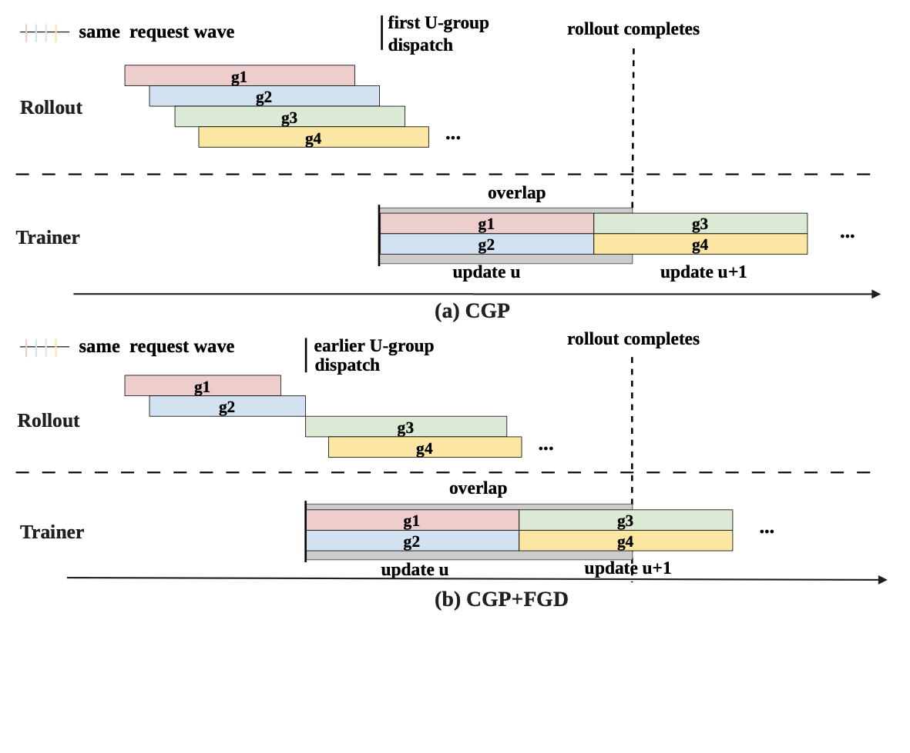
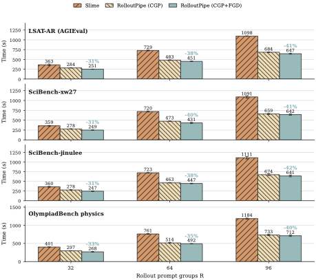
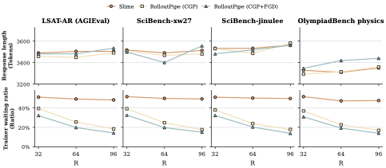

# RolloutPipe：把 RLVR 的 rollout 等待时间折叠进训练流水线

| 字段 | 内容 |
| --- | --- |
| 论文 | RolloutPipe: Overlapping Pipelined Rollout and Training in Disaggregated On-Policy LLM Reinforcement Learning |
| 分类 | 大模型后训练 |
| 原始链接 | [https://arxiv.org/abs/2606.26997](https://arxiv.org/abs/2606.26997) |
| arXiv | 2606.26997v1 |
| 日期 | 2026-06-25 |
| 代码边界 | 论文声称基于 Slime、Megatron-LM、SGLang 与 Ray 实现；本轮未找到单独的 RolloutPipe 官方代码仓库，因此可复现性主要依赖论文描述与已有 Slime 系统。 |

### TL;DR

- **这篇论文解决的问题**：RLVR 后训练里，rollout 侧生成答案、reward/verifier 侧给出可验证反馈、trainer 侧做 GRPO 更新。现代系统通常把 rollout GPU 池和训练 GPU 池拆开，但同步 on-policy 流程要等整轮 rollout 全部结束才开始训练，导致训练 GPU 在 rollout 期间长时间空等。
- **核心观察 1**：GRPO 的训练单位不是单条 response，而是同一 prompt 下的完整 group。只要一个 group 的 `K` 条 response、reward、verifier、group statistics 和 loss mask 都准备好，它就已经是合法训练单元；没必要等全部 `R` 个 group 都完成。
- **核心观察 2**：默认 SGLang/FIFO admission 不理解 group 边界。前几个能凑成训练 batch 的 frontier groups 可能和非 frontier groups 一起平均抢资源，导致 trainer 虽然已经拿到部分 group，却还要等另一个 group 才能形成 `U=B/K` 个 complete groups 的逻辑更新。
- **方法**：RolloutPipe 只改变调度与交接粒度，不改 GRPO 目标函数。它由两个机制组成：CGP 把“整轮 rollout 后一次性交给 trainer”改成“complete group 一 ready 就进 trainer FIFO”；FGD 在 rollout admission 侧优先服务即将组成下一个训练 batch 的 frontier groups。
- **实验设置**：作者用 Qwen3-1.7B，在 LSAT-AR、Sci-XW、Sci-JL、OlyPhys 四类 reasoning/science workload 上评测；训练侧是 `8 x RTX 4090 24GB`，rollout 侧是 `2 x A100 40GB PCIe`；`K=8`、`B=16`，所以一次逻辑更新消费 `U=2` 个 complete groups。
- **关键数字**：相对 native Slime，CGP+FGD 在 12 个设置上把 rollout-to-train-end 主时长缩短 **30.7%-42.3%**，把 trainer waiting ratio 降低 **37%-76%**；在 `R=96` 时，Slime 的首次合法 dispatch 是 `509-543s`，CGP 是 `46-90s`，CGP+FGD 收窄到 `52-61s`。
- **证据边界**：结果不是“训练计算更少”，而是“同样的训练计算更早开始”。论文 Table 1 显示相同 workload 和 `R` 下 trainer compute time 基本一致；response length 也保持在相近区间。外推到更大模型、更复杂 verifier、跨机网络和真实长程 agent rollout 仍需额外验证。
- **领域意义**：这篇论文把 RLVR 系统瓶颈从“算法能不能学”推进到“on-policy 语义下，哪些单位可以被安全流水线化”。它提示后训练框架应把 group materialization、weight freshness、trainer FIFO 与 serving admission 作为同一条系统合约来设计。

### 研究问题：为什么同步 RLVR 会把训练 GPU 晾在一边？

- RLVR 的一次闭环可以拆成四段：
  1. **rollout**：用当前策略权重对 prompt 采样多条 response；
  2. **reward/verifier**：用可验证规则或判题器给每条 response 打分；
  3. **group materialization**：把同一 prompt 的 `K` 条 response 汇总，计算 group mean、group std、advantage 和 loss mask；
  4. **training**：trainer 用可训练 group 做 forward/backward、gradient accumulation、optimizer step，再发布新权重。
- disaggregated 架构把 rollout 和 training 分给不同 GPU 池：
  - rollout 侧更像 serving 系统，受 token 长度、并发、verifier latency 和 request admission 影响；
  - training 侧更像 Megatron 数据并行/张量并行路径，关心 microbatch、token budget、梯度累积与 optimizer step；
  - 两侧如果只在“整轮 rollout 结束”这个粗粒度边界同步，就会出现一边忙、一边等。
- 论文给出的动机场景很直接：
  - 在 Qwen3-1.7B、LSAT-AR、`R=96`、`K=8` 的例子中，第一个 group 在 rollout 开始后约 `200s` 完成，最后一个 group 在约 `400s` 完成；
  - native Slime 直到 `400s` 才把所有 96 个 groups 提交给 trainer；
  - 最早完成的 group 已经可以训练，却在 trainer FIFO 外等了约 `200s`。
- 因此，论文要回答的不是“能不能异步训练”，而是更窄的问题：
  - **在仍然保持 on-policy、仍然使用同一轮固定 rollout weights 的前提下，能不能让已经完整 materialized 的 group 先开始训练？**

### 论文主张：把同步边界从整轮 rollout 细化到 complete group

作者的论证路线可以写成四步：

| 环节 | 作者要证明什么 | 证据/机制 |
| --- | --- | --- |
| claim | Slime 式同步边界会浪费 trainer 时间 | early-completed groups 被 rollout-completion barrier 阻塞，trainer waiting ratio 达到 47%-52% |
| mechanism | complete group 已经满足 GRPO 的训练条件 | group 内 `K` 条 response 全部完成后即可计算 advantage 与 loss mask |
| evidence | 细粒度 handoff 能显著缩短主时长 | 12 个设置上主时长缩短 30.7%-42.3%，等待比例降低 37%-76% |
| boundary | 不牺牲 on-policy correctness | 同一轮所有 `R` 个 groups 使用固定 rollout weights，weight publish 仍在本轮全部 group 被消费后发生 |

这个主张的关键是“complete group”。

- 如果是 PPO 风格，每条 trajectory 可以有自己的 advantage，单条样本完成后就可以进入流水线。
- 如果是 GRPO，advantage 来自同一 prompt 的 group statistics，单条 response 完成不够。
- 但等整个 rollout 完成又太粗。
- 因此，RolloutPipe 选择了中间粒度：
  - 不按 sample 训练；
  - 不按整轮 rollout 阻塞；
  - 而是按 **完整 group** 进入 trainer FIFO。

### 方法一：CGP 如何把 complete group 送进 trainer FIFO？

CGP 是 training-side Complete-Group Pipelining。

- Slime baseline：
  - rollout 生成所有 `R` 个 groups；
  - reward/verifier 和 materialization 全部完成；
  - 然后一次性把整轮数据提交给 trainer。
- CGP：
  - 每个 group 完成 materialization 后立即追加到 ActorGroup 维护的 FIFO；
  - FIFO 里如果积累到 `U=B/K` 个 trainable groups，就把最早的 `U` 个 groups 提交给 trainer；
  - trainer 可以在剩余 groups 继续 rollout 时先做 forward/backward。

论文保留了 GRPO 的基本公式：

```text
A_i = (r_i - mu_group) / (sigma_group + epsilon_std)

r_i: 同一 prompt 下第 i 条 response 的 reward
mu_group: 该 group 内 K 条 response 的 reward 均值
sigma_group: 该 group 内 K 条 response 的 reward 标准差
epsilon_std: 防止除零或数值不稳定的小常数
```

这个公式说明：

- 单条 response 的 `A_i` 依赖整个 group；
- group 未完整时，`mu_group` 和 `sigma_group` 不存在；
- group 完整后，`A_i`、loss mask、sample record 都已经确定；
- 因此 complete group 是比 sample 更粗、比整轮 rollout 更细的合法流水线单位。

CGP 的时间收益可以写成：

```text
t_start^Slime = t_complete
t_start^CGP   = t_first^(U)
Delta t_CGP   = t_complete - t_first^(U)

t_complete: 本轮 rollout 全部完成的时间
t_first^(U): 第一批 U 个 complete groups 全部 materialized 的时间
U = B / K: 一次逻辑更新需要的完整 group 数量
```

这组定义把 CGP 的价值限定得很清楚：

- 它不减少 `R*K` 条 response；
- 它不减少 trainer 的 forward/backward；
- 它只是把 trainer start time 从 `t_complete` 提前到 `t_first^(U)`；
- 省下来的墙钟时间来自 rollout 与 training 的重叠。

### 方法二：FGD 为什么还要管 rollout admission？

CGP 解决了“complete group 何时能交给 trainer”的问题，但没有解决“哪些 group 会先完成”的问题。

- 默认 request-level FIFO 只看单个 request；
- 它不知道 request 属于哪个 prompt group；
- 同一轮 `R*K` 个 requests 几乎同时进入系统；
- response 长度、verifier latency、GPU queue 都会让 group completion 顺序变得不稳定。

这会产生 frontier-group arrival gap。

- trainer 一次逻辑更新需要 `U` 个 complete groups；
- 如果 group 0 在 `210s` 完成，group 1 在 `250s` 完成；
- group 0 虽然已经进 FIFO，但 trainer 还缺 group 1；
- 这 `40s` 就是 frontier group 到达不齐造成的等待。

FGD 是 Rollout-node Frontier-Group Dispatch。

```text
给定:
O = {g_1, ..., g_R}: 已到达但还没 serving-complete 的 groups
order(g): group 的提交顺序
F_w: frontier window 宽度

frontier set:
F = argmin^{F_w}_{g in O} order(g)

admit(q) iff g(q) in F
otherwise q enters Deferred
```

换成系统语言：

- FGD 维护一个最多包含 `F_w` 个 groups 的 frontier；
- frontier 内 group 的 requests 被放入 Admitted Queue；
- 非 frontier group 暂存在 Deferred Groups；
- 某个 group 的 `K` 条 requests 全部完成后，它离开 frontier；
- 下一个最低顺序 group 被补进 frontier。

论文实验把 `F_w` 设为 `U=2`。

- 这意味着 rollout 侧优先把“刚好能组成下一次 trainer update”的 groups 做完；
- CGP 负责把这些 complete groups 提前交给 trainer；
- FGD 负责让这些 groups 更早、更稳定地到齐。

### 算法流程：四个事件驱动组件如何协同？

论文的 Algorithm 1 可以压缩成下面的伪代码：

```text
Input:
  requests {q}, grouped by prompt group g
  frontier width F_w
  update width U = B / K

State:
  F: current frontier groups
  Deferred: groups not admitted yet
  Pending Complete Groups: materialized groups waiting for feasible batch selection
  Ready Queue: U-group batches waiting for trainer
  consumed: groups consumed by current logical update / rollout

Loop until current rollout is fully consumed:
  FGD_Admit:
    on request q:
      if g(q) in F: admit q to SGLang
      else: put q into Deferred
    while |F| < F_w:
      move lowest-order deferred group into F
    when group g serving-complete:
      remove g from F

  Rollout_Worker:
    decode admitted requests
    when all K responses of group g complete:
      Materialize(g)
      append g to Pending Complete Groups

  CGP_Handoff:
    choose feasible prefix of whole groups under token budget
    if at least U groups are ready:
      move first U groups to trainer Ready Queue

  Train:
    consume U groups via Megatron train RPC
    accumulate gradients
    if consumed == U: optimizer step
    if all R groups consumed: publish refreshed weights
```

这里有三个容易误解的边界：

- **不是 sample-level pipeline**：Feasible Batch Selector 选的是完整 groups，不能拆成单条 request。
- **不是 stale-weight async RL**：同一 rollout 内所有 groups 来自固定 rollout weights，新权重只在本轮消费完成后发布。
- **不是降低训练量**：复杂度仍是 `O(R*K*L^2*d)` 级别的 trainer forward/backward，其中 `L` 是序列长度、`d` 是 hidden dimension。

### 图表证据一：timeline 展示“提前开始训练”而非“跳过训练”



这张 timeline 图承担的是机制证据。

- Slime 的时间线是典型两段式：
  - rollout 阶段先跑完；
  - trainer 阶段后启动；
  - 两段之间没有真正重叠。
- CGP 的时间线改变的是 handoff：
  - complete group materialized 后进入 FIFO；
  - 第一批 `U` groups ready 后 trainer 即可启动；
  - 后续 rollout 仍在继续。
- CGP+FGD 的时间线进一步改变 arrival pattern：
  - frontier groups 被优先 admitted；
  - 第一批可训练 group 更集中；
  - trainer 更少遇到“已拿到一个 group、还缺另一个 group”的中途等待。

这张图不能单独证明加速幅度；它证明的是系统语义：

- RolloutPipe 没有改变“训练要消费哪些 groups”；
- 它改变了“groups 何时可被交给 trainer”；
- 它还改变了“哪些 groups 会先在 rollout 侧完成”。

### 实验设置：作者如何让比较尽量对齐？

| 维度 | 设置 |
| --- | --- |
| policy backbone | Qwen3-1.7B |
| rollout GPU | `2 x A100 40GB PCIe`，TP=2 |
| training GPU | `8 x RTX 4090 24GB`，TP=4，DP=2 |
| workloads | LSAT-AR、Sci-XW、Sci-JL、OlyPhys |
| rollout group count | `R=32,64,96` |
| GRPO group size | `K=8` |
| global batch | `B=16` |
| logical update width | `U=B/K=2` complete groups |
| FGD frontier width | `F_w=U=2` |
| reward | exact-match accuracy reward and verifier |
| result aggregation | 每个配置 4 轮均值，error bar 是 sample standard deviation |

这个实验设计的优点：

- 同一个 backbone、同一组 workload、同一训练路径下比较 Slime、CGP、CGP+FGD；
- `R=32/64/96` 能观察 rollout 规模变大时，serial barrier 的浪费是否放大；
- `K=8` 与 `U=2` 让 complete-group 约束很清楚。

它的限制也明显：

- 只报告 Qwen3-1.7B；
- 训练侧和 rollout 侧 GPU 异构，真实集群拓扑、网络和 scheduler 可能改变通信隐藏效果；
- reward 是 exact-match/verifier 场景，长程 agentic task 的工具调用、sandbox latency 和部分可判题 reward 未覆盖；
- 论文没有给出公开 RolloutPipe 仓库，本轮无法逐行核对实现。

### 图表证据二：主时长缩短来自 CGP，FGD 是稳定供给的增益项



主结果图支撑三个判断。

| 判断 | 论文证据 | 含义 |
| --- | --- | --- |
| CGP+FGD 全面快于 Slime | 12 个设置主时长缩短 30.7%-42.3% | complete-group pipeline 在四类 workload 上都有效 |
| `R` 越大，收益越明显 | `R=32` 时约 30.7%-32.9%，`R=96` 时约 39.8%-42.3% | rollout 越大，被 completion barrier 卡住的早完成 groups 越多 |
| CGP 是主要贡献 | CGP 占总缩短的 71%-96%，且 `R` 越大占比越高 | 主要瓶颈是整轮 rollout 后才交接，而不是 admission 顺序本身 |

FGD 仍然有价值。

- 相比 CGP，CGP+FGD 额外缩短 **2.5%-11.4%**；
- 它不是替代 CGP，而是让 complete groups 更稳定地供应给 trainer；
- `R=96` 时，首次合法 dispatch：
  - Slime：`509-543s`；
  - CGP：`46-90s`；
  - CGP+FGD：`52-61s`。

这里的细节很重要：

- CGP 有时最早 dispatch 可以很早，例如 `46s`；
- 但范围也更宽，说明它仍受默认 admission 下 group completion 顺序影响；
- FGD 把范围收窄到 `52-61s`，说明它牺牲了部分“偶然很早”的样本，换来更稳定的 frontier supply。

### 图表证据三：训练计算没有变少，等待比例变小了



论文用 response length、trainer compute time 和 waiting ratio 区分“省计算”和“重叠计算”。

#### Trainer compute time 表格

| workload | R | Slime | CGP | CGP+FGD |
| --- | ---: | ---: | ---: | ---: |
| LSAT-AR | 32 | 195.1 | 194.7 | 195.9 |
| LSAT-AR | 64 | 388.9 | 387.6 | 391.9 |
| LSAT-AR | 96 | 587.4 | 589.0 | 586.4 |
| Sci-XW | 32 | 191.8 | 191.7 | 192.5 |
| Sci-XW | 64 | 379.9 | 383.4 | 375.9 |
| Sci-XW | 96 | 572.2 | 573.0 | 577.3 |
| Sci-JL | 32 | 194.1 | 195.2 | 192.5 |
| Sci-JL | 64 | 384.6 | 380.7 | 385.7 |
| Sci-JL | 96 | 584.5 | 584.1 | 584.1 |
| OlyPhys | 32 | 211.5 | 210.6 | 211.1 |
| OlyPhys | 64 | 420.7 | 425.7 | 426.9 |
| OlyPhys | 96 | 640.0 | 640.0 | 644.4 |

这张表给出一个反证：

- 如果 RolloutPipe 只是少算了样本，trainer compute time 应该明显下降；
- 但表格里相同 workload 与 `R` 下三种配置基本相近；
- OlyPhys `R=96` 里 CGP+FGD 甚至略高于 Slime；
- 因此主时长缩短更合理的解释是 training 与 rollout 发生了重叠。

#### Waiting ratio

论文报告：

- Slime 的 trainer waiting ratio 是 **47%-52%**；
- CGP+FGD 降到 **14%-33%**；
- 在 `R=96` 的四个 workload 上，waiting ratio 分别约为 **14.2%、15.0%、13.8%、13.9%**。

这说明 RolloutPipe 真正优化的是 trainer 看到可训练数据的时间分布。

### 与 Slime、AReaL、AsyncFlow 的位置关系

| 系统/路线 | 关注点 | 与 RolloutPipe 的关系 |
| --- | --- | --- |
| Slime | Megatron + SGLang 的 RL 后训练工程闭环 | RolloutPipe 以 Slime 为 baseline 和实现底座，但把 handoff 粒度从整轮 rollout 改成 complete group |
| AReaL | 大规模异步 RL 系统 | 也试图减少 rollout/training bubble，但论文认为它以异步 weight 或 stale data 作为代价 |
| AsyncFlow | streaming/asynchronous RL pipeline | 也重叠生成与训练，但不是这篇论文强调的 fixed-weight on-policy complete-group pipeline |
| SGLang | request/token 级 serving scheduling | RolloutPipe 的 FGD 在 admission 层加入 group-aware frontier，而不是只看 request FIFO |
| Megatron-LM | trainer forward/backward 与分布式训练 | RolloutPipe 不改训练计算路径，只改变哪些 groups 何时进入 trainer |

这篇论文最值得放进后训练系统谱系的位置是：

- 它不是新的 reward model；
- 不是新的 preference optimization objective；
- 也不是新的 reasoning benchmark；
- 它是一个 **on-policy RLVR system scheduling** 论文。

因此评价它时，重点不应是“准确率涨了多少”，而应是：

- on-policy 语义是否真的被保持；
- logical update boundary 是否和 baseline 等价；
- trainer compute 是否没被偷偷减少；
- waiting ratio 和主时长是否稳定下降；
- admission policy 是否会在复杂 workload 下引入新的尾部延迟。

### 消融与失败边界：哪些问题论文已经回答，哪些还没有？

#### 已经比较清楚的部分

- **CGP 与 FGD 的相对贡献**：
  - CGP 是主收益来源；
  - FGD 是额外稳定供给项。
- **不减少训练计算**：
  - Table 1 里 trainer compute time 相近；
  - response length 也没有系统性缩短。
- **on-policy 语义边界**：
  - 同一 rollout 内固定权重；
  - all `R` groups consumed 后才发布新权重；
  - optimizer step 仍以 `U` complete groups 为逻辑单位。

#### 仍需验证的部分

- **更大模型**：
  - 作者认为机制与模型内部参数无关；
  - 但 7B、32B、70B 的 KV cache、网络传输、weight refresh 成本会明显不同。
- **更复杂 reward/verifier**：
  - exact-match verifier 比多工具、多进程 sandbox、人工偏好模型更简单；
  - 如果 verifier latency 极不稳定，FGD 的 frontier width 是否需要动态调整？
- **长程 agentic rollout**：
  - Agent 任务可能存在工具调用阻塞、环境状态、partial trajectory、失败重试；
  - complete group materialization 的定义会比数学题判题复杂。
- **公平性与饥饿问题**：
  - frontier-first admission 优先低 order groups；
  - 如果某些 group 极长，后续 groups 是否会被过度推迟？
- **实现复现**：
  - 论文源文件可读，图表和公式完整；
  - 但没有本轮可验证的 RolloutPipe 代码仓库，无法检查 Ray ActorGroup、SGLang admission hook 和 Weight Publisher 的具体工程实现。

### 机制细读：complete group 为什么是这篇论文的“最小正确单位”？

如果只看系统图，RolloutPipe 很容易被误读成普通 pipeline 优化。但论文真正抓住的是 GRPO 的统计依赖。

- 一个 prompt 会采样 `K` 条 response；
- verifier 给出 `r_1 ... r_K`；
- group 内 reward 均值和标准差共同决定每条 response 的 advantage；
- 如果第 1 条 response 已完成、第 2 条 response 还在 decode，第 1 条 response 仍然不能训练；
- 如果 `K` 条 response 都完成，group statistics 就已经封闭，不再依赖其他 prompt group。

这就形成了三个层次：

| 层次 | 是否可训练 | 原因 |
| --- | --- | --- |
| 单条 response | 不可训练 | 缺少同组其他 response，无法计算 group statistics |
| complete group | 可训练 | 同 prompt 的 `K` 条 response、reward、mask 和 advantage 已封闭 |
| whole rollout | 可训练但太晚 | 包含所有 `R` 个 groups，满足条件但粒度过粗 |

因此，CGP 的设计不是“看到数据就训”，而是“看到最小正确单位就训”。

- 这能解释为什么作者没有选择 token-level streaming training；
- 也能解释为什么它没有采用一般异步 RL 的 stale batch；
- 它的核心约束来自目标函数，而不是来自工程偏好。

更进一步说，RolloutPipe 其实把后训练系统里的四种边界区分开了：

1. **统计边界**：advantage 什么时候定义完备；
2. **训练边界**：trainer 什么时候拥有 `U` 个 complete groups；
3. **权重边界**：什么时候允许发布下一轮 rollout weights；
4. **调度边界**：serving admission 什么时候应该优先某些 groups。

传统同步系统把这些边界都折叠到“整轮 rollout 完成”。RolloutPipe 的贡献，是把它们重新拆开，同时只放松调度与训练交接，不放松统计与权重语义。

### 失败案例推演：哪些场景会让 RolloutPipe 的收益变小？

论文报告的收益很明显，但它不是无条件的。

| 场景 | 可能发生什么 | 对收益的影响 |
| --- | --- | --- |
| 所有 groups 几乎同时完成 | `t_first^(U)` 与 `t_complete` 很接近 | CGP 可回收的空等时间变少 |
| verifier 极慢且集中在少数 frontier groups | FGD 优先的 group 卡在 verifier | trainer 可能仍然等待第二个完整 group |
| response length 分布极端长尾 | frontier group 可能被超长 response 拖住 | 固定 `F_w=U` 可能不够，需要动态 frontier |
| trainer compute 远短于 rollout gap | trainer 快速消费后继续等 | CGP 仍有效，但 waiting ratio 下降幅度受供给稳定性限制 |
| network transfer 无法隐藏 | complete group 传输成本暴露在关键路径上 | 论文的“通信被 overlap 隐藏”假设会变弱 |
| 多轮 rollout 同时飞行 | fixed-weight round boundary 变复杂 | 需要额外 freshness contract，不能直接套本文结论 |

这些失败模式有助于理解论文结论的边界。

- 它不是说所有 RLVR 系统都能获得 40% 加速；
- 它说在“disaggregated、同步、on-policy、GRPO、group completion staggered”的系统里，整轮 rollout barrier 是一个可被回收的大空洞；
- 如果某个系统的空洞本来就小，或者通信/verifier 成为新的主瓶颈，RolloutPipe 的收益会收窄。

### 复现检查表：真正落地时需要核对哪些系统合约？

如果要在现有后训练框架里复现 RolloutPipe，不能只加一个队列。至少要核对下面几项：

| 检查项 | 为什么重要 | 可能的 bug |
| --- | --- | --- |
| group id 贯穿 rollout、reward、materialization、trainer | CGP 必须按完整 group 交接 | response 被错分到其他 group，advantage 错算 |
| reward/verifier 完成信号可靠 | materialization 必须在 reward 完成后发生 | 未打分样本进入 trainer |
| loss mask 与 sample record 固化 | trainer 不应重新解释未完成轨迹 | tool/action token 被错误计入 loss |
| feasible batch selector 按 group 前缀选择 | 不能为了 token budget 拆 group | 破坏 GRPO group statistics |
| gradient accumulator 以 `U` groups 触发 step | 保持 Slime baseline 的逻辑更新边界 | optimizer step 过早或过晚 |
| weight publisher 等本轮 `R` groups 全消费 | 保持 fixed-weight on-policy round | 下一轮权重提前污染同轮 rollout |
| SGLang admission hook 能识别 group | FGD 必须在 serving 入口发挥作用 | request FIFO 继续打散 frontier groups |
| deferred queue 有饥饿保护 | 防止低优先级 group 无限推迟 | 长尾 group 或后序 group 被长期阻塞 |

从这个检查表看，RolloutPipe 是一个小机制，但不是一个小改动。

- 它跨越 rollout serving、control node、trainer actor、gradient accumulator、weight refresh；
- 任一环节如果只按 request 或 sample 理解数据，都可能破坏 complete-group 语义；
- 因此它更适合被实现为框架级 scheduling contract，而不是用户脚本里的后处理逻辑。

### 与异步 RL 的根本差别：重叠不等于 stale data

论文反复强调 on-policy correctness，是因为“重叠 rollout 与训练”常常会滑向异步 RL。

异步 RL 的典型做法是：

- rollout worker 用某个旧权重持续生成；
- trainer 同时用已经收集到的数据更新；
- 新旧权重之间出现 lag；
- 系统用 importance correction、KL、经验丢弃或 stale threshold 控制偏差。

RolloutPipe 的路径不同：

- 一轮 rollout 开始时固定权重；
- 本轮所有 `R` 个 groups 都来自这份固定权重；
- trainer 可以提前消费已完成 groups；
- 但 weight publish 只在本轮所有 groups 被消费后发生；
- 下一轮 rollout 才使用新权重。

可以用一句话区分：

> 异步 RL 用“接受一定陈旧性”换吞吐；RolloutPipe 用“细化同一轮内部的合法交接边界”换吞吐。

这个区别对后训练研究很重要。

- 如果研究目标是探索 stale data 对收敛的影响，AReaL、AsyncFlow 这类异步系统更相关；
- 如果研究目标是保持同步 on-policy 语义，同时降低 GPU 空等，RolloutPipe 的 complete-group pipeline 更贴近问题；
- 如果未来要把二者结合，需要定义清楚 stale budget、round id、group id、old logprob 与 optimizer step 的关系。
- 这个边界尤其关键：一旦权重版本没有被严格记录，吞吐提升就可能换来难以定位的训练偏差。

### 为什么这篇论文适合放在“大模型后训练”而不是单纯“系统优化”里？

RolloutPipe 的系统问题来自后训练目标函数，而不是普通服务延迟。

- 在普通 inference serving 里，request 完成就可以返回；
- 在 RLVR rollout 里，request 完成只是原材料，必须经过 verifier 与 group statistics；
- 在 GRPO 里，group 完成才成为训练样本；
- 在 on-policy RL 里，权重版本又限定了哪些样本可以被同一轮消费。

所以它对后训练的启发不是“加队列能提速”，而是：

1. **训练算法决定系统流水线粒度**：
   - PPO 可以更接近 trajectory/sample 级；
   - GRPO 需要 group 级；
   - 如果未来方法引入 pairwise preference、teacher KL 或 multi-turn verifier，最小合法单位还会变化。
2. **资源解耦会放大语义边界的代价**：
   - rollout GPU 和 trainer GPU 越独立；
   - 整轮 barrier 越容易把一边变成空闲资源。
3. **后训练框架需要把调度策略暴露给算法约束**：
   - serving scheduler 不能只追求单 request throughput；
   - 它还要知道哪些 requests 共同组成一个 training unit。

这也是本文比“Slime 再优化一下”更值得读的地方：它把后训练系统里的算法语义、训练批次和 serving admission 放到同一个解释框架里。

### 外部参考与检索情况

本轮除了论文 PDF 与 arXiv 源文件，还检查了以下参考边界：

- **Slime**：
  - 论文把 Slime 作为 native baseline 与实现底座；
  - data 历史中已有单独的 Slime 深读，因此本文只引用其角色，不重复展开 Slime 的 OPD、SGLang router 或 agentic RL 插件。
- **AReaL 与 AsyncFlow**：
  - 论文相关工作把它们定位为异步/streaming RL pipeline；
  - 本文只用它们解释“overlap 与 stale data”的边界，不把它们当成同类 baseline 复算。
- **SGLang、Megatron-LM、Ray**：
  - 它们分别对应 serving、trainer 与分布式执行；
  - RolloutPipe 的贡献不在这些底层组件本身，而在 group-aware admission 与 complete-group handoff。
- **代码仓库搜索**：
  - 本轮没有确认到独立 RolloutPipe 官方仓库；
  - 因此文章把可复现性边界写在元信息和局限里，不把论文中的实现描述夸大成已可下载工具。

这些检索结论影响了本文写法：

- 不把 RolloutPipe 写成“已开源框架”；
- 不把 Slime 旧文章的工程细节重复当成本篇新证据；
- 不把异步 RL 系统的 stale-data tradeoff 混同为本文方法。

### 研究者视角：这篇论文改变了什么问题意识？

这篇论文最有价值的地方，是把 RLVR 后训练中的“on-policy”从算法标签变成系统约束。

- 过去讨论 on-policy，常停留在：
  - rollout policy 是否等于 update policy；
  - old logprob 是否匹配；
  - KL 或 advantage estimator 是否稳定。
- RolloutPipe 强调：
  - weight freshness 还决定了系统能不能流水线；
  - group statistics 决定了最小训练单位；
  - admission policy 决定了 trainer 何时真的拿到完整 batch；
  - weight publish boundary 决定了 overlap 是否会退化成 stale-data async。

对后训练系统来说，这意味着新的设计空间。

| 设计问题 | RolloutPipe 给出的答案 | 后续可追问 |
| --- | --- | --- |
| 最小流水线单位是什么？ | GRPO 下是 complete group，不是 sample | DAPO、GSPO、PPO、OPD 下的最小合法单位是否不同？ |
| admission policy 应该懂什么？ | 至少应该懂 group 与 trainer batch frontier | 是否应同时考虑 token budget、verifier latency、reward uncertainty？ |
| on-policy 与 overlap 能否兼得？ | 可以，但必须固定本轮 rollout weights 并延迟 weight publish | 如果多轮 rollout 重叠，如何定义 freshness budget？ |
| trainer 等待如何度量？ | waiting ratio 与 first legal dispatch time | 是否还要报告 GPU utilization、network wait、verifier wait？ |

### 结论与局限

- RolloutPipe 的结论很克制：
  - 它没有声称训练目标更好；
  - 没有声称模型能力更强；
  - 它声称在同步 on-policy GRPO 的 disaggregated RLVR 系统里，complete-group pipeline 可以显著减少 trainer 空等。
- 这个结论被三类证据支撑：
  1. **机制证据**：GRPO 的 trainable unit 是完整 group，CGP 的 handoff 不破坏 group statistics；
  2. **性能证据**：12 个设置上主时长缩短 30.7%-42.3%，waiting ratio 降低 37%-76%；
  3. **边界证据**：trainer compute time 基本不变，说明收益主要来自重叠而非少算。
- 主要局限同样明确：
  - 单模型、单类硬件配置、四个 reasoning/science workload；
  - 未公开单独实现仓库；
  - 对长程 agent、复杂 verifier、动态 frontier width 和跨轮 overlap 的讨论还不充分。

如果把它放到大模型后训练主线里看，RolloutPipe 的意义不是“又一个加速 trick”，而是把 RLVR pipeline 的正确性单位重新摆上台面：

- sample 太细，会破坏 GRPO 的 group 约束；
- rollout round 太粗，会浪费 trainer；
- complete group 正好是这篇论文找到的可流水线化边界。

这条边界是否能推广到更复杂的 agentic RL、tool-use RL、multi-turn verifier 和多权重异步系统，是后训练系统接下来值得继续追问的问题。
