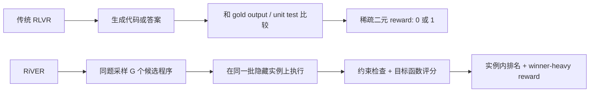

# RiVER：没有标准答案的优化题，也能成为 LLM 后训练环境

### 元信息

- 论文：Reinforcement Learning without Ground-Truth Solutions can Improve LLMs
- 方法名：RiVER，Ranking-induced VERifiable framework
- 方向：大模型后训练、RLVR、代码能力、无标准答案优化任务
- 原始链接：[arXiv:2606.27369v1](https://arxiv.org/abs/2606.27369v1)
- 官方日期：arXiv `published/updated = 2026-06-25T17:59:36Z`
- 作者与机构：UC San Diego、Snowflake AI Research
- 本文阅读范围：arXiv 摘要、HTML/PDF、LaTeX 源码、主结果表、方法节、实验节、理论讨论与 AHC057 案例附录。

### TL;DR

- 这篇论文问的是：**RLVR 是否必须依赖标准答案、gold output 或单元测试式 pass/fail？**
- 作者给出的答案是：不一定。很多优化题没有已知最优解，却可以执行候选程序、检查约束、计算目标函数，并比较不同候选的相对质量。
- RiVER 把这种环境变成后训练信号：同一个问题采样 `G=16` 个候选程序，在同一批隐藏实例上运行，再按实例内排名构造 reward。
- 方法重点不是“直接用分数做 RL”，而是先解决两个病灶：
  - **scale dominance**：不同隐藏实例的原始分数尺度不同，直接平均会让大数值实例主导梯度。
  - **frequency dominance**：常见但次优的策略如果被采样很多次，其累计梯度可能压过少见但更强的策略。
- RiVER 的 reward 由三步组成：
  - 实例内排名，消掉不同实例的分数尺度。
  - winner-heavy shaping，给当前组内最佳候选更清晰的正信号。
  - 跨隐藏实例平均，再放进 GRPO。
- 训练数据只来自 12 个 AtCoder Heuristic Contest 任务，且没有标准解；评测覆盖 ALE-Bench、LiveCodeBench v5/v6、USACO。
- 关键数字：
  - Qwen3-8B 的 ALE Rating 从 845 提到 987，Rank% 从 86.4 降到 77.5。
  - GLM-Z1-9B-0414 的 ALE Rating 从 805 提到 962，Rank% 从 88.2 降到 78.8。
  - 只在无 ground-truth 的优化任务上训练后，LiveCodeBench 与 USACO 这类 exact-solution benchmark 也有平均绝对提升：Qwen3-8B 约 2.4 点，GLM-Z1-9B 约 3.5 点。
- 局限同样明确：
  - 训练环境集中在 AHC 风格算法优化题，不能直接推出所有开放式任务都适合。
  - 主要模型是 8B/9B 级开源 reasoning model，尚未覆盖更大闭源模型。
  - 论文证明 reward calibration 很关键，但还没有给出如何自动选择最优 shaping 的通用规则。

### 1. 研究问题：为什么“可验证”不应该被缩窄成“有标准答案”？

- 传统 RLVR 的强项在于：
  - 数学题可以和标准答案比较。
  - 编程题可以跑单元测试。
  - 形式化任务可以用 verifier 给出二元正确性。
- 这种设定的问题也很明显：
  - 可训练任务范围被限制在“答案已知”的语料。
  - reward 经常是稀疏的 `0/1`，很难区分“差一点可行”和“完全不可行”。
  - 当模型已经很强时，一组 rollout 可能全对；当模型很弱时，一组 rollout 可能全错。两种情况下，组内相对优势都会塌缩。

论文把问题重新表述为：

> 只要环境能执行候选方案、检查可行性、计算目标函数，它就可以提供可验证反馈；未必需要 gold code、gold output 或最优解。

这个转向很重要，因为优化题常常满足以下结构：

| 维度 | exact-answer RLVR | RiVER 关注的优化任务 |
|---|---|---|
| 答案形态 | 一个标准答案或一组测试通过条件 | 多个可行解，质量不同 |
| 验证方式 | 匹配答案、通过测试 | 约束检查 + 目标函数评分 |
| reward 常见形态 | 二元 `0/1` | 连续分数、相对排名、可行性 |
| 训练风险 | reward 稀疏、覆盖窄 | 分数尺度不齐、次优模式重复 |
| 论文目标 | 继续强化已知答案任务 | 让无标准答案任务也能训练通用代码能力 |

### 2. 论文主张与论证路线

| Claim | Mechanism | Evidence | Boundary |
|---|---|---|---|
| 无标准答案优化题可以成为 RLVR 环境 | 候选程序在隐藏实例上执行，环境检查约束并返回目标值 | AHC 训练任务提供官方 evaluator 与 test-instance generator | 只证明 AHC 风格任务可用，未覆盖自然语言开放任务 |
| 原始目标分数不能直接当 reward | 不同实例的分数范围可能差几个数量级 | Raw-GRPO、RS-GRPO、Raw-Binary 虽提升 ALE，却不能稳定迁移到 LCB/USACO | 不能说明 raw score 永远无效，只说明本设定下校准不足 |
| 实例内排名可以消除 scale dominance | 同一隐藏实例内只比较候选之间的相对质量 | Instance-Norm、Rank-uniform 改善 ALE；RiVER 在其上继续提升 | 排名会丢失绝对分差信息 |
| winner-heavy shaping 可以缓解 frequency dominance | 最佳候选拿到清晰正信号，非最佳可行候选仍保留有界分级反馈 | RiVER 比 Rank-uniform 在 Qwen3-8B 上 ALE 多 +27，在 GLM 上多 +31 | winner-heavy 的具体形状仍是人为设计 |
| 优化题训练能迁移到 exact-solution benchmark | 训练只用 12 个无 ground-truth AHC 任务，评测含 LCB/USACO | Qwen3-8B 平均 +2.4 点，GLM-Z1-9B 平均 +3.5 点 | 迁移幅度不大，且 easy 子集提升有限 |

### 3. 方法机制：RiVER 到底把什么变成了 reward？

RiVER 的输入不是“题目和标准答案”，而是一组三元组：

- `q`：问题 prompt，要求模型最终输出可执行程序。
- `E`：确定性 evaluator，负责运行程序、检查输出格式/约束、计算目标函数。
- `{T_m}_{m=1}^M`：隐藏测试实例。

对每个 prompt，旧策略采样一组候选：

```text
o_1, ..., o_G ~ pi_old(. | q)
code_i = Code(o_i)
```

每个候选程序都在同一批隐藏实例上执行：

```text
V[i,m] = v(code_i, T_m)          # 是否有效
F[i,m] = f(code_i, T_m)          # 有效时的目标分数
F[i,m] = -infinity               # 无效时只作 bookkeeping
```

这里的关键是“同一批隐藏实例”：

- 如果候选 A 和候选 B 被放在不同实例上跑，目标值没有可比性。
- 如果它们在同一实例上跑，谁更好就能由 evaluator 直接判断。
- 因此，监督信号来自“候选之间的相对质量”，不是“是否匹配参考解”。

### 4. 两个失败模式：scale dominance 与 frequency dominance

#### 4.1 scale dominance：大数值实例不等于更有学习价值

原始分数 baseline 可以写成：

```math
R_i^{raw} = \frac{1}{M}\sum_{m=1}^{M} F_{i,m}
```

问题在于：

- 实例 A 的分数可能在 `1000` 到 `2000` 之间。
- 实例 B 的分数可能在 `10` 到 `20` 之间。
- 直接平均时，实例 A 的数值范围会压过实例 B。
- 但这不代表实例 A 更能区分“好程序”和“坏程序”。

RiVER 的处理是：

- 不跨实例直接比较原始分数。
- 对每个隐藏实例 `T_m` 单独排序。
- 只保留候选在该实例内的 rank。
- 任何单调变换都不会改变 rank，因此分数尺度不再支配 reward。

#### 4.2 frequency dominance：常见次优策略可能压过稀有强策略

论文给了一个简化的一步 policy-gradient 例子：

```math
G_x = \hat{A}_x \nabla_\theta \log \pi_\theta(x|q)
```

```math
G_y \approx n_y \bar{A}_y \nabla_\theta \log \pi_\theta(y|q)
```

变量含义：

- `x`：组里最强但只出现一次的候选策略。
- `y`：常见但不是最优的候选策略。
- `n_y`：`y` 这一类策略被采样出的次数。
- `A_hat_x`：稀有强策略的 advantage。
- `A_bar_y`：常见次优策略的平均 advantage。

危险条件是：

```math
n_y \bar{A}_y > \hat{A}_x
```

这意味着：

- 即使每个 `y` 都比 `x` 弱；
- 只要 `y` 出现得足够频繁；
- 它的总梯度质量仍可能超过 `x`；
- 模型就会强化“常见但不够好”的模式。

### 5. RiVER reward：排名、winner-heavy shaping、GRPO

RiVER 的 reward 公式是全文最核心的机制：

```math
s_{i,m} =
\begin{cases}
-1, & V_{i,m}=0 \\
1, & V_{i,m}=1 \text{ 且 } r_{i,m}=1 \\
\mathrm{clip}((G-1-r_{i,m})/(G-3),0,1)-0.5, & \text{其他有效候选}
\end{cases}
```

解释如下：

- 无效程序：
  - 崩溃、超时、格式错误、约束违反。
  - 直接给 `-1`。
- 当前实例内第一名：
  - 给 `1`。
  - 这就是 winner-heavy 的“锚点”。
- 其他有效候选：
  - 保留 `[-0.5, 0.5]` 内的分级反馈。
  - 不把它们都压成 `0`，避免丢掉有效但非最佳的信息。

然后跨隐藏实例平均：

```math
\bar{s}_i = \frac{1}{M}\sum_{m=1}^{M}s_{i,m}
```

最后把它作为 GRPO 的 sample-level advantage：

```math
\hat{A}_i = \bar{s}_i
```

这套设计的意义是：

- **ground-truth-free**：不需要参考解、最优解、人类标签。
- **scale-invariant**：每个隐藏实例内部排名，不受实例分数尺度影响。
- **winner-focused**：最佳候选有单独强化。
- **non-binary**：有效非最佳候选仍有分级反馈。

### 6. 算法流程：从一组程序到一次 policy update

```text
Input:
  prompt q
  evaluator E
  hidden instances T_1...T_M
  rollout policy pi_old
  group size G = 16

State:
  score matrix F[G, M]
  validity matrix V[G, M]
  shaped rewards S[G, M]

Loop:
  1. 从 pi_old(.|q) 采样 G 个回答 o_i。
  2. 从每个回答中抽取最终可执行程序 code_i。
  3. 对每个隐藏实例 T_m：
     - 执行 code_i。
     - 若崩溃、超时、格式错误或约束违反，记 V[i,m]=0。
     - 若有效，计算目标分数 F[i,m]。
  4. 对每个 T_m：
     - 在有效候选内按 F[i,m] 排名。
     - tie 使用 average-rank，避免重复候选都拿唯一第一名信用。
     - 按 winner-heavy 公式得到 s[i,m]。
  5. 对每个候选 i：
     - 计算 s_bar[i] = mean_m s[i,m]。
     - 作为 GRPO advantage。

Output:
  用 rank-induced winner-heavy advantage 更新 policy。

Failure boundary:
  若 evaluator 本身不可执行、目标函数不可靠、隐藏实例过少或候选几乎全无效，RiVER 也无法产生稳定信号。
```

### 7. 实验设置：作者如何避免“训练集和评测集重叠”？

训练环境：

- 候选池来自 AtCoder Heuristic Contest `AHC047` 到 `AHC062`。
- 作者排除 4 个不兼容 one-pass setting 的任务。
- 最终训练任务是 12 个：`AHC048-AHC053` 与 `AHC055-AHC060`。
- 每个任务提供：
  - 题目描述。
  - 官方 evaluator。
  - test-instance generator。

训练协议：

| 项 | 设置 |
|---|---|
| Backbone | Qwen3-8B、GLM-Z1-9B-0414 |
| 优化器 | AdamW |
| 学习率 | `1e-6` |
| KL coefficient | `0.001` |
| Group size | `G=16` |
| Global batch size | `64` |
| 每个训练 prompt 的隐藏实例 | `10` |

评测协议：

| Benchmark | 类型 | 指标 |
|---|---|---|
| ALE-Bench | score-based algorithm engineering | Rating、Rank% |
| LiveCodeBench v5 | exact-solution coding | Easy/Medium/Hard/Avg Pass@1 |
| LiveCodeBench v6 | exact-solution coding | Easy/Medium/Hard/Avg Pass@1 |
| USACO | exact-solution olympiad coding | Pass@1 |

对照方法：

- Raw-GRPO：直接把跨实例聚合后的原始执行分数交给 GRPO。
- RS-GRPO：用 risk-sensitive transform 替换标准 group normalization。
- Raw-Binary：最高分候选给 1，其余给 0。
- Instance-Norm：每个实例内归一化原始分数，再跨实例平均。
- Rank-uniform：使用实例内排名，但所有 rank 均匀间隔。
- RiVER：实例内排名 + winner-heavy shaping。

### 8. 主结果：为什么论文说“不是更多数值反馈就够了”？

#### 8.1 Qwen3-8B

| 方法 | ALE Rating | Rank% | LCB v5 Avg | LCB v6 Avg | USACO |
|---|---:|---:|---:|---:|---:|
| Qwen3-8B | 845 | 86.4 | 56.1 | 49.2 | 40.4 |
| Raw-GRPO | 903 | 82.5 | 56.7 | 49.3 | 40.2 |
| RS-GRPO | 904 | 82.5 | 55.9 | 50.5 | 40.0 |
| Raw-Binary | 926 | 80.9 | 55.1 | 49.0 | 41.2 |
| Instance-Norm | 935 | 80.1 | 55.7 | 49.3 | 39.6 |
| Rank-uniform | 960 | 78.9 | 56.7 | 49.1 | 39.7 |
| RiVER | 987 | 77.5 | 58.3 | 51.4 | 43.3 |

关键读法：

- Raw-GRPO 的 ALE Rating 提升了，但 USACO 从 40.4 到 40.2，反而略降。
- Rank-uniform 的 ALE Rating 到 960，但 USACO 到 39.7，仍没有迁移。
- RiVER 是表中唯一让 Qwen3-8B 在所有五个主指标上都提升的方法。
- 这支持作者的核心判断：**优化题能提供 dense feedback，但 dense feedback 必须经过校准和 winner anchoring，才更可能变成可迁移代码能力。**

#### 8.2 GLM-Z1-9B-0414

| 方法 | ALE Rating | Rank% | LCB v5 Avg | LCB v6 Avg | USACO |
|---|---:|---:|---:|---:|---:|
| GLM-Z1-9B-0414 | 805 | 88.2 | 49.2 | 46.7 | 32.4 |
| Raw-GRPO | 886 | 83.6 | 53.3 | 48.0 | 32.8 |
| RS-GRPO | 916 | 81.6 | 50.1 | 49.3 | 33.2 |
| Raw-Binary | 915 | 81.8 | 53.3 | 49.1 | 32.5 |
| Instance-Norm | 929 | 80.6 | 53.5 | 47.4 | 33.1 |
| Rank-uniform | 931 | 80.2 | 51.5 | 48.2 | 31.9 |
| RiVER | 962 | 78.8 | 54.7 | 49.7 | 34.3 |

关键读法：

- GLM 上 raw-score 系列比 Qwen 上看起来更有迁移，但仍不稳定。
- Rank-uniform 在 GLM 上把 ALE Rating 提到 931，但 USACO 从 32.4 降到 31.9。
- RiVER 相比 Rank-uniform 又增加 31 点 ALE Rating，并把 USACO 提到 34.3。
- 因此，论文不是只证明“排名有用”，而是更具体地证明：
  - 排名能解决尺度问题；
  - winner-heavy shaping 才更接近可迁移信号。

### 9. 难度拆解：提升集中在哪里？

论文在 LiveCodeBench 难度层面给了一个有用观察：

- Easy 子集提升很小。
  - Qwen3-8B 原始 easy 已经在 96% 左右。
  - GLM 原始 easy 也超过 93%。
- Medium 与 Hard 更能体现变化。
  - Qwen3-8B 在 LCB v5 medium 上 +5.0。
  - Qwen3-8B 在 LCB v5 hard 上 +1.4。
  - GLM-Z1-9B 在 LCB v5 medium 上 +7.0。
  - GLM-Z1-9B 在 LCB v5 hard 上 +5.7。

这说明 RiVER 更像是在强化：

- 复杂搜索。
- 算法结构选择。
- 候选方案比较。
- 对约束与目标函数的联合处理。

它不像是在让模型记住 easy 题模板，因为 easy 子集本来已经接近饱和。

### 10. Figure 与 Table 证据如何支撑主张？

#### Figure 1：从 answer matching 到 group-wise rank-induced verification

论文 Figure 1 对比了两类验证：



它支持的主张是：

- “可验证”不等于“有标准答案”。
- 只要 evaluator 能检查 feasibility 并计算 objective，就能比较候选质量。
- 比较的对象是同组候选之间的相对表现，而不是候选和参考答案之间的相似度。

它不能证明的是：

- 这种环境一定能提升所有能力。
- 所有目标函数都能提供健康的后训练信号。
- 排名 reward 的具体形状已经最优。

#### Table 1：主结果真正比较的是 reward design

Table 1 的核心不是“RiVER 分数最高”这么简单，而是逐层排除了几种解释：

| 可能解释 | 表中反证 |
|---|---|
| 只要执行反馈变多就能迁移 | Raw-GRPO 提升 ALE 但迁移不稳定 |
| 只要 winner-take-all 就够 | Raw-Binary 提升 ALE，但 LCB/USACO 不稳定 |
| 只要实例内归一化就够 | Instance-Norm 在 Qwen 上 USACO 降到 39.6 |
| 只要实例内排名就够 | Rank-uniform ALE 强，但 exact-solution 迁移不足 |
| 排名 + winner-heavy 更稳 | RiVER 同时提升 ALE 与 LCB/USACO |

### 11. AHC057 案例：reward 设计改变了模型发现的 solver 形态

论文的案例研究看的是 AHC057：

- 目标不是只比较最终 benchmark 数字。
- 作者还检查训练过程中发现的 best-so-far solver。
- Figure 2 显示 RiVER 在 12 个 AHC 训练问题中的 8 个上更早或更强地发现 best-so-far solver。

AHC057 的 qualitative code inspection 给了更具体的机制：

- 原始 Qwen3-8B：
  - 已经能理解任务基本接口。
  - 但分组方式偏 index-based，不充分利用几何结构。
- Raw-GRPO：
  - 转向静态几何启发式。
  - 以固定 seed 为中心选择附近点。
- RiVER：
  - 同样使用 toroidal proximity 与 MST。
  - 但分组更 adaptive：每次把离当前 group 最近的点加入。
  - 这会产生更紧凑的局部 cluster，降低组内连接成本。

可以把三者的差别概括成：

| 模型/训练方式 | 学到的 solver 风格 | 作者认为的问题或优势 |
|---|---|---|
| Base Qwen3-8B | index-based grouping | 忽略几何结构 |
| Raw-GRPO | 固定 seed 的距离分组 | 利用几何，但策略较僵硬 |
| RiVER | group 增量式最近邻扩张 + MST | 更自适应，更能降低局部连接成本 |

这部分证据的价值在于：

- 它把“benchmark 提升”连接到“程序策略变化”。
- 它说明 RiVER 不是只把分数调高，而是诱导了更合理的算法启发式。
- 但它仍是单个任务的案例，不应被过度推广成所有任务上的机制证明。

### 12. 理论视角：Group-relative feedback resolution

论文最后用一个信息论视角解释为什么 score-based 环境可能更适合 group-relative RL。

定义：

```math
\mathrm{GFR}_G(q) = H_G(Z_q) = -\frac{1}{G-1}\log \sum_z p_z^G
```

变量解释：

- `q`：一个 prompt。
- `o ~ pi_old(.|q)`：旧策略采样出的回答。
- `Z_q = Phi_q(o)`：环境诱导出的反馈。
- `p_z = Pr[Z_q = z]`：某个反馈值出现的概率。
- `G`：rollout group size。
- `H_G`：order-G Rényi entropy。

作者给出的碰撞概率是：

```math
Pr[Z_1 = ... = Z_G] = exp(-(G-1)GFR_G(q))
```

直觉：

- 如果 feedback 只有 `0/1`，一组样本很容易全都失败或全都成功。
- 一旦全组反馈相同，group-relative advantage 就没有区分度。
- 如果 score-based 环境能给出多个可区分反馈层级，整组反馈完全碰撞的概率会下降。
- 因此，优化任务的优势不是“分数看起来更细”，而是它更可能在同一组 rollout 中产生可比较的相对差异。

但作者也强调：

- feedback resolution 高，不等于 reward 可靠。
- 如果不做校准，dense score 仍会被 scale dominance 与 frequency dominance 污染。
- RiVER 的作用是把“丰富但未校准”的反馈转成“稳定且可用于 GRPO”的优势信号。

### 13. 相关工作中的位置判断

这篇论文位于三条线交汇处：

- RLVR / reasoning model 后训练：
  - 继承 GRPO、PPO-style clipped objective、KL regularization。
  - 区别在于 reward 来源不是标准答案或单元测试 pass/fail。
- Reward design 与 exploration：
  - 论文回应了 outcome-level binary reward 稀疏、信息量不足的问题。
  - 与过程奖励模型不同，它不引入人工 step label。
- Optimization as training environment：
  - 许多工作把 NP-hard 或优化题当作目标 benchmark。
  - RiVER 更进一步：把优化题当作提升通用代码能力的训练环境。

它与近期“后训练如何提升 agent/coding”工作的区别是：

- 不是扩大可验证题库里的标准答案。
- 不是做 rollout 系统吞吐优化。
- 不是只研究 benchmark harness 设计。
- 而是把“无标准答案但可执行比较”的任务类别纳入 RLVR。

### 14. 证据边界与可复现性问题

需要保留的边界：

- 训练任务范围窄：
  - 12 个 AHC 任务都属于算法优化题。
  - 它们有明确 evaluator 和 objective。
  - 不能自然外推到开放式写作、长程 agent、网页操作等 evaluator 更弱的任务。
- 模型规模有限：
  - Qwen3-8B 与 GLM-Z1-9B-0414 是强开源 reasoning backbone。
  - 论文没有展示 30B、70B 或闭源前沿模型上的相同曲线。
- reward shape 是手工设计：
  - invalid=`-1`、winner=`1`、其他有效候选落在 `[-0.5,0.5]`。
  - 这很合理，但仍是一个设计选择。
  - 论文没有系统搜索不同 shaping 参数。
- exact-solution 迁移幅度需要谨慎解读：
  - Qwen 的平均提升约 2.4 点，GLM 约 3.5 点。
  - 这是有意义的，但不是数量级变化。
  - Easy 子集接近饱和，主要收益在 medium/hard。
- 可复现性材料：
  - arXiv 源码包含表格、方法、附录 prompt 与 AHC057 solver listing。
  - 但本次阅读未看到完整训练代码仓库或可直接运行的复现实验脚本。

### 15. 研究者视角的延伸问题

RiVER 最值得继续追问的不是“能否把 AHC 分数刷高”，而是以下几个方向：

- **怎样判断一个环境适合 ground-truth-free RLVR？**
  - 它需要 evaluator。
  - 需要目标函数能比较候选。
  - 需要候选之间有足够反馈分辨率。
  - 还需要目标函数不鼓励投机或 benchmark hacking。
- **winner-heavy shaping 是否能自动化？**
  - 不同任务的候选分布不同。
  - 有些任务可能需要更平滑的 rank reward。
  - 有些任务可能需要更强的 diversity 或 novelty 约束。
- **这类方法能否进入 agent 训练？**
  - 许多 agent 任务没有单一标准答案。
  - 但如果可以执行轨迹、检查约束、计算成本或收益，就可能构造相对比较。
  - 难点是 agent evaluator 往往比 AHC evaluator 更脆弱，也更容易被 reward hacking。
- **安全含义是什么？**
  - 更强的 ground-truth-free RL 可以扩大可训练任务范围。
  - 但如果 evaluator 没有覆盖安全约束，模型可能更会优化目标函数漏洞。
  - 因此 RiVER 式训练需要和约束检查、安全测试、反投机评估一起设计。
- **后训练数据瓶颈是否会改变？**
  - 如果无标准答案优化环境有效，后训练不必只等待人工标注或标准测试集。
  - 新瓶颈会转向：构造可靠 evaluator、隐藏实例生成器、反作弊约束和 reward calibration。

### 16. 关键段落细读：为什么 raw score 的失败不是小问题？

论文里最容易被低估的一点是：作者不是把 raw score 当成一个弱 baseline 随手比较，而是在用它排除一种直觉。

这种直觉是：

- 优化题有连续分数。
- 连续分数比二元 reward 信息更多。
- 所以直接把分数送进 GRPO，应该天然更好。

Table 1 恰好说明这个直觉不完整：

- Raw-GRPO 在 ALE-Bench 上确实提升。
- Raw-Binary 与 RS-GRPO 也能让 score-based contest 变好。
- 但这些方法没有稳定改善 LiveCodeBench 与 USACO。
- 也就是说，模型可能学到了“如何迎合 AHC 分数尺度”，却没有学到更一般的程序设计能力。

这一点对后训练研究很关键，因为很多工程系统都会自然走向“把可测量指标直接变成 reward”：

| 场景 | 诱人的 raw reward | 可能的问题 |
|---|---|---|
| 代码 agent | 测试通过率、运行时间、patch 数量 | 容易过拟合 harness 或写投机补丁 |
| 浏览器 agent | 页面任务完成分、点击成本 | 可能学到脆弱 UI 路径 |
| 安全 agent | 漏洞发现数量、扫描得分 | 可能奖励噪声告警或破坏性行为 |
| 推理模型 | 题目最终得分 | 可能压制稀有但更高质量的推理路线 |

RiVER 的启发是：

- 可测量不等于可训练。
- 可执行不等于 reward 已经健康。
- 分数丰富不等于梯度方向可靠。
- reward 需要把“任务目标值”翻译成“对 policy update 有意义的比较信号”。

### 17. 细读 winner-heavy：它不是简单崇拜第一名

winner-heavy shaping 容易被误解成 winner-take-all，但论文实际上避免了这个极端。

Raw-Binary baseline 的做法是：

- 第一名给 `1`。
- 其他候选给 `0`。
- 这会丢掉非最佳有效候选之间的差异。

RiVER 的做法是：

- 第一名给 `1`，建立强锚点。
- 无效候选给 `-1`，明确排斥不可执行和违反约束的输出。
- 其他有效候选仍在 `[-0.5, 0.5]` 内获得分级反馈。

这个设计在训练语义上更细：

- 它不鼓励“只要不是第一名就完全无用”。
- 它也不允许大量次优候选凭数量淹没第一名。
- 它把有效候选的梯度压到较小区间，让更新更集中在当前组内真正最好的程序。

这也解释了为什么 Rank-uniform 不够：

- Rank-uniform 已经解决了实例尺度问题。
- 但它对相邻排名的间隔过于均匀。
- 在开放式优化题里，第一名可能代表一次稀有的策略发现。
- 如果 reward 不能突出这种发现，模型仍可能强化频繁出现的普通策略。

### 18. 与 agent 训练的关系：RiVER 能迁移思想，但不能直接照搬

这篇论文属于后训练，但它对 agent 训练也有明确启发。

可直接迁移的部分：

- 让多个候选轨迹在同一任务实例上比较。
- 把执行反馈转成相对排名，而不是直接用原始分数。
- 把失败、可行但普通、组内最佳分开处理。
- 检查 reward 是否存在尺度支配和频率支配。

不能直接照搬的部分：

- AHC evaluator 很干净，agent evaluator 往往不干净。
- AHC 输出是程序和解，agent 输出是长轨迹、工具调用、外部状态变化。
- AHC 的 hidden instance 可以批量生成，真实 agent 任务的隐藏状态与副作用更难控制。
- AHC 的 objective 多数可重复，浏览器、文件系统、网络或安全任务的评价可能受时序影响。

因此，如果把 RiVER 思想用于 agent，需要先补齐几类约束：

- 沙箱执行，防止候选轨迹破坏共享状态。
- 同实例 replay，保证不同候选面临同样环境。
- 多目标评价，把成功率、成本、安全约束、可恢复性分开记录。
- reward audit，检查模型是否在利用 evaluator 漏洞。

从这个角度看，RiVER 更像是一条原则：

- 找到可执行环境。
- 找到可比较反馈。
- 先校准再训练。
- 先证明不会只优化局部分数，再谈能力迁移。

### 19. 结论

- RiVER 的核心贡献不是提出一个复杂新 RL 算法，而是扩大了“可验证后训练”的定义。
- 它把 verifiable reward 从“答案匹配”推进到“候选方案可执行、可约束检查、可相对比较”。
- 实验说明，未经校准的原始分数会提升 score-based benchmark，却不一定迁移到 exact-solution benchmark。
- 只有把实例内排名和 winner-heavy shaping 结合起来，才更稳定地把无标准答案优化题转成通用代码能力收益。
- 对后训练研究来说，这篇论文提供了一个重要方向：
  - 不只是寻找更多标准答案；
  - 也要寻找更多可执行、可比较、可校准的训练环境。
