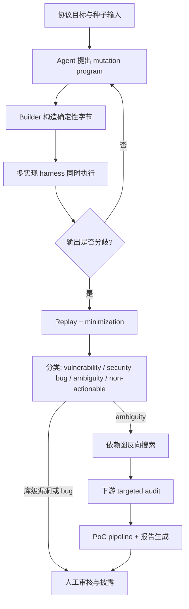

# Chai：把 Agent 漏洞发现从“逐项目碰运气”改成“先找协议差异，再沿依赖图追踪”

### 元信息与 TL;DR

- **论文**：Chai: Agentic Discovery of Cryptographic Misuse Vulnerabilities
- **作者**：Corban Villa, Sohee Kim, Austin Chu, Alon Shakevsky, Raluca Ada Popa
- **机构**：UC Berkeley
- **日期**：2026-06-25
- **原文**：[arXiv:2606.26933v1](https://arxiv.org/abs/2606.26933)
- **方向**：AI for security / Agentic vulnerability discovery / cryptographic misuse

**TL;DR：**

- Chai 研究的问题不是“让 Agent 在一个仓库里尽量多找 bug”，而是：当漏洞类型没有 sanitizer、没有崩溃 oracle、没有唯一正确输出时，Agent 怎样才能发现可验证的密码协议误用漏洞。
- 它把传统差分测试和 Agent 结合起来：Agent 负责提出 X.509、JWT、SAML 输入变异；确定性 builder 负责构造可复现字节；多语言 harness 同时运行 47 个库；差分结果提供可检查信号。
- Chai 的核心转向是“库优先”：先在多个实现间发现同一协议输入的接受/拒绝分歧，再把其中的漏洞、security bug 或 specification ambiguity 沿依赖图反向追踪到下游应用。
- 实验覆盖 3 个协议族、47 个库、8 种语言；系统由约 20k 行 X.509 代码、15k 行 JWT/JOSE 代码、17k 行 SAML 代码、11k 行报告/可视化管线、1.4k 行 PoC controller 组成。
- 主要结果是 100+ 个漏洞和安全 bug 线索，包括 wolfSSL 证书链验证绕过、浏览器背后 TLS 库的 fail-open、Linux 发行版中 TLS 库的验证缺陷，以及 JWT/SAML 下游应用中的歧义继承问题。
- 在 X.509 上，Chai 用 1,500 个证书、约 52.5 美元发现 147 个 unique discrepancy vectors；MLCerts 约 50 万个证书、约 560 美元只到 73 个。JWT 和 SAML 上 Chai 也高于 baseline。
- 它并不是更快找到同一批差异：Figure 7 显示 Chai 独有差异为 X.509 的 132/147、JWT 的 39/50、SAML 的 12/17，说明 Agent 生成的协议语义变异确实改变了搜索区域。
- 局限也很明确：代码和完整数据未随论文公开；多个发现仍在协调披露；系统依赖多实现共享接口；差分只能发现“实现间不一致”的问题，不能证明所有一致接受的错误行为。

### 研究问题：为什么密码误用不适合普通 Agent 扫仓库？

这篇论文把 AI 安全和传统安全工程里的一个矛盾说得很清楚：

- **内存安全漏洞**常常有强 oracle：
  - 崩溃；
  - sanitizer 报错；
  - coverage 或 exploit harness；
  - 可重复触发的越界、UAF、double free。
- **密码协议误用**通常没有这种 oracle：
  - 一个 JWT token 能验签，不等于它应该被信任；
  - 一个证书链被库接受，不等于它真的连到可信根；
  - 一个 SAML response 签名正确，不等于它没有被 replay；
  - 规范允许某种编码，不等于应用把这种编码当作安全边界时仍然安全。

论文的研究问题可以写成：

> 在没有明确 expected output 的协议安全场景中，如何让 Agent 发现的候选漏洞带有可验证、可复现、可审查的证据，而不是只生成“看起来像漏洞”的报告？

作者认为，逐项目扫描的 Agent 范式在这里会遇到三层浪费：

1. **依赖外部化**：危险行为常在库里，应用自己的代码看起来可能完全合理。
2. **规范歧义**：同一行为可能既不明显违反规范，也不明显安全。
3. **重复审计**：如果 1 个库行为影响 1,000 个下游项目，逐项目 Agent 会重复推理同一件事 1,000 次。

Chai 因此把单位从“项目”改成“协议输入和库行为差异”。

### 论文主张与论证路线

| Claim | Mechanism | Evidence | Boundary |
|---|---|---|---|
| Agent 漏洞发现需要可检查信号，否则安全专家会被大量主观报告淹没 | 用差分测试替代单实现 expected-output oracle | 同一输入提交给多个 X.509/JWT/SAML 实现，接受/拒绝分歧可复现 | 差分只能说明至少有一方行为异常，不能自动判定哪一方正确 |
| 密码协议库适合“放大测试” | 同一 DER 证书链、compact JWT、signed XML response 可送入多个库 | 47 个库、8 种语言、3 个协议族共用 harness | 适用于共享接口清晰的协议；普通业务 API 未必天然满足 |
| Agent 的价值在于生成语义变异，而不是替代验证 | Agent 选变异方向；builder 负责编码、签名、序列化；harness 给 JSON verdict | Figure 4 把 Plan、Execute、Analyze 串成闭环 | builder 和 harness 仍需工程投入，论文未公开完整代码 |
| 库级歧义可以变成下游漏洞线索 | discrepancy tracing：从库分歧查依赖图，再做 targeted audit | JWT Base64URL revocation bypass、SAML replay case study | 应用层 PoC 仍需沙箱复现和人工审核 |
| 这种范式比开放式代码 Agent 更可靠 | 从具体差分出发，而不是让 Agent 自己猜漏洞 | wolfSSL rediscovery：Codex 10/10 未找到两个绕过；Claude Code 只稳定找到较浅的 depth bypass | 这是一个目标库实验，不代表所有漏洞类别 |

这条论证路线很有研究价值，因为它没有把“Agent 更聪明”当作默认答案。作者实际做的是给 Agent 缩小问题、增加外部信号、增加复现约束，并把不可判定的“漏洞直觉”转化为可枚举的“实现差异”。

### 方法机制：两阶段系统，而不是单次 Agent 扫描

Chai 的系统由两个独立阶段构成，中间共享的 artifact 是 **discrepancy**。



#### 第一阶段：Agentic differential testing

Chai 不是让模型直接写“漏洞报告”，而是让模型提出协议输入的变异程序：

- **Seed**：先由 builder 生成一个 known-good baseline，确认库之间初始一致。
- **Mutation agent**：提出一组有序操作，例如改签名覆盖范围、删 JWT claim、插入 XML namespace、重排 SAML assertion。
- **Builder**：用确定性方式构造真实协议消息：
  - X.509：DER-encoded certificate chain；
  - JWT/JOSE：compact JWS 或 JWE token；
  - SAML：signed XML response。
- **Harness**：每个库包装成统一接口，输入字节，输出 JSON verdict：
  - accept/reject；
  - rejection reason 或 exception；
  - 库解析出的 identity attributes。

这个设计把 Agent 限定在“提出安全假设”的位置，把密码学机械细节交给 builder。它避免了让模型直接手写复杂编码、签名、XML canonicalization 或证书链细节带来的不可复现问题。

#### 第二阶段：discrepancy tracing

差分测试发现的 ambiguity 不一定是库漏洞。许多协议本来就允许实现自由度：

- JWT 库可能允许非规范 Base64URL 拼写，只要解码后的签名字节正确；
- SAML 库可能只验证签名，把 replay cache 留给应用；
- 某些库可能默认接受应用提供的 key source，而另一些库要求 caller 显式配置 trust anchor。

Chai 的关键判断是：这些 ambiguity 可以变成下游漏洞线索。流程是：

1. 找到一个库没有强制执行、但其他库会执行的安全属性。
2. 用 package manifests 构建依赖图，覆盖 17 个生态，包括 npm、PyPI、Go modules、Maven、Cargo、Composer。
3. 从 OpenSSF Criticality Score 最高的 50,000 个仓库出发，追踪直接和间接依赖。
4. 对继承该库行为的应用做 read-only 初筛。
5. 对可能受影响的应用生成沙箱 PoC。
6. 用 setup script、run script、unified diff 和报告草稿支撑人工审核。

这里的 Agent 任务变成了 close-ended question：

- 不再是“请找这个应用的认证绕过”；
- 而是“这个应用是否把 JWT token 字符串当作唯一身份，但底层库接受多个等价拼写？”

这个缩小本身就是论文对 Agent 安全工具的核心启发。

### 算法流程、公式和伪代码

#### 放大测试的基本公式

设某协议的实现集合为：

```text
Libraries = {L1, L2, ..., Ln}
```

某个标准的潜在实现缺陷空间为：

```text
Bugs_standard = Bugs_L1 union Bugs_L2 union ... union Bugs_Ln
```

逐项目 Agent 扫描近似是在每个库或应用的局部空间中反复搜索：

```text
Cost_naive ~= sum over projects/searches C(project_i)
```

Chai 的放大来自单个协议输入同时触达多个库：

```text
signal(x) = verdict(L1, x), verdict(L2, x), ..., verdict(Ln, x)

discrepancy(x) = 1 if not all verdicts equivalent
```

它不需要知道 `expected(x)`，只需要知道多个实现对 `x` 的行为不一致。这样，单次输入的价值变成：

```text
amplification(x) ~= number_of_harnessed_libraries_exercised_by_x
```

#### UCB1 资源分配

论文把搜索空间切成可租赁的 mutation group：

```text
mutation_group = (cluster, operation)
```

- `cluster`：意图，例如 SAML 的 signature/key trust、assertion wrapping、parser boundary。
- `operation`：具体机制，例如 clone assertion、edit header JSON、remove claim。

Chai 用 UCB1 让并行 Agent 不要都挤到同一类显眼攻击上。可理解为：

```text
score(g) = observed_yield(g) + exploration_bonus(g)

exploration_bonus(g) ~= sqrt(2 * log(total_leases) / leases(g))
```

含义是：

- 产出新的 behavior 的 group 会继续被分配；
- 长时间没被尝试的 group 会因为 bonus 回到竞争；
- 已经被另一个 Agent 租走的 group 会被跳过，减少重复搜索。

#### Chai 差分测试伪代码

```text
Input:
  protocol P
  harnesses H = {h1, ..., hn}
  seed generator S
  mutation groups G
  disclosure index D

State:
  memory M of prior candidates and discrepancies
  lease table over mutation groups
  confirmed findings F

Loop:
  g <- acquire_lease_ucb1(G)
  context <- retrieve(D, g, M)
  program <- mutation_agent.propose(seed, g, context)
  candidate <- builder.construct(seed, program)
  verdicts <- [h.run(candidate) for h in H]

  if equivalent(verdicts):
      update(M, candidate, "no discrepancy")
      release_lease(g, reward=0)
      continue

  if not replay(candidate, H):
      update(M, candidate, "nondeterministic")
      release_lease(g, reward=0)
      continue

  minimal_program <- minimize(program, H)
  label <- classify(verdicts, minimal_program)

  if label in {vulnerability, security_bug}:
      F.add(report_library_finding(candidate, label))
  else if label == ambiguity:
      F.add(trace_downstream(candidate, label))

  release_lease(g, reward=new_behavior_count(label))

Output:
  reviewed findings, minimized candidates, PoCs, disclosure reports
```

失败边界也嵌在伪代码里：

- 如果分歧不可 replay，候选会被丢弃；
- 如果 minimization 后分歧消失，说明关键 mutation 没保留；
- 如果分类为 non-actionable difference，就不进入披露；
- 如果 ambiguity 无法在下游应用中证明安全影响，就只能保留为库行为差异。

### 实验设置：协议、库、模型和 baseline

论文实验覆盖面如下：

| 维度 | 设置 |
|---|---|
| 协议族 | X.509、JWT/JOSE、SAML |
| 库数量 | X.509 13 个、JWT/JOSE 23 个、SAML 11 个，共 47 个 |
| 语言 | 8 种语言，包括 C、Go、Ruby、PHP、Node.js 等 |
| Builder 依赖 | X.509 用 cryptography/asn1crypto/pyOpenSSL；JWT 用 cryptography/ecdsa；SAML 用 signxml/lxml |
| Agent 路由 | LiteLLM，多 provider 跟踪成本 |
| Agent baseline | Codex CLI 0.137.0、Claude Code 2.1.173 |
| Mutator models | GPT-5.5、Claude Opus 4.8、Gemini 3.5 Flash、Kimi K2.6 |
| Embedding | text-embedding-3-small，cosine similarity |
| 依赖图种子 | OpenSSF Criticality Score 2025-07-25 的 50,000 个关键仓库 |

baseline 包括：

- X.509：
  - MLCerts；
  - TransCert；
  - FrankenCerts。
- JWT：
  - Build-API naive fuzzer；
  - jwt-fuzzer；
  - jwt_tool。
- SAML：
  - Build-API naive fuzzer；
  - AFL++ with XML dictionary。

评价指标不是“漏洞报告数量”这么简单，而是包括：

- unique differences；
- 差异是否被 baseline 也发现；
- 差异的 accept-count 分布；
- mutation group 的产出；
- open-ended Agent rediscovery 成功率；
- 披露和人工确认状态。

### 主结果：Chai 找到的不只是更多，而且是不同种类的差异

#### Figure 6：更少输入、更低成本、更多差异

Figure 6 的关键数字是：

| 协议 | Chai 结果 | 最强 baseline 对比 | 解释 |
|---|---:|---:|---|
| X.509 | 1,500 个证书，147 个 unique differences，约 52.5 美元 | MLCerts 约 500,000 个证书，73 个 unique differences，约 560 美元 | Chai 用约千分之一输入、十分之一成本达到约 2 倍差异数 |
| JWT | 50 个 unique differences | jwt-fuzzer / jwt_tool 跑到耗尽仍更少 | Agent mutation 仍未 plateau，说明还有未探索空间 |
| SAML | 17 个 unique differences | Build-API 和 AFL++ 更少 | XML grammar fuzzer 不容易覆盖语义层信任边界 |

这里的“unique difference”不是最终漏洞数，而是跨库 accept/reject 或错误类型向量的去重结果。它衡量的是系统触达了多少种不同实现分歧。

#### Figure 7：Chai 独有差异占多数

| 协议 | Chai unique total | Chai-only | 含义 |
|---|---:|---:|---|
| X.509 | 147 | 132 | 绝大多数不是 MLCerts/TransCert/FrankenCerts 的重复发现 |
| JWT | 50 | 39 | raw JSON/header/claim mutation 进入了 baseline 不常触达区域 |
| SAML | 17 | 12 | assertion wrapping、identity、XML binding 的组合仍有独有产出 |

这对论文主张非常关键。若 Chai 只是“更贵的 fuzzer”，它应该主要复现 baseline 已发现差异；但 Figure 7 显示它改变了探索方向。

#### Figure 8：左尾更有漏洞价值

Figure 8 看的是一个输入被多少库接受。

- 如果 12 个 X.509 库里 6 个接受、6 个拒绝，往往说明规范边界模糊，难判断谁错。
- 如果只有 1 个或 2 个库接受，其他库都拒绝，它更像少数库偏离了安全共识。
- Chai 在三类协议上都更容易打到这种左尾区域。

研究意义是：Chai 不只是多找差异，还更常找到“少数实现异常接受”的差异。这类差异更可能成为 library-level vulnerability。

### 消融与失败案例：开放式 Agent 为什么不够？

论文用 wolfSSL 证书链绕过做了一个很有说服力的对照。

他们让 Claude Code 和 Codex 直接审计同一个 wolfSSL checkout，目标是找证书验证绕过，并设置三种 hint：

| Hint | Claude Code Opus 4.8 | Codex GPT-5.5 | 说明 |
|---|---:|---:|---|
| None | depth bypass 10/10，SKI bypass 0/10 | 两个 bypass 都 0/10 | Claude 能找到较显眼的 depth 问题，但找不到 SKI |
| File | depth bypass 7/10，SKI bypass 1/10 | 两个 bypass 都 0/10 | 即使提示文件，细微问题仍很难 |
| Commit | 两个 bypass 都 0/10 | 两个 bypass 都 0/10 | 历史线索不等于当前可复现漏洞 |

Chai 的不同之处是：它不读 wolfSSL 源码去猜哪里错，而是生成证书链，让 wolfSSL 和其他 TLS 库在同一输入上产生分歧。分歧先定位行为，再由人和工具追因。

这说明 Agent 的失败不是单纯“模型不够强”，而是任务太开放：

- 代码太大；
- 安全属性太隐含；
- 证书链验证细节太多；
- 没有外部 oracle 约束模型判断；
- 结果依赖模型是否刚好想到正确边界条件。

Chai 把这件事改成：

- 构造输入；
- 观察差分；
- 最小化 mutation；
- 分类行为；
- 再解释代码原因。

这是一种更适合安全工作的 Agent 任务分解。

### Case studies：四个例子分别证明什么？

#### wolfSSL certificate-chain bypass

论文公开讨论了 wolfSSL 证书链验证绕过。简化过程是：

- 攻击者提供 leaf 和 intermediate；
- wolfSSL 为了检查 leaf 签名，把 supplied intermediate 临时载入 certificate manager；
- 如果 intermediate 后续不能连到 trust root，正确行为应是卸载 intermediate 并拒绝；
- 某些边界情况下，它没有被卸载，于是继续为 leaf 背书；
- OpenSSL 等参考实现拒绝同样链，而 wolfSSL 接受。

作者追因到 `wolfSSL_X509_verify_cert()` 的 retry logic 和 Subject Key Identifier 匹配。若 intermediate 缺少 SKI，卸载步骤无法匹配它，它就留在 certificate manager 中。

这个 case 支撑了论文两个 claim：

1. 差分测试能先从行为上定位“少数库接受多数库拒绝”的异常。
2. Agent 开放式审计很难稳定找到这种隐含状态残留问题。

披露状态也很重要：

- 受影响版本到 v5.9.1；
- 维护者约 90 分钟内确认并复现；
- patch 在次日被作者确认；
- 修复进入 wolfSSL 5.9.2；
- 分配 CVE-2026-11310 和 CVE-2026-11999。

#### JWT claim validation

第二个 case 是一个 PHP JWT 库的 audience-validation bypass。

JWT 的 `aud` claim 可以是字符串或字符串数组。应用通常把它当作授权边界：token 只应被目标 audience 接受。Chai 找到的问题是 malformed audience claim 在 parsing 和 membership checking 之间触发类型混淆，使一个目标 audience 的 token 可能通过另一个 audience check。

作者把它分类为 security bug 而非 unconditional vulnerability：

- 需要可信签名路径能产生攻击者形状的 claim；
- 但一旦应用把 audience 当作 admin/user 这类边界，就可能接受低权限 token。

这个例子说明 Chai 的分类不是把所有差异都夸大成漏洞，而是区分利用前提。

#### JWT Base64URL decoding ambiguity

这个 case 是 ambiguity 变成下游漏洞的代表。

JWT compact serialization 是 Base64URL 段拼接。某些 segment 长度下，最后一个 Base64URL 字符的低位可以变化，但解码后字节相同。于是：

- 库验证的是 decoded signature bytes；
- 应用 revocation blacklist 存的是 token string；
- canonical spelling 被加入黑名单；
- byte-equivalent spelling 仍能验签，并绕过 string-keyed blacklist。

这里库行为本身可能是兼容性选择，不一定违反规范。漏洞在应用层：

```text
verify(token_bytes) == true
blacklist[token_string] == false
```

当同一个 signed token 有多个 text spellings 时，验证身份和撤销身份的等价关系断开。

#### SAML assertion replay

SAML case 说明“责任边界歧义”也能被追踪。

- 签名验证只证明 assertion 来自 IdP；
- freshness / one-time-use 需要 stateful replay cache；
- 有些 SAML 库自己维护 cache；
- 有些只暴露 assertion id，让 caller 自己处理；
- 应用上层可能看不到 assertion，无法补救。

论文中的身份服务有一条认证路径做了 one-time-use state，另一条路径没有等价 replay tracking。结果是同一个 signed response 可被重复兑换，而篡改签名的 response 仍会被拒绝。这证明问题不在签名验证，而在 freshness 责任分配。

### Figure / Table 逐项证据解读

| 图表 | 支撑的论点 | 不能证明什么 |
|---|---|---|
| Figure 1：JWT dependency stack | 一个“JWT 验证”实际跨 JWT/JWS/JWA/JWK/RSA/OpenSSL 等层，应用误读库保证很常见 | 不能说明所有 JWT 库都有问题 |
| Figure 3：amplified testing / reverse search / targeted audit | Chai 的效率来自两次放大：一次跨库，一次沿依赖图 | 不能自动保证下游 PoC 成功 |
| Figure 4：Plan/Execute/Analyze loop | Agent、RAG、builder、harness、分类器、人工审核形成闭环 | 不能证明模型输出完全可靠，仍需 replay/minimization/review |
| Figure 5：open-ended vs targeted audit | 从 ambiguity 出发能把 Agent 任务变窄 | 不能说明所有 targeted audit 都一定正确 |
| Figure 6：unique differences vs inputs/cost | Chai 在三协议上更快找到更多差异 | unique differences 不是最终 confirmed CVE 数 |
| Figure 7：overlap Venn | Chai 找到了 baseline 没找到的大量差异 | baseline 也有 Chai 漏掉的差异，二者互补 |
| Figure 8：accept-count distribution | Chai 更常触达少数库异常接受的左尾区域 | 少数接受不是形式化漏洞证明 |
| Figure 10：model/cost 和 mutation group | 设计不依赖单一模型；不同协议高产 mutation group 不同 | 未公开完整运行环境，外部复现实验仍受限 |
| Table 1：zero-day findings | 100+ findings 涵盖 X.509、JWT、SAML，含 wolfSSL 和多个重要库 | 很多 target 名称被披露流程遮蔽 |
| Table 2：blind rediscovery | 开放式 Codex/Claude Code 在 wolfSSL 上不稳定 | 只覆盖两个绕过和两个 Agent，不能推广到所有安全任务 |

### 相关工作位置：它不是替代 fuzzing，而是改变 oracle

Chai 和几类工作相邻：

- **LLM-assisted fuzzing**：
  - ChatAFL；
  - mGPTFuzz；
  - LLMIF；
  - ProtocolGuard；
  - PromptFuzz。
- **密码协议差分测试**：
  - FrankenCerts；
  - HVLearn；
  - PKCS#1 v1.5 symbolic analysis；
  - Token Time Bomb / JWTeemo。
- **下游影响分析**：
  - package ecosystem reachability；
  - npm function-level call graph；
  - ChainFuzz；
  - Brahmastra；
  - ZipDiff。

它的差异不是“也用 LLM 做 fuzzing”，而是：

1. 用 Agent 代替人工协议 grammar 设计的一部分；
2. 用差分结果约束 Agent 输出；
3. 把 ambiguity 当作下游审计入口；
4. 把一次库级发现摊销到依赖图上的多个应用。

所以 Chai 更像是一个 **agentic differential-discovery pipeline**，不是单一模型、单一 fuzzer 或单一扫描器。

### 证据边界、局限和可复现性

这篇论文强，但边界需要讲清楚。

#### 1. 差分不是 correctness proof

差分测试只能证明实现之间不一致：

```text
exists i,j: verdict(Li, x) != verdict(Lj, x)
```

它不能直接证明：

```text
verdict(Li, x) is wrong
```

判断漏洞、security bug、ambiguity 仍依赖：

- 规范解释；
- 维护者预期；
- threat model；
- 应用是否依赖某个安全属性；
- 人工审核。

#### 2. 一致错误会漏掉

如果所有库都接受一个危险输入，Chai 看不到差分。对密码协议而言，这很现实：

- 生态可能共同继承某个宽松解释；
- 标准文本可能长期模糊；
- harness 可能没有覆盖某个 validation output。

因此 Chai 是“找跨实现分歧”的系统，不是完整协议验证器。

#### 3. 复现材料不足

论文没有提供完整代码仓库、数据集、harness 和 disclosure corpus。原因可以理解：

- 多个漏洞仍在披露；
- 下游应用 PoC 可能可武器化；
- 库名和细节被部分遮蔽。

但这也意味着外部研究者暂时很难复现 100+ findings、Figure 6/7/8/10 的完整曲线或具体 mutation group 产出。

#### 4. 人工审核仍是必要成本

作者明确说每个 disclosure 大约需要 2 到 5 小时准备。Chai 降低的是搜索成本和定位成本，不是把漏洞披露变成全自动。

这点对安全 Agent 很重要：论文没有鼓励“自动给维护者刷 AI 报告”，反而把人工审核作为伦理要求。

### 领域延伸：这篇论文对 AI 安全和 Agent 工具意味着什么？

Chai 最值得带走的不是“AI 又发现了 100 个漏洞”，而是一种 Agent 安全工程原则：

> 让 Agent 做开放式推理前，先把任务改造成有外部信号、有可复现输入、有最小化过程、有依赖传播路径的问题。

对 AI for security 来说，这意味着：

- 下一代漏洞发现系统不应只比较“模型是否能读代码”；
- 更应该比较“系统能否构造 oracle 或 quasi-oracle”；
- Agent 的强项是提出假设、生成语义变异、缩小审计任务；
- 可靠性来自 harness、replay、minimization、dependency graph 和人工 review。

对 LLM Agent 安全来说，它也给出反向启发：

- 很多 Agent 风险不是单点 prompt injection，而是跨层责任误读；
- 库说“验证成功”不等于应用获得了所有安全保证；
- skill、tool、MCP server、API wrapper 都可能存在类似 ambiguity；
- 未来的 Agent runtime 需要显式声明 capability、trust boundary、caller responsibility。

可以把 Chai 的思想迁移到 Agent 工具生态：

| Chai 里的概念 | Agent 工具生态里的类比 |
|---|---|
| 协议实现库 | MCP server、plugin、skill、tool wrapper |
| 标准输入 | tool call schema、resource URI、permission manifest |
| accept/reject verdict | allow/deny、returned capability、side effect |
| ambiguity | “工具已执行”和“工具已安全执行”之间的保证差距 |
| discrepancy tracing | 从工具行为差异追踪到使用该工具的 agent workflow |

下一步值得追问的是：

1. 能否为 MCP/tool/skill 建立类似差分 harness？
2. 能否把“同一 tool request 在多个实现中的 side effect 差异”作为 Agent 安全信号？
3. 能否沿依赖图追踪某个 tool ambiguity 影响了哪些 workflow？
4. 能否把 Chai 的 disclosure pipeline 改造成适合 Agent 工具市场的 coordinated reporting？

### 还可以怎样继续研究？

从研究设计看，Chai 还留下几个很具体的后续问题。

#### 第一，差分信号能否和形式化规约结合？

现在的 Chai 先发现分歧，再由分类器和人工审核解释分歧。一个自然延伸是把可形式化的安全属性前移：

- X.509 可以把 path validation、name constraints、key usage、extended key usage 拆成可检查断言；
- JWT 可以把 claim type、audience membership、algorithm policy、key selection 写成属性集合；
- SAML 可以把 assertion freshness、recipient、destination、in-response-to 和 replay cache 责任边界显式化。

这样做不一定会替代差分测试，但可以把差分从“哪个库行为不同”推进到“哪个安全属性被少数库放宽”。这会降低人工审核成本，也能让 ambiguity tracing 更容易生成可解释报告。

#### 第二，依赖图里的“可达性”还不够细

论文的依赖图从 package manifest 出发，能找到哪些项目直接或间接依赖某个库。但安全影响还取决于更细的路径：

- 应用是否真的调用了相关验证 API；
- 调用参数是否启用危险默认值；
- 验证结果是否用于认证、授权、撤销或 session 绑定；
- 是否存在上层补偿检查；
- 攻击者是否能把构造输入送到该验证入口。

因此，未来系统可能需要把 package dependency graph 和 application-level call graph 合并。Chai 的 targeted audit 已经朝这个方向走，但论文里仍主要把这部分交给 coding agent 和 PoC pipeline。

#### 第三，安全披露流程本身需要成为系统对象

Chai 的发现数量很大，但作者仍坚持人工审核和协调披露。这说明 AI for security 的难点不只是发现，还包括：

- 维护者能否理解报告；
- PoC 是否最小且可复现；
- 报告是否避免泄露未修复细节；
- 多个下游应用是否需要同时通知；
- 何时披露库级 bug，何时等待生态修复。

如果 AI 系统把漏洞发现速度提高一个数量级，而披露和修复速度没有提高，防守方反而会面临排队压力。Chai 的报告生成、prior-art search、Markdown/JSON evidence pipeline 是一个起点，但真正的研究问题是如何让自动化发现和负责任披露同步扩展。

#### 第四，Agent 评测需要从“找到 bug”改成“产生可审查证据”

Table 2 里 Codex 和 Claude Code 的结果容易被误读成模型排名。更重要的结论是：开放式 Agent 评测如果只问“有没有找到漏洞”，会把系统设计、oracle、prompt、复现 harness 混在一起。

更好的评测应当拆成：

| 评测层 | 问题 |
|---|---|
| 假设生成 | Agent 是否提出了有安全意义的协议变异？ |
| 构造能力 | 变异能否被确定性 builder 编码成有效输入？ |
| 信号获取 | harness 是否给出可复现差分？ |
| 解释能力 | Agent 能否把差分解释成属性、责任边界或误用模式？ |
| 报告质量 | PoC、影响范围、缓解建议是否能被维护者审查？ |

这也是 Chai 对整个 Agent 安全领域的提醒：模型能力要放在系统闭环里测，不能只看一次性自然语言输出。

### 结论

Chai 是一篇范式很清楚的 AI for security 论文。它没有把 Agent 神化成全自动安全专家，而是把 Agent 放进一个更严谨的系统里：

- 用差分测试给它外部信号；
- 用 builder 和 harness 保证候选可复现；
- 用 UCB1 和 mutation group 避免并行搜索重复；
- 用 minimization 和分类减少噪声；
- 用依赖图把库级歧义传播到下游应用；
- 用人工审核守住披露质量。

这篇论文对研究者的启发是：在没有 sanitizer 的安全任务里，真正的难点不是“让模型更会说漏洞”，而是设计一种能把模型假设变成可检查事实的系统结构。Chai 的答案是把 cryptographic misuse 看成跨实现、跨依赖、跨责任边界的行为分歧；这比逐仓库审计更接近真实软件供应链中的漏洞传播方式。
