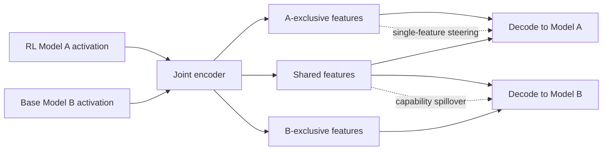

# Localizing RL-Induced Tool Use to a Single Crosscoder Feature：RL 后训练出来的工具调用，能被压到一个可操控特征吗？

### 元信息

| 项目 | 内容 |
|---|---|
| 论文 | Localizing RL-Induced Tool Use to a Single Crosscoder Feature |
| 链接 | https://arxiv.org/abs/2606.26474v1 |
| 官方日期 | 2026-06-25T00:17:11Z |
| 类型 | 论文；ICML 2026 Mechanistic Interpretability Workshop spotlight |
| 方向 | 大模型后训练、Agent 工具调用、模型 diffing、mechanistic interpretability |
| 代码与资产 | https://github.com/Antebe/model_diffing_crosscoders；https://huggingface.co/collections/antebe1/qwen-toolrl-crosscoder |

### TL;DR

- 这篇论文问的问题很具体：RL 后训练让 Qwen2.5-3B 学会结构化 `<tool_call>`，这种行为差异是否能在模型内部被定位到少量、甚至单个 sparse feature。
- 作者比较 `ToolRL-Qwen2.5-3B` 与原始 `Qwen2.5-3B`，训练 48 个 CrossCoder / Dedicated Feature Crosscoder 变体，在同一对模型的残差流 post-MLP 激活上做联合稀疏分解。
- 关键机制是 DFC：把字典分成 A-exclusive、B-exclusive 与 shared 三块，通过 gradient masking 让 RL 模型、base 模型和共享部分各自承担不同重构路径。
- 实验显示，重构后的 RL 模型工具正确率平均从 19% 到 50.1%，即 `+31.1 ± 9.7 pp`；冻结 base 模型也从 0% 到 6.8%，形成作者称为 capability spillover 的副作用。
- 最强 steering 结果很尖锐：在第 13 层，对一个 A-exclusive feature 加 `|S|=1, alpha=32`，工具正确率提升 `+65.0 pp`；CrossCoder 需要 33 个 feature 才到 `+70.0 pp`。
- 论文的核心结论不是“工具使用完全由一个神经元决定”，而是：在这个模型对、这个 ToolRL 任务和这个评测协议里，RL 引入的工具调用倾向可以被 DFC 强烈集中到极少数可干预特征。
- 局限同样重要：只测一个模型对、一个工具调用任务、每个 steering cell 只有 40 个 prompt，架构级 DFC vs CrossCoder 的 spillover 差异 `p=0.12`，并未达到显著。

### 研究问题：RL 到底改了什么？

- ToolRL 这类后训练方法会让模型更愿意输出结构化工具调用。
- 但从机制层面看，至少有三种可能：
  - **分散改变**：RL 把行为写进许多隐层方向，难以定位。
  - **模板改变**：RL 主要学会 `<tool_call>`、JSON `name`、参数字段等表面格式。
  - **语义改变**：RL 学会“何时应该调用哪个工具”的抽象决策。
- 论文试图把这三者拆开：
  - 用 joint sparse decomposition 找 RL 模型和 base 模型的共同与差异特征。
  - 用重构前后行为看 feature 是否保留工具调用能力。
  - 用 targeted steering 看某些特征是否不仅相关，而且可因果干预。

<u>关键判断</u>：这篇文章把“后训练改变行为”改写成一个可测问题：行为差异是否能被模型 diffing 方法分离、重构、迁移、增强或抑制。

### 方法路线：claim → mechanism → evidence → boundary

| 论证环节 | 作者怎么做 | 支撑什么 | 边界 |
|---|---|---|---|
| Claim | RL 诱导的工具调用可被局部化 | 观察 A-exclusive feature 的几何分离与 steering 效果 | 只在 ToolRL 工具调用任务上成立 |
| Mechanism | 训练 CrossCoder 与 DFC 分解 paired activations | 将 Model A、Model B、shared 表征拆开 | DFC 是 filter，不是完美 sink |
| Evidence | 48 个 crosscoder 扫参、100 个 held-out ToolRL prompts、40 prompt steering cell | 重构、spillover、单 feature steering 都有量化结果 | prompt 数量和模型对有限 |
| Boundary | 讨论 capability 的定义、base prompt 未最大化、架构比较欠功效 | 防止把工具调用倾向夸大成完整能力解释 | shared partition 仍未充分解释 |

### 模型、数据与评测设置

| 组件 | 论文设置 | 为什么重要 |
|---|---|---|
| Model A | `chengq9/ToolRL-Qwen2.5-3B` | RL fine-tuned，用于结构化 `<tool_call>` 调用 |
| Model B | `Qwen/Qwen2.5-3B` | base 模型，作为未 RL 后训练的对照 |
| 架构 | Qwen2.5-3B，`d=2048`，36 层 | 两模型同架构，允许逐层 paired activation diffing |
| 训练样本 | 40,000 FineWeb + 40,000 ToolRL instruction-output pairs | 同时覆盖一般文本与工具调用上下文 |
| 评测 | 100 held-out ToolRL prompts；steering cell 用 40 prompts | 行为评价聚焦工具调用，不是通用能力 |
| 解码 | greedy decoding，`max_new_tokens=200`，`max_length=2048` | 降低采样噪声，让行为差异更容易归因 |

评测指标被拆成三层：

- `format_accuracy`：是否出现 `<tool_call>`，并且 JSON 里有 `"name"` 字段。
- `tool_correctness`：调用的工具名是否 fuzzy-match prompt 里的编号工具。
- `overall_score`：`+2` 同时格式正确与工具正确；`0` 只有格式；`+1` 只有工具；`-1` 两者都没有。

这个指标设计有一个优点：它把“愿意输出模板”和“选对工具”分开。后面的 spillover 恰好说明，base 模型可能获得一点工具选择语义，却没有获得严格 `<tool_call>` 表面格式。

### DFC 机制：把差异字典切成三块

论文比较三类 joint sparse decomposition：

- CrossCoder：一个未分区共享字典，同时编码两个模型的激活。
- Tied CrossCoder：用 tied 结构约束两个模型的共享部分。
- Dedicated Feature Crosscoder：显式把字典切成 A-exclusive、B-exclusive、shared，并用 gradient mask 控制读写。

目标函数可写成：

```text
L = MSE(h, h_hat)
    + lambda_sh * ||f_sh||_1
    + (lambda_excl / 2) * (||f_A union sh||_1 + ||f_B union sh||_1)
```

变量解释：

| 符号 | 含义 |
|---|---|
| `h = (h_A, h_B)` | RL 模型和 base 模型在同一层的拼接残差流激活 |
| `h_hat` | crosscoder 解码后的重构激活 |
| `f_sh` | shared partition 激活 |
| `f_A` / `f_B` | A-exclusive / B-exclusive partition 激活 |
| `lambda_sh` | shared feature 的 L1 稀疏惩罚 |
| `lambda_excl` | exclusive partition 的额外稀疏惩罚 |
| `top-k` | 每次 forward 只保留最高的 k 个 feature |

DFC 的直觉是：

1. A-exclusive 应该吸收 RL 模型独有的差异。
2. B-exclusive 应该吸收 base 模型独有的差异。
3. shared 应该保留两个模型都需要的共同结构。
4. 如果工具调用真是 RL 诱导的新行为，它应更集中在 A-exclusive。

但论文最后发现，这个直觉只有一半正确：

- A-exclusive 的确包含很强的工具调用 steering 特征。
- shared 仍承载一部分工具选择信号，并会让冻结 base 模型出现 `+6.8 pp` tool correctness。

### 扫参设计：48 个变体在测什么？

| 轴 | 取值 | 作用 |
|---|---|---|
| Architecture | CrossCoder / DFC | 比较无分区与显式分区 |
| Dictionary size `D` | 8192 / 16384 | 控制可表示 feature 数 |
| Top-k | 45 / 90 / 160 | 控制稀疏瓶颈 |
| Exclusive share `p` | 3% / 5% / 10% | 控制 A、B exclusive 各占字典比例 |
| `lambda_excl` | 0 / 1e-3 | 测 exclusive partition 是 sink 还是 filter |

总数来自：

- 36 个 DFC 变体。
- 12 个 CrossCoder 变体。
- 每个训练 9000 steps，batch 1024，Adam learning rate `1e-4`，`lambda_sh=1e-3`。

这个扫参不是为了追求最佳模型，而是为了看一个模式是否稳定：

- 重构能否恢复 RL 工具调用行为。
- DFC 是否比普通 CrossCoder 更能隔离差异。
- exclusive penalty 会不会迫使工具信号回到 shared。
- 单个 feature steering 是否只是某个配置的偶然结果。

### 几何证据：DFC 的分区不是 UMAP 假象

作者用 decoder 向量几何比较 DFC 与普通 CrossCoder。

对普通 CrossCoder，定义每个 feature 对两个模型 decoder column 的质量比：

```text
r_i = log( ||W_dec[i, 0, :]||_2 / ||W_dec[i, 1, :]||_2 )
```

解释：

- `r_i >> 0`：feature 主要写入 Model A，近似 A-biased。
- `r_i << 0`：feature 主要写入 Model B，近似 B-biased。
- `r_i ~= 0`：两个模型贡献均衡，近似 shared。

作者把 CrossCoder 的 feature 按 `r_i` 排序，切出与 DFC 同样大小的 proxy partitions，再比较 UMAP 分离。

| 指标 | DFC | CrossCoder proxy | 说明 |
|---|---:|---:|---|
| k-NN purity | 0.984 | 0.158 | DFC 的 A-exclusive 邻居几乎仍是 A-exclusive |
| HDBSCAN ARI | 0.93 | 0.08 | DFC 分区能被聚类恢复，CrossCoder 不能 |
| A-exclusive silhouette | 明显分离 | -0.168 | CrossCoder 的 A-biased feature 反而混在核心里 |

结论不是“UMAP 图好看”，而是：

- 同样 `D=8192`、`k=160`、同样 partition size。
- 去掉 gradient mask 后，A/B/shared 的几何结构就消失。
- 因此 DFC 的分离来自架构约束，而不是标签比例或可视化技巧。

### 重构结果：RL 行为被保留，但也发生外溢

核心结果如下：

| 指标 | Model A: ToolRL | Model B: Base |
|---|---:|---:|
| pre-recon tool_correctness | 19% | 0% |
| post-recon tool_correctness | 50.1% | 6.8% |
| delta tool_correctness | `+31.1 ± 9.7 pp` | `+6.8 ± 5.0 pp` |
| delta format_accuracy | substantial | 0 pp |

需要分开读两件事：

1. **Model A 重构变强**
   - 48/48 个变体都提升 Model A 的工具正确率。
   - 单侧 exact-binomial sign test 给出 `p ~= 3.6e-15`。
   - 训练 MSE 与 Model A 行为增益相关性很弱，`r=+0.08`，95% CI `[-0.21, +0.36]`。
   - 这说明低 MSE 不等于更好保留工具调用，行为相关子空间可能很稀疏。

2. **Model B 出现 spillover**
   - base 模型没有 fine-tuning，只是通过联合训练出的 crosscoder 重构。
   - 其 tool correctness 从 0% 到 6.8%。
   - 但 format accuracy 始终没有 spillover。
   - 这意味着共享 decoder 可能传递了一点“选哪个工具”的语义，却没有传递严格 `<tool_call>` 模板能力。

这个结果对开源模型 diffing 有安全含义：

- 如果一个 crosscoder 由强能力模型和弱能力模型共同训练。
- shared decoder 可能成为推理时能力转移侧通道。
- 即便没有更新 base 模型参数，也可能改变它的行为倾向。

### DFC 是 filter，不是 sink

论文很谨慎地修正了自己的直觉：DFC exclusive partition 没有把 RL 能力完全装进一个隔离容器。

关键证据：

- `lambda_excl=1e-3` 会压低 Model A fidelity。
- 在 5% exclusive share 下，Model A 增益从 `34.8 pp` 降到 `25.8 pp`。
- 在 10% exclusive share 下，Model A 增益从 `35.2 pp` 降到 `32.0 pp`。
- 这说明被惩罚的 exclusive signal 会被迫回到 shared，而不是被简单删掉。

可以用一个简化图理解：



如果 A-exclusive 是 sink：

- 工具调用差异应主要进入 A-exclusive。
- 惩罚 exclusive 不应明显伤害共享重构。
- base 模型不应通过 shared 获得工具正确率。

实际更像 filter：

- 最尖锐、最可操控的工具调用模板 detector 进入 A-exclusive。
- 一部分语义工具选择信息仍在 shared。
- 惩罚 exclusive 会降低 RL 模型 fidelity，也可能增加 shared 污染。

### Steering：一个 feature 为什么能起这么大作用？

作者先用 Cohen's d 找 tool-use 激活与 general-text 激活差异最大的 feature：

```text
d_i = (mu_i_tool - mu_i_gen) / sqrt((s_i_tool^2 + s_i_gen^2) / 2)
```

过滤条件：

- `rho_i_tool >= 0.3`。
- `rho_i_gen <= 0.1`。
- 优先选择 A-exclusive partition 中对工具场景高度专一的 feature。

steering 的形式是对 Model A 残差流加一个 decoder 方向：

```text
h'_A = h_A + sum_{i in S} (alpha - 1) * f_i * W_dec[i, A, :]
```

这不是训练，也不是 LoRA 更新，而是 inference-time activation intervention。

关键结果：

| 条件 | 最好增益 | 95% CI | `|S|` | `alpha` |
|---|---:|---:|---:|---:|
| DFC A-exclusive | +65.0 | [+47.9, +82.1] | 1 | 32 |
| DFC shared, budget <= 10 | +47.5 | [+27.0, +68.0] | 5 | 16 |
| DFC B-exclusive | +0.0 | [+0.0, +0.0] | 1 | 1 |
| DFC A-excl union shared | +35.0 | [+17.9, +52.1] | 9 | 16 |
| CrossCoder all, budget <= 10 | +57.5 | [+41.5, +73.5] | 2 | 32 |
| CrossCoder all, unbudgeted | +70.0 | [+53.5, +86.5] | 33 | 6 |

最值得注意的不是 DFC 绝对最高：

- CrossCoder 在不限制 feature 数时也能到 +70.0。
- DFC 的价值是 **预算效率**。
- 一个 A-exclusive feature 就能到 +65.0，而 CrossCoder 需要 33 个 feature 才到 +70.0。

这对解释性很关键：

- 33 个 feature 的干预很难解释。
- 1 个 feature 的干预可以逐例检查激活样本、autointerp 描述和失败边界。

### 失败与反例：组合 feature 反而变差

论文有一个很重要的反直觉结果：

- A-exclusive 单独最好。
- shared 单独也有作用。
- 但 A-exclusive 与 shared 一起 steering，最好只有 +35.0。

作者推测原因是 destructive interference：

- A-exclusive 和 shared decoder directions 不正交。
- 在同样 `alpha` 下同时放大，可能把 residual stream 推向冲突方向。
- 因此“更多相关 feature”不等于“更好控制”。

这给后训练控制一个提醒：

1. 稀疏 feature 的语义标签不等于可叠加控制旋钮。
2. 多个看似同向的工具调用 feature 可能在 decoder 空间互相干扰。
3. 如果要把这种方法用于安全抑制，不能简单把所有危险相关 feature 一起 clamp 或 boost。

### Figure 与 Table 证据逐项解读

| 图表 | 支撑的主张 | 不能证明什么 |
|---|---|---|
| Figure 1 | CrossCoder、Tied CrossCoder、DFC 的结构差别 | 不能证明 DFC 一定更可控，只是方法图 |
| Table 1 | 48 个模型变体覆盖架构、字典、top-k、exclusive share、惩罚项 | 不能覆盖所有层、所有任务、所有模型规模 |
| Figure 2 | DFC decoder UMAP 三块分离，CrossCoder proxy 混合 | UMAP 不是因果证据，但有 k-NN purity 和 ARI 补强 |
| Table 2 | 重构提升 Model A，且 base 模型发生 +6.8pp spillover | 不能说明 base 模型真的获得完整工具能力 |
| Table 3 | CrossCoder 与 DFC MSE 相近，DFC 可能减少 spillover | `p=0.12`，不能作显著性结论 |
| Figure 3 / Table 4 | DFC A-exclusive 单 feature 达到 +65pp | 只在 40 prompt cell 上测，仍需 fresh sample 复验 |
| Figure 4 | 多层也能看到 steering 效果 | 有 dead layers，层间机制未完整解释 |
| Table 6 | H1-H8 假设状态清晰列出 | 多数是假设内检验，不是外部 benchmark |
| Table 7 | A-exclusive top features 多是 tool / dialogue / template detector | autointerp 只覆盖 A-exclusive，shared 还没解释透 |
| Figure 5 | feature #136 steering 前后从无 tool call 到正确 `split_list` | 单例很直观，但不能替代总体统计 |

### 伪代码：从 feature 找到行为旋钮

```text
Input:
  paired activations from ToolRL-Qwen2.5-3B and Qwen2.5-3B
  ToolRL prompts and general text prompts
  trained DFC dictionary

State:
  A-exclusive feature set
  shared feature set
  firing rates on tool prompts and general prompts
  decoder vectors for Model A

Loop:
  for each feature i in A-exclusive:
    compute Cohen_d(tool activations, general activations)
    keep i if rho_tool >= 0.3 and rho_general <= 0.1

  rank kept features by Cohen_d

  for subset size |S| and steering coefficient alpha:
    add sum((alpha - 1) * f_i * W_dec[i, A, :]) to Model A residual stream
    decode on held-out ToolRL prompts
    score format_accuracy and tool_correctness

Output:
  best feature subset
  delta tool_correctness
  failure cells where over-steering or interference hurts performance

Failure boundary:
  if B-exclusive steering changes Model A, the patching harness is likely broken
  if A-exclusive plus shared underperforms A-exclusive, directions may interfere
```

### 自动解释：feature 不是抽象“会用工具”，而是模板 detector

论文对 top A-exclusive features 做 Gemma autointerp。

典型解释包括：

- “LM instructed to use tools for user requests”
- “Instructions/guidelines for tool calls”
- “LM interacting with tools and external APIs”
- “Structure and syntax of `<tool_call>`”
- “Using a tool with specific parameters”

这说明 feature #136 这类对象更像结构模板 detector：

- 识别 `<tool_call>` 与 `<response>` 的对话结构。
- 识别参数 boilerplate。
- 在工具场景中高激活，在一般文本中几乎不激活。

这也解释了为什么 base 模型 spillover 不带 format accuracy：

- shared 可能承载工具选择语义。
- A-exclusive 更像负责把行为落到严格模板里。
- 两者分布在不同 partition，而不是一个完整“工具能力神经元”。

### 相关工作位置：它接上了三条线

| 线索 | 代表问题 | 这篇论文的连接方式 |
|---|---|---|
| SAE / monosemanticity | 模型激活能否被稀疏可解释 feature 分解 | 用 crosscoder 把一对模型共同分解 |
| Model diffing | fine-tuned 模型和 base 模型差在哪里 | 用 DFC 区分 A-exclusive、B-exclusive、shared |
| RL tool use | RL 为什么让模型更会调用工具 | 不只看行为分数，而是找可 steering 的内部 feature |

它和常见后训练论文不同：

- 不是提出更强 RL 算法。
- 不是报告某个 Agent benchmark 的提升。
- 不是调 prompt 或工具格式。
- 它研究的是：后训练已经带来的行为，是否能被内部机制读出来并在推理时控制。

### 可复现性与工程边界

正面证据：

- 论文给出 GitHub 仓库 `Antebe/model_diffing_crosscoders`。
- Hugging Face collection 公开了 `qwen-toolrl-crosscoder` sweep 资产。
- 附录 Table 8 列出 48 个配置的主要结果。
- 附录 Table 9 给出 saturation 表，而不只给一张曲线。

需要保守的地方：

- GitHub 仓库最后 push 时间早于论文 arXiv 发布日，代码可能是实验前版本或需要进一步文档化。
- HF collection 的资产 last modified 多在 2026-03，说明论文发布前已经上传，但不直接证明所有复现实验脚本一键可跑。
- 论文没有在多个模型规模、多个工具任务、真实浏览器/代码执行 Agent 上重复验证。
- best-cell steering 数字尚未在 fresh prompt sample 上复验。

### 细读实验一：为什么重构会让 ToolRL 模型更强？

论文里最反常的一点是：重构不是简单“保持原行为”，而是让 Model A 的工具正确率从 19% 到 50.1%。如果 crosscoder 只是有损压缩器，直觉上应该损失行为；这里反而提升，说明 top-k sparse bottleneck 可能在起隐式清洗作用。

可以把这个结果拆成三层理解：

| 层次 | 发生了什么 | 研究含义 |
|---|---|---|
| 激活层 | 原残差流被 encode-decode 过一遍 | 低 MSE 不是唯一目标，行为相关方向可能被保留或放大 |
| 行为层 | 工具正确率平均提升 31.1pp | 工具调用需要的信号可能比原始激活更稀疏 |
| 机制层 | 每个 48 变体都提升 Model A | 不是单个配置偶然，而是联合稀疏分解的稳定现象 |

但这个现象也留下疑问：

- 如果重构提升来自去噪，那么被去掉的“噪声”是什么？
- 如果 top-k 保留的是工具相关方向，为什么 MSE 与行为增益只有 `r=+0.08`？
- 如果行为相关子空间很稀疏，是否可以在训练时直接加入行为保持损失，而不是只靠 MSE 与 L1？

这里的关键不是“crosscoder 能提分”，而是它提示后训练行为可能不像模型参数那样分散。RL 改变的决策路径，至少在 ToolRL 这个任务中，能被 sparse dictionary 压缩到很少的方向里。

### 细读实验二：capability spillover 为什么是安全信号？

Base 模型从 0% 到 6.8% 的提升看起来不大，但它有两个安全含义：

1. **它没有更新 base 模型参数。**
   - 行为改变来自重构管线。
   - 这意味着外部解释工具本身可以成为行为修改工具。

2. **它只获得 tool correctness，没有获得 format accuracy。**
   - base 模型能更常选对工具名。
   - 但不会输出严格 `<tool_call>` 模板。
   - 说明“工具语义选择”和“工具调用表面协议”可能是两个不同子机制。

如果把这件事放到 Agent 安全里，风险不是“base 模型突然完整获得新能力”，而是更细的：

- 它可能更愿意把用户意图映射成工具动作。
- 它可能更接近某个危险行为边界。
- 它可能在下游 wrapper 或 prompt 支持下补齐缺失格式。

因此，模型 diffing 资产的发布不能只问：

- “它是否泄露训练数据？”
- “它是否包含模型权重？”

还要问：

- “它是否提供了可直接注入的行为方向？”
- “它是否让弱模型在某类任务上更接近强模型行为？”
- “它是否提供了绕过常规 fine-tuning 审计的推理时改写路径？”

### 细读实验三：为什么 B-exclusive 是一个好 sanity check？

B-exclusive steering 对 Model A 的效果全是 `+0.0 pp`。这个结果看似无聊，实际上很重要。

在 DFC 结构里：

- B-exclusive decoder column 对 Model A 被 mask 到 0。
- 如果 patching 代码正确，B-exclusive feature 不应该改变 Model A 残差流。
- 如果 B-exclusive steering 产生非零效果，说明层、projection、decoder index 或 mask 处理可能有 bug。

所以 B-exclusive 不是行为 baseline，而是工程验证：

```text
if steer(B-exclusive) changes Model A:
    suspect intervention harness
else:
    A-exclusive effect is more credible
```

这个设计值得其他 mechanistic interpretability 论文学习。很多 steering demo 的问题在于缺少负控：只展示某个 feature 有效果，却不展示结构上不该有效的 feature 是否真的无效。这里的 B-exclusive flat zero 提供了一个从架构约束出发的负控。

### 细读实验四：Figure 5 的单例应该怎样读？

Figure 5 展示同一个 prompt 在 steering 前后的变化：

- steering 前，模型说用户请求不清楚，要求补充信息。
- steering 后，模型把 `[1,2,3,4,5]` 拆成 chunk size 2，输出 `split_list` 的 `<tool_call>`。

这个例子很有说服力，但不能过度使用：

| 可支持的结论 | 不应推出的结论 |
|---|---|
| feature #136 能把某些模糊响应推向工具调用模板 | feature #136 等于“理解工具使用” |
| 单 feature steering 能改变格式与工具选择 | 所有 prompt 都能被同一个 feature 修好 |
| A-exclusive feature 和工具模板高度相关 | 工具调用能力没有其他分布式成分 |

更准确的说法是：

- feature #136 像一个高杠杆模板门控器。
- 它激活后，模型更容易进入“思考后调用工具”的输出轨道。
- 但模型是否真的理解任务、参数是否稳健、面对新工具集是否泛化，还需要更多评测。

### 消融失败：为什么 A-exclusive 加 shared 会更差？

从安全控制角度看，最有用的失败是 `A-excl union shared` 只有 +35.0，而不是超过单独 A-exclusive 的 +65.0。

这说明控制特征时至少要考虑三种关系：

| 关系 | 可能现象 | 风险 |
|---|---|---|
| 同向增强 | 多个 feature 一起提升目标行为 | 可能过强、过拟合模板 |
| 正交补充 | 一个 feature 控格式，一个控语义 | 需要联合调参，否则效果不稳定 |
| 非正交干扰 | decoder directions 互相冲突 | 相关 feature 叠加后反而退化 |

这对安全抑制尤其关键：

- 如果想 clamp “危险工具调用” feature，不能只按 autointerp 标签批量操作。
- 必须测每个 feature、每组 feature、每个 `alpha` 或 clamp 强度的行为曲线。
- 还要看模型是否通过 shared partition 绕过抑制，或者把危险意图转移到别的表达形式。

换句话说，mechanistic control 不是一个“找到按钮然后按下”的工程；它更像一个低维控制系统，需要测相互作用和过驱动失败。

### 与近期 Daily Report 选题的区别

本周已经覆盖不少 Agent 与后训练主题，这篇仍值得保留，因为它不是同一类问题。

| 近期主题类型 | 主要问题 | 本文差异 |
|---|---|---|
| Agent harness / benchmark | Agent 在环境里表现如何 | 本文问行为在内部表征里在哪里 |
| Agent 安全控制面 | 规则、权限、MCP、runtime guard 如何挡住坏行为 | 本文问被 RL 写入的工具行为能否在激活层被监控 |
| RL 后训练算法 | 如何用 outcome、skill、reward 改进策略 | 本文问 RL 之后的行为变化是否可解释和可 steering |
| 工业 pipeline 消融 | 数据、奖励、训练配方如何组合 | 本文聚焦单一能力差异的机制定位 |

它的独特位置是：

- 不把 Agent 当黑箱系统。
- 不把 RL 当只产生 reward 曲线的训练流程。
- 不把安全当外部 wrapper。
- 而是把三者交叉到一个问题：后训练后的可行动能力，是否能在内部表示层被识别、压缩和干预。

### 可以继续追问的研究问题

下一步最值得做的不是换一个更大模型重复一遍，而是设计更尖锐的对照：

1. **多任务对照**
   - 工具调用、代码执行、浏览器点击、拒绝危险请求是否都有类似 A-exclusive feature。
   - 如果只有工具模板任务能单 feature steering，结论就偏格式控制。

2. **多模型规模对照**
   - 3B 模型的稀疏特征可能比 32B / 70B 更容易集中。
   - 大模型里行为可能被更分布式地编码。

3. **安全抑制对照**
   - 论文主要做 boost。
   - 真正安全场景更关心 clamp：能否降低不当工具调用，同时保留正常工具调用。

4. **shared partition autointerp**
   - spillover 来自 shared。
   - 如果 shared feature 解释不清楚，就无法判断外溢是语义、模板残留还是 decoder artifact。

5. **发布风险评估**
   - HF collection 公开 48 个 crosscoder。
   - 应该评估这些资产能否被第三方用作能力注入或绕开 fine-tuning 审计。

### 局限：作者没有把结论讲过头

论文自己列出的限制很关键：

1. “Capability” 在文中是工具调用倾向，不是完整 Agent 能力。
2. base 模型可能本来有潜在工具知识，只是评测 prompt 下不输出。
3. 只研究一对 Qwen2.5-3B 模型。
4. 只研究 ToolRL 结构化工具调用任务。
5. DFC vs CrossCoder 的架构差异样本不平衡：12 个 CC，36 个 DFC。
6. steering cell 只有 40 个 prompt。
7. autointerp 只覆盖 A-exclusive feature，shared partition 仍是下一步重点。

这些限制让结论更像：

- “这是一个强机制证据的 case study。”
- 而不是：
- “所有 RL 后训练能力都可以被一个 feature 控制。”

### 对后训练与 AI 安全的意义

对后训练研究：

- RL 不是黑箱地“提升分数”，它可能把行为倾向压进很稀疏的表征方向。
- 如果这些方向可定位，后训练诊断可以从 reward curve 走向内部机制审计。
- DFC 这类 diffing 工具能回答：某次 RL 到底把什么行为写进了模型。

对 Agent 安全：

- 工具调用、执行动作、外部 API 访问都是高风险行为边界。
- 如果“愿不愿意调用工具”有可解释 feature，运行时可以监控或调节这些 feature。
- 但 capability spillover 提醒：发布或复用模型 diffing 资产也可能改变弱模型行为。

对 interpretability：

- 单 feature steering 是强因果证据，但不是完整因果图。
- shared partition 仍可能携带语义意图。
- 未来要解释的不只是“会不会输出模板”，还包括“何时应该行动、何时应该拒绝行动”。

### 我的判断

- 这篇论文最有价值的地方，是把后训练行为变化从 benchmark 分数推进到 feature-level control。
- 它最容易被误读的地方，是把“单个 A-exclusive feature 可 steering 工具调用倾向”说成“单神经元等于工具能力”。
- 更准确的读法是：
  - DFC 把最尖锐的结构模板控制点集中起来。
  - shared decoder 仍保存一部分语义工具选择信号。
  - 因此后训练能力既可局部化，又不完全局部化。

如果后续研究要继续推进，最重要的不是再找一个更漂亮的 steering demo，而是回答三个问题：

1. 在真实 Agent 任务中，feature steering 是否仍能控制“行动边界”而非只控制输出模板。
2. 对安全任务，clamp 危险 feature 是否会导致模型绕路使用 shared representation。
3. 当 crosscoder 在强弱模型之间训练时，哪些资产发布形式会引入 capability spillover 风险。

这也是它值得进入本轮 Daily Report 的原因：它把后训练、Agent 工具调用和 AI 安全共同关心的“行为从哪里来、能不能在运行时管住”变成了一个可实验、可量化、可复查的机制问题。
