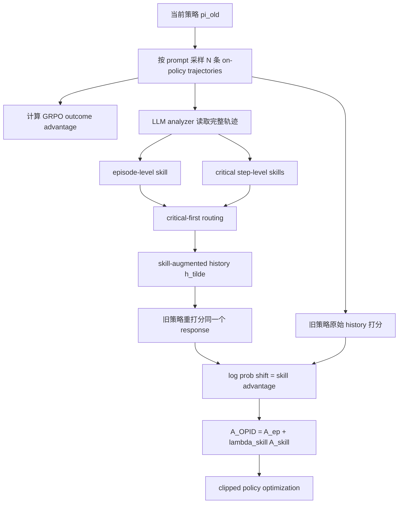

### 元信息与 TL;DR

| 字段 | 内容 |
|---|---|
| 原文 | [OPID: On-Policy Skill Distillation for Agentic Reinforcement Learning](https://arxiv.org/abs/2606.26790) |
| 版本 | arXiv:2606.26790v1，2026-06-25 09:24:09 UTC 提交 |
| 代码 | [github.com/jinyangwu/OPID](https://github.com/jinyangwu/OPID) |
| 作者 | Shuo Yang, Jinyang Wu, Zhengxi Lu, Yuhao Shen, Fan Zhang, Lang Feng, Shuai Zhang, Haoran Luo, Zheng Lian, Zhengqi Wen, Jianhua Tao |
| 方向 | 大模型 Agent；agentic RL；on-policy distillation；skill distillation；GRPO |

**TL;DR：**

- 这篇论文解决 agentic RL 的一个核心痛点：任务最终成功或失败的 outcome reward 很稳定，但太稀疏，不能告诉模型哪一步决策该增强、哪一步该压制。OPID 把完成后的 on-policy trajectory 反向抽象成技能，再把技能影响转成 token 级训练优势。
- OPID 的全称是 **On-Policy Skill Distillation**。它不维护外部 skill memory，也不在推理时检索技能；技能只在训练时从当前策略采样出来的轨迹中提取，因此更贴近当前策略真实访问的状态分布。
- 技能分成两层：episode-level skill 总结整条轨迹的全局工作流或失败规避规则；step-level skill 只覆盖关键时刻的局部决策知识。critical-first routing 先用 step skill，非关键步再回退到 episode skill。
- 核心公式是：同一个 sampled response 在原始历史 `h` 和技能增强历史 `h_tilde` 下由旧策略分别打分，二者 log-probability 差值形成 token-level skill advantage，再和 GRPO 的 outcome advantage 相加。
- 主实验覆盖 ALFWorld、WebShop、Search-based QA。Qwen2.5-3B 上，OPID 相比 GRPO 分别提升 ALFWorld +9.3、Search QA +8.6、WebShop success +10.9；Qwen2.5-7B 上对应提升 +8.8、+7.2、+7.1。
- 小模型收益更明显：Qwen3-1.7B 上，OPID 相比 GRPO 在 ALFWorld 提升 +12.8，在 WebShop success 提升 +26.5；Search QA 上则与 GRPO 接近，说明方法对长程交互更有效，对短轮检索问答不总是显著。
- 消融显示两层技能都重要：去掉 episode skill，ALFWorld 平均从 84.3 降到 74.1，WebShop success 从 74.2 降到 67.2；去掉 step skill，ALFWorld 降到 79.1，WebShop success 降到 65.6；去掉 critical-first routing，ALFWorld 从 84.3 降到 77.5。
- 局限是技能抽取依赖 LLM analyzer，训练成本高于 outcome-only RL；实验集中在 ALFWorld、WebShop、Search QA，尚未覆盖软件工程、真实浏览器权限、安全约束和多 Agent 协作。

### 研究问题：为什么 outcome-only RL 不够？

Agentic RL 的常见训练信号是轨迹级 outcome：

```text
一条轨迹成功 -> reward = 1
一条轨迹失败 -> reward = 0
```

这种信号适合稳定优化，但对长程 Agent 有三个问题：

| 问题 | 具体表现 | 对训练的影响 |
|---|---|---|
| 稀疏 | 只有最终结果，缺少中间步骤反馈 | 不知道哪一步贡献成功 |
| 延迟 | 早期错误可能在很多步后才显现 | credit assignment 方差高 |
| 粗粒度 | 同样失败可能来自不同局部错误 | 所有 token 被同一标量影响 |

论文的核心问题可以写成：

```text
能否保留 outcome RL 的稳定主目标，
同时从当前策略自己的轨迹中提取更密集的 token-level 监督？
```

作者没有选择外部技能库，而是强调 **on-policy**：

- 技能来自当前策略刚采样的轨迹；
- 技能描述当前策略真实遇到的状态；
- 技能只在训练阶段使用；
- 推理时模型不需要 analyzer、retriever 或 privileged context。

### OPID 方法总览

OPID 分三步。



这个流程的关键是：

- **不重新生成动作**：同一个 sampled response 被原始上下文和技能上下文分别打分；
- **不让技能进入推理**：技能只影响训练时的 advantage；
- **不替代 RL**：outcome advantage 仍是主干，skill advantage 是 token 级 shaping。

### 形式化：从 POMDP 到轨迹组

论文把长程 Agent 任务建模为部分可观测决策过程：

```math
(\mathcal{S}, \mathcal{A}, \mathcal{O}, \mathcal{T}, \mathcal{R}, \gamma)
```

| 符号 | 含义 |
|---|---|
| `S` | 潜在状态空间 |
| `A` | 动作空间 |
| `O` | 观测空间 |
| `T` | 状态转移函数 |
| `R` | 奖励函数 |
| `gamma` | 折扣因子 |

在第 `t` 步，Agent 看到观测 `o_t`，保留历史：

```math
h_t = (o_0, y_0, o_1, y_1, \ldots, o_t)
```

策略生成下一步响应：

```math
y_t \sim \pi_\theta(\cdot \mid h_t)
```

完成轨迹表示为：

```math
\tau = \{(o_t, y_t, r_t)\}_{t=0}^{T-1}
```

对每个 task prompt `q`，GRPO 风格采样一组轨迹：

```math
\mathcal{G}_q = \{\tau^{(1)}, \tau^{(2)}, \ldots, \tau^{(N)}\}
```

这一步与普通 outcome RL 一致；OPID 的新增信息从下一步开始。

### Hindsight skill：技能不是检索来的，而是轨迹里抽出来的

OPID 的 analyzer 读取完整轨迹，输出两类技能：

| 技能层级 | 作用 | 例子 |
|---|---|---|
| Episode-level skill | 总结整条轨迹的工作流或失败规避规则 | 先找到目标物，再清洗，再放到指定位置 |
| Step-level skill | 总结关键步骤的局部决策 | 如果初始搜索没直接回答，就改写 query 指向缺失属性 |

形式上：

```math
\mathcal{A}(\tau) =
\left(
s^{\mathrm{ep}}_{\tau},
\{s^{\mathrm{step}}_{\tau,t}\}_{t\in\mathcal{C}_\tau}
\right)
```

其中 `C_tau` 是 analyzer 识别出的关键时间步集合。

这个设计解决两个粒度冲突：

- episode skill 稳定，但关键状态下可能太粗；
- step skill 精确，但只覆盖少数关键步；
- routing 决定每一步该用哪种技能。

### Critical-first routing：先局部关键，再全局默认

路由规则很简单：

```math
s_{\tau,t} =
\begin{cases}
s^{\mathrm{step}}_{\tau,t}, & \text{if } t\in\mathcal{C}_\tau \\
s^{\mathrm{ep}}_{\tau}, & \text{otherwise}
\end{cases}
```

也就是说：

- 如果某一步是 critical timestep，用 step-level skill；
- 如果不是关键步，用 episode-level skill；
- 不把两个技能盲目相加。

论文专门做了消融：去掉 routing 后，ALFWorld 平均从 84.3 降到 77.5。

这说明：

| 做法 | 风险 |
|---|---|
| 每一步都只用 episode skill | 关键局部状态指导不够精细 |
| 每一步都叠加 step skill | 稀疏技能会被错用或干扰 |
| critical-first routing | 每步只选最合适的粒度 |

### Token-level skill advantage：OPID 最关键的公式

技能被注入到 history：

```math
\tilde{h}_{\tau,t} = H(h_{\tau,t}, s_{\tau,t})
```

然后用旧策略分别计算同一个 token 的 log probability。

原始上下文：

```math
\ell^{\mathrm{old}}_{\tau,t,\ell}
=
\log \pi_{\theta_{\mathrm{old}}}
(y_{\tau,t,\ell}\mid h_{\tau,t},y_{\tau,t,<\ell})
```

技能增强上下文：

```math
\ell^{\mathrm{skill}}_{\tau,t,\ell}
=
\log \pi_{\theta_{\mathrm{old}}}
(y_{\tau,t,\ell}\mid \tilde{h}_{\tau,t},y_{\tau,t,<\ell})
```

二者差值就是 token-level skill advantage：

```math
A^{\mathrm{skill}}_{\tau,t,\ell}
=
(\ell^{\mathrm{skill}}_{\tau,t,\ell}
-
\ell^{\mathrm{old}}_{\tau,t,\ell})m_{\tau,t,\ell}
```

解释如下：

| 情况 | 含义 | 训练方向 |
|---|---|---|
| `A_skill > 0` | 技能上下文让这个 token 更可能 | 鼓励 |
| `A_skill < 0` | 技能上下文让这个 token 更不可能 | 压制 |
| `A_skill = 0` | 技能无明显影响 | 不额外 shaping |

### 和 GRPO outcome advantage 如何合并？

对同一 prompt 的轨迹组，先算 outcome reward 的均值和标准差：

```math
\mu_q = \frac{1}{|\mathcal{G}_q|}
\sum_{\tau'\in\mathcal{G}_q} R(\tau')
```

```math
\sigma_q =
\sqrt{
\frac{1}{|\mathcal{G}_q|}
\sum_{\tau'\in\mathcal{G}_q}(R(\tau')-\mu_q)^2
}
```

轨迹级 advantage：

```math
A^{\mathrm{ep}}_{\tau}
=
\frac{R(\tau)-\mu_q}{\sigma_q}
```

最终 OPID advantage：

```math
A^{\text{OPID}}_{\tau,t,\ell}
=
A^{\mathrm{ep}}_{\tau,t,\ell}
+
\lambda_{\mathrm{skill}}
A^{\mathrm{skill}}_{\tau,t,\ell}
```

超参表给出：

| 超参 | 值 |
|---|---:|
| rollout group size `N` | 8 |
| learning rate | 1e-6 |
| PPO clip `epsilon` | 0.2 |
| skill coefficient `lambda_skill` | 0.001 |
| KL regularization coefficient | 0.01 |
| training steps | 150 |
| max steps | ALFWorld 30；WebShop 15；Search 4 |

这组数值说明：

- skill advantage 的权重很小；
- 作者并不让技能信号压过 RL；
- 技能主要作为密集、局部、方向性的辅助信号。

### 伪代码：OPID 的训练循环

```text
Input:
  policy pi_theta
  task set Q
  analyzer A
  skill injection H
  group size N
  lambda_skill

for each training iteration:
  theta_old <- theta
  sample prompt batch B

  for each prompt q in B:
    sample trajectory group G_q with pi_theta_old
    compute group reward mean and std

    for each trajectory tau in G_q:
      A_ep <- normalized outcome advantage
      s_ep, {s_step_t} <- analyzer(tau)

      for each step t:
        if t is critical:
          s_t <- s_step_t
        else:
          s_t <- s_ep

        h_tilde <- inject_skill(h_t, s_t)

        for each response token ell:
          logp_old <- pi_old(y_ell | h_t)
          logp_skill <- pi_old(y_ell | h_tilde)
          A_skill <- logp_skill - logp_old
          A_OPID <- A_ep + lambda_skill * A_skill

  update policy with clipped objective and KL regularization

Output:
  policy pi_theta
  no analyzer or skill retrieval needed at inference
```

### 实验设置：三个长程 Agent 场景

| Benchmark | 任务形态 | 指标 |
|---|---|---|
| ALFWorld | 文本家居环境，多步拿取、清洗、加热、冷却、放置 | task success rate |
| WebShop | 电商网站交互，按自然语言需求找商品并购买 | normalized score；success rate |
| Search-based QA | 与搜索环境交互回答 NQ、TriviaQA、PopQA、HotpotQA 等 | answer accuracy |

模型包括：

- Qwen2.5-3B-Instruct；
- Qwen2.5-7B-Instruct；
- Qwen3-1.7B-Instruct。

baseline 包括：

| Baseline | 含义 |
|---|---|
| Vanilla | 原始 prompting |
| Skill-Prompt | 推理或验证时加技能描述 |
| GRPO | 只用 outcome reward |
| Skill-GRPO | 技能条件 + GRPO |
| OPSD / Skill-SD / RLSD / SDAR | 不同自蒸馏或技能蒸馏训练基线 |
| GRPO+OPSD | outcome RL 与 OPSD 组合 |

### 主结果：OPID 对 GRPO 的增益

#### 1. Qwen2.5-3B

| 任务 | GRPO | OPID | 提升 |
|---|---:|---:|---:|
| ALFWorld Avg | 75.0 | **84.3** | +9.3 |
| Search QA Avg | 36.4 | **45.0** | +8.6 |
| WebShop Score | 79.8 | **85.0** | +5.2 |
| WebShop Succ. | 63.3 | **74.2** | +10.9 |

OPID 在 3B 上的特点是：

- ALFWorld 的 Look 达到 100.0；
- WebShop success 是表中最高；
- Search QA 平均也拿到最高 45.0。

这说明 OPID 并不只改善一个环境，而是在 embodied、web shopping、search QA 三类场景里都有收益。

#### 2. Qwen2.5-7B

| 任务 | GRPO | OPID | 提升 |
|---|---:|---:|---:|
| ALFWorld Avg | 81.2 | **90.0** | +8.8 |
| Search QA Avg | 42.0 | **49.2** | +7.2 |
| WebShop Score | 80.9 | **85.3** | +4.4 |
| WebShop Succ. | 72.6 | **79.7** | +7.1 |

7B 上，OPID 的优势更像稳定提升：

- ALFWorld 平均拿到 90.0，是同组最高；
- Search QA 平均 49.2，也是同组最高；
- WebShop success 79.7 低于 SDAR 的 82.8，但仍明显高于 GRPO。

因此，论文没有证明 OPID 每个表格格子都赢，而是证明它在多域平均上非常强。

#### 3. Qwen3-1.7B

| 任务 | GRPO | OPID | 提升 |
|---|---:|---:|---:|
| ALFWorld Avg | 46.1 | **58.9** | +12.8 |
| Search QA Avg | 40.8 | 40.4 | -0.4 |
| WebShop Score | 67.3 | **79.6** | +12.3 |
| WebShop Succ. | 38.3 | **64.8** | +26.5 |

小模型结果很有解释力：

- WebShop 是长程网页交互，OPID 提升最大；
- ALFWorld 也有明显提升；
- Search QA 轮数短、最大交互步只有 4，OPID 的层级技能优势不一定能充分发挥。

这符合方法直觉：OPID 更适合长程、多步、容易出现局部错误的 Agent。

### 为什么 Skill-GRPO 不够？

论文强调 OPID 的推理边界：训练时可用技能，推理时不需要技能。

Skill-GRPO 有一个问题：

```text
训练/验证时依赖 skill context
但真实推理可能没有可靠 skill context
```

ALFWorld 上，如果移除 validation-time skills，Skill-GRPO 明显低于 GRPO：

| 模型 | GRPO | Skill-GRPO | 差值 |
|---|---:|---:|---:|
| Qwen2.5-3B | 75.0 | 60.2 | -14.8 |
| Qwen2.5-7B | 81.2 | 69.5 | -11.7 |
| Qwen3-1.7B | 46.1 | 21.1 | -25.0 |

OPID 的改进在于：

- 技能不作为推理输入；
- 技能的行为效果被蒸馏进参数；
- inference-time context 与普通 Agent 一致。

这对部署很重要：

| 路线 | 推理时需要什么 |
|---|---|
| Skill-Prompt | 需要技能文本 |
| Skill-GRPO | 常需要技能条件保持一致 |
| OPID | 只需要普通历史 `h_t` |

### 样本效率：为什么同样 rollout 更值钱？

样本效率实验在 ALFWorld 上比较不同训练数据比例。

| 数据比例 | GRPO | OPID | 提升 |
|---|---:|---:|---:|
| 20% | 27.3 | **36.7** | +9.4 |
| 40% | 42.2 | **54.7** | +12.5 |
| 60% | 56.3 | **71.9** | +15.6 |
| 80% | 58.6 | **78.9** | +20.3 |
| 100% | 75.0 | **84.3** | +9.3 |

作者特别指出：

- OPID 用 60% 数据达到 71.9，接近 100% 数据 GRPO 的 75.0；
- OPID 用 80% 数据达到 78.9，已经超过 full-data GRPO。

这个结果的机制解释是：

```text
同一条轨迹在 GRPO 中主要贡献一个 outcome advantage；
在 OPID 中还贡献 episode skill、critical step skill 和 token-level log-prob shift。
```

也就是说，OPID 并没有减少环境交互难度，而是从每条已完成轨迹里榨出更多监督。

### 泛化：ALFWorld Unseen 上的证据

跨域泛化表关注 ALFWorld unseen split。

| 方法 | Pick | Look | Clean | Heat | Cool | Pick2 | Avg |
|---|---:|---:|---:|---:|---:|---:|---:|
| ReAct | 17.4 | 6.7 | 8.8 | 7.4 | 9.1 | 0.0 | 8.2 |
| GRPO | 73.9 | 60.0 | **82.4** | 59.3 | 72.7 | **76.9** | 70.9 |
| OPID | **78.3** | **86.7** | **82.4** | **77.8** | **77.3** | 69.2 | **78.6** |
| Delta | +4.4 | +26.7 | +0.0 | +18.5 | +4.6 | -7.7 | +7.7 |

这个表说明：

- OPID 不是只记住训练轨迹；
- Look 和 Heat 任务提升最大，分别 +26.7 和 +18.5；
- Pick2 下降 -7.7，说明局部技能蒸馏也可能在某些任务类型上引入偏差。

### 消融：两层技能和路由都不可省

#### 1. Hierarchical skills

| 变体 | ALFWorld Avg | WebShop Score | WebShop Succ. |
|---|---:|---:|---:|
| OPID | **84.3** | **85.0** | **74.2** |
| w/o episode skill | 74.1 | 78.4 | 67.2 |
| w/o step skill | 79.1 | 80.2 | 65.6 |

解释：

- 去掉 episode skill，缺少全局工作流；
- 去掉 step skill，关键时刻没有局部决策提示；
- WebShop 上去掉 step skill 的 success 降幅更大，说明电商任务里关键筛选/购买步骤很重要。

#### 2. Critical-first routing

| 方法 | ALFWorld Avg |
|---|---:|
| OPID | **84.3** |
| w/o Routing | 77.5 |

没有 routing 的版本把 episode skill 和 step skill 叠加使用。

这会带来两个问题：

- 全局技能可能稀释局部关键提示；
- 局部技能可能在不该使用的上下文中制造噪声。

### 定性案例：OPID 改了什么行为？

论文的 ALFWorld case 是：

```text
clean some spatula and put it in diningtable
```

GRPO 失败轨迹：

- 在 Step 4 试图从 countertop 拿一个不存在的 spatula；
- 后续把 spoon 当成目标物替代；
- 达到 30-step limit；
- 没有完成 cleaned spatula 的最终放置。

OPID 成功轨迹：

- 先定位 spatula；
- 再执行清洗；
- 最后放到 diningtable；
- 6 步完成。

这个案例对应两类技能：

| 技能 | 可能学到的内容 |
|---|---|
| Episode-level | locate -> clean -> place 的全局流程 |
| Step-level | 不要拿不存在对象；动作必须 grounded in current observation |

它解释了为什么 OPID 能减少重复动作和无效动作：

- outcome reward 只告诉模型 GRPO 轨迹失败；
- hindsight skill 能指出失败来自 hallucinated target 和错误替代目标；
- token-level advantage 把这些差异回写到具体响应 token。

### 理论附录：OPID 属于哪种蒸馏？

作者把 OPID 放在 sampled-token distillation 中。

对每个 token 位置 `i=(tau,t,ell)`，定义：

| 分布 | 含义 |
|---|---|
| `b_i(v)` | 旧策略在原始上下文下的行为分布 |
| `q_i(v)` | 旧策略在 skill-augmented context 下的 teacher 分布 |
| `p_theta,i(v)` | 当前待训练策略在普通上下文下的分布 |

技能带来的 log-ratio：

```math
\Delta_i(v)=\log q_i(v)-\log b_i(v)
```

OPID 只需要 realized token 的 teacher probability，因此成本低于 full-vocabulary distillation。

但它也有代价：

| 优点 | 代价 |
|---|---|
| 不需要完整词表分布 | Monte Carlo 方差更高 |
| 贴近 on-policy context | 依赖行为分布覆盖 |
| 可嵌入 PPO/GRPO 目标 | 单 token 信息少于 full distribution |

这解释了为什么 `lambda_skill` 设置得很小：skill signal 是方向性辅助，不是完整 teacher replacement。

### 与近期 Agent 训练工作的关系

OPID 和几类工作关系紧密。

| 路线 | 代表问题 | OPID 的差异 |
|---|---|---|
| Outcome RL / GRPO | 用最终奖励优化 Agent | 增加 token-level skill shaping |
| Skill-Prompt | 推理时检索技能 | 技能只在训练时使用 |
| Skill-GRPO | 技能条件下做 RL | 避免 inference skill dependency |
| OPSD / SDAR | 自蒸馏辅助 Agent RL | 技能来自 on-policy hindsight trajectories |
| Agent memory | 保存经验供检索 | 不维护外部 memory，不做推理检索 |

OPID 最重要的研究位置是：

```text
不是让 Agent 在推理时“看更多经验”，
而是让 Agent 在训练时把自己的经验内化进参数。
```

### 证据边界与局限

#### 0. 结果应该怎样谨慎解读？

OPID 的表格数字很强，但不能把它理解成“技能蒸馏一定优于所有 RL 方法”。

更稳妥的读法是：

| 证据 | 能支持什么 | 不能支持什么 |
|---|---|---|
| 多模型、多任务平均提升 | on-policy hindsight skill 对长程任务有稳定帮助 | OPID 在所有任务、所有模型上都最优 |
| Search QA 的 mixed result | 短程检索任务未必需要复杂技能路由 | OPID 对搜索类 Agent 没价值 |
| WebShop 小模型大幅提升 | 技能信号能帮助弱模型减少长程交互错误 | 真实电商网站可直接部署 |
| ALFWorld unseen 提升 | 技能可能捕捉可迁移工作流 | 泛化到真实物理或浏览器环境 |

因此，本文最可靠的结论是：

- 当任务有较长交互链；
- 当成功/失败由少数关键步骤决定；
- 当 outcome reward 太稀疏；
- 当当前策略已经能采样出一些成功或有诊断价值的失败轨迹；
- OPID 能把这些轨迹变成更密集的训练信号。

如果环境只有一两步交互，或 reward 已经提供细粒度过程反馈，OPID 的边际收益可能变小。

#### 0.1 为什么它不是普通 reward shaping？

普通 reward shaping 常见做法是：

- 人工定义中间奖励；
- 对每个子目标打分；
- 用 verifier 判断过程是否正确；
- 或用规则惩罚无效动作。

OPID 的差异在于：

| 维度 | 普通 shaping | OPID |
|---|---|---|
| 信号来源 | 外部规则或 verifier | 当前策略完成后的 trajectory |
| 信号粒度 | step reward 或 scalar bonus | token-level log-prob shift |
| 教师形式 | 显式奖励函数 | skill-augmented old policy |
| 推理依赖 | 可能需要规则继续存在 | 不需要技能或 analyzer |

这让 OPID 更像一种“训练时的反事实上下文比较”：

```text
如果同一个旧策略在看到技能后更愿意生成某个 token，
那这个 token 就被视为更符合 hindsight skill。
```

这种比较不是直接问 analyzer “这一步对不对”，而是让 analyzer 产生技能，再让模型自己的概率变化表达这个技能对行为的影响。

#### 0.2 为什么 on-policy 很重要？

off-policy skill memory 的问题是：

- 技能来自旧策略或其他模型；
- 状态分布可能和当前策略不同；
- 多轮交互里一步偏移会让后续技能失效；
- 检索到的技能可能表面相关、状态不匹配。

OPID 使用 on-policy trajectory，意味着：

- 技能描述的是当前模型真实会走到的状态；
- 失败规则针对当前模型真实会犯的错误；
- 成功工作流来自当前模型已经能部分完成的路径；
- token-level scoring 也由同一个旧策略完成，减少 teacher-student 分布错位。

这也是 OPID 与传统“经验库 + 检索”路线的根本差别。

### 复现实验还应补什么？

如果要把 OPID 推进成更强的 Agent 后训练基线，我会优先补四组实验。

| 实验 | 为什么重要 |
|---|---|
| Analyzer 替换实验 | 验证 GPT-4/Claude/开源模型抽取技能时收益是否稳定 |
| 错误技能注入实验 | 测试 OPID 对 analyzer 误归因的鲁棒性 |
| 长轨迹分桶实验 | 分析收益是否随 episode length 增长而增强 |
| 安全约束环境实验 | 看技能是否能学习“不要调用危险工具”这类过程约束 |

尤其是错误技能注入很关键。

可以设计三种扰动：

| 扰动 | 预期观察 |
|---|---|
| 删除关键 step skill | 看模型是否退化到 episode-only |
| 把成功技能换成失败技能 | 看 token advantage 是否错误压制好行为 |
| 把跨任务技能随机交换 | 看 on-policy 分布匹配被破坏后收益下降多少 |

这些实验能回答一个核心问题：

```text
OPID 的收益来自“技能文本本身”，
还是来自“技能与当前轨迹状态的正确对齐”？
```

如果随机交换技能仍然有效，那说明技能可能只是额外解释文本；如果收益显著下降，就更能支持论文的 distribution-matched hindsight 论点。

### 失败案例：OPID 还可能在哪些地方出错？

#### 1. 成功轨迹也可能有坏习惯

一条轨迹最终成功，不代表每一步都值得学习。

例如：

- Agent 绕了很多无关页面；
- 多次重复搜索后偶然找到结果；
- 先误点再返回，最后仍成功；
- 使用了环境偶然暴露的 shortcut。

如果 episode-level skill 只总结“最终成功工作流”，可能会忽略这些低效过程。

#### 2. 失败轨迹归因可能错位

失败轨迹常有多个错误。

例如 WebShop 任务失败可能同时包含：

- 搜索 query 太宽；
- 没验证价格；
- 没检查颜色；
- 最后点击了错误商品。

Analyzer 如果只抓最后一步，会把失败归因给购买动作；但真正的错误可能在第一步搜索和中间筛选。

#### 3. Step-level skill 可能过度局部

关键步骤技能适合当前状态，但不一定通用。

例如：

- “点击第一个搜索结果”在某个查询中正确；
- 换一个查询后，第一个结果可能是广告；
- 被蒸馏成通用倾向后，模型可能更冒进。

这说明 step skill 应该包含条件：

- 何时适用；
- 依赖哪些观察；
- 何时不应使用。

### 和工程实现的关系

代码仓库 README 暴露了几个工程现实。

| 工程点 | 含义 |
|---|---|
| 需要 OpenAI-compatible analyzer endpoint | 训练阶段依赖外部分析模型 |
| 分环境安装 ALFWorld / WebShop / Search | 复现实验环境复杂 |
| WebShop 需要 Python <=3.10 | 与主训练环境可能分裂 |
| Search 需要本地 retrieval server | 评测链路包含额外服务 |
| 脚本在 `examples/opid_trainer/` | 方法已给出可运行入口 |

所以 OPID 不是一个“轻量小技巧”，而是一套完整训练系统：

- 环境 rollout；
- 轨迹记录；
- analyzer 抽取技能；
- skill injection；
- old policy paired scoring；
- GRPO/PPO 风格更新；
- FSDP/Megatron checkpoint 合并。

这也解释了它的适用场景：

- 适合严肃后训练；
- 不适合只想快速 prompt engineering 的场景；
- 需要稳定的环境和可重复 rollout。

### 质量门槛检查：读者不打开原文也应知道什么？

这篇论文最小可带走信息可以压缩成四点：

| 必须记住的问题 | 对应答案 |
|---|---|
| OPID 解决什么？ | outcome reward 太稀疏，长程 Agent 缺少中间决策监督 |
| 技能从哪里来？ | 从当前策略完成后的 on-policy trajectories 中抽取 |
| 技能怎样变成梯度？ | 比较同一 token 在原始上下文和技能上下文下的旧策略 log probability |
| 推理时要不要技能？ | 不需要，技能只在训练时产生 token-level shaping |

如果只看实验，也应记住三组数字：

- Qwen2.5-3B：ALFWorld 从 GRPO 75.0 到 OPID 84.3；
- Qwen2.5-7B：Search QA 从 GRPO 42.0 到 OPID 49.2；
- Qwen3-1.7B：WebShop success 从 GRPO 38.3 到 OPID 64.8。

这些数字共同说明：OPID 的收益主要来自 **长程交互中的过程归因**，不是单纯把更多文本塞进 prompt。

#### 1. Analyzer 仍是强依赖

OPID 不需要推理时技能检索，但训练时仍需要 LLM analyzer。

这意味着：

- 技能质量取决于 analyzer；
- 训练成本高于纯 GRPO；
- analyzer 可能产生错误归因；
- 错误技能会被蒸馏进模型。

#### 2. Benchmark 仍有限

三类 benchmark 覆盖了家居、购物和搜索，但没有覆盖：

- 软件工程 Agent；
- 真实浏览器复杂权限；
- 文件系统和 shell 操作；
- 多 Agent 协作；
- 安全策略和权限确认；
- 长期记忆污染。

因此，OPID 证明的是长程交互后训练方法有效，不等于证明它能直接用于所有 Agent 产品。

#### 3. Search QA 增益不稳定

Qwen3-1.7B 在 Search QA 上 OPID 低于 GRPO 0.4 点。

这提示：

- 对短程任务，outcome reward 已经足够；
- 技能抽象可能带来额外噪声；
- OPID 最适合的是长程、多错因、局部关键决策密集的环境。

#### 4. 技能内化可能带来错误固化

如果一条失败轨迹被 analyzer 误判，可能出现：

| 风险 | 后果 |
|---|---|
| 把偶然成功总结成规则 | 模型过拟合脆弱策略 |
| 把失败归因给错误步骤 | 压制本该保留的动作 |
| 把环境特定技巧当通用技能 | 跨域泛化下降 |
| 过度依赖 episode skill | 关键局部状态响应迟钝 |

这说明 OPID 后续需要技能质量评估，而不是只看最终 benchmark。

### 对 Agent 后训练的启发

#### 1. 从 trajectory 到 skill，再到 token advantage

OPID 给了一个可复用范式：

```text
trajectory -> hindsight skill -> paired scoring -> token advantage -> policy update
```

这个范式可以迁移到：

- 代码 Agent 的 bug-fix 轨迹；
- research Agent 的搜索/引用轨迹；
- 数据分析 Agent 的 notebook 操作轨迹；
- 企业流程 Agent 的表单/审批轨迹。

关键不是把轨迹存起来，而是问：

- 成功轨迹的全局 workflow 是什么？
- 失败轨迹的关键错误步骤是什么？
- 哪些 token 在技能上下文下更合理？
- 这些差异能否用小权重 shaping 注入 RL？

#### 2. 安全训练可以借鉴 critical-first routing

AI 安全场景也有类似两层技能：

| 层级 | 安全含义 |
|---|---|
| Episode-level safety skill | 整体任务应遵循权限、隐私和不可逆操作规则 |
| Step-level safety skill | 某一步调用工具、读取文件、提交表单前必须确认 |

critical-first routing 可以用于：

- 工具调用前；
- 外部写入前；
- 读取敏感数据前；
- 多步自动化进入不可逆状态前。

这样安全训练可以避免两种极端：

- 每步都塞安全规则，导致模型迟钝；
- 只给全局规则，关键步骤约束不够。

#### 3. OPID 和 PEEU 的共同线索

本轮 Scout 的第一候选 PEEU 已被远端抢先发布，OPID 作为同表 pivot 其实和 PEEU 有一条共同线索：

| 论文 | 共同思想 |
|---|---|
| PEEU | 从真实 GUI 轨迹中反向生成对齐高层任务 |
| OPID | 从真实 on-policy 轨迹中反向生成层级技能 |

两者都说明：

```text
Agent 后训练的关键不只是收集轨迹，
而是如何把轨迹反标注成更可学习的中间监督。
```

差别是：

- PEEU 把轨迹转成训练任务；
- OPID 把轨迹转成 token-level advantage；
- PEEU 更偏数据构造；
- OPID 更偏 RL 目标塑形。

### 结论

OPID 的贡献可以概括为三句话：

- 它把完成后的 on-policy trajectory 变成 episode-level 和 step-level hindsight skills；
- 它用 critical-first routing 为每个决策步选择合适技能粒度；
- 它通过旧策略的 paired scoring，把技能影响转成 token-level skill advantage，并与 GRPO outcome advantage 合并。

最值得带走的不是某一个榜单数字，而是训练范式：

```text
Outcome reward 负责稳定优化方向；
Hindsight skill 负责解释中间决策；
Token-level log-prob shift 负责把解释变成可优化信号。
```

对下一代 Agent 后训练来说，这条路线很有研究价值：

- 它比纯 GRPO 更细；
- 比推理时 skill memory 更容易部署；
- 比离线技能库更贴近当前策略分布；
- 但也更依赖 analyzer 质量和轨迹归因质量。

后续真正关键的问题会是：

- 如何自动验证 skill 是否正确？
- 如何避免错误 skill 固化？
- 如何把安全、权限和恢复能力也写进 skill advantage？
- 如何在代码 Agent、浏览器 Agent 和多工具 Agent 上证明同样的收益？
