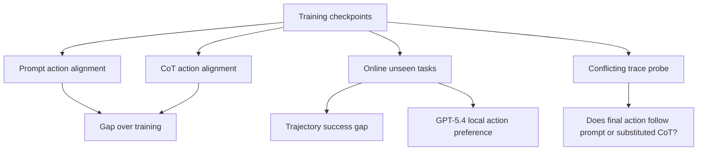
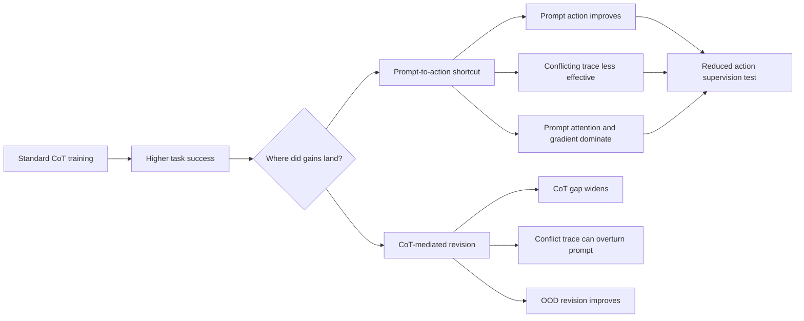

## Where Do CoT Training Gains Land in LLM based Agents?

### 元信息与 TL;DR

- **原文**：[arXiv:2606.26935v1](https://arxiv.org/abs/2606.26935v1)
- **题目**：Where Do CoT Training Gains Land in LLM based Agents?
- **作者**：Jingyu Liu、Zhiwen Wang、Yuxin Jing、Huanyu Zhou、Yong Liu
- **机构**：Renmin University of China、ByteDance、Beijing Key Laboratory of Research on Large Models and Intelligent Governance
- **发布日期**：2026-06-25 12:09:16 UTC
- **类别**：大模型后训练 / Agent CoT 监督诊断
- **图片处理**：不本地化图片；本文关键证据用公式、表格和流程图重构。

#### TL;DR

- 这篇论文问的是一个很尖锐的问题：Agent 经过 CoT 监督或 RL 训练后变强，到底是因为生成的 reasoning trace 更会修改动作，还是因为模型直接从长 prompt 预测 action 的能力变强？
- 作者提出两个解码模式：**prompt action** 是在 prompt 后直接预填 `<action>`，不生成 CoT；**CoT action** 是先生成 reasoning trace 再输出 action。两者差距用来诊断动作是否真的依赖 CoT 修正。
- 主结果显示，训练过程中 prompt action 和 CoT action 对 reference action 的 alignment 一起上升，但 CoT 相对 prompt 的优势没有扩大；在线 unseen tasks 上，CoT-vs-prompt 的 trajectory gap 和 GPT-5.4 局部 action preference gap 也大体保持平坦。
- 冲突 trace 测试进一步显示，后期 checkpoint 在面对与 prompt 冲突的替代 reasoning trace 时，更倾向保留原 prompt-based action，说明 final action 越来越被 prompt 锚定，而不是越来越容易被 CoT 改写。
- 机制证据来自 attention 和 gradient：action 生成时约 80% attention mass 落在 prompt token 上；action-only gradient mass 也主要集中在 prompt token，例如 ALFWorld 上 Qwen3-4B/8B/14B 的 prompt share 为 73.2/72.7/73.5，BFCL 上达到 84.4/84.6/82.7。
- 作者据此提出 **reduced action supervision**：对随机 `k%` 训练样本 mask final action token loss，只优化 CoT span，同时保留其余样本的标准 action supervision；默认 `k=0.3`。该干预在 OOD 上多数环境和模型组合提升表现，并让 CoT-minus-prompt action gap 在 ALFWorld、ScienceWorld 上更大。
- 局限是：prompt action 只是行为代理，不直接测内部计算；部分 action-quality judge 依赖 GPT-5.4，可能带来评估偏差；而且 BFCL 的收益更混合，说明结构化工具调用场景里 prompt shortcut 与 CoT revision 的关系并不总是同一模式。

### 研究问题：CoT 训练的收益到底落在哪里？

#### 为什么这个问题重要？

- Agent 训练常见格式是：
  - prompt 包含任务说明、历史观察、工具结果和当前状态。
  - 模型先输出一段 chain-of-thought。
  - 模型再输出下一步 action。
- 如果只看最终成功率，我们无法判断：
  - CoT 是否真的改变了 action。
  - CoT 是否只是把 prompt 已经暗示的 action 解释一遍。
  - 训练是否主要强化了 prompt-to-action shortcut。

#### 论文区分的两个路径

| 路径 | 输入 | 输出 | 诊断含义 |
|---|---|---|---|
| Prompt action | prompt + `<action>` prefill | 直接生成 action | 测量不依赖生成 CoT 时，prompt 本身能预测多少动作 |
| CoT action | prompt + generated reasoning trace | reasoning 后生成 action | 测量 CoT 条件下的动作质量 |
| Gap | CoT action - prompt action | 差距 | 如果 gap 随训练扩大，才更像 CoT revision 变强 |

### 论文主张与论证路线

| Claim | Mechanism | Evidence | Boundary |
|---|---|---|---|
| CoT 训练会提高 prompt-only action prediction | 在训练 checkpoint 上比较 prompt action 与 CoT action 对 reference action 的 alignment | Figure 1：三类环境中两条曲线并行上升 | 只说明动作可从 prompt 预测，不直接证明模型内部没有 reasoning |
| CoT 的相对优势没有随训练扩大 | 在线 unseen tasks 比较 trajectory success gap 和局部 action preference gap | ALFWorld trajectory gap 与 GPT-5.4 action preference gap 大体平坦 | 主要图示 ALFWorld，更多环境放在附录 |
| 后期 checkpoint 更 prompt-anchored | 替换为冲突 reasoning trace，观察 final action 是否被改写 | ALFWorld/BFCL/ScienceWorld 的冲突 trace 曲线显示原 prompt action agreement 上升 | 冲突 trace 是人工构造 probe，不等于真实部署分布 |
| Prompt 有结构性优势 | 长 prompt 包含任务、历史、observation；action loss 回传时 prompt token 获得更多 attention/gradient | action-time attention 约 80% 落在 prompt；gradient share 表格也偏向 prompt | attention/gradient 是机制线索，不是因果证明的完整闭环 |
| 降低 action-token supervision 可改善 OOD | 对部分样本 mask final action loss，只训练 CoT span | OOD 图和 GRPO 表显示多数设置提升 | BFCL 改善较小；mask ratio 需要调节 |

### 方法机制：如何诊断 prompt shortcut？

#### Step 1：构造两种动作

```text
输入 prompt p = 任务说明 + 历史交互 + 当前 observation

Prompt action:
  p + "<action>" -> action

CoT action:
  p -> reasoning trace -> action
```

- Prompt action 绕过 reasoning trace。
- CoT action 允许模型先思考再行动。
- 如果训练主要增强 CoT revision，CoT action 应该越来越明显优于 prompt action。
- 如果训练也增强 prompt shortcut，prompt action 会同步变好。

#### Step 2：做三类诊断



#### Step 3：用机制分析解释

作者没有止步于行为曲线，而是补了两类解释：

- attention：
  - action 生成时，prompt token 吸收大多数 attention mass。
  - top-K high-attention positions 中，prompt token 也超过一半。
- gradient：
  - action-only loss 对 prompt token 的梯度份额大于 CoT token。
  - 这说明 action supervision 的优化压力更容易强化 prompt-to-action pathway。

### 实验设置：任务、模型与训练

#### 环境

| 环境 | 类型 | OOD 划分 |
|---|---|---|
| ALFWorld | embodied household tasks | Cool & Place、Pick Two & Place 作为 unseen tasks |
| ScienceWorld | interactive scientific reasoning | 每个 topic 的 final task type 作为 OOD |
| BFCL | function calling / tool use | long-context setting 作为 OOD |

#### 训练设置

| 训练 | 配置 |
|---|---|
| SFT | 5 epochs，learning rate 1e-5，batch size 16 |
| GRPO/RL | 200 steps，learning rate 1e-6，batch size 32，group size 8 |
| RL penalty | 格式错误输出 reward penalty -0.1 |
| KL | 0.01 |
| 轨迹收集 | 使用 GPT-5.4 收集 trajectories 并选择 successful trajectories for SFT |
| 干预比例 | reduced action supervision 默认 `k=0.3` |

#### 模型

- 论文图表中主要比较 Qwen3-4B、Qwen3-8B、Qwen3-14B。
- 附录还报告 Llama 模型上的冲突 trace 趋势。

### 主结果一：prompt action 与 CoT action 并行变好

#### Figure 1 支持什么？

- Figure 1 展示 ALFWorld、ScienceWorld、BFCL 三类环境。
- 横轴是 checkpoint，纵轴是 alignment probability。
- line types 区分 CoT 与 prompt。
- 模型包括 Qwen3-8B、Qwen3-14B、Llama-3.1-8B-Instruct。

#### 证据解读

- prompt action accuracy 随训练提高。
- CoT action accuracy 也随训练提高。
- 两者 gap 没有明显扩大。

这意味着：

- CoT 训练确实让模型更会输出正确 action。
- 但这种收益不只落在“生成 CoT 后再改 action”的路径。
- 相当一部分收益可以直接从 prompt 中恢复。

#### 为什么这不等同于“CoT 没用”？

- 论文明确说 CoT action 仍保有稳定优势。
- 关键点是：优势没有扩大。
- 所以更准确的说法是：
  - CoT 仍有帮助。
  - 但训练收益没有主要表现为 CoT revision 越来越强。

### 主结果二：在线 unseen tasks 的差距仍然平坦

#### Trajectory-level 评估

- 作者让 Agent 在 unseen tasks 中实际交互。
- 比较 prompt action execution 和 CoT action execution。
- 在 ALFWorld 上，CoT-minus-prompt trajectory success gap 随 checkpoint 大体平坦。

#### Local action-level 评估

- 轨迹成功率容易受后续恢复、错误累积和环境噪声影响。
- 作者又在同一 decision context 下，让 GPT-5.4 判断 prompt action 与 CoT action 哪个更好。
- 结果显示 CoT action 相对 prompt action 的 win rate 也没有随 checkpoint 明显扩大。
- 作者人工检查了 100 个 GPT-5.4 judgments，其中 93% 与 human judgments 一致。

#### 这部分证据的作用

- 它排除了一个简单反驳：
  - “也许训练集上 prompt action 变好只是记忆，线上会不同。”
- 在线 unseen tasks 仍表现出 flat-gap pattern。
- 这让 shortcut 解释更有说服力。

### 主结果三：冲突 trace 下，后期 checkpoint 更难被 CoT 改写

#### Probe 设计

作者构造一个冲突输入：

```text
原 prompt p1
原 reasoning trace t1 -> action a1
随机替代 trace t2 -> 支持另一个 action a2

测试输入: p1 + truncated(t2) + "<action>"
观察输出更像 a1 还是 a2
```

如果模型越来越依赖 CoT，那么 `t2` 应该更容易把 action 拉向 `a2`。

如果模型越来越依赖 prompt，那么模型会更倾向保留 `p1` 所暗示的 `a1`。

#### 结果

- ALFWorld 主图显示，later checkpoints 更常保留 original prompt-based action。
- BFCL 和 ScienceWorld 附录也显示相似趋势。
- RL checkpoint 与 Llama 模型也有补充结果。
- OOD 场景往往更 prompt-anchored，作者解释为 reasoning 更难用时，模型更倾向回到 prompt pathway。

#### 这支持什么？

- 训练不仅让 prompt action 变准。
- 训练还让最终 action 对冲突 reasoning trace 更不敏感。
- 这与“CoT 越训越能改写 prompt guess”的叙事相反。

### 机制分析：为什么 prompt 会拿到更多优化信号？

#### Prompt 长度优势

Agent prompt 不只是一个问题，它包含：

- 系统任务描述。
- 工具说明。
- 历史 action。
- 环境 observation。
- 用户反馈。
- 当前状态。

因此 action token 生成时，prompt 往往比 reasoning trace 长得多。

#### Attention 证据

论文 Figure 4 表示：

- action 生成期间，接近 80% attention mass 落在 prompt token 上。
- 即使只看 top-K% highest-attention positions，prompt token 也超过一半。
- 作者强调他们关心的是总 pathway dominance，而不是 length-normalized per-token informativeness。

#### Gradient 证据

沿 self-attention value path：

```math
partial L_t / partial v_i = alpha_{t,i} * delta_t
```

其中：

- `L_t` 是 action position 的 loss。
- `v_i` 是 context token `i` 的 value vector。
- `alpha_{t,i}` 是 action token 对 context token 的 attention weight。
- `delta_t` 是 action output 处的反向梯度。

如果 prompt token 持续获得更大的 attention mass，那么 action loss 的梯度也会更多流向 prompt pathway。

#### 表格数字

| 环境 | Qwen3-4B prompt gradient share | Qwen3-8B | Qwen3-14B |
|---|---:|---:|---:|
| ALFWorld | 73.2 | 72.7 | 73.5 |
| ScienceWorld | 76.5 | 78.9 | 79.2 |
| BFCL | 84.4 | 84.6 | 82.7 |

这些数字说明：

- action-only gradient mass 主要集中在 prompt token。
- BFCL 的 prompt share 最高，可能和结构化工具调用、强格式约束有关。
- 这也解释了为什么 BFCL 上 reduced action supervision 的效果更混合。

### 干预：Reduced Action Supervision

#### 目标

- 如果 final action loss 强化 prompt-to-action shortcut，那么减少一部分 action-token supervision 应该削弱 shortcut。
- 但不能完全去掉 action supervision，否则模型不会学会输出 action。

#### 训练目标

对随机选中的 `k%` 样本：

```math
L_cot = - sum_t M(t) log p_theta(y_t | p, y_<t)
```

其中：

- `M(t)=1` 表示 token 属于 CoT span。
- `M(t)=0` 表示 token 属于 final action span。
- 作者保留 `<action>` tag 的 supervision，让模型仍学习何时从 reasoning 切到 action。

对剩余样本：

- 保持标准 CoT + action supervision。

#### RL 版本

- 对 GRPO/RL 训练也随机选择 `k%` 样本。
- mask final action token loss。
- 只优化 CoT span。
- advantage estimates 保持不变。

### 干预结果：OOD 提升与 CoT gap 变化

#### OOD 图的含义

- Figure 5 显示 reduced action supervision 在多数环境/模型组合上提高 OOD evaluation score。
- 最大提升出现在 ALFWorld 和 ScienceWorld。
- BFCL 提升更小或更混合。

#### GRPO 表格

| 模型 | 方法 | ALFWorld in | ALFWorld out | ScienceWorld in | ScienceWorld out | BFCL in | BFCL out |
|---|---|---:|---:|---:|---:|---:|---:|
| Qwen3-4B | GRPO | 0.82 | 0.44 | 0.46 | 0.22 | 0.69 | 0.61 |
| Qwen3-4B | Ours | 0.83 | 0.52 | 0.49 | 0.24 | 0.71 | 0.64 |
| Qwen3-8B | GRPO | 0.95 | 0.86 | 0.57 | 0.40 | 0.74 | 0.63 |
| Qwen3-8B | Ours | 0.95 | 0.89 | 0.61 | 0.44 | 0.77 | 0.69 |

#### 与 DPO/FRODO baseline 的比较

| 方法 | ALFWorld | ScienceWorld | BFCL |
|---|---:|---:|---:|
| SFT | 0.55 | 0.25 | 0.58 |
| DPO | 0.59 | 0.29 | 0.62 |
| FRODO | 0.61 | 0.30 | 0.64 |
| SFT+ | 0.63 | 0.27 | 0.62 |
| DPO+ | 0.65 | 0.35 | 0.67 |

解读：

- SFT+ 在 ScienceWorld/BFCL 上不总是超过 FRODO。
- DPO+ 在三项上都高于 DPO，并超过 FRODO。
- 这说明 reduced action supervision 更像一个可叠加训练约束，而不是完整替代偏好训练。

#### Mask ratio ablation

| k | ALFWorld | ScienceWorld | BFCL |
|---:|---:|---:|---:|
| 0.1 | 0.61 | 0.26 | 0.61 |
| 0.3 | 0.63 | 0.27 | 0.62 |
| 0.5 | 0.61 | 0.24 | 0.59 |
| 0.7 | 0.60 | 0.27 | 0.61 |

`k=0.3` 是比较稳的折中：

- 太低，shortcut 压力削弱不足。
- 太高，action supervision 不够，性能可能下降。

### Figure 与 Table 证据边界

| 证据 | 支持什么 | 不能证明什么 |
|---|---|---|
| Figure 1 | prompt/CoT alignment 并行上升 | 不能直接测内部 reasoning 是否存在 |
| Prompt/CoT consistency | 两种模式更常输出相同行动 | 不能区分任务变简单还是 shortcut 变强 |
| Online ALFWorld gap | unseen tasks 上 CoT 相对优势不扩大 | 不能代表所有环境 |
| Conflicting trace probe | later checkpoints 更 prompt-anchored | 人工替换 trace 与真实错误 trace 不完全一样 |
| Attention analysis | prompt token 在 action-time 占主导 | attention 不是因果解释的全部 |
| Gradient share table | action loss 更多流向 prompt token | 只覆盖 action-only loss 视角 |
| Reduced supervision OOD | 削弱 action loss 可改善泛化 | BFCL 混合，说明机制依赖任务结构 |

### 逐图细读：每个图在论证里承担什么功能？

#### Figure 1：把“性能提升”拆成两条曲线

- 这张图不是普通的 accuracy 曲线。
- 它的设计目的是把同一 checkpoint 的两种动作生成方式放在一起：
  - 一条线代表 prompt action。
  - 一条线代表 CoT action。
- 如果 CoT 训练主要强化 reasoning-mediated revision，预期图像应该是：
  - CoT action 继续上升。
  - prompt action 上升较慢。
  - 两者 gap 逐渐扩大。
- 论文观察到的不是这个模式。
- 更接近的模式是：
  - 两条线同时上升。
  - 两条线的间距大体稳定。
  - prompt-only 路径也吃到了训练收益。

#### Prompt/CoT consistency 图：为什么“越来越一致”很关键？

- 仅看 prompt action accuracy 上升，还可以解释为模型在某些简单样本上记住了答案。
- 但 prompt/CoT consistency 上升说明：
  - 同一个 prompt 下，无 CoT 与有 CoT 更常到达同一个 action。
  - 这意味着两条路径的输出越来越耦合。
- 这个结果让“CoT 是独立修正机制”的解释变弱。
- 更合理的解释是：
  - prompt already narrows down action。
  - CoT 更多是在延续或包装 prompt-based decision。

#### Online ALFWorld 图：为什么要放到环境里跑？

- 离线 reference-action alignment 只判断 action 是否和参考答案一致。
- Agent 实际交互会引入：
  - 前一步错误是否可恢复。
  - 环境 observation 是否改变。
  - 长轨迹中单步差异是否累积。
- 作者在 unseen tasks 里比较 prompt action execution 和 CoT action execution。
- CoT 相对 prompt 的 trajectory success gap 仍然没有扩大。
- 这说明 parallel improvement 不是纯离线伪象。

#### GPT-5.4 preference 图：为什么要引入 judge？

- 轨迹级成功率有噪声：
  - 某一步好动作可能后续失败。
  - 某一步坏动作可能被后续恢复。
- 局部 action preference 直接比较同一状态下的两个候选 action。
- 作者用 GPT-5.4 判断哪个 action 更好，并人工检查 100 条，报告 93% 与人类判断一致。
- 这让“局部 CoT action 质量是否越来越强”有了更直接证据。
- 结果仍然是平坦 gap。

#### Conflicting trace 图：这是最接近因果的问题

- 前面的图比较自然生成。
- Conflicting trace probe 则主动制造冲突：
  - prompt 指向 action A。
  - 替代 CoT 指向 action B。
  - 测模型最后跟谁走。
- 如果训练让 CoT 更有控制力，后期 checkpoint 应该更容易跟随替代 CoT。
- 实际上后期 checkpoint 更常保留 prompt action。
- 这不是证明 CoT 没有作用，而是说明在冲突条件下，prompt pathway 的控制力增强。

#### Attention 图：为什么“总量”而不是“均值”？

- 作者明确说，目标不是比较每个 prompt token 与每个 CoT token 的平均信息量。
- 他们关心 action prediction 时，整个 prompt pathway 与整个 CoT pathway 谁拿到更多信号。
- 长 prompt 本身就是 Agent 场景的结构性特征。
- 因此总 attention mass 高，不只是统计偏差，也是训练动力学的一部分：
  - 更多 prompt token 可被 attend。
  - action loss 更容易通过这些位置回传。
  - prompt-to-action shortcut 更容易被强化。

### Detail Inventory：可复用的实验细节清单

#### 诊断变量

| 变量 | 定义 | 作用 |
|---|---|---|
| `p` | 包含任务、历史、observation 的 prompt | prompt shortcut 的来源 |
| `t` | 生成的 reasoning trace | CoT pathway 的显性载体 |
| `a_prompt` | 直接从 prompt 生成的 action | 测 prompt-only 可预测性 |
| `a_cot` | 生成 CoT 后的 action | 测标准 CoT agent 行为 |
| `gap` | `quality(a_cot) - quality(a_prompt)` | 测 CoT 相对优势是否扩大 |
| `t_conflict` | 支持不同 action 的替代 trace | 测 prompt 与 CoT 冲突时谁控制 final action |

#### 评估方式

- Reference-action alignment：
  - 适合训练/验证集的 step-level 对比。
  - 直接衡量生成 action 是否等于参考 action。
- Online execution：
  - 适合看真实交互效果。
  - 缺点是长轨迹带来噪声。
- GPT-5.4 local judge：
  - 适合比较同一状态下两个 action 的局部质量。
  - 缺点是依赖 judge 可靠性。
- Conflict trace consistency：
  - 适合测控制方向。
  - 缺点是替代 trace 的自然性有限。
- Attention/gradient：
  - 适合解释为什么 action loss 强化 prompt pathway。
  - 缺点是还不能完全等同于因果机制。

#### 训练干预细节

- 对 `k%` 样本只优化 CoT span。
- 对 `1-k%` 样本保留标准 CoT + action loss。
- 保留 `<action>` tag 的 loss。
- SFT 与 RL 都能应用。
- 默认 `k=0.3`。
- ablation 显示 `k=0.5` 和 `k=0.7` 不稳定，说明 action loss 不能削太多。

### 为什么 BFCL 更混合？

- BFCL 是 function calling / tool-use benchmark。
- 它的 prompt 往往包含：
  - 函数 schema。
  - 参数类型。
  - 调用格式。
  - 明确的约束。
- 在这种任务里，从 prompt 直接预测 action 可能不是坏 shortcut，而是任务本身要求。
- 对 BFCL 来说：
  - schema-aware prompt-to-action 是能力。
  - reasoning trace 不一定需要大幅改写 prompt-implied action。
  - mask action supervision 过多可能削弱格式精确性。
- 因此 BFCL 上 mixed effect 是合理的，而不是简单的失败。

### 与同周后训练论文的互补视角

- 同一周有多篇 Agent 后训练论文关注：
  - 过程奖励。
  - 经验压缩。
  - 工具调用能力定位。
  - 轨迹选择与监控。
- 本文提供了一个反向提醒：
  - 训练后行为提升，不等于推理文本更忠实。
  - 蒸馏 reasoning trace，不等于蒸馏到了真正的决策机制。
  - 如果最终 action loss 仍然压在长 prompt 上，模型可能只是更会利用 prompt 里的局部模式。

#### 对训练数据设计的启发

- 不应只收集“好看的 CoT + 正确 action”。
- 还需要设计能区分路径的样本：
  - prompt 信息不足，必须依赖 CoT 推导。
  - prompt 暗示错误 action，CoT 必须修正。
  - observation 改变任务目标，旧 prompt pattern 必须被覆盖。
  - 工具 schema 相似但目标不同，必须依赖任务描述。
- 否则训练很可能把 action supervision 直接绑定到 prompt pattern。

#### 对评测设计的启发

- 一个 Agent benchmark 如果只看 final success，很难发现 shortcut。
- 更好的评测应包括：
  - prompt action baseline。
  - CoT action baseline。
  - no-CoT / truncated-CoT / conflicting-CoT perturbation。
  - action sensitivity to task instruction changes。
  - action sensitivity to observation changes。
  - CoT/action consistency 与成功率的分组分析。

### 一个更完整的研究框架



这张重构图表达了论文的核心方法论：

- 不要把成功率当成单一答案。
- 先定位收益落在哪条路径。
- 再用干预验证诊断是否能改善泛化。

### 按论文段落导读：作者如何一步步说服读者？

#### Introduction 的功能

- 开头不是泛泛介绍 CoT，而是把问题限定到 **interactive agents**。
- 这类 Agent 的 prompt 很长，包含任务说明、历史、工具观察和环境反馈。
- 因此作者先建立一个前提：
  - 在长上下文里，prompt 本身可能已经足以预测下一步动作。
  - 生成的 reasoning trace 可能只是让答案看起来有推理过程。
- Introduction 的核心作用，是把“CoT 有用吗”改写为“CoT 训练收益落在哪条因果路径上”。

#### Related Work 的功能

- CoT faithfulness 相关工作说明：
  - verbal reasoning 不一定忠实。
  - answer 可能早已被模型决定。
- Agent generalization 相关工作说明：
  - Agent 的 in-domain 和 OOD gap 是长期问题。
  - RL、SFT、self-reflection、meta-reasoning 都有争议。
- 论文的定位是：
  - 不直接争论 SFT 和 RL 谁更好。
  - 而是诊断无论训练方法如何，action supervision 可能强化 prompt shortcut。

#### Setup 的功能

- Setup 里最重要的是两个定义：
  - prompt action。
  - CoT action。
- 这两个定义把原本难测的内部推理变成可测行为差异。
- 论文没有声称 prompt action 等于真实内部决策。
- 它把 prompt action 当作一个 proxy：
  - 如果没有显式 CoT，模型仍能生成同一动作，说明该动作至少可由 prompt 直接预测。

#### Training Dynamics 的功能

- 这部分回答第一个问题：
  - 训练中 prompt action 是否同步变强？
- Figure 1 和 consistency 曲线共同说明：
  - 是的，prompt action 也变强。
  - 而且 prompt/CoT 输出更常一致。
- 这一步不是最终结论，但它迫使读者承认：
  - CoT 训练收益不能只归因给 reasoning trace。

#### Online Evaluation 的功能

- 这部分回答第二个问题：
  - 离线诊断在真实交互里是否仍成立？
- 作者用 trajectory success 和 local action judge 两个角度控制噪声。
- 如果只看 trajectory，可能被长轨迹偶然性干扰。
- 如果只看 judge，可能被 judge 偏差干扰。
- 两者都显示 flat gap，说明结论更稳。

#### Conflicting Trace 的功能

- 这部分是全篇最关键的方向性 probe。
- 它不只是问“prompt 和 CoT 哪个更准”，而是问：
  - 当两者冲突时，final action 跟谁走？
- 后期 checkpoint 更跟 prompt 走，说明训练并没有让 CoT 获得更强控制权。
- 这也解释了论文题目里的 “Where Do Gains Land”：
  - 很多收益落在 prompt-conditioned policy 上。

#### Mechanistic Analysis 的功能

- 行为证据可能被质疑：
  - 也许样本更简单。
  - 也许 prompt action 只是偶然一致。
  - 也许 judge 有偏。
- attention 与 gradient 分析给出结构性解释：
  - prompt 长。
  - prompt 被 attend 得多。
  - action loss 的梯度更多流向 prompt token。
- 这让 shortcut 不是单个现象，而是有优化路径支撑的训练偏置。

#### Intervention 的功能

- 如果诊断正确，削弱 action-token loss 应该有帮助。
- reduced action supervision 不是为了让模型不学 action。
- 它是为了减少部分样本上 action loss 对 prompt pathway 的直接强化。
- OOD 提升说明：
  - 诊断不只是解释过去。
  - 它还能指导训练改造。

### 实操检查清单：如果我要复用这篇论文的方法

#### 训练前检查

- 训练数据是否总是 `reasoning + action` 成对出现？
- action 是否可以仅凭 prompt 中的局部模式预测？
- prompt 是否包含大量模板化环境反馈？
- 训练集和 OOD 测试集是否只改变目标，而没有改变 observation 模式？
- 工具 schema 是否让 action 变成格式匹配问题，而不是 reasoning 问题？

#### 训练中记录

- 每个 checkpoint 的 prompt action accuracy。
- 每个 checkpoint 的 CoT action accuracy。
- prompt/CoT action consistency。
- CoT-minus-prompt gap。
- action loss 对 prompt token 与 CoT token 的 gradient share。
- prompt token 和 CoT token 的 action-time attention mass。

#### 训练后 probe

- 替换 reasoning trace，观察 action 是否跟随新 trace。
- 截断 reasoning trace，观察 action 在什么比例后改变。
- 替换任务目标，观察 action 是否仍沿用旧任务。
- 替换 observation，观察 action 是否更新。
- 对 prompt action 与 CoT action 做人工或强 judge 局部比较。

#### 何时应该使用 reduced action supervision？

- 当 prompt action 随训练快速上升，而 CoT gap 不扩大时。
- 当冲突 trace 很难改变 action 时。
- 当 OOD 失败表现为沿用旧任务动作模板时。
- 当 attention/gradient 明显偏向 prompt token 时。

#### 何时要谨慎使用？

- 当任务本身要求强 prompt-to-action 映射时，例如严格函数调用。
- 当 action 格式比 reasoning 更重要时。
- 当 CoT trace 只是供人读，而不是训练目标的一部分时。
- 当数据量很小，mask action loss 可能导致 action 格式退化时。

### 对评测结论的保守解释

- 本文证明的是 **标准 CoT supervision 的一部分收益会落在 prompt-side action prediction**。
- 本文没有证明：
  - 所有 CoT 都是 post-hoc。
  - 所有 Agent 训练都不需要 CoT。
  - prompt shortcut 永远有害。
  - reduced action supervision 对所有工具场景都有效。
- 更精确的结论是：
  - 在长上下文 Agent 中，prompt pathway 有结构性优势。
  - 如果不单独诊断，训练收益很容易被误读为 reasoning 能力提升。
  - OOD 泛化需要限制模型过度依赖 prompt 局部模式。

### 相关工作位置

#### CoT faithfulness
### 相关工作位置

#### CoT faithfulness

- 既有研究指出 verbalized CoT 可能是 post-hoc rationalization。
- 本文不是只看单个推理样本是否忠实。
- 它追踪训练 dynamics：随着 checkpoint 前进，prompt action 是否也变强。

#### Agent generalization

- 近期 Agent 训练研究常讨论 SFT vs RL 哪个更泛化。
- 本文把泛化问题和 shortcut learning 连接起来：
  - 长 prompt 可能已经包含大量 action-predictive 信息。
  - 标准 CoT supervision 可能无意中强化这个 shortcut。

#### FRODO 与 DPO

- FRODO 用分离 reasoning/answer 或偏好训练路线改善 faithfulness。
- 本文的 reduced action supervision 更轻量：
  - 不必重新定义所有偏好对。
  - 直接在 token-level loss 上控制 action span。
  - 可与 DPO 叠加。

### 局限与反例

#### 作者明确局限

- Prompt action 是行为代理，不是内部计算的直接测量。
- 局部 action-quality 判断依赖 GPT-5.4，可能有 judge bias。
- 本文不声称 latent reasoning ability 没有提升，只说标准 CoT 监督的收益不能简单解释为 CoT-based revision alone 更重要。

#### 我认为还要补的实验

- 用人工标注替代更多 GPT-5.4 action preference 判断。
- 在真实网页或代码 Agent 中测 prompt/action shortcut。
- 比较不同 prompt 长度、不同工具 schema 复杂度下的 gradient share。
- 把 action masking 与 explicit rationale faithfulness loss 组合。
- 对闭源模型只能访问 logprobs 的情况，设计不需要训练内部梯度的诊断。

#### 可能反例

- 在短 prompt 任务中，prompt 没有长历史和丰富 observation，shortcut 不一定增强；论文的 MATH、MedQA、GPQA 对照也显示 prompt/CoT consistency 不怎么随训练上升。
- 在严格工具调用任务中，prompt 本身包含 schema 和格式，直接 action prediction 可能就是合理能力，不一定是坏 shortcut。
- 如果 CoT 主要用于人类审计而不是模型内部决策，减少 action supervision 可能提升泛化，但也可能让 trace 更难对应最终 action。

### 对后训练与 Agent 研究的意义

#### 对 CoT 监督的提醒

- 训练数据里有漂亮 reasoning trace，不代表模型学到的是 reasoning-mediated revision。
- 如果 action loss 直接回传到长 prompt，模型可能学到更强的 prompt-to-action 映射。
- 所以评测不能只看：
  - 成功率。
  - CoT 语言质量。
  - reasoning 是否看起来合理。
- 还要看：
  - 无 CoT action 是否同步变强。
  - 冲突 trace 能否改变 action。
  - attention/gradient 是否过度集中在 prompt。

#### 对 Agent 泛化的提醒

- OOD 失败可能不是模型不会推理。
- 可能是训练让模型更依赖 prompt 中的局部模式和历史观察。
- 当 OOD task 改变规则或目标时，prompt shortcut 会把模型拉回旧动作分布。

#### 对安全的提醒

- 如果 CoT 只是 post-hoc explanation，审计 CoT 文本本身会高估系统可解释性。
- 安全监控应检查 action sensitivity：
  - 改变 reasoning trace 是否改变 action？
  - 改变任务目标是否改变 action？
  - 工具 observation 被污染时，action 是否仍沿用旧模式？

### 结论

- 这篇论文最有价值的地方，是把“CoT 训练有效”拆成了两个可测路径：prompt-to-action 与 CoT-to-action。
- 论文的主要发现是：在长上下文 Agent 中，训练收益大量落在 prompt action 上；CoT 仍有帮助，但相对优势没有随训练扩大。
- 机制证据显示，prompt token 在 action 生成时获得更大 attention 和 gradient share，这解释了为什么 action-token supervision 会强化 shortcut。
- reduced action supervision 是一个简单但有启发的干预：对部分样本不训练 final action token，迫使训练压力更多落在 CoT span；它在多个 OOD 设置中带来提升。
- 对 Agent 后训练来说，下一步不应只问“要不要 CoT”，而应问：训练后的 action 到底对 prompt、CoT、observation 和任务目标分别有多敏感。
