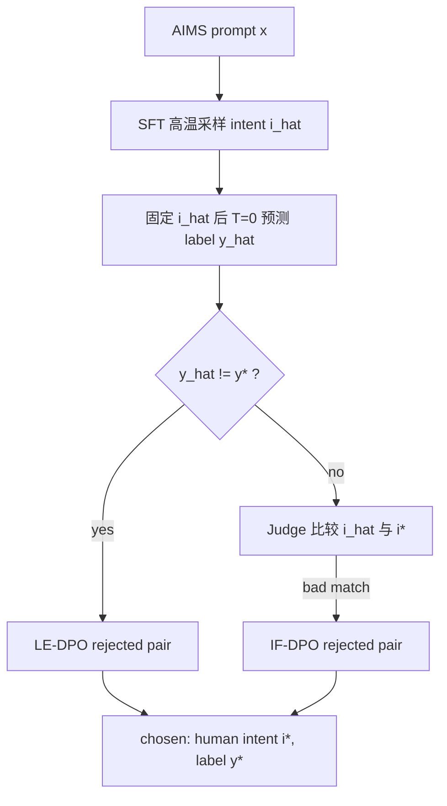

### 元信息与 TL;DR

| 字段 | 内容 |
|---|---|
| 原文 | [Paved with True Intents: Intent-Aware Training Improves LLM Safety Classification Across Training Regimes](https://arxiv.org/abs/2606.27210) |
| 版本 | arXiv:2606.27210v1，2026-06-25 16:03:57 UTC 提交 |
| 项目页 | [jazhyc.github.io/aims-safety](https://jazhyc.github.io/aims-safety/) |
| 作者 | Jeremias Ferrao, Niclas Muller-Hof, Iustin Sirbu, Traian Rebedea, Yftah Ziser |
| 机构 | University of Groningen, University Politehnica of Bucharest, NVIDIA |
| 方向 | AI 安全；安全分类器；后训练；DPO / GRPO / reasoning distillation |

**TL;DR：**

- 这篇论文研究一个很具体的安全分类问题：很多 prompt 是否有害，不取决于表面词，而取决于用户到底想做什么。作者把 **intent** 作为 prompt 和 harm label 之间的显式中间变量，而不是让分类器直接从文本跳到 safe/harmful。
- 作者构造了 **AIMS**，从 WildGuardMix 中筛选不确定、边界、对抗和伪装样本，收集 1,946 条原始标注，过滤 222 条后得到 1,724 条 intent-label annotations；最终覆盖 1,275 个 unique prompts。70.1% 被原始数据标记为 adversarial，说明它确实偏向难例。
- 每条标注包含三元组 `D_AIMS = {(x, i*, y*)}`：prompt `x`、人工写的一句话 intent `i*`、harm label `y*`。harm 先按四档标注：Completely Safe、Uncertain Safe、Uncertain Harmful、Completely Harmful，再折成 binary safe/harmful 用于训练和评测。
- 论文用同一个 AIMS 信号测试四类训练制度：SFT 生成 intent+label；DPO 拒绝错误 intent；reasoning distillation 用 human intent 约束教师 trace；GRPO 直接把 intent faithfulness 做成 reward。
- 主结果来自五个外部安全 benchmark：WildGuardTest、XSTest、AEGIS 2.0、ToxicChat、OpenAI Moderation。GRPO 的 **Label and intent reward** 平均 F1 达到 **0.836**，高于最强 zero-shot LLM GPT-5.4 的 **0.815**，也高于最强 dedicated guard Nemotron Safety 4B 的 **0.809**。
- 不是每个单项都赢：WildGuard 7B 在 WGTest 最高，Nemotron Safety 4B 在 AEGIS 2.0 最高，ShieldGemma 27B 在 OAI Moderation 最高。论文的关键证据是 intent-aware 方法在平均 F1 和 latency-F1 Pareto 上更稳，而不是单榜横扫。
- 局限也明确：任务是 prompt-level safety classification，不覆盖 response-level moderation、多轮上下文、拒答策略和完整 assistant pipeline；AIMS 来自 WildGuardMix，且经过 uncertainty filtering，并非自然分布；DPO/GRPO 里 intent faithfulness 依赖 Gemma-3-27B-IT judge，judge 偏差会进入训练。

### 研究问题：为什么 safety classifier 要显式建模 intent？

普通安全分类器常做的是：

```text
Prompt x -> Harm label y
```

这在很多简单场景有效，但会在两类样本上出问题：

- **有害请求被包装成安全语境**：角色扮演、研究、历史、小说、课堂、假设场景；
- **安全请求带有危险表面词**：用户问规则边界、讨论非法活动定义、创作里的敏感词、引用和批判性讨论。

论文把问题重新写成：

```text
Prompt x -> Intent i -> Harm label y
```

这个中间变量有三个作用：

| 作用 | 解释 |
|---|---|
| 可监督 | 人类可以写一句话描述“用户想达成什么目标” |
| 可诊断 | 如果最终 label 错，可以区分是 intent 错还是 label grounding 错 |
| 可优化 | DPO 和 GRPO 可以专门惩罚 unfaithful intent，而不只看最终 label |

作者的观点不是“让模型解释一下就会更安全”，而是更严格：

- intent 必须来自人工标注或可校验训练信号；
- intent 不能只是 CoT 风格的装饰；
- 最终 label 必须被正确的 intent 约束；
- 如果 intent 对但 label 仍错，这也是独立 failure mode。

### AIMS 数据集：难例不是均匀采样来的

#### 1. 候选选择

AIMS 从 WildGuardMix 的英文 prompt 出发。

作者没有均匀抽样，而是先训练 ensemble classifier，用它对剩余 annotation pool 做不确定性估计，只选择 harmful probability 落在 `[0.35, 0.65]` 的样本。

这个策略意味着：

- AIMS 不是普通安全样本集；
- 它刻意富集了边界、对抗、伪装和难判例；
- 这些样本正是 intent reasoning 可能发挥作用的地方。

论文报告：

| 数据环节 | 数字 |
|---|---:|
| uncertainty band 选出的 candidate prompts | 1,724 |
| 选中样本中原始标记为 adversarial 的比例 | 70.1% |
| 原始收集 annotation | 1,946 |
| 过滤移除 | 222，约 11.4% |
| 最终 annotation | 1,724 |
| unique prompts | 1,275 |
| train/validation/test | 80:10:10 |

这里的一个细节很重要：**1,724 是 annotation 数，不是 unique prompt 数**。最终 unique prompt 是 1,275，因为有些 prompt 有重复标注，用于一致性分析和避免 cross-split leakage。

#### 2. 人工标注格式

标注员需要做两件事：

- 从 prompt 本身推断用户 underlying intent；
- 写一句简洁 intent description；
- 再给 harm label。

intent 标注规则强调：

- 不要把 intent 写成简单分类标签；
- 只根据 prompt 文本推断，不猜测外部动机；
- 描述 underlying goal，不描述 jailbreak 技巧；
- 如果过度含糊或不可标，允许移除。

harm label 先用四档：

| 原始四档 | 下游二分类 |
|---|---|
| Completely Safe | safe |
| Uncertain Safe | safe |
| Uncertain Harmful | harmful |
| Completely Harmful | harmful |

这个设计保留了标注时的不确定性，但训练和评测仍折成 binary safe/harmful。

#### 3. 质量与一致性

论文给出几个质量指标：

| 指标 | 数值 | 含义 |
|---|---:|---|
| binary harm label Cohen's kappa | 0.55 | 难例上达到中等一致性 |
| human intent pairwise cosine | 0.62 | 不同标注员写法不同，但语义接近 |
| Llama-3.1-8B intent 与 human intent cosine | 0.50 | 模型直接生成 intent 不等同人工 intent |
| human label 与原 WildGuardMix label 匹配率 | 72% | 分歧集中在 adversarial prompts |

这组数字支持一个关键判断：

- 如果只是让模型“自己解释 intent”，不一定可靠；
- 这些难例里，人类标注的 intent 提供了额外监督；
- 原始数据标签和人类复核也有分歧，所以安全分类不只是训练更多 label。

### 训练制度一：SFT，把 intent 作为输出目标

SFT 比较两种输出格式：

| 格式 | 输出 |
|---|---|
| Classification | 只输出 harm label `y*` |
| Generation | 输出 `Intent: i*; Harm: y*` |

两者训练目标都是 next-token prediction。

区别是 Generation format 强制模型在预测 final label 前显式生成 intent。

这相当于把安全分类拆成：

```text
读 prompt -> 写用户目标 -> 判断目标是否有害
```

而不是：

```text
读 prompt -> 直接给 harmful/safe
```

论文附录的格式比较显示，SFT Generation 明显优于 SFT Classification，chain-of-thought prompting 也没有提供同等级收益。

### 训练制度二：DPO，把错误 intent 当作 rejected completions

SFT 只最大化人工 intent-label 序列的似然，缺少对“看起来合理但错误的 intent”的 contrastive 信号。

DPO 部分的设计是这篇论文最清楚的机制之一。

#### 1. Two-pass rejection construction

对每个 prompt `x`：

```text
Chosen completion:
  c+ = (i*, y*)    # AIMS 人工 intent 与人工 label

Rejected candidate:
  c- = (i_hat, y_hat)
```

`c-` 的构造分两步：

1. 从 SFT Generation model 高温采样多个 candidate intents `i_hat`；
2. 丢弃采样时带出的 label，再把固定的 `i_hat` 喂给模型，用 deterministic decoding 得到 `y_hat`。

这样做的意义是：

- `i_hat` 反映模型认为可能的解释；
- `y_hat` 反映模型在该解释下的稳定安全判断；
- 避免把高温 label noise 当作真实偏好错误。

#### 2. LE-DPO：label-error DPO

LE-DPO 拒绝的是：

```text
y_hat != y*
```

也就是说，错误 intent 严重到把最终 harm label 翻转。

这类样本回答的问题是：

- 模型如果误解用户意图，会不会真的导致安全分类错误？
- 用 DPO 惩罚这些 intent，能不能修正 label-level failure？

#### 3. IF-DPO：intent-faithfulness DPO

IF-DPO 更严格。

它处理的是：

```text
y_hat == y*
but i_hat misrepresents the user's goal
```

也就是 label 对了，但 intent 错了。

这类候选由 Gemma-3-27B-IT judge 比较：

- 原 prompt；
- human intent `i*`；
- generated intent `i_hat`。

如果候选 intent 遗漏安全关键细节、矛盾、错误概括用户目标，就进入 rejected pool。

这个设计很有研究价值，因为它把“正确 label 但错误理由”也纳入训练。

### 训练制度三：GRPO，把 intent faithfulness 变成 reward

GRPO 部分测试的是：intent 是否不仅能做 supervised target，也能成为在线 RL reward。

#### 1. 结构化输出

每个 rollout 必须包含：

```text
<reasoning> r_hat </reasoning>
Intent: i_hat; Harm: y_hat
```

这意味着 label-only reward baseline 也不是完全没有 intent。

论文特别说明：

- label reward baseline 和 full reward 都使用同样的 intent-inducing prompt；
- 都输出 reasoning、intent 和 harm label；
- 消融比较的是“显式奖励 intent faithfulness 是否还会带来额外提升”。

#### 2. Reward 公式

论文把 reward 写成乘积：

```math
R = R_{format} \times R_{label} \times R_{len} \times R_{intent}
```

四个分量分别是：

| Reward | 作用 |
|---|---|
| `R_format` | 输出必须可解析，包含 reasoning、Intent、Harm |
| `R_label` | hard correctness gate；harm label 错则 reward 为 0 |
| `R_len` | 防止 intent 描述过短、过长或退化 |
| `R_intent` | 用 Gemma-3-27B-IT judge 判断 generated intent 是否忠实于 human intent |

`R_intent` 的 judge verdict 映射为：

| verdict | reward |
|---|---:|
| good_match | 1.0 |
| decent_match | 0.5 |
| bad_match | 0.1 |

因为 reward 是乘积，label 错会直接归零。

这使得 intent reward 不是“说得像解释就加分”，而是在 label 正确、格式正确的前提下进一步区分 intent 是否 faithful。

#### 3. GRPO 训练细节

| 参数 | 数值 |
|---|---:|
| 初始化 | Llama-3.1-8B-Instruct |
| KL reference | same policy |
| 框架 | VERL + vLLM |
| rollouts per prompt | 16 |
| KL coefficient | `1e-3` |
| learning rate | `1e-6` |

附录还提到一个失败边界：作者早期试过从 intent-supervised SFT checkpoint 初始化 GRPO，但这个 checkpoint 太“固执”，会绕过新 prompt 规定的 sequential reasoning，直接输出 SFT 风格 intent summary 和 classification，导致 `<reasoning>` 格式不匹配、`R_format=0`，训练早期 reward 接近 0，并出现 exploration collapse。

这说明：

- SFT 不是总能作为 RL 初始化的好起点；
- 如果输出格式要改，过强的 SFT conditioning 可能妨碍探索；
- 论文最终选择 base instruct model 加结构化 prompt。

### 训练制度四：reasoning distillation，让 human intent 约束教师 trace

distillation 部分测试 intent 是否能作为 reasoning trace 的结构，而不只是最终输出。

论文比较三种 teacher trace 条件：

| 条件 | teacher 可见信息 | student 学什么 |
|---|---|---|
| No-intent | gold harm label | Reasoning + Harm |
| Synthetic-intent | gold harm label，teacher 自己推断 intent | Reasoning + Intent + Harm |
| Human-intent | gold harm label + human intent | Reasoning + human intent + Harm |

主报告模型是：

- teacher：GPT-OSS-120B；
- student：Gemma-3-12B；
- condition：human-intent；
- student 训练：SFT QLoRA，但 LoRA rank/alpha 增至 32/64。

结果上，论文说 intent-conditioned distillation 在 12 个 teacher-student pair 中有 9 个超过 no-intent，其中 6 个由 human-intent condition 拿到，top two cells 也都用了 intent supervision。

这支持一个机制判断：

- reasoning trace 本身不够；
- trace 要被正确 intent anchor；
- human intent 比 teacher 自己合成的 intent 更可靠。

### 主结果：五个安全 benchmark 的表 1

论文报告 harmful-class F1，harmful 作为 positive class。

评测集是：

- WildGuardTest；
- XSTest；
- AEGIS 2.0；
- ToxicChat；
- OpenAI Moderation。

#### 1. 与 zero-shot LLM 和 dedicated guard 对比

| 模型 | WGTest | XSTest | AEGIS 2 | ToxicChat | OAI Mod | Average |
|---|---:|---:|---:|---:|---:|---:|
| GPT-5.4 | 0.880 | 0.920 | 0.809 | 0.676 | 0.791 | 0.815 |
| WildGuard 7B | **0.888** | 0.945 | 0.809 | 0.652 | 0.724 | 0.804 |
| Nemotron Safety 4B | 0.852 | 0.851 | **0.860** | 0.733 | 0.747 | 0.809 |
| Human-intent distill | 0.876 | 0.936 | 0.805 | 0.702 | 0.792 | 0.822 |
| GRPO label reward | 0.871 | 0.904 | 0.833 | 0.685 | 0.798 | 0.818 |
| **GRPO label+intent reward** | 0.863 | **0.958** | 0.808 | **0.743** | 0.809 | **0.836** |

这个表不能读成“GRPO 在所有数据集上赢”。

更准确的读法是：

- WildGuard 7B / GuardReasoner 8B 在 WGTest 达到 0.888；
- Nemotron Safety 4B 在 AEGIS 2.0 达到 0.860；
- ShieldGemma 27B 在 OAI Moderation 达到 0.814；
- GRPO label+intent 在 XSTest 和 ToxicChat 最强；
- GRPO label+intent 的平均 F1 最强，为 0.836。

这表明 intent-aware training 的优势主要是跨分布均衡，而不是单项 leaderboard 垄断。

#### 2. SFT 就已经有竞争力

| 模型 | Average F1 |
|---|---:|
| Llama-3.1-8B zero-shot | 0.749 |
| Llama-3.1-8B SFT Generation | 0.792 |
| Gemma-3-12B zero-shot | 0.802 |
| Gemma-3-12B SFT Generation | 0.808 |

特别是 ToxicChat：

- Gemma-3-12B zero-shot：0.644；
- Gemma-3-12B SFT：0.727。

这说明 1,724 条 intent annotation 虽小，但对真实用户对话类安全判断有明显信号。

#### 3. DPO 的增益来自错误 intent

DPO 结果：

| 条件 | WGTest | XSTest | AEGIS 2 | ToxicChat | OAI Mod | Average |
|---|---:|---:|---:|---:|---:|---:|
| LE-DPO | 0.856 | 0.884 | 0.824 | 0.733 | 0.765 | 0.812 |
| IF-DPO | 0.851 | 0.909 | 0.814 | 0.708 | 0.766 | 0.809 |
| LE+IF-DPO | 0.842 | 0.863 | 0.804 | 0.695 | 0.766 | 0.794 |
| LE->IF-DPO | 0.860 | 0.891 | 0.824 | 0.703 | 0.739 | 0.804 |

两个观察：

- 单独 LE-DPO 最强，Average 0.812；
- 朴素合并 LE+IF 反而掉到 0.794。

这说明 intent preference 不是越多越好。不同拒绝样本池可能有冲突，或者 IF-DPO judge 噪声会引入额外偏差。

### 推理效率：Pareto frontier 为什么重要？

安全分类器通常要在每个用户请求上调用，延迟本身就是部署成本。

论文在单张 RTX 6000 Pro 上用 vLLM 0.19.0 连续批处理，报告 per-prompt latency。

| 模型 | Latency ms | Tokens | F1 |
|---|---:|---:|---:|
| Llama-3.1-8B SFT | 4.66 | 17.9 | 0.791 |
| Llama-3.1-8B LE-DPO | 5.52 | 25.8 | 0.812 |
| WildGuard 7B | 6.46 | 23.0 | 0.804 |
| Nemotron Safety 4B | 8.20 | 70.1 | 0.809 |
| Llama-3.1-8B Distill | 20.19 | 144.3 | 0.820 |
| Llama-3.1-8B GRPO | 25.28 | 193.5 | 0.836 |
| GuardReasoner 8B | 31.63 | 285.9 | 0.804 |
| Gemma-3-12B Distill | 33.01 | 145.2 | 0.822 |

这张表的含义：

- SFT 最快，4.66 ms，但 F1 只有 0.791；
- LE-DPO 稍慢到 5.52 ms，F1 到 0.812；
- GRPO 最强 0.836，但延迟 25.28 ms、输出 193.5 tokens；
- dedicated guard 不一定更快，因为有些输出模板更长。

论文说 intent-aware models 构成 latency-F1 Pareto frontier。也就是说，在同样或更低延迟下，它们能给出更高 F1；在更高 F1 区间里，别的模型没有明显延迟优势。

### 定性错误分析：intent 到底修了什么？

论文对 SFT Generation 犯错的样本做定性分析：

| 数据集 | SFT 错误数 | 至少一种 LE-DPO / IF-DPO / GRPO 修复比例 |
|---|---:|---:|
| AIMS validation | 61 | 66% |
| WildGuardTest | 205 | 69% |
| ToxicChat | 252 | 73% |

#### 1. 对抗样本：SFT 跟着 cover story 走

在 AIMS 和 WildGuardTest 上，SFT 的错误以 false negative 为主：

- AIMS：64% 的错误是有害 prompt 被标成 safe；
- WildGuardTest：69% 的错误是 false negative。

论文给出的模式是：

- prompt 用 hypothetical、historical reenactment、fictional、educational、professor、researcher 之类 framing；
- SFT 生成的 intent 重复这些表层 framing；
- 没抓住底层有害目标；
- DPO 或 GRPO 更常直接命名底层目标。

这说明 SFT 学到了“写 intent”，但还不一定学会“穿透 framing”。

#### 2. 有机对话：SFT 会过度拒绝 harm-adjacent keywords

ToxicChat 不同。

它的错误更接近平衡，而且 false positive 略多：

- ToxicChat 错误中 52% 是 benign prompt 被标成 harmful。

典型例子是：

- 用户问“你能不能告诉我非法活动说明？”
- SFT intent 和 GRPO intent 几乎一样；
- 但 SFT 给 harmful，GRPO 给 safe。

论文统计：在 GRPO 修复的 71 个 ToxicChat over-refusal 中，有 6 个 SFT-GRPO intent Jaccard overlap 大于 0.5。

这说明错误有时不是 intent 文本错，而是 **intent-to-label grounding** 错：

```text
模型知道用户在问什么；
但表面危险词仍把 label 拉向 harmful。
```

DPO/GRPO 的价值在于把 label correctness 和 generated intent 更紧地绑定起来。

#### 3. DPO 与 GRPO 互补

论文报告：

- GRPO 有一些 DPO 没修复的独占胜利；
- DPO 也有 GRPO 没修复的独占胜利；
- GRPO 更擅长修 over-refusal；
- DPO 更擅长修 adversarial cover story。

这可以解释为什么没有单一 regime 横扫每个 benchmark：

| 方法 | 更擅长 |
|---|---|
| LE-DPO / IF-DPO | 用 contrastive signal 惩罚 sanitized 或 misleading intent |
| GRPO | 用 reasoning + reward 把 benign intent 和 safe label 绑定起来 |
| Human-intent distillation | 用教师 trace 传递 intent-grounded reasoning |
| SFT | 快速学习基本 intent-label 格式，但仍会被 framing 或关键词带偏 |

### Figure 与表格怎么读？

#### Figure 1：把 intent 变成中间监督

Figure 1 不是结果图，而是问题定义图。

它说明 AIMS 三元组：

```math
D_{AIMS} = \{(x, i^*, y^*)\}
```

其中：

- `x` 是 prompt；
- `i*` 是人工 intent；
- `y*` 是 harm label。

这个图支撑的观点是：intent 不只是解释，而是可训练、可比较、可奖励的中间表示。

#### Figure 2：DPO pair construction

Figure 2 的关键是 two-pass：



这张图体现了作者对安全分类错误的拆分：

- intent 错并导致 label 错；
- intent 错但 label 偶然对；
- 两种都应该被训练信号覆盖。

#### Figure 3：distillation heatmap

Figure 3 展示不同 teacher-student 条件的 mean test harm F1。

论文结论是：

- intent-conditioned distillation 在 9/12 teacher-student pair 中超过 no-intent；
- 其中 6 次由 human-intent condition 获胜；
- top two cells 都用 intent supervision。

这说明 teacher reasoning trace 需要正确的 intent anchor。

#### Figure 4：latency-F1 Pareto

Figure 4 支撑部署层面的判断：

- intent-aware 模型不是靠无限长推理才赢；
- SFT 和 LE-DPO 是低延迟强基线；
- GRPO 是较高延迟但最高 F1；
- GuardReasoner 等长输出 guard 在 latency 上没有优势。

### 论文边界与局限

#### 1. Prompt-level scope

论文只评估 prompt-level safety classification。

这有助于隔离“用户请求意图”这件事，但不覆盖完整部署管线：

- response-level moderation；
- 多轮上下文追踪；
- refusal、redirection、escalation 决策；
- assistant 生成后再审查；
- tool-using agent 的动作安全。

因此，不能直接得出“intent-aware guardrail 已解决完整安全系统”的结论。

#### 2. 数据分布边界

AIMS 来自 WildGuardMix，并经过 uncertainty filtering。

这让数据特别适合研究 intent，但也带来偏差：

- 不代表自然用户请求分布；
- 继承 WildGuardMix 的 taxonomy 和覆盖缺口；
- 70.1% adversarial 比例使它更像 stress set；
- downstream 训练把四档不确定性折成二分类，损失了灰度。

未来如果扩展，至少需要：

- 多语言；
- 自然采样；
- response-level；
- multi-turn；
- graded uncertainty label；
- 更细粒度 harm taxonomy。

#### 3. Model-based supervision

DPO 和 GRPO 都用 Gemma-3-27B-IT judge 判断 intent faithfulness。

这很实用，但不是无偏真值：

- judge 可能偏向某种措辞；
- judge 可能漏掉隐含伤害；
- judge 可能把过度具体化当作好 intent；
- bad/decent/good 三档映射到 reward 是人工设计；
- 训练可能学习 judge 偏好，而不是真正安全语义。

distillation 也类似：

- teacher trace 用 gold label 和 gold intent 生成；
- 它是 label-consistent rationales；
- 不能解释为教师模型内部真实推理。

#### 4. 指标边界

论文用 harmful-class F1。

F1 合理，但安全部署还有其他目标：

- false negative 的代价通常高于 false positive；
- 过度拒绝会伤害用户体验；
- 不同 harm category 风险不等价；
- jailbreak 与普通毒性请求的成本不同；
- latency、成本、可解释性、校准概率也重要。

因此，0.836 average F1 是有力结果，但还不是 deployment-ready safety proof。

### 更细的机制拆解：intent 不是解释文本，而是训练接口

这篇论文容易被误读成“让安全分类器先说理由，所以更准”。这种读法太浅。

它真正做的是把 intent 变成四种不同训练接口：

| 接口 | intent 的角色 | 训练信号来自哪里 |
|---|---|---|
| SFT | 监督输出字段 | 人工 intent 与人工 label 的 token likelihood |
| DPO | chosen/rejected completion 的差异点 | 人工 intent 对比模型采样的错误 intent |
| Distillation | teacher reasoning trace 的锚点 | teacher 在 gold label / gold intent 条件下生成结构化 rationale |
| GRPO | rollout reward 的一部分 | judge 判断 generated intent 是否忠实于 human intent |

这四种接口覆盖了后训练里的四个常见问题：

- **如何教模型说出正确中间表示？** 用 SFT。
- **如何惩罚看似合理但会误导 label 的解释？** 用 DPO。
- **如何让更大 teacher 的 reasoning 不漂到空泛解释？** 用 human-intent distillation。
- **如何让模型在在线采样中优化“正确理解用户目标”而不只是猜 label？** 用 GRPO reward。

所以 AIMS 的贡献不只是数据集大小，而是提供了一个可以被多种训练目标共享的中间语义变量。

#### 为什么 LE-DPO 和 IF-DPO 不应该简单合并？

DPO 表里一个反直觉结果是：

- LE-DPO average F1 是 0.812；
- IF-DPO average F1 是 0.809；
- LE+IF-DPO 反而降到 0.794；
- LE->IF-DPO 也只有 0.804。

这提示两个可能原因。

第一，label-error intent 和 label-correct-but-unfaithful intent 的错误性质不同：

- LE-DPO 针对会翻转安全判断的解释错误；
- IF-DPO 针对 label 偶然正确但解释不忠实的错误；
- 两者放到同一个 preference pool 里，可能让优化目标混杂。

第二，IF-DPO 更依赖 judge 判断“是否忠实”。如果 judge 把措辞差异、细节粒度差异或风险类别边界误判为 bad match，训练会惩罚一些本来可接受的解释。

这说明 intent-aware preference learning 需要更精细的数据配比，而不是把所有 rejected intents 倒进 DPO。

#### GRPO reward 为什么用乘积而不是加和？

论文把 reward 写成：

```math
R = R_{format} \times R_{label} \times R_{len} \times R_{intent}
```

乘积设计有一个明显效果：任何 hard gate 失败都会压低总 reward。

如果 label 错：

```math
R_{label}=0 \Rightarrow R=0
```

这避免模型为了写出漂亮 intent 而拿到高分。

如果 format 错：

```math
R_{format}=0 \Rightarrow R=0
```

这避免不可解析输出污染训练。

如果 label 和 format 都对，`R_len` 与 `R_intent` 才开始区分好坏：

- intent 太短、太长或退化，会被 length reward 拉低；
- intent 与 human intent 不匹配，会被 judge reward 拉低；
- decent_match 不是直接归零，而是保留 0.5；
- bad_match 仍有 0.1，而不是完全 0，说明作者没有把 judge 当作绝对真理。

这种 reward 结构把安全分类训练拆成层级约束：

```text
先可解析 -> 再 label 正确 -> 再 intent 长度合理 -> 再 intent 忠实
```

对安全任务来说，这比把所有分量相加更保守，因为错误 label 不能被长解释或好格式补偿。

### 失败案例背后的三种错误类型

论文的定性分析可以抽象成三种错误类型。

#### 1. Framing capture

模型被 prompt 的外壳带走。

典型信号：

- prompt 说 fictional、educational、research、hypothetical；
- SFT intent 复述这些词；
- 底层目标中的毒物、色情、欺诈、攻击或违法行为被淡化；
- label 被判 safe。

对应修复：

- LE-DPO 通过 label-flipping rejected intent 惩罚这类解释；
- GRPO 通过 intent reward 鼓励模型指出底层目标；
- 但深层双关或复杂角色设定仍可能失败。

#### 2. Keyword anchoring

模型抓住危险词而不是用户目标。

典型信号：

- prompt 中出现 illegal、impersonate、download、hot 等词；
- 真实 intent 可能是询问边界、角色扮演、普通自动化或无害创作；
- SFT 生成的 intent 可能基本正确；
- 但 final label 被关键词拉成 harmful。

对应修复：

- GRPO 的 structured reasoning 更有帮助；
- 因为它不仅要求写 intent，还要求 label 与 intent 一致；
- ToxicChat over-refusal 的修复集中体现了这一点。

#### 3. Ambiguity collapse

四档不确定性在训练中被压成二分类。

典型信号：

- 同一个 prompt 可以合理解释为安全或有害；
- 标注员也可能只在相邻类别上分歧；
- downstream label 必须二选一；
- 模型即使理解 intent，也可能在 policy 边界上摇摆。

对应边界：

- 这不是 DPO 或 GRPO 一定能修的错误；
- 需要更细的风险等级、escalation policy 或 human review target；
- 单一 harmful-class F1 很难表达这种不确定性。

### 如果把 AIMS 放进安全系统，它还缺什么？

从研究结论到系统部署，中间还缺几层。

| 缺口 | 为什么重要 |
|---|---|
| Response-level moderation | 用户 intent 安全，不代表 assistant response 一定安全 |
| Multi-turn state | 用户目标可能在上下文中逐步显露或改变 |
| Policy mapping | harmful label 之后还要决定拒绝、澄清、降级回答或转人工 |
| Tool/action boundary | Agent 场景里风险不是文本 label，而是动作、权限和数据流 |
| Calibration | F1 高不等于概率校准好，阈值选择仍影响误拒和漏检 |
| Auditability | judge-based reward 需要可审计样本和错误分类 |

这也说明论文的强结论应限定为：

- intent-aware training 改善 prompt-level harmful-class F1；
- 它让若干安全分类器在五个外部 benchmark 上更稳；
- 它证明 human intent 是紧凑有效的监督信号；
- 但它没有证明完整 guardrail 产品已经可部署。

### 对 AI 安全和后训练的意义

#### 1. 安全分类可以从 label supervision 走向 representation supervision

安全分类器不应只学习：

```text
这个 prompt 的标签是什么？
```

也应该学习：

```text
这个 prompt 中用户目标是什么？
这个目标为什么决定 harm label？
模型是否因为表面词、故事包装或错误假设而偏离了目标？
```

这让安全训练从 label-level supervision 走向 representation-level supervision。

#### 2. DPO / GRPO 的价值不只是偏好优化，而是错误类型工程

这篇论文中的 DPO 不是泛泛地把好答案排在坏答案前。

它把 rejected completions 设计成两类错误：

- intent 错到 label 翻转；
- label 对但 intent 不忠实。

GRPO 也不是只奖正确 label，而是把 intent faithfulness 放入 reward product。

这个思路可以迁移到其他安全后训练任务：

| 任务 | 中间变量 |
|---|---|
| jailbreak detection | 用户真实目标、攻击包装、policy target |
| cyber safety | intent、target asset、capability level、actionability |
| agent action gating | user authorization、tool purpose、data boundary |
| misinformation | claim、evidence need、harm channel |
| privacy guard | data subject、data type、delegated permission |

关键是：先定义能被人工或 judge 检查的中间语义，再围绕该语义构造 preference 或 reward。

#### 3. Intent-aware 不等于“更多解释”

论文最值得保留的警告是：模型生成 intent 不代表模型正确 grounding label。

ToxicChat 的例子说明：

- SFT 和 GRPO 可以生成近似相同 intent；
- 但最终 label 相反；
- 问题在 intent-to-label mapping，而不在 intent wording。

因此，未来评估 safety rationale 时不能只看解释文本是否像样，还要看：

- 解释是否包含安全关键变量；
- label 是否由解释支持；
- 错误 label 是否仍能配上貌似正确的解释；
- 中间表示是否真正参与训练目标，而非事后生成。

### 继续追问

#### 1. 能否保留四档不确定性？

AIMS 标注时有四档 harm scale，但训练时折成 binary。

后续可以问：

- Uncertain Safe 和 Completely Safe 是否应该给不同 training target？
- Uncertain Harmful 是否应该触发 escalation 而不是硬拒绝？
- DPO/GRPO reward 是否可以奖励 uncertainty calibration？

这对真实安全系统很重要，因为很多边界请求不是简单 safe/harmful。

#### 2. Intent judge 能否更可审计？

Gemma-3-27B-IT judge 很方便，但安全高风险场景可能需要更可审计机制：

- 多 judge ensemble；
- rule-based critical detail checker；
- human audit subset；
- category-specific judge；
- calibration against annotator disagreement；
- judge failure taxonomy。

否则，intent-aware training 可能只是把原本的 classifier bias 转移给 judge。

#### 3. Intent-aware guard 如何进入多轮 Agent？

多轮 Agent 的用户目标会变化，工具调用会改变风险。

需要把三元组扩展成：

```text
(conversation state, inferred intent, allowed action boundary, harm label)
```

并进一步监督：

- intent 是否随上下文更新；
- tool action 是否仍匹配授权 intent；
- assistant 是否把 benign intent 错推成 risky action；
- 是否在中途出现新的安全关键细节。

这比 prompt-level classification 难很多，也是论文没有覆盖的边界。

### 结论

这篇论文的贡献不是提出一个更大的 guard model，而是证明一个小而密的中间监督信号可以跨多种后训练目标工作。

核心判断可以压缩为：

```text
安全分类的关键变量不是 prompt surface form，
而是用户意图；
intent 如果被人工标注、偏好对比、teacher trace 或 RL reward 显式建模，
可以提升跨 benchmark 的 harmful-class F1，
并改善 adversarial cover story 与 keyword-driven over-refusal 两类错误。
```

实验证据支持这个判断：

- 1,724 条 AIMS annotation 让 SFT 已经接近强 guard；
- LE-DPO 平均 F1 0.812，证明错误 intent 可用于 preference learning；
- human-intent distillation 平均 F1 0.822，证明 intent 可以约束 reasoning trace；
- GRPO label+intent reward 平均 F1 0.836，证明 intent faithfulness 可以直接变成优化目标；
- latency 表说明 intent-aware 方法构成 Pareto frontier，而不是单纯靠长输出刷分。

但它的边界也同样重要：

- prompt-level，不是完整安全系统；
- WildGuardMix 难例，不是自然分布；
- binary harm，不保留全部不确定性；
- judge-based reward，不是无偏人类真值；
- F1 指标，不等于部署风险证明。

从研究者视角看，AIMS 最有价值的启发是：**后训练不一定只围绕最终答案或最终标签；如果能找到可监督、可对比、可奖励的中间语义变量，安全模型会更容易修正表面模式带来的错误。**
