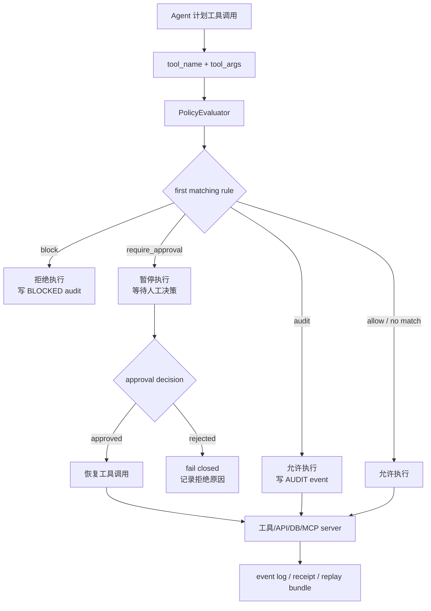

# JamJet 0.11.0 深读：把 Agent 安全边界放回运行时，而不是继续押注提示词

### 元信息与 TL;DR

- **项目**：JamJet，GitHub 仓库 `jamjet-labs/jamjet`
- **本轮窗口证据**：默认分支最新提交 `6ed0b697e59a5e24adb2426c28b9b69cecd7430e`，提交时间为 `2026-06-29T06:00:55Z`，提交标题标记为 `release: jamjet Python SDK 0.11.0 (governance, sessions/memory, Team, deploy, devtools) (#109)`。
- **公开发布状态**：仓库提交已经进入 2026-06-29 UTC 当前周窗口；仓库内 `CHANGELOG.md` 公开条目仍停在 `0.10.2 - 2026-06-12`；PyPI 搜索页显示可见新版本仍为 `0.10.2`。所以本文把它写作“0.11.0 仓库提交/SDK 变更深读”，不把它写成“PyPI 已发布 0.11.0”。
- **类别**：AI 安全 / Agent 运行时安全，也和大模型 Agent 工具调用治理直接相关。
- **原始链接**：[GitHub 仓库](https://github.com/jamjet-labs/jamjet)，[当前提交](https://github.com/jamjet-labs/jamjet/commit/6ed0b697e59a5e24adb2426c28b9b69cecd7430e)，[JamJet 官网](https://jamjet.dev/)，[PyPI jamjet](https://pypi.org/project/jamjet/)。

TL;DR：

- JamJet 的核心主张不是“让模型更听话”，而是把 Agent 的危险动作放到运行时控制面：工具调用先过 policy，再决定 `block`、`require_approval`、`audit` 或 `allow`。
- 这次 2026-06-29 提交的主题集中在 Python SDK 0.11.0：governance、sessions/memory、Team、多 Agent 组合、deploy 和 devtools。代码树中能看到对应模块，而不是只有营销文案。
- 机制上，JamJet 采用 glob first-match policy evaluator；OpenAI Agents SDK guardrail 会在工具执行前产出 `BLOCKED`、`WAITING_FOR_APPROVAL`、`AUDIT` 或 `ALLOWED`，并写入本地 JSONL 审计事件。
- 预算治理分两层：Python cloud SDK 有简单累计 cost 上限；更完整的模型 seam / runtime 测试覆盖 cost budget、token budget、崩溃恢复后的预算延续，以及 Team 中子 Agent 不绕过 budget。
- session/memory 的重点不是“模型记住更多”，而是把用户会话 id、execution id、子 Agent child session 分开，减少多 Agent 并发写同一行 SQLite 导致的记忆污染。
- 证据强的部分：policy block/approval/audit schema、SessionStore 持久化、Team governance 继承、budget 不被 Team 绕过、replay bundle 的 tool input hash 回放，都有源码和测试支撑。
- 证据弱的部分：`evidence/` 目录里的 policy latency、approval resume、runtime overhead、audit export size 还多是待发布 methodology，没有 raw numbers；README 中“regulator review”“milliseconds”等表述需要继续等基准材料。
- 研究意义：它把 Agent 安全从“输出过滤”转成“动作控制”，但真正难点会落在 policy DSL 表达力、跨框架一致性、审计隐私、审批可用性、回放确定性和多租户权限隔离。

### 这篇代码项目真正关心什么问题？

JamJet 回应的是一个越来越明显的 Agent 安全断层：

- LLM Agent 的风险不只在生成文本。
- 风险真正放大时，模型已经能够：
  - 调用 MCP server；
  - 写数据库；
  - 发邮件或 Slack；
  - 触发支付、退款、合并 PR；
  - 读取客户数据；
  - 持续运行数分钟或数小时；
  - 把任务委托给其他 Agent。
- 如果安全边界只放在 prompt 或 system message，运行时仍然可能执行危险动作。

可以把问题形式化成一个动作控制问题：

```text
给定：
  Agent 生成的候选动作 a = (tool_name, tool_args)
  当前策略集合 P
  当前预算状态 B
  当前会话/执行状态 S

目标：
  在动作离开 Agent 进程、触达真实工具之前，
  计算 decision = f(P, B, S, a)

输出：
  block | require_approval | audit | allow
  以及可复查的 audit event / receipt / replay material
```

这个视角和传统安全分类的区别很大：

| 传统做法 | JamJet 试图替换的环节 | 为什么重要 |
|---|---|---|
| 在 prompt 里写“不要删除数据库” | 在 tool call 前执行 policy evaluator | prompt 不是权限系统 |
| 在业务代码里散落 if/else | 一个 policy 文件和多个 adapter 复用 | Agent 框架越来越多，散落逻辑难一致 |
| 事后看日志 | append-only audit / receipt / replay | 事故复盘需要动作级证据 |
| 人工审批写成临时代码 | runtime approval queue / CLI approve | approval 需要可恢复、可审计 |
| 只看总账单 | per-run budget / token budget | Agent loop 可能无限探索或重试 |

JamJet 的研究价值在于：它没有把 Agent 安全简化为“模型拒答”，而是把安全边界移动到“模型准备影响外部世界”的那一刻。

### Scout 候选表与为什么选 JamJet

本轮只做了一个合并 Scout，覆盖三类方向。arXiv API 在 `2026-06-29T00:00:00Z` 到本轮运行时对 Agent、后训练、AI 安全关键词没有返回合适论文，因此 Scout 转向 GitHub/官方更新：

| 排名 | category_id | 候选 | 当前周证据 | 去重/取舍 |
|---:|---|---|---|---|
| 1 | `llm-post-training` | `THUDM/slime` | GitHub pushed 2026-06-29 | 本地历史已有 2026-06-08 深读，丢弃 |
| 2 | `llm-post-training` | `vllm-project/vime` | commit `d16d1dc`，2026-06-29T04:03:05Z | 提交是 45 个冲突文件的 WIP merge，不适合深读 |
| 3 | `ai-safety` | `jamjet-labs/jamjet` | commit `6ed0b697`，2026-06-29T06:00:55Z | 未见本地覆盖；提交主题清楚；代码和测试足够可读 |
| 4 | `llm-post-training` | `radixark/miles` | GitHub pushed 2026-06-29 | 本地 6 月 18 日 Scout 表已作为备选出现，且与 slime 关系太近 |
| 5 | `ai-safety` | `nextlevelbuilder/goclaw` | GitHub pushed 2026-06-29 | OpenClaw/Goclaw 主题在用户历史中较近，先避开 |

选择 JamJet 的原因：

- 它的更新点落在 Agent 安全控制面，不是单纯依赖 benchmark 分数。
- 它和当前 AI 安全趋势一致：安全问题开始从模型输出扩展到工具、权限、审计、部署和组织流程。
- 它有可读源码、测试、示例和 `evidence/` 占位材料，适合做“claim → mechanism → evidence → boundary”的代码项目深读。
- 它没有被本地 `public/articles`/`public/items` 明确覆盖，降低重复风险。

### 作者论证路线：从“同一个策略”到“多个运行入口”

JamJet README 的论证顺序可以概括为四步：

1. **Agent 已经能行动，prompt 不够安全。**
   - README 明确把 database deletes、payments、file writes、budget、audit、replay 放在同一层讨论。
   - 这说明作者关心的是 action safety，而不是单轮聊天安全。

2. **不同 Agent 框架不该各写一套安全逻辑。**
   - README 列出 Claude Code hook、MCP shim、OpenAI guardrail、Python SDK、TypeScript SDK、CLI 等 adapter。
   - 设计目标是“同一个 `policy.yaml`，同一类 audit JSONL”，跨入口复用。

3. **运行时要能中断、审批、恢复。**
   - `require_approval` 不是只返回一个 warning，而是要让动作停在执行前。
   - durable execution、checkpoint、event log、snapshot、replay 都围绕“停住以后还能恢复”服务。

4. **0.11.0 把治理推进到 Python SDK 的 Agent/Team/session 层。**
   - 最新提交主题提到 governance、sessions/memory、Team、deploy、devtools。
   - 代码中可见 `GovernanceConfig`、`SessionStore`、`Team`、`Budget`、`openai_guardrail`、`replay`、`Engram` 等模块。

对应的 claim 表如下：

| Claim | Mechanism | Evidence | Boundary |
|---|---|---|---|
| 策略应在工具执行前生效 | `PolicyEvaluator.evaluate(tool_name)`，first-match glob | `test_block_destructive_tool` 验证 delete 被 block | 当前基础 evaluator 主要按 tool name glob，不理解参数语义 |
| 审批应是动作状态，不是提示词 | `require_approval` 产生 `WAITING_FOR_APPROVAL` 或 runtime approval API | OpenAI guardrail 测试、runtime 0.4.0 changelog | OpenAI guardrail 当前以异常表示 approval，和完整 approval API 仍有版本边界 |
| 审计应跨 adapter 可读 | v1 audit JSONL schema | guardrail 写 `openai-guardrail.jsonl`，测试检查 schema | 本地 JSONL 是 full-fidelity，Cloud-bound redaction 才处理部分敏感参数 |
| 预算不应被 Team 组合绕过 | governance 继承和 per-sub-agent enforcement | `test_team_does_not_bypass_budget_enforcement` | Team 只是 Python orchestration，不是 Rust IR coordinator |
| 会话和记忆要避免并发覆盖 | child session id `team::index-name` | `derive_child_session` 测试 | `SessionStore` v1 是 single writer per session id，仍需调用方序列化同一 session |

### 方法机制一：policy evaluator 是极简的 first-match gate

`sdk/python/jamjet/cloud/policy.py` 的核心逻辑很短：

```text
Input:
  rules = [(action, pattern), ...]
  tool_name

Loop:
  for rule in rules:
    if fnmatch(tool_name, pattern):
      return decision(rule.action, rule.pattern)

Default:
  allow
```

这个实现有三个含义：

- **可预测**：
  - 规则从上到下。
  - 第一个匹配 wins。
  - 后面的规则不能覆盖前面的规则。

- **可移植**：
  - tool name glob 比 AST policy、taint tracking 或 full context policy 更弱。
  - 但它很容易在 Claude Code hook、MCP shim、OpenAI guardrail、Python/TS SDK 中对齐。

- **风险明确**：
  - `database.delete_all_customers` 能被 `*delete*` 拦住。
  - `database.drop_table` 如果没有匹配规则，就可能默认 allow。
  - 参数级风险，比如 `sql="DROP TABLE users"`，不是这个基础 evaluator 单独能解决的。

所以 JamJet 的第一层不是“智能安全推理”，而是“动作名的确定性网关”。这在工程上很实际：先让危险动作不能悄悄穿过，再讨论更复杂的语义策略。

### 方法机制二：OpenAI guardrail 把决策变成异常和审计事件

`sdk/python/jamjet/integrations/openai_guardrail/guardrail.py` 体现了 JamJet 的 adapter 思路。

它接收的输入形态类似：

```text
{
  "toolName": "payments.refund",
  "toolArgs": {"amount": 100}
}
```

然后执行：

1. 解析 policy 路径：
   - 显式 path；
   - `JAMJET_POLICY_FILE`；
   - 当前目录 `policy.yaml`；
   - `~/.jamjet/policy.yaml`。

2. 执行 `PolicyEvaluator.evaluate(toolName)`。

3. 生成决策：

| policy_kind | decision | executed | 行为 |
|---|---|---:|---|
| `block` | `BLOCKED` | false | 抛 `JamjetPolicyBlocked` |
| `require_approval` | `WAITING_FOR_APPROVAL` | false | 抛 `JamjetApprovalRequired` |
| `audit` | `AUDIT` | true | 允许执行并记录 |
| 无匹配或 `allow` | `ALLOWED` | true | 允许执行 |

4. 写入 audit event：
   - adapter：`openai-guardrail`
   - host：`openai-agents-sdk`
   - schema_version：`1`
   - rule_kind、decision、tool、args、trace_id、timestamp 等字段。

5. 如果启用 Cloud Path B，再把经过参数 redaction 的事件推送到 Cloud；本地 JSONL 保留 full-fidelity。

这个设计有一个值得肯定的点：

- 它把“拒绝执行”和“记录证据”放在同一条路径里。
- 如果 block 只发生在业务层异常里，而 audit 是另一个异步日志，事故复盘时很容易出现日志缺口。
- JamJet 至少在 guardrail 测试中确认了 blocked event 的 v1 schema。

但边界也要说清：

- `JamjetApprovalRequired` 当前在 OpenAI guardrail 中还是异常形式。
- 注释里说明后续版本会更完整对接 OpenAI Agents SDK approval API 与 JamJet ApprovalQueue。
- 这意味着“完整 durable approval workflow”和“轻量 guardrail adapter”不是同一个成熟度等级。

### 方法机制三：budget 不是观测指标，而是执行前拒绝

预算治理有两个层次：

| 层次 | 位置 | 能力 | 证据 |
|---|---|---|---|
| 简单 Cloud SDK budget | `sdk/python/jamjet/cloud/budget.py` | 累计 `spent`，`check_or_raise(estimated_cost)` 超限抛错 | 源码直接可读 |
| 模型 seam / runtime budget | `jamjet.model.budget`、state budget 测试、governance parity 测试 | cost/token 双预算，provider 前拒绝，崩溃恢复后预算延续 | 多个 pytest / Rust state tests |

预算的关键不是“最后告诉你花了多少钱”，而是：

```text
Before model/provider call:
  if spent + estimated_cost > limit:
    deny before provider is hit

After successful call:
  record actual cost/tokens
```

测试中有几类重要场景：

- under budget：backend 会被调用。
- at budget：下一次调用在 provider 前被拒绝。
- no budget：预算 middleware 是 no-op。
- token budget 和 cost budget 可以分别触发。
- Team 组合时，budgeted sub-agent 仍然会在第二次超预算调用前失败，且错误被记录到 `TeamResult.per_agent`，不是被 Team 吞掉。

这对 Agent 安全很重要：

- 很多 Agent 风险不是单个工具危险，而是循环探索成本失控。
- “预算”既是财务控制，也是行为控制。
- 对 deep research、代码修复、浏览器 Agent 来说，budget exhaustion 应该是一个可解释的终止状态，而不是一个账单事故。

### 方法机制四：SessionStore 把用户会话和执行 lineage 分开

`sdk/python/jamjet/agents/session.py` 的注释比实现更值得读。它明确区分：

- `session.id`：
  - 用户拥有的稳定 conversation thread。
  - 持久化在 `~/.jamjet/sessions.db`。

- `latest_execution_id`：
  - 引擎内部 execution lineage。
  - 不等同于 session id。

- `messages`：
  - 保存对话线程。
  - system message 不持久保存，每次从当前 agent instructions 重新注入。

这个区分能避免两类常见事故：

| 事故 | 如果混在一起会怎样 | JamJet 的处理 |
|---|---|---|
| 用户长期会话和一次执行 id 混淆 | resume 时找错线程，或者把一次执行当成用户记忆 | session id 与 execution id 分离 |
| 并行子 Agent 写同一个 session | last-writer-wins，丢失某个子 Agent 的 turn | Team child session：`base::index-name` |

`SessionStore` 的边界也很直接：

- v1 是 single writer per session id。
- `save` 是 whole-row `INSERT OR REPLACE`。
- 同一 session id 并发运行会 clobber；调用方应该序列化，或者使用 distinct session ids。

这不是小问题。长期 Agent 的“记忆安全”不只是 RAG 检索质量，还包括：

- 谁可以写记忆；
- 写到哪个 scope；
- 并发时如何合并；
- 旧记忆如何 supersede；
- 恶意工具结果是否会污染后续 session。

JamJet 当前至少把并发边界写进了代码注释和 Team session 派生规则里。

### 方法机制五：Team 是 Python 编排，不是神秘多 Agent runtime

`sdk/python/jamjet/team/team.py` 的开头非常坦诚：Team 是在已经工作的 single-agent path 上做 Python orchestration，不触碰 Rust coordinator / agent_tool / subgraph nodes。

四种模式：

| 模式 | 数据流 | 失败处理 |
|---|---|---|
| `Sequential` | `a -> b -> c` | 上游失败则停止，下游不接收坏输出 |
| `Parallel` | 同一输入 fan-out 到多个 Agent | `asyncio.gather(..., return_exceptions=True)`，子 Agent 失败隔离 |
| `Team` | coordinator 选择一个 specialist | coordinator 输出 specialist 名称或由 Python callable routing |
| `Loop` | 单 Agent 反复运行直到 predicate 满足 | max-iters 防止无限循环 |

更关键的是 governance 继承：

- 子 Agent 有显式 governance 时，Team 不覆盖。
- 子 Agent 是全默认配置时，可以继承 Team governance default。
- 继承不是“只加强”：如果 Team 作者给全默认子 Agent 设置 `pii=False`，那是作者的显式选择。
- 这避免了一个隐蔽绕过：把安全 Agent 放进 Team 后，被 Team 默认配置悄悄弱化。

这个设计保守，但合理。

复杂多 Agent runtime 很容易过早引入：

- 子图调度；
- 跨 Agent state merge；
- 工作窃取；
- centralized coordinator；
- shared memory；
- distributed approval。

JamJet 这次的 Python Team 更像一个 API 层，把治理继承、session namespace、错误隔离先做清楚。这比“看起来很强但安全边界不明”的多 Agent runtime 更适合早期治理框架。

### 方法机制六：replay 用 input hash 匹配工具输出

`sdk/python/jamjet/cloud/replay.py` 的 replay bundle 逻辑如下：

```text
Bundle:
  manifest.json
  events.jsonl
  audit.jsonl
  agents.json

Index:
  (tool_name, sha256(canonical_tool_input)[:16]) -> recorded_tool_output

Replay:
  @tool-decorated function sees active bundle
  if key exists:
    return recorded output
  else:
    fall through to real function
```

它解决的是复现 Agent 行为的一个基本问题：

- Agent 的真实工具调用可能有副作用。
- 事故复盘时，不能再执行一次 `send_email`、`delete_user` 或 `merge_pr`。
- 如果有 recorded tool output，就应该回放记录。

测试覆盖了：

- bundle bytes / directory 加载；
- tool output lookup；
- 同一输入重复记录时 first occurrence wins；
- LLM stub 按顺序返回；
- active bundle lifecycle；
- `@tool` 装饰器在有记录时不调用真实函数。

边界：

- input hash 只匹配完全 canonical input。
- 非确定性工具、时间依赖工具、外部 API 状态变化，都需要更丰富的 recording。
- 如果没有 recording，会 fall through 到真实函数；这对开发很方便，但安全复盘场景可能需要 fail-closed replay mode。

### 代码与目录地图：哪些模块承载安全主张？

| 模块/目录 | 作用 | 本文关注点 |
|---|---|---|
| `sdk/python/jamjet/cloud/policy.py` | glob policy evaluator 和 schema validation | first-match、默认 allow、动作名前置控制 |
| `sdk/python/jamjet/integrations/openai_guardrail/guardrail.py` | OpenAI Agents SDK tool guardrail | block/approval/audit/allow 决策和本地 JSONL |
| `sdk/python/jamjet/agents/governance.py` | Agent governance typed config | budget、approval_required、pii、audit、receipts 默认 |
| `sdk/python/jamjet/agents/session.py` | SQLite session store | session id 和 execution id 分离 |
| `sdk/python/jamjet/team/team.py` | 多 Agent Python 组合 | governance 继承、child session、错误隔离 |
| `sdk/python/jamjet/cloud/replay.py` | replay bundle 和工具回放 | tool input hash、LLM stub、active replay session |
| `runtime/state/tests/research_budget.rs` | runtime state budget 测试 | token/cost budget、snapshot crash recovery |
| `evidence/` | 计划中的性能证据目录 | 当前多为 methodology 待补，不能当作已验证数字 |

### 证据、实验与测试：哪些 claim 有支撑？

JamJet 不是论文，没有 benchmark 表格；因此这里把“证据”理解为源码、测试和可复现示例。

| Claim | 证据类型 | 具体证据 | 强度 |
|---|---|---|---|
| delete 类工具调用可被阻断 | 示例 + 单测 | `examples/01-block-unsafe-tool`，`test_block_destructive_tool` | 强 |
| require approval 会停在执行前 | 单测 | `test_require_approval` 抛 `JamjetApprovalRequired` | 中，guardrail 层为异常表达 |
| audit event 有 v1 schema | 单测 | `test_audit_event_written_v1_schema` 检查 adapter/host/schema/decision | 强 |
| budget 不只是记录，会拒绝 provider 前调用 | 模型 middleware 测试 | `test_at_cost_budget_next_call_denied_backend_not_called` 等 | 强 |
| Team 不绕过子 Agent budget | Team governance 测试 | `test_team_does_not_bypass_budget_enforcement` | 强 |
| session 可跨重启持久化 | SQLite store 测试 | `test_survives_restart` | 强 |
| replay 可拦截工具并返回记录输出 | replay 测试 | `test_tool_decorator_uses_replay_when_bundle_active` | 强 |
| policy decision latency 足够低 | evidence 占位 | `evidence/policy-decision-latency/README.md` 仍待 raw numbers | 弱 |
| approval resume 毫秒级 | evidence 占位 | `approval-resume` 写明 methodology 待发布 | 弱 |

这张表说明一个重要事实：

- JamJet 的功能性 claim 比性能 claim 更扎实。
- 如果你评估它是否适合生产，应该先验证安全语义是否符合你的系统，再自己跑延迟、吞吐、日志体积和审批 SLA。

### Mermaid：一次危险工具调用如何被 JamJet 接住



这个流程里，最值得注意的是：

- policy 位于 tool call 前。
- approval 不是模型输出层面的建议，而是执行状态。
- audit 和 replay 在动作级别收集证据。
- 允许路径也要进入记录系统，否则只记录失败会让审计偏斜。

### 公式解释：为什么 first-match policy 既便宜又有限？

JamJet 的基础 policy evaluator 可近似看成：

```text
P = [(a_1, p_1), (a_2, p_2), ..., (a_n, p_n)]
t = tool_name

decision(t) =
  first a_i where glob_match(p_i, t) == true
  else allow
```

复杂度：

```text
T ≈ O(n * L)
```

变量：

- `n`：规则数量。
- `L`：tool name 与 pattern 的匹配长度。
- `T`：一次 policy decision 的近似成本。

这解释了两个现象：

- 为什么 `evidence/policy-decision-latency` 预期会关注 `N-rule policy` 和 `M tool requests`。
- 为什么这个机制适合做默认 gate，但不适合单独承担高语义安全判断。

一个例子：

| 规则顺序 | 规则 | 工具名 | 结果 |
|---:|---|---|---|
| 1 | `payments.* -> require_approval` | `payments.refund` | 等审批 |
| 2 | `payments.refund -> block` | `payments.refund` | 不会生效，因为第一条已匹配 |

这要求策略作者非常谨慎：

- 把更具体的 rule 放前面；
- 用测试覆盖关键工具；
- 避免“宽 allow”压住后面的 block。

### 与 AI 安全研究的连接：从输出对齐到动作对齐

JamJet 可以放进一个更大的 Agent 安全框架里：

| 层 | 传统研究问题 | JamJet 对应位置 |
|---|---|---|
| 模型输出 | 拒答、jailbreak、harmful content | 不是核心 |
| 工具选择 | 模型是否调用危险工具 | policy evaluator / guardrail |
| 工具参数 | 参数是否包含危险 intent 或 PII | 当前基础 evaluator 较弱，PII/redaction 另有 middleware |
| 执行状态 | 中断、审批、恢复、重试 | runtime approval / event sourcing |
| 长期行为 | 预算、session、memory、Team | governance、SessionStore、Engram、Team |
| 事后复盘 | 审计、receipt、replay | audit JSONL、AgentBoundary receipt、replay bundle |

这提示一个研究方向：

- Agent safety 不能只测“模型是否说了坏话”。
- 还要测“模型准备做坏事时，运行时是否真的拦住了”。
- 更进一步，要测“拦住以后是否留下足够证据，且不会在重启、并发、多 Agent 委托中丢失状态”。

### 失败案例与局限：JamJet 还不能证明什么？

#### 1. 参数级安全仍然是难题

基础 `PolicyEvaluator` 只看 tool name：

- 能拦 `database.delete_all`。
- 不一定能拦 `database.query(sql="DROP TABLE users")`。
- 不一定能判断 `send_email` 的收件人、正文或附件是否违规。

后续需要：

- 参数 schema policy；
- taint tracking；
- data classification；
- SQL/HTTP/file path 级策略；
- 可测试的 deny-by-default 模式。

#### 2. 默认 allow 对安全团队不一定合适

没有匹配规则时返回 allow，这对开发体验友好，但对高风险生产环境可能太宽。

更安全的变体是：

```text
default_action = deny | require_approval | audit | allow
```

当前 README 示例主要强调一份简单 policy 能开始工作；真正企业落地需要默认策略和 policy lint。

#### 3. Evidence 目录还缺 raw numbers

`evidence/` 下几个主题都很关键：

- approval resume recovery；
- audit export size；
- policy decision latency；
- runtime overhead。

但这些 README 目前多写着 methodology 和 reproduction instructions 后续补充，没有可复查 raw data。

因此本文不能声称：

- policy decision 已经达到某个微秒级延迟；
- approval resume 已经公开验证毫秒级；
- runtime overhead 已经和 direct LLM call 做完对比；
- audit retention 成本已有 production benchmark。

#### 4. Replay 的 fail-open/fail-closed 语义需要区分

当前 replay 测试显示：

- 有 recording：返回记录输出，不执行真实函数。
- 没有 recording：fall through 到真实函数。

这对开发调试很方便，但对事故复盘和合规回放可能不够安全。

建议后续显式支持：

| 模式 | 缺 recording 时行为 | 适用场景 |
|---|---|---|
| dev replay | fall through | 本地调试 |
| forensic replay | fail closed | 事故复盘 |
| simulation replay | stub output | 演示和训练 |

#### 5. Team 仍是 Python 层组合

Team 的保守实现是优点，也是边界：

- 优点：不引入还不稳定的 Rust coordinator path。
- 边界：跨进程、跨机器、跨组织的多 Agent 调度还不是这里解决的。
- 对大规模 Agent swarm，仍需要 runtime-level scheduling、tenant isolation、lease、failure recovery 和 policy propagation。

### 和相关项目的关系：它不是 LangChain，也不是 Temporal

JamJet 在定位上更接近“动作控制层”：

| 项目/类别 | 主要解决什么 | JamJet 关系 |
|---|---|---|
| LangChain / CrewAI / ADK | Agent 行为编排 | JamJet 不替代，放在 tool/action 安全边界 |
| OpenAI Agents SDK guardrails | SDK 内 guardrail | JamJet 提供可复用 policy 和 audit schema |
| MCP gateway / shim | 工具协议代理 | JamJet 可作为 policy brain |
| Temporal / DBOS | 通用 durable workflow | JamJet 关注 Agent-native policy、approval、audit、memory |
| LangSmith / Arize / W&B | 观测和评估 | JamJet 更强调执行前 enforcement |
| Engram | durable memory | JamJet README 把 Engram作为 memory layer，JamJet 负责 action/runtime |

这种定位的优点：

- 避免和上层 Agent 框架争夺开发者心智。
- 把高风险点收敛到“动作是否能出去”。
- 让同一 policy 可以跨多个 adapter 复用。

风险：

- 如果 adapter 覆盖不完整，Agent 仍可能绕过 JamJet 直接调用工具。
- 如果团队把 JamJet 当成唯一安全边界，而没有底层 IAM、DB 权限、网络隔离，就会过度信任应用层 gate。

### 对研究者最有价值的几个问题

#### 问题一：Agent action policy 应该如何从 glob 走向语义策略？

可以从三层递进：

1. tool name glob：
   - `payments.*`
   - `*delete*`

2. schema-aware rule：
   - `tool == database.query AND sql contains destructive DDL`
   - `tool == email.send AND recipient domain not allowlisted`

3. context-aware rule：
   - 当前用户角色；
   - 数据敏感级别；
   - 任务来源；
   - 是否来自被污染的 memory；
   - 是否处于 replay/incident mode。

研究难点是让策略可解释、可测试、可迁移，而不是重新变成另一个不可验证的 LLM judge。

#### 问题二：审计日志如何同时满足完整性和隐私？

JamJet guardrail 本地 JSONL 保留 full-fidelity，Cloud-bound copy 可以 redaction。

这引出一个张力：

- 合规复盘希望参数完整。
- 隐私治理希望参数最小化。
- 安全调查希望能证明没被篡改。
- 开发调试希望容易读取。

可能的方向：

- 本地加密 full event；
- Cloud 只存 redacted event；
- hash chain 证明本地事件未删改；
- 按需授权解密；
- 对 PII 字段保留 tokenized reference。

#### 问题三：approval 如何避免变成“点击同意疲劳”？

`require_approval` 很容易从安全机制变成噪音机制。

后续需要研究：

- 哪些 action 必须每次审批；
- 哪些 action 可按 run / session / project 批量授权；
- 哪些 action 应该以 budget 或 rate limit 代替人工审批；
- 审批界面如何展示足够上下文；
- 被拒绝后 Agent 如何安全改写计划。

#### 问题四：Memory 与 policy 如何互相影响？

JamJet 把 Engram 放在 memory layer，SessionStore 管会话线程。

安全问题是：

- 如果 memory 被 prompt injection 污染，policy 是否能识别？
- 如果某个 session 处于 incident 状态，是否应该提高审批等级？
- 子 Agent child session 之间是否能共享某些 memory，但隔离另一些 memory？
- `supersede()` 能否成为安全修复机制，而不是只做事实更新？

### 结论：JamJet 的价值在“动作前置控制”，不是又一个 Agent 框架

JamJet 0.11.0 这次值得关注，是因为它把 Agent 安全的讨论拉回了运行时：

- 工具调用要先被 policy gate 看见。
- 高风险动作要能暂停审批。
- 预算要能在 provider 前拒绝。
- session 和 execution lineage 要分开。
- Team 组合不能绕过子 Agent governance。
- 审计和 replay 要围绕动作级证据建立。

最强的部分：

- 源码和测试能支撑基础 action-control 语义。
- Python SDK 层把 governance、session、Team、replay 串起来了。
- 它承认自己是 safety layer，不试图替代 Agent framework。

最需要继续验证的部分：

- 性能 evidence 还没有 raw numbers。
- 参数级和上下文级 policy 仍然薄。
- OpenAI guardrail 的 approval 和 runtime durable approval 成熟度不同。
- replay 的缺 recording 语义要在合规模式下更严格。
- 真正跨 MCP、Claude Code、OpenAI、TS/Python SDK 的 policy conformance 需要持续测试矩阵。

如果把 Agent 安全看成一个公式，JamJet 把问题从：

```text
safe_agent = aligned_model(prompt)
```

改写为：

```text
safe_agent_run =
  aligned_model
  + runtime_policy(tool_call)
  + approval_state
  + budget_state
  + session_memory_scope
  + audit_replay_evidence
```

这个改写很重要。未来 Agent 事故大概率不会只发生在“模型说错话”，而会发生在“模型把一个动作送出了进程”。JamJet 的贡献是把这个动作边界变成了一等公民。它还不是完整答案，但它把问题放在了更正确的位置。

### 继续追问：如果把 JamJet 当成研究基线，下一步该怎么测？

把 JamJet 放进研究基线时，不能只跑“能不能拦 delete”这种单点示例。更有价值的是设计一组动作级安全任务，让不同 Agent 框架在同一批工具、同一份 policy、同一组攻击轨迹下接受测试：

- **正常任务完成率**：
  - benign 工具调用不能被过度阻断；
  - 审批和预算不能让普通工作流无意义中断；
  - replay 不应改变无副作用工具的输出语义。

- **危险动作阻断率**：
  - 显式危险工具名；
  - 伪装成正常工具名的危险参数；
  - 通过 MCP server 暴露的间接危险能力；
  - 多 Agent 委托链里由下游 specialist 发出的危险动作。

- **证据完整性**：
  - 每个 denied action 是否都有可定位的 rule、tool、args 摘要和 trace id；
  - 人工审批是否记录 approver、node_id、decision 和 comment；
  - replay bundle 是否能在不重放副作用的情况下还原关键行为。

- **恢复与并发**：
  - approval pending 时进程崩溃能否恢复；
  - 同一 Team 下并行 sub-agent 是否写入独立 child session；
  - budget state 是否在 snapshot 之后继续累积，而不是重启后清零。

一个严谨评测可以写成矩阵：

| 维度 | 低风险样本 | 高风险样本 | 期望行为 |
|---|---|---|---|
| tool name | `database.read_orders` | `database.delete_all` | 前者 allow，后者 block |
| tool args | `sql=SELECT ...` | `sql=DROP TABLE ...` | 需要参数级 policy，否则暴露缺口 |
| approval | `report.generate` | `payments.refund` | refund 进入 waiting state |
| budget | 一次短调用 | 多轮循环调用 | 超限前 provider 不再被命中 |
| replay | 纯函数工具 | 副作用工具 | 副作用工具必须使用记录输出 |

这样的评测会比单纯看 README 更接近真实 Agent 安全。JamJet 当前提供了一个很好的工程载体：有 policy、guardrail、budget、session、Team、replay 和 audit，但正因为这些部件已经出现，下一步就应该用系统化 adversarial workload 去压它，而不是只把它当作一个新的 SDK。
