# GraphGuard 深读：把 LangGraph Agent 安全审计做成一个可跑的本地 LLM 流水线

## 元信息与 TL;DR

- **项目**：GraphGuard
- **定位**：面向 LangGraph agent pipeline 的安全 linter。
- **来源**：<https://github.com/RodriguezRepetto/graphguard>
- **本轮新鲜度证据**：
  - GitHub repository `created_at=2026-06-28T22:47:11Z`。
  - GitHub repository `pushed_at=2026-06-29T00:27:08Z`。
  - 最新 commit `0f9ae7cbe9bc10eaf37c50c92b12fb4dc16077e5` 的作者与提交时间均为 `2026-06-29T00:26:28Z`。
- **本地核验**：在候选仓库运行 `uv run --with pytest --with langgraph --with rich --with typer --with httpx --with pydantic pytest graphguard/tests -q`，结果为 `37 passed in 0.02s`。
- **文章类型**：代码项目深读。

### TL;DR

- GraphGuard 试图回答一个很具体的问题：当 LangGraph agent 从 demo 走向部署，如何在上线前发现 prompt injection、工具误用、共享状态泄漏、权限提升、节点间未校验传递、记忆污染和供应链风险。
- 它没有把安全规则全部写死在传统静态分析器里，而是先用 Python `ast` 把目标 agent 的函数、类、import、调用、赋值和长字符串提取成结构化摘要，再交给本地 llama-server 上的 Qwen 模型按 OWASP ASI schema 输出 JSON findings。
- 它自身也是一个四节点 LangGraph：`parser_node -> analyzer_node -> scorer_node -> reporter_node`。这个设计的价值是把 agent 安全审计拆成可测试的 pipeline，而不是一次性 prompt。
- 2026-06-29 的最新 commit 不只是 README 小修；它把 CLI 入口迁到 `graphguard/cli.py`，修复 `pyproject.toml` entry point，让 `--model` 真正路由到 fast/reasoning 两套本地模型端口，并补了缺失路径、非 UTF-8 文件、LLM JSON 解析、dedupe、format 参数等失败边界。
- 项目覆盖 7 个 OWASP ASI 风险向量：ASI01、ASI02、ASI03、ASI05、ASI06、ASI07、ASI08；测试用 vulnerable agent 明确放入 prompt injection、SQL tool misuse、state leakage、privilege escalation、inter-node validation、memory poisoning 和示意性供应链风险。
- 关键数字是：仓库约 1687 行；最新 commit 改动 13 个文件，`513 insertions / 202 deletions`；测试从 23 个扩到 37 个；本地核验 37 个单元测试通过。
- 主要局限同样明确：多数 `graphguard/analyzers/*.py` 规则文件仍是空壳，实际判断依赖 LLM prompt；AST 摘要会截断到约 12000 字符；供应链 CVE 表在代码里标注为 illustrative，需要查 NVD 后才能用于生产合规；没有真实 benchmark、误报率、漏报率或跨项目评测。
- 最值得带走的研究意义不是“又一个安全工具”，而是一个早期范式：把 agent 安全审计从运行时拦截前移到代码结构层，并把 LLM 作为可替换的审计节点嵌入 CI/CD。

## 这篇项目真正关心什么？

### 问题一：Agent 安全为什么不能只靠运行时护栏？

- 传统 LLM 安全常把注意力放在推理时：
  - prompt 是否被注入。
  - 输出是否违规。
  - 工具调用是否危险。
  - 记忆是否被污染。
- LangGraph 这类 agent framework 把风险进一步结构化：
  - 状态在多个 node 之间流动。
  - tool 可能被任意 node 调用。
  - checkpointer 会把状态写入长期记忆。
  - graph edge 决定未验证数据如何进入下一步。
- 因此，运行时检测只能看到一次执行路径；代码层静态审计能先看见“可能的执行面”。

### 问题二：为什么选择 LangGraph 作为对象？

- LangGraph 的优势是把 agent 变成显式图：
  - node 是函数。
  - state 是 TypedDict 或 Pydantic model。
  - edge 是控制流。
  - checkpointer 是状态持久化边界。
- 这些对象天然适合被 AST parser 提取：
  - `StateGraph(...)`
  - `graph.add_node(...)`
  - `graph.add_edge(...)`
  - `graph.compile(checkpointer=...)`
  - 工具函数和危险调用。
- GraphGuard 的判断是：如果 agent runtime 已经图结构化，安全审计也应该图结构化。

## 作者的论证路线

### 从 README 到代码，论证可以拆成四步

| 环节 | 项目主张 | 代码证据 | 它在论证中的作用 |
|---|---|---|---|
| 入口 | 开发者用 CLI 扫描 agent 目录 | `graphguard scan ./my_agent/`、Typer CLI | 把安全审计降成一个可放进 CI 的动作 |
| 解析 | 不直接把源码全文塞给模型 | `parser_node` 使用 `ast` 提取函数、类、调用、赋值、字符串 | 降低噪声，让 LLM 看结构而不是完整文本 |
| 审计 | 用本地 LLM 对 AST 摘要做安全判断 | `SYSTEM_PROMPT` 要求返回 JSON findings | 把安全经验编码成 schema 和向量列表 |
| 报告 | 对 findings 做校验、去重、排序和输出 | `scorer_node`、`reporter_node` | 把 LLM 输出变成工程上可消费的结果 |

### 它不是“纯规则扫描器”

- 代码中 `graphguard/analyzers/prompt_injection.py`、`tool_misuse.py`、`state_leakage.py` 等文件目前为空。
- 真实审计路径集中在 `graphguard/nodes/analyzer.py`：
  - 构造 system prompt。
  - 把 AST 摘要序列化成 JSON。
  - 调 llama-server 的 OpenAI-compatible endpoint。
  - 解析模型返回的 JSON 数组。
- 这意味着 GraphGuard 当前更像“LLM-driven static analysis harness”，而不是 Semgrep 风格的成熟规则库。

## 方法机制：四节点流水线如何工作？

### 总体数据流

```mermaid
flowchart LR
  A["target_path: LangGraph agent source"] --> B["parser_node"]
  B --> C["parsed_ast: functions/classes/imports/calls/assignments/strings"]
  C --> D["analyzer_node: local LLM audit"]
  D --> E["findings: OWASP ASI JSON"]
  E --> F["scorer_node: validate/deduplicate/sort"]
  F --> G["reporter_node: Rich table + JSON report"]
  G --> H["CI/CD output or saved report.json"]
```



### parser_node：先把源码变成可审计结构

- `collect_python_files(target_path)` 的策略很保守：
  - 如果目标是单个 `.py` 文件，直接返回。
  - 如果目标是目录，递归收集 `.py` 文件。
  - 跳过以 `.` 开头的目录和 `__pycache__`。
- `parse_file(filepath)` 抽取的字段包括：
  - `functions`：函数名、行号、参数、decorator。
  - `classes`：类名、行号、基类。
  - `imports`：import 语句。
  - `calls`：函数调用表达式和行号。
  - `assignments`：赋值目标、右值、行号。
  - `strings`：长度超过 20 的字符串常量，截断到 200 字符。
- 最新 commit 加强的失败边界：
  - 非 UTF-8 文件返回 error dict。
  - `PermissionError` 返回 error dict。
  - 不存在的 target path 会设置 `state["error"]`，CLI 再以 exit 1 暴露给用户。

### analyzer_node：把 OWASP ASI 向量写入 prompt

GraphGuard 的 system prompt 明确要求模型查 7 类风险：

| OWASP ASI | 风险 | 在 LangGraph 中的典型形态 |
|---|---|---|
| ASI01 | Prompt Injection | 用户输入未经清洗直接进入 LLM prompt |
| ASI02 | Tool Misuse | tool 接收未校验或原始输入 |
| ASI03 | State Leakage | token、password、key 等敏感字段进入共享 state |
| ASI05 | Supply Chain | LangGraph/LangChain 依赖版本存在已知风险 |
| ASI06 | Privilege Escalation | 高权限工具缺少授权检查 |
| ASI07 | Inter-Node Validation | 原始 LLM 输出直接传给下一节点或工具 |
| ASI08 | Memory Poisoning | checkpointer 持久化未验证状态，污染后续执行 |

### 本地模型选择：fast 与 reasoning

- 最新 commit 把模型端点从单一常量扩成 `LLAMA_ENDPOINTS`：
  - `fast`：`http://127.0.0.1:8080/v1/chat/completions`，模型名 `qwen3.5-9b`。
  - `reasoning`：`http://127.0.0.1:8081/v1/chat/completions`，模型名 `qwen3.5-35b-a3b`。
- CLI 的 `--model` 选项会写入 `GraphGuardState["model"]`。
- analyzer 根据 state 选择 endpoint。
- 这说明项目把“审计深度”做成配置，而不是硬编码模型。

### 公式化看它的审计过程

```text
Input:
  S = 目标 agent 源码集合
  V = {ASI01, ASI02, ASI03, ASI05, ASI06, ASI07, ASI08}
  M = 本地 LLM 审计模型

Parser:
  A = AST_extract(S)

Analyzer:
  R_raw = M(prompt(V, A))

Scorer:
  R_valid = validate_schema(R_raw)
  R_unique = deduplicate(R_valid, key=(file, owasp_id, title))
  R_sorted = sort_by_severity(R_unique)

Output:
  report = {summary, findings, remediation}
```

变量解释：

- `S` 不是完整运行轨迹，而是源码文件集合。
- `A` 是 AST 摘要，不包含完整源码上下文。
- `V` 是安全问题空间，由 prompt 固定。
- `M` 是可替换的本地模型。
- `R_raw` 是不可信 LLM 输出，因此必须经过 parser 和 scorer。
- `R_sorted` 才是 CI 或开发者应读取的结果。

## 最新 commit 为什么重要？

### 它修的是“能不能作为工具使用”的问题

最新 commit 标题是 `fix: pre-publication audit fixes + expand test suite to 37 tests`。从 commit message 和 diff 看，重点不是功能扩展，而是把原型拉到可运行边界：

| 修复编号 | 问题 | 修改意义 |
|---|---|---|
| F1 | `parse_llm_response` 因缩进 bug 总是返回空列表 | 没有这个修复，核心审计结果会被吞掉 |
| S5 | `main.py` 移到 `graphguard/cli.py`，修 `pyproject.toml` entry point | 让安装后的 `graphguard` 命令真正可用 |
| F2 | `--model` flag 可用 | fast/reasoning 模型选择不再只是 CLI 装饰 |
| F3 | 不存在 target path 返回错误 | 避免扫描空目录后误报“无问题” |
| F4 | 处理 `UnicodeDecodeError` 和 `PermissionError` | 让真实仓库中的异常文件不会打断扫描 |
| F5 | dedupe key 改为 `(file, owasp_id, title)` | 避免多个 `line=None` finding 被错误合并 |
| F6 | `parse_version` 始终返回三元组 | 版本比较不会因 `1.2` vs `1.2.0` 出错 |
| F8 | 校验 `--format` | 防止用户传错格式却继续运行 |
| F9 | `--format text --output` 时提醒实际写 JSON | 明确 Rich console 不能直接保存的边界 |

### 测试从“有例子”变成“覆盖失败边界”

- 本地核验结果：`37 passed in 0.02s`。
- 测试覆盖点包括：
  - semver 解析。
  - 两段版本与三段版本比较。
  - Qwen3 `<think>...</think>` 包裹剥离。
  - Markdown fenced JSON 剥离。
  - invalid JSON 返回空列表。
  - malformed finding 被跳过。
  - unknown OWASP ID 被拒绝。
  - line 为 `None` 时不同 title 不碰撞。
  - 不存在路径返回 error。
  - 非 UTF-8 文件返回 error。
- 这些测试不证明 LLM 审计质量，但证明“审计流水线周边不轻易崩掉”。

## vulnerable_agent：作者如何构造证据？

### 测试 agent 有意放入七类风险

`tests/vulnerable_agent/agent.py` 是一个故意不安全的 LangGraph agent。它不是 benchmark，但能说明 GraphGuard 希望识别什么。

| 风险 | 代码形态 | 安全含义 |
|---|---|---|
| ASI01 | `prompt = f"Answer the following: {state['user_input']}"` | 用户输入直接进入 prompt，注入面明确 |
| ASI02 | `execute_sql(query)` 接受原始字符串 | SQL tool 缺少参数化、schema 校验或 allowlist |
| ASI03 | `AgentState` 包含 `user_token`、`db_password` | 敏感字段被所有 node 共享 |
| ASI05 | 示例 `REQUIREMENTS` pin 到旧版本 | 供应链风险作为状态外依赖出现 |
| ASI06 | `delete_all_records(table)` 无授权检查 | 高危工具没有 scope 或 policy gate |
| ASI07 | `llm_output` 直接进入 SQL executor | 节点间缺少验证和转换层 |
| ASI08 | `graph.compile(checkpointer=memory)` 持久化未验证状态 | 攻击者可污染未来执行上下文 |

### 为什么这个例子对 Agent 安全有意义？

- 它把“模型安全问题”拆成 agent 系统问题：
  - prompt injection 不只是 prompt 字符串问题。
  - tool misuse 不只是 SQL injection 问题。
  - state leakage 不只是 secret 管理问题。
  - memory poisoning 不只是 retrieval 问题。
- 在 agent graph 中，这些风险彼此串联：
  - 原始输入进入 LLM。
  - LLM 输出进入 SQL。
  - SQL 结果进入 response。
  - 全程共享 state 暴露 token/password。
  - checkpoint 又把中间状态存下来。
- 所以 GraphGuard 的一个重要判断是：agent 安全审计必须检查“数据流穿过节点的方式”。

## 与近期 Agent 安全工作的差异

### 它和 runtime enforcement 的不同

- VIGIL、policy gate、permission runtime 这类工作通常关心：
  - 执行时是否允许某个工具调用。
  - policy 是否能拦截危险 action。
  - agent 是否被限制在某个 sandbox。
- GraphGuard 关心的是更早一步：
  - 代码里有没有把危险工具暴露给任意 node。
  - 状态结构是否把 secret 放进共享 dict。
  - 边是否跳过了 validation node。
  - checkpointer 是否持久化未经验证的字段。

### 它和 prompt-injection 防御的不同

- prompt-injection 防御常看一次输入输出。
- GraphGuard 看的是 pipeline 结构：
  - 输入如何变成 prompt。
  - prompt 结果如何变成 tool input。
  - tool output 如何回到 state。
  - state 如何跨节点、跨会话保存。
- 这让它更接近“agent architecture review”，而不是单轮 LLM classifier。

## 伪代码：如何把它接入 CI？

```text
Input:
  repo_path
  model_mode in {"fast", "reasoning"}
  strict = true

State:
  source_files = []
  parsed_ast = {}
  findings = []
  report = {}

Algorithm:
  1. run graphguard check
     if llama-server unreachable:
       fail with setup error

  2. run graphguard scan repo_path --model model_mode --format json --output report.json --strict

  3. if report.summary.critical + report.summary.high > 0:
       block merge
       attach report.json to CI artifact
     else:
       allow merge

Failure boundary:
  - no local model means no scan
  - malformed LLM JSON becomes zero findings for that response
  - AST truncation may hide long-file context
  - illustrative CVE table cannot be treated as compliance evidence
```

这个 CI 伪代码暴露出 GraphGuard 的核心工程取舍：

- 它偏向本地、离线、可重复的审计。
- 它把 high/critical findings 转成 exit code。
- 它不解决“模型是否真的懂安全”的根问题，只把审计过程包装成可运行、可测试、可替换的节点。

## 结果与证据边界

### 已经有证据的部分

- GitHub 时间证据满足本周窗口：
  - repository created on 2026-06-28 UTC。
  - latest push on 2026-06-29 UTC。
  - latest commit on 2026-06-29 UTC。
- 代码结构可复核：
  - `graphguard/graph.py` 定义四节点 pipeline。
  - `graphguard/nodes/parser.py` 使用 `ast` 提取结构。
  - `graphguard/nodes/analyzer.py` 定义 OWASP ASI prompt 和本地模型调用。
  - `graphguard/nodes/scorer.py` 校验、去重、按 severity 排序。
  - `graphguard/nodes/reporter.py` 生成 JSON report 和 Rich console output。
- 本地测试可复核：
  - 37 个测试通过。
  - 测试集中在 parser、LLM response parser、版本比较、dedupe、scorer。

### 仍然没有证据的部分

- 没有跨项目 benchmark：
  - 没有给出真实 LangGraph agent corpus。
  - 没有 false positive / false negative 统计。
  - 没有和 Semgrep、CodeQL、自定义规则或人工审计对比。
- 没有 LLM 审计质量评估：
  - 没有 fast vs reasoning 的准确率差异。
  - 没有不同模型的稳定性实验。
  - 没有温度、上下文长度、AST 截断对结果的影响分析。
- 供应链模块需要谨慎：
  - 代码明确提示 CVE identifiers 是 illustrative examples。
  - 生产使用前必须查 NVD 或官方 advisories。
  - 当前 `check_supply_chain()` 检查的是本环境安装包版本，而不是直接解析目标项目依赖文件；这和 README 中“reads dependency files”的表述存在实现差距。

## 失败案例与风险推演

### 失败一：AST 摘要不等于数据流分析

- `ast.walk` 能列出 call、assignment、string。
- 但它不自动理解：
  - 哪个变量来自用户。
  - 哪个 node 在 graph 中先执行。
  - edge 条件如何分支。
  - tool 权限来自哪个 policy。
- LLM 可以根据模式推断，但这不是形式化 taint analysis。
- 因此，GraphGuard 更适合发现明显结构风险，不适合证明 agent 安全。

### 失败二：LLM JSON 解析失败会降低召回

- `parse_llm_response` 已处理：
  - Qwen `<think>` 包裹。
  - Markdown code fence。
  - 文本中夹杂 JSON array。
- 如果模型输出仍无法解析，函数返回空列表。
- 这保证 pipeline 不崩，但可能把“模型说了风险”变成“没有 finding”。
- 对 CI 来说，这种失败应该被单独计数，而不是静默视为安全。

### 失败三：dedupe key 不含 line 后有利有弊

- 最新 commit 把 dedupe key 改成 `(file, owasp_id, title)`。
- 好处：
  - line 为 `None` 时，不同 title 不会互相覆盖。
- 风险：
  - 同一文件中相同标题的多个真实位置可能被合并。
  - LLM 如果标题生成不稳定，重复 issue 可能无法合并。
- 更稳的路线可能是：
  - 用 `(file, owasp_id, normalized_title, evidence_span)`。
  - 或让 analyzer 输出 source slice / call expression 作为证据键。

## 如果继续研究，应该怎么补实验？

### 最小可行 benchmark

| 实验 | 目标 | 指标 |
|---|---|---|
| Synthetic LangGraph suite | 每个 ASI 向量构造 10 个正例、10 个负例 | recall、precision、per-vector F1 |
| Real-world repo smoke test | 扫描公开 LangGraph examples | 人工确认误报率 |
| Model comparison | fast vs reasoning vs 其他本地模型 | finding 稳定性、JSON parse 成功率 |
| Truncation study | 改变 AST 摘要长度上限 | 漏报变化、成本变化 |
| CI latency | 统计不同 repo 规模耗时 | P50/P95 runtime、失败原因 |

### 更强的实现路线

- parser 层增加 graph-specific extraction：
  - 明确提取 `add_node`、`add_edge`、`compile(checkpointer=...)`。
  - 构建 node-level dataflow graph。
  - 标记 source、sink、validator、privileged tool。
- analyzer 层减少 prompt 负担：
  - 对 ASI01/ASI02/ASI07 先做 lightweight taint hints。
  - 对 ASI03 提取 state schema 中 secret-like fields。
  - 对 ASI08 识别 checkpointer 和 persisted fields。
- reporter 层增加证据：
  - 输出 source snippet。
  - 输出 graph path，例如 `query_handler -> sql_executor`。
  - 输出置信度和需要人工确认的字段。

## 领域延伸：Agent 安全审计可能走向哪里？

## 逐模块代码细读：哪些设计值得保留，哪些设计还需要收紧？

### parser 的价值：把“源码文本”压成“安全审计摘要”

- `parser_node` 不是完整的程序分析器，但它做了一个实用选择：先把安全审计所需的结构字段固定下来。
- 这种摘要的好处有三点：
  - **节省上下文**：LLM 不必读取所有注释、空行、业务文本和无关实现。
  - **降低漂移**：模型每次看到的字段名一致，输出更容易稳定。
  - **方便回放**：如果某次 finding 可疑，开发者可以保存 parsed AST，复现同一轮审计输入。
- 但它的不足也很明显：
  - `ast.unparse(node)` 只保留语法表达式，不保留变量真实来源。
  - 字符串只截断到 200 字符，长 prompt template 的后半段可能丢失。
  - 没有显式区分 source、sink、validator、policy gate。
- 如果把它放到更成熟的研究路线里，parser 应该继续向“agent graph extractor”演进：
  - 提取每个 node 的输入字段和输出字段。
  - 提取每条 edge 的起点、终点和条件。
  - 提取 tool 函数中的外部副作用，例如文件、网络、数据库、shell。
  - 提取 checkpointer、memory store、vector store 等持久化边界。

### analyzer 的价值：把安全知识变成可替换的 prompt contract

- `SYSTEM_PROMPT` 的重要性不在措辞，而在它把 finding schema 写死：
  - `owasp_id`
  - `title`
  - `description`
  - `severity`
  - `file`
  - `line`
  - `remediation`
- 这让模型输出可以被后续节点处理，而不是停留在自然语言建议。
- 这个 contract 对 agent 安全很关键：
  - 没有 `owasp_id`，结果无法按风险类别聚合。
  - 没有 `severity`，CI 无法决定是否阻断。
  - 没有 `file` 和 `line`，开发者无法修复。
  - 没有 `remediation`，审计结果只能提醒，不能推动修改。
- 但 prompt contract 也有脆弱点：
  - 模型可能编造行号。
  - 模型可能把相似风险归到错误 ASI 类别。
  - 模型可能给出过度保守的 severity。
  - 模型可能因为 AST 截断漏掉关键 edge。
- 因此，GraphGuard 下一步不应只换更大模型，而应让 parser 给 analyzer 更多结构化证据。

### scorer 的价值：承认 LLM 输出不可信

- `scorer_node` 的设计态度是正确的：LLM 输出不是最终事实，只是候选 finding。
- 它至少做了三层过滤：
  - `validate_finding` 拒绝未知 OWASP ID。
  - `validate_finding` 拒绝过短 description。
  - `deduplicate` 合并同一文件、同一 ASI、同一标题的重复 finding。
- 这层处理对 CI 尤其重要：
  - 如果模型输出 `ASI99`，不能让报告产生不存在的标准项。
  - 如果模型输出空标题，不能让开发者面对不可操作的 issue。
  - 如果模型对同一问题反复输出多条，不能让 severity summary 失真。
- 但 scorer 还可以更强：
  - 增加 confidence 字段。
  - 增加 evidence 字段，记录触发 finding 的 call 或 assignment。
  - 增加 `needs_human_review`，区分确定风险和推断风险。
  - 增加 per-vector policy，例如 ASI06 高权限工具默认至少 high，ASI05 示意 CVE 默认需要人工确认。

### reporter 的价值：让审计结果同时服务人和机器

- `reporter_node` 同时输出 Rich console 和 JSON report。
- 这是一种合适的双通道设计：
  - 人看终端表格，快速知道 critical/high 数量。
  - 机器读 JSON，决定 CI 是否失败。
  - 安全团队可以归档 JSON，比较不同 commit 的风险变化。
- 但报告目前缺少两个生产字段：
  - **scan_context**：模型、时间、目标路径、代码 commit、AST 截断上限。
  - **evidence_context**：source snippet、graph path、相关 state field、相关 tool。
- 没有这些字段，报告很难支持审计追溯：
  - 同一代码用不同模型可能得到不同结果。
  - 同一 finding 的行号可能变化。
  - 开发者不知道是哪个 graph path 把风险连起来。
- 所以，报告层未来应从“漏洞列表”升级为“agent 风险路径列表”。

## 从安全研究角度看，它把哪些概念重新摆在一起？

### 概念一：Prompt injection 不是输入过滤问题，而是数据流问题

- 在 vulnerable agent 中，风险链条不是单点：
  - `user_input` 进入 prompt。
  - `llm_output` 被返回到共享 state。
  - `sql_executor_node` 读取 `llm_output`。
  - `execute_sql` 执行由上游生成的 query。
- 如果只在第一步做 prompt filter，仍然可能漏掉后续工具边界。
- 更好的判断方式是：
  - 找 source：用户输入、网页内容、邮件正文、retrieval chunk。
  - 找 transform：LLM prompt、parser、validator、policy node。
  - 找 sink：SQL、shell、filesystem、network、payment、deployment。
  - 检查 source 到 sink 中间是否存在可信验证层。

### 概念二：Agent state 是新的攻击面

- 许多 LLM 应用把 state 当作方便传参的 dict。
- LangGraph 让 state 更显式，也让风险更显式。
- 如果 state 中包含 `user_token`、`db_password`、`api_key`：
  - 每个 node 都可能读取它。
  - LLM 生成的中间文本可能引用它。
  - reporter、logger、checkpoint 可能把它写出。
- GraphGuard 把 ASI03 放入核心向量，是一个正确选择。
- 更严格的未来版本应该支持 state minimization 检查：
  - 每个 node 只声明需要读取的字段。
  - 敏感字段默认不可进入 prompt。
  - 输出字段必须经过 schema filter。

### 概念三：Memory poisoning 是 graph-level 风险

- 记忆污染不只是 RAG 文档被污染。
- 在 LangGraph 中，checkpointer 会保存执行状态。
- 如果 `llm_output`、tool result、用户输入或未校验计划被写进 checkpoint：
  - 后续会话可能继承被污染的状态。
  - agent 可能把历史错误当作可信上下文。
  - 攻击不需要每次重新注入。
- GraphGuard 的 ASI08 示例抓住了这个问题：
  - `MemorySaver()` 本身不是漏洞。
  - 漏洞在于持久化边界前没有验证、过滤、分区或过期策略。
- 这类风险很适合静态审计先做提醒，因为运行时只有在污染发生后才看得到后果。

### 概念四：供应链安全不能只看 package version

- GraphGuard 的 supply-chain 模块目前检查安装环境中的包版本，并用内置 `KNOWN_CVES` 表判断。
- 这个设计可以作为 demo，但生产上至少有四个缺口：
  - 目标项目依赖文件和当前扫描环境可能不一致。
  - CVE 数据需要官方来源更新。
  - package extra、lockfile、transitive dependency 需要解析。
  - agent 风险还取决于依赖是否出现在危险执行路径上。
- 更好的实现应当结合：
  - `pyproject.toml` / `requirements.txt` / lockfile 解析。
  - OSV 或 GitHub Advisory 数据。
  - dependency reachability。
  - agent graph 中工具和 checkpoint 的使用路径。

## 对 GraphGuard 的审稿式判断

### 已经做对的部分

- **问题切得窄**：只盯 LangGraph agent pipeline，而不是泛泛做“AI 安全扫描器”。
- **接口可落地**：`graphguard scan`、`--format json`、`--strict` 都是 CI 需要的形状。
- **本地优先**：通过 llama-server 使用本地模型，避免把待审计源码送到外部服务。
- **失败边界被测试**：最新 commit 补了 JSON 解析、路径不存在、编码异常、版本比较、dedupe 等边界。
- **风险分类有标准锚点**：用 OWASP ASI ID 组织 finding，比自定义标签更容易交流。

### 目前最需要谨慎的部分

- **不要过度相信 finding**：它们是 LLM 对 AST 摘要的推断，不是形式化证明。
- **不要把空结果当安全证明**：LLM 连接失败、JSON 解析失败、AST 截断都可能导致漏报。
- **不要把示意 CVE 当真实合规证据**：作者已在代码里提示需要查 NVD。
- **不要忽略空规则文件**：项目名叫 linter，但当前核心不是传统 rule engine。
- **不要忽略目标生态限制**：它围绕 Python/LangGraph 写，不能自然泛化到其他 agent framework。

### 如果我是维护者，会优先做的三件事

1. **把 AST 摘要升级为 graph IR**：
   - 显式表示 nodes、edges、state fields、tools、checkpointers。
   - 让 LLM 审计的是 agent graph IR，而不是分散的文件 AST。
2. **给每条 finding 加 evidence path**：
   - 例如 `user_input -> query_handler.prompt -> llm_output -> sql_executor_node -> execute_sql`。
   - 这会显著降低修复成本，也能减少“模型凭感觉”的质疑。
3. **建立小型 gold set**：
   - 每个 ASI 向量至少 20 个例子。
   - 同时包含安全写法和危险写法。
   - 用固定模型、固定 prompt、固定 AST 上限跑回归。

这些改进不会改变 GraphGuard 的路线，反而会强化它的核心判断：agent 安全审计必须把源码结构、图结构、模型判断和工程报告放到一条流水线上。

### 静态审计会成为 agent 发布流程的一环

- Agent 应用越来越像小型分布式系统：
  - 有状态。
  - 有工具。
  - 有权限。
  - 有外部 IO。
  - 有长期记忆。
- 因此，未来 agent 安全不应只问“模型会不会拒答”，还要问：
  - graph 是否把危险路径接通。
  - state 是否最小化。
  - tool 是否有 scope。
  - memory 是否有写入校验。
  - 人类授权是否绑定到具体 action。

### LLM-driven static analysis 的价值在“解释”，不在“证明”

- 传统静态分析擅长：
  - 可证明的 pattern。
  - 稳定的 AST rule。
  - 低误报的已知 sink/source。
- LLM 擅长：
  - 解释为什么一个组合危险。
  - 把多个弱信号串成 attack path。
  - 给出可读 remediation。
- GraphGuard 的早期版本把两者接起来，但还没有完成强规则层。
- 更合理的目标可能是 hybrid：
  - 规则给证据。
  - LLM 做归纳和修复建议。
  - scorer 做 schema、dedupe 和 severity 稳定化。

### 对 AI 安全研究者的启发

- 如果把 agent 当作“模型 + 工具”的集合，很多风险会被低估。
- 如果把 agent 当作“图上的数据流系统”，就能看到新的安全对象：
  - node。
  - edge。
  - state field。
  - checkpoint。
  - tool capability。
  - human approval boundary。
- GraphGuard 的价值正在这里：它把 OWASP ASI 风险映射到 LangGraph 的工程结构。
- 它还不成熟，但方向清楚：
  - 安全审计应该靠近 agent graph。
  - 审计结果应该是结构化 JSON。
  - 本地模型可以参与代码安全 review。
  - CI/CD 应该能把高危 finding 转成阻断信号。

## 结论与局限

- GraphGuard 是一个早期但方向明确的 LangGraph agent 安全 linter。
- 它的强项：
  - 架构清楚。
  - CLI 可用。
  - 本地模型路线明确。
  - OWASP ASI schema 清晰。
  - 最新 commit 修复了大量工程失败边界。
  - 37 个测试通过，覆盖了许多周边可靠性问题。
- 它的弱项：
  - 核心安全判断仍高度依赖 LLM。
  - 规则 analyzers 多数为空。
  - 没有真实 benchmark。
  - 供应链 CVE 数据不能直接当生产事实。
  - AST 摘要和 12000 字符截断限制了复杂 agent 的可见上下文。
- 研究者视角下，它最值得关注的不是当前准确率，而是一个可继续扩展的形状：把 agent 安全从“运行时问模型是否危险”推进到“上线前审计 graph、state、tool、memory 和权限边界”。
