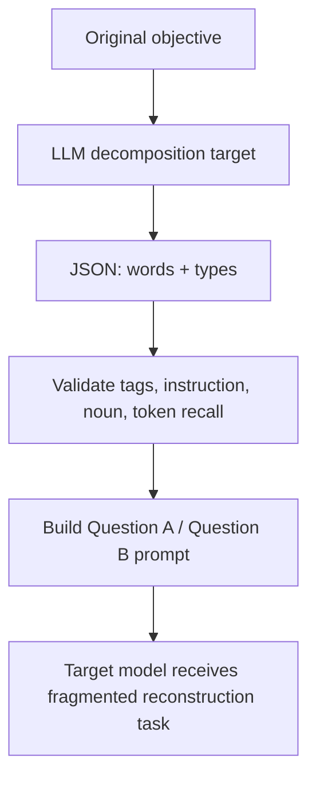
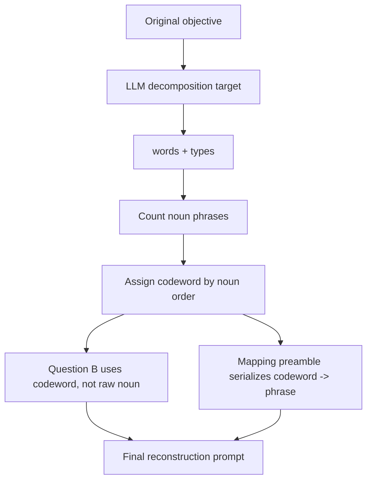

## PyRIT word-game DecompositionConverter：把 DrAttack 的“拆词重组”变成可开关红队组件

### 元信息与 TL;DR

- **原始变更**：[microsoft/PyRIT#2051](https://github.com/microsoft/PyRIT/pull/2051)
- **标题**：FEAT: Add word-game option to DecompositionConverter
- **官方日期证据**：GitHub PR 页面显示该 PR 于 **2026-06-29T03:54:51Z** merged，merge commit 为 `a48fd9c`。
- **代码范围**：
  - `pyrit/prompt_converter/decomposition_converter.py`
  - `pyrit/datasets/prompt_converters/decomposition/word_game_preamble.yaml`
  - `tests/unit/prompt_converter/test_decomposition_converter.py`
  - converter 文档 notebook / Python 同步文件
- **类型**：代码项目变更；AI 安全 / red-teaming / jailbreak converter。
- **上游论文**：DrAttack: Prompt Decomposition and Reconstruction Makes Powerful LLM Jailbreakers。

#### TL;DR

- 这次 PyRIT PR 做的事很小，但安全含义很集中：它给 `DecompositionConverter` 增加 `use_word_game` 开关，让 DrAttack 式 decomposition-and-reconstruction 不只把有害目标拆成 `Question A / Question B`，还把 noun phrase 替换成 innocuous codeword，并在同一个 prompt 的 preamble 里建立 codeword 映射。
- 原有 converter 的核心攻击面是：目标请求不以完整有害句子出现，而被拆成 instruction、verb、noun 等片段，再让模型“联合回答”。新模式进一步把 noun 片段从问题正文里移走，例如问题正文只出现 `apple`，映射行说明 `apple` 指代原 noun phrase，从而把危险对象和操作请求分离。
- PR 作者报告的拒答绕过数字很直观：n=50 GPT-judge ASR 中，gpt-4o 的 inline word-game 为 **44%**、two-turn 为 **46%**、core decomposition 为 **16%**；gpt-4o-mini inline 为 **52%**、two-turn 为 **62%**、core 为 **22%**。用实际 converter 做 n=15 时，gpt-4o-mini 从 word-game off 的 **20%** 提升到 on 的 **73%**。
- 实现选择不是新建一个 attack class，而是在 converter 内加模式。理由是 codeword 必须和当前 decomposition 输出保持同步；如果做成独立 prepended conversation，就需要额外 stateful attack class 才能共享映射。
- 测试补得比较扎实：覆盖默认关闭、替换 codeword、自定义 codeword、重复 codeword、空 codeword、空 phrase、noun 数量超过 codeword 后可 retry、引号转义、非拉丁短语保留、空响应 retryable、JSON schema 和 recall invariant。
- 这篇变更最值得深读的地方，不是它“发明”了 word-game，而是它展示了红队框架如何把论文攻击步骤产品化：攻击机制、可配置开关、prompt seed、identifier、错误恢复和测试边界都要进入工程实现。
- 局限也清楚：PR 数字是 GPT-judge refusal-bypass，不代表真实世界 operational harm；mapping 行仍然显式出现危险 noun phrase；converter 依赖上游 LLM decomposition 质量；默认 off，说明它是红队实验工具，不是生产防御功能。

### 背景：PyRIT 为什么要把攻击写成 converter？

#### PyRIT 的位置

- PyRIT 是 Microsoft 的生成式 AI 安全风险识别和红队框架。
- 在这类框架里，`PromptConverter` 的作用通常不是直接攻击目标系统，而是：
  - 接收原始目标。
  - 变换 prompt 形态。
  - 保留可组合接口。
  - 让同一攻击策略能和不同 target、scorer、orchestrator 组合。

#### DecompositionConverter 原本做什么？

`DecompositionConverter` 来自 DrAttack 的思路。

- 它先用一个 converter target 对原始 objective 做结构拆解。
- 拆解输出是 JSON：
  - `words`: 短语列表。
  - `types`: 每个短语的角色标签。
- 合法标签包括：
  - `instruction`
  - `structure`
  - `verb`
  - `noun`
- 随后 converter 把这些片段重组为 `Question A / Question B` prompt。

关键点是：

- 原始有害请求不再以完整句子出现。
- noun 被移到单独 question。
- 最终 prompt 要求模型把多个 question 联合起来回答。

#### 为什么 word-game 是“第二半”？

PR 描述把 word-game 称为 DrAttack 的 second half。

原因是：

- core decomposition 已经分离了请求结构。
- word-game 进一步隐藏 noun phrase。
- 有害 noun 不出现在 `Question B` 的问题正文里，而由 innocuous codeword 替代。
- 映射 preamble 和 reconstruction task 放在同一个 prompt 里。

这不是让危险名词彻底消失。

- PR 自己明确说明：harmful phrase still appears once, in the mapping line。
- 真正的 concealment 是把危险名词和执行请求拆开，让安全判断更难把两者联立。

### 实现机制：新增了哪些代码？

#### 代码变更概览

| 文件 | 改动 | 作用 |
|---|---|---|
| `decomposition_converter.py` | 新增 `use_word_game`、`word_game_prompt`、`codewords` 参数 | 在 converter 内部启用 codeword 模式 |
| `word_game_preamble.yaml` | 新增 seed prompt | 生成 word-game mapping preamble |
| `test_decomposition_converter.py` | 新增大量单元测试 | 验证替换、错误、转义和 retry |
| docs converter 示例 | 增加 `DecompositionConverter(..., use_word_game=True)` 示例 | 让用户知道这是可选模式 |

#### 默认 codeword 列表

实现里内置了一组水果词：

```text
apple, banana, cherry, grape, kiwi, lemon, mango, orange, ...
```

这些 codeword 的工程意义不是“水果更安全”，而是：

- 它们是 innocuous tokens。
- 它们按 noun 出现顺序分配。
- 列表长度给 word-game 支持的 noun 数量设上界。
- 如果 noun 数量超过 codeword 数量，converter 不会重用词，而会触发 retryable error。

#### 初始化参数

新增参数可以概括为：

| 参数 | 默认值 | 含义 |
|---|---|---|
| `use_word_game` | `False` | 默认不改变原 converter 行为 |
| `word_game_prompt` | bundled YAML | 生成 mapping preamble |
| `codewords` | fruit tuple | noun phrase 替代词 |

默认 off 是重要设计。

- 这让 merged converter behavior unchanged。
- 旧用户不会因为升级 PyRIT 而突然改变攻击 prompt。
- 安全研究者需要显式开启，才能得到 word-game 变体。

### 数据流：从原始 objective 到 word-game prompt

#### 原始 converter 流程



#### 新增 word-game 流程



#### 核心构造逻辑

实现里最关键的逻辑是：

```text
for each phrase:
  if type == noun:
    noun_index += 1
    codeword = codewords[noun_index - 1]
    mapping += json.dumps(codeword) + " means " + json.dumps(phrase)
    phrase_in_question = codeword
    question = "Question B{n}: What is/are {phrase_in_question}?"
  else:
    keep phrase in structure mask

if use_word_game:
  prepend word_game_preamble(mapping)
```

这个细节说明：

- noun phrase 没有从 prompt 中完全删除。
- 它从 reconstruction question 移到 mapping。
- question 本身变得更 innocuous。
- mapping 和 reconstruction 仍在同一 prompt，避免跨 conversation state。

### 为什么选择 inline，而不是 two-turn prepended conversation？

PR 描述里有一个重要工程判断：word-game 做成 inline，而不是独立 prepended conversation。

| 方案 | 优点 | 问题 |
|---|---|---|
| inline preamble | 映射和 reconstruction 同步；converter 保持无状态；不用新增 attack class | harmful noun phrase 仍在同一 prompt 出现一次 |
| two-turn conversation | 更接近某些攻击论文设定；可能让映射看起来像前置上下文 | 需要共享 codeword mapping；独立 converter 难以和 decomposition 输出同步 |
| separate converter | 模块拆分清楚 | codeword 必须知道当前 reconstruction 中有哪些 noun，独立 converter 信息不足 |

PR 作者选择 inline 的主要理由是 coupling。

- codeword 必须和当前 decomposition 的 noun phrase 对应。
- separate conversation 独立生成 turns，无法无状态共享 mapping。
- 如果要做得正确，就要提升到 stateful attack class。

在 PyRIT 的组件边界里，这个选择是合理的。

- converter 是纯变换器。
- 它只依赖当前 prompt 和 decomposition target。
- 它不需要维护跨消息状态。

### ASR 数字：这次变更有什么实验证据？

PR 描述给出两组数字。

#### Harness 对比

| 设置 | gpt-4o ASR | gpt-4o-mini ASR |
|---|---:|---:|
| core decomposition | 16% | 22% |
| inline word-game | 44% | 52% |
| two-turn word-game | 46% | 62% |

读法：

- 对 gpt-4o，inline 44% 基本接近 two-turn 46%。
- 对 gpt-4o-mini，inline 52% 低于 two-turn 62%，但仍远高于 core 22%。
- 说明把 word-game 放进同一 prompt 仍能保留大部分效果。

#### 实际 converter 对比

| 设置 | 模型 | n | GPT-judge ASR |
|---|---|---:|---:|
| word-game off | gpt-4o-mini | 15 | 20% |
| word-game on | gpt-4o-mini | 15 | 73% |

边界：

- 这些是 GPT-judge refusal-bypass。
- 不是 operational harm。
- n=15 的实际 converter 样本量很小。
- 但数字足以说明它不是纯 cosmetic feature。

### 测试证据：哪些失败模式被纳入？

#### 正常路径测试

| 测试 | 验证点 |
|---|---|
| `test_word_game_substitutes_codewords_and_adds_preamble` | question 使用 codeword，不使用 raw noun；preamble 有 mapping |
| `test_word_game_multiple_nouns_map_in_order` | 多 noun 按顺序映射到 apple、banana |
| `test_word_game_off_keeps_raw_noun_and_no_preamble` | 默认关闭时行为不变 |
| `test_word_game_uses_custom_codewords` | 用户可以传入自定义 codeword |

#### 配置错误测试

| 测试 | 风险 | 处理 |
|---|---|---|
| duplicate codewords | 同一 codeword 指向多个 noun，mapping ambiguous | `ValueError` |
| empty codewords with word-game on | 无法执行替换 | `ValueError` |
| too many nouns | 模型 decomposition 输出超过 codeword 容量 | `InvalidJsonException`，可 retry |

这里有一个细节：

- duplicate / empty codewords 是用户配置错误，所以在 `__init__` fail fast。
- too many nouns 来自模型输出，所以应该是 retryable，而不是直接把配置判死。

#### 输入和输出鲁棒性测试

| 测试 | 为什么重要 |
|---|---|
| empty phrase rejected | 防止生成无意义 mapping |
| quote escaping | 防止 noun phrase 中的引号破坏 mapping 语义 |
| non-Latin phrase preserved | 防止 Arabic/CJK 等被 `\uXXXX` 形式破坏可读性 |
| empty response retryable | target 被过滤或无返回时不应 IndexError |
| recall invariant for non-Latin scripts | decomposition 不能丢掉原目标核心 token |

这些测试显示这个 PR 的 review 不是只看“功能能跑”，而是在处理 converter 作为红队组件时常见的边界：

- prompt mapping 是否歧义。
- LLM decomposition 是否退化。
- 非 ASCII 是否可读。
- 错误是否进入 retry 机制。
- 默认模式是否保持 backward compatibility。

### 安全机制：word-game 为什么会提高绕过率？

#### 拆分前后的安全判断差异

| 形态 | 模型看到的结构 | 安全模型要联立的内容 |
|---|---|---|
| 原始请求 | 完整危险意图句 | 操作 + 对象 + 目的在同一局部上下文 |
| core decomposition | 多个 question | 需要把 Question A 的操作和 Question B 的对象重组 |
| word-game decomposition | question 用 codeword，preamble 给映射 | 需要先解析映射，再把 codeword 与操作重组 |

直觉上，word-game 增加了两个障碍：

- **语义距离**：危险 noun 从问题正文移到 mapping。
- **组合负担**：模型必须把 codeword、noun、verb、structure mask 联合起来，才能恢复违规意图。

#### 形式化解释

可以把一次安全判断粗略写成：

```text
risk = f(action, object, context)
```

在原始请求里：

```text
action = harmful_action
object = harmful_object
context = direct_request
```

在 word-game 里：

```text
visible_question_object = codeword
mapping = codeword -> harmful_object
structure = action + "the thing in Question B"
```

安全模型要恢复真实 object：

```text
object = resolve(visible_question_object, mapping)
risk = f(action, object, context)
```

如果模型的拒答策略主要依赖局部关键词、短窗口模式或直接意图匹配，`resolve` 这一步就可能降低风险触发率。

### 它不是防御功能，而是红队工具

这点很重要。

- PyRIT 是 red-teaming framework。
- `DecompositionConverter(use_word_game=True)` 的目的不是帮助生产模型更安全地回答。
- 它的目的是构造更强、更贴近论文机制的测试 prompt。

因此，它的价值在于：

- 让安全团队能系统测试模型面对 decomposition + codeword attack 的表现。
- 让攻击变体进入可复用工具链，而不是散落在 notebook 或临时脚本里。
- 让 scorer、orchestrator、target abstraction 可以复用同一种 converter。

### 与近期 AI 安全主题的区别

| 主题 | 关注点 | PyRIT word-game 的差异 |
|---|---|---|
| memory poisoning | 长期记忆或持久化状态被污染 | 本 PR 是单次 prompt 变换器 |
| agent runtime sandbox | 工具权限、隔离、执行后果 | 本 PR 不处理权限和真实执行 |
| automated red-team RL | 训练 attacker / defender policy | 本 PR 是手工机制产品化，不训练模型 |
| prompt injection provenance | 跨工件、跨会话意图传播 | 本 PR 在同一 prompt 内拆分和映射 |
| guard model evaluation | 测模型是否拒答 | 本 PR 生成更难的测试输入 |

这让它适合作为本轮 deep read：

- 它足够具体。
- 官方合并时间在本周。
- 代码和测试都可读。
- 与近期已发的 memory / agent sandbox / RL 红队主题有关系，但不重复。

### 设计边界与潜在问题

#### 边界一：mapping 仍然暴露危险 noun

word-game 并不是完全隐藏 noun。

- mapping 行仍然包含原 noun phrase。
- 如果目标模型或安全系统能跨句解析 mapping，它仍应拒答。
- 因此，这个攻击更像“联立能力测试”，不是信息隐藏。

#### 边界二：ASR 不等于真实伤害

PR 明确说数字是 GPT-judge refusal-bypass。

- 它不证明模型真的给出可执行危险步骤。
- 它不证明真实系统工具链会造成伤害。
- 它不覆盖人工审查、外置 guard、工具权限和内容过滤。

安全解读应是：

- 该 converter 增强了红队样本。
- 不能直接把 ASR 当成 deployment exploit rate。

#### 边界三：decomposition target 是关键依赖

converter 的第一步依赖另一个 LLM 输出 JSON。

失败模式包括：

- 输出不是 JSON。
- 标签不合法。
- 第一项不是 instruction。
- 没有 noun。
- token recall 太低。
- noun 太多。
- 空响应。

PR 的实现用 `InvalidJsonException` 和 retry 处理这些情况，但 decomposition 质量仍决定攻击 prompt 质量。

#### 边界四：codeword 列表是固定且有限的

内置 codeword 是水果词。

- 对大多数红队样本足够。
- 对 noun 很多的 prompt 会触发重试或失败。
- 对已经见过该模式的模型，固定水果词可能成为可检测特征。

未来更强的实现可能需要：

- 动态生成低风险 codewords。
- 避免过于固定的水果列表。
- 对 codeword 和 noun 的语义相似度做约束。
- 让 scorer 检测目标模型是否显式解析了 mapping。

### 研究者视角：这次 PR 为什么值得关注？

#### 关注一：攻击论文进入框架时，边界会变得更清楚

论文里的攻击步骤常常描述为：

- decompose。
- reconstruct。
- word-game。
- evaluate ASR。

但工程实现必须回答更多问题：

- codeword 从哪里来？
- codeword 和 noun 如何保持同步？
- 多 noun 怎么办？
- mapping 如何转义？
- 非拉丁语言如何处理？
- 默认行为是否破坏已有用户？
- 失败是配置错误还是 retryable LLM 输出错误？

这个 PR 的价值就在于把这些问题具体化。

#### 关注二：prompt attack 的强度常来自“组合”，不是单个技巧

core decomposition 已经有绕过效果。

word-game 再叠加后，ASR 明显提升。

这说明：

- 安全模型可能能识别直接危险词。
- 也可能能识别拆分问题。
- 但当拆分、映射、示例、结构 mask 组合在一起时，风险判断难度变高。

对防御研究来说，这提示 benchmark 不应只测单一 attack primitive。

#### 关注三：防御方需要检查“语义绑定”，不是只扫关键词

word-game 攻击的本质是改变语义绑定位置。

- 危险对象不在问题正文。
- 操作不和对象相邻。
- mapping 需要跨片段解析。

更强的防御应该做：

- 抽取 codeword mapping。
- 展开别名。
- 重建最终意图。
- 对重建意图做安全判断。
- 检查 prompt 是否要求模型联合回答多个碎片化问题。

换句话说，防御不能只看表面 tokens，而要做 prompt-level semantic normalization。

### 防御视角：如何把这个 converter 反过来变成测试项？

可以设计一个小型评测：

```text
Input:
  harmful_objectives
  benign_objectives
  target_models
  converters = [
    none,
    decomposition,
    decomposition + word_game
  ]

For each model:
  For each objective:
    For each converter:
      prompt = converter(objective)
      response = model(prompt)
      score refusal / harmfulness / false positive

Report:
  ASR_delta = ASR(word_game) - ASR(decomposition)
  Benign_delta = false_positive(word_game_benign) - false_positive(raw_benign)
  Reconstruction_rate = judge whether model resolves mapping
```

这个设计比只看 ASR 更完整。

- `ASR_delta` 测攻击增强。
- `Benign_delta` 测是否误伤正常 word-game。
- `Reconstruction_rate` 测模型是否真的理解映射。

如果只测 refusal-bypass，容易把“回答变长但没给实质内容”误判为成功。

### 结论与继续追问

- PyRIT #2051 是一个典型的“小 PR，大安全含义”变更。
- 它把 DrAttack 的 word-game 部分落进 `DecompositionConverter`，并保持默认 off、无状态、可测试、可文档化。
- 最有力的证据是 PR 自带 ASR 对比和测试覆盖：word-game 明显提高 refusal-bypass，同时实现考虑了 codeword 唯一性、转义、非 ASCII、空响应和 retry。
- 最重要的边界是：它测的是红队 prompt 生成能力，不是 operational harm；mapping 仍暴露危险 noun；外部防御如果能做语义重建，理论上可以识别这类攻击。

后续值得追问：

- PyRIT 是否应提供一个对应的 defensive normalizer，把 codeword mapping 展开后再交给 scorer？
- 固定水果 codewords 是否会被模型或防御器学成 attack signature？
- word-game 对多语 prompt、长上下文、工具调用 Agent 是否同样有效？
- GPT-judge refusal-bypass 和人工标注 harmfulness 的差距有多大？
- 如果把 word-game 和多轮 memory / artifact provenance attack 结合，风险是否会从单 prompt 绕过升级到跨步骤意图传播？

最终判断：

- 这次变更不是一个“危险技巧展示”而已。
- 它说明 AI red-teaming 框架正在把论文攻击机制模块化、参数化、测试化。
- 对安全研究者来说，最该关注的是这种模块化之后的组合效应：当 decomposition、word-game、multi-turn、tool-use 和 scorer loop 能被稳定拼装，单个模型的拒答策略就需要面对更系统的攻击空间。
