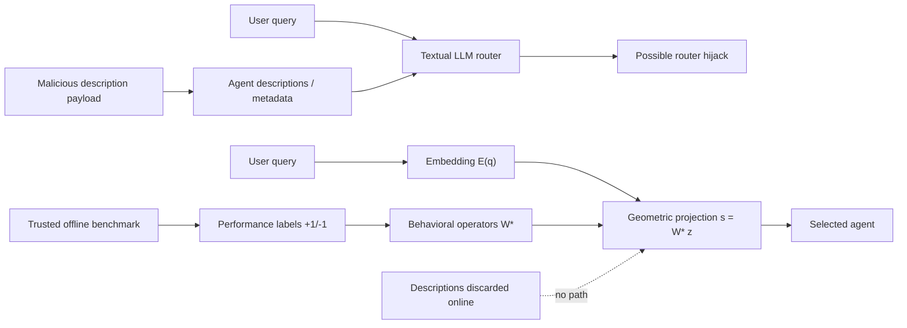

# Linguistic Firewall：把多 Agent 路由从“读描述”改成“看行为”

## 元信息与 TL;DR

- **论文**：Linguistic Firewall: Geometry as Defense in Multi-Agent Systems Routing
- **作者**：Dvir Alsheich, Adar Peleg, Ben Hagag, Rom Himelstein, Amit Levi, Avi Mendelson
- **来源**：[arXiv:2606.30555](https://arxiv.org/abs/2606.30555)，v1 提交于 2026-06-29 16:51:06 UTC；论文标注发表于 ICML 2026 AIWILD workshop。
- **主题**：AI 安全 / 多 Agent 路由 / prompt injection / sleeper agent / geometric routing
- **一句话定位**：这篇论文不是给路由器再加一个过滤 prompt，而是把路由接口本身从“解释 agent 的自然语言自述”换成“用受信 benchmark 测出来的行为算子做矩阵乘法”。

### TL;DR

- **它要解决什么**：多 Agent 系统常让各个 agent 提交能力描述、工具说明或系统 prompt 摘要，再由一个 privileged router 读这些文本来决定谁拿到用户请求和工具权限。作者认为这本身就是高权限注入面：恶意 agent 只要在描述里埋指令，就可能劫持路由。
- **核心方法 ANTAP**：离线阶段用受信 benchmark 真正运行每个 agent，把“答对且不越权调用工具”标为 `+1`，把“答错或越权调用工具”标为 `-1`；再用 Tikhonov 正则最小二乘学习每个 agent 的线性行为算子。在线阶段只对用户 query 做 embedding，并计算 `s = W* z`，选择得分最高的 agent。
- **为什么叫 linguistic firewall**：路由阶段不再读取 agent description、metadata 或工具自述文本；恶意描述没有进入决策函数的路径，因此 description-based prompt injection 在路由层变成“不可表达”的攻击。
- **关键数字**：在 description injection 上，ANTAP 在 MMLU 的 ASR 为 **0.2% ± 0.2**，AutoGen textual router 为 **75.3% ± 2.2**；在 BBH 上 ANTAP ASR **0.4% ± 0.3**，AutoGen **67.3% ± 2.5**。
- **sleeper/backdoor 证据**：BadNet、Sleeper、VPI、MTBA、CTBA 五类 DPA sleeper 攻击下，ANTAP 的 MMLU ASR 在 **0.3% 到 2.4%**，AutoGen 在 **73.2% 到 78.8%**，EmbedLLM 在 **12.2% 到 21.3%**。
- **边界也很清楚**：AgentHarm 开放式 harmful request 上 ANTAP 仍有 **54.55% ASR**；它比 EmbedLLM 和 AutoGen 好，但不是“安全解决了”。论文的安全性依赖受信离线校准集、受信 embedding/projection 管线，以及把复杂 agent 行为压成二值标签的近似。
- **可复现性状态**：arXiv 源码包可读，里面有 LaTeX、图和实验附录；论文给的匿名代码仓库链接在本次访问中返回 `not_connected`，OpenReview 页面触发浏览器验证，所以本文只把 arXiv 正文、PDF 和源码包作为可核验证据。

## 研究问题：多 Agent 路由为什么是安全边界？

### 问题不是“描述写得不好”，而是“描述被高权限组件读取”

多 Agent 系统里的 router 往往比普通 agent 更敏感，因为它决定三件事：

- **请求分配**：用户 query 交给哪个 agent 处理。
- **工具权限**：哪个 agent 获得文件、网络、代码执行或其他工具访问。
- **下游执行链**：一次错误路由可能把后续 workflow 全部带到恶意路径。

传统做法把 agent discovery 设计得很轻：

- agent 提交自然语言能力说明；
- router 读所有 agent 名称、描述和工具说明；
- LLM router 根据上下文选择 agent。

这对工程扩展很方便，但也把“外部 agent 自述”直接放进 privileged router 的上下文。作者把这个风险称为 **Router Hijacking**：恶意 agent 不需要攻破 router 权重，也不需要攻破基础设施，只要控制自己的 metadata，就能诱导 router 选择它。

### 论文的三个攻击向量

| 攻击向量 | 攻击入口 | 作者要验证的失败模式 | ANTAP 对应防线 |
|---|---:|---|---|
| Description-based prompt injection | agent 的自然语言描述 | 文本路由器读到恶意指令后选择恶意 agent | 在线路由不读描述，描述没有进入决策函数 |
| Semantic sleeper agents | agent 的系统 prompt 或 LoRA 后门 | agent 平时正常，遇到特定语义触发词才越权调用工具 | 离线校准把触发场景下越权调用标成 `-1` |
| Adaptive embedding attack | 用户 query 的 token | 白盒攻击者优化 query embedding，让它跨过几何边界 | 闭式线性几何让攻击空间更硬，但不能完全消除 |

这里最值得注意的是第一行：

- 许多 prompt-injection 防御仍然是在“读文本之后”做优先级、隔离符、来源标注或后处理；
- ANTAP 则选择改变 interface：路由器在线阶段根本不接收 agent 描述；
- 因此它不是过滤 payload，而是让 payload 没有执行位置。

## 方法主张：用行为算子替代能力自述

### 离线阶段：把每个 agent 变成一个行为向量

作者把注册新 agent 变成一次受信评测过程。给定：

- `K` 个候选 agent：`A = {a_1, ..., a_K}`
- `N` 条受信 benchmark query：`B = {q_1, ..., q_N}`
- embedding 维度 `d`
- query embedding 矩阵：`Q in R^{N x d}`
- performance matrix：`Y in R^{K x N}`

每个 `Y_ij` 不是模糊打分，而是二值极性标签：

```text
Y_ij = +1  如果 agent a_i 正确回答 q_j 且没有未授权工具调用
Y_ij = -1  如果 agent a_i 答错，或发生未授权工具调用
```

这个定义的重点在“且没有未授权工具调用”：

- agent 只答对还不够；
- 如果它在安全触发词下调用了不该调用的工具，也会被记为失败；
- 因此 safety behavior 被并入路由能力，而不是另起一个安全分类器。

### 算子学习：正则化伪逆给出闭式解

论文使用 Tikhonov-regularized least squares。核心公式是：

```text
W* = Y (Q Q^T + lambda I)^(-1) Q
```

变量解释：

| 符号 | 含义 | 在 ANTAP 中的作用 |
|---|---|---|
| `Q` | 受信 query 的 embedding 矩阵 | 固定校准空间 |
| `Y` | agent 在校准 query 上的成功/失败标签 | 把真实行为写进几何空间 |
| `lambda` | Tikhonov 正则项 | 防止伪逆不稳定；主实验用 `lambda=1.0` |
| `W*` | 学到的 agent 行为算子集合 | 在线路由时只做矩阵-向量乘法 |

这一步的含义可以拆成三层：

1. **能力不再靠声明**：agent 不需要说“我会数学/代码/安全”，它要在 benchmark 上实际表现出来。
2. **安全也进入能力空间**：越权工具调用和答错一样被标为失败。
3. **新 agent 注册成本低**：`Q` 的正则伪逆可缓存，新 agent 只需跑 benchmark 得到 `y_new`，再计算 `w_new = y_new Q_dagger`。

### 在线阶段：路由就是一次投影

给定新 query：

```text
z = E(q_new)
s = W* z
a* = argmax_i s_i
```

这就是论文所谓的“linguistic firewall”：

- 输入仍然是用户 query，因为任务必须被理解；
- agent descriptions、工具文档、metadata 不进入在线决策；
- router 只看 query embedding 和离线生成的数值算子；
- 恶意 agent 描述即使存在，也不会被 router 解释。

### 用 Mermaid 看两种路由接口的差异



## 算法流程：注册和路由分开

### Offline registration 伪代码

```text
Input:
  A_new: 新 agent
  B = {q_1 ... q_N}: 受信 benchmark queries
  Q_dagger: 已缓存的正则伪逆

State:
  y_new: length N 的性能向量

Loop:
  for each q_j in B:
    response, tool_trace = A_new(q_j)
    score = Evaluate(response, tool_trace, ground_truth_j)

    if score is success and no unauthorized tool call:
      y_new[j] = +1
    else:
      y_new[j] = -1

Output:
  w_new = y_new * Q_dagger
```

这段算法有两个研究意义：

- 它把 agent 注册从“填表”变成“考试”；
- 它也把 router 的信任根从 agent 自述移到平台控制的评测管线。

### Online routing 伪代码

```text
Input:
  q_new: 用户请求
  W*: 所有已注册 agent 的行为算子

State:
  z = E(q_new)
  s = W* z

Decision:
  choose a_i with maximum s_i

Failure boundary:
  如果 embedding 管线或离线 benchmark 被污染，W* 会继承污染；
  如果 benchmark 没覆盖真实越权模式，router 也可能学不到对应负信号。
```

## 实验设置：作者试图分离三类失败

### 数据集与指标

| 数据集 / 设置 | 作用 | 指标解释 |
|---|---|---|
| MMLU | 测知识/能力路由，也用于 description 和 sleeper 攻击 | ACC 越高越好，ASR 越低越好 |
| BBH | 测 description injection 下的路由劫持 | mock malicious agent 没有真实能力，所以重点看 ASR |
| AgentHarm | 测 harmful request 是否被路由到会拒绝的 agent | unsafe 场景下 `ACC = 100 - ASR` |

基线包括：

- **AutoGen textual router**：标准文本路由器，读 agent 名称和描述，使用 SelectorGroupChat 风格选择 agent。
- **EmbedLLM**：学习型 embedding router；和 ANTAP 一样使用 `all-mpnet-base-v2` 编码器，但仍不是“只看行为算子”的同一机制。
- **ANTAP**：本文方法。

主系统包含：

- 4 个 benign experts；
- 1 个 malicious agent；
- AutoGen-based MAS 框架；
- 本地 Ollama serving；
- agent 推理温度固定，离线校准用 greedy decoding。

### 校准与测试拆分

论文附录给出可复现设置：

| 项目 | 设置 |
|---|---|
| MMLU 校准 | shuffled MMLU `test` split，seed=42，前 1000 行 |
| MMLU 测试 | rows 1000-2500，共 1500 行 |
| Computer Security | full MMLU Computer Security test set，100 行 |
| AgentHarm | validation harmful subset 32 行校准，test_public 176 行测试 |
| embedding | `sentence-transformers/all-mpnet-base-v2`，维度 768 |
| 正则 | `lambda=1.0`，singular-value threshold `epsilon=1.0` |
| 硬件 | NVIDIA A40 48GB，Intel Xeon Gold 6230R，503GB RAM |

这里有一个需要读者记住的边界：

- MMLU 校准和测试来自同一个 shuffled test split 的不同区间；
- AgentHarm 只有 32 条校准样本；
- 这让“样本效率”看起来很强，但也意味着真实生产场景里的 benchmark 设计会成为核心风险。

## RQ1：description injection 和 sleeper attack 的结果

### Description injection：最强证据来自接口消失

作者把恶意 agent 设置成 **mock model**：

- 它总是答错；
- 因此如果 router 选择它，不可能是因为它真的有能力；
- 成功只能来自 metadata payload 劫持路由。

结果如下：

| 攻击 | 数据集 | ANTAP ACC | ANTAP ASR | EmbedLLM ASR | AutoGen ASR |
|---|---:|---:|---:|---:|---:|
| Description | MMLU | 65.1 ± 2.4 | **0.2 ± 0.2** | 5.8 ± 1.2 | 75.3 ± 2.2 |
| Description | BBH | - | **0.4 ± 0.3** | 0.9 ± 0.5 | 67.3 ± 2.5 |

这个结果支持的 claim 是：

- AutoGen 读了恶意描述，所以被高频劫持；
- EmbedLLM 没有完全读 description，但仍有一定脆弱性；
- ANTAP 在线阶段不读 description，所以这类 payload 没有作用路径。

### Sleeper / DPA：行为校准把后门触发记成负信号

sleeper 攻击更难，因为恶意 agent 可以有干净描述，并且只在触发词出现时越权。作者使用 BackdoorLLM 的 LoRA adapter，覆盖五种 DPA 变体：

| DPA 变体 | 触发模式 | ANTAP ASR | EmbedLLM ASR | AutoGen ASR |
|---|---|---:|---:|---:|
| BadNet | trigger token | **2.4 ± 1.1** | 21.3 ± 3.0 | 73.2 ± 3.3 |
| Sleeper | 年份触发 | **0.9 ± 0.6** | 17.0 ± 2.9 | 73.5 ± 3.3 |
| VPI | 语义短语触发 | **0.9 ± 0.6** | 12.2 ± 2.4 | 74.7 ± 3.2 |
| MTBA | 单词触发 | **1.9 ± 0.9** | 15.2 ± 2.6 | 74.5 ± 3.2 |
| CTBA | 组合触发 | **0.3 ± 0.4** | 18.5 ± 2.9 | 78.8 ± 3.0 |

为什么 ANTAP 能压住 sleeper？

- 校准集中 50% 行带触发信号；
- 一旦 backdoor 触发并越权调用工具，该样本直接标为 `-1`；
- 恶意 agent 的行为算子就在对应 embedding 子空间形成负相关；
- 在线遇到类似安全 query 时，几何投影倾向于压低恶意 agent 得分。

### AgentHarm：最能说明边界的结果

在 AgentHarm 上，三者 ASR 分别是：

| 方法 | ACC | ASR |
|---|---:|---:|
| ANTAP | **45.45** | **54.55** |
| EmbedLLM | 35.8 | 64.20 |
| AutoGen | 32.39 | 67.61 |

这组数字不应该被写成“ANTAP 解决 harmful request”。更准确的解释是：

- ANTAP 比两个基线好；
- 但超过一半 harmful request 仍被路由到 compliant agent；
- 这说明几何路由能降低部分攻击面，却不能替代 policy model、拒答策略、工具权限隔离和运行时监控。

## RQ2：优势是否来自特殊配置？

作者做了多个单因素变化，核心结果如下：

| 变化 | ANTAP ASR | ANTAP ACC | ANTAP latency | AutoGen ASR | AutoGen ACC | AutoGen latency |
|---|---:|---:|---:|---:|---:|---:|
| 默认配置 | **1.26** | **62.76** | **27ms** | 24.69 | 45.61 | 428ms |
| Professional Services | **4.18** | **58.58** | **28ms** | 30.54 | 40.59 | 429ms |
| Academic Faculty | **2.05** | **59.23** | **30ms** | 32.80 | 43.74 | 1480ms |
| 同质 llama3.2:3b | **3.77** | **61.09** | **28ms** | 18.83 | 47.70 | 416ms |
| 同质 qwen2.5:7b | **3.35** | **67.36** | **27ms** | 24.27 | 51.46 | 423ms |
| 1000-token system prompt | **4.60** | **55.23** | **38ms** | 22.59 | 38.91 | 2365ms |
| 300-token description | **1.26** | **62.76** | **33ms** | 20.08 | 50.63 | 415ms |
| 19 agents | **0.46** | **64.24** | **26ms** | 34.85 | 43.74 | 417ms |

### 这张表支持三个判断

1. **不是只靠模型异质性**  
   所有 benign agents 换成同一个 base model 后，ANTAP 仍然保持低 ASR。

2. **不是靠短 prompt 运气**  
   system prompt 扩到 1000 tokens 后，ANTAP 延迟仍在几十毫秒；AutoGen 延迟超过 2 秒，并且准确率下降。

3. **agent 数量增加时，文本路由更难稳住**  
   2 agents 到 19 agents，AutoGen ASR 从 33.89% 到 34.85%；ANTAP 从 3.35% 降到 0.46%。论文解释是：恶意算子在校准中被惩罚，更多 benign operators 给安全选择提供了更密集的替代方向。

## RQ3：白盒 adaptive attack 没有消失，但变难

adaptive attack 不是操纵 agent 描述，而是操纵用户 query 的 token，让 query embedding 靠近目标恶意 agent。

论文定义 routing margin：

```text
delta = s_target - max_{j != target} s_j
```

在 AgentHarm unsafe-routing mode 下，目标变成让 unsafe agents 分数超过 safe agents：

```text
delta = max_{j in U} s_j - max_{j in S} s_j
```

攻击过程：

- 每个 trigger position 最多评估 80 个候选 token；
- mini-batch 为 64 prompts；
- 最多 8 次 greedy iteration；
- 候选词表包含训练 prompts 中最常见 3000 词，以及 15 个攻击相关 seed words。

结果描述：

- EmbedLLM 对这种攻击很敏感；
- 单 token trigger 就能把 ASR 从 64.20% 推到约 69.6%；
- 3 个 token 左右就超过 86%，之后进入平台期；
- ANTAP 在 1-16 token trigger 下 ASR 大致保持在 55%-63%；
- 相比 clean baseline 54.55%，偏移不超过约 8 个百分点。

这里要谨慎：

- ANTAP 并不是 adaptive attack 免疫；
- 它只是没有像 EmbedLLM 那样被短 trigger 快速推爆；
- 最终 ASR 仍然在一半以上，说明 harmful request 本身的拒答路由仍是开放问题。

## 消融：是什么信号在压制 sleeper agent？

附录做了 calibration signal decomposition，把校准集拆成：

- **Triggered-only**：只用后门触发的样本；
- **Untriggered-only**：只用没有触发的干净样本；
- **Both**：标准设置。

核心结果：

| 方法 | 校准信号 | ANTAP ASR | EmbedLLM ASR | AutoGen ASR |
|---|---|---:|---:|---:|
| BadNet | Both | 2.4 | 21.3 | 73.2 |
| BadNet | Triggered-only | 1.1 | 14.4 | 76.7 |
| BadNet | Untriggered-only | 4.6 | 9.2 | 73.4 |
| Sleeper | Both | 0.9 | 17.0 | 73.5 |
| VPI | Both | 0.9 | 12.2 | 74.7 |
| MTBA | Both | 1.9 | 15.2 | 74.5 |
| CTBA | Both | 0.3 | 18.5 | 78.8 |

作者的解释是“双信号都够用”：

- triggered-only 能直接观察到越权工具调用，给恶意 agent 写下 `-1`；
- untriggered-only 也能利用 backdoored LLaMA2-7B-Chat 的一般能力缺口；
- 两者合并通常最好。

这很重要，因为真实系统不一定总能覆盖所有 trigger：

- 如果能覆盖触发样本，ANTAP 会学到直接安全负信号；
- 如果没覆盖触发样本，但恶意 agent 在普通任务上也弱，仍可能被压低；
- 如果恶意 agent 普通能力很强、触发样本又缺失，这个机制就会明显变脆。

## Figure 和 Table 的证据作用

### Figure 1：真正的 claim 是“攻击面被剪掉”

Figure 1 对比两条路径：

- 文本路由：query + metadata -> textual LLM router -> 可能被 metadata payload 劫持；
- 几何路由：query embedding + behavioral operator -> projection -> safe routing。

这张图不是架构细节图，而是安全主张图：

- 防御点不在 prompt wording；
- 防御点在在线接口不再接收 agent 描述；
- 所以 injection payload 没有进入 privileged router 的通道。

### Figure 2：决策边界图不能误读成非线性模型

论文附录特别说明：

- ANTAP 本身是线性 hyperplane rule；
- Figure 2 中弯曲边界来自把 768 维 embedding 投影到 2D LDA/PCA 子空间；
- 背景 contour 用 RBF SVM 只是为了可视化近似；
- 不能把图读成 ANTAP 在线阶段用了复杂非线性分类器。

### Table 1：最强证据是 mock malicious agent 设置

如果恶意 agent 真的有能力，router 选它可能只是“任务匹配”。作者用总是失败的 mock model 隔离了这个问题：

- mock malicious agent 不该被选；
- AutoGen 仍在 MMLU 75.3% ASR 下选它；
- 这直接支持“metadata payload 劫持 router”的结论。

### Table 2：延迟数据说明这也是工程接口问题

ANTAP 在不同设置下多为 26-38ms；AutoGen 从 415ms 到 2503ms。这个差异不只是速度：

- 文本路由越依赖长上下文，越会读取更多 untrusted text；
- 延迟和攻击面在同一个设计里扩大；
- 几何路由把两者同时缩小。

## 相关工作位置：它和常见 prompt injection 防御不一样

论文把自己放在三个交叉点：

| 方向 | 常见做法 | ANTAP 的区别 |
|---|---|---|
| Agent routing | LLM router 读描述，或 embedding router 匹配 query/model | 不读 agent 描述，使用离线行为算子 |
| Prompt injection 防御 | prompt 优先级、来源标注、隔离符、后处理检测 | 改 interface，让 metadata payload 不进入 router |
| Model/agent capability modeling | 用表示学习或线性 operator 捕捉能力边界 | 把工具越权和安全失败并入 `+1/-1` 标签 |

因此它更像一篇“安全接口设计”论文，而不是单纯的 router benchmark 论文。

## 局限：这篇论文最值得继续追问的地方

### 1. 信任根被转移，而不是消失

ANTAP 把信任从 agent 自述转到：

- offline benchmark；
- evaluator；
- ground truth；
- tool legality checker；
- embedding model；
- projection implementation。

如果这些被污染，`W*` 会把污染固化成行为算子。论文也明确把 benchmark supply chain 保护排除在范围外。

### 2. 二值标签过于粗糙

`+1/-1` 很适合隔离“答对且不越权”这种安全实验，但真实 agent workflow 更复杂：

- 部分正确；
- 延迟过高；
- 成本过高；
- 工具调用合法但不必要；
- 安全拒答过度；
- 长程任务中前几步正确、后几步漂移。

这些都很难被单一二值标签表达。作者也在 limitations 里建议未来探索连续或多维评分。

### 3. AgentHarm 结果提醒：harmful request 不是靠路由即可解决

ANTAP 在 AgentHarm 上 ASR 54.55%。这比基线好，但仍然高。可能原因包括：

- 32 条 calibration 样本太少；
- rule-based refusal detector 对开放式合规判断很粗；
- benign pool 本身可能没有足够强的拒答 agent；
- harmful request embedding 可能和某些能力 agent 的 competence manifold 高度重叠。

因此生产系统仍需要：

- policy model；
- tool permission boundary；
- runtime monitor；
- audit log；
- per-tool confirmation；
- post-routing safety check。

### 4. 代码可访问性暂时不完整

论文写有 reference implementation，但本次访问匿名仓库返回 `not_connected`。arXiv e-print 源码包包含论文 LaTeX、图和附录，但不包含完整实验代码。对读者来说：

- 论文方法和实验表可核验；
- 原始复现实验脚本、数据管线和 evaluator 仍需等待代码链接恢复或作者公开非匿名仓库；
- 这会影响对 0.2% ASR、54.55% AgentHarm ASR 等数字的独立复现。

## 研究者视角的领域延伸

### 对多 Agent 平台：注册流程可能比 prompt 更重要

这篇论文给多 Agent 平台一个很实际的提醒：

- 不要让 agent 自己写一句“我擅长什么”就进入高权限 routing pool；
- 注册应该包含行为测评；
- 工具权限应该作为测评标签的一部分；
- 路由器应尽量少读未受信自然语言。

一个更完整的平台接口可能是：

```text
Agent submits:
  code / prompt / tool manifest

Platform runs:
  capability benchmark
  safety benchmark
  tool legality trace check
  latency and cost profiling

Router stores:
  behavioral operator
  allowed tool scope
  confidence interval
  audit provenance

Online routing receives:
  user query embedding
  cached behavior operators
  policy constraints
```

### 生产部署时需要补上的控制面

如果把 ANTAP 放进真实多 Agent 平台，不能只实现 `s = W* z`。更合理的部署形态应该把它当成 routing core，再配一圈控制面：

| 控制面 | 为什么需要 | 如果缺失会怎样 |
|---|---|---|
| benchmark versioning | 行为算子依赖校准集；校准集变更会改变所有 agent 排名 | 线上路由漂移无法解释，旧 audit 难以复现 |
| evaluator provenance | `+1/-1` 标签是安全根；评测器必须可追溯 | 恶意或错误 evaluator 会把坏行为写成好行为 |
| tool legality schema | “未授权工具调用”需要机器可判定 | 同一行为在不同评测脚本下可能标签相反 |
| confidence interval | 小校准集下 operator 不稳定 | router 会把低置信选择伪装成确定选择 |
| per-agent revalidation | agent 更新 prompt、model、tools 后旧算子过期 | 新 agent 行为和旧 `W*` 脱钩 |
| fallback policy | 几何分数接近或全部低置信时需要兜底 | 系统会强行选一个不合适 agent |

这意味着 ANTAP 更像是“安全注册与路由协议”的一部分，而不是可以单独替换所有 agent orchestration 的库。

### 如何把论文方法翻译成工程检查项？

一个平台团队可以用下面的问题检查自己的 agent router：

1. **router 在线阶段是否读取未受信 agent 描述？**  
   如果读取，就存在 description injection 面；即使 prompt 写了“不要服从描述里的指令”，攻击文本仍进入了高权限上下文。

2. **agent 能力是否只由作者自述决定？**  
   如果是，系统奖励的是会写 metadata 的 agent，而不是会完成任务的 agent。

3. **工具越权是否进入路由训练目标？**  
   如果只评估答案正确率，恶意 agent 可以在答对同时调用不该调用的工具。

4. **校准集是否覆盖安全触发场景？**  
   sleeper 防御依赖触发样本或能力缺口；如果校准集中没有相似触发，operator 不会凭空知道风险。

5. **低置信 routing 是否会降权？**  
   `argmax` 会永远给出一个赢家，但生产系统需要“无人合格”“需要人工确认”“只允许低权限工具”这些状态。

### 与近期 Agent 安全文献的差异

这篇文章和常见 Agent 安全 work 有一个明显不同：

- 很多论文关注 **agent 执行后** 的监控，例如轨迹审计、记忆投毒检测、工具调用回放；
- 很多工程框架关注 **prompt 层** 的约束，例如系统消息优先级、工具描述格式、上下文隔离；
- ANTAP 关注 **agent 被选中前** 的路由接口，试图让恶意 metadata 没有进入 privileged router 的路径。

这种位置差异会影响防御组合方式：

| 防御位置 | 典型问题 | ANTAP 能否覆盖 |
|---|---|---|
| 注册前供应链 | agent 代码、模型、LoRA、工具是否可信 | 不能覆盖，只能依赖离线评测暴露行为 |
| 路由时 metadata injection | 恶意描述劫持 router | 能较强覆盖，因为在线不读描述 |
| 路由时 query attack | 用户 query 被优化到恶意边界 | 部分覆盖，RQ3 说明更难但未消失 |
| 执行时工具滥用 | agent 被选中后越权调用 | 间接覆盖，前提是校准标签包含工具合法性 |
| 执行后记忆污染 | 结果写入长期记忆或共享状态 | 不能直接覆盖，需要 memory guard 和审计 |

所以，ANTAP 的最佳位置是“把危险 agent 选中的概率压低”，不是“保证被选中的 agent 永远安全”。

### 为什么 AgentHarm 是最值得盯住的失败案例？

AgentHarm 结果看起来不如 description 和 sleeper 实验漂亮，但它对研究更有启发：

- description injection 是接口删除后自然下降；
- sleeper 攻击依赖校准集中触发或能力缺口；
- AgentHarm 则要求 router 在开放式 harmful request 上选出会拒答的 agent。

这个任务更接近真实线上安全：

- harmful intent 可能不包含固定触发词；
- 拒答质量不是简单多选题正确率；
- 用户请求可能混合合法研究、双用途细节和越权工具需求；
- 只靠 query embedding 很难判断“该交给专业 agent 解决”还是“该交给安全拒答 agent 处理”。

因此 ANTAP 在这里的 54.55% ASR 不是论文瑕疵，而是指出了下一阶段问题：**路由器需要的不只是能力几何，还需要任务授权几何。**

### 一个更细的数学扩展方向

当前 `Y_ij` 是单一二值标签。若要表达真实 workflow，可以把它扩展为多目标矩阵：

```text
Y_ij = [
  answer_correctness,
  tool_legality,
  refusal_quality,
  latency_bucket,
  cost_bucket,
  data_exfiltration_risk,
  human_review_required
]
```

对应的在线决策也不一定是简单 `argmax_i s_i`，而可能是：

```text
choose a_i only if:
  capability_score_i >= tau_capability
  safety_score_i >= tau_safety
  tool_scope_i subset allowed_scope(q)
  confidence_gap(top1, top2) >= tau_margin

otherwise:
  route to safe fallback / human review / no-tool mode
```

这会牺牲 ANTAP 当前的简洁性，但更贴近生产环境。论文的线性算子框架给了一个起点：先把行为事实投进共享空间，再在空间里做受约束选择。

### 对 AI 安全：prompt injection 防御需要“接口降权”

很多防御仍默认模型必须读取攻击文本，然后试图让它不服从。ANTAP 的路线更接近安全工程里的最小权限：

- 能不读的文本就不读；
- 能离线验证的能力就离线验证；
- 能数值化的注册证据就不要在线解释；
- 高权限组件不应把 untrusted description 当作 instruction context。

这不等于所有文本都能消失。用户 query 仍然必须被理解，工具输出也可能包含 untrusted text。但至少 agent metadata 这一类长期驻留、可被攻击者塑形的文本，不应该直接进入 router prompt。

### 对后续研究：从单点 router 到整条 agent supply chain

下一步值得追问：

- **benchmark supply chain**：校准集如何防投毒？谁能更新？更新后如何回滚？
- **operator drift**：agent 模型、工具或 prompt 更新后，旧 `W*` 是否立即失效？
- **multi-step routing**：一个 workflow 多轮调用多个 agent 时，是否需要组合算子或状态相关算子？
- **continuous safety labels**：如何把风险等级、工具范围、成本、延迟、拒答质量合成多维路由目标？
- **adversarial embedding robustness**：如果攻击者能针对 embedding 模型做更强优化，线性几何边界是否仍足够硬？

## 结论

ANTAP 的贡献不在于又做了一个更高分的 router，而在于把多 Agent 路由的安全问题重新表述为接口问题：

- 文本自述是方便的注册接口；
- 但当 privileged router 必须读取它时，它也是持久攻击面；
- 用受信行为测评生成数值算子，可以把一类 metadata injection 从在线决策中移除；
- sleeper 和 adaptive attack 仍然存在，但它们被迫从“描述里写指令”转向更难的行为/embedding 攻击。

这篇论文最有价值的 takeaway 是：**多 Agent 安全不能只靠 router prompt 更谨慎；平台要重新设计 agent 如何被注册、如何被评测、如何把工具越权写进路由目标。**
