## Glite ARF：把并行 Coding Agent 研究变成可验证工程

### 元信息与 TL;DR

- **原文**：[arXiv:2606.27416](https://arxiv.org/abs/2606.27416)
- **题目**：Glite ARF: Verifier-Driven Research with Parallel LLM Coding Agents
- **作者**：Vassili Philippov、Pavel Katunin、Dmitry Andreev、Igor Ostanin、Anton Nikolaev
- **机构**：Glite、The University of Sheffield
- **官方日期证据**：arXiv `cs.MA/new` 在 **Monday, 29 June 2026** 新列表中列出该论文；论文版本本身显示 `v1` 为 2026-06-25。
- **代码**：[GliteTech/glite-arf](https://github.com/GliteTech/glite-arf)
- **公开 demo**：[GliteTech/research-ace-cefr](https://github.com/GliteTech/research-ace-cefr)
- **类型**：论文 + 开源框架 + 公开 demo 项目

#### TL;DR

- 这篇论文关心的问题不是“再造一个多 Agent 编排器”，而是：当十几个 LLM coding agents 在一个研究仓库里并行跑几百个实验时，如何防止少量指令失误累积成不可复现、不可审计、甚至被污染的研究结果。
- 作者提出 **Glite ARF**，即 Autonomous Research Framework：人类研究者只负责提出假设和选择下一步方向；Claude Code、Codex CLI 等 coding agents 在隔离任务目录里执行；确定性的 Python verifier 检查任务结构、日志、产物 schema、跨任务修改和不可变历史。
- 核心机制可以概括为 **三角色栈 + 七条结构原则**：任务隔离、完成任务不可变、只能通过 aggregator 跨任务读取、物化 overview、规格验证产物、完整命令日志、subagent 上下文隔离。
- 论文的主要证据来自 BEA 2026 vocabulary-difficulty shared task：ARF 驱动 273 个任务、146 次实验、129 个 feature sets、最高 12 个 agent session 并行；最终闭卷赛道三种 L1 语言均第一，开放赛道均第二，官方 baseline RMSE 分别下降 29.9% 和 35.9%。
- 最关键的失败案例是一次泄漏审计：中间 ensemble 的 K-fold RMSE 异常好到 0.609；由于每个 feature CSV 和 fold score 都有规格与 provenance，团队在数分钟内定位 4 组 target-leaking features，经 corrections overlay 隔离后修正到 0.802。
- 论文同时给出成本边界：BEA 竞赛总第三方成本约 498.31 美元，其中 LLM API 449.69 美元、A100 租用 48.62 美元；跨三个 campaign 的结构性框架脚本约占命令数四分之一，但只占约 1% wall-clock time。
- 局限也很硬：ARF 不判断实验语义正确性，不替代研究判断；它默认单个人类 operator，不适合多人同时驱动 role 1；verifier 不是安全沙箱，恶意 agent 仍可能修改 verifier 本身。
- 对 Agent 研究的启发是：长周期 agent work 的核心风险不是“某一步不会写代码”，而是 **历史被改写、记录不可信、跨任务污染和人类看到的总览过期**；ARF 把这些风险从 prompt 约束转成可执行规则。

### 研究问题：为什么“让 Agent 跑实验”会在规模上失控？

#### 论文要反驳的直觉

- 常见直觉是：
  - 给 coding agent 写更细的 prompt。
  - 要求它不要改无关文件。
  - 要求它记录过程。
  - 要求它总结结果。

- 作者的经验判断更悲观：
  - 单次 agent 调用可能 95% 遵守规则。
  - 多周 campaign 会产生上千次调用。
  - 低个位数的违规率会累积成几十个污染点。
  - 一旦污染的是训练数据、feature、score 或 summary，人类后续决策会建立在错误状态上。

#### 这个问题为什么不是普通 MLOps？

| 场景 | 普通实验管理 | 并行 LLM coding agent 研究 |
|---|---|---|
| 产物生成者 | 人类或固定脚本 | 非确定性 agent，可能误解范围 |
| 错误类型 | 配置错、数据错、环境错 | 额外包含越界编辑、幻觉引用、伪总结、上下文退化 |
| 审计难点 | 找到哪个 commit 或 run | 找到哪个 agent step 在哪个 task 下做了什么 |
| 恢复方式 | 修改历史或 rerun | 保留错误记录，用 correction overlay 修正有效视图 |
| 总览来源 | dashboard 或 tracker | aggregator 物化的 `overview/`，避免手写 tracker 过期 |

#### 作者重新定义的目标

- ARF 不承诺：
  - 自动发现好研究问题。
  - 自动判断实验设计是否科学。
  - 自动证明论文结论正确。
  - 在恶意 agent 面前提供强沙箱。

- ARF 主要承诺：
  - 每个任务在哪里写东西是可检查的。
  - 每个产物是否符合规格是可检查的。
  - 每个命令是否留下日志是可检查的。
  - 每个跨任务 summary 是否来自 aggregator 是可检查的。
  - 每个已完成任务是否被后续修改是可检查的。

### 论文主张与论证路线

| Claim | Mechanism | Evidence | Boundary |
|---|---|---|---|
| prompt 规则不够支撑多周 agent 研究 | 把规则下沉到 Python verifier、文件规格、PR gate 和 aggregator | BEA campaign 中出现数据污染、目标泄漏、过期 summary、幻觉 citation 等具体事故 | verifier 只能挡结构错误，不能判断研究语义 |
| campaign 层结构不同于 agent 编排 | ARF 包住 Claude Code、Codex CLI 等任意 coding agent，而不是替代它们 | related work 将 ARF 定位为 structural envelope，不是 orchestrator、agent 或 benchmark | 单任务内部仍可使用 AutoGen、CrewAI、smolagents 等 |
| 结构化 provenance 能让失败可修复 | 每个 feature、score、log、task folder 都有固定位置和规格 | v13 RMSE 0.609 的 target leakage 被定位并修正为 v14 0.802 | 定位需要人类发现“过好”的结果不可信 |
| 大量 verifier 的时间成本可接受 | `run_with_logs`、spec check、aggregator、lint/type/test gate 自动运行 | WSD campaign 中框架命令约占 25%，但 wall-clock 约 1% | 如果 agent token 计费按量，论文未把 coding-agent token 边际成本计入 449.69 美元 |
| role 1 保留给人类是设计选择 | 人类选择假设；agent 执行任务；Python 验证结构 | 作者引用长任务可靠性和 AI Scientist 失败率作为风险背景 | 不解决“全自动科学家”问题，也不把研究方向选择自动化 |

### 方法机制：三角色栈如何工作？

#### 三个角色的边界

| 角色 | 工作粒度 | 典型输入 | 典型输出 | 为什么不能混在一起 |
|---|---|---|---|---|
| Human researcher | suggestion / hypothesis | 研究方向、数据集、要试的库 | 新 task 建议、是否继续某条路线 | 当前模型不可靠地完成多周研究方向选择 |
| Coding agents | task | task folder、规格、前一步产物 | 代码、特征、模型、报告、PR | agent 最擅长写代码和跑局部实验，但会越界或忘记记录 |
| Python scripts | artifact | 文件、日志、spec、git diff | verifier 诊断、overview、aggregated metrics | 确定性检查必须由代码执行，不能靠 agent 自述 |

#### 七条结构原则

| 原则 | 论文中的动机 | 机制 | 失败时会怎样 |
|---|---|---|---|
| Task isolation | 一步错误曾污染 38 个 feature sets、20304 行训练数据 | 每个 task 在 `tasks/tNNNN_slug/` 和独立 branch/worktree | pre-merge verifier 拒绝越界修改 |
| Immutability + corrections overlay | 修复历史污染时不能改写原始记录 | 已完成 task folder 冻结；后续 task 写 correction | aggregator 读取有效视图，但保留原始错误 |
| Aggregators-only reading | 手写 tracker 出现 `75 of 64` 这种不可能状态 | 技能必须读 `arf/scripts/aggregators/` | overview 由脚本重建，不靠手工 summary |
| Materialised overview | 人类需要可浏览的稳定总览 | `overview/` 被重新生成并提交 | GitHub 上能直接审查当前有效状态 |
| Spec-verified artifacts | feature code 和结果文件容易格式漂移或泄漏 | 每类产物有 specification 和 verificator | 不合规文件不能进入合并路径 |
| Comprehensive logging | 事后调试需要知道每个命令怎么跑 | 每个 CLI 调用由 `run_with_logs.py` 包裹 | 缺日志的 step 不能标记完成 |
| Subagent isolation | 长上下文导致 agent 表现退化 | research、planning、implementation、analysis、reporting 分上下文 | 每一步只看必要输入，降低上下文污染 |

### 算法流程：ARF 的一条任务怎样流过系统？

#### 伪代码

```text
Input:
  suggestion: 人类提出的研究假设或实验方向
  specs: arf/specifications/ 与 meta/asset_types/*/specification.md
  repository: 当前研究项目仓库

State:
  task_folder = tasks/tNNNN_slug/
  branch = task/tNNNN_slug
  logs = task_folder/logs/
  corrections = task_folder/corrections/
  overview = repository/overview/

Loop:
  1. create_task(suggestion)
     - 分配 task id
     - 创建固定目录结构
     - 创建独立 branch 或 worktree

  2. for stage in [papers, internet, code, planning, implementation, analysis, literature_compare, reporting]:
       run coding_agent(stage) through run_with_logs
       write artifacts into known subdirectories
       run verifier(stage artifacts, logs, task structure)
       if verifier emits error:
           block progress
           request correction inside current task

  3. pre_merge_verify()
       - 检查是否改了 task folder 外的文件
       - 检查是否改了已经完成的 task
       - 检查 mandatory logs 和 results

  4. merge task if checks pass

  5. materialize_overview()
       - aggregators read all tasks
       - apply corrections overlay
       - emit human-readable overview

Output:
  merged task, auditable logs, spec-verified artifacts, refreshed overview

Failure boundary:
  - 结构错误由 verifier 阻断。
  - 语义错误由人类研究者审查发现。
  - 发现语义错误后，不改写历史 task，而写 correction 进入新 task。
```

#### Mermaid 结构图

```mermaid
flowchart LR
  H["Human researcher<br/>chooses hypotheses"] --> T["Task folder<br/>tasks/tNNNN_slug"]
  T --> A1["Research agent"]
  A1 --> V1["Verifier gate"]
  V1 --> A2["Planning agent"]
  A2 --> V2["Verifier gate"]
  V2 --> A3["Implementation agent"]
  A3 --> V3["Verifier gate"]
  V3 --> A4["Analysis and reporting agent"]
  A4 --> PM["Pre-merge verifier"]
  PM --> M["Merge"]
  M --> AG["Aggregators"]
  AG --> O["Materialised overview/"]
  O --> H
```



### 实验设置：BEA 2026 为什么是一个强证据场景？

#### 任务本身

- BEA 2026 的任务是 L1-aware vocabulary difficulty prediction。
- 输入包含：
  - 英文目标词。
  - partial-spelling clue。
  - L1 translation。
  - 学习者 L1 的 context sentence。

- 输出是：
  - 连续的 psychometric difficulty score。
  - 评分主指标是 RMSE，越低越好。
  - Pearson correlation 是次指标。

- 数据来源：
  - 约 330 万测试响应。
  - 超过 10 万名 test-takers。
  - 三个 L1：Spanish、German、Mandarin。

#### 为什么这个任务适合检验 ARF？

- 它不是作者自建 benchmark，而是外部 shared task。
- 闭卷 track 有强合规约束：
  - 不允许 generative LLMs。
  - 不允许 paid APIs。
  - 不允许额外训练数据。
  - 不允许 cross-L1 training。

- 开放 track 又允许更激进的特征和模型探索。
- 这迫使团队同时解决两个问题：
  - 搜索大量 feature / model 组合。
  - 维护每个 column 的合规来源和训练路径。

### 主结果：性能、规模和成本

#### BEA leaderboard 结果

| Track | System | ES RMSE | DE RMSE | CN RMSE | Avg |
|---|---|---:|---:|---:|---:|
| Closed | Glite ARF system | 0.903 | 0.885 | 0.776 | 0.855 |
| Closed | Baseline | 1.257 | 1.258 | 1.140 | 1.218 |
| Open | Glite ARF system | 0.754 | 0.764 | 0.660 | 0.726 |
| Open | Baseline | 1.198 | 1.166 | 1.034 | 1.133 |

#### 关键数字怎么理解？

- 闭卷赛道：
  - 平均 RMSE 从 1.218 降到 0.855。
  - 论文报告相对 baseline 降低 29.9%。
  - 三个 L1 都拿第一。

- 开放赛道：
  - 平均 RMSE 从 1.133 降到 0.726。
  - 论文报告相对 baseline 降低 35.9%。
  - 三个 L1 都拿第二。

- campaign 规模：
  - 273 个 tracked task folders。
  - 146 个 experiment-run。
  - 129 个 feature sets。
  - 1161 个 numeric feature columns。
  - 最高 12 个 agent sessions 并行。

- 成本：
  - Anthropic API：287.12 美元。
  - OpenAI API：162.57 美元。
  - A100 租用：48.62 美元。
  - 总第三方成本：498.31 美元。
  - 本地计算约 100 wall-hours，运行在 48GB Mac 上。

#### 三个 campaign 的横向证据

| Campaign | Completed tasks | Experiment runs | Logged commands | Peak concurrency | Spend |
|---|---:|---:|---:|---:|---:|
| WSD | 167 | 72 | 17915 | 12 | 4039 USD |
| Ace-CEFR | 35 | 15 | 1916 | 3 | 19 USD |
| BEA | 247 | 146 | 未在同表列出 | 12 | 498 USD |

- 这张表的作用不是证明 ARF 总能赢 benchmark。
- 它证明同一套 `arf/` framework code 被放到三个不同研究域里：
  - word-sense disambiguation。
  - English CEFR readability。
  - vocabulary difficulty。

- 论文强调：
  - 项目特定内容在 `project/`、`tasks/`、`meta/`。
  - 框架代码保持相同。
  - 这支持“结构层可迁移”的主张。

### 消融、失败和反例：这篇论文最有价值的部分

#### 泄漏案例：0.609 为什么反而是警报？

| 版本 | 现象 | 原因 | 处理 |
|---|---|---|---|
| v13 | K-fold RMSE 0.609，异常好 | 4 组 feature 泄漏 GLMM target | 人类审计发现异常 |
| quarantine | `outlier_surgery`、`cross_l1_oof`、`heteroscedastic`、`annotation_noise` 被隔离 | 训练时可见、hidden test 不可见的信息进入 feature | corrections overlay 标记移除 |
| v14 | RMSE 修正到 0.802 | 重建 ensemble | 保留原记录，修正有效视图 |

#### 这个案例支撑什么？

- 它不支撑“verifier 自动发现 target leakage”。
- 它支撑的是：
  - feature CSV 有规格。
  - fold score 可追溯到代码 revision。
  - 每个 feature set 的来源和计算路径可审计。
  - 发现异常后，可以在数分钟内定位污染源。

#### 论文列出的五类失败

| Failure class | Concrete example | Motivated principle | 边界 |
|---|---|---|---|
| Data corruption | step 146 重跑 train/dev/test，污染 38 个 feature sets | task isolation、immutability | 可防越界写入，不保证实验设计正确 |
| Semantic invalidity | target leakage 导致 v13 RMSE 0.609 | spec-verified artifacts、corrections overlay | 需要人类识别“语义泄漏” |
| Stale summaries | 手写 tracker 出现 `Completed Tasks (75 of 64)` | aggregators-only、materialised overview | 只解决总览来源，不解决指标解释 |
| Citation hallucination | RemBERT BibTeX 5 个共同作者中 3 个幻觉 | future citation verifier | 当前版本还未完全解决 |
| Resource state drift | A100 状态停在 running，但无结果报告 | future teardown verifier | 需要未来 heartbeat / teardown 检查 |

### Figure / Table 证据逐项解读

#### Figure 1：三角色栈

- Figure 1 展示 human、coding agents、Python scripts 的闭环。
- 关键不是画了一个流程图，而是把“谁有判断权”拆开：
  - 人类判断下一步研究假设。
  - Agent 执行局部任务。
  - 脚本判断文件和流程是否合规。

#### Figure 2：九阶段任务生命周期

- 九阶段包括：
  - papers。
  - internet。
  - code。
  - planning。
  - implementation。
  - analysis。
  - literature comparison。
  - reporting。
  - PR & merge。

- 这张图的意义是：
  - 每个阶段都能插入日志和 verifier。
  - 长上下文被拆成多个 subagent。
  - 任务不是“一次 agent session 跑到底”。

#### Table 1：ARF 和传统工具的差异

- 实验 tracker、DVC/CI、workflow engine 都能解决一部分问题。
- ARF 的组合点在于：
  - task-level worktree isolation。
  - machine-checked artifact contracts。
  - immutable corrections overlay。
  - agent command/transcript logging。
  - materialised human-facing overview。

- 这说明 ARF 的创新不是某个单点工具，而是把这些约束组合成 agent-native campaign lifecycle。

#### Figure 5：结构层成本

- WSD 中 ARF 自身脚本约占 25% command count。
- 但只占约 1% wall-clock。
- 解释：
  - verifier、aggregator、日志包裹通常很快。
  - 真正耗时的是训练、推理、特征工程、实验运行。

#### Table 5：高成本 feature experiments

| Feature experiment | Cost | ΔRMSE |
|---|---:|---:|
| LLM rubric full pool | 1.93 USD | -0.015 |
| LLM rubric ablation | 9.72 USD | -0.012 |
| LLM-WSD gpt-4o | 36.14 USD | -0.008 |
| Polysemy contrast LLM | 22.47 USD | -0.004 |
| Counterfactual cue sensitivity | 41.38 USD | -0.011 |
| Annotation-noise LLM | 14.52 USD | 泄漏，最终剔除 |

- 这张表有两个作用：
  - 证明成本记录能按 task 聚合。
  - 展示“花了钱”不等于“能保留”，泄漏 feature 必须被剔除。

### 相关工作：ARF 放在什么位置？

#### 和多 Agent 编排框架的关系

- AutoGen、MetaGPT、CAMEL、smolagents、CrewAI 主要解决 intra-task coordination。
- ARF 解决 campaign-level lifecycle。
- 换句话说：
  - 一个 ARF task 内部可以调用这些框架。
  - ARF 管的是任务边界、日志、规格、PR、汇总和修正。

#### 和 coding agent benchmark 的关系

- SWE-bench 关注单个 issue resolution。
- ARF 关注多周研究 campaign integrity。
- 单题修 bug 的关键是能否提交正确 patch。
- 多周研究的关键还包括：
  - 历史是否可追溯。
  - 旧结果是否被悄悄改写。
  - 总览是否从真实产物重新生成。
  - 并行任务是否互相污染。

#### 和 AI Scientist / Agent Laboratory 的关系

- AI Scientist、Agent Laboratory 试图自动化更完整的科学流程。
- ARF 反而保守：
  - 不自动替代人类研究方向选择。
  - 不把 semantic judgement 交给 verifier。
  - 只把可机械检查的规则变成代码。

### 证据边界与可复现性

#### 已经被论文证明得比较强的部分

- ARF 能在一个真实外部 shared task 中支撑大量并行 coding-agent 实验。
- 结构化 provenance 能帮助定位并修复 target leakage。
- 同一框架代码能迁移到至少三个研究域。
- verifier / aggregator / logging 的 wall-clock 开销相对实验运行很小。
- 开源仓库和公开 demo 项目提供了可检查的实现入口。

#### 还没有被充分证明的部分

- 没有随机对照实验比较“ARF vs 无 ARF”在同一团队、同一任务、同一预算下的差异。
- 没有量化 verifier 对每类 seeded incident 的 recall / precision。
- 没有证明多人 role 1 协作时不会出现 task id collision、重复工作或方向冲突。
- 没有证明 adversarial agent 不能绕过规则；作者明确说 verifier 是普通 repo 脚本，不是沙箱。
- 没有把 coding-agent flat-rate subscription 的 token 成本折成 per-task marginal cost。

#### 可复现性判断

- 正向因素：
  - 框架 Apache-2.0 开源。
  - 公开 demo 项目可浏览。
  - 论文给出 task folder layout、verifier catalogue、log spec、成本拆分。

- 风险因素：
  - BEA 主 campaign 的完整任务历史未必全部公开。
  - WSD campaign logs 是 author-held。
- 某些结果依赖当时的 Claude Code、Codex CLI、A100 租赁和 API 行为。
- arXiv HTML 抽取中部分金额和百分比在正文渲染里缺失，需要以 PDF 文本和表格为准。

### 更细的机制拆解：为什么这些约束必须是“可判定”的？

#### 从自然语言规则到可执行谓词

- ARF 的设计可以写成一组谓词，而不是一组建议：
  - `inside_task_folder(file, task_id)`：文件是否在当前任务目录内。
  - `allowed_shared_file(file)`：文件是否属于少数允许修改的共享配置。
  - `has_command_log(step)`：某个 step 是否有命令日志。
  - `matches_spec(artifact, spec_version)`：产物是否符合对应规格。
  - `is_completed_task(task_id)`：目标任务是否已完成并冻结。
  - `correction_targets_existing_task(correction)`：修正是否指向真实旧任务。

- pre-merge gate 可以近似写成：

```text
for changed_file in git_diff(branch, main):
    if inside_task_folder(changed_file, current_task):
        continue
    if allowed_shared_file(changed_file):
        continue
    reject("PM-E003: file outside task scope")

for artifact in task_outputs:
    if not matches_spec(artifact, artifact.spec_version):
        reject("artifact violates versioned spec")

for step in task_steps:
    if not has_command_log(step):
        reject("missing command log")
```

- 这解释了论文为什么反复强调“verifier 不判断语义”：
  - 语义判断很难写成稳定谓词。
  - 结构判断可以写成稳定谓词。
  - 把不稳定的语义判断留给人类，把稳定的结构判断交给代码，是这篇论文的方法边界。

#### Corrections overlay 可以怎样形式化？

- 假设每个 task 产出一组记录：

```math
R = R_1 \cup R_2 \cup ... \cup R_n
```

- 如果第 `k` 个 task 后来被发现有错误，ARF 不直接修改 `R_k`。
- 后续 task 写入 correction：

```math
C_j = \{target: k, operation: remove_or_patch, reason: evidence\}
```

- aggregator 给人类看的不是原始并集 `R`，而是有效视图：

```math
View(R, C) = apply(C_1, C_2, ..., C_m, R)
```

- 这个形式化有三个好处：
  - 原始错误仍然存在，方便复盘 agent 失败模式。
  - 当前有效视图已经修正，避免继续污染后续实验。
  - correction 本身也有 provenance，能说明谁在什么时候、基于什么证据修正。

#### 为什么 overview 必须物化？

- 只让 aggregator 动态返回结果还不够。
- 论文选择把 `overview/` 提交到仓库，原因包括：
  - 人类 reviewer 可以在 GitHub 页面直接看。
  - overview 的变化进入 commit diff。
  - reviewer 能检查“这次 merge 是否改变了全局结论”。
  - 后续 agent 不需要自己遍历历史任务并手写总结。

- 这和许多 agent 项目常见的 `memory.md` 有本质差异：
  - `memory.md` 通常是模型或人类写的叙述。
  - `overview/` 是 aggregator 从结构化产物重建出来的视图。
  - 前者容易被遗漏、覆盖或幻觉污染；后者至少可以追溯到具体 task artifact。

### 和本轮 Scout 候选的取舍

#### 为什么没有选当日 GitHub 更新的 RL 框架？

- Scout 找到的 `THUDM/slime`、`Miles`、`Agentic-RAG-R1` 都满足 2026-06-29 更新窗口。
- 它们适合写工程读码型文章：
  - rollout 调度。
  - RL post-training pipeline。
  - VLM / LLM 后训练接口。
  - agentic RAG 与 RL 的交叉。

- 本轮最终选择 Glite ARF 的原因是：
  - 官方 arXiv `new` 页面给出 2026-06-29 新列表日期。
  - 论文、代码仓库、公开 demo 三条证据链同时存在。
  - 它直接讨论 Codex CLI、Claude Code 等 coding agents 的并行研究治理。
  - 论文给出完整失败案例、成本、表格、appendix 和边界说明，适合达到深读质量要求。

#### 为什么这不是“只看旧论文”？

- 需要区分两个日期：
  - arXiv abstract 页显示版本提交时间为 2026-06-25。
  - arXiv `cs.MA/new` 官方新列表显示 Monday, 29 June 2026。

- 当前采集规则允许“官方页面标记为当前日期范围内的内容”。
- 因此本条的窗口依据不是 GitHub push，也不是论文版本日期，而是 arXiv new listing 的官方 06-29 标记。
- 这个边界在元信息里明确写出，避免把候选误写成 06-29 提交或 06-29 repo 更新。

### 研究者怎样复用这篇论文？

#### 如果你在做 Agent benchmark

- 可以直接借用的做法：
  - 每个 benchmark run 一个 task folder。
  - 每次模型调用和工具调用都写结构化 log。
  - leaderboard 表格只由 aggregator 生成。
  - 对失败轨迹写 correction，而不是修改原始 run。

- 需要额外补的做法：
  - 对外部 API 状态做 snapshot。
  - 对模型版本、系统 prompt、工具 schema 做 hash。
  - 对环境中的不可逆动作做 dry-run gate。

#### 如果你在做后训练实验

- ARF 的思想可以迁移到 RL / SFT campaign：
  - 每个数据配方、reward variant、KL 系数、采样温度是独立 task。
  - 每个 checkpoint、eval table、training log 有 spec。
  - bad run 不从历史中删除，而用 correction 标注不可用。
  - final report 只读取 aggregator 视图，避免手工复制 best score。

- 这对后训练尤其重要，因为：
  - reward hacking 经常表现为异常好指标。
  - eval contamination 可能只影响一部分 task。
  - 长周期调参容易让人类忘记某个 score 的生成条件。

#### 如果你在做 AI 安全或 AI for Security

- ARF 提供的是“研究流程安全”而不是“模型行为安全”。
- 但它可以支撑安全研究本身：
  - 红队实验的攻击 payload 需要 immutable record。
  - 防御规则的误报、漏报需要 correction overlay。
  - 多 agent SOC 或 pentest agent 的每一步工具调用需要 logs。
  - 人类最终读到的风险总结必须来自 aggregator，而不是某个 agent 的自由总结。

- 这和 agent containment 的关系是：
  - containment 约束 agent 能做什么。
  - ARF 约束 agent 做过什么必须怎样留下证据。
  - 两者合起来，才更接近可审计的 autonomous workflow。

### 一份面向研究仓库的检查清单

#### 最小可迁移版本

- 如果不完整采用 ARF，也可以先迁移四个最小机制：
  - **任务目录**：每个 agent 任务只能写自己的目录。
  - **命令日志**：每次 shell 调用都记录命令、退出码、stdout、stderr 和时间。
  - **结果规格**：每个 `metrics.json`、`summary.md`、`predictions.csv` 都有 schema。
  - **自动总览**：最终报告从脚本聚合，不允许手工复制分数。

- 这四项的价值在于：
  - 它们不要求改变模型。
  - 它们不要求重写研究代码。
  - 它们能立刻降低“我不知道这个结果从哪里来”的风险。

#### 什么时候需要完整 ARF？

| 触发条件 | 为什么简单脚本不够 |
|---|---|
| 同时开多个 coding-agent session | 没有 task isolation 就容易改到同一批文件 |
| 实验超过一周 | 人类记忆和手写 tracker 很快过期 |
| 结果会进入论文或榜单 | provenance 必须能被 reviewer 追溯 |
| 有合规约束 | 每个 feature 或 column 的来源都要独立审计 |
| 错误不能直接删除 | correction overlay 比改历史更适合复盘 |

#### 论文给出的负面提醒

- 不要把“有 verifier”理解成“研究质量自动可靠”。
- 不要把“agent 跑完了”理解成“日志完整可信”。
- 不要把“overview 看起来干净”理解成“没有语义污染”。
- 不要把“成本很低”理解成“token 预算不重要”，因为论文没有把 flat-rate coding-agent subscription 折算到每个任务。
- 不要把“可并行”理解成“可无人值守”，作者明确把 hypothesis selection 留给人类。

#### 最后一个实践判断

- 如果一个团队已经开始让多个 coding agent 同时改研究仓库，那么最先该补的不是更长的总提示词，而是能在合并前自动拒绝越界修改、缺日志和坏格式产物的检查层。提示词负责表达意图，verifier 负责让意图在仓库里留下可审计的形状。

### 对 Agent 领域的延伸思考

#### 1. Agent 安全不只是在 runtime 拦工具

- 许多 agent safety 讨论集中在：
  - 工具权限。
  - prompt injection。
  - sandbox。
  - secret leakage。

- ARF 提醒我们还有一类风险：
  - agent 产物进入长期研究记忆。
  - 错误 summary 被后续 agent 当真。
  - 过期 dashboard 误导人类选择。
  - 历史 task 被无意改写。

- 这更接近“知识供应链安全”。

#### 2. Verifier-driven research 是 agentic workflow 的中间路线

- 一端是完全手工研究。
- 另一端是全自动 AI scientist。
- ARF 站在中间：
  - 人类保留方向选择。
  - Agent 承担高并发执行。
  - 代码承担结构验证。

- 这个折中很务实，因为它承认当前模型在长周期战略任务上的可靠性不足。

#### 3. Corrections overlay 比“修改过去”更适合 agent 时代

- 人类项目里，直接改旧文件很常见。
- 多 agent 项目里，直接改旧文件会破坏审计链。
- overlay 的研究意义是：
  - 错误本身成为可学习对象。
  - 修正路径也成为产物。
  - aggregator 给出当前有效视图。
  - provenance 保留“为什么这个结论曾经错过”。

#### 4. 下一步最值得补的评测

| 问题 | 需要的实验 |
|---|---|
| verifier 到底能挡多少事故？ | 在测试 repo 中注入 Appendix D 类事故，测 detection rate |
| ARF 是否降低人类审查负担？ | 比较相同任务下 reviewer 花费时间和漏检率 |
| 多人 role 1 是否可行？ | 增加 task allocator、冲突检测和 suggestion dedupe |
| malicious agent 能否绕过？ | 把 verifier 放到外部只读 runner 或 CI trust boundary |
| overview 是否真的改善决策？ | 记录人类依据 overview 做出的 pivot 和错误回滚次数 |

### 结论

- Glite ARF 的核心贡献是把 “agent 要遵守研究流程” 改写成 “研究流程有代码检查”。
- 这篇论文最有说服力的不是榜单成绩本身，而是它展示了一个多周、多任务、多 agent campaign 中最容易被忽视的工程层：
  - task 边界。
  - artifact specification。
  - command log。
  - immutable history。
  - correction overlay。
  - materialised overview。

- 对 LLM Agent 研究者来说，ARF 给出的判断很清楚：
  - 如果只跑一个 demo，prompt 约束可能够用。
  - 如果要让 agents 长期并行地产出研究证据，prompt 约束不够。
  - 真正需要迁移到代码里的，是那些每次都不该由模型自由解释的流程规则。
