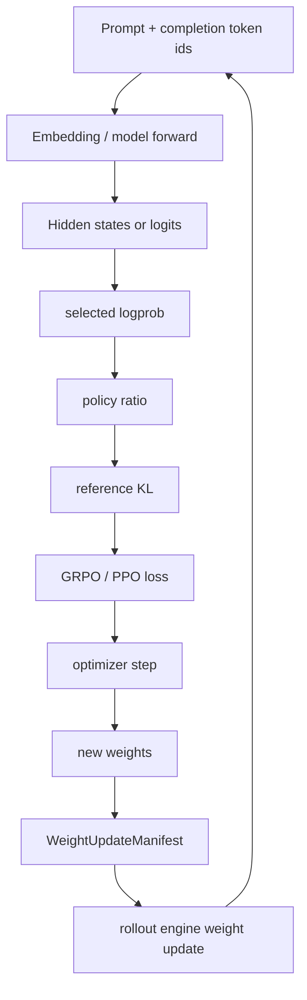

# RL-Kernel：把后训练里的“数值一致性”降到算子层

## 元信息与 TL;DR

- **项目**：[RL-Align/RL-Kernel](https://github.com/RL-Align/RL-Kernel)
- **类型**：代码项目深读
- **方向**：大模型后训练基础设施
- **本周证据**：GitHub PR #169 在 **2026-06-29T14:26:52Z** 合并，仓库 `pushed_at` 为 **2026-06-29T14:30:16Z**。
- **本轮更新点**：新增 `NativeEmbeddingOp` 纯 PyTorch ground-truth reference、注册表 dispatch wiring、operator 文档和 `tests/test_embedding.py` 的 11 类数值契约测试。
- **核心问题**：GRPO/PPO/DPO 后训练不只卡在算法，而是卡在 rollout engine 与 training engine 的数值路径是否一致。
- **核心机制**：RL-Kernel 把 logprob、ratio/KL、GRPO loss、linear-logp、embedding、weight sync 等高风险环节拆成可注册、可回退、可测试的 operator。
- **关键数字**：README 声称在 A100 80GB、Llama-3-8B、SeqLen 512 的 logprob 场景里，`G=256` 时 TRL OOM，PyTorch native 约 62.63 GB，RL-Kernel 约 63.12 GB 且成功；sampling 表中 `G=32` 从 176.79 ms 降到 1.08 ms。
- **更细证据**：`linear-logp` 文档给出 H100 bf16、`N=4096,D=2048,V=131072` 时 native forward 峰值约 5120 MB，fused path 前向激活约 0 MB；GRPO loss 文档给出大 vocab 下 forward VRAM 从 8192 MB 到约 0 MB。
- **局限**：这些 benchmark 多来自项目文档，不等同第三方复现；embedding 目前只有 PyTorch fallback，没有 CUDA/Triton/ROCm fused backend；GPU backward 在重复 token id 下仍依赖 deterministic algorithms 才能 bitwise reproducible。
- **研究意义**：它把“后训练是否稳定”从泛泛的 RL 调参问题，改写为一个更可审计的工程命题：哪些 tensor、哪些 backend、哪些 reduction order 会改变 policy ratio。

## 为什么这不是又一个 RLHF 框架？

### 问题不是“再写一个 Trainer”

- RL-Kernel 的 README 明确把自己放在 **operator layer**：
  - 上层可以是 vLLM、SGLang、LMDeploy、Megatron、DeepSpeed、TRL 或 slime 这类系统。
  - 项目自己负责更低层的 selected logprob、ratio/KL、GRPO loss、sampling、attention、weight sync。
  - 目标不是替换训练框架，而是在训练与推理之间提供数值更可控的桥。

- 这件事对后训练尤其关键：
  - rollout 阶段通常由推理引擎生成 samples。
  - training 阶段通常由另一个引擎计算 loss 和梯度。
  - 两边如果 logprob 路径不一致，importance ratio 会漂移。
  - ratio 漂移会把算法层的 clip、KL penalty、reward normalization 变成“看似正确、实际偏移”的训练信号。

### 项目的基本主张

| 主张 | 机制 | 证据 | 边界 |
| --- | --- | --- | --- |
| 后训练瓶颈在 operator consistency | 用 registry 将相同逻辑路由到 CUDA/Triton/ROCm/PyTorch fallback | `KernelRegistry` 为 `logp`、`grpo_loss`、`linear_logp`、`ratio_kl`、`embedding` 设置 priority map | registry 只能选择已实现 backend，不能自动保证所有 fused kernel 正确 |
| 大 vocab logprob 会制造内存墙 | 避免 materialize `[B,S,V]` 或 `[N,V]` logits/log-softmax | `linear-logp` 与 GRPO 文档都强调 online softmax 和 chunked backward | 性能数字需要在具体 GPU、dtype、shape 下复现 |
| 训练/推理权重同步需要显式生命周期 | `WeightUpdateManifest`、`publish`、`import_update`、`acknowledge`、`reject`、`release` | `weight-sync-bridge.md` 给出 shared-memory、cuda-vmm、cuda-ipc、local-clone 四类 transport | 它规定协议，不消除底层 CUDA IPC 或 driver 能力差异 |
| 本周 PR 建立 WS1 第一环 reference | `NativeEmbeddingOp.forward_fp32()` 作为 ground truth | PR #169 新增 embedding op、文档、registry wiring、11 类测试 | 只覆盖 embedding，后续 fused backend 仍待实现 |

## 系统架构：从 policy token 到 loss 的关键路径

### 读代码后可以把数据流压成一条线



- 这条线里最容易被忽略的不是模型结构，而是 **算子等价性**：
  - `selected logprob` 如果由不同引擎实现，可能产生 dtype、reduction order 或 mask 语义差异。
  - `ratio = exp(logp_current - logp_old)` 会放大小差异。
  - GRPO 的 group normalization 会继续把 reward 尺度与 token mask 绑定在一起。
  - rollout engine 若读取半更新权重，会让 old policy、new policy 和 reference policy 的关系失真。

### registry 是项目的控制平面

- `KernelRegistry.get_op(op_type)` 的流程很朴素：
  - 先通过 `device_ctx` 判断 `cuda`、`rocm` 或 `cpu`。
  - 再读取该平台下某个 logical op 的 backend priority list。
  - 逐个 import backend class。
  - 成功实例化后缓存。
  - 失败 backend 在当前进程内跳过。

- 这使同一段上层训练代码可以写成：
  - `kernel_registry.get_op("logp")`
  - `kernel_registry.get_op("linear_logp")`
  - `kernel_registry.get_op("grpo_loss")`
  - `kernel_registry.get_op("embedding")`

- 但它也暴露了一个边界：
  - registry 是 routing，不是 correctness proof。
  - correctness 仍要靠每个 operator 的 reference semantics、测试、benchmark 和 fallback。

## 本周更新：NativeEmbeddingOp 为什么值得单独写？

### 表面看只是 `weight[token_ids]`

- PR #169 新增的核心实现很短：
  - `NativeEmbeddingOp.forward(token_ids, weight)`
  - `NativeEmbeddingOp.forward_fp32(token_ids, weight)`
  - 内部使用 `F.embedding(token_ids.long(), weight)`
  - `forward` 输出 weight dtype。
  - `forward_fp32` 输出 fp32。

- 如果只看功能，它确实只是 embedding row gather。

- 但 PR 文档把它放进 **WS1 batch-invariant forward chain**：
  - embedding 是 Qwen3/Llama 栈的第一层。
  - Qwen3-8B 的输入 embedding 表尺寸是 `[151936,4096]`。
  - 该表与 `lm_head` 不共享权重，因为 `tie_word_embeddings=false`。
  - fused CUDA/Triton/ROCm kernels 未来要以这个 PyTorch reference 为 golden source。

### 真正重要的是两个 alignment axis

| 轴 | 这次 PR 的定义 | embedding 为什么特殊 | 测试方式 |
| --- | --- | --- | --- |
| Axis-A | batch invariance / reproducibility | 每个 token 的 row gather 不依赖同 batch 里有多少 token | full batch 计算后切片，对 slice/padding 做 `torch.equal` |
| Axis-B | dtype accuracy path | gather 没有 reduction，没有 fp32 accumulation | fp32、bf16、fp16 都与 direct indexing bitwise equal |

- 这和 matmul、softmax、norm、attention 不一样：
  - matmul 有 accumulation order。
  - softmax 有 logsumexp 和在线归约。
  - attention 有 mask、block、KV cache 和 backend 分歧。
  - embedding 是 lossless gather，所以它可以作为最干净的第一块 reference。

### 这次 PR 的文件改动说明了项目的工程风格

| 文件 | 作用 | 读后判断 |
| --- | --- | --- |
| `rl_engine/kernels/ops/pytorch/linear/embedding.py` | 定义 `NativeEmbeddingOp` | 实现极短，但强制保留 `forward` / `forward_fp32` 双路径 |
| `rl_engine/kernels/registry.py` | 注册 `PYTORCH_NATIVE_EMBEDDING` | CUDA、ROCm、CPU 当前都 dispatch 到 PyTorch reference |
| `tests/test_embedding.py` | 202 行测试 | 覆盖 bitwise correctness、dtype、padding、purity、gradient、real-shape smoke |
| `docs/operators/embedding.md` | operator contract | 写清 shape、dtype、dispatch、known limitations |
| `docs/.nav.yml` 与 operators index | 文档导航 | 说明这不是隐藏工具，而是公开 operator contract |

## 公式：后训练为什么会被 logprob 路径拖住？

### GRPO loss 的核心结构

```text
Input:
  policy_logits: 当前策略 logits
  ref_logits:    冻结参考策略 logits
  action_ids:    rollout 中实际采样的 token
  old_logps:     behavior policy 缓存 logprob
  rewards:       每条 completion 的 reward
  mask:          有效 completion token

Step:
  ratio = exp(logp_current - old_logps)
  adv   = normalize_group(rewards)
  clipped = clamp(ratio, 1 - eps, 1 + eps) * adv
  policy_loss = -mean(min(ratio * adv, clipped), mask)
  kl = reference_kl(policy_logits, ref_logits, action_ids, mask)
  loss = policy_loss + beta * mean(kl, mask)
```

- 这里最危险的变量是 `ratio`：
  - 它直接比较 current policy 与 behavior policy。
  - 如果 current logprob 是训练引擎算的，old logprob 是 rollout 引擎缓存的，两者数值路径不同就会产生偏移。
  - `exp` 会把 logprob 差值变成乘法尺度。

- 所以 RL-Kernel 的 operator 目标不是“写得更快”这么简单：
  - 它要减少 `[B,T,V]` 的内存爆炸。
  - 它要把 mask-before-exp、online softmax、selected token gather 这些细节固定下来。
  - 它要让 fallback reference 和 fused backend 有同一个可测试语义。

### Linear LogP 的内存公式

```text
Naive path:
  logits = hidden @ W^T + bias      # [N,V]
  logp   = log_softmax(logits)      # [N,V]
  out    = gather(logp, target_ids) # [N]

Fused path:
  for vocab_tile in V:
      z_tile = hidden @ W_tile^T
      online_update_logsumexp(z_tile)
      capture_target_logit_if_tile_contains_target
  out = target_logit - logsumexp_all_tiles
```

- 如果 `N=4096`、`V=131072`，只 materialize 一个 fp16 logits 张量就已经接近 1 GB 量级。
- 如果还保留 log-softmax、梯度中间量和 backward 需要的激活，峰值会继续上升。
- 项目文档给出的 H100 表里，`4096×2048×131072` forward native 峰值约 5120 MB，fused forward 激活约 0 MB。

### Embedding 的 reference 公式

```text
out = F.embedding(token_ids.long(), weight)

forward:
  return out.to(weight.dtype)

forward_fp32:
  return out.to(float32)
```

- `token_ids` 是整数索引，不可微。
- `weight` 是浮点 embedding table，可微。
- forward 是 row gather，没有浮点加法。
- 因此 output 可以 bitwise equal 于 direct indexing。
- 但 backward 对 `weight.grad` 是 scatter-add：
  - 如果 token id 重复，同一行会累加多次。
  - CUDA 上 atomic add 顺序可能不确定。
  - PR 的测试用 `torch.use_deterministic_algorithms(True)` 固定这个边界。

## 性能证据：哪些数字有用，哪些要保留怀疑？

### README 层面的 benchmark

| 场景 | 基线 | RL-Kernel 声称 | 能说明什么 | 不能说明什么 |
| --- | --- | --- | --- | --- |
| A100 80GB，Llama-3-8B，SeqLen 512，logprob，G=256 | TRL OOM | RL-Kernel 成功，约 63.12 GB | 大 group GRPO 的显存压力来自 logprob 路径 | 不能证明所有模型和所有 batch 都同样收益 |
| Sampling latency，G=32 | Native PyTorch 176.79 ms | fused 1.08 ms | sampling bottleneck 可由 fused backend 改善 | 表格没有替代实现的完整配置细节 |
| Qwen3-30B-A3B MoE | 权重约 56.9 GB，A100 只剩约 23 GB headroom | 项目展示真实大模型压力 | MoE 后训练的内存余量很窄 | 图表仍需复现实验脚本验证 |

### Operator 文档层面的 benchmark

| Operator | 文档证据 | 研究意义 |
| --- | --- | --- |
| `grpo_loss` | `V=131072` 时 native forward peak 8192 MB，Triton 约 0 MB；fwd speedup 10.3x | GRPO loss 的 vocab 维度是显存主因，online ratio/KL 是关键 |
| `linear_logp` | H100 上 `V=50257`，SM90 forward 4.88 ms，native 9.96 ms，Triton 9.82 ms | fused LM-head projection 可避免 `[N,V]` 落 HBM |
| `linear_logp` | `V=131072` 时 native forward 7.28 ms、SM90 12.88 ms，但 native 峰值 5120 MB | native cuBLAS 可能更快，但用显存换速度 |
| `embedding` | 暂无 fused benchmark | 它是 correctness reference，不是性能优化点 |

- 这些数字最适合支持一个判断：
  - 后训练基础设施的“快”与“稳”经常不是同一目标。
  - native materialization 可能在某些 shape 上 latency 更低。
  - fused streaming path 的价值在于显存曲线不随 vocab 线性爆掉。
  - 训练者要根据 bottleneck 选择 backend，而不是把 fused 当绝对更快。

## Weight Sync Bridge：为什么权重更新也属于后训练算子边界？

### rollout worker 不能读半更新模型

- `weight-sync-bridge.md` 把一次权重发布建模为完整生命周期：
  - training side 发布 `state_dict + version`。
  - bridge 生成 `WeightUpdateManifest`。
  - rollout side import tensors。
  - runtime install full update。
  - 成功则 `acknowledge`。
  - 失败则 `reject`。
  - 最后 `release` buffer 或 handle。

- 这不是普通工程包装：
  - 后训练 loop 里，rollout policy 与 training policy 的版本关系会进入 loss。
  - 如果 rollout engine 静默读到半更新模型，old logps 与当前权重不再对应。
  - 这种错误不会像 OOM 一样显式失败，而是表现为训练曲线变差、KL 异常或 reward hacking。

### 四类 transport 的取舍

| Transport | 使用场景 | 优点 | 风险 |
| --- | --- | --- | --- |
| `local-clone` | 单进程测试 | 最容易验证 manifest、ack、release | 有拷贝，不代表生产性能 |
| `shared-memory` | CPU 跨进程 smoke | 能测试本地生命周期 | 不覆盖 GPU aliasing |
| `cuda-vmm` | 同节点 CUDA zero-copy | 更接近生产 weight handoff | 依赖 CUDA VMM 能力 |
| `cuda-ipc` | 旧式 PyTorch CUDA IPC | 对部分 runtime 兼容 | 某些 WSL2/driver 会 invalid resource handle |

- 文档特别强调：
  - `weight_version` 必须单调递增。
  - consumer 只应在 runtime 安装完整 tensor set 后 acknowledge。
  - install 失败要 reject，并保留旧 active version。

## 伪代码：一个可审计的 RL-Kernel 后训练 step

```text
Input:
  prompt batch P
  rollout engine R
  training model M
  reference model Ref
  reward function reward_fn
  kernel_registry K
  weight_bridge W

State:
  active_weight_version
  old_logps
  completion_mask
  backend_choice

Loop:
  1. R.generate(P) -> completions, action_ids, old_logps
  2. reward_fn(completions) -> rewards
  3. K.get_op("embedding") or model embedding path -> hidden
  4. K.get_op("linear_logp") or K.get_op("logp") -> current selected logps
  5. K.get_op("ratio_kl") -> ratio, reference_kl
  6. K.get_op("grpo_loss") -> loss
  7. loss.backward()
  8. optimizer.step()
  9. W.publish(M.state_dict(), version = active_weight_version + 1)
  10. rollout worker import_update(manifest)
  11. if full install succeeds:
          acknowledge(update_id)
          active_weight_version += 1
      else:
          reject(update_id, reason)
          keep previous active version
  12. release(update_id)

Output:
  updated policy
  versioned rollout runtime
  backend and numerical-drift audit trail

Failure boundaries:
  - fallback backend unavailable -> registry raises
  - fused kernel differs from reference -> operator tests should fail
  - repeated embedding ids on CUDA backward -> deterministic algorithms needed for bitwise gradient
  - CUDA IPC unsupported -> use cuda-vmm or mark transport blocked
```

## 本周 PR 的测试设计：为什么 11 类测试比实现更重要？

### 测试不是只跑 happy path

- `tests/test_embedding.py` 覆盖：
  - fp32、bf16、fp16 correctness。
  - output shape。
  - non-int64 token id 自动 `.long()`。
  - batch slicing invariance。
  - padding invariance。
  - input purity。
  - gradient flow to `weight`。
  - unused rows gradient 为 0。
  - registry dispatch。
  - Qwen3-8B 真实尺寸 GPU smoke。

- 这套测试值得注意的点：
  - 它没有把 `allclose` 当默认答案。
  - 对 embedding 这种 lossless gather，直接要求 `torch.equal`。
  - 对 real-shape smoke，项目避免每次都分配 2.5 GB，而是只在 GPU 显存足够时运行。

### Qwen3-8B 真实尺寸 smoke 的意义

| 参数 | 值 | 为什么重要 |
| --- | --- | --- |
| vocab | 151936 | 覆盖真实大模型词表尺寸，而不是只在 toy vocab 上测试 |
| hidden | 4096 | 覆盖真实 embedding width |
| weight fp32 | 约 2.49 GB | 显示 full table reference 的资源成本 |
| boundary ids | `0` 与 `vocab-1` | 覆盖索引边界 |
| batch/seq | `2×16` | 控制测试负载，不把 smoke 变成 benchmark |

- 这个设计的研究价值在于：
  - reference 可以小规模验证逻辑。
  - 真实尺寸 smoke 用来发现 shape 或边界错误。
  - fused backend 后续加入时，可以沿用同一个 contract。

## 和已有后训练工具的区别

| 工具/方向 | 典型关注点 | RL-Kernel 的相对位置 |
| --- | --- | --- |
| TRL | 算法 API、trainer、数据流 | RL-Kernel 更底层，解决 selected logprob、GRPO loss、kernel dispatch |
| DeepSpeed-Chat / Megatron | 大规模训练执行 | RL-Kernel 可作为 operator 和 bridge，不替代训练栈 |
| vLLM / SGLang | 高吞吐 rollout | RL-Kernel 关心 rollout 结果如何与 training numerics 对齐 |
| Liger Kernel | 训练 kernel 优化 | RL-Kernel 更聚焦 RL post-training 的 ratio/KL/logprob/weight sync |
| verl / slime / miles | RLHF/RLVR 编排 | RL-Kernel 可作为它们下面的 kernel/transport 层 |

- 因此它的最佳阅读方式不是“又一个框架能不能开箱训练模型”。
- 更准确的问题是：
  - 它能否把后训练最容易漂移的 tensor path 变成可检查模块？
  - 它能否把 fused backend 与 PyTorch reference 之间的差异约束在测试里？
  - 它能否让生产 rollout engine 的权重更新不再靠隐式约定？

## 证据边界与复现风险

### 需要谨慎的地方

- benchmark 是项目文档提供：
  - 可信度高于营销短帖。
  - 但仍不是独立复现。
  - 不同 GPU、driver、PyTorch、CUDA、Triton、FlashInfer 版本会改变结果。

- embedding op 目前是 reference：
  - 它的价值在 correctness。
  - 不能把它解读成性能优化。
  - CUDA/Triton/ROCm fused embedding 仍是 planned。

- registry fallback 可能隐藏性能差异：
  - 如果 fused backend import 失败，训练代码可能仍能跑。
  - 但跑的可能是 PyTorch native。
  - 严格 benchmark 必须记录实际 backend class。

- weight bridge 是协议层：
  - 它可以让 publish/import/ack/reject/release 明确化。
  - 它不能保证 vLLM 或 driver 一定支持目标 transport。
  - 文档中也承认某些 CUDA IPC runtime 会失败。

## 代码细读：哪些实现细节决定了项目可信度？

### `NativeEmbeddingOp` 的“短代码长契约”

- 这段实现最容易被误读成“没有技术含量”：
  - 输入 `token_ids`。
  - 输入 `weight`。
  - 调用 `F.embedding`。
  - 输出 gathered rows。

- 但它真正解决的是 reference contract 的三个问题：
  - **谁负责把 token id 转成 int64**：实现里统一 `.long()`，避免调用方传 int32 时出现隐式差异。
  - **谁负责定义 dtype 语义**：`forward` 回到 `weight.dtype`，`forward_fp32` 明确给 fp32 golden path。
  - **谁负责说明不做什么**：不检查 out-of-range token id，不伪装成 fused kernel，不承诺 CUDA backward 在默认 atomic add 下 bitwise 稳定。

- 这种写法对后训练基础设施很重要：
  - 算子越底层，越不应该把边界藏在调用方经验里。
  - reference op 不是为了覆盖所有优化路径，而是为了让后续优化路径必须解释自己和 reference 的差异。
  - 当 fused embedding 后端未来加入 registry priority map 时，它必须面对这份文档和测试，而不是重新定义正确性。

### `tests/test_embedding.py` 的真正价值

| 测试点 | 表面检查 | 后训练意义 |
| --- | --- | --- |
| dtype 三参测试 | fp32、bf16、fp16 都 bitwise 对齐 | 防止低精度路径被默默改成另一种 cast 规则 |
| non-int64 ids | int32 token id 也可用 | rollout engine 常用不同 integer dtype，reference 要容忍输入差异 |
| slice invariance | full batch 与 sliced batch 一致 | 训练大 batch、推理小 batch 不应改变同一 token 的 embedding |
| padding invariance | 加 padding 不影响真实 prefix | completion 长度不同是 RL rollout 常态 |
| purity | 不改 token_ids 和 weight | reference op 不能隐藏状态副作用 |
| sparse gradient | 未索引 row 的 gradient 为 0 | embedding table 很大，错误梯度会污染未访问 token |
| real-shape smoke | Qwen3-8B 的真实 vocab/hidden | 避免 toy shape 掩盖真实边界 id 与显存问题 |

- 这套测试也暴露一个研究方法：
  - 先选择一个最简单、最可证明的 operator。
  - 对它使用最严格的 bitwise 标准。
  - 再把同样的测试思想推广到更难的 operator。

- 也就是说，embedding PR 不只是添加功能。
- 它是在建立“未来每个 WS1 operator 都要写清 reference、axis、dtype、batch invariance、真实 shape smoke”的模板。

### `KernelRegistry` 的优点和危险

- 优点：
  - 上层训练代码不用显式知道当前机器是 CUDA、ROCm 还是 CPU。
  - backend import 失败时可以 fallback。
  - 成功实例缓存，避免重复构造。
  - CUDA 上可以根据 compute capability 插入 SM90 fused backend。

- 危险：
  - fallback 会让实验“能跑”，但不一定“跑在你以为的 backend 上”。
  - 如果论文或实验报告只写 “use RL-Kernel”，没有写实际 `op.__class__.__name__`，读者无法判断性能和数值路径。
  - 失败 backend 被记录在当前进程中，长进程实验需要把这一状态写进日志，否则调试时会误判。

- 因此，一个更严谨的训练日志至少应该记录：
  - `logp_backend`
  - `linear_logp_backend`
  - `ratio_kl_backend`
  - `grpo_loss_backend`
  - `embedding_backend`
  - CUDA compute capability
  - extension symbols 是否存在
  - 是否启用 deterministic algorithms

## 失败案例推演：如果没有这些契约会怎样？

### 案例一：policy ratio 看起来正常，其实来源不一致

- 场景：
  - rollout engine 用 vLLM 生成 completion。
  - training engine 用 PyTorch/DeepSpeed 重新计算当前 logprob。
  - old logps 来自 rollout 缓存。

- 可能问题：
  - rollout 和 training 的 tokenizer padding 处理不同。
  - selected token 的 mask 位置不同。
  - dtype path 不同。
  - log-softmax 是否 materialize、是否 online streaming 不同。

- 后果：
  - `ratio = exp(logp_current - old_logps)` 被系统性偏移。
  - clip 看起来生效，但 clip 的对象已经不是同一语义。
  - KL 曲线可能被解释为策略变保守或激进，实际只是算子路径不一致。

### 案例二：fused kernel 提速，但把 reference 语义改掉了

- 场景：
  - 团队为 `linear_logp` 写了一个更快 CUDA kernel。
  - benchmark latency 很漂亮。
  - 但 target logit capture、online logsumexp 或 bias handling 有一处边界差异。

- 如果没有 reference：
  - 训练曲线可能短期上升。
  - 研究者会把提升归因于 reward、数据或算法。
  - 实际提升来自错误 logprob。

- 如果有 reference：
  - fused backend 必须和 PyTorch native 对齐。
  - forward/backward 都要测。
  - 大 vocab、mask、bias、dtype 都要测。
  - 性能优化不能绕过 correctness oracle。

### 案例三：权重同步成功返回，但 rollout 读到旧版本

- 场景：
  - trainer 发布新权重。
  - rollout worker 尝试安装。
  - 某个 tensor transport 失败或部分安装。
  - 上层代码没有显式 reject。

- 后果：
  - rollout policy 版本和训练日志版本不一致。
  - old logps 与实际生成 policy 不匹配。
  - 后续 loss 仍可计算，但实验不可解释。

- `WeightUpdateManifest` 的意义：
  - 它把一次权重更新变成可命名对象。
  - 它要求 import、acknowledge、reject、release 都有状态。
  - 它把“我以为 rollout 已经更新”改成“这个 update_id 是否被确认安装”。

## 和近期后训练趋势的关系

### 为什么 RLVR 越流行，operator 层越重要？

- RLVR 的吸引力在于 reward 可验证：
  - 数学题可以验答案。
  - 代码题可以跑测试。
  - 工具任务可以查环境状态。

- 但 reward 可验证不代表训练信号完全可信：
  - reward 只告诉你 completion 是否好。
  - ratio 告诉你策略更新是否在合理步长内。
  - KL 告诉你是否偏离 reference。
  - logprob 路径错误会污染 ratio 和 KL。

- 因此 RLVR 系统里至少有两层 verifier：
  - 任务层 verifier：答案、测试、环境状态。
  - 算子层 verifier：logprob、ratio、KL、loss、weight version。

- RL-Kernel 更接近第二层。
- 它不评价答案对不对。
- 它评价“训练时用于更新模型的数字是不是来自同一份数学定义”。

### 为什么 agent 后训练更容易需要它？

- Agent rollout 比普通聊天更复杂：
  - 多步 action。
  - 工具调用。
  - 长上下文。
  - 动态终止。
  - 轨迹长度不均匀。

- 这些特点会放大 operator 风险：
  - padding 更多，mask 更重要。
  - old/new policy 时间差更大。
  - rollout worker 与 trainer 更可能分离部署。
  - 权重更新可能发生在长任务之间。
  - token-level logprob 与 trajectory-level reward 的映射更长。

- 所以 agent 后训练不能只讨论“让 agent 学会工具使用”。
- 还要讨论：
  - 工具轨迹的 token mask 怎么定义。
  - 哪些 token 进入 loss。
  - old logps 是否和当时的 tool-call policy 对齐。
  - reward 分组是否对应同一 prompt 的 samples。
  - rollout 进程是否已安装最新权重。

## 一个更严格的报告模板

### 如果用 RL-Kernel 做实验，我希望作者报告这些字段

| 字段 | 为什么必须写 |
| --- | --- |
| model checkpoint | 决定 embedding table、lm_head、tie weights |
| tokenizer version | token id 与 vocab 边界依赖它 |
| rollout backend | old logps 与 samples 的来源 |
| training backend | current logps 与 gradient 的来源 |
| operator backend class | 判断是否真的用了 fused kernel |
| dtype | bf16/fp16/fp32 影响 reference 对齐 |
| mask convention | completion token、padding token、prompt token 是否进入 loss |
| group size | GRPO advantage normalization 的统计单元 |
| KL beta / clip eps | loss 解释必须有 |
| weight version protocol | rollout policy 与 training policy 如何同步 |
| deterministic flags | bitwise reproducibility 依赖它 |

- 这些字段看起来琐碎，但它们是复现后训练曲线的底座。
- 只给 reward curve 和 benchmark 分数，不给 operator path，复现实验会缺关键变量。

## 逐项设计评注：哪些部分最可能影响真实训练？

### GRPO loss：把 reward normalization 和 vocab 维度分开看

- GRPO 的表面公式很简单：
  - 同一个 prompt 采样多条 completion。
  - 用组内 reward 均值和标准差得到 advantage。
  - 用 PPO 类似的 clipped surrogate 控制更新幅度。
  - 加 reference KL 防止策略偏离过远。

- 但工程上最重的部分不是 reward normalization：
  - reward 是 `[B]`。
  - advantage 扩展后是 `[B,T]`。
  - 真正重的是 logits 或 log-softmax 的 `[B,T,V]`。

- RL-Kernel 文档把这两层拆开是合理的：
  - ratio/KL 负责 vocab 维度的 online softmax。
  - group norm 只处理序列级 reward。
  - clipped surrogate 再在 masked token 上做 reduction。

- 这种拆法的好处是：
  - 可以单独验证 ratio/KL 的数值。
  - 可以单独验证 reward grouping。
  - 可以把显存优化集中在 vocab 维度，而不是把整个 GRPO loss 写成一个不可拆的黑盒。

### Linear LogP：为什么“更省显存但不总是更快”仍然有价值？

- 文档里的 H100 表有一个容易被忽略的细节：
  - 在某些 shape 上，native cuBLAS materialized path 的 forward latency 仍可能更低。
  - 但 native 的代价是 `[N,V]` 激活峰值。
  - fused path 牺牲部分 raw latency，换来显存随 vocab 更稳定。

- 对后训练来说，这个 tradeoff 通常值得：
  - GRPO 想扩大 group size。
  - 长 CoT 想扩大 completion length。
  - 大词表模型想保留更大的 batch。
  - 这些目标都先受显存限制，再受单 kernel latency 限制。

- 因此评估 fused linear-logp 时不应只看毫秒：
  - 要看同一显存预算下能否跑更大的 `G`。
  - 要看 backward 是否需要保存大 logits。
  - 要看 recompute 带来的计算代价是否被 batch 扩大抵消。
  - 要看最终 tokens/sec 或 samples/sec，而不是孤立 kernel latency。

### Ratio/KL：mask 语义比公式更容易出错

- policy ratio 的数学式很短：
  - `ratio = exp(logp_current - logp_old)`

- 但实现里至少有几个危险边界：
  - padding token 是否进入 exp。
  - prompt token 是否进入 completion loss。
  - invalid token 是否先 mask 再 exp。
  - reference KL 是否只在 action token 上估计。
  - old logps 是否来自同一次 rollout。

- 这些边界一旦出错，训练不会立刻报错：
  - loss 仍有数值。
  - backward 仍能执行。
  - reward 仍可能上涨。
  - 但 ratio 的语义已经不是算法论文里的 ratio。

- 所以 RL-Kernel 把 ratio/KL 单独做 operator 是合理的：
  - 它让 mask convention 可以被测试。
  - 它让 online softmax 的稳定性可以被测试。
  - 它让 GRPO loss 不必重复实现这段脆弱逻辑。

### Weight bridge：版本单调性是训练语义的一部分

- 很多系统把权重同步当部署问题：
  - 推理服务加载新权重。
  - 训练服务继续更新。
  - 中间通过队列或共享内存传递。

- 在 RL post-training 里，这其实是算法语义：
  - old policy 是哪个版本？
  - current policy 是哪个版本？
  - rollout sample 对应哪个 version？
  - reward 与 logprob 是否对齐？

- `weight_version` 单调递增的要求因此不是形式主义：
  - 它让每条 rollout 可以追踪到模型版本。
  - 它让失败 install 可以保留旧 active version。
  - 它让 release 不会过早释放仍被 rollout 使用的 tensor。

- 如果缺少这层协议，训练日志里即使写了 seed 和 checkpoint，也可能无法解释某段 rollout 到底来自哪个模型。

### Embedding reference：小算子先立规矩

- embedding 是最适合先建立规则的地方：
  - 它没有 reduction。
  - 它没有随机性。
  - 它没有复杂 mask。
  - 它的正确性可以 bitwise 定义。

- 先从这里开始有两个好处：
  - 团队可以验证测试框架、文档模板、registry wiring 是否顺畅。
  - 后续更复杂 operator 可以继承同一套写法，而不是每个 PR 重新争论“什么叫正确”。

- 这也是我认为 PR #169 值得报道的原因：
  - 它不是最大功能。
  - 它不是最高性能。
  - 它是基础设施项目成熟度的信号。

### 最终判断：这类项目应按“实验仪器”而不是“训练配方”来读

- 读 RL-Kernel 时，不应期待它直接回答“哪种 reward 最好”。
- 它更像一套实验仪器：
  - 校准 logprob 的计算方式。
  - 校准 ratio 与 KL 的语义。
  - 校准 fused kernel 与 reference 的偏差。
  - 校准 rollout 权重版本是否真实切换。

- 如果仪器没有校准，后训练实验的结论会很脆弱。
- 如果仪器校准充分，研究者才能更有把握地区分：
  - 算法真的更好。
  - reward 设计真的有效。
  - 数据筛选真的起作用。
  - 或者只是数值路径和系统版本制造了假象。

### 我会如何复现它？

1. 先只跑 CPU/PyTorch fallback：
   - `python -m pytest tests/test_embedding.py -v`
   - `python -m pytest rl_engine/tests/test_dispatch.py -v`

2. 再确认 CUDA extension 是否真的编译：
   - 记录 `kernel_registry.get_op("linear_logp").__class__.__name__`
   - 记录 `kernel_registry.get_op("logp").__class__.__name__`

3. 再跑 shape-controlled benchmark：
   - 固定 `N,D,V,dtype`
   - 固定 CUDA/PyTorch/Triton 版本
   - 记录 peak allocated、reserved、latency percentile

4. 最后才放进完整 RL loop：
   - 先比较 selected logprob 与 reference。
   - 再比较 ratio/KL。
   - 再比较 loss 和 backward。
   - 最后接 weight bridge。

## 对后训练研究的启发

### 研究者应把“数值路径”当作实验变量

- 很多 RLVR/GRPO 报告会写：
  - reward function。
  - sampling temperature。
  - KL coefficient。
  - SFT checkpoint。
  - prompt set。

- 但它们较少写：
  - selected logprob 是哪个 backend 算的。
  - old logps 是 rollout 时缓存还是 training 时重算。
  - mask 在 exp 前还是 exp 后应用。
  - vocab 维度是否 materialize。
  - reference model 的 logits 是否与 policy logits 同 dtype。
  - rollout worker 是否可能读到半更新权重。

- RL-Kernel 的价值正是在提醒：
  - 后训练实验里，这些都不是实现细节。
  - 它们可能改变 ratio、KL、loss，最终改变策略。

### “算子级一致性”也是一种安全机制

- 如果把 safety alignment 看作 reward/modeling 问题，会漏掉一类工程风险：
  - agent 或模型在 rollout 中表现变好，可能是因为 ratio path 错了。
  - reward hacking 可能来自 environment，也可能来自训练信号漂移。
  - weight update race 可能制造不可解释的策略突变。

- 因此 operator-level audit 可以服务 AI safety：
  - 不是检测有害输出。
  - 而是防止训练系统自己制造不可追踪的分布漂移。
  - 这对大规模 agent 后训练尤其重要，因为 agent rollout 更长、工具调用更多、old policy 与 new policy 的时间差更明显。

## 结论

- RL-Kernel 当前最值得关注的不是某个单一 benchmark，而是它的工程抽象：
  - logical operator。
  - backend priority。
  - PyTorch reference。
  - fused implementation。
  - numerical contract。
  - weight version lifecycle。

- 2026-06-29 合并的 `NativeEmbeddingOp` PR 是一个小而关键的例子：
  - 实现短。
  - 但它把 embedding 的 bitwise ground truth、Qwen3-8B real shape、gradient reproducibility boundary 和 registry dispatch 一起固定下来。

- 对后训练研究者来说，最有用的 takeaway 是：
  - 不要只问 GRPO 的 reward 和 clip 怎么调。
  - 还要问 selected logprob、ratio/KL、embedding、LM head、weight sync 这些路径是否有共同 reference。
  - 当 fused kernel 与 reference 不一致时，训练曲线上的“提升”可能只是数值路径上的幻觉。

- 当前局限也很清楚：
  - 文档数字还需要独立复现。
  - embedding 还没有 fused backend。
  - 部分 CUDA transport 依赖平台能力。
  - registry fallback 必须在实验记录里显式披露。

- 但正因为这些边界被写在文档和测试里，RL-Kernel 比许多只展示训练曲线的后训练项目更适合作为基础设施研究对象。
