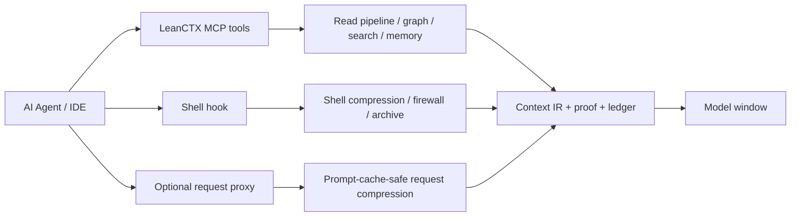
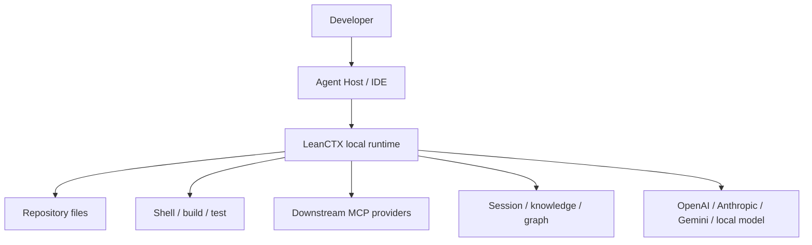

# LeanCTX：把 Agent 上下文从“越塞越多”改成可治理的运行层

### 元信息与 TL;DR

| 项目 | 信息 |
|---|---|
| 原始项目 | [yvgude/lean-ctx](https://github.com/yvgude/lean-ctx) |
| 本轮核验时间 | 2026-06-29T00:47:58Z |
| 官方新鲜度证据 | `d12286497d7fbdce73bcc48044f711918d81c388`，提交时间 `2026-06-29T02:23:40+02:00` |
| 类型 | 大模型 Agent 基础设施 / MCP 上下文运行时 |
| 适用对象 | 使用 Cursor、Claude Code、Codex、Gemini CLI、Copilot、Windsurf 或自建 MCP Agent 的开发者 |

#### TL;DR

- **这篇项目做什么**：LeanCTX 把 AI Agent 的文件读取、Shell 输出、MCP 工具、会话记忆、知识图谱和请求压缩放到一个本地 Rust 二进制里，目标不是“再写一个 Agent”，而是控制 Agent 在每一轮真正能看到什么。
- **它怎么做**：项目把上下文流分成 read path 与 wire path：前者通过 MCP 工具、Shell hook 和读模式压缩仓库/命令输出；后者通过可选代理压缩发往模型的 system prompt、历史和工具结果，并尽量保持 prompt-cache 友好。
- **核心证据**：README 声称常见场景可减少 60-90% token；Benchmark 文档在 50 个文件、457.6K raw tokens 上测得 `map` 模式压缩 97.7%、`signatures` 压缩 97.0%，30 分钟 coding simulation 从 686.1K tokens 降到 93.6K tokens，节省 86.4%。
- **工程边界**：源码目录显示它不是单 README 项目；Rust 侧有 `ctx_read`、`ctx_shell`、`ctx_graph`、`ctx_handoff`、`ctx_proof`、`ctx_knowledge`、`ctx_benchmark` 等大量工具模块，契约文档把 Context IR、Context Proof、A2A、Memory Boundary、Provider Framework 等表面列为 stable/frozen/experimental。
- **安全判断**：最有价值的设计不是压缩率，而是 PathJail、secret-like 文件默认阻断、角色化 I/O、archive redaction、Context Proof、evidence ledger 等“上下文治理”机制；这些机制把 Agent 安全从 prompt injection filter 扩展到“什么材料能进入模型窗口”。
- **局限**：Benchmark 多为项目自测或官方文档对比，第三方复现实验有限；`ctx_execute` 文档明确不是 OS 级沙箱；过度压缩可能损失语义，项目用 bounce tracking、CCR recovery 和 protected globs 缓解，但不能替代任务级验证。

### 1. 为什么这是 Agent 问题，而不是普通压缩工具？

Agent 系统里，上下文窗口不是“聊天历史的容器”，而是实际控制面：

- Agent 读到哪些文件，会影响它能不能理解代码结构。
- Agent 看到哪些 shell 输出，会影响它是否误判测试、构建或部署状态。
- Agent 接入多少 MCP 工具，会影响工具选择、系统提示长度和错误动作概率。
- Agent 记住哪些事实，会影响跨会话连续性，也会带来过期记忆和敏感信息风险。
- Agent 把哪些内容发给模型，会影响成本、延迟、缓存命中率和隐私边界。

LeanCTX 的切入点因此很明确：

> 不是让模型“更聪明”，而是把模型前面的上下文供应链变成可测量、可路由、可证明、可回滚的本地运行层。

这个定位和常见 repo map / prompt compressor 的差别在于：

| 层级 | 典型做法 | LeanCTX 想替换的环节 |
|---|---|---|
| 单次压缩 | 把一个文件、diff 或日志压短 | 每个读工具、每个 Shell 输出、每个 MCP 结果都进同一条管线 |
| 静态索引 | 提前生成仓库摘要 | 结合当前任务、读模式、图谱、缓存、预算动态选择粒度 |
| 记忆插件 | 单独保存 facts | 把 session、knowledge、gotchas、handoff bundle 纳入上下文契约 |
| 安全过滤 | 检测 prompt injection 或 secret | 在模型前设置 PathJail、角色权限、敏感度地板、审计和 proof |
| 成本优化 | 少发 token | 同时关注缓存稳定性、可恢复性、可验证 savings ledger |

### 2. 作者论证路线：token savings 只是收据

README 里有一句关键定位：token savings 是 receipt，不是 product。这个说法值得细读，因为它把项目从“省钱工具”推向“Agent 上下文操作系统”。

#### 2.1 Claim：Agent 性能瓶颈已经前移到上下文管理

LeanCTX 的隐含判断是：

- 大模型能力持续提升后，很多失败不再来自“模型完全不会”。
- 失败更常来自模型拿到了错误粒度、错误顺序、错误权限或过期的上下文。
- 因此，Agent 基础设施要治理的是 context supply chain。

可以把一次 Agent 调用写成简化公式：

```text
answer = Model(task, policy, history, tools, files, shell_output, memory)
```

LeanCTX 关心的不是单独优化 `Model`，而是优化右侧除任务以外的大部分输入：

| 变量 | 风险 | LeanCTX 的对应控制 |
|---|---|---|
| `policy` | 太长、易变、缓存不稳定 | proxy cache aligner、verbosity/effort 控制 |
| `history` | 重复、过期、压垮上下文 | transcript compact、session recovery、memory lifecycle |
| `tools` | 工具表太大，模型误选 | MCP tool gateway、dynamic tool categories |
| `files` | 读太多或读错粒度 | 10 种 read modes、smart read、graph-aware hints |
| `shell_output` | 构建日志或搜索结果爆炸 | 56 类 shell pattern、firewall、archive + expand |
| `memory` | 记忆丢失、污染或跨项目泄漏 | memory boundary、knowledge policy、ctxpkg、restore |

#### 2.2 Mechanism：在模型前放一个本地 choke point

项目最重要的架构动作是把多个入口统一到一个本地 chokepoint：



这张图的关键不是组件数量，而是方向：

- 所有工具输出进入模型前，都要经过 read / compression / governance 管线。
- 大输出不直接挤进窗口，而是变成摘要和可展开引用。
- 敏感路径和越界路径在上下文供应阶段被拒绝，而不是等模型“自觉不泄漏”。
- 每次节省和压缩可以进入 ledger/proof，而不是只在 README 里讲概念。

#### 2.3 Evidence：用 benchmark 与契约把“压缩”落到可检查对象

Benchmark 文档给了一个自测样本：

| 指标 | 数字 | 解释 |
|---|---:|---|
| 测量文件数 | 50 | 用同一仓库文件集测不同模式 |
| Raw tokens | 457.6K | 基线为不压缩读取 |
| `map` 模式 | 8.9K tokens / 97.7% compression | 适合理解结构、依赖和导出 |
| `signatures` 模式 | 11.8K tokens / 97.0% compression | 适合看 API surface |
| 30 分钟 raw simulation | 686.1K tokens / $1.715 | 不压缩的模拟会话 |
| LeanCTX + CCP | 93.6K tokens / $0.234 | 声称节省 86.4% |

这些数字的证据边界也要同时保留：

- 它们来自项目自带 Benchmark，不等于独立第三方评测。
- competitor 数字来自各自公开资料，不是同一机器上全部重跑。
- compression 高不自动等于任务成功率高；如果读模式选错，模型可能少看了真正关键的上下文。
- 项目承认需要 bounce tracking：如果模型反复从 compressed read 回到 full read，说明压缩策略过激。

### 3. 工程结构：它到底由哪些运行面组成？

从仓库结构看，LeanCTX 的主体是 Rust 工程。`rust/src/tools/` 下能看到大量 `ctx_*` 工具模块，说明它至少在代码层实现了多条 MCP 工具表面，而不是只有文档。

#### 3.1 读路径：从文件到结构化上下文

读路径的核心目标是让模型先看结构，再按需扩展细节。

| 读模式 | 作用 | 适合任务 | 风险 |
|---|---|---|---|
| `full` | 原文读取 | 精确编辑、验证 byte-level 内容 | token 成本高 |
| `map` | 结构图 / repo map | 快速理解文件职责、依赖、导出 | 可能漏实现细节 |
| `signatures` | API surface | 看函数、类型、接口 | 不适合定位逻辑 bug |
| `lines:N-M` | 指定行读取 | 从 map/signatures 定点展开 | 依赖前一步定位准确 |
| `diff` | 变化读取 | PR review、回归定位 | 对未提交状态敏感 |
| `density:X` / entropy | 按预算保留高信息行 | 大文件快速扫读 | 高信息行不一定是任务关键行 |

可以把读路径写成一个信息预算问题：

```text
给定任务 T、文件 F、预算 B：
选择 read_mode m，使
  usefulness(T, read(F, m)) / tokens(read(F, m))
最大，
同时保留 expand(F, span) 的回退路径。
```

其中最重要的约束是“可回退”：

- 如果压缩结果不可逆，Agent 一旦漏看内容就没有恢复路径。
- LeanCTX 用 content-addressed recovery、`ctx_expand`、line spans、archive store 等机制，让压缩输出能指回原文。
- 这不是完美保证，但比一次性裁剪掉内容更适合 Agent 工作流。

#### 3.2 Shell 路径：把命令输出也当上下文

很多 Agent 失败不是文件读错，而是命令输出污染上下文：

- `git status` 把大量无关文件塞进窗口。
- `cargo test` 或 `npm test` 输出重复 warning。
- `kubectl -o yaml`、`gh api`、`docker logs` 产生海量结构化文本。
- `rg` 搜索返回太多命中，模型把重要行淹没在噪声里。

LeanCTX 的 Shell hook 试图把这些输出分类处理：

| 输出类别 | 可能压缩策略 | 对 Agent 的意义 |
|---|---|---|
| Git status/log/diff | 摘要 changed files、commit、hunks | 保留版本状态，减少重复噪声 |
| Build/test logs | 去重 warning、突出 failures | 让模型先看失败根因 |
| JSON/YAML/CSV | columnar / JSON crusher | 保留结构，减少重复键和值 |
| 大搜索结果 | head/tail + archive ref | 防止一次搜索挤掉工作集 |

这里的研究意义在于：

> Agent 的工具输出不是“附属文本”，而是下一步决策的观察值。观察值需要压缩、排序、审计和可恢复，否则 Agent 的规划会被上下文噪声支配。

#### 3.3 记忆路径：跨会话上下文不是越多越好

LeanCTX 把 session memory、knowledge store、gotchas、procedural memory、handoff bundle 等都纳入文档。

这部分要用安全视角看：

- 记忆能减少 cold start，但也会传播旧事实。
- 记忆能保存项目约定，但也可能保存敏感信息。
- 记忆能跨 Agent handoff，但也可能跨边界泄漏。

Changelog 的 “Lossless memory & one consolidation engine” 提到几个机制：

- 低价值尾部写入 archive 后再从 live store 移除。
- consolidation 使用统一引擎，避免 CLI/MCP/后台流程语义不同。
- `knowledge restore` 可把 archived items 恢复到 live stores。
- `consolidate --dry-run` 先报告会导入和归档什么。

这说明作者意识到：

> 记忆治理不是简单“总结聊天记录”，而是容量、生命周期、可恢复性和作用域边界的组合。

### 4. 契约矩阵：为什么它不断强调 frozen / stable / experimental？

`CONTRACTS.md` 是这次深读里最有价值的材料之一，因为它把 LeanCTX 从“工具集合”提升成“可集成基础设施”。

#### 4.1 MCP 是传输，LCP 是语义

文档里把关系概括为：

```text
MCP = Agent 调用 LeanCTX 的外部互操作协议
LCP = LeanCTX 理解、转换和治理上下文的内部语义
```

这个区分很重要：

- MCP 只说明“怎么调用工具”。
- LCP/contract 才说明“上下文对象、proof、memory、handoff、provider、budget、degradation 应该长什么样”。
- 如果没有后者，多个 Agent 接同一个 MCP server 仍可能各说各话。

#### 4.2 关键契约与研究含义

| 契约 | 作用 | 对 Agent 系统的意义 |
|---|---|---|
| Context IR v1 | 记录上下文来源、lineage、tokens、compression ratio、安全元数据 | 让“模型看到了什么”可审计 |
| Context Proof v1 | 输出可复现证明 artifact | 让 compression / savings 不只是运行时日志 |
| Degradation Policy v1 | 预算或 SLO 触发时如何降级 | 防止上下文压力下行为不可预测 |
| Workflow Evidence Ledger v1 | 记录证据门控的 workflow transition | 适合多步 Agent 任务审计 |
| CCP Session Bundle v1 | 会话导入导出 | 支持跨会话恢复和跨 Agent handoff |
| Memory Boundary v1 | 记忆作用域和隐私边界 | 防止跨项目、跨用户、跨团队污染 |
| Provider Framework v1 | 外部上下文源接口 | GitHub/Jira/Postgres 等结果也进入统一治理 |
| A2A Contract v1 | 多 Agent 注册、任务、handoff | 把协作上下文转成可传输 bundle |

#### 4.3 为什么 frozen contract 对 Agent 很关键？

Agent 工具生态有一个常见问题：

- 工具接口升级后，旧 Agent prompt、旧 MCP host、旧自动化脚本悄悄失效。
- schema 小变更可能让模型生成旧字段或遗漏新字段。
- proof / audit 如果不可回放，事后很难知道当时模型依据了什么。

LeanCTX 的 contract policy 给出一种工程解法：

- frozen 文档不能直接改；语义变化要新建 `-v2.md`。
- stable 表面允许 additive evolution，但 breaking change 要版本迁移。
- experimental 表面可变，但要明确标注。

这对 AI Agent 研究的启发是：

> Agent 工具协议的稳定性不应只靠 README 承诺，而应有机器检查的契约、hash snapshot 和迁移规则。

### 5. 安全边界：它解决的不是“模型道德”，而是“上下文能否进入”

LeanCTX 的安全文档值得单独看，因为它没有把安全全部押在模型拒答上。

#### 5.1 PathJail 与 I/O boundary

项目声明所有工具路径输入会被解析并限制在当前 `project_root` 下：

- 绝对路径、相对路径和符号链接都要经过 jail 校验。
- 额外路径需要显式 allow root。
- secret-like 文件默认跳过或阻断。
- `.gitignore` bypass 需要角色权限。
- 非 admin 输出可以触发 deterministic redaction。

这相当于把文件读取改写成权限函数：

```text
read_allowed(path, role, project_root, allow_roots, boundary_mode) -> allow | warn | deny
```

对 Agent 安全来说，这比“让模型不要读 .env”更可靠：

- 模型可能不知道哪个路径敏感。
- Prompt injection 可能诱导模型读取敏感路径。
- 工具层拒绝可以在模型行为之外生效。

#### 5.2 Shell 与执行边界

安全文档也明确说：

- `ctx_execute` 有 timeout 和 output cap。
- 但它不是 OS 级 sandbox，没有 container、namespace 或 seccomp。
- “sandbox” 一词在这里是执行边界，不是内核隔离。

这个边界很重要，不能被 README 里的“guards what they touch”冲淡：

| 能提供 | 不能提供 |
|---|---|
| 路径 jail、输出截断、命令输出压缩、审计事件 | 对恶意代码执行的强隔离 |
| secret-like path 默认阻断 | 防止同用户权限下所有本地攻击 |
| UDS socket 权限、auth token 常量时间比较 | 完整供应链安全证明 |
| archive redaction、event redaction | 自动判断所有业务敏感数据 |

#### 5.3 对 prompt injection 的关系

LeanCTX 不是 prompt injection detector，但它和 prompt injection 防御高度相关。

原因是：

- 间接 prompt injection 往往通过网页、文件、issue、README、工具输出进入模型。
- 如果上下文供应层能标记来源、限制权限、保留 proof、阻断 secret path，就能降低攻击的可执行面。
- 即使文本注入被模型读到，工具层仍可以拒绝越界读取、越权 shell、敏感 artifact 输出。

可以把防线分成三层：

| 层 | 防什么 | LeanCTX 相关机制 |
|---|---|---|
| 输入选择 | 不该进入窗口的内容 | read modes、PathJail、sensitivity floor |
| 语义处理 | 进入后如何降噪和标记 | Context IR、lineage、archive refs |
| 行为执行 | 模型想做动作时能否落地 | role guard、workflow gate、budget/SLO gate |

这比单纯检测“ignore previous instructions”更接近生产 Agent 的真实风险面。

### 6. Benchmark 怎么读：压缩率、恢复路径和任务正确率要分开

LeanCTX 的 Benchmark 文档容易让人被 97% 压缩率吸引，但研究者更应该拆成三个问题。

#### 6.1 压缩率是否真实？

自测表给了明确 tokenizer、文件数、raw tokens、模式和延迟：

```text
compression(m) = 1 - tokens(output_m) / tokens(raw)
```

以 `map` 模式为例：

```text
1 - 8.9K / 457.6K ≈ 97.7%
```

这个数字在“结构摘要”场景下合理，因为文件正文被替换成符号、导出、路径、依赖和行号。

但它不能说明：

- 模型完成任务的准确率提高了多少。
- 对复杂 bug 是否仍保留了关键条件分支。
- 对安全审计是否漏掉了危险字符串、配置或边界条件。

#### 6.2 恢复路径是否足够？

LeanCTX 比很多压缩器更值得关注，是因为它强调恢复：

- line spans 指向可展开区域。
- archive store 保存大输出。
- CCR handle 指回被裁剪内容。
- `ctx_expand` 可按 id、搜索词、行范围取回原文。
- `compress_protect` 可设置 never-compress path globs。

这让压缩从不可逆摘要变成“索引 + 预算化展开”。

可以用伪代码表示：

```text
Input:
  task T
  artifact A
  budget B
  protected_globs P

State:
  compressed_view V
  recovery_refs R
  bounce_count C

Loop:
  if A matches P:
    return full(A)
  V, R = compress(A, mode=select_mode(T, B))
  give V to agent
  if agent requests missing detail:
    C += 1
    return expand(R, requested_span)
  if C too high:
    degrade compression for this artifact family

Output:
  view V plus recoverable references R
```

这段流程的核心是：

- 压缩策略要能被任务反馈修正。
- 读模式选择错误不是灾难，只要可恢复且有 bounce 信号。
- 对 golden snapshots、fixtures、安全配置等文件，压缩应能显式关闭。

#### 6.3 任务正确率是否被评估？

项目目前给出的公开 Benchmark 更偏 tokens、latency、quality preservation 和 session simulation。

还缺少更强的任务级评测：

- 同一批真实 coding tasks，比较有/无 LeanCTX 的成功率。
- 多轮任务中，比较 context reset 后恢复率。
- Prompt injection 或 secret leakage 场景中，比较工具层拒绝率。
- 大型 monorepo 中，比较 bug localization 的 recall@k。
- 长日志/多工具输出场景中，比较模型误判测试状态的比例。

这不是项目失败，而是证据边界：

> LeanCTX 已经把“上下文治理”工程化，但“治理后任务是否更可靠”仍需要独立、任务级 benchmark。

### 7. 和现有 Agent 工具的关系：它更像中间层，不像替代模型

LeanCTX 的 README 明确说可与 Cursor、Claude Code、Codex、Gemini、Copilot 等工具共存。

它的生态位置可以这样看：



这张图说明：

- 它不试图替代 IDE Agent。
- 它不试图替代模型供应商。
- 它占据 Agent Host 与外部世界之间的位置。
- 这个位置天然适合做压缩、边界控制、记忆、审计和 provider gateway。

#### 7.1 与 repo-map 工具的区别

| 维度 | repo-map / code outline | LeanCTX |
|---|---|---|
| 输入 | 仓库代码 | 文件、Shell、MCP、HTTP provider、记忆 |
| 输出 | 静态结构摘要 | 动态 read mode、context IR、proof、archive refs |
| 生命周期 | 通常按任务生成 | 持久 session / knowledge / package |
| 安全 | 多为非核心 | PathJail、roles、redaction、boundary policy |
| 目标 | 帮模型理解代码 | 管理 Agent 能看到和能恢复的上下文 |

#### 7.2 与“长上下文模型”的关系

长上下文不是 LeanCTX 的反面。

更准确的关系是：

- 长上下文扩大了可用容量。
- LeanCTX 试图提高容量利用率。
- 长上下文仍会受到 lost-in-the-middle、重复历史、工具表膨胀、成本和缓存问题影响。
- 上下文治理层可以让长窗口装更少噪声、更多任务相关证据。

一个简单指标是：

```text
effective_context = useful_tokens / total_tokens_sent
```

长上下文增加的是分母上限；LeanCTX 试图提高分子的比例。

### 8. 失败案例与需要警惕的设计边界

#### 8.1 过度压缩导致“看起来懂，实际漏”

`map` 和 `signatures` 适合先扫结构，但不适合证明实现正确。

例如：

- 函数签名保留了 `validate_user(input)`。
- 但危险逻辑藏在内部条件分支。
- 如果 Agent 只看 signatures，就可能误判安全性。

因此，好的使用方式应该是：

1. 用 map/signatures 建立结构。
2. 对相关函数用 `lines:N-M` 或 full 展开。
3. 对测试、fixtures、schema、security config 使用 protected globs 或 full。
4. 把最终判断绑定到具体行和可复现命令。

#### 8.2 自测 Benchmark 不能替代独立复现

Benchmark 里 competitor 数字来自公开资料，LeanCTX 数字来自同一仓库实测。

这会带来几个问题：

- 不同工具的“质量”定义不完全一致。
- 不同仓库语言、文件大小、注释密度会显著影响压缩率。
- tokens saved 不是任务正确率。
- 真实 IDE Agent 是否按推荐方式调用工具，会影响收益。

更严格的后续评测应该包括：

| 评测 | 需要测什么 |
|---|---|
| Retrieval recall | 压缩视图能否让模型找到正确文件和行 |
| Edit success | 真实 bugfix / feature tasks 是否完成 |
| Security retention | secret / policy / boundary 信息是否被保留或阻断 |
| Cache hit impact | proxy 重排是否提升实际 provider cache 命中 |
| Bounce cost | 压缩后反复 expand 的额外成本 |

#### 8.3 本地优先不等于无风险

本地运行减少了第三方数据流，但仍有风险：

- Agent 可能调用 Shell 读取敏感文件。
- MCP provider 可能返回敏感数据。
- archive 或 proof 可能保存不该长期保留的上下文。
- 多 Agent handoff bundle 可能跨边界传播旧事实。
- 可选网络更新检查和 opt-in stats sharing 需要明确配置。

安全文档列出的 mitigations 很多，但最终仍要部署者配置角色、allow roots、boundary mode、sensitivity floor 和数据保留策略。

### 9. 这对 Agent 研究有什么启发？

#### 9.1 从 prompt engineering 转向 context operating system

过去很多 Agent 改进集中在 prompt：

- 更好的 system prompt。
- 更好的 tool description。
- 更好的 chain-of-thought scaffold。
- 更好的 planner / executor 分工。

LeanCTX 暗示另一个方向：

> 把 prompt 之前的上下文供应链本身工程化，可能比继续堆 prompt 模板更重要。

这包括：

- 什么资料进入窗口；
- 资料以什么粒度进入；
- 资料是否可恢复；
- 资料是否带来源、时间、权限和 proof；
- 资料是否能跨会话正确继承；
- 资料是否在预算压力下有确定降级策略。

#### 9.2 Agent 安全要关注“模型看到的材料”

很多 AI 安全讨论关注模型输出：

- 是否拒答有害请求。
- 是否泄露 system prompt。
- 是否执行危险工具。

但 Agent 系统里，模型输入同样危险：

- 工具结果可能含间接注入。
- README 可能含面向模型的恶意指令。
- 搜索结果可能把敏感路径暴露给模型。
- 过期 memory 可能重新引入已修复的错误假设。

LeanCTX 的价值在于把输入侧变成可治理对象。

#### 9.3 多 Agent 协作需要可携带、可审计的上下文 bundle

当任务从单 Agent 走向多 Agent，最大问题不是“多叫几个模型”，而是：

- handoff 时传什么；
- 谁能看见什么；
- 哪些事实来自哪个工具；
- 哪些上下文已经过期；
- 下游 Agent 能否验证上游 Agent 的证据。

LeanCTX 的 A2A、handoff transfer bundle、workflow evidence ledger、Context Proof 等契约，正是在回答这些问题。

这对未来 Agent benchmark 也有启发：

- 不只测最终答案。
- 还应测上下文包是否最小、充分、可追溯。
- 测错误发生时能否复盘“模型看到了什么”。

### 10. 结论：最值得带走的判断

#### 10.1 直接结论

- LeanCTX 是一个面向 AI Agent 的本地上下文运行层，核心不是单点压缩，而是把读、搜、Shell、MCP、记忆、proof 和安全边界放到同一条上下文管线。
- 2026-06-29 的提交说明项目仍在活跃演进；本轮更新修复了测试作用域相关问题，Changelog 也显示近期重点集中在 memory lifecycle、cache economics、compression preview、outline 可验证性、Codex/Claude Code 集成兼容性等工程细节。
- 它最强的研究价值是把“上下文”变成有契约、有指标、有恢复路径、有权限边界的系统对象，而不是把压缩当成纯文本技巧。

#### 10.2 证据边界

- 当前公开证据仍以项目自述、自测 Benchmark、源码结构和文档契约为主。
- 还需要独立任务级评测证明它在真实 coding/security/research Agent 中提升成功率，而不只是降低 token。
- 安全机制是重要防线，但 `ctx_execute` 不是 OS 级沙箱；生产部署仍要依赖系统隔离、权限最小化和审计流程。
- 对安全敏感文件和精确测试 fixtures，压缩应显式关闭或保留 full read。

#### 10.3 后续值得追问

| 追问 | 为什么重要 |
|---|---|
| 能否在 SWE-bench / Terminal-Bench / real repo tasks 上做 A/B？ | 证明 token savings 是否转化为任务成功率 |
| Context IR 能否和 eval trace 标准对齐？ | 让不同 Agent harness 复盘同一上下文证据 |
| Memory Boundary 能否抵抗跨项目污染？ | 长期 Agent 最怕旧事实和敏感事实串仓 |
| Prompt-cache-safe proxy 对不同 provider 的真实账单影响如何？ | 自测估算要落到真实账单和 latency |
| 压缩策略能否学习任务失败信号？ | 从 bounce tracking 走向任务级 adaptive context |

> 研究者视角下，LeanCTX 最有意思的不是“把 457.6K tokens 压到 8.9K”，而是它把 Agent 的上下文窗口改写成一个可治理的系统接口：读取要有权限，压缩要可恢复，记忆要有边界，handoff 要有契约，节省要能证明。
