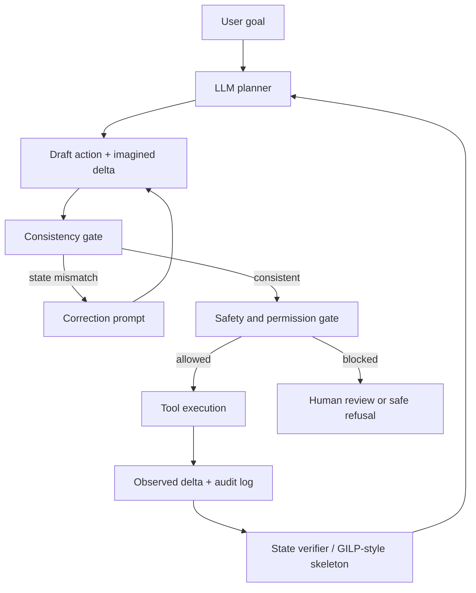

## GILP：用小型参数化 world model 给 LLM Agent 的状态想象踩刹车

- **原文**：[arXiv:2606.27806](https://arxiv.org/abs/2606.27806)
- **题目**：Grounded Iterative Language Planning: How Parameterized World Models Reduce Hallucination Propagation in LLM Agents
- **作者**：Xinyuan Song, Zekun Cai
- **日期证据**：arXiv v1 提交于 2026-06-26，并进入 2026-06-29 当前窗口的新论文列表
- **代码链接状态**：论文给出 `https://github.com/Hik289/Environment-reduce-error.git`，但当前仓库 README 显示的是 EnvProbe 项目，不能直接当作已核验的 GILP 复现包
- **类别**：大模型 Agent

### TL;DR

- 这篇论文研究的问题不是普通单轮幻觉，而是 **LLM Agent 在多步规划中把自己想象出来的错误状态写进历史，随后每一步都基于这个错误继续行动**。
- 作者把 agent planning 拆成两类 world model：
  - **agent-based world model**：API LLM 自己读状态、选动作、想象下一状态，语义灵活，但错误难以用普通回归损失度量。
  - **parameterized world model**：小型训练模型预测动作有效性、状态变化、风险和价值，误差可测，但单独规划能力弱。
- 论文提出 **Grounded Iterative Language Planning, GILP**：保留 LLM 负责语义推理；训练一个小型参数化 backbone 给出候选动作 skeleton；LLM 写动作和 imagined delta；如果两者的状态变化不一致，就触发 consistency gate 和 targeted correction prompt。
- 关键数字：
  - 在 calibrated simulator 中，成功率从 **0.668** 提升到 **0.838**。
  - 长 horizon 成功率从 **0.471** 提升到 **0.758**。
  - 真实 GPT-4o-mini 调用里，hallucinated-state rate 从 **0.176** 降到 **0.035**。
  - 代价是约 **22%** 额外 LLM calls。
- 论文的核心贡献是把“Agent 为什么越走越偏”写成可测问题：不是最后答案错了才算错，而是每一步的 imagined next state 是否引入了没有环境证据支持的状态原子。
- 局限同样明确：
  - benchmark 是四个图结构环境，不等于真实网页、真实工具链或真实机器人环境。
  - backbone 默认能从 oracle transitions 训练，这在开放世界任务里未必成立。
  - 代码链接目前和论文标题不完全匹配，复现性仍需等待作者清理或发布正式 artifact。

### 研究问题：Agent 幻觉为什么会“传播”？

这篇论文把一个常被粗略称为 hallucination 的问题拆细：

- 单轮问答里的幻觉：
  - 模型说出一个没有证据支持的事实。
  - 错误通常体现在最终文本里。
  - 可以用 factuality、引用核查或 retrieval grounding 去评估。
- 多步 Agent 里的状态幻觉：
  - 模型在第 3 步把一个任务节点想象成 completed。
  - 真实环境其实仍然是 pending。
  - 第 4 步以后，Agent 把这个 imagined state 当作上下文继续规划。
  - 后续动作因此依赖一个不存在的状态，错误会沿着轨迹扩散。

论文给的 motivating example 可以抽象成下面的链条：


这里最重要的判断是：

- JSON mode 可以减少语法错误。
- function calling 可以规范动作格式。
- 但两者都不能保证 **imagined_next_state** 的语义真实。

因此，作者问的是：

> 如果 LLM 适合做语义推理，小模型适合做可测 transition prediction，能不能让小模型不负责完整规划，只负责约束 LLM 的状态想象？

### 两类 world model：一个会推理，一个可测误差

论文把 Agent 的规划组件称为 world model，是因为它每一步都在做一个隐含预测：

- 当前世界是什么？
- 执行某个动作后，世界会怎么变？
- 哪些节点会完成、失败、解锁或保持不变？
- 这一步是否会让任务更接近终点？

两类 world model 的差异如下：

| 维度 | Agent-based world model | Parameterized world model |
|---|---|---|
| 核心形态 | API LLM，根据文本状态生成动作和 imagined delta | 小型训练模型，根据图状态和动作预测 transition |
| 强项 | 语义理解、目标解释、跨任务泛化、自然语言约束 | 误差可测、输出稳定、便宜、可在 held-out transitions 上验证 |
| 弱项 | 状态幻觉难以直接用 MSE 表示，错误会进入上下文 | 单独规划能力弱，不能充分理解复杂目标 |
| 典型指标 | HSR、Propagation Depth、long-horizon error growth | NodeMSE、delta accuracy、validity accuracy、reward MSE、done accuracy |
| 论文定位 | 保留为推理引擎 | 作为 grounding skeleton 和 consistency gate 的依据 |

这个对比让论文避开了一个常见误区：

- 它没有说“小模型比 LLM 更会规划”。
- 它也没有说“把 LLM 替换成 learned world model”。
- 它说的是：**小模型虽然不够聪明，但它的 transition error 可测，可以给 LLM 的 imagined state 提供低成本校准信号**。

### 问题形式化：状态、动作、delta 与幻觉指标

论文的任务环境都是图结构 planning benchmarks。每个 episode 可以写成：

- 状态：`s_t`
- 候选动作集合：`A_t`
- 目标：`g`
- LLM 选择动作：`a_t`
- LLM 想象的状态变化：`\hat{\Delta}_t`
- 真实环境转移：`s_{t+1}`
- 真实状态变化：`\Delta_t`

Agent-based hallucination 可以理解为：

```text
如果 LLM 声称某个状态原子发生变化，
但该变化没有被真实 transition、当前状态或动作前提支持，
则该 atom 是 hallucinated state atom。
```

论文关注的不是“模型说错一句话”，而是三个 trajectory-level 指标：

| 指标 | 直觉含义 | 为什么重要 |
|---|---|---|
| HSR, hallucinated-state rate | 每步 imagined delta 中出现错误状态原子的频率 | 衡量 Agent 生成状态的语义污染率 |
| Propagation Depth | 一个错误状态原子在后续步骤中持续影响多久 | 衡量错误是否只是一次性，还是会污染长期规划 |
| Long-horizon error growth | horizon 拉长时，任意错误出现概率如何增长 | 衡量任务越长时 Agent 是否系统性失稳 |

作者在引言中报告：

- agent baseline 的 per-step error probability 到第 10 步升至 **0.393**。
- hallucinated-state rate 达到 **0.205**。
- 一个 hallucinated atom 平均持续 **2.45** 步。

这些数字解释了为什么多步 Agent 的可靠性不能只看最终成功率：

- 一个 episode 最后可能勉强成功，但中间状态已多次自相矛盾。
- 一个 early hallucination 可能不立即导致失败，却会改变后续 action selection。
- 对安全、工具调用和自动化执行来说，中间轨迹本身就是风险面。

### GILP 方法：让小 backbone 只做“可测 grounding”

GILP 的结构分为四个阶段。

#### Phase 1：Parameterized Skeleton Scoring

小型 backbone 输入：

- 当前图状态 `s_t`
- 目标 `g`
- 候选动作集合 `A_t`

输出一个 compact skeleton：

- 每个动作的有效性概率 `p_valid`
- 预测的状态变化 `\Delta_\theta`
- 风险 `risk`
- 价值 `value`
- 受影响实体 `affected_entities`

这个 skeleton 不是最终答案，而是给 LLM 的 grounding context。

示例可以写成：

```text
execute(node_3):
  p_valid = 0.91
  value = 0.63
  risk = 0.14
  predicted delta: node_3: pending -> completed
  affected entities: [node_3, node_7, GOAL]
```

#### Phase 2：LLM Draft

LLM 仍然负责做语义选择：

- 读 current world state。
- 读 goal。
- 读候选动作。
- 读 skeleton。
- 输出 JSON：
  - selected_action
  - imagined_next_state
  - reasoning
  - confidence

这一步保留了 LLM 的优势：

- 可以解释目标。
- 可以处理自然语言约束。
- 可以在 skeleton 不完整时给出理由。

#### Phase 3：Consistency Gate 与 correction prompt

GILP 比较两个 delta：

- LLM 想象的 `\hat{\Delta}_t`
- backbone 预测的 `\Delta_\theta`

论文使用 Jaccard consistency 之类的集合相似度思想：

```text
J(\hat{\Delta}, \Delta_\theta)
  = |\hat{\Delta} ∩ \Delta_\theta| / |\hat{\Delta} ∪ \Delta_\theta|
```

如果一致性低于阈值，就触发 targeted re-prompt。

Correction prompt 不是泛泛说“请再检查一下”，而是指出具体冲突：

- 你想象 `node_7` completed。
- backbone 只预测 `node_3` completed。
- `node_7` 仍有未满足依赖。
- 因此 `node_7` completed 可能是 hallucinated transition。

这种 prompt 的价值在于：

- 它把自我修正从开放式反思变成结构化差异修复。
- 它只在 disagreement 发生时调用，控制 token 和 API 成本。
- 它让 LLM 的第二次回答围绕具体状态原子修改，而不是重新写一遍思路。

#### Phase 4：Risk Gate

如果 LLM 选中的动作被 backbone 标为高风险，系统还可以触发 risk gate。

Risk gate 的输入是：

- 当前选中动作。
- 预测风险值。
- 风险原因。
- 低风险替代动作。

这一步处理的是另一类错误：

- LLM 的 imagined delta 可能和 skeleton 一致。
- 但这个动作本身失败概率高。
- 系统因此要求重新选择或显式解释。

### 算法流程：GILP 的主循环

可以把论文 Algorithm 1 改写成更直观的伪代码：

```text
Input:
  environment E
  goal g
  parametric backbone f_theta
  agent LLM M
  consistency threshold tau
  risk threshold rho
  planning horizon H

State:
  current state s_0
  executed trajectory T = []

for t in 0..H-1:
  1. serialize current state s_t
  2. enumerate candidate actions A_t
  3. backbone scores each action:
       skeleton = f_theta(s_t, A_t, g)
  4. LLM drafts:
       action a_t
       imagined delta delta_hat_t
  5. compute consistency:
       c = Jaccard(delta_hat_t, skeleton.predicted_delta[a_t])
  6. if c < tau:
       send targeted correction prompt
       ask LLM to revise action or imagined delta
  7. if skeleton.risk[a_t] > rho:
       send risk warning
       ask LLM to choose safer alternative or justify
  8. execute action in environment
  9. log real transition, imagined transition, corrections, risks
  10. stop if done

Output:
  final success/failure
  hallucination metrics
  cost and correction statistics
```

这个流程的关键不是“多调用一次 LLM”，而是把每一步的错误源拆开：

- backbone 可能预测错；
- LLM 可能想象错；
- gate 可能漏检；
- correction 可能修不好；
- risk gate 可能过度保守。

拆开以后，实验才能解释改进来自哪里。

### 公式解释：错误减少保证说了什么？

论文的保证不是“GILP 一定正确”，而是给出 agent-side semantic error 的概率分解。

可以用三个事件理解：

| 事件 | 含义 |
|---|---|
| `E_t` | Phase 2 的 LLM draft 在第 `t` 步包含 semantic transition hallucination |
| `D_t` | consistency gate 检测到了这个错误 |
| `C_t` | correction prompt 成功移除了这个错误 |

那么 correction 后仍然留下 agent-side hallucination 的概率近似是：

```text
P(error after GILP)
  = P(E_t) * [1 - P(D_t) * P(C_t | D_t)]
```

这个式子的意义很朴素：

- 如果 LLM 本来不犯错，GILP 不需要修。
- 如果 LLM 犯错但 gate 检测不到，错误仍会传播。
- 如果 gate 检测到但 correction 无效，错误仍会传播。
- 只有 `D_t` 和 `C_t` 同时发生，才真正降低 agent-side error。

论文因此把研究重点放在：

- backbone prediction 是否足够稳定；
- consistency gate 是否能抓到真实分歧；
- correction prompt 是否能修复 imagined delta；
- 额外 token 成本是否低于可靠性收益。

### 实验设置：四个图结构 planning environments

论文使用四个 benchmark，每个都强调不同类型的状态依赖。

| 环境 | 任务结构 | 动作 | 主要失败模式 |
|---|---|---|---|
| TaskGraph | 有向无环子任务图 | execute, skip, retry | 未满足依赖却宣称完成 |
| ToolChain | API 调用数据流图 | call, verify, rollback | 输入工具未验证却继续调用 |
| ResourceAlloc | 资源-任务二分图 | assign, release, escalate | 容量约束和资源竞争被忽略 |
| RepairFlow | 组件故障传播图 | diagnose, repair, isolate | 隐藏故障或级联依赖被错判 |

每个 benchmark 的数据规模：

- 500 train tasks
- 100 validation tasks
- 100 test tasks
- test 中包含 60 个 in-distribution 和 40 个 OOD tasks

训练设置：

- backbone 从 oracle trajectories 学 transition。
- 六类 backbone 包括 MLP、GCN、MPNN、GPS、ActionNode、ErrorAware。
- 训练 50 epochs。
- 使用 Adam。
- 多任务头预测状态、动作有效性、奖励、done 等目标。
- 论文强调 backbone 很小，核心问题是“它是否足够成为 grounding signal”，不是追求一个大型 learned planner。

### 主结果：成功率提升，但更重要的是状态幻觉下降

论文报告的核心结果可以分成三类。

#### 1. Calibrated simulator 中成功率提升

| 方法 | Success Rate | 解读 |
|---|---:|---|
| Agent baseline | 0.668 | LLM 语义规划可用，但长轨迹中状态错误会积累 |
| GILP | 0.838 | skeleton + consistency correction 降低错误传播 |

这个提升不能理解为“backbone 替代了 LLM”。

更准确的解释是：

- LLM 仍然负责 action drafting。
- backbone 给出低成本 transition prior。
- consistency gate 把明显不一致的 imagined delta 拦下来。

#### 2. Long-horizon 更能体现差异

论文报告：

- long-horizon success 从 **0.471** 到 **0.758**。

这点比总体成功率更关键，因为 hallucination propagation 本质上是 horizon 问题：

- 短任务中，一个错误未必有足够时间扩散。
- 长任务中，状态历史每一步都会被再次读入上下文。
- 一次 early hallucination 可以影响多个后续动作。

因此，GILP 的价值应该优先看长轨迹，而不是只看平均成功率。

#### 3. 真实 GPT-4o-mini 调用验证 HSR 降低

论文摘要给出：

- Agent-only HSR：**0.176**
- GILP HSR：**0.035**

这个数字说明：

- GILP 不只是 simulator trick。
- 在真实 API 调用中，LLM imagined state 的错误率确实下降。
- 但它仍是在论文定义的图环境和 prompt suite 里验证，不等于开放网页或任意工具环境。

### 消融与机制：为什么不是简单 rerank？

GILP 和常见 verifier / reranker 的差异在于介入位置。

| 方法类型 | 介入点 | 局限 |
|---|---|---|
| Post-hoc rerank | LLM 生成多个动作后选择一个 | 可能仍保留错误 imagined state |
| Classical planner | 用 PDDL / symbolic solver 直接规划 | 需要可形式化模型，语义灵活性低 |
| Self-reflection | 让 LLM 自己检查 | 容易泛泛反思，不一定定位状态原子 |
| GILP | sampling 前给 skeleton，sampling 后查 delta 一致性 | 需要训练 transition backbone，也依赖 gate 阈值 |

论文的机制主张是：

- skeleton 在 prompt 前置，影响 LLM 第一次 draft。
- consistency gate 在同一步内检查 imagined delta。
- correction prompt 指向具体冲突 atom。
- risk gate 再处理高失败概率动作。

这就让 GILP 不是“多想一步”，而是“用一个可测 transition model 约束每一步状态声明”。

### Figure 与 Table 证据怎么读？

论文的图表证据可以按 claim → evidence 读。

| 论文主张 | 对应证据 | 支持强度 |
|---|---|---|
| Agent-based world model 的错误会长程传播 | HSR、Propagation Depth、long-horizon error proxy | 强，直接围绕轨迹指标 |
| Parameterized model 单独规划不强，但 transition error 可测 | backbone strength table，validity/delta accuracy vs standalone SR | 中强，说明它适合做辅助信号 |
| GILP 不是只提高最终排名，而是在降低 agent-side semantic error | empirical error probability curves 和 HSR 下降 | 强，但限于图环境 |
| 长任务中 GILP 更有价值 | long-horizon success 从 0.471 到 0.758 | 强，符合传播问题定义 |
| 成本可控 | 约 22% extra LLM calls | 中，真实部署还要看 prompt 长度和工具成本 |

作者给的 Figure 7 可以理解为方法定位图：

- Agent-only：LLM 自己想象状态，灵活但会传播 false atoms。
- Parameterized-only：transition 稳定但语义规划弱。
- GILP：用 parameterized skeleton 约束 agent draft，再用 gate 修正分歧。

我认为最有价值的图不是架构图，而是 error curves：

- 如果曲线只显示 final success，可能只是动作选择更好。
- 如果 agent-side semantic error 也下降，才说明 GILP 真的在处理状态幻觉传播。

### 代码与复现边界：链接目前不能完全闭环

论文摘要提供代码链接：

- `https://github.com/Hik289/Environment-reduce-error.git`

但当前打开仓库看到的是：

- 仓库标题：`Hik289/Environment-reduce-error`
- README 标题：`EnvProbe: When LLM Agents Should Actively Probe the Environment`
- 目录包含 `src/environments`、`src/methods`、`src/metrics`、`src/agents` 等。
- README 讨论 probe-action budget、ToolDAGWorld、GraphNavWorld、ObjectStateWorld。

这和论文题目 GILP 并不完全一致。

因此本轮应该保守写作：

- 可以把 GitHub 链接记录为论文给出的 artifact link。
- 不能声称该仓库已经提供完整 GILP 复现。
- 不能把 README 里的 EnvProbe 结果当成 GILP 论文实验结果。

这个局限很重要，因为论文自己强调 reproducible follow-up work。

复现状态最好分三层：

| 层级 | 当前证据 | 判断 |
|---|---|---|
| 论文文本 | arXiv HTML/PDF 可读，实验和 prompt appendix 充足 | 可深读 |
| Prompt/算法说明 | Appendix 给出 system prompt、planning prompt、correction prompt、API call 示例 | 可复写原理 |
| 代码 artifact | GitHub 当前 README 与 GILP 不匹配 | 暂不能视为已核验复现包 |

### 相关工作位置：它补的是“Agent 轨迹错误”这一层

论文和几个方向有关，但不完全属于任何一个旧框架。

#### 1. ReAct / Reflexion / Tree of Thoughts

这些方法都让 LLM 在语言中规划、行动、反思或搜索。

GILP 的批评点是：

- 它们把 LLM 的 generated thought 当成世界状态的一部分。
- 如果 thought 里出现 false state atom，后续步骤会继承错误。
- 自我反思不一定能发现具体状态转移错误。

#### 2. Model-based RL / learned world models

传统 model-based RL 关心 transition model。

GILP 借用的不是完整 RL planning，而是一个更窄的思想：

- transition error 应该可测。
- 即便 learned model 不够强，也可以提供 grounding prior。

#### 3. LLM-modulo / symbolic verification

LLM-modulo 架构强调用外部模块校验 LLM 计划。

GILP 的区别是：

- 不要求完整 symbolic planner。
- 不在 episode 结束后才验。
- 在每一步的 imagined delta 上做局部 correction。

#### 4. Agent hallucination survey / benchmark

已有工作常把 Agent 幻觉分成目标、环境、记忆、工具和反馈等类别。

GILP 的贡献更窄：

- 它定义的是 **environment transition hallucination**。
- 它把错误传播深度、每步错误概率和长 horizon growth 做成实验对象。

### 论文最值得吸收的设计原则

这篇论文对 Agent 系统设计有几个直接启发。

#### 1. 不要只校验动作格式，要校验状态声明

很多工程系统只检查：

- JSON 是否 parse。
- function name 是否存在。
- required arguments 是否齐。
- tool call 是否返回成功。

但 GILP 提醒我们，Agent 还会生成隐含状态声明：

- “这个任务已经完成。”
- “这个依赖已经满足。”
- “这个工具输出已经验证。”
- “这个资源已经释放。”

这些声明如果进入上下文，就会成为后续行为的事实基础。

因此，Agent runtime 至少应记录：

- LLM selected action；
- LLM imagined state delta；
- environment observed delta；
- 两者 mismatch；
- mismatch 是否在后续步骤继续出现。

#### 2. 小模型不必比 LLM 聪明，也可以很有用

GILP 的 backbone 并不负责理解完整任务。

它只需要预测：

- 哪个动作大概率有效；
- 哪些节点会变化；
- 哪些动作风险高；
- 当前状态是否接近完成。

这让部署问题变得现实：

- 训练小模型比训练新 LLM 便宜。
- 小模型推理比 API LLM 便宜。
- 小模型输出可解释成 skeleton。
- 小模型的 error 可以离线测。

#### 3. Correction prompt 应该定位差异，不应该泛泛要求反思

论文附录里的 correction prompt 有一个好习惯：

- 明确 previous action。
- 明确 imagined next state。
- 明确 backbone prediction。
- 明确 discrepancy。
- 明确为什么某个状态变化缺少前提。

这比“请仔细检查你的答案”更工程化。

可以迁移到工具型 Agent：

```text
你刚才声称订单已退款。
但真实 tool log 只显示 refund_request_created。
payment_status 仍为 captured。
请只基于真实 tool observation 更新状态。
```

#### 4. Long-horizon benchmark 必须单独看

短任务成功率可能掩盖问题。

如果一个 Agent 只执行 2 到 3 步：

- 错误传播空间小。
- correction 是否有效不明显。
- API 模型本身的语义能力可能足够覆盖。

但在 10 步以上：

- early hallucination 会进入长期上下文。
- 每一次状态压缩都可能加剧偏差。
- 长任务才更像真实 automation workflow。

### 局限：为什么这还不是通用 Agent grounding 方案？

#### 1. 环境是图结构，不是开放世界

四个 benchmark 都是可枚举图任务：

- 节点有限。
- 动作集合有限。
- transition 可由 oracle 生成。
- 状态变化可以结构化比较。

真实世界更难：

- 网页 DOM 会变。
- 工具返回半结构化文本。
- API 可能有副作用。
- observation 可能不完整。
- 用户目标可能在执行中变化。

因此，GILP 更像是一个清晰的研究切片，不是直接可搬到所有 Agent 的通用 runtime。

#### 2. Backbone 需要 oracle transitions

训练参数化 world model 要数据。

论文环境里可以生成 oracle trajectories，但真实任务里常见问题是：

- 没有足够多成功轨迹；
- 失败轨迹标注不完整；
- 工具和环境版本频繁变化；
- transition label 本身可能有噪声。

如果 backbone 学到的是过时环境，它也可能给 LLM 错误 skeleton。

#### 3. Gate 阈值会影响行为风格

Consistency threshold 太高：

- LLM 经常被打断。
- 成本上升。
- 可能压制合理的语义推理。

Threshold 太低：

- 很多错误 delta 不会被修。
- GILP 退化成普通 skeleton prompting。

真实部署需要按任务风险调参。

#### 4. Risk gate 不能替代安全策略

Risk gate 预测的是任务失败风险，不等于安全风险。

例如：

- 某个 shell 命令高成功率但危险。
- 某个数据库操作语法有效但越权。
- 某个消息发送动作符合任务目标但泄露隐私。

所以 GILP 可以减少状态幻觉，不等于解决 tool safety、permission boundary 或 privacy policy。

### 对 Agent 研究的延伸问题

这篇论文把一个很实用的问题打开了：**Agent 需要外部 grounding，但 grounding 不一定必须是大型 symbolic planner**。

后续值得追问的方向有四个。

### 一个更具体的失败案例：为什么“只看 observation”仍然不够？

假设一个 coding agent 正在修复测试失败。

真实轨迹可能是：

| 步骤 | 真实 observation | Agent imagined delta | 风险 |
|---|---|---|---|
| 1 | 修改 `parser.ts`，但没有运行测试 | “parser 修复已完成” | 把代码修改误当成验证完成 |
| 2 | 运行测试，退出码 1，错误来自 fixture | “主要测试已通过，只剩 lint” | 把失败类型写错，后续行动会偏 |
| 3 | 修改 fixture，未重新运行全量测试 | “回归已修复” | 把局部动作扩展成全局状态 |
| 4 | 生成最终报告 | “测试通过，可发布” | 用户看到的是成功叙述，不是实际状态 |

普通日志审计能看到命令和退出码，但如果系统没有显式记录 Agent 的 imagined delta，就很难回答：

- Agent 是什么时候开始相信“测试已通过”的？
- 这个错误状态是否来自某个 summary、plan update 或 tool result paraphrase？
- 后续动作有没有依赖这个错误状态？
- 最终报告里的错误结论是一次性误写，还是前面几步已经传播？

GILP 式评测的迁移价值正在这里：

- 它要求把 **observed delta** 和 **imagined delta** 分开存。
- 它不把“执行了动作”自动等同于“状态改变成功”。
- 它把错误传播深度作为轨迹指标，而不是等到最终答案才追责。
- 它允许系统在第 2 步就拦截：“退出码仍为 1，不能声明测试通过。”

这对真实 Agent 工程很重要，因为很多事故不是来自一次危险动作，而是来自状态叙述逐步乐观化：

- “已经验证”替代了“刚刚修改”。
- “部分通过”替代了“命令失败”。
- “可部署”替代了“缺少最终检查”。
- “用户授权”替代了“用户只要求分析”。

GILP 给出的不是完整安全策略，但它提供了一个很清楚的中间层：**在每一次行动前后，检查 Agent 对世界变化的叙述是否被真实环境支持**。

#### 1. 能不能把 GILP 接到真实 tool logs？

对 coding agent，可以把状态 atom 换成：

- 文件是否存在；
- 测试是否通过；
- git diff 是否包含某类修改；
- issue checklist 是否完成；
- server 是否真的返回 200。

对应的 consistency gate 可以检查：

- LLM 说“测试通过”，但 shell log 没有成功退出码；
- LLM 说“文件已更新”，但 diff 中没有该文件；
- LLM 说“服务已启动”，但 health check 失败。

#### 2. 能不能把 backbone 换成规则 + 小模型混合？

很多工程任务不需要训练完整 GNN。

可以先用规则写出硬约束：

- 未运行测试不能声明测试通过。
- 未收到 tool observation 不能声明外部状态变化。
- 删除文件必须有显式用户授权。
- HTTP 失败不能声明部署成功。

再让小模型预测软信号：

- 哪些动作风险高；
- 哪些依赖可能没满足；
- 哪些状态声明可能夸大。

#### 3. 能不能把 propagation depth 用作 Agent 监控指标？

现在很多 Agent 评测只看 success。

GILP 提供了更细的监控口径：

- 第一次错误状态出现在第几步？
- 错误状态持续几步？
- 错误是否导致无效动作？
- correction 后是否真的消失？

这些指标适合进入 Agent observability。

#### 4. 能不能和安全策略结合？

GILP 处理的是 correctness grounding。

AI safety 场景还需要加入：

- permission model；
- tool risk tier；
- privacy policy；
- irreversible action guard；
- human approval boundary；
- audit log。

一个更完整的 agent runtime 可能是：



这里 GILP 只覆盖 `State verifier` 和 `Consistency gate`，不能替代后面的 safety gate。

### 本文判断

GILP 的价值不在于提出一个复杂架构，而在于把 Agent 可靠性的一个模糊痛点变成了可观测机制：

- LLM Agent 不只是会“说错事实”。
- 它会在每一步生成自己的世界状态。
- 错误状态一旦进入上下文，就会成为后续规划依据。
- 参数化 world model 即使单独规划不强，也能作为便宜、可测、可审计的 grounding signal。

我认为这篇论文最适合放在 Agent 可靠性研究脉络里读：

- 它不是新的通用规划器。
- 它不是 benchmark leaderboard 论文。
- 它更像一个 runtime design pattern：
  - 让 LLM 继续负责语义；
  - 让小模型负责 transition prior；
  - 让 gate 负责抓差异；
  - 让 correction prompt 只修具体状态原子。

如果后续代码 artifact 能真正对应 GILP，并在真实工具环境中复现同样的 HSR 下降，这个方向会非常值得继续跟踪。
