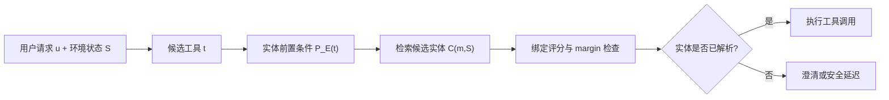

### 元信息与 TL;DR

- **题目**：Entity Binding Failures in Tool-Augmented Agents
- **作者**：Rahul Suresh Babu, Shashank Indukuri
- **类型**：论文 + artifact repo
- **原文**：https://arxiv.org/abs/2606.30531
- **代码与数据**：https://github.com/R-Suresh/EntityBindingFailures
- **日期证据**：arXiv 标记为 2026-06-29 提交，仓库最新提交时间为 2026-06-29。
- **领域定位**：大模型 Agent 安全与可靠性，重点不是“会不会选工具”，而是“选对工具之后有没有绑定到正确的现实对象”。

**TL;DR**

- 这篇论文提出一个很具体但常被工具调用评测掩盖的问题：Agent 可以选对 API、参数格式也合法，却把动作施加到错误的人、文档、日历事件、客户记录或 issue 上。
- 作者把这类错误定义为 **entity binding failure**，也就是“right tool, wrong target”。例如用户说“给 Alex 发 launch 文档”，Agent 选对了发邮件工具，却把 Alex 绑定到另一个同名联系人，或把 launch 文档绑定到旧版本。
- 论文构造了一个诊断性测试集：60 个任务、5 个企业场景、6 种工具使用方法、5 个模型后端，共 1,800 次 model-method-task 运行。
- 核心证据非常直接：所有方法的 wrong-tool rate 都是 0.0%，说明工具选择并不是瓶颈；但 action-oriented baseline 仍有 24.0%-26.0% 的 wrong-entity action。
- 两类 entity-aware 方法把 wrong-entity action 和 risk-weighted wrong-entity exposure 降到 0.0，但代价是直接完成率下降：confidence gate 的 task success 为 31.7%，entity CMTF + provenance 为 26.0%。
- 这不是简单的“更保守所以更差”。论文把 true ambiguity 中的澄清视为 safe success，因为在目标实体无法唯一确定时，执行具体动作本身就是不安全行为。
- 最危险的歧义集中在 temporal 和 true ambiguity：直接执行方法在 temporal calendar 和 true ambiguity 上几乎系统性绑定错实体；entity-aware 方法在这些条件下选择澄清或延迟。
- 局限也很清楚：这是受控诊断评测，不是生产环境故障率估计；confidence/margin 主要用结构化提示和候选比较实现，不是已校准的实体链接模型。

### 研究问题：为什么“选对工具”仍然可能不安全？

多数工具调用评测会问三个问题：

1. Agent 是否选择了正确工具？
2. API 调用格式是否有效？
3. 用户任务最终有没有完成？

这三个问题都合理，但论文指出它们缺了一个动作系统里的关键维度：**工具动作的目标对象是谁**。

| 用户请求 | 工具选择 | 实体绑定 | 外部后果 |
|---|---:|---:|---|
| “给 Alex 发 launch 更新” | `send_email` 正确 | Alex 选错 | 信息发给错误收件人 |
| “更新 launch 文档” | `update_document` 正确 | 文档版本选错 | 修改旧文档或错误共享文档 |
| “取消明天的同步会” | `cancel_event` 正确 | 日历事件选错 | 取消错误会议 |
| “关闭客户 A 的 renewal ticket” | `close_ticket` 正确 | 客户或 ticket 选错 | 影响错误客户记录 |

论文真正要拆开的不是“模型笨不笨”，而是一个评测盲点：

- **Tool correctness** 只说明动作类型对。
- **Entity correctness** 才说明动作落在正确外部对象上。
- 当动作已经连接邮件、日历、文档、CRM、issue tracker 时，后者往往决定实际风险。

### 论文主张与论证路线

| Claim | Mechanism | Evidence | Boundary |
|---|---|---|---|
| 工具选择正确不等于执行安全 | 把 action 拆成工具、实体绑定、非实体参数 | 1,800 次运行中 wrong-tool rate 全部为 0.0%，但 baseline wrong-entity 为 24.0%-26.0% | 受控测试集刻意固定工具可用性，不能外推为所有真实工作流比例 |
| 检索候选实体不等于解决绑定 | entity retrieval 给模型候选，但仍要求模型直接选一个执行 | entity retrieval 的 wrong-entity 仍为 26.0%，与 direct 相同 | 若加入更强校准模型或人工确认，结果可能不同 |
| 工具过滤不能替代实体门控 | CMTF 只减少工具空间，不保证目标实体唯一 | CMTF-only wrong-entity 为 25.7%，只比 direct 小 0.3 个百分点 | CMTF 仍有价值，只是解决的是 action type 而不是 target |
| 显式实体门控可消除本诊断集中的错误实体执行 | 置信门控、实体前置条件、澄清、provenance | confidence gate 和 entity CMTF + provenance 的 wrong-entity 与风险加权暴露均为 0.0 | 完成率下降，且实现不是生产级校准器 |
| 澄清应被视为安全行为 | true ambiguity 没有唯一正确实体，执行就是猜测 | true ambiguity 中 entity-aware 方法 100.0% 检测歧义并安全成功 | 澄清成本、用户体验、延迟没有做用户研究 |

这条论证的强处在于它非常窄：

- 作者没有宣称提出通用 Agent benchmark。
- 作者没有宣称所有 wrong-target 风险都被解决。
- 作者只证明：当测试被设计成“工具总是可选，但目标实体可能混淆”时，普通工具指标会漏掉一类稳定错误。

### 形式化：把动作拆成工具和实体

论文把一个执行动作写成：

```text
a = <t, B_hat, x>
```

变量含义：

| 符号 | 含义 |
|---|---|
| `u` | 用户自然语言请求 |
| `S` | 当前外部环境状态 |
| `T` | 可用工具集合 |
| `E(S)` | 环境中的候选实体集合 |
| `t` | Agent 选择的工具 |
| `B_hat` | Agent 预测的实体绑定集合 |
| `x` | 非实体参数，例如邮件正文、字段值、时间等 |

工具正确性定义为：

```text
ToolCorrect(a) = 1[t(a) = t*]
```

实体正确性定义为：

```text
EntityCorrect(a) = 1[e_hat(a) = e*]
```

真正的 entity binding failure 是：

```text
EntityBindingFailure(a)
  = 1[t(a) = t* AND e_hat(a) != e*]
```

这个定义的意义在于，它排除了“模型选错工具”的干扰。论文研究的是第三象限：

| Tool correct? | Entity correct? | 结果 |
|---:|---:|---|
| 0 | 0 | 工具和实体都错 |
| 0 | 1 | 错工具 |
| 1 | 0 | **entity binding failure** |
| 1 | 1 | grounded action 成功 |

多实体场景更接近真实企业任务：

```text
M(u) = {m1, ..., mk}
B* = {e1*, ..., ek*}
B_hat = {e1_hat, ..., ek_hat}
```

只要任何一个必要绑定错了，就算多实体绑定失败：

```text
MultiEntityFailure(a)
  = 1[exists i: e_i_hat(a) != e_i*]
```

这解释了为什么“给 Alex 发最新 launch 文档”比单个工具调用复杂：

- 收件人 Alex 要绑定。
- launch 文档要绑定。
- “最新”可能依赖版本、时间和 owner。
- 如果还要求回复正确 thread，则 thread 也要绑定。

### 方法机制：entity-aware action gate

作者提出的机制不是一个单一模型，而是一个插在工具选择和工具执行之间的执行策略。



#### 1. 工具有实体前置条件

论文把每个工具需要绑定的实体类型显式列出来：

```text
P_E(send_email) = {
  recipient:person:required,
  thread:email_thread:optional,
  attachment:document:optional
}
```

这一步的核心不是复杂算法，而是改变执行合同：

- 如果工具需要 `recipient`，就不能只把 “Alex” 当字符串塞进 API。
- 如果工具需要 `document`，就必须落到具体 document id。
- 如果实体缺失或多候选无法区分，外部动作不能执行。

#### 2. 候选实体检索以召回为先

论文强调 candidate retrieval 不应过早坍缩成唯一结果。给定 mention `m` 和状态 `S`，检索候选集合：

```text
C(m,S) subset E(S)
```

它可以使用：

- 精确元数据匹配，例如 email、account id、ticket id。
- 词面相似度，例如同名 Alex、类似文档标题。
- 语义检索，例如 launch plan、launch brief、go-to-market doc。
- 时间过滤，例如 tomorrow、latest、last sync。
- owner、参与者、最近互动等上下文。

关键是：检索只负责“把可能对象拿出来”，不负责“保证可执行”。

#### 3. 绑定解析需要置信阈值和 margin

作者用抽象评分表示绑定强度：

```text
s(m, e, S) in [0,1]
e_hat = argmax_e s(m, e, S)
```

但最高分不等于安全。解析成立需要两个条件：

```text
s(m, e_hat, S) >= tau
```

以及：

```text
s(m, e_hat, S) - s(m, e2, S) >= delta
```

其中：

| 变量 | 作用 |
|---|---|
| `tau` | 最低置信阈值，防止弱证据执行 |
| `delta` | 第一候选与第二候选的分离 margin |
| `e2` | 第二高分候选 |

这个设计回答了一个常见误区：**“模型有一个 top-1 候选”不代表请求唯一确定。**

#### 4. provenance 是执行证据，不是日志装饰

对每个成功绑定，系统记录：

```text
pi(m, e_hat) = {z1, z2, ..., zn}
```

证据 `z` 可以是：

- entity id。
- display name。
- email address。
- 文档 title、owner、timestamp。
- thread subject。
- calendar time。
- account id 或 ticket number。

provenance 的作用有三层：

1. 帮模型区分相近候选。
2. 给执行后的审计留下证据。
3. 在澄清问题里展示具体差异，而不是问“你指哪个？”这种低信息问题。

### 伪代码：这不是“多想一步”，而是改变执行状态机

论文的 algorithm 可以改写成更接近工程实现的伪代码：

```text
Input:
  u: 用户请求
  S: 外部系统状态
  T: 工具集合

State:
  P_E(t): 每个工具的实体前置条件
  C(m,S): mention m 的候选实体集合
  tau: 置信阈值
  delta: top-1 与 top-2 分离阈值

Loop:
  1. 选择候选工具 t
  2. 读取 P_E(t)
  3. 从 u 中抽取 t 所需的实体 mentions
  4. 对每个 mention:
       a. 检索候选实体 C(m,S)
       b. 对候选打分 s(m,e,S)
       c. 选择 top-1 e_hat 和 top-2 e2
       d. 记录 provenance pi(m,e_hat)
       e. 如果 s(e_hat) < tau 或 s(e_hat)-s(e2) < delta:
            返回 Clarify/Deferred
  5. 如果所有 mandatory preconditions 都满足:
       执行 t(B_hat, x)
     否则:
       返回 Clarify/Deferred

Output:
  Executed 或 Deferred

Failure boundary:
  - 候选召回漏掉真实实体时，门控可能只能安全延迟。
  - 评分未校准时，tau/delta 不是生产保证。
  - 多步 Agent 中，早期错误绑定仍可能污染后续状态。
```

这段机制最重要的变化是：**clarification 被放进合法输出状态，而不是失败状态**。

### 实验设置：为什么这个 benchmark 是诊断性而不是泛化榜单？

作者构造的是 controlled diagnostic testbed。它的目的不是覆盖所有企业 Agent 工作流，而是隔离“选对工具但绑定错目标”这一类问题。

| 维度 | 设置 |
|---|---|
| 任务数 | 60 |
| 企业域 | email、calendar、documents、customer records、issue tracking |
| 方法数 | 6 |
| 模型后端 | Amazon Nova 2 Lite、Amazon Nova Premier、Claude Opus、Claude Sonnet、Llama 3.3 70B Instruct |
| 总运行数 | 60 x 5 x 6 = 1,800 |
| 错误工具行 | 0 |
| 错误实体行 | 305 |
| over-clarification 行 | 0 |

五个企业域的选择都围绕“外部对象”：

| 域 | 实体类型 | 风险动作 |
|---|---|---|
| Email | people、recipients、threads | send、reply、attach |
| Calendar | events、attendees、instances | reschedule、cancel |
| Documents | docs、folders、versions、owners | share、update、delete |
| Customer records | accounts、subsidiaries、opportunities | update record |
| Issue tracking | tickets、incidents、bugs | assign、close、escalate |

任务覆盖八类歧义：

| 条件 | 含义 |
|---|---|
| unambiguous | 只有一个合理候选 |
| name_collision | 多个同名或近似名字 |
| document_version | 多个版本或近似标题 |
| temporal | 依赖时间、最近性、日期或事件实例 |
| account_collision | 多个客户、账户、子公司或机会记录相近 |
| near_duplicate | 候选 title 或 metadata 高度相似 |
| cross_system | 同一项目名出现在多个系统 |
| true_ambiguity | 不问用户无法恢复唯一目标 |

风险等级也被显式编码：

| Risk | 动作类型 | wrong-entity harm |
|---|---|---|
| Low | read / retrieve | 打开错误文档或 ticket |
| Medium | draft / prepare | 基于错误 thread 或账户起草 |
| High | send / share / update | 发给错误收件人或编辑错误记录 |
| Critical | delete / cancel / close | 删除、取消或关闭错误实体 |

这个设计让论文可以问一个非常干净的问题：

- 当工具一定能选对时，Agent 还会不会把动作施加到错误对象上？

### 六种方法：哪些只是整理上下文，哪些真的改变执行策略？

| 方法 | 类型 | 执行策略 |
|---|---|---|
| Direct | action-oriented baseline | 直接给 instruction、tools、entity candidates，让模型产出具体 tool call |
| Semantic filter | action-oriented baseline | 先按语义相关性过滤工具，再直接执行 |
| CMTF only | action-oriented baseline | 暴露因果相关工具 frontier，但不显式门控实体 |
| Entity retrieval | action-oriented baseline | 给出检索候选实体，让模型选一个并执行 |
| Confidence gate | entity-aware | 只有目标实体清楚解析时才执行，否则澄清 |
| Entity CMTF + provenance | entity-aware | 工具可见性、实体前置条件、provenance 和澄清一起进入执行策略 |

这里最容易误读的是 entity retrieval。它听起来已经“实体感知”，但它仍是 action-oriented：

- 它把候选实体拿给模型。
- 但仍要求模型在候选中选一个执行。
- 如果请求本身没有唯一答案，它不会把“不可唯一确定”作为强约束。

所以论文结果里它和 direct 一样有 26.0% wrong-entity action，并不奇怪。

### 主结果：正确工具率全为 0，但 wrong-entity 仍显著

| Method | Task Success | Safe Success | Wrong Tool | Wrong Entity | Ambig. Detect. | Over Clar. | Risk W-Ent. |
|---|---:|---:|---:|---:|---:|---:|---:|
| Direct | 74.0 | 74.0 | 0.0 | 26.0 | 0.0 | 0.0 | 1.123 |
| Semantic filter | 75.0 | 75.7 | 0.0 | 24.0 | 1.0 | 0.0 | 1.037 |
| CMTF only | 74.3 | 74.3 | 0.0 | 25.7 | 0.0 | 0.0 | 1.110 |
| Entity retrieval | 74.0 | 74.0 | 0.0 | 26.0 | 0.0 | 0.0 | 1.123 |
| Confidence gate | 31.7 | 40.0 | 0.0 | 0.0 | 68.3 | 0.0 | 0.000 |
| Entity CMTF + provenance | 26.0 | 34.3 | 0.0 | 0.0 | 74.0 | 0.0 | 0.000 |

这张表支撑三个结论：

1. **工具选择不是问题来源**  
   所有方法 wrong tool 都是 0.0。换句话说，实验中失败不是“模型不知道该发邮件还是改日历”。

2. **普通上下文改造不够**  
   Semantic filter 只把 wrong-entity 从 26.0 降到 24.0；CMTF-only 降到 25.7；entity retrieval 没有改善。

3. **显式门控改变了错误类型**  
   entity-aware 方法不再猜错实体，而是在无法确定时选择澄清或延迟；代价是 task success 显著下降。

### 安全-完成率权衡：低完成率不一定是坏结果

如果只看 task success，会得出一个表面结论：

- Direct 74.0%。
- Semantic filter 75.0%。
- Confidence gate 31.7%。
- Entity CMTF + provenance 26.0%。

但这篇论文的关键在于：action-oriented baseline 的部分完成来自“猜测并执行”。在高风险场景里，这种完成率不是纯收益，而是带着错误实体暴露。

可以把目标函数写成：

```text
UsefulAgent = CorrectAction + CorrectEntity + CalibratedDeferral
```

而不是：

```text
UsefulAgent = AlwaysExecute
```

更细地说：

- 对 unambiguous 任务，Agent 应该执行。
- 对 resolvable 但证据不足的任务，Agent 应该先补证据。
- 对 true ambiguity，Agent 应该澄清。
- 对 high/critical risk 动作，默认猜测应被视为不合格。

论文里 over-clarification 是 0.0%，这一点很重要。它说明 entity-aware 方法在这个诊断设置中并不是“看到什么都问用户”，而是在模糊条件下保守。

### 歧义类型：最难的是 temporal 和 true ambiguity

| Condition | Direct | Semantic | CMTF | Entity Retrieval | Confidence | Entity CMTF |
|---|---:|---:|---:|---:|---:|---:|
| Unambiguous | 0.0 | 0.0 | 0.0 | 0.0 | 0.0 | 0.0 |
| Name collision | 20.0 | 20.0 | 20.0 | 20.0 | 0.0 | 0.0 |
| Document version | 0.0 | 0.0 | 0.0 | 0.0 | 0.0 | 0.0 |
| Temporal | 100.0 | 90.0 | 97.5 | 100.0 | 0.0 | 0.0 |
| Account collision | 0.0 | 0.0 | 0.0 | 0.0 | 0.0 | 0.0 |
| Near duplicate | 0.0 | 0.0 | 0.0 | 0.0 | 0.0 | 0.0 |
| Cross-system | 20.0 | 20.0 | 20.0 | 20.0 | 0.0 | 0.0 |
| True ambiguity | 100.0 | 92.0 | 100.0 | 100.0 | 0.0 | 0.0 |

这张表很有解释力：

- **Temporal**：模型容易选到“看起来相关”的内部 launch sync，而不是真正要 reschedule 的 launch event。
- **True ambiguity**：请求本身没有唯一目标，但 action-oriented 方法仍会执行，等于把“不知道”伪装成“知道”。
- **Name collision / cross-system**：错误率较低但稳定存在，说明同名人与跨系统引用仍是企业 Agent 的日常风险。
- **Document version / account collision / near duplicate**：在这个具体任务构造里没有产生 wrong-entity，但不能说明生产环境中这类风险不存在。

Artifact repo 的 wrong-entity examples 进一步显示，典型错误包括：

- temporal calendar 任务中把 `reschedule_event` 绑定到 `event_internal_launch_sync`。
- true ambiguity document deletion 中把 `delete_document` 绑定到 `doc_old_launch_internal`。
- true ambiguity calendar cancellation 中把 `cancel_event` 绑定到 `event_launch_sync_eng`。

这些错误共同说明：输出 JSON 可以完全合法，工具名可以完全正确，但真实世界目标仍然错。

### Figure/Table 证据如何支撑主张？

论文里的关键图表不需要直接截图，重构成表格和流程更清楚：

| 证据位置 | 支撑的主张 | 不能证明什么 |
|---|---|---|
| Figure 1 entity-aware action gate | 执行前必须检查实体前置条件，失败时澄清 | 不能证明具体 gate 在所有生产环境中校准良好 |
| Table 1 risk levels | wrong-entity 不是单一严重度，删除/取消比读取风险高 | 风险权重仍依赖人工设计 |
| Table 2 aggregate results | wrong-tool 为 0 时仍有 24.0%-26.0% wrong-entity | 不能作为真实企业 Agent 平均故障率 |
| Figure 2 wrong-entity by method | action-oriented 与 entity-aware 的错误类型差异明显 | 不能说明所有 action-oriented 方法都无法通过更强提示改善 |
| Table 3 ambiguity results | temporal 与 true ambiguity 是主要风险集中点 | 任务量只有 60，覆盖面有限 |

### 和既有工作的关系：它补的是工具评测的“目标对象维度”

论文把自己放在三条线之间：

1. **工具使用 benchmark**  
   API-Bank、ToolLLM/ToolBench、Gorilla、tau-bench 等主要测工具检索、API 调用、规划和任务成功。

2. **工具菜单与可见性控制**  
   CMTF、ToolMenuBench、Contract2Tool、GIST-CMTF 等关注工具何时可见、工具 precondition/effect、目标状态推断。

3. **实体链接与实体解析**  
   传统 entity linking/entity resolution 关注文本 mention 到知识库实体或数据库记录的映射。

这篇论文的缝隙在于：

- 工具 benchmark 往往不单独看 target。
- 工具过滤只解决 action space，不解决 target ambiguity。
- 传统实体链接不是 action-time safety policy。

所以它把实体解析放到 Agent 执行环里，要求系统在外部动作发生前决定：

- 目标实体是否唯一？
- 证据是否足够？
- 是否需要澄清？
- provenance 是否可审计？

### 复现与 artifact：哪些结论能查，哪些需要重新跑？

仓库提供三层材料：

| 层级 | 文件/目录 | 作用 |
|---|---|---|
| 任务数据 | `data/tasks_entity_binding_final_60.jsonl` | 60 个诊断任务 |
| 结果数据 | `results/final_60_5models.csv` | 最终 1,800 行模型-方法-任务结果 |
| 汇总脚本 | `code/aggregate_results.py` | 不需要 AWS 即可重算 summary tables |
| 任务生成 | `code/generate_final_60_tasks.py` | 重新生成 60 个任务 |
| 全量实验 | `code/run_entity_binding_experiment.py` | 需要 AWS Bedrock 与模型权限 |

可复现性要分开看：

- **可直接复现的**：从 saved final CSV 重新生成 summary tables。
- **需要云权限的**：完整模型实验，因为用到 AWS Bedrock 模型访问。
- **会漂移的**：如果模型版本、解码、provider 行为改变，重新运行可能不完全一致。

这也解释了为什么论文强调 saved result files：它们是论文数字的固定证据，而不是让读者依赖当前模型服务重跑出相同输出。

### 局限与反例：这篇论文没有证明什么？

这篇论文的边界比结论更值得保留：

- **不是生产故障率估计**  
  60 个任务是诊断集，不代表所有企业系统中的 wrong-target 比例。

- **环境是受控的**  
  真实系统会有 stale records、权限约束、不完整 metadata、跨系统不一致和部分可观察状态。

- **主要测单步执行**  
  多步 Agent 中，早期绑定错误可能传播；也可能被后续验证纠正。本文没有覆盖完整多步工作流。

- **confidence gate 不是校准模型**  
  实现依赖结构化提示和候选比较，`tau`/`delta` 更像抽象策略，不是经过生产校准的不确定性估计器。

- **澄清质量没有用户研究**  
  论文把澄清作为 safe success，但没有测用户是否觉得澄清问题清楚、负担小、能真正消歧。

- **风险权重依赖标注假设**  
  不同组织可能对“错误读取”“错误共享”“错误取消”的严重度有不同定义。

这些局限并不削弱核心贡献，反而让结论更准确：论文证明的是一种评测盲点和执行策略差异，而不是最终生产方案。

### 对 Agent 安全研究的延伸问题

这篇论文对 Agent 安全的启发不是“加一个确认弹窗”，而是把 target grounding 变成执行合同的一部分。

值得继续追问的方向有四类：

1. **从单步绑定到多步绑定图**
   - 多步 workflow 中，一个 mention 可能在检索、总结、草稿、执行之间多次被重写。
   - 未来系统需要跟踪 binding lineage：某个 document id 是在哪一步、基于哪些证据进入状态的。

2. **把 provenance 做成可验证结构**
   - 当前 provenance 主要是审计证据。
   - 更强做法是把 provenance 纳入执行 guard：缺少关键字段、证据冲突、候选差距不足时直接阻断。

3. **实体绑定与权限模型联动**
   - 如果 Agent 只能看到自己有权限操作的实体，候选空间会缩小。
   - 但权限过滤也可能隐藏必要上下文，让模型误以为某个候选唯一。
   - 因此权限、检索和澄清需要联合设计。

4. **把 benchmark 从“工具正确”扩展到“对象正确”**
   - 现有工具评测常把 API name 与 JSON schema 作为主要指标。
   - 未来 Agent benchmark 应该至少报告 wrong-tool、wrong-entity、unsafe execution under ambiguity、over-clarification 四类指标。

### 如果把这篇论文落到系统设计，会多出哪些硬接口？

这篇论文最有价值的地方，是它把一个“看起来像提示词问题”的故障变成了可工程化的接口问题。生产系统如果认真吸收这个结论，至少需要把以下对象从隐式 prompt 里拿出来：

| 接口 | 最小字段 | 为什么不能只靠模型自由发挥 |
|---|---|---|
| Entity store | `entity_id`、`type`、`display_name`、`owner`、`timestamp`、`permission_scope` | 没有稳定 id，就无法判断模型到底绑定了哪个对象 |
| Mention extractor | `mention_text`、`required_entity_type`、`source_span` | 不抽出 mention，就无法知道工具调用缺了哪个目标 |
| Candidate retriever | `candidate_ids`、`match_features`、`retrieval_reason` | 只给模型全文上下文会让候选集合不可审计 |
| Binding scorer | `top1`、`top2`、`confidence`、`margin` | 只看 top-1 会把“略高一点”误当作“唯一确定” |
| Execution gate | `allow_execute`、`block_reason`、`clarification_options` | 安全策略必须在工具执行前生效，而不是事后日志分析 |
| Provenance record | `evidence_fields`、`rejected_candidates`、`decision_time` | 出错后要能回放为什么选了这个实体 |

这也让“澄清问题”变得更有结构。一个差的澄清是：

- “你指哪个 Alex？”

一个基于 provenance 的澄清应该是：

- “你指 launch team 的 Alex Chen，还是 customer success 的 Alex Kumar？”
- “你要更新 owner 是 Mei 的 launch plan v3，还是 archive 文件夹里的 launch plan v2？”
- “你要取消明天 10:00 的 external launch review，还是 16:00 的 internal launch sync？”

这种问题不是文案优化，而是来自实体候选的差异字段。换句话说，澄清质量取决于系统是否保存了可解释候选，而不是取决于模型临场编得多礼貌。

### 对评测设计的进一步要求

这篇论文也暴露了一个 benchmark 设计上的常见捷径：很多工具调用任务把“正确 answer”压缩成最终字符串或最终 API name，但真实 Agent 需要评测的是状态转移。

更严格的工具 Agent 评测应至少区分四层：

1. **Action type**：是否选了正确工具。
2. **Entity target**：工具作用对象是否正确。
3. **State transition**：外部系统状态是否按预期改变。
4. **Ambiguity handling**：目标不唯一时是否阻断执行。

用这个框架回看论文结果，direct baseline 的 74.0% task success 并不是纯粹的“能力上限”，而是 action-first policy 在诊断集上的表现。它在 clear cases 中能完成任务，在 ambiguous cases 中也会继续执行；后者会把完成率抬高，但把 wrong-entity exposure 一起带进来。

这解释了为什么 safe success 比 task success 更适合安全场景：

```text
SafeSuccess =
  CorrectExecution(resolvable task)
  OR CorrectClarification(true ambiguity)
```

如果一个 benchmark 不把正确澄清记为成功，它会系统性奖励“猜一个实体然后执行”的 Agent。对于邮件、日历、文档、CRM 这类外部动作系统，这种奖励方向本身就是危险的。

### 一个更保守但更现实的结论

论文数字看上去很强：entity-aware 方法把 wrong-entity 降到 0.0。但更稳妥的理解不是“这个方法解决了实体绑定”，而是：

- 当任务集把 wrong-tool 与 wrong-entity 解耦时，错误实体执行会显性出现。
- 当执行策略允许澄清和延迟时，这类错误可以转化为未完成或待确认状态。
- 这种转化是否值得，取决于动作风险、用户成本和业务场景。

例如，在 read-only 检索场景，系统可以返回多个候选并让用户选择；在 high-risk 发送、共享、删除、取消场景，系统应该默认阻断；在低风险草稿场景，可以先生成草稿但不发送，并把绑定证据展示给用户确认。

因此，未来系统不应该只有一个全局阈值，而应该按动作风险分层：

| 风险层 | 推荐策略 |
|---|---|
| Low | 允许多候选展示或低成本澄清 |
| Medium | 可生成草稿，但执行前确认实体 |
| High | 需要高置信 + margin + provenance |
| Critical | 默认 require confirmation，且记录完整审计证据 |

这正是论文的研究价值：它没有把安全简化成“模型更聪明就好”，而是把安全拆成可检查的执行前条件。

### 结论：Agent 的外部动作必须问“对谁/对什么”

这篇论文最重要的贡献，是把一个容易被产品演示和 API benchmark 掩盖的问题形式化：

- Agent 不是只需要会选工具。
- Agent 还必须知道工具作用于哪个现实对象。
- 如果目标对象不唯一，安全行为不是猜测，而是澄清或延迟。

在本诊断集中，action-oriented baseline 的工具选择全对，但仍有约四分之一运行把动作施加到错误实体；entity-aware execution policy 则用完成率换取了错误实体执行为零。

研究者视角下，这说明 Agent safety 不能只围绕 jailbreak、prompt injection、权限隔离或工具 schema。只要 Agent 能操作邮件、日历、文档、CRM 或 issue tracker，**entity binding** 就应该成为和 tool selection 同等级的评测与执行要求。
