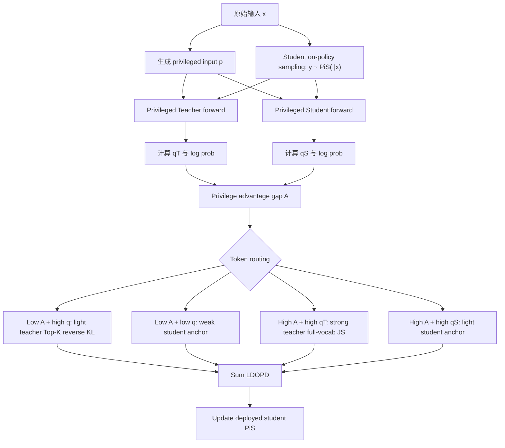

# DOPD: Dual On-policy Distillation

### 元信息与 TL;DR

- **论文**：[DOPD: Dual On-policy Distillation](https://arxiv.org/abs/2606.30626)
- **版本**：arXiv:2606.30626v1，2026-06-29 17:55:53 UTC 提交
- **类型**：大模型后训练 / on-policy distillation / privileged information
- **作者机构**：NUS、MMLab CUHK、PKU、Explore Academy/JD 等
- **核心问题**：OPD 已经用 student 自己采样的轨迹减少分布偏移，但当训练者给 teacher 或 student 加入 privileged information 时，表面提升可能不是可迁移能力，而是信息不对称造成的幻觉。

**TL;DR**

- 这篇论文研究 **on-policy distillation** 在加入 privileged information 之后的失真问题：teacher 或 student 因为看到额外线索而变强，但这种优势不一定能被部署时看不到线索的 student 学会。
- 作者把这个风险命名为 **privilege illusion**：性能差距混合了两部分，一部分是 student 可以通过蒸馏追上的能力差距，另一部分是只能模仿、无法复制的信息差距。
- DOPD 的方法不是把所有 token 都从同一个 teacher 分布里蒸馏，而是计算 teacher 与 student 在同一 privileged context 下的 **privilege advantage gap**，再按 token 动态选择 teacher 强蒸馏、teacher 轻蒸馏、student 弱自锚定或保留 student 探索。
- 实验覆盖 LLM 与 VLM 两条线：LLM 用 Qwen3-8B -> Qwen3-1.7B 为主，VLM 用 Qwen3-VL-8B -> Qwen3-VL-2B 为主；训练数据分别来自 RaR-Science-20K、DAPO-Math-17K、Skywork-OR1-Coding-14K 与 ViRL39K。
- 主要数字是：LLM 平均分从 student 的 39.1 到 Vanilla OPD 的 43.9，再到 DOPD 的 51.4；VLM 平均分从 student 的 48.3 到 Vanilla OPD 的 52.4，再到 DOPD 的 58.4。
- 相对 Vanilla OPD，DOPD 在 LLM 主设置上高 7.5 分，在 VLM 主设置上高 6.0 分；在五组 teacher-student 尺度组合里，DOPD 的平均提升为 11.1 到 14.1 分，明显大于 Vanilla OPD 的 3.5 到 5.5 分。
- 关键证据不只是主表：Figure 3 展示 naive privileged OPD 会后期退化并伴随 entropy collapse；Figure 4 显示删掉 high-advantage token 会严重伤害蒸馏；Table 6、7、8 分别验证 token 路由、divergence 选择和 DOPD 组件的作用。
- 局限也很明确：DOPD 依赖高质量 privileged information，构造和过滤额外线索有成本；训练时多一次 student forward pass；当前 token 路由仍是启发式规则，不是可学习的最优路由器。

### 研究问题：OPD 为什么还需要重新拆解？

#### OPD 原本解决了什么？

- 传统 distillation 常用 teacher 或数据集里的 off-policy 轨迹。
- 问题是 student 部署时会走出自己的状态分布，off-policy 轨迹可能和 student 的真实行为不一致。
- OPD 的改进是：
  - 让 **student policy** 先采样自己的轨迹。
  - 再让 **teacher policy** 在这些轨迹上给 token-level supervision。
  - 这样监督信号更贴近 student 真正会遇到的状态。

可以把 Vanilla OPD 写成：

```text
输入：训练样本 x，student policy ΠS，teacher policy ΠT
1. student 从 ΠS(.|x) 采样输出 y
2. 对 y 的每个 token yn，teacher 给出分布或分数
3. 用 token-level divergence 让 ΠS 靠近 ΠT
输出：一个在自己轨迹上被 teacher 修正过的 student
```

#### privileged information 改变了什么？

论文讨论的 privileged information 不是普通 prompt，而是训练期可见、部署期不可见或不稳定可得的额外线索。

| 场景 | privileged information 示例 | 直觉收益 | 隐藏风险 |
|---|---|---:|---|
| LLM 推理 | step-wise decomposition hints | teacher/student 预测更准 | student 可能只学会依赖提示形态 |
| VLM 理解 | query-related bounding boxes 与 object labels | 视觉 grounding 更清楚 | student 部署时未必有同样标注 |
| 最危险形态 | final answer 或完整 execution trace | 表面分数最高 | 信息差距最大，最容易 shortcut learning |

作者的真正问题不是“privileged information 是否有用”，而是：

- 哪些 token 的提升来自 **可迁移能力**？
- 哪些 token 的提升只是 **训练时多看了答案或线索**？
- 如果两者混在一起蒸馏，student 会不会更快过拟合、熵坍缩、探索变差？

### 论文主张：privilege illusion 是 OPD 的新失败模式

#### claim -> mechanism -> evidence -> boundary

| 层次 | 论文给出的内容 | 我的理解 |
|---|---|---|
| Claim | privileged teacher 的优势不等于可迁移能力 | teacher 看到额外线索后变强，不能直接说明 student 可以学到同样能力 |
| Mechanism | teacher-student gap 被拆成 capability gap 与 information asymmetry gap | 前者可蒸馏，后者只能模仿表象 |
| Evidence | Figure 3 中 privileged teacher/student 的 naive 组合出现后期退化与 entropy collapse | 这说明“加线索 + 全 token 蒸馏”不是单调收益 |
| Boundary | DOPD 仍依赖 privileged information 的质量与路由启发式 | 方法缓解问题，但没有证明能完全识别所有可迁移 token |

#### Figure 3 的意义

Figure 3 比较三种带 privileged information 的 OPD 变体：

- 只给 teacher privileged information。
- 只给 student privileged information。
- teacher 与 student 都给 privileged information。

论文观察到：

- 单边给 privileged information 时，早期有一点提升。
- 后期会因为 information asymmetry 出现性能退化。
- 熵曲线出现 collapse，说明策略分布过早变窄。
- 双边都给 privileged information 时，信息差异被部分抵消，但 uniform distillation 仍然只能带来很有限收益。

这一步很关键，因为它把问题从“teacher 不够强”转成“teacher 强的原因可能不可学”。

### 方法机制：DOPD 如何判断一个 token 该向谁学？

#### 关键变量

论文对每个 on-policy token 计算三个量：

| 符号 | 含义 | 作用 |
|---|---|---|
| x | 原始输入 | 部署时可见的任务条件 |
| p | privileged input | 训练期额外线索 |
| yn | student 采样轨迹里的第 n 个 token | token-level 路由对象 |
| ΠT | teacher policy | 冻结的高能力模型 |
| ΠS | student policy | 被训练的模型 |
| qT | teacher 在 privileged context 下给 yn 的概率 | 判断 teacher 是否自信 |
| qS | student 在 privileged context 下给 yn 的概率 | 判断 student 是否已有自信 |
| A | privilege advantage gap | 判断 teacher-student 的 capability-like 差距 |

核心公式是：

```text
A = | log ΠT(yn | x, p, y<n) - log ΠS(yn | x, p, y<n) |
  = | log ( ΠT(yn | x, p, y<n) / ΠS(yn | x, p, y<n) ) |
```

这个 A 的含义不是普通 loss。

- teacher 与 student 都看到同一个 privileged input。
- 如果 A 很大，说明差异更可能来自模型能力或偏好差异。
- 如果 A 很小，说明二者在 privileged context 下已经接近，继续强行 teacher imitation 的价值不高。

#### 四类 token 路由

DOPD 用 A、qT、qS 的相对大小把 token 分成四类。

| token 类型 | 条件直觉 | 监督来源 | 强度与目标 | 论文解释 |
|---|---|---|---|---|
| Low A + high qS/qT | 二者一致且都自信 | teacher | light, Top-K reverse KL | 可吸收稳定共识，但不必 full imitation |
| Low A + low qS/qT | 二者一致但都不自信 | privileged student | weak, Top-K reverse KL + stop-gradient | 主要用于稳定，避免追逐噪声 |
| High A + high qT | teacher 明显更自信 | teacher | strong, full-vocabulary JS | 最像可迁移能力差距，值得强蒸馏 |
| High A + high qS | student 更自信 | privileged student | light, Top-K reverse KL + stop-gradient | 保留 student 探索，避免 teacher 压制局部分支 |

#### 伪代码

```text
Input:
  dataset D
  student policy ΠS
  frozen teacher policy ΠT
  privileged input generator G
  weak coefficient βw = 0.3
  light coefficient βl = 0.6

State:
  student parameters θS
  teacher parameters θT fixed

For each batch x in D:
  1. Generate or retrieve privileged input p = G(x)
  2. Sample trajectory y ~ ΠS(. | x)
  3. Run privileged teacher forward pass:
       qT,n = ΠT(yn | x, p, y<n)
  4. Run privileged student forward pass:
       qS,n = ΠS(yn | x, p, y<n)
  5. Compute token gap:
       An = |log qT,n - log qS,n|
  6. Drop top 5% outliers and normalize batch statistics
  7. For each token yn:
       If An is low and qS+qT is high:
         use light teacher reverse-KL on Top-K tokens
       Else if An is low and qS+qT is low:
         use weak privileged-student reverse-KL with stop-gradient
       Else if An is high and qT >= qS:
         use strong full-vocabulary teacher JS divergence
       Else:
         use light privileged-student reverse-KL with stop-gradient
  8. Sum token objectives and update θS

Output:
  deployed student ΠS(. | x), without privileged input p

Failure boundary:
  If p is low-quality, leaks final answers, or shifts the task definition,
  the routing signal A can still be misleading.
```

### 公式解释：为什么不用一种 KL 管全部 token？

论文先铺开三种 divergence：

| divergence | 直觉 | 风险 |
|---|---|---|
| Forward KL | 让 student 覆盖 teacher 支持集 | 容易追随 teacher 的低概率噪声 |
| Reverse KL | 让 student 集中到 teacher 高概率模式 | 可能丢掉次级但有用的模式 |
| JS divergence | 在二者之间做更平衡的对齐 | 计算更重，但稳定性较好 |

DOPD 的设计点是：**不同 token 的监督密度和方向不该一样**。

总目标可以写成：

```text
LDOPD = ILH * LLH + ILL * LLL + IHT * LHT + IHS * LHS
```

其中：

- ILH、ILL、IHT、IHS 是四类 token 的 indicator mask。
- LLH 是低 gap 高置信的轻 teacher distillation。
- LLL 是低 gap 低置信的弱 student anchor。
- LHT 是高 gap 且 teacher 自信的强 teacher distillation。
- LHS 是高 gap 且 student 自信的轻 student anchor。

这相当于把 OPD 从“teacher 对所有 token 统一授课”改成“每个 token 先判定它是不是值得强教学”。

### 训练与实验设置

#### 模型设置

| 实验线 | teacher -> student | 额外尺度验证 |
|---|---|---|
| LLM 主实验 | Qwen3-8B -> Qwen3-1.7B | Qwen3-8B/4B/1.7B -> Qwen3-0.6B，Qwen3-8B/4B -> Qwen3-1.7B |
| VLM 主实验 | Qwen3-VL-8B -> Qwen3-VL-2B | 同一视觉蒸馏框架下验证多个 benchmark |

#### 数据与 privileged input

| 模态 | 训练数据 | privileged input | 过滤后规模 |
|---|---|---|---:|
| LLM | RaR-Science-20K、DAPO-Math-17K、Skywork-OR1-Coding-14K | step-wise decomposition hints，不含完整执行过程或最终答案 | 32K |
| VLM | ViRL39K | query-related bounding boxes、object labels、坐标 | 25K |

作者还说明：

- privileged input 由 GPT-5.4 生成。
- 再用 GPT-5.4 做质量复核。
- 低质量样本直接丢弃。
- LLM 与 VLM 的训练分别跑 200 与 300 steps。
- 使用 AdamW、cosine scheduler、learning rate 5e-6。
- batch size 分别是 128 与 64。
- Top-K 中 K=128。
- βw=0.3，βl=0.6。
- 实验使用 8 张 NVIDIA H200 141GB GPU。

### 主结果：DOPD 到底赢在哪里？

#### LLM 主表

Table 1 覆盖 general、reasoning、coding 三类能力。

| 方法 | C-Eval | LiveBench | MATH500 | AIME25 | ZebraLogic | AutoLogi | BFCLv3 | LCBv5 | 平均 |
|---|---:|---:|---:|---:|---:|---:|---:|---:|---:|
| Teacher | 77.1 | 53.5 | 86.9 | 20.2 | 25.0 | 76.3 | 60.0 | 23.6 | 52.8 |
| Student | 60.4 | 35.4 | 72.7 | 9.5 | 12.1 | 59.8 | 51.9 | 11.3 | 39.1 |
| Vanilla OPD | 65.2 | 40.9 | 75.6 | 16.7 | 15.8 | 64.3 | 55.4 | 17.6 | 43.9 |
| ExOPD | 68.3 | 44.7 | 76.7 | 18.5 | 19.9 | 68.0 | 57.2 | 22.6 | 47.0 |
| Uni-OPD | 66.5 | 42.3 | 77.5 | 20.0 | 22.3 | 67.2 | 56.1 | 20.8 | 46.6 |
| EOPD | 67.5 | 45.7 | 75.9 | 17.6 | 19.3 | 67.1 | 56.8 | 19.0 | 46.1 |
| **DOPD** | **71.3** | **49.8** | **81.5** | **23.3** | **26.9** | **71.0** | **60.2** | **27.1** | **51.4** |

关键读法：

- DOPD 比 Vanilla OPD 高 7.5 平均分。
- DOPD 比 ExOPD、Uni-OPD、EOPD 分别高 4.4、4.8、5.3。
- DOPD 在 AIME25、ZebraLogic、LCBv5 上甚至超过 teacher。
- 这不代表 student 全面超过 teacher，而是 privileged training 和 token 路由可能在部分评测上提供了额外泛化收益。

#### VLM 主表

Table 2 覆盖 general、visual reasoning、visual understanding。

| 方法 | RealWorldQA | MMStar | MathVision | DynaMath | LogicVista | MMMU | MMMU-Pro | VSI-Bench | 平均 |
|---|---:|---:|---:|---:|---:|---:|---:|---:|---:|
| Teacher | 71.3 | 70.7 | 53.8 | 67.6 | 55.0 | 69.6 | 55.8 | 59.7 | 62.9 |
| Student | 63.6 | 58.4 | 32.0 | 53.8 | 35.5 | 53.2 | 36.4 | 53.6 | 48.3 |
| Vanilla OPD | 64.7 | 61.8 | 37.1 | 56.2 | 40.2 | 58.0 | 46.7 | 54.1 | 52.4 |
| Uni-OPD | 65.0 | 65.3 | 43.0 | 58.2 | 42.5 | 59.1 | 47.0 | 53.7 | 54.2 |
| Vision-OPD | 66.2 | 66.4 | 38.0 | 57.6 | 43.1 | 64.9 | 52.3 | 56.1 | 55.6 |
| VA-OPD | 67.0 | 66.2 | 38.7 | 57.7 | 43.1 | 66.1 | 54.2 | 57.5 | 56.3 |
| **DOPD** | **67.4** | **67.2** | **45.6** | **60.5** | **47.7** | **67.0** | **53.9** | **57.8** | **58.4** |

关键读法：

- DOPD 比 Vanilla OPD 高 6.0 平均分。
- DOPD 比 VA-OPD 高 2.1 平均分。
- 视觉理解任务上提升尤其明显，说明 structured visual annotations 的 privileged signal 比最终答案更像可迁移 grounding 能力。

### 尺度、持续学习与 OOD：不是只赢一张主表

#### 五组 teacher-student 尺度

Table 3 的重要性在于：它检查 DOPD 是否只适合 Qwen3-8B -> 1.7B 这一组。

| 模型对 | Vanilla OPD 平均 | DOPD 平均 | DOPD 提升幅度 |
|---|---:|---:|---:|
| Qwen3-8B -> Qwen3-0.6B | 29.7 | 40.3 | +10.6 |
| Qwen3-8B -> Qwen3-1.7B | 43.9 | 51.4 | +7.5 |
| Qwen3-4B -> Qwen3-0.6B | 30.9 | 39.9 | +9.0 |
| Qwen3-4B -> Qwen3-1.7B | 44.0 | 50.2 | +6.2 |
| Qwen3-1.7B -> Qwen3-0.6B | 31.7 | 38.1 | +6.4 |

论文还用 Figure 6 强调：

- 当 teacher-student size ratio 变大时，Vanilla OPD 的收益反而可能下降。
- Qwen3-8B -> Qwen3-0.6B 中，Vanilla OPD 只有 +3.5。
- 同一设置下 DOPD 有 +14.1，并恢复 53.0% 的 teacher-student gap。

这说明 DOPD 的价值更像“处理不兼容 teacher 信号”，而不只是对某一组模型调参。

#### 持续学习

Figure 7a 的三阶段设置是：

- 第一阶段只加入 general 数据。
- 第二阶段加入 reasoning 数据。
- 第三阶段加入 coding 数据。

作者观察：

- OPD 类方法本来就比 SFT/GRPO 更不容易灾难遗忘。
- DOPD 进一步让新能力逐步积累。
- 旧领域性能只出现很小退化。

这里的核心不是“DOPD 是持续学习算法”，而是 token 路由减少了过度 imitation 后，模型分布不容易被新数据域粗暴覆盖。

#### OOD 泛化

Figure 7b 用 coding/reasoning 互为训练与测试外域：

- 在 coding 数据上优化，再测 reasoning。
- 在 reasoning 数据上优化，再测 coding。

DOPD 比第二名分别高 3.1 与 4.3 分。

这支持一个有限判断：

- DOPD 不只是记住 privileged hint 的表面模式。
- 它更可能转移了一部分跨域可用的能力信号。
- 但这仍然是 benchmark 内的 OOD，不等于真实部署 OOD。

### 消融与失败：哪些设计是真的必要？

#### high-advantage token 是核心

Figure 4 做了一个很直接的 token ablation：

- 随机丢 20% token。
- 丢 low-advantage 20% token。
- 丢 high-advantage 20% token。

结果：

- 丢 random 或 low-advantage token，对 Vanilla OPD 影响较小。
- 丢 high-advantage token，会显著降低性能和效率。
- 在 VLM 中，这个差距更明显，去掉 high-advantage token 后只保留约 20% 的 Vanilla OPD 改进。

这正好支撑了 DOPD 的核心假设：

```text
不是所有 token 都同等重要。
真正该强蒸馏的是 capability-bearing token。
```

#### privileged input 不能给得太“答案化”

Table 4 和 Table 5 比较不同 privileged input。

| 模态 | 最好 privileged input | 最差倾向 | 论文解释 |
|---|---|---|---|
| LLM | step-wise hints without execution | final answer | 最终答案造成最严重 information gap |
| VLM | bounding box with object label | final answer 或纯 caption 较弱 | bbox+label 更像 grounding 线索 |

LLM 上：

- final answer 只有 C-Eval 59.5、LiveBench 36.7。
- step-wise hints without execution 达到 C-Eval 71.3、LiveBench 49.8。
- no privileged input 为 C-Eval 63.0、LiveBench 39.4。

这个结果很反直觉：

- “给答案”看起来信息最多。
- 但它最可能让 student 学到不可迁移捷径。
- 适度提示反而更适合作为能力导向的监督。

#### Table 6：四类 token 必须自适应组合

Table 6 的读法是：

- 单独使用 high teacher probability / low student probability 这一类 token，已经能超过等权全 token 的设置。
- 但如果把所有 token 又按同一方式合并，收益并不会自然叠加。
- 加上 adaptive mechanism 后，全四类 token 在 Step-160 达到 49.8。

这说明 DOPD 的贡献不是简单筛 token。

更准确地说：

- 它识别 token 类型。
- 它给不同 token 分配不同 source。
- 它还给不同 token 分配不同 divergence 和 granularity。

#### Table 7：JS + full vocabulary 为什么只给关键 token？

Table 7 在等权条件下比较 objective 与 strategy。

| 设计轴 | 趋势 | 代价 |
|---|---|---|
| sampled token -> Top-K -> full vocabulary | 表现逐步变好 | 计算和显存增加 |
| forward/reverse KL -> JS | JS 在该设置下更稳 | 仍需控制适用 token |

这解释了 DOPD 为什么不对所有 token 都用 full-vocabulary JS：

- full-vocabulary 信息密度高。
- 但对低价值 token 全量对齐，会增加噪声和成本。
- 因此只给 high A + high qT 的 token 用强 JS 更合理。

#### Table 8：组件消融

| 变体 | C-Eval | LiveBench | 损失含义 |
|---|---:|---:|---|
| w/o Privileged Input | 63.6 | 38.3 | 没有 p，就无法计算可信 advantage gap |
| w/o Distillation from Student Policy | 70.4 | 47.9 | student 自锚定有辅助作用 |
| w/o Distillation from Teacher Policy | 65.9 | 41.2 | teacher 仍是主要能力来源 |
| w/o Advantage-aware Distillation | 67.6 | 41.3 | 不区分 token，收益大幅下降 |
| w/o Adaptive Divergence Objectives | 70.0 | 46.7 | objective 路由有贡献 |
| w/o Adaptive Divergence Strategies | 70.8 | 46.1 | granularity 路由有贡献 |
| **DOPD** | **71.3** | **49.8** | 完整组合最佳 |

这里最值得注意的是：

- 去掉 teacher distillation 伤害最大之一。
- 但去掉 advantage-aware 后 LiveBench 从 49.8 掉到 41.3。
- 所以 DOPD 的核心不是“双源”本身，而是 **advantage-aware 双源路由**。

### 更细的实验读法：哪些数字最能支撑论文主张？

#### 1. 主表不是简单平均分胜利

如果只看平均分，DOPD 很容易被理解成“又一个更强 OPD 变体”。但这篇论文更值得看的，是不同任务类型上的提升形态。

| 任务类型 | DOPD 的表现 | 对主张的支撑 |
|---|---|---|
| general | C-Eval 与 LiveBench 同时提升 | 说明方法不是只对数学或代码专门调参 |
| reasoning | MATH500、AIME25、ZebraLogic 都强 | high-advantage token 可能捕获了关键推理分支 |
| coding/tool | BFCLv3、LCBv5 提升明显 | token-level 分布监督对结构化输出也有价值 |
| VLM grounding | MathVision、LogicVista、MMMU 系列提升 | structured visual privileged input 比纯文本 hint 更适合 grounding |

我的判断是：

- DOPD 的强项不在“每个任务都小幅上涨”。
- 它真正重要的是：在 teacher-student 差距较大、任务需要结构化中间能力时，统一 imitation 更容易失效，而 DOPD 的选择性监督更稳。
- 这和论文提出的 privilege illusion 是一致的：越复杂的任务，越容易把“额外线索带来的短期可预测性”误认为“可迁移能力”。

#### 2. AIME25 与 ZebraLogic 为什么值得单独看？

LLM 主表里，AIME25 从 student 的 9.5 到 Vanilla OPD 的 16.7，再到 DOPD 的 23.3。

ZebraLogic 从 student 的 12.1 到 Vanilla OPD 的 15.8，再到 DOPD 的 26.9。

这两个任务有一个共同点：

- 只模仿最终 token 分布不够。
- 中间步骤的分支选择非常重要。
- 某些 token 对后续路径有放大效应。

因此 high A + high qT 这类 token 更像“路径转折点”。

如果这些 token 被 full-vocabulary JS 强监督，student 不只是学到一个答案格式，而是更可能学到：

- 哪一步需要引入约束。
- 哪个变量应该被保留。
- 哪个候选分支需要排除。
- 哪种代码或函数调用结构更可靠。

这也是 Figure 4 的意义：删掉 high-advantage token 后，剩下的 token 仍有一些收益，但关键分支的学习效率明显下降。

#### 3. 为什么 final answer privileged input 反而差？

Table 4 中 final answer 的结果看似异常：

- C-Eval 59.5，低于 no privileged input 的 63.0。
- LiveBench 36.7，低于 no privileged input 的 39.4。

这说明最终答案不是“更强监督”，而可能是“更坏监督”。

原因可以拆成三层：

- **信息不可迁移**：部署时 student 不会拿到 final answer。
- **梯度指向错误**：模型被鼓励贴近一个由答案泄漏支撑的分布。
- **探索被压缩**：熵下降后，student 更少尝试替代推理路径。

这对后训练很有启发：

- 数据里有答案不代表答案适合进入训练上下文。
- 有些辅助信息应该只用于 verifier 或 reward，而不该直接作为 distillation condition。
- 如果训练过程看见了部署时看不见的线索，必须区分它是 capability scaffold 还是 leakage。

#### 4. VLM 结果说明 privileged input 需要“任务同构”

VLM 上，bounding box with object label 最好。

这不是因为它信息最多，而是因为它和视觉任务的能力结构同构：

- 视觉问答需要先定位对象。
- bbox 给出空间约束。
- object label 给出语义锚点。
- 二者都不会直接给出最终推理答案。

相比之下：

- final answer 太强，容易泄漏。
- caption 太弱，可能无法支持精确 grounding。
- bbox with caption 信息更多，但未必更贴近模型需要学习的对象级判断。

因此，DOPD 的一个隐含原则是：

```text
好的 privileged input 应该提供可迁移的中间结构，
而不是替模型完成最终决策。
```

### 复现清单：真正落地 DOPD 需要哪些模块？

#### 数据侧

- 需要原始训练样本 x。
- 需要 student on-policy rollout，而不是固定离线答案。
- 需要为每个样本构造 privileged input p。
- 需要过滤 p，避免 final-answer leakage。
- 需要记录每个 token 的 qT、qS、log probability 与路由类别。

#### 模型侧

- teacher 要冻结，否则 teacher distribution 本身会漂移。
- student 要跑两种 forward：
  - 普通部署 context：ΠS(. | x, y<n)。
  - privileged context：ΠS(. | x, p, y<n)。
- teacher 也要跑 privileged forward：
  - ΠT(. | x, p, y<n)。

#### 损失侧

| token regime | 要实现的 loss | 复现风险 |
|---|---|---|
| Low A + high q | Top-K reverse KL 到 teacher | K 值和 βl 影响很大 |
| Low A + low q | Top-K reverse KL 到 privileged student stop-gradient | stop-gradient 漏掉会造成 target drift |
| High A + high qT | full-vocabulary JS 到 teacher | 显存和通信成本高 |
| High A + high qS | Top-K reverse KL 到 privileged student stop-gradient | 过强会抑制探索 |

#### 日志侧

我认为复现时至少要记录：

- 每类 token 的比例。
- 每类 token 的平均 loss。
- 每类 token 的 entropy 变化。
- high A token 在不同任务类型里的位置。
- final answer leakage 检测结果。
- full-vocabulary JS 占总训练时间的比例。

否则即使复现出分数，也很难判断 DOPD 是真的按论文机制工作，还是某个超参偶然变好。

### 失败案例推演：DOPD 在哪里可能不工作？

#### privileged input 质量不稳定

如果 p 本身有噪声，A 会被污染。

典型情况包括：

- hint 写错关键步骤。
- bbox 框到错误对象。
- object label 过粗或冲突。
- 生成器把 final answer 暗含在提示中。

这会让 DOPD 的路由变成“对坏线索的精细蒸馏”，反而比 Vanilla OPD 更危险。

#### teacher 与 student 的 tokenizer 或输出风格差异太大

DOPD 以 token-level 概率为核心。

如果 teacher 与 student 的分词、格式偏好、语言风格差异过大：

- A 可能反映 tokenization artifact。
- qT/qS 的相对大小不再代表能力差距。
- high A token 可能只是表面措辞差异。

论文使用同一 Qwen3 家族，可以降低这个问题；跨模型家族时要重新验证。

#### 部署任务和训练 privileged input 不同构

如果训练时 privileged input 是人工精心构造的 step hint，但部署任务没有任何类似中间结构：

- student 可能学到一些中间能力。
- 也可能只学到“看到这类 hint 时如何行动”。
- OOD benchmark 改善不能完全排除这种风险。

因此，DOPD 最适合的场景不是任意加线索，而是：

- 线索代表任务真实中间结构。
- 线索不泄漏最终答案。
- 线索能被 student 的内部能力近似重建。

### 和近期后训练工作的区分

#### 与普通 OPD 改进不同

很多 OPD 改进关注：

- rollout 更快。
- teacher 更强。
- KL 更稳定。
- token 采样更高效。

DOPD 关注的是另一个问题：

- 监督信号为什么强？
- 这个强度是否可迁移？
- 哪些 token 值得高成本对齐？

#### 与“更多数据 + 更强 teacher”不同

论文并没有主张靠更大 teacher 或更多样本解决问题。

相反，它指出：

- teacher 越强、privileged input 越多，表面差距越可能混入 information asymmetry。
- 如果不分辨 gap 来源，更强 teacher 也可能给出更难学或更误导的 token 分布。

这对后训练实践很重要：

- 不能把 teacher score 当成唯一数据质量指标。
- 也不能把 privileged trace 当成天然 gold supervision。
- 需要对监督信号做“可迁移性审计”。

### 图表证据逐项解读

| 图表 | 证明什么 | 不能证明什么 |
|---|---|---|
| Figure 1 | DOPD 在 LLM/VLM 主 benchmark 平均和单项上优于对照 | 不能证明所有模型家族都适用 |
| Figure 2 | DOPD 是 standard/self/adaptive 之后的 dual distillation 形态 | 只是方法定位图，不是实验结果 |
| Figure 3 | naive privileged OPD 会出现后期退化和熵坍缩 | 没证明所有 privileged signal 都有害 |
| Figure 4 | high-advantage token 对蒸馏收益最关键 | high A 只是 proxy，不等于绝对因果标签 |
| Figure 5 | DOPD 的整体数据流与四路 token 路由 | 不能说明路由阈值最优 |
| Figure 6 | DOPD 在更大 size ratio 下比 Vanilla OPD 更稳 | 仍限于 Qwen3 系列 |
| Figure 7 | 持续学习和 OOD 任务中 DOPD 更好 | OOD 是 benchmark 间迁移，不是真实开放世界 |
| Figure 8 | DOPD 训练曲线和 entropy 更稳定 | 需要更多超参和硬件复现实验 |
| Figure 9 | 四类 token 的语义角色可解释 | 可视化样例不能替代系统性因果证明 |
| Figure 10 | βw=0.3、βl=0.6 较稳 | 不是跨任务通用最优值 |

### Mermaid：DOPD 的训练闭环



### 相关工作位置：它和 OPD、self-distillation、RL 有什么关系？

#### 与 Vanilla OPD 的关系

- Vanilla OPD 的价值是 on-policy trajectory。
- DOPD 保留这个价值。
- 它只改变 token-level supervision 的来源、强度和 divergence。

#### 与 self-distillation 的关系

- self-distillation 让模型在不同上下文或条件下自己教自己。
- DOPD 使用 privileged student 作为一部分监督来源。
- 但 DOPD 不把 student 自监督当主能力来源，而把它作为稳定器和探索保留机制。

#### 与 RL 后训练的关系

- DOPD 不是 GRPO/RLHF 这类 reward-driven 优化。
- 它仍是 distillation，以 token-level distribution matching 为主。
- 但论文引用 entropy collapse 与 reasoning RL 的讨论，说明它关心同一个训练稳定性问题：策略分布如果过早收缩，后续探索和泛化都会受损。

### 结论与局限

#### 结论

这篇论文最有价值的地方，是把 post-training 中一个常见但容易被忽略的现象命名并结构化：

- 训练期多给 teacher 或 student 一些线索，未必等于更好的可迁移监督。
- 能力差距和信息差距混在一起时，dense token supervision 可能越密越坏。
- 一个更合理的 OPD 应该问：这个 token 的 teacher advantage 是否来自能力，而不是仅来自 privileged input？

DOPD 的答案是：

- 用同一 privileged context 下的 teacher-student log-prob 差构造 proxy。
- 用 token probability 判断信号是否可靠。
- 用四路路由把 teacher transfer、student anchor、strong/full-vocab 与 light/Top-K 组合起来。

#### 局限

- **privileged input 成本**：论文使用 GPT-5.4 生成并复核 privileged input，这会引入额外成本和模型依赖。
- **额外计算**：相比 Vanilla OPD，DOPD 至少多一次 privileged student forward pass。
- **启发式路由**：A、qT、qS 的阈值来自 batch statistics 和规则，不是学习出来的策略。
- **模型范围**：实验集中在 Qwen3 与 Qwen3-VL 家族，跨架构结论仍需验证。
- **数据透明度**：论文没有给出可直接复现实验的代码仓库；当前只能依据论文描述复现流程。
- **部署差距**：训练时有 privileged input，部署时没有；DOPD 缓解这个差距，但没有消除所有可能的 distribution mismatch。

### 领域延伸：后训练研究下一步该问什么？

#### 1. privileged information 需要分级，而不是越多越好

这篇论文给出的经验很清楚：

- final answer 是高信息量，但低可迁移性。
- step-wise hints without execution 反而更适合能力迁移。
- bbox + object label 比纯 caption 更适合视觉 grounding。

后续研究可以把 privileged information 当成一个可控变量：

| 等级 | 内容 | 风险 | 适合用途 |
|---|---|---|---|
| 低 | 简短 hint、对象标签 | 信号弱 | 稳定常规蒸馏 |
| 中 | 分步提示、结构化 grounding | 成本中等 | 能力迁移 |
| 高 | execution trace、final answer | shortcut learning | 只适合诊断，不宜直接蒸馏 |

#### 2. token routing 可以成为后训练的通用抽象

DOPD 暗示一个更一般的方向：

- 不同 token 对能力迁移的贡献不同。
- 不同 token 应该用不同监督源。
- 不同 token 应该用不同损失密度。

这不只适用于 distillation。

可能延伸到：

- RL 中按 token 分配 advantage 或 entropy regularization。
- SFT 中按 token 过滤低价值模板语言。
- preference training 中区分真正偏好 token 与格式 token。
- tool-use agent 中区分 tool argument token 与自然语言解释 token。

#### 3. 安全角度：privilege illusion 也是一种训练期风险

在 AI 安全语境里，privilege illusion 的危险在于：

- 模型看似学会了推理。
- 实际只是学会了训练期线索的表面相关。
- 一旦部署时线索消失，行为会退化。
- 更糟的是，评测如果也带有类似线索，会高估能力。

这和安全评测中的 data leakage、benchmark contamination、prompt overfitting 有相似结构。

DOPD 的贡献是把这种风险推进到 token-level：

```text
不是整条样本 contaminated 或 clean，
而是同一条轨迹里的不同 token 可能有不同的信息污染程度。
```

#### 4. 复现时最该盯住什么？

如果要复现这篇工作，我会优先盯四个点：

- privileged input 的生成质量：是否真的不泄露 final answer。
- A 的统计稳定性：batch normalization 和 top 5% outlier removal 是否影响很大。
- 训练成本：多 forward pass 与 full-vocabulary JS 的显存开销。
- 路由可解释性：high A + high qT token 是否真的对应人类可理解的关键推理步骤。

#### 5. 最值得继续追问的问题

- DOPD 的 routing mask 能否用小模型或 learned router 替代？
- privilege advantage gap 是否能扩展到 reward model、verifier 或 tool execution feedback？
- 如果 privileged input 本身来自另一个模型，如何检测它的偏差和幻觉？
- DOPD 在非 Qwen 架构、MoE 模型、agent tool-use 轨迹上是否仍然有效？
- token-level selective distillation 能否和 RL 的 entropy control 合并成一个统一后训练框架？

### 一句话总结

DOPD 的核心不是“给 student 更多 teacher 信号”，而是更谨慎地回答：**哪些 token 真的承载可迁移能力，哪些 token 只是 privileged information 造成的幻觉优势**。这让它成为一篇值得放进后训练方法论脉络里的论文，而不是又一个单表提升的 distillation 变体。
