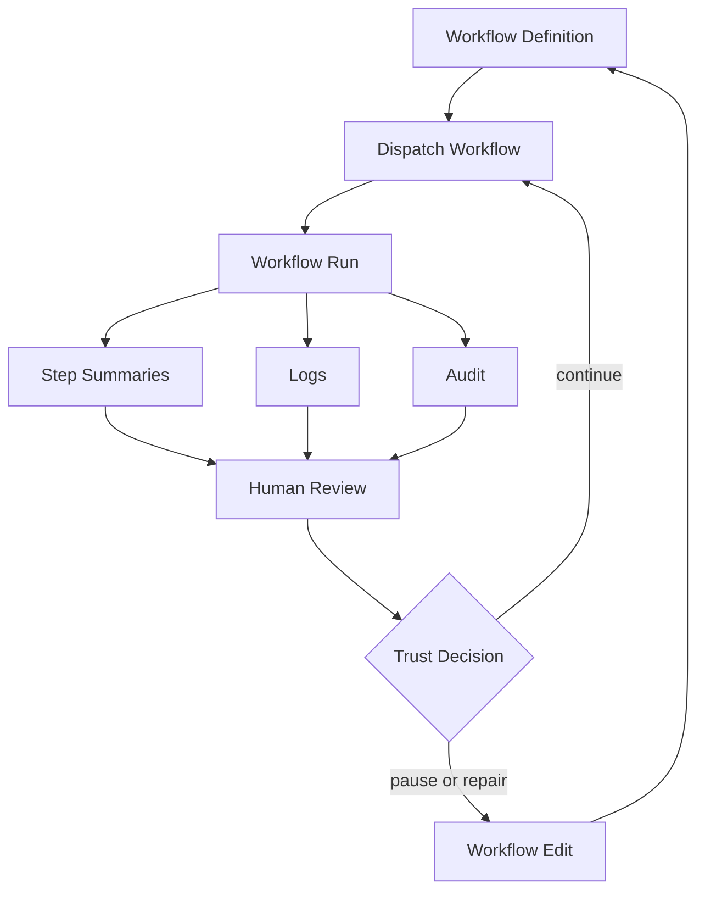
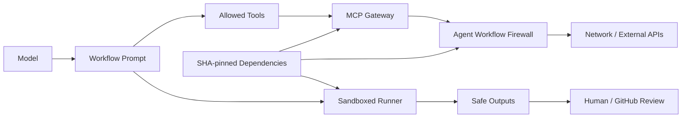

# GitHub Agentic Workflows 6 月 29 日周报：从“能跑的 Agent”转向“可审计、可降权、可评测的工作流系统”

原文：<https://github.github.com/gh-aw/blog/2026-06-29-weekly-update/>

相关材料：

- 仓库：<https://github.com/github/gh-aw>
- Canvas PR：<https://github.com/github/gh-aw/pull/42137>
- Sandbox hardening PR：<https://github.com/github/gh-aw/pull/42119>
- Code Scanning Fixer PR：<https://github.com/github/gh-aw/pull/42139>
- Agent Persona Explorer 修复 PR：<https://github.com/github/gh-aw/pull/42112>

### TL;DR

- 这篇 2026-06-29 的 GitHub Agentic Workflows 周报，不是普通版本日志；它把 Agent 工程系统的三条主线放在同一周里展示：**操作界面、执行约束、安全修复自动化**。
- 新增的 Copilot Canvas extension 把 agentic workflow 的定义、运行、详情、分发、日志和审计命令放进 Copilot 内部视图；这意味着 Agent 不再只是后台 workflow，而开始拥有面向人类操作者的控制台。
- Sandbox hardening 把 `sandbox.agent.sudo: false` 覆盖从 127/257 提升到 206/257，覆盖率为 80.16%；这个数字的意义不是“安全完成”，而是把默认降权从局部约定推进为大多数 workflow 的可编译配置。
- Code Scanning Fixer 从只处理 critical/high 扩展到枚举全部 open code scanning alerts，再按 `critical > high > medium > low` 等顺序选择；这改变的是自动修复 Agent 的队列边界，而不是简单“多扫几个告警”。
- Runtime 更新把 `gh-aw-mcpg` 提到 v0.3.32、`gh-aw-firewall` 提到 v0.27.13，并继续使用 SHA-pinned container digests；这说明系统把 MCP 网关、防火墙和供应链 pinning 当作运行时可信边界的一部分。
- Agent Persona Explorer 每轮选 3 个角色、每个角色生成 2 个场景，从 clarity、tool selection、security awareness、efficiency、output quality 五个维度评测 `agentic-workflows` agent；最近三次运行中两次成功，一次因 cache-memory 路径问题失败，并在同周 PR 中修复。
- 证据边界很清楚：周报提供的是工程合并、配置覆盖率、流程设计和运行样例，不是正式 benchmark；它能证明 GitHub/gh-aw 正在把 Agent 纳入可视化、可降权、可审计的 workflow 平台，不能证明这些 guardrails 已覆盖全部攻击面。

### 这篇周报真正回答什么问题？

如果把 Agent 当成“会调用工具的大模型”，这篇周报会显得很碎：

- 一个 Copilot Canvas dashboard。
- 一批 sandbox 字段。
- 一个 code scanning fixer。
- 两个 runtime component bump。
- 一个 persona exploration agent。

但如果把 Agent 当成**组织里的可运行自动化单元**，这些更新指向同一个问题：

> 当 Agent 开始读仓库、改代码、跑命令、触发 workflow、修安全告警时，系统应该怎样让人类看得见、让权限降下来、让修复队列可排序、让评测能复现？

这不是模型能力问题，而是 Agent 操作系统问题。`gh-aw` 仓库 README 对项目定位的表述也支持这个理解：它把 agentic workflows 写成自然语言 Markdown，然后在 GitHub Actions 中运行；同时强调 guardrails、安全、sandbox、input sanitization、network isolation、SHA-pinned dependencies、tool allow-listing 和 compile-time validation。

换句话说：

- **Markdown workflow** 是 Agent 意图表达层。
- **GitHub Actions** 是执行调度层。
- **Copilot/Codex/Claude/Gemini 等模型** 是推理与生成层。
- **sandbox/firewall/MCP gateway/safe-outputs** 是约束层。
- **Canvas、logs、audit、persona explorer** 是人类观察与评测层。

6 月 29 日周报的价值就在这里：它不是宣传某个新模型，而是展示 Agent 工作流平台怎样把“自动化能力”重新包进工程治理。

### 论证路线：claim → mechanism → evidence → boundary

| Claim | Mechanism | Evidence | Boundary |
|---|---|---|---|
| Agent 工作流需要原生操作界面 | Copilot Canvas extension 暴露 definitions、runs、run detail、dispatch、logs、audit | PR #42137 增加 `.github/extensions/agentic-workflows-dashboard`，动作包括 `listDefinitions`、`listRuns`、`getRun`、`dispatchWorkflow`、`runGhAwLogs`、`runGhAwAudit` | 周报证明有 dashboard 与动作接口，不证明真实大规模使用体验 |
| Agent 默认执行权限必须收紧 | `sandbox.agent.sudo: false` 写入 workflow frontmatter 并同步 lock 文件 | PR #42119 把覆盖从 127/257 提到 206/257，即 80.16%；新增 79 个 workflow specs | 仍有 51/257 未覆盖，且 provenance-managed workflows 被保留不改 |
| 安全修复 Agent 不应只看最高严重级别 | 枚举全部 open alerts，再按严重度排序选择 | PR #42139 移除 critical/high-only 查询，优先 `rule.security_severity_level`，无该字段时 fallback 到 rule severity | 扩展队列会增加上下文与 triage 压力，周报没有给出吞吐量数据 |
| Agent 运行时可信边界需要组件 pinning | 更新 MCP gateway 与 firewall，容器 digest 仍写入 `action_pins.json` | 周报列出 `gh-aw-mcpg` v0.3.31 → v0.3.32，`gh-aw-firewall` v0.27.12 → v0.27.13 | 这是低迁移风险版本 bump，不等于安全性质已形式化验证 |
| Agent 自身也要被 Agent 评测 | persona explorer 生成角色与场景，打分并写入 issue | 周报记录 3 次运行、2 次成功、一次 cache path 故障；PR #42112 修复路径语义 | 样本数小，A/B 实验仍未完成，不能当成稳定 benchmark |

这个表可以看出一个关键点：

- 每个 claim 都不是“模型更聪明了”。
- 每个 mechanism 都落在工程控制面。
- 每个 evidence 都有 PR、覆盖率、字段、接口或运行次数。
- 每个 boundary 都提醒我们：这是工程迭代，不是最终安全证明。

### Canvas extension：为什么 Agent 需要一个“控制台”？

周报第一项是 Copilot Canvas extension。表面看，它是一个嵌入 Copilot app 的 dashboard；更深的含义是：Agent workflow 的操作对象正在从 YAML/CLI/Actions 页面，移动到一个专门面向 Agent 的控制面。

PR #42137 把它拆成几组能力：

- 浏览 workflow definitions。
- 浏览 workflow runs。
- 查看单个 run 的 step summary。
- 触发某个 workflow。
- 运行 `gh aw logs` 相关命令。
- 运行 `gh aw audit` 相关命令。

这些能力的组合很重要。一个只会“触发 workflow”的界面，会鼓励用户把 Agent 当成按钮；一个能同时看定义、看运行、看详情、看日志、看审计的界面，才更像控制平面。

可以用一个简单的状态图理解：



这个图的重点不是 UI，而是闭环：

- 定义不是静态文档，它会被分发。
- 运行不是黑箱，它会产生 step summary。
- summary 不是唯一证据，还要和 logs、audit 合看。
- 人类不是只点“approve”，而是在运行证据之后做 trust decision。

PR 里提到 safe markdown rendering，这个细节也值得单独看。Agent run summary 很容易携带 markdown、代码块、链接或伪装文本；如果 dashboard 直接把 Agent 输出插入 DOM，就会把“模型输出可信”错误扩大成“界面输出可信”。受限渲染的意义是：

- 对 Agent summary 做显示层隔离。
- 只允许有限格式转换。
- 把 run detail 作为审计材料，而不是任意 HTML。

这和 AI 安全里的一个老问题相同：模型生成的解释不是可信证据；它必须被放进一个受限、可追踪、可交叉验证的容器里。

### Sandbox hardening：80.16% 覆盖率说明了什么？

周报第二项给了一个很具体的数字：

| 指标 | 数值 |
|---|---:|
| 原覆盖 workflow 数 | 127 |
| 总 workflow 数 | 257 |
| PR 新增 hardening workflow 数 | 79 |
| 新覆盖 workflow 数 | 206 |
| 新覆盖率 | 80.16% |
| 仍未覆盖 workflow 数 | 51 |

这个更新的核心字段是：

```yaml
sandbox:
  agent:
    sudo: false
```

它的研究意义不在于“sudo false 很安全”这种口号，而在于 workflow 平台把权限约束写入了可编译、可同步、可审计的配置层。PR #42119 同时更新 `.github/workflows/*.md` 的 frontmatter 和对应 `.lock.yml`，说明它不是只改源描述，还把编译产物同步到了 runtime 会消费的形态。

可以把覆盖率写成一个非常朴素的公式：

```text
coverage = hardened_workflows / total_workflows
         = 206 / 257
         = 80.16%

remaining_gap = 1 - coverage
              = 51 / 257
              = 19.84%
```

变量解释：

- `hardened_workflows`：显式包含 `sandbox.agent.sudo: false` 的 workflow。
- `total_workflows`：当前统计口径下的 workflow 总数。
- `remaining_gap`：还没有被该字段覆盖的 workflow 比例。

这个公式虽然简单，但它迫使我们不要把安全更新读成“完成”。80.16% 是一个里程碑，同时也是一个缺口报告：

- 多数 workflow 已经默认降权。
- 仍有近五分之一 workflow 不在这次覆盖内。
- provenance-managed workflows 被保留不改，说明系统还存在来源管理边界。
- lock 文件同步降低了“源码配置和运行配置不一致”的风险，但不能替代运行时行为验证。

从 Agent 安全角度看，这个更新把风险从“模型是否会做危险事”转成了更可工程化的问题：

- workflow 是否默认无 sudo？
- 编译产物是否和源配置一致？
- network isolation 是否同时生效？
- 被 source 管理的 workflow 谁来维护？
- audit 能否发现未覆盖 workflow？

这比抽象讨论“Agent 应该安全”更有操作价值。

### Code Scanning Fixer：从“高危优先”到“全队列可排序”

Code Scanning Fixer 的更新也容易被误读。它不是说中低危告警现在和 critical 一样重要；它说的是：自动修复 Agent 的输入队列不应该在查询阶段就硬过滤掉大量 open alerts。

PR #42139 的逻辑可以写成伪代码：

```text
Input:
  repo
  open_code_scanning_alerts
  cached_or_recently_attempted_alerts

State:
  severity_order_security = [critical, high, medium, low]
  severity_order_rule = [error, warning, note]

Loop:
  1. Query all open code scanning alerts for repo.
  2. For each alert:
       if alert has rule.security_severity_level:
           rank by security severity order
       else:
           rank by rule severity fallback order
  3. Remove alerts already cached as attempted or unfixed.
  4. Select highest-priority remaining alert.
  5. If none exists:
       report no-op message and stop.
  6. Otherwise:
       generate fix branch / PR body / remediation workflow.

Output:
  next alert selected for automated repair, or no-op report.

Failure boundary:
  If alert metadata is incomplete, fallback ordering may mis-rank work.
  If too many low-value alerts exist, context budget and review bandwidth become new bottlenecks.
```

这个伪代码揭示了一个设计取舍：

- 在查询阶段保留全部 open alerts，可以避免 medium/low 长期沉积。
- 在选择阶段按 severity-first 排序，可以保持“先修更严重问题”的策略。
- 在缓存阶段排除已尝试项，可以避免 Agent 卡在同一个修复失败上。
- 在 no-op 阶段泛化消息，可以避免 workflow 文案仍暗示只处理高危。

这和很多安全自动化系统的常见失败有关。只处理 critical/high 会让系统看起来“专注”，但也可能造成两个副作用：

- 中低危告警永远没有自动化尝试。
- 一旦高危队列清空，Agent 不能自然转向下一层风险。

但反过来，全量队列也不是免费午餐。它引入了新的边界：

- medium/low 的误报比例可能更高。
- 自动修复 PR 可能变多，人工 review 成本上升。
- 低严重度修复可能抢占本该给架构级风险的上下文。

因此这项更新最值得带走的不是“处理更多告警”，而是“把队列边界从静态过滤改成可排序选择”。这是 Agent 修复系统走向长期运行必须面对的结构性问题。

### Runtime：MCP gateway、firewall 与 SHA pinning 放在一起看

周报列出的 runtime 更新只有两行：

| Component | Old | New |
|---|---|---|
| gh-aw-mcpg | v0.3.31 | v0.3.32 |
| gh-aw-firewall | v0.27.12 | v0.27.13 |

如果孤立看，这是普通依赖 bump。但结合 README 的 guardrails 段落，它更像 Agent runtime 的信任边界图：



这个图说明：

- 模型不是直接访问网络。
- 工具调用先经过 allow-list 与 MCP gateway。
- 网络出口受 firewall 控制。
- runner 在 sandbox 中运行。
- 输出经 safe-outputs 进入人类 review。
- 依赖与容器 digest pinning 把供应链漂移限制在显式更新里。

这套结构对 Agent 安全的意义是“多点约束”。任何单点都不够：

- 只靠模型拒绝，不足以阻止 prompt injection 后的工具调用。
- 只靠 sandbox，不足以控制外部 API 泄漏。
- 只靠 firewall，不足以阻止本地文件误读。
- 只靠 code review，不足以审查全部中间步骤。
- 只靠 pinning，不足以证明业务逻辑安全。

因此 runtime bump 值得写进周报，不是因为版本号本身很大，而是因为它提醒读者：Agent 平台的安全进化往往发生在这些“无迁移、低风险”的基础组件里。

### Agent Persona Explorer：用 Agent 测 Agent 的盲点

周报最后的 Agent of the Week 是 `agent-persona-explorer`。它的工作方式很有代表性：

- 从 9 个角色池中每次选择 3 个角色。
- 每个角色生成 2 个 automation scenarios。
- 把场景交给 `agentic-workflows` custom agent。
- 从 5 个维度评分：
  - clarity
  - tool selection
  - security awareness
  - efficiency
  - output quality
- 把结果发布为带 `agent-research` label 的 GitHub issue。
- 使用 cache memory 记录 rotation history，避免连续测试同一角色切片。

这其实是一个轻量的“角色覆盖测试”。它不直接证明 Agent 的能力上限，而是在问：

> 当不同岗位的人以不同意图请求 Agent 时，Agent 是否仍能选对工具、保持安全意识、给出可执行输出？

这个视角比单一 benchmark 更贴近真实组织使用。Agent 的失败常常不是“不会做题”，而是：

- 对 DevOps 场景低估权限风险。
- 对 Product Manager 场景给出过度技术化输出。
- 对 Data Scientist 场景遗漏数据治理。
- 对 Frontend Developer 场景忽略视觉验证。
- 对 Backend Engineer 场景跳过迁移风险。

PR #42112 的 cache-memory 修复也说明了评测 Agent 自身的脆弱性。原先 prompt 使用逻辑 key，cache-memory 期望文件路径，导致可能出现 false `cache_memory_miss`。修复把 history 读写位置明确为 `/tmp/gh-aw/cache-memory/agent-persona-explorer/explored-personas.json`，并把“key 不存在”语义改成“file 不存在”语义。

这个小 bug 有研究意义：

- Agent 评测不仅依赖评分标准，也依赖状态持久化。
- “记忆”如果没有明确路径和存在性语义，会把运行错误伪装成评测发现。
- 自动评测系统本身也需要被审计，否则会把基础设施故障误报为模型行为问题。

周报提到过去一周运行 3 次，其中 2 次成功，第一次因 cache-memory path mismatch 失败；两个成功运行大约各消耗 24 AIC，使用 `gpt-5.4` 分析，并进行了 13 次 GitHub API 调用。这里的数字不多，但足够说明该 workflow 已经不是概念演示，而是在真实 agentic workflow 上持续跑。

### 图表证据：哪些数字支撑了哪些判断？

| 证据点 | 支撑判断 | 不能证明什么 |
|---|---|---|
| 206/257 workflows 设置 `sandbox.agent.sudo: false` | 降权配置已覆盖大多数 workflow | 未覆盖 workflow 是否安全、运行时是否完全隔离 |
| 79 个 workflow specs 与 79 个 lock 文件同步 | 源配置与编译产物一起更新 | lock 文件行为是否覆盖所有运行路径 |
| Code Scanning Fixer 移除 critical/high-only 过滤 | 自动修复队列扩大到全部 open alerts | 修复质量、误报率、review 成本 |
| Canvas actions 覆盖 list/get/dispatch/logs/audit | Agent workflow 有控制台闭环 | 用户体验、权限模型、跨仓库适用性 |
| Persona Explorer 三次运行，两次成功 | 自评测 workflow 已经持续运行 | 样本太少，无法给出统计结论 |
| A/B 实验目标是至少 20% token reduction，需至少 14 个样本 | 团队关注评测成本和子 Agent 调度策略 | 当前实验仍未完成，不能声称哪种策略更优 |

这些数字共同说明：这篇周报适合按“工程证据”阅读，而不是按“产品发布”阅读。它给出的不是最终结论，而是一组可审计的系统状态：

- 控制面上线。
- 权限覆盖率提升。
- 修复队列边界扩大。
- runtime 依赖更新。
- 自评测工作流继续运行。
- 状态持久化 bug 被修复。

### 和近期 Agent / AI 安全研究的关系

这篇周报和论文型 AI 安全工作的不同在于，它不提出新的威胁模型，也不给出形式化实验。它更像“研究命题的工程落点”：

- Prompt injection 研究关心模型是否会被诱导越权；这里的 sandbox/firewall/tool allow-list 是工程防线。
- Agent benchmark 研究关心多步任务成功率；这里的 persona explorer 关心不同角色场景下的工具选择、安全意识和输出质量。
- 自动修复研究关心 patch correctness；这里的 Code Scanning Fixer 先处理“下一条告警如何选”的队列问题。
- Agent observability 研究关心 trace 和 audit；这里的 Canvas 把 logs/audit/run details 放到控制台里。

因此它的位置不是替代论文，而是补上论文常常省略的一层：

> Agent 真正进入仓库与组织之后，安全性不只是模型回答正确，而是 workflow spec、compiled lock、runtime gateway、firewall、audit、UI、cache memory 和 human review 的组合性质。

这种组合性质很难用一个 benchmark 分数表达，却会决定系统能否长期运行。

### 设计模式拆解：五个控制面如何互相补位？

把这篇周报拆成更抽象的工程模式，可以看到五个控制面。它们不是同一层的功能，也不应该互相替代。

| 控制面 | 周报对应更新 | 主要约束对象 | 典型失败模式 | 需要的证据 |
|---|---|---|---|---|
| 操作控制面 | Copilot Canvas extension | 人类如何发现、触发、观察 Agent run | 用户只能看到“开始/结束”，看不到中间步骤 | definitions、runs、step summaries、logs、audit |
| 权限控制面 | `sandbox.agent.sudo: false` | Agent 执行环境的本地权限 | workflow 默认以过宽权限运行 | 源 spec、lock 文件、覆盖率、未覆盖列表 |
| 队列控制面 | Code Scanning Fixer severity-first | 安全修复 Agent 的下一项工作 | 只处理高危，低危长期沉积；或全量处理造成噪声 | alert 查询、排序规则、缓存命中、no-op 结果 |
| 出口控制面 | MCP gateway + firewall | Agent 可访问的外部服务与工具 | prompt injection 借工具链出网或越权 | allow-list、firewall log、gateway trace、pinned digest |
| 评测控制面 | Agent Persona Explorer | Agent 在不同角色请求下的行为 | 评测样本重复、状态记忆失效、评分维度漂移 | persona rotation、scenario、score、cache memory path |

这个拆分有两个好处。

第一，它避免把“安全”压缩成单一字段。`sudo: false` 很重要，但它只约束本地权限；如果工具 allow-list 太宽，Agent 仍可能通过合法工具造成信息泄漏。firewall 很重要，但它不能告诉用户这次 run 为什么选择某个 workflow。persona explorer 很重要，但如果它的 cache memory 出错，评测结论会被基础设施故障污染。

第二，它给后续审计提供了清单。一个成熟的 Agent workflow review，不应该只问“模型是谁”，而应该问：

- 这个 workflow 的操作控制面是否能显示关键 run evidence？
- 权限控制面是否默认最小权限，未覆盖项是否有理由？
- 队列控制面是否把任务选择规则写清楚，而不是让 Agent 临场决定？
- 出口控制面是否记录了工具调用和网络出站？
- 评测控制面是否覆盖真实角色和失败样本？

如果这些问题都没有答案，那么模型再强，也只是被放进一个不可解释的自动化壳里。

### 失败模式：这些更新分别在防什么？

从安全研究角度，更有用的读法是反推失败模式。

1. **Canvas 防的是黑箱自动化**

没有 Canvas 这类控制面时，Agent workflow 的证据散落在 Actions log、CLI 输出、issue 评论和 PR 记录里。人类要复盘一次失败，需要在多个界面跳转。控制台把 run 和 audit 拉到同一视图，降低的是观察成本。

2. **Sandbox hardening 防的是默认过权**

很多 Agent 风险不是来自恶意 intent，而是来自默认权限太大。一个本来只需要读文件和生成 patch 的 workflow，如果意外拥有 sudo，prompt injection 或工具误用的后果就会放大。`sudo: false` 把“默认可提权”变成“默认不可提权”，但仍需要检查网络、文件系统和 secret 权限。

3. **Code Scanning Fixer 防的是安全债沉积**

只修 critical/high 的系统会形成一种假象：高危清空后，安全自动化似乎没有事做；事实上 medium/low 中可能有大量长期未处理的真实缺陷。severity-first 全量队列让 Agent 能继续向下处理，但不牺牲优先级顺序。

4. **Runtime pinning 防的是环境漂移**

Agent workflow 常常跨模型、工具、容器、网络和仓库状态运行。任何一个组件悄悄变化，都可能改变输出。SHA-pinned dependencies 和显式 component bump 让环境变化进入 review 视野，避免“同一 workflow 今天突然不一样”。

5. **Persona Explorer 防的是单一用户假设**

Agent 设计者容易按自己的使用方式评测系统。persona explorer 用角色和场景轮换逼迫 Agent 面对不同请求风格。它不是严格 benchmark，但它能发现“对某一类用户说得通，对另一类用户危险或无用”的问题。

这些失败模式共同说明：周报里的每个更新都在把 Agent 从“生成器”拉回“受控系统”。这是当前 Agent 工程比单纯模型榜单更值得关注的地方。

### 局限：不要把周报读成安全证明

这篇材料也有明显边界，需要在解读时保留：

- **没有正式实验**：周报不是 peer-reviewed paper，也没有报告大规模 benchmark。
- **没有完整威胁覆盖表**：sandbox/firewall/pinning 被提到，但没有逐项展示所有攻击路径如何被阻断。
- **没有用户研究**：Canvas extension 的可用性和误操作率没有数据。
- **没有自动修复质量统计**：Code Scanning Fixer 扩大输入队列，但没有说明修复成功率、PR 接受率、回滚率。
- **没有未覆盖 workflow 分析**：51 个未设置 `sudo: false` 的 workflow 为什么未覆盖，需要进一步审计。
- **Persona Explorer 样本少**：三次运行只能说明流程在跑，不能支撑统计性结论。

这些局限不是缺陷，而是阅读边界。周报的证据类型是“合并记录 + 配置覆盖 + workflow 行为描述”，适合回答“系统在往哪里走”，不适合回答“系统已经多安全”。

### 继续追问：Agent 平台下一步应该被怎样评测？

从研究者角度看，这篇周报最有价值的后续问题有五个。

1. **降权覆盖率是否应该按风险加权？**

当前覆盖率是 `206/257`。但 51 个未覆盖 workflow 的风险并不相同：

- 是否能写仓库？
- 是否能访问 secret？
- 是否能出网？
- 是否能触发部署？
- 是否处理不可信输入？

更好的指标可能是：

```text
risk_weighted_coverage =
  sum(hardened(workflow_i) * risk_weight(workflow_i))
  / sum(risk_weight(workflow_i))
```

这样，低风险 demo workflow 和高权限 release workflow 不会被同等计数。

2. **Code Scanning Fixer 是否需要“修复收益 / review 成本”排序？**

Severity-first 是合理起点，但长期运行时还需要考虑：

- 修复是否机械可行？
- 误报概率多高？
- patch 影响面多大？
- review 成本是否超过风险收益？
- 该 alert 是否阻塞 release 或 compliance？

这会把排序函数从单一 severity 改成多目标选择。

3. **Canvas 是否应该显示“权限 diff”？**

当用户 dispatch workflow 时，最重要的问题不是“这个 workflow 名字是什么”，而是：

- 它能读什么？
- 它能写什么？
- 它能连哪里？
- 它会用哪些 tools？
- 本次 inputs 是否扩大权限边界？

因此 Canvas 的下一步可能不是更多按钮，而是把 audit 信息转成 permission diff。

4. **Persona Explorer 的角色池如何避免自我确认？**

如果角色、场景和评分维度都由同一个系统生成，评测容易偏向系统已经擅长的任务。后续可以考虑：

- 引入真实 issue/request 样本。
- 使用 adversarial personas。
- 把评分拆成自动评分与人工抽检。
- 对安全意识维度设置反例场景。
- 记录每次 persona 选择的覆盖矩阵。

5. **Agent 安全应如何连接运行前、运行中、运行后证据？**

这篇周报已经出现三个层次：

- 运行前：workflow spec、sandbox flag、compile-time validation。
- 运行中：MCP gateway、firewall、tool allow-list、logs。
- 运行后：audit、run summary、persona score、PR review。

真正成熟的 Agent 平台需要把这三层证据串成一条 provenance chain。否则，某次失败发生时，很难回答：

- 是 prompt 设计错？
- 是 tool allow-list 太宽？
- 是 firewall 漏了域名？
- 是 cache memory 语义不清？
- 是 human review 没看见关键日志？

### 结论

GitHub Agentic Workflows 这篇 6 月 29 日周报值得深读，因为它展示了 Agent 系统从“功能自动化”走向“治理自动化”的具体路径。

最核心的变化有三点：

- **可操作**：Canvas 把 definitions、runs、dispatch、logs、audit 放进一个控制面。
- **可约束**：sandbox hardening、firewall、MCP gateway、SHA pinning 把 Agent 权限纳入配置和运行时边界。
- **可评测**：Persona Explorer 用角色场景和多维评分持续测试 Agent，同时暴露了 cache memory 这类基础设施语义问题。

这篇材料不能证明 `gh-aw` 已经安全，也不能证明 Agent 自动修复会稳定成功。它证明的是一个更现实的方向：当 Agent 真正进入代码仓库和组织流程时，研究者和工程师需要一起关注的不再只是模型能力，而是**控制面、权限面、队列面、运行时面、评测面**如何互相校验。

在这个意义上，6 月 29 日周报不是“又发了几个功能”，而是一份小型 Agent 平台治理剖面图。
