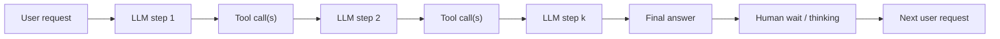

# TraceLab：真实 Coding Agent 工作负载到底怎样压垮 LLM Serving

## 元信息

| 字段 | 内容 |
|---|---|
| 标题 | TraceLab: Characterizing Coding Agent Workloads for LLM Serving |
| 作者 | Kan Zhu, Mathew Jacob, Chenxi Ma, Yi Pan, Stephanie Wang, Arvind Krishnamurthy, Baris Kasikci |
| 机构 | University of Washington、Wuhan University of Technology、Shanghai Jiao Tong University |
| 类型 | 论文 + 开源数据集/分析工具 |
| arXiv | https://arxiv.org/abs/2606.30560 |
| v2 时间 | 2026-06-30 15:39:15 UTC |
| 项目 | https://github.com/uw-syfi/TraceLab |
| 官方说明 | https://syfi.cs.washington.edu/blog/2026-06-25-tracelab/ |

## TL;DR

- **这篇文章做什么**：TraceLab 不是评测 coding agent 会不会修 bug，而是把 Claude Code 和 Codex 的真实使用日志转成 serving 系统可分析的工作负载。它覆盖约 **4,265 个 session、357,161 个 LLM step、432,510 次 tool call、43 名开发者、约 8 个月使用窗口**。
- **怎么做**：作者从本地 agent 日志中抽取事件，统一成 step-level schema。每一行对应一次模型调用及其产生的工具调用，再经过路径、用户名、tool 输入输出等脱敏处理，形成公开 JSONL 和 DuckDB 数据集。
- **关键证据**：一个用户请求平均触发 **8.8 次 LLM 调用** 和 **10.8 次工具调用**；约 **88% 的 LLM round** 是由工具结果触发，而不是直接回应人类消息。也就是说，coding agent 的主要流量形态不是 chat，而是 LLM-tool-LLM 闭环。
- **最反直觉的数字**：全量输入约 **54.90B tokens**，其中 prefix cache read 为 **52.56B**，append tokens 为 **2.34B**，输出只有 **186.9M**。输入与输出约为 **294:1**，典型 step 是长前缀、短追加、短输出。
- **Serving 结论**：prefix cache 总体命中率高达 **95.7%**，但用户停顿后的 user-initiated step 命中率降到 **84.4%**；只有 **19.0% append tokens** 是真正新内容，其余大量是可避免的重复 prefill。
- **成本边界**：如果用户思考时间导致的缓存失效都能避免，作者估计 append prefill 可减少 **1.07B tokens**，按当时列表价约节省 **$5,189**，即总价 **12.8%**。这是上界估算，不是已经实现的系统收益。
- **局限**：数据来自 SyFI 研究组自己的日常研发工作，虽跨 Claude Code/Codex、多用户、多模型版本，但仍可能偏向系统研究团队的使用习惯；论文无法看到 provider 内部调度和真实 cache 管理，只能从外部日志与 token 账单字段推断。

## 研究问题：为什么 SWE-bench 不足以回答 serving 问题？

TraceLab 的起点是一个很具体的错位：

- **能力评测问的是**：agent 能否在一个 issue、一个容器、一个任务边界内完成修复。
- **Serving 系统问的是**：连续几个小时、几天里，一个开发者反复使用 agent 时，模型调用、工具调用、上下文增长、缓存命中和人类等待怎样共同制造负载。

这个错位会让传统 benchmark 低估三类压力：

| 被低估的压力 | benchmark 中的样子 | 真实 trace 中的样子 |
|---|---|---|
| Session 连续性 | 单题、短生命周期 | 一个 session 可跨多个请求、多个工具循环 |
| Tool 调用形态 | 常被限制为 bash 或固定工具 | Claude/Codex 工具集合不同，但高频集中在 shell、读文件、编辑 |
| Prefix cache 压力 | 通常不追踪缓存生命周期 | 人类停顿、工具耗时、模型输出共同决定 cache 是否还活着 |

作者真正要回答的问题可以写成：

> 如果 coding agent 成为主要交互形态，LLM serving 系统应该优化“单次长回答”，还是优化“多步、长前缀、短输出、工具重入、带人类停顿的会话”？

TraceLab 的答案很明确：后者才是 coding agent 的主负载形态。

## 论文主张与论证路线

| Claim | Mechanism | Evidence | Boundary |
|---|---|---|---|
| Coding agent 是多步自治循环，不是一次问答 | 用户请求被拆成 LLM step 与 tool call 交替执行 | 每个 request 平均 8.8 次 LLM 调用、10.8 次 tool call；88% round 回应工具结果 | 采样来自 SyFI 自用日志，不代表所有组织 |
| 负载是长上下文、短输出 | 上一轮上下文被反复作为 prefix 读入，当前轮只追加少量用户/工具结果 | 中位 step 约 119K prefix tokens、875 append tokens、214 output tokens | provider 内部调度和实际硬件不可见 |
| 工具调用数量集中但延迟长尾 | 高频工具是 shell/读/改文件，少数慢工具占据绝大多数时间 | 80 多种工具中，Top 3 工具占 80% 以上；超过 1 分钟的 4% 调用占 85% tool time | 工具名称不足以预测延迟，参数语义缺失会影响分析 |
| Prefix cache 有效但远未最优 | 工具连续步骤命中高，人类思考间隔导致 user step 缓存失效 | 总命中 95.7%，tool-result step 97.5%，user-initiated step 84.4% | 论文估计的是外部可见 cache 现象，不是 provider 内部真策略 |
| 人类等待也会变成 token 成本 | 停顿超过 eviction timeout 后，下个请求重新 prefill 旧上下文 | 避免这类 miss 的上界可减少 1.07B append tokens、节省 12.8% 成本 | 是上界，真实策略要付 KV 存储、压缩、预取和一致性成本 |

## 数据与管线：从本地日志到可复现实验

TraceLab 的工程价值在于它不是只发一篇论文，而是把采集、脱敏、验证、分析和浏览器探索都开源出来。

### 数据规模

| 指标 | Claude | Codex | 合计 |
|---|---:|---:|---:|
| Sessions | 2,676 | 1,589 | 4,265 |
| Distinct users | 37 | 22 | 43 |
| LLM steps | 140,338 | 216,823 | 357,161 |
| Tool calls | 142,388 | 290,122 | 432,510 |
| Total input tokens | 28.47B | 26.43B | 54.90B |
| Prefix tokens | 27.28B | 25.29B | 52.56B |
| Append tokens | 1.19B | 1.15B | 2.34B |
| Output tokens | 96.9M | 90.1M | 186.9M |

这张表的重点不是“数据很大”，而是比例：

- Prefix tokens 占输入主体，说明系统反复读很长历史。
- Append tokens 远小于 prefix tokens，说明每步新增内容通常只是工具结果或短用户消息。
- Output tokens 更小，说明 agent 并不总是在生成长篇推理文本，而是被工具调用切成许多短 step。

### 标准化 schema

作者把 Claude 和 Codex 的不同日志形态统一成 step-level schema。一个 step 可以理解为：

```text
Step_i = {
  trigger: user_message | tool_result,
  input_tokens: prefix_tokens + append_tokens,
  output_tokens: visible_output + reasoning_output_if_reported,
  tool_calls: [tool_type, timestamp, latency, result_metadata],
  timestamps: start/end/idle_gap
}
```

这个抽象很重要，因为它把 agent trace 从“聊天记录”改写成 serving 系统的队列输入：

- `trigger` 区分人类发起和工具结果发起，直接影响 cache 命中。
- `prefix_tokens` 与 `append_tokens` 区分历史复用和新增长度，直接影响 prefill 成本。
- `tool_calls` 与 `idle_gap` 连接工具侧延迟和模型侧 KV 生命周期。

### 脱敏边界

TraceLab 发布的是 sanitized trace：

- 移除或伪匿名化用户、session、路径等识别信息。
- 剥离 tool 输入输出、cwd、本地上下文等敏感内容。
- 保留 token 计数、时间戳、工具类型、触发类型等 workload 变量。

这是一种明确取舍：

- **保留**：足够做 serving、cache、latency、tool distribution 分析。
- **牺牲**：无法研究具体代码内容、任务语义、工具参数细节对成功率和延迟的因果影响。

## 结果一：Autonomous loop 让 request 变成小型工作流

论文的 Table 2 把 session、request、step 三层拆开。最关键的读法如下：

| 层级 | 平均值 | P50 | P90 | P99 | 含义 |
|---|---:|---:|---:|---:|---|
| 每 session 的 requests | 9.2 | 1 | 18 | 137 | session 长尾明显，少数 session 很长 |
| 每 session 的 tool-initiated steps | 73.6 | 15 | 135 | 1,107 | 工具结果驱动的循环是主体 |
| 每 request 的 tool calls | 10.8 | 2 | 30 | 113 | 单个用户请求常触发多次工具操作 |
| 每 step 的 tool calls | 1.2 | 1 | 2 | 4 | 单步通常只发少量工具，循环次数才是放大器 |

这改变了对“agent latency”的理解：

- 单个 LLM generation 不是完整响应时间。
- 单个 tool call 也不是完整响应时间。
- 用户感受到的是一串 step 与 tool 的串并行结果。

可以把一次 request 简化为：



Serving 系统如果只优化 `L1` 的 decode speed，就会忽略 `T1 -> L2` 的重入成本、工具尾延迟、以及 `W -> U2` 的 cache 失效。

## 结果二：长前缀、短追加、短输出

论文给出的典型 LLM generation 形态是：

```text
median step ~= 119K prefix tokens + 875 append tokens -> 214 output tokens
```

这个比例说明 coding agent 和传统长文生成很不一样：

- 传统长文生成：prompt 可能中等，decode 长，瓶颈偏输出吞吐。
- Coding agent：prompt 历史很长，append 很短，decode 很短，瓶颈转向 prefix cache、prefill、TTFT 和循环次数。

作者还报告：

| 指标 | Claude | Codex |
|---|---:|---:|
| normalized decode speed 中位数 | 46.8 tok/s | 33.9 tok/s |
| Codex pure decode speed | - | 61.3 tok/s |
| Codex estimated TTFT | - | 3.1 s/step |

这些数字不能直接比较 provider 质量，因为模型、硬件、后端策略都不可见。但它们能说明一个 serving 事实：

- 每个 step 的输出不长，单步 decode 优化的收益会被多步循环稀释。
- TTFT 每次都付，循环次数越多，总等待越高。
- 如果工具结果返回后还要经历 routing、prefill、排队，用户看到的是所有 step 的累计损耗。

## 结果三：工具调用是少数高频工具 + 极端长尾延迟

TraceLab 观察到超过 80 种工具，但分布高度集中：

| Provider | Top tools | 结构含义 |
|---|---|---|
| Claude | Bash、Read、Edit | shell、读文件、写文件主导 |
| Codex | exec_command、write_stdin、apply_patch | 命令执行、交互式进程、补丁编辑主导 |

官方博客进一步总结：约 433K tool calls 中，shell/command execution 约占 76%，file edits 约占 11%，file reads/search 约占 9%。这说明 coding agent 的“工具层”很像开发者工作流：

- 跑测试、构建、git、脚本。
- 读文件、搜索定义、查看日志。
- 写补丁、调整配置、继续验证。

延迟分布比数量分布更关键：

| 延迟区间 | 调用占比 | 时间占比 | 系统含义 |
|---|---:|---:|---|
| 小于 1 秒 | 约 61% | 约 1% | 高频但不是总等待瓶颈 |
| 超过 1 分钟 | 约 4% | 约 85% | 少数慢工具支配端到端时间 |

这直接反驳了一个简单策略：只按 tool type 预测下一步 cache reuse distance。

同样叫 `Bash` 或 `exec_command`：

- `git status` 可能亚秒返回。
- `uv run pytest` 可能几十秒。
- 编译、下载、训练、远端 API 调用可能数分钟。

因此，作者提出的 tool-latency prediction 需要看：

- 工具参数语义。
- 最近同类命令历史。
- 当前 session 的项目状态。
- 是否进入长任务或后台任务模式。

这也解释了为什么 CacheWise 这类相关工作会把工具元数据用于 KV cache 管理：cache 何时该保留，不只由“下一个 step 会不会来”决定，还由工具执行可能等待多久决定。

## 结果四：Prefix cache 很高，但最贵的 miss 发生在人类停顿之后

论文 Table 11 把 cache hit rate 按触发类型拆开：

| 指标 | Claude | Codex | Total |
|---|---:|---:|---:|
| Prefix cache hit rate | 95.8% | 95.7% | 95.7% |
| User-initiated hit rate | 86.9% | 78.2% | 84.4% |
| Tool-result hit rate | 97.9% | 97.2% | 97.5% |

表面看 95.7% 很高，但真正的问题藏在触发类型里：

- tool-result step 通常很快接上前一步，cache 还活着。
- user-initiated step 发生在用户读输出、思考、输入下一条指令之后，停顿更长。
- 当 idle gap 超过几分钟，低命中开始出现；超过 1 小时后几乎都 miss。

这里的关键不是“缓存命中率高不高”，而是“miss 是否发生在长上下文上”。用户下一条请求往往继承整个 session 历史，一旦 miss，系统需要重新 prefill 大段旧上下文。

## 公式：Prefill amplification 怎样衡量重复劳动？

论文把 append tokens 拆成两类：

```text
append_tokens = fresh_tokens + redundant_prefill_tokens
```

其中：

- `fresh_tokens`：真正新进入上下文的用户消息、工具结果、必要增长。
- `redundant_prefill_tokens`：系统已经见过、但因为 cache miss 或 eviction 又被重新 prefill 的历史内容。

论文使用的放大系数可以写成：

```text
prefill_amplification = total_append_tokens / fresh_tokens
```

按 Table 12：

| 场景 | Total append | Fresh tokens | Fresh % | Amplification |
|---|---:|---:|---:|---:|
| Overall | 2,269.6M | 430.2M | 19.0% | 5.3x |
| User-initiated | 1,126.8M | 31.8M | 2.8% | 35.4x |
| Tool-result | 1,142.8M | 398.4M | 34.9% | 2.9x |

最重要的是 user-initiated 行：

- fresh 只有 2.8%，说明绝大多数 append 都是重读旧上下文。
- amplification 达到 35.4x，说明用户停顿后的第一步最像“昂贵重启”。
- 如果 serving 系统只看平均 95.7% 命中率，就会低估这类 step 的成本。

## 缓存保留的 trade-off：不是越久越好

论文模拟不同 eviction timeout：

- timeout 从 1 分钟提高到 1 小时，理论命中率从 **85.4%** 提高到 **98.6%**。
- 但 suspended KV 相对 active KV 的存储比例显著上升。
- 到 5 分钟时命中率已经约 **94%**，再推到 1 小时只多约 4 个百分点，却需要明显更多存储。

可以把系统目标写成一个成本权衡：

```text
minimize:
  C_total = C_prefill_miss + C_kv_storage + C_prefetch + C_complexity

subject to:
  TTFT <= user_slo
  memory_pressure <= hardware_budget
  privacy_policy permits retention
```

变量解释：

- `C_prefill_miss`：cache miss 后重算 prefix 的计算与延迟成本。
- `C_kv_storage`：把 inactive session 的 KV 留在 GPU、CPU、SSD 或远端 cache 的成本。
- `C_prefetch`：预测用户要回来时提前恢复 cache 的成本。
- `C_complexity`：多租户隔离、失效、压缩、调度实现复杂度。

论文的判断不是简单地要求“保留所有 KV 一小时”，而是指出：

- 5 分钟附近可能是低成本收益区。
- 超长保留要靠 KV 压缩、分层存储、预测预取和更细粒度 eviction。
- user-initiated step 与 tool-result step 应该使用不同策略。

## Human thinking time：用户暂停也会变成账单

Table 13 的估算很适合做系统直觉校准：

| 指标 | Claude | Codex | Total |
|---|---:|---:|---:|
| User steps with predecessor | 16,927 | 17,033 | 33,960 |
| Observed append | 1.19B | 1.15B | 2.34B |
| Append after retained cache | 541.9M | 721.7M | 1.26B |
| Append reduction | 648.1M (54.5%) | 423.9M (37.0%) | 1.07B (45.9%) |
| Observed total cost | $22,654 | $17,777 | $40,431 |
| Cost after retained cache | $18,973 | $16,269 | $35,242 |
| Cost reduction | $3,680 (16.2%) | $1,508 (8.5%) | $5,189 (12.8%) |

这张表的解读要谨慎：

- 它是上界，不是一个已经实现的产品方案。
- 它假设用户停顿导致的旧上下文可以保留或恢复。
- 它没有把额外 KV 存储、压缩、预取错误、隔离策略的真实成本全部计入。

但它仍然有研究意义：它把“用户在思考”从交互体验问题，转化成了 serving 成本问题。对 coding agent 来说，人类节奏不是噪声，而是 workload 的一部分。

## 算法视角：一个 agent-aware cache policy 应该看什么？

TraceLab 没有实现新的 serving engine，但它给出了策略设计空间。基于论文证据，可以写出一个简化的 agent-aware eviction 伪代码：

```text
Input:
  step_trigger, prefix_len, append_len, tool_type, tool_args_summary,
  recent_tool_latency, idle_gap, cache_storage_pressure

State:
  session_kv_state
  per_tool_latency_model
  user_return_gap_model

Loop on each completed step:
  if next trigger is tool_result:
    predicted_gap = predict_tool_latency(tool_type, tool_args_summary, recent_tool_latency)
  else:
    predicted_gap = predict_user_return_gap(session_history, time_of_day, interaction_state)

  miss_cost = prefix_len * prefill_cost_per_token
  keep_cost = kv_size(prefix_len) * predicted_gap * storage_cost

  if cache_storage_pressure is high and keep_cost > miss_cost:
    evict_or_compress(session_kv_state)
  else if predicted_gap is near eviction boundary:
    keep_alive_or_prefetch(session_kv_state)
  else:
    keep(session_kv_state)

Output:
  cache action = keep | compress | offload | prefetch | evict

Failure boundary:
  If tool arguments are stripped, encrypted, or semantically ambiguous,
  prediction can fall back to coarse tool type and lose most of the advantage.
```

这里最关键的变化是：cache policy 不再只看 prefix 长度和全局 LRU，而要把 agent workflow 里的“下一步什么时候回来”作为核心状态。

## Figure/Table 证据逐项解读

| 证据 | 支撑的结论 | 不能证明什么 |
|---|---|---|
| Table 1 数据总览 | 数据集足够大，覆盖 Claude/Codex、多用户、多模型版本 | 不能代表所有公司、所有 IDE、所有 agent 框架 |
| Table 2 session/request/step 分布 | agent 请求是多步循环，且长尾很重 | 不能说明多步一定带来更高任务成功率 |
| LLM generation 统计 | 长 prefix、短 append、短 output 是典型形态 | 不能直接比较 Claude 与 Codex 后端优劣 |
| Tool call 分布与延迟 | 少数工具高频，少数慢调用支配时间 | 脱敏后缺少完整参数语义，难做精确因果分析 |
| Table 11 cache hit rate | 工具连续步骤命中高，人类停顿步骤命中低 | 外部日志无法揭示 provider 内部具体 eviction 策略 |
| Table 12 redundant prefill | append 中只有 19% 是 fresh，重复 prefill 空间巨大 | 理想 cache 上界不等于可落地收益 |
| Table 13 human thinking cost | 用户停顿造成可观 token 与价格上界损失 | 没计入完整 KV 保留系统的工程成本 |

## 相关工作位置：TraceLab 填的不是 benchmark 空白，而是 workload 空白

论文把自己放在三类工作之间：

- **Coding agent 能力 benchmark**：SWE-bench、Terminal-Bench、SWE-Gym 等回答“能否完成任务”。它们适合比较 agent 能力，但不适合估计真实 session 的缓存、工具、排队和端到端 serving 压力。
- **生产 LLM serving trace**：Mooncake、Splitwise、BurstGPT 等回答普通 LLM 流量怎样到达、怎样复用、怎样批处理。但它们通常缺少 coding agent 的多步工具循环和 session 内上下文增长。
- **KV cache / serving 系统**：vLLM、SGLang、RadixAttention、CacheGen、LMCache 等提供机制。TraceLab 提供的是这些机制需要面对的真实 agent workload 分布。

官方博客还提到 CacheWise：它同样关注 coding-agent workload 下的 KV cache reuse，但更偏向设计 vLLM 中的 KV-cache 管理层。TraceLab 的作用更像公共基准和分析工具，帮助系统研究者不再只靠聊天 trace 或孤立任务假设。

## 局限与失败边界

### 1. 样本偏差

数据来自 SyFI 研究组自己的研发环境，偏向：

- 系统研究、实验脚本、论文/代码迭代。
- 熟练开发者使用 Claude Code 与 Codex。
- 长期项目上下文，而非短平快客服或普通办公自动化。

因此它适合代表“研究/工程团队高强度 coding agent 使用”，不应直接外推到所有企业开发者。

### 2. 外部日志看不到内部 serving 真相

TraceLab 能看到：

- token accounting。
- tool call 时间。
- step 触发类型。
- provider 报告的 cache/prefix 字段。

TraceLab 看不到：

- GPU batch 调度。
- cache 具体 eviction 规则。
- provider 是否做了分层存储、预取、压缩。
- 后端负载和区域路由。

因此，论文对 cache 的结论更像“从用户侧可观测字段推断出的 workload 压力”，不是 provider 内部系统白盒分析。

### 3. 脱敏削弱了语义分析

脱敏是发布数据的前提，但也会限制研究：

- 不能研究具体命令参数如何影响延迟。
- 不能分析任务复杂度与工具循环长度的关系。
- 不能判断 agent 是否真的做对了任务。

这也是下一步工作的关键：如何在隐私保护下保留更多可用于 latency prediction、task taxonomy、failure analysis 的语义特征。

## 方法细读：为什么 step-level 而不是 message-level？

如果只按 message 统计，coding agent 很容易被误读成“用户发一句，模型回一句”。TraceLab 选择 step-level，是因为 serving 系统真正处理的是一次次模型调用：

- 一个用户消息可能只触发第一步，后面多步都由工具结果驱动。
- 一个工具结果可能追加大量文本，例如测试日志、编译错误、搜索结果。
- 一个用户在 agent 工作中途追加的消息，可能不会立刻形成独立 step，而是和下一个工具结果一起进入模型。

因此，step-level schema 把“谁触发模型调用”作为一等字段。这个设计让论文能区分两种看似相同、实则成本完全不同的输入：

| 输入形态 | 表面看 | Serving 上的差异 |
|---|---|---|
| 工具结果触发 | 也是一段新文本进入上下文 | 通常紧接上一步，prefix cache 仍热 |
| 用户新请求触发 | 也是一段新文本进入上下文 | 可能隔了几分钟到几十分钟，prefix cache 已冷 |

这解释了为什么 Table 11 的拆分是全文关键。如果不拆触发来源，只报告总命中率 95.7%，读者会以为 cache 问题已经基本解决；拆开后才看到 user-initiated step 是真正的重复 prefill 放大点。

## 实验设置再解释：TraceLab 不是“任务成功率”论文

这篇论文有一个容易被误解的地方：它没有证明 Claude Code 或 Codex 哪个更会写代码，也没有证明哪个模型更聪明。它把模型当作负载生成器，把 agent 当作有状态程序，把工具调用当作异步外部事件。

所以它的实验问题不是：

- agent 最终修好了多少 bug？
- 哪个模型通过了更多 benchmark？
- 哪个 prompt 更会规划？

它真正测的是：

- 一个 agent request 会拆成多少 step？
- 每个 step 要读多少历史、追加多少新文本、输出多少 token？
- 工具调用怎样影响下一次模型调用的到达时间？
- 人类停顿怎样让原本可复用的 prefix 变成重新 prefill？

这种研究范式对后续论文很重要。很多 agent 论文默认 serving 是一个黑箱，只要模型能力提高，系统就能承受。但 TraceLab 说明，能力提升之后如果用户更频繁使用 agent、更愿意让 agent 长时间自治，系统负载会出现新的形态：不是少量超长生成，而是大量中短生成被长上下文和工具循环串起来。

## 失败案例的系统含义：长尾不是异常，而是常态

论文没有逐条展示具体失败任务，因为公开数据需要脱敏。但从分布可以读出几类隐含失败模式：

| 观察到的长尾 | 可能对应的工作流 | 对系统的压力 |
|---|---|---|
| P99 session tool calls 达 1,438 | agent 在复杂项目里反复搜索、修改、验证 | session 历史持续膨胀，KV 保留成本上升 |
| request P99 tool calls 达 113 | 单次用户目标被拆成大量试错 | 端到端延迟由循环次数和慢工具共同支配 |
| 慢工具占总 tool time 绝大部分 | 测试、构建、下载、长脚本、阻塞进程 | cache eviction timeout 可能刚好被慢工具击穿 |
| user wait 平均远高于中位数 | 少数长时间离开或切换任务 | 下个 user step 需要重新激活很长上下文 |

这些现象说明，agent serving 的长尾不是偶发噪声，而是开发任务本身的结构属性。真实开发包含等待 CI、跑测试、读错误、重试方案、切换注意力；agent 只是把这些结构以更高频、更可记录的方式暴露给 serving 系统。

## 对 Agent 框架的直接启发：减少 step 数可能比加速单步更有效

如果每个 request 平均有 8.8 个 LLM step，那么单步优化和循环优化的收益不同：

```text
end_to_end_time ~= sum(LLM_step_time_i) + sum(tool_time_j) + framework_overhead
```

单步 decode 提速只影响 `LLM_step_time_i` 的一部分；但如果框架能减少无意义 step，收益会同时减少：

- 多次 TTFT。
- 多次工具序列化/反序列化。
- 多次权限确认和运行时切换。
- 多次 prefix append 与 cache 查询。

这也是作者提出 denser 或 fused tool invocation 的原因。一个 agent 如果每轮只调用一个小工具，就会制造很多“短输出、短工具、再重入模型”的开销；如果它能在安全边界内一次发起多个只读检查，或把一组确定性文件读取合并，可能减少 loop depth。

但这里有安全边界：

- 只读工具更容易并行和融合。
- 写文件、运行命令、网络访问需要更严格的权限和回滚语义。
- 过度自动批准可能降低用户控制，尤其在代码删除、凭据读取、远端操作时。

因此，TraceLab 的系统建议不能简单理解为“让 agent 更放飞”。更准确的说法是：让 agent runtime 知道哪些工具是低风险、低延迟、可并行，哪些工具必须串行、审计、等待用户确认。

## 对后训练研究的间接问题：训练目标是否反映系统成本？

虽然 TraceLab 不是后训练论文，但它给 RL/SFT 研究提出了一个很现实的问题：如果我们只奖励最终任务成功，不惩罚过多 step、过长上下文、重复工具、cache 失效，那么训练出来的 agent 可能在 benchmark 上更强，却在真实 serving 中更贵。

可以把 agent 的优化目标扩展为：

```text
Reward = task_success
       - alpha * num_llm_steps
       - beta  * redundant_prefill_tokens
       - gamma * slow_tool_wait
       - delta * risky_tool_action
```

这不是说研究者应该直接把 provider 成本塞进所有 benchmark，而是说真实 agent 的“好行为”包含系统维度：

- 更少的无效搜索。
- 更早识别失败路径。
- 更明确地批量收集必要上下文。
- 更少把巨大日志无筛选地塞回模型。
- 更好地区分需要人类决策和可以自主继续的步骤。

如果未来有基于 TraceLab 这类数据的后训练环境，奖励模型可以不只学习“最后答案是否正确”，还学习“用多少系统资源到达正确答案”。这会把 Agent 能力评测和 serving 研究重新接起来。

## 领域延伸：Agent serving 需要从“请求调度”走向“工作流调度”

TraceLab 最值得带走的判断是：

- Coding agent 的基本单位不是 request，而是 workflow。
- Workflow 的边界包括用户请求、工具执行、模型重入、上下文增长、人类停顿。
- Serving 系统若仍把每次 LLM call 当成独立请求，就会错过最重要的优化变量。

后续研究可以沿着四个方向推进：

| 方向 | 具体问题 |
|---|---|
| Agent-aware scheduling | scheduler 是否应知道 step trigger、session id、tool latency prediction？ |
| KV cache 分层 | 哪些 prefix 留在 GPU，哪些压缩到 CPU/SSD，哪些根据用户回流概率预取？ |
| Tool runtime co-design | agent framework 是否能批量发工具、融合小工具、降低 approval 和 IPC overhead？ |
| 隐私保护 trace | 如何发布更有语义的工具参数摘要，同时避免泄露代码、路径和业务秘密？ |

对 AI Agent 研究者来说，这篇论文提醒我们：agent 的“智能”并不只存在于模型权重或 planning prompt 里。只要 agent 进入真实开发工作流，系统层的 cache、工具延迟、上下文生命周期和人类节奏都会反过来塑造它能否稳定、低延迟、可负担地运行。

## 继续追问

- **如果 agent 能并行调用更多工具**，总 step 数会下降，还是会制造更多难以调度的长尾任务？
- **如果 provider 暴露 cache keep-alive 或 prefetch API**，用户侧 agent harness 应该如何避免滥用和隐私风险？
- **如果企业内部部署 coding agent**，本地项目的 build/test 长尾是否会比 SyFI trace 更重？
- **如果加入任务成功率标签**，多 step、长 context、频繁 tool call 与成功率之间是正相关、负相关，还是只反映任务难度？
- **如果扩展到 browser/computer-use agent**，工具延迟和上下文增长会更像 coding agent，还是更像长期 RPA workflow？

TraceLab 给出的不是最终 serving 方案，而是一组足够具体的工作负载事实。它让后续系统论文可以少一点“假设 agent 会这样用”，多一点“真实 agent trace 证明它确实这样用”。
