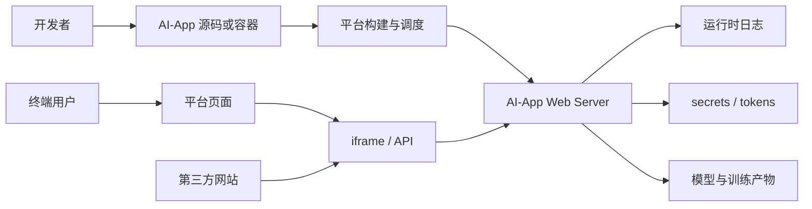

# Your Space is My Zone：模型 Hub 上 AI-App 安全边界为什么会失效

### 元信息

| 字段 | 内容 |
|---|---|
| 原文 | [Your Space is My Zone: Demystifying the Security Risks of AI-Powered Applications on Pre-Trained Model Hubs](https://arxiv.org/abs/2606.30373) |
| 类型 | 论文，ACM CCS 2026，arXiv v1 |
| 官方时间 | 2026-06-29 14:34:43 UTC 提交 |
| 方向 | AI 安全 / AI for Security / 模型 Hub 供应链 |
| 分析对象 | Hugging Face Spaces、Replicate、ModelScope 上的 AI-powered applications |
| 核心工具 | Insightor：面向 AI-App 源码、容器镜像、元数据和日志的规模化测量框架 |

### TL;DR

- 这篇论文研究的不是“模型权重是否有后门”，而是 <u>模型 Hub 上的 AI-App 是否已经变成新的 Web 应用供应链入口</u>。作者把 AI-App 拆成平台页面、iframe、运行时容器、API、日志、secret、训练/复制流程，再用 OWASP Web、OWASP LLM 与开源供应链风险框架映射攻击面。
- 作者分析了 Hugging Face、Replicate、ModelScope 三个平台，提出 5 类威胁和 10 个攻击向量。关键发现包括：日志外泄、Ghost Token、认证绕过、过度授权 iframe、Identifier Reuse、AI-App poisoning、输入注入、运行时日志泄漏、容器文件泄漏和 cryptojacking。
- 论文的测量系统 Insightor 覆盖 972,546 个公开 AI-Apps，其中 Hugging Face 938,602 个、Replicate 25,340 个、ModelScope 8,604 个。它不是完美判定器，而是把百万级应用压缩成可人工复核的候选集合。
- 主要数字非常具体：1,442 个潜在输入注入点，139,475 个使用存在已知 RCE 漏洞的 Gradio 版本的 AI-Apps，936 个可能把 secret 打到运行时日志的 AI-Apps，27 个含明显后门行为的 AI-Apps，43 个嵌入挖矿代码的 AI-Apps。
- 论文最值得重视的点是“平台放大效应”：同样是硬编码密钥、日志泄漏、命令注入，在普通 Web 项目里通常是单点问题；在 AI-App Hub 里会被 iframe 嵌入、复制功能、训练派生、共享 runtime、公共日志和开发者信任链放大。
- 实验边界也必须明确：Insightor 的数据流分析以筛选为目标。论文抽样验证中，输入注入候选的 precision 为 27.67%，secret-to-log 候选的 precision 为 18.8%；这些数字不能直接解释为“所有候选都已被确认可利用”。
- 论文做了负责任披露：Hugging Face 已修复多个问题并给出 2,369 美元 bounty；作者还向平台、开发者和受 Identifier Reuse 影响的网站发送披露。这个过程说明研究并非只停留在离线扫描，而是进入了真实生态修复。

### 一句话研究问题

- 过去模型 Hub 安全研究常问：
  - 模型文件能不能携带恶意代码？
  - 数据集 loader 是否能执行任意脚本？
  - prompt、模型输出和工具调用是否会被攻击？
- 这篇论文换了一个问题：
  - 当模型 Hub 开始托管“可交互、可嵌入、可训练、可复制、可运行容器”的 AI-App 时，平台是否已经继承了 Web 托管、CI/CD、软件供应链和多租户运行时的全部风险？
- 这个问题的关键不在单个漏洞，而在系统边界：
  - AI-App 既是一个 Web server。
  - AI-App 又是一个模型推理入口。
  - AI-App 还是一个可复制的软件包。
  - AI-App 同时依赖平台的域名、token、日志、billing、secret 和容器调度。

### 论文为什么不是普通“漏洞合集”

| 常见读法 | 这篇论文实际做的事 | 为什么重要 |
|---|---|---|
| 找几个 Hugging Face Spaces 漏洞 | 比较三类平台的创建、认证、日志、复制、训练和运行时机制 | 说明风险不是单平台偶发 bug |
| 扫描 hard-coded secrets | 区分源码、镜像、运行时日志、JWT、用户输入和平台 secret 机制 | 说明“按官方建议使用 secret”仍可能被日志泄漏打穿 |
| 把 AI-App 当普通 Web app | 把 iframe、Hub 页面、App 子域名、训练派生和模型容器放进同一个威胁模型 | 解释 AI-App 为什么会放大普通 Web 风险 |
| 只报告 CVE 暴露 | 把 Gradio RCE、开发者代码注入、平台日志与手动验证分开统计 | 避免把版本暴露误写成必然可利用 |

### AI-App 的系统边界：不是模型，而是托管应用

论文先定义 AI-App：

- 开发者把模型、推理逻辑、依赖环境和 Web/API 接口交给平台。
- 平台负责构建或接收容器镜像，分配域名，启动服务，提供日志和管理入口。
- 用户通过浏览器、API 或第三方网页嵌入访问应用。
- 训练类 AI-App 还会把新模型或新应用写回用户账户。

这个边界带来一个重要判断：

> AI-App 安全不能只用“模型供应链”解释；它更像“模型 Hub + Web hosting + serverless runtime + app marketplace”的组合风险。

用 Mermaid 可以把论文的架构主线简化为：



这张图背后的安全含义是：

- 攻击者可以是恶意开发者：
  - 发布带后门或挖矿逻辑的 AI-App。
  - 借复制功能传播恶意代码。
  - 利用 iframe 或第三方嵌入做钓鱼。
- 攻击者也可以是恶意用户：
  - 触发命令注入。
  - 从公开日志里读 secret、prompt 或 JWT。
  - 借 Dev Mode token 修改代码或植入后门。
- 平台机制会改变漏洞影响：
  - public logs 让本来局部的日志问题变成跨用户数据暴露。
  - duplicated_from 让单个恶意仓库变成供应链扩散点。
  - 子域名映射让删除后的 iframe 变成接管入口。

### 三个平台的实现差异

| 维度 | Hugging Face | Replicate | ModelScope |
|---|---|---|---|
| 创建方式 | 源码仓库构建；可复制 Space | 本地构建容器后推送；训练可派生应用 | 源码仓库构建；限制官方基础镜像 |
| GUI | 平台页嵌入 App 子域名 iframe | 平台自动生成格式化页面 | 平台页与 App 运行环境结合 |
| API | Gradio 等常见 SDK 暴露 API | 所有模型/应用都有 API 风格入口 | Gradio 类应用可 API 调用 |
| secret 处理 | 环境变量注入；仅遮蔽 `hf_` 类 token | secret 可通过请求体传入 | 环境变量注入 |
| 日志风险 | public AI-App 日志可经 API 读取 | task id 已知时可读日志 | 日志访问限制更强 |
| 复制风险 | 显式 duplicate | 训练流程隐式派生 | 显式复制 |

这里最关键的是：论文没有把三者混成一个平台，而是用差异解释漏洞条件。

- Hugging Face 风险集中在：
  - JWT、Dev Mode、子域名映射、iframe 权限、Space duplicate。
- Replicate 风险集中在：
  - user-pays billing、训练派生、容器镜像、硬编码认证、已知 task 日志。
- ModelScope 风险集中在：
  - Gradio/Streamlit 应用、源码与容器文件、输入注入与 token 泄漏。

### 威胁分类：5 类威胁与 10 个攻击向量

论文把攻击面分为 5 类，具体到 10 个向量：

| 类别 | 向量 | 涉及平台 | 机制 |
|---|---|---|---|
| Flawed Access Control | A1 Log Exfiltration | HF、Replicate | 运行时日志被非 owner 读取 |
| Flawed Access Control | A2 Ghost Token | HF | JWT 无状态，资源归属变化后旧 token 仍可用 |
| Flawed Access Control | A3 Auth Bypass | 三平台 | 应用代码里硬编码密码或弱鉴权 |
| Flawed Access Control | A4 Over-privileged iframe | HF、ModelScope | iframe 默认权限过宽 |
| Improper Resource Reuse | R1 Identifier Reuse | HF | `user/space-name` 与 `user-space/name` 子域名可能碰撞 |
| Improper Resource Reuse | R2 AI-App Poisoning | 三平台 | 复制或训练派生传播恶意代码 |
| Insufficient Input Validation | V1 Input Injection | 三平台 | 用户输入流向 `os.system`、`eval`、`subprocess` 等 sink |
| Sensitive Data Leakage | L1 Runtime Log Leakage | HF、Replicate | secret、JWT、prompt、用户数据进入日志 |
| Sensitive Data Leakage | L2 Container Files Leakage | 三平台 | 源码或镜像层包含 token、密钥、配置 |
| Cryptojacking | P1 GPU/CPU 挖矿 | HF、Replicate | 恶意应用滥用用户或平台计算资源 |

这个分类有两个优点：

- 它把“传统 Web 漏洞”重新放进 AI-App 生命周期：
  - 例如命令注入仍然是 CWE-78，但 source 不再只是 HTTP 参数，而可能是 Gradio textbox、Replicate `predict()` 或训练函数参数。
- 它把“平台设计缺陷”和“开发者代码缺陷”分开：
  - Ghost Token、Identifier Reuse、iframe permission 更偏平台设计。
  - hard-coded password、input injection、secret logging 更偏开发者实现。

### 关键攻击一：Log Exfiltration 为什么比普通日志泄漏更严重

普通 Web 应用里，日志泄漏通常需要服务器暴露日志文件或日志系统权限配置错误。

AI-App Hub 的情况更特殊：

- public AI-App 可能默认面向所有用户开放。
- 平台为调试和可观测性提供 runtime logs。
- AI-App 常常是多用户共享同一个运行时实例。
- 日志里可能出现：
  - 开发者配置的 secret。
  - 用户输入的 prompt。
  - 文件、图片、数据集 URL。
  - 平台注入的 JWT。

论文指出，Hugging Face 的平台页面虽然只给 owner 显示日志按钮，但底层 API 仍可能让任意用户拿到 public AI-App 日志访问能力。Replicate 的影响范围更窄，因为日志 retrieval 依赖随机 task id；但如果开发者公开了 task 页面，日志仍可能被读取。

这里的研究价值在于：

- 它不是“开发者不该 print secret”这么简单。
- 平台如果允许公共读取日志，就会把少量 debug 输出变成跨租户泄漏面。
- 即便开发者使用平台推荐的 secret 配置方式，只要 secret 被代码打印，日志权限仍会让“正确存储”失效。

### 关键攻击二：Ghost Token 与无状态 JWT 的边界

Ghost Token 的链条可以抽象成：

```text
Input:
  可预测的未来用户名 u
  可预测的未来 AI-App 名称 s
  平台允许删除后重用用户名
  平台使用短期但无状态 JWT

State:
  attacker_token = JWT(u/s)
  resource_owner(u/s) 从 attacker 变成 victim

Loop:
  1. 攻击者注册 u
  2. 攻击者创建 private AI-App u/s
  3. 攻击者生成访问 token
  4. 攻击者删除 u/s 和账号
  5. 受害者后来注册 u 并创建 u/s

Condition:
  如果 token 没有绑定资源 generation / ownership version
  且删除或转移不会撤销旧 token

Output:
  旧 token 仍可能访问新的 victim AI-App

Failure boundary:
  若平台禁止高影响用户名重用、记录资源版本、支持 token revocation，
  或 token 与当前 owner 强绑定，攻击链会断开。
```

论文用 GitHub 与 Hugging Face 组织名重叠来评估可预测性：

| 指标 | 数字 | 解释 |
|---|---:|---|
| Hugging Face 上至少有一个 AI-App 的用户 | 490,960 | 用作用户名空间基数 |
| 其中组织账号 | 8,462 | 组织名更容易被外部预测 |
| 与 GitHub 组织名匹配的 HF 组织账号 | 4,329 / 8,462，51.16% | 说明攻击者可用 GitHub 数据预测目标 |
| 匹配组织下的 AI-Apps | 10,548 | 继续比较 app/repo 名称 |
| AI-App 名与对应 GitHub repo 名精确匹配 | 515，4.88% | 说明 app 名也有一定可预测性 |

这个攻击不是高频“扫全网秒杀”，而是高价值目标的预注册型攻击。

- 对攻击者：
  - 成本低，因为可以反复创建/删除免费资源。
  - 目标选择可以围绕活跃 GitHub 组织。
- 对平台：
  - 单纯缩短 JWT 有效期不够。
  - 还需要 token 与资源世代、owner、visibility、Dev Mode 状态绑定。

### 关键攻击三：Identifier Reuse 把 iframe 变成供应链入口

Hugging Face 的 Space 子域名生成规则会把斜杠转换成连字符：

```text
user/space-name      -> user-space-name.hf.space
user-space/name      -> user-space-name.hf.space
```

如果一个外部网站嵌入了旧 Space：

```html
<iframe src="https://user-space-name.hf.space"></iframe>
```

那么删除与重用会导致风险：

- 原始 `user/space-name` 删除后，第三方网站仍保留 iframe。
- 攻击者注册 `user-space` 并创建 `name`。
- 子域名重新落到攻击者应用。
- 第三方网站不改一行代码，却加载了新的恶意 AI-App。

作者测量了可行性：

| 观察项 | 数字 | 意义 |
|---|---:|---|
| Hugging Face AI-Apps 总量 | 938,602 | 该项基于 HF 子集 |
| 标识符含连字符的 AI-Apps | 439,887，47.03% | 大量名称存在碰撞前提 |
| 存在至少一个未注册碰撞用户名的比例 | 438,967 / 439,887，99.79% | 攻击者有机会注册可碰撞名称 |
| 30 天监测到的 Space 删除 | 5,069 | dangling iframe 不是理论事件 |
| 公开代码搜索发现的外部嵌入 | 172 个 AI-Apps / 152 个网站 | 外部 iframe 使用存在 |
| 发现受影响网站 | 9 个，5.92% | 作者强调这是下界 |

这个结果有供应链含义：

- 传统 dangling DNS 是域名指向失效后被接管。
- 这里是 Hub 子域名由 AI-App identifier 生成，删除后被另一个 identifier 路径重新占用。
- 外部网站信任的是 `hf.space` 域名，用户很难意识到 iframe 内容已经换 owner。

### Insightor 的方法：把百万应用压缩成可复核候选

Insightor 的输入包括：

- AI-App 源码仓库。
- 可下载容器镜像。
- 平台元数据：
  - identifier。
  - developer。
  - SDK version。
  - duplicate/training 关系。
- 运行时日志与可观察接口。

数据规模如下：

| 平台 | AI-Apps | 可下载镜像或源码重点 |
|---|---:|---|
| Hugging Face | 938,602 | 713,613 个可下载容器镜像；还包括源码仓库 |
| Replicate | 25,340 | 19,412 个可下载容器镜像；官方 API 原始覆盖不足，作者扩展枚举 |
| ModelScope | 8,604 | 源码仓库、容器镜像和官方模板镜像 |
| 合计 | 972,546 | 用于横向测量 |

Insightor 的核心不是单个 scanner，而是混合分析：

- 规则型平台检测：
  - Ghost Token。
  - iframe 权限。
  - log access。
  - identifier reuse。
- 供应链与文件扫描：
  - GuardDog 检测明显恶意行为。
  - KeySentinel 检测 hard-coded tokens。
  - OSV 匹配 Gradio CVE 暴露。
- CodeQL 数据流：
  - 用户输入 source 到命令执行 sink。
  - secret source 到 logging sink。
  - user input source 到 logging sink。

可以用一个简化公式表示筛选目标：

```text
risk(app) =
  platform_design(app)
  + dataflow(source_user_input -> sink_exec)
  + dataflow(source_secret -> sink_log)
  + vuln_version(sdk)
  + reuse_or_duplication(app)
  + malicious_artifact_signal(app)
```

变量解释：

- `platform_design(app)`：不依赖应用代码的系统性风险，例如 world-readable logs。
- `source_user_input`：Replicate `predict()`/`train()` 字符串参数，或 Gradio/Streamlit 文本输入组件。
- `sink_exec`：`os.system`、`eval`、`exec`、`subprocess.*` 等。
- `source_secret`：环境变量读取、平台 secret key、请求体 secret。
- `sink_log`：`print`、`logger.*`、`logging.*` 等。
- `vuln_version(sdk)`：Gradio 版本与 OSV/CVE 匹配。
- `reuse_or_duplication(app)`：duplicate、training-derived、identifier collision。
- `malicious_artifact_signal(app)`：后门、挖矿、混淆或反分析特征。

### 数据流分析为什么要按 AI-App SDK 重写 source

如果直接套传统 Web taint 规则，会漏掉很多 AI-App：

- Replicate 模板应用：
  - 用户输入进入 `predict()` 或 `train()` 参数。
  - 参数类型和平台 schema 共同决定外部可控性。
- Hugging Face / ModelScope 的 Gradio 应用：
  - 用户输入常由 `Textbox()` 等组件进入。
  - 输入不一定显式出现在 Flask route 或 FastAPI handler。
- Streamlit 应用：
  - `text_input()`、`text_area()` 等 UI 组件是实际 source。

论文的 Table 3 因此很关键：

| 分析任务 | Source | Sink |
|---|---|---|
| 输入注入 | `predict(:str)`、`train(:str)`、`Textbox()`、`text_input()`、`text_area()` | `os.system`、`os.popen`、`eval`、`exec`、`subprocess.*` |
| 用户输入日志泄漏 | 同上 | `print`、`logger.*`、`logging.*`、`log.*` |
| secret 日志泄漏 | `os.environ.get()`、`os.getenv()`、`os.environb.get()` | `print`、`logger.*`、`logging.*`、`log.*` |

这说明论文的贡献不只是“跑 CodeQL”。

- 它先理解平台和 SDK。
- 再把 UI 组件和模板函数翻译成安全分析里的 source。
- 最后才把 source-to-sink 路径交给数据流规则。

### 结果一：输入注入和 Gradio RCE 暴露

论文把输入注入分成两层：

- 开发者代码层：
  - 用户输入直接进入 shell 命令。
  - 常见场景是 ffmpeg、文件路径、转换工具、训练参数等。
- 第三方 SDK 层：
  - 应用使用存在已知 RCE 的 Gradio 版本。
  - 这是补丁采纳不足，而不一定每个实例都可直接利用。

关键数字：

| 指标 | 数字 | 解释边界 |
|---|---:|---|
| 潜在输入注入点 | 1,442 | CodeQL 数据流候选 |
| 抽样验证数量 | 300 | 人工复核 |
| 确认真实漏洞 | 83 | precision 27.67% |
| 暴露至少一个 Gradio RCE 的 AI-Apps | 139,475，14.34% | 版本暴露，不等于全部可利用 |
| 暴露多个 Gradio RCE 的 AI-Apps | 113,286，11.65% | 补丁滞后更严重 |

作者对 false positive 的解释很重要：

- 有些路径确实从输入到 `os.system()`。
- 但中间可能有文件类型、路径或白名单校验。
- 因此 Insightor 被定位为“缩小人工审计空间”的工具，而不是漏洞裁判。

### 结果二：运行时日志泄漏绕过了“正确使用 secret”

在 Hugging Face 上：

- 132,853 个 AI-Apps 使用 253,755 个 secrets。
- Insightor 标记 936 个可能把 secret 传到日志的 AI-Apps。
- 作者抽样 500 个候选，确认 94 个真实泄漏，precision 18.8%。

论文给出的代表性泄漏包括：

| 类型 | 例子 | 风险 |
|---|---|---|
| Secret | Azure endpoint、OpenAI key、系统 prompt、数据库凭据 | 开发者侧资产暴露 |
| User input | prompt、图片/视频/数据集 URL、医疗信息、用户提交 API key | 用户侧隐私暴露 |
| JWT | Dev Mode 或 private iframe 访问 token | 可进一步进入 Dev Panel |

这部分最值得带走的判断：

- secret management 只能解决“源码不硬编码”问题。
- 如果平台日志公开，且应用把 secret 打印出来，secret 管理机制无法兜底。
- 如果 Web server 默认记录 query string，JWT 作为 URL 参数进入日志会形成二阶漏洞。

### 结果三：AI-App Poisoning 与后门传播

AI-App 的复制机制让恶意代码具备传播路径：

- Hugging Face 和 ModelScope 有显式 duplicate。
- Replicate 训练功能会在用户账户下自动派生新应用或产物。
- 用户可能信任来源应用的功能，却没有审计其容器或隐藏逻辑。

作者用 GuardDog 发现 27 个含明显后门行为的 AI-Apps，其中一些存在超过一年。

论文中的典型后门行为包括：

- 通过 HTTP 参数触发任意代码执行。
- 使用 Base64 编码或动态执行隐藏 payload。
- 复制后把恶意代码带到新 AI-App。

这和普通 GitHub fork 有一个差异：

- GitHub fork 通常仍停留在代码仓库层。
- AI-App duplicate 可能直接进入可运行服务、推理接口、训练流程或企业内部部署。
- 因此“复制”不是只复制文本，而是复制一个可执行攻击面。

### 结果四：hard-coded token 与容器镜像泄漏

论文在三平台共发现：

| 指标 | 数字 |
|---|---:|
| unique leaked tokens | 3,418 |
| 受影响 AI-Apps | 4,846 |
| Hugging Face 源码泄漏 unique tokens | 2,934 |
| ModelScope 源码泄漏 unique tokens | 197 |
| Hugging Face 镜像泄漏 unique tokens | 357 |
| Replicate 镜像泄漏 unique tokens | 393 |

泄漏类型包括：

- RSA private keys。
- Aliyun API keys。
- Hugging Face API keys。
- GitHub access tokens。
- OpenAI API keys。
- Telegram API keys。

容器镜像这一点尤其关键：

- 开发者可能认为源码仓库干净即可。
- 但基础镜像、构建脚本、缓存文件、预装工具也可能携带 token。
- 若多个应用基于同一个污染基础镜像，会出现同一 token 跨多个 AI-App 泄漏。

论文提到一个高价值案例：某官方 Replicate AI-App 的容器镜像中硬编码了 Hugging Face access token，且相同 token 出现在 76 个其他 AI-App 镜像中。

### 结果五：Cryptojacking 说明 AI-App 也是算力入口

作者识别了 43 个嵌入挖矿代码的 AI-Apps：

- 42 个在 Hugging Face。
- 1 个在 Replicate。
- Monero、Bitcoin、Zephyr 是主要币种。
- XMRig 与 minerd 是常见挖矿软件。

攻击者的规避方式包括：

- 在 Docker build 阶段启动挖矿，消耗平台构建资源。
- 把挖矿二进制伪装成 `jupyter`、`python` 等普通进程。
- 动态下载 miner，避免源码里出现明显特征。
- 用环境变量隐藏 wallet。
- 用进程隐藏工具降低运行期可见性。

这说明 AI-App Hub 的 abuse 风险不只来自模型输出：

- GPU/CPU 算力本身就是资产。
- 用户付费模型会把成本转嫁给调用者。
- 平台免费或补贴资源会吸引滥用者。

### 工具评估：precision 不高，为什么仍然有价值

Insightor 的两个数据流模块 precision 如下：

| 模块 | 候选总数 | 抽样数 | 确认真阳性 | precision |
|---|---:|---:|---:|---:|
| Input Injection | 1,442 | 300 | 83 | 27.67% |
| Secret Leakage in Logs | 936 | 500 | 94 | 18.8% |

如果把它看作“自动漏洞确认工具”，这个 precision 并不高。

但论文的定位更合理：

- 总语料是 972,546 个 AI-Apps。
- V1 候选只占总量约 0.15%。
- L1 候选只占总量约 0.10%。
- 安全团队从百万级对象缩小到千级候选，再做人工复核，这在生态测量里是可接受的。

可以把筛选效率写成：

```text
review_rate_v1 = 1,442 / 972,546 ≈ 0.148%
review_rate_l1 =   936 / 972,546 ≈ 0.096%
```

这两个数字说明：

- Insightor 的主要价值是把审计队列做小。
- 论文没有夸大自动化能力。
- 对平台安全团队而言，低 review rate 比单纯高 recall 更能落地。

### 论文的 Figure/Table 证据怎么读

| 证据 | 支撑的论点 | 不能证明什么 |
|---|---|---|
| Figure 1：AI-App 架构 | AI-App 是平台页面、子域名、Web server、容器和第三方嵌入的组合 | 不能说明所有平台实现完全相同 |
| Table 1：平台实现对比 | 三平台在 creation、billing、GUI、API、日志、secret 上有机制差异 | 不能把 HF 的所有漏洞直接外推到 ModelScope |
| Table 2：威胁覆盖矩阵 | 10 个攻击向量在平台间分布不同 | 勾选不等于每个应用都可被利用 |
| Table 3：source/sink | 数据流规则基于 AI-App SDK 语义定制 | 不能覆盖所有自定义 SDK 或非 Python 应用 |
| Table 5：输入注入案例 | 命令注入可危及 secret 与外部用户数据 | 案例代表风险，不代表所有候选均确认 |
| Table 6：日志泄漏案例 | 日志同时泄漏 secret 与用户输入 | 列表是代表性样本，不是完整泄漏清单 |
| Appendix Table 8/9/10 | Identifier reuse、后门、挖矿都有真实案例 | 受公开索引和测量方法限制，数量可能是下界 |

### 相关工作中的位置

论文把自己放在三条线的交叉点：

- PTM Hub 安全：
  - 过去更多关注模型、数据集、序列化格式、恶意 loader。
  - 本文关注 Hub 托管的可运行应用。
- Resource reuse attack：
  - 过去有 dangling DNS、复用手机号、邮箱、TLS、软件 registry name reuse。
  - 本文把复用问题推进到 AI-App 子域名和 iframe 嵌入。
- Sensitive data leakage：
  - 过去常见于 GitHub、PyPI、CI/CD 日志。
  - 本文强调 AI-App runtime logs 会同时泄漏 developer secret 与 user prompt。

这个定位很清楚：

- 它不是替代模型 malware 研究。
- 它是在模型 Hub 从“文件托管”变成“应用运行平台”后补上应用层安全分析。

### 防御建议：平台、开发者、用户分别该做什么

| 角色 | 应做措施 | 对应风险 |
|---|---|---|
| 平台 | runtime logs 默认只给 owner；禁止 read 权限用户读敏感日志 | A1、L1 |
| 平台 | JWT 绑定资源世代、owner、visibility，并支持撤销 | A2、Dev Mode token leakage |
| 平台 | iframe 权限最小化，按应用声明与用户同意授权 | A4 |
| 平台 | 禁止或限制高影响 identifier 重用，处理 dangling 子域名 | R1 |
| 平台 | 对 Gradio/Streamlit/模板函数做静态分析与版本告警 | V1、SDK RCE |
| 平台 | 对日志做 secret masking，类似 CI/CD 变量遮蔽 | L1 |
| 开发者 | 不在源码、镜像、日志中输出 secret；避免把 JWT 放入 URL 日志 | L1、L2 |
| 开发者 | 不用硬编码密码保护 public AI-App；认证应走平台 secret 或正式 auth | A3 |
| 开发者 | 对文件路径、URL、shell 参数做白名单校验，避免字符串拼接命令 | V1 |
| 用户 | 对敏感数据优先复制到私有实例或本地审计后运行 | L1、R2、P1 |

### 研究局限与证据边界

这篇论文很强，但不能过度解读：

- 公开数据边界：
  - 测量只覆盖公开 AI-Apps。
  - 企业内部 private AI-Apps 的实际风险可能不同，也可能更高。
- 容器边界：
  - 研究主要关注 container-based AI-Apps。
  - Hugging Face 和 ModelScope 的 non-container/static 应用未被同等优先级分析。
- 静态分析边界：
  - source-to-sink 路径不等于 exploitability。
  - precision 数字说明人工验证仍然必要。
- 平台时效边界：
  - 部分平台漏洞已经披露和修复。
  - 文章里的平台状态是研究窗口内的状态，不能自动视为当前全部仍存在。
- 开放科学边界：
  - 论文给出匿名 artifact 链接，但访问性可能受匿名评审/权限设置影响。

### 这篇论文对 AI 安全研究的启发

这篇论文把 AI 安全的一个盲区说清楚了：

- 当 Agent、RAG、工具调用和模型服务越来越依赖 Hub 上的一键 demo 时，安全边界不只在模型内部。
- “试一下这个 Space”可能意味着：
  - 把 prompt 给了不可信 Web server。
  - 把 API key 输进了 public runtime。
  - 让第三方容器处理文件。
  - 把 iframe 嵌进自己的网站。
  - 复制了带后门的训练模板。

对后续研究，有三类问题值得继续追：

- AI-App runtime attestation：
  - 用户能否知道当前运行的容器与公开源码一致？
  - 平台能否给出可验证构建链？
- Prompt 与 secret 的日志治理：
  - AI 平台是否应把 prompt 视为默认敏感数据？
  - 日志系统能否自动识别并遮蔽 prompt 中的 key、PII、医疗信息？
- Hub 级供应链策略：
  - duplicate、fork、training-derived 应用是否需要 provenance 标记？
  - 高风险应用是否应有权限声明、依赖 SBOM、容器扫描和运行期隔离等级？

### 我的核心判断

- 这篇论文的最强贡献是把 AI-App Hub 从“模型社区功能”重新定义成“多租户应用平台”。
- 972,546 个应用的测量让结论有生态规模，而不是单点漏洞报告。
- 论文对 precision 和 disclosure 的处理比较克制，避免把所有候选都说成已利用漏洞。
- 它的直接影响不只在 Hugging Face、Replicate、ModelScope，也适用于任何正在把模型 demo、agent workflow、fine-tuning template 和 API endpoint 产品化的平台。

最终可以把本文的结论压缩成一句：

> 模型 Hub 的安全边界已经从“下载模型是否安全”扩展到“运行、嵌入、复制、训练和记录 AI-App 的整条平台链路是否安全”。

