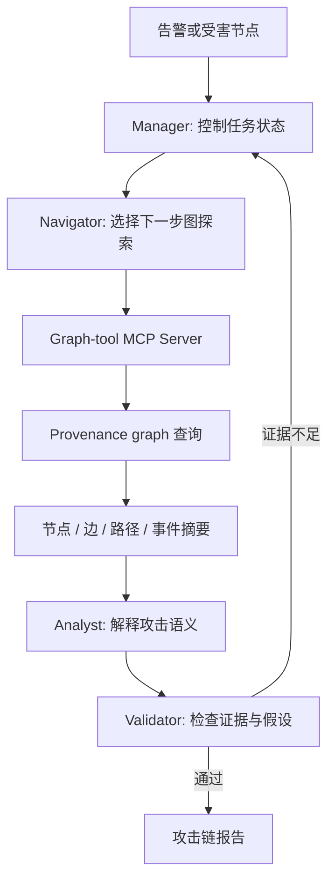
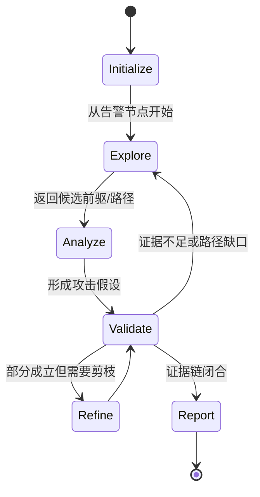

# Minos：让安全溯源 Agent 从“遍历日志”变成“带证据的反向推理”

| 项目 | 内容 |
| --- | --- |
| 论文 | **Minos: A Multi-Agent Collaborative Framework for Provenance-Based Backward Tracking** |
| 方向 | AI for Security / 多 Agent 安全取证 |
| 原文 | <https://arxiv.org/abs/2607.00440> |
| HTML | <https://arxiv.org/html/2607.00440> |
| 时间 | 2026-07-01 提交，arXiv 页面同时标注 ESORICS 2026 |
| 本文问题 | 在海量 provenance graph 中，如何让 LLM Agent 做可审计、可回退、可协作的攻击反向溯源 |

## TL;DR

- **这篇论文做什么**：Minos 把 APT 取证里的 backward tracking 改写成一个多 Agent 协作问题，让 LLM 不再盲目展开 provenance graph，而是围绕攻击入口、事件语义、证据约束和置信度逐步提出、验证、修正假设。
- **怎么做**：系统由上下两层组成。上层是一个由 Manager、Navigator、Analyst、Validator 组成的四 Agent 有限状态机；下层是 graph-tool MCP Server，负责把自然语言推理转成可执行图查询、邻居扩展、路径检索和证据返回。
- **证据与实验**：论文在 5 个数据集、14 个攻击场景中评测，报告平均 **recall 0.92**、**precision 0.64**，并让生成的攻击子图比基线紧凑 **49%**；这说明它不是只多找节点，而是在保留关键攻击链的同时压缩噪声。
- **关键机制**：Minos 的核心不是“让 LLM 看图”，而是把图探索拆成三类可被验证的状态：当前可疑节点、候选前驱路径、自然语言攻击假设。每次扩展都要被 provenance evidence 和 Validator 检查。
- **局限**：论文的有效性仍依赖日志质量、系统调用语义、数据集场景覆盖和工具接口可靠性。LLM 不能替代底层审计，也不能在缺失关键日志时凭空补出攻击链。
- **为什么值得读**：它给 AI 安全工具一个很好的研究模板：LLM 不应绕过确定性安全数据结构，而应作为“假设生成与证据组织层”，被图查询、引用验证和状态机约束住。

## 研究问题：为什么 backward tracking 需要 Agent？

APT 调查通常要回答一个反向问题：

- 现在看到一个受害文件、异常进程、外连连接或告警节点；
- 它是被谁写入、启动、读取、注入或下载的；
- 这些上游事件能不能连成一条攻击链；
- 哪些节点只是正常系统噪声，哪些节点必须进入最终报告。

传统 provenance-based backward tracking 的优势很明显：

| 优势 | 解释 |
| --- | --- |
| 证据可回溯 | 每个结论都能落到进程、文件、socket、系统调用或事件边 |
| 图结构明确 | 依赖关系、父子进程、读写关系可以形式化查询 |
| 适合事后调查 | 攻击发生后可以沿受害节点向上游追溯 |

但困难也同样结构化：

- **图太大**：真实主机上的 provenance graph 会包含大量正常读写、系统服务、临时文件和库加载。
- **边太碎**：单条事件边只能说“谁读了谁”，不能直接说明攻击意图。
- **噪声太多**：安全分析员知道 `/bin/sh`、浏览器缓存、包管理器、日志轮转各自代表什么，但普通图算法很难编码这些语义。
- **停止条件难**：向上游追溯到哪里算够？遇到系统服务、用户入口、下载脚本、权限提升节点时，哪些该保留？

Minos 的研究问题可以概括为：

> 能否把 LLM 的语义推理能力放进 provenance backward tracking，但又不让它脱离图证据自由发挥？

这也是论文最值得注意的边界意识。作者没有把 LLM 当作直接判案的黑箱，而是把它放在一个可查询、可验证、可回退的流程里。

## 论文主张：学习重点不是图遍历，而是假设驱动的证据选择

Minos 的中心主张有三层：

| 层级 | 主张 | 对应机制 |
| --- | --- | --- |
| 问题层 | backward tracking 不是单纯搜索问题，而是安全语义解释问题 | LLM Agent 负责提出攻击假设和筛选候选路径 |
| 系统层 | LLM 必须被确定性工具约束 | graph-tool MCP Server 执行查询，返回节点、边、路径和摘要 |
| 协作层 | 单 Agent 容易过度展开或自证循环 | Manager / Navigator / Analyst / Validator 分工并用 FSM 控制状态 |

这个主张和很多“LLM for security”论文不同。它不是直接要求模型读日志后生成结论，而是先承认：

- 证据来自 provenance graph；
- 搜索动作要通过工具执行；
- 自然语言解释必须回指具体节点和边；
- Agent 的每一步都要能够被另一个角色质疑。

换句话说，Minos 试图让 LLM 做两件传统图算法不擅长的事：

1. **提出可搜索的安全假设**：例如“这个脚本可能是下载器”“这个 shell 可能由邮件附件触发”“这个文件写入可能是 payload 落地”。
2. **决定何时继续和何时停止**：不是机械追到根节点，而是在证据足够解释攻击链时收束。

## 方法机制：两层架构如何约束 LLM？

论文的 Figure 1 可以抽象成下面的结构：



这里有一个关键设计：LLM Agent 不直接操作原始图数据库，而是通过 MCP Server 调用有限工具。这个接口把“自然语言想法”变成“可审计查询”。

| 组件 | 输入 | 输出 | 它防止什么问题 |
| --- | --- | --- | --- |
| Manager | 当前任务、历史状态、Validator 反馈 | 下一个状态和角色调用 | 防止 Agent 无限制聊天或重复探索 |
| Navigator | 可疑节点、已有路径、探索目标 | 需要查询的邻居、前驱、路径或过滤条件 | 防止随机遍历整个图 |
| Analyst | 查询返回的事件、路径、上下文 | 攻击假设、节点语义、候选链解释 | 防止只看结构不看安全语义 |
| Validator | 假设、证据引用、路径完整性 | 通过、要求补证、驳回 | 防止模型凭经验补全不存在的链路 |

### 公式化理解：Minos 其实在优化什么？

可以把一个 backward tracking 任务写成：

```text
给定：
  G = (V, E)          # provenance graph，节点是进程/文件/socket，边是事件
  s                  # 受害节点或告警节点
  T                  # 事件时间窗与系统上下文

目标：
  找到路径集合 P = {p1, p2, ...}
  使得每条路径 p 都从 s 反向连接到可信攻击入口或关键中间节点

约束：
  evidence(p) 必须来自 G 的节点和边
  semantics(p) 必须能解释攻击阶段
  noise(p) 应尽量低，避免把正常系统活动并入攻击链
```

传统方法更像在最小化图搜索损失：

```text
score_path(p) = reachability(p) - alpha * path_length(p)
```

Minos 则把自然语言假设也放进状态：

```text
state_t = {
  suspicious_nodes,
  candidate_paths,
  hypotheses,
  cited_evidence,
  unresolved_questions
}
```

每一步不是简单选择下一个邻居，而是选择一个动作：

```text
action_t ∈ {
  expand_predecessors(node),
  retrieve_event_summary(node_or_edge),
  compare_candidate_paths,
  ask_for_validation,
  stop_and_report
}
```

这让论文的贡献更清楚：Minos 并没有发明新的图可达性算法，而是在图算法之上加入了“安全语义状态”和“协作式验证状态”。

## FSM：四个 Agent 为什么必须按状态机协作？

Minos 使用有限状态机控制 Agent 流程。这个设计在安全场景里很重要，因为安全调查最怕两类 LLM 行为：

- 一类是**过度自信**：看到少量线索就生成完整攻击故事。
- 另一类是**无限探索**：每个节点都觉得可疑，导致路径爆炸。

可以把 FSM 理解为下面的循环：



这套状态机的作用不是形式上好看，而是把“谁能推进任务”限制住：

| 状态 | 主要问题 | 不允许做的事 |
| --- | --- | --- |
| Explore | 还缺哪些图证据？ | 不允许直接写最终攻击结论 |
| Analyze | 这些证据是否支持攻击语义？ | 不允许无引用地解释节点含义 |
| Validate | 假设是否覆盖路径缺口？ | 不允许把不确定路径并入最终链 |
| Refine | 哪些节点是噪声，哪些必须保留？ | 不允许丢掉支撑结论的关键边 |
| Report | 证据链是否可复查？ | 不允许给出无法回查的自然语言判断 |

这个设计也解释了为什么论文选择多 Agent，而不是单 Agent 加工具。单 Agent 可以调用工具，但它很容易把“我刚刚提出的解释”当作下一步搜索的前提。Validator 的独立角色至少制造了一层反驳压力。

## RAG 与事件摘要：为什么原始 provenance graph 不够？

provenance graph 的节点和边很精确，但它们的语义并不总是直接可读。例如：

- 一个进程节点可能只是 `/usr/bin/python3`，真正重要的是它执行了哪个脚本。
- 一个文件节点可能是临时路径，真正重要的是它是否来自下载、解压或编译。
- 一个 socket 节点可能只有地址和端口，真正重要的是它是否对应 C2、下载源或内网横向移动。

Minos 因此引入事件级 RAG / summary 机制，把底层事件转成更适合 LLM 推理的上下文：

| 原始证据 | 摘要后可用于推理的信息 |
| --- | --- |
| process exec edge | 命令行、父进程、时间、执行用户 |
| file read/write edge | 文件路径、扩展名、是否新建、读写方向 |
| network edge | 远端地址、端口、连接时序、进程归属 |
| provenance path | 是否形成下载、执行、持久化、横向移动链条 |

这里的 RAG 不是为了“补知识”，而是为了降低图事件和安全语义之间的距离。它仍然必须引用原始节点和边，不能把摘要当作独立证据。

## 伪代码：一次 Minos 溯源怎样跑？

下面是对论文流程的抽象，保留输入、状态、循环、条件、输出和失败边界：

```text
Input:
  G: provenance graph
  s: alert node or compromised artifact
  B: benign context and event summaries
  budget: max tool calls / max exploration rounds

State:
  Q: nodes or paths waiting for exploration
  H: hypotheses about attack stages
  E: cited evidence set
  R: rejected paths and reasons

Initialize:
  Q <- {s}
  H <- {}
  E <- {}
  R <- {}

Loop while Q is not empty and budget remains:
  Manager selects the next state.

  Navigator:
    choose node/path q from Q
    call graph-tool MCP to retrieve predecessors, neighbors, paths, summaries

  Analyst:
    map returned evidence to possible attack semantics
    update H with candidate hypotheses
    attach evidence IDs from G to each claim

  Validator:
    if claim has no cited graph evidence:
       reject claim and add reason to R
    else if path has missing stage or ambiguous normal behavior:
       ask Navigator to expand or compare alternatives
    else if attack chain is sufficiently explained:
       mark candidate chain as reportable

  Manager:
    prune low-value branches
    stop if reportable chain is complete

Output:
  Attack chain with cited nodes/edges, explanation, confidence, and unresolved gaps.

Failure boundary:
  If logs are missing, graph schema is incomplete, or all candidate paths remain ambiguous,
  Minos should report uncertainty rather than inventing a chain.
```

这段伪代码凸显了论文最重要的工程原则：Agent 的输出不是自由文本报告，而是带引用的中间状态更新。

## 实验设置：论文如何证明它不是只会讲故事？

论文在 5 个数据集、14 个攻击场景上评测。这里的重点不是某一个数据集名称，而是覆盖了多种 provenance security 场景：

- 真实或半真实主机活动日志；
- APT 风格攻击链；
- 多阶段攻击路径；
- 大量正常系统事件作为背景噪声；
- 需要从告警节点反向找到攻击源头的任务。

评测关注三类结果：

| 指标维度 | 具体含义 | 为什么重要 |
| --- | --- | --- |
| 准确性 | 找到的攻击链是否覆盖关键攻击节点和边 | 证明模型不是只生成合理故事 |
| 搜索效率 | 需要展开多少节点、调用多少工具、走多少轮 | backward tracking 的核心痛点是路径爆炸 |
| 误报控制 | 是否把正常节点错误并入攻击链 | 安全取证不能用“多找一点”掩盖低精度 |

论文比较的对象包括：

- 传统 provenance backward tracking；
- 单 Agent 或弱协作 Agent；
- 去掉 Validator 的变体；
- 去掉事件摘要 / RAG 的变体；
- 不同 LLM 作为推理组件时的表现。

这种实验设计可以支撑一个有限但有价值的结论：Minos 的收益来自“结构化协作 + 工具约束 + 语义摘要”的组合，而不是单纯换了更强模型。

## 结果解读：Minos 到底强在哪里？

从论文叙述看，Minos 的优势主要体现在三个层面。

先看最核心的总体数字：

| 总体结果 | 数值 | 研究含义 |
| --- | --- | --- |
| 平均召回率 | 0.92 | 大多数关键攻击节点和边能被找回 |
| 平均精确率 | 0.64 | 仍有误报空间，但相较穷举式追踪更可控 |
| 攻击子图紧凑度 | 比基线小 49% | 不是把更多节点塞进报告，而是减少调查噪声 |

这组三个数字要放在一起读。只有 recall 高，可能只是过度展开；只有 precision 高，可能漏掉关键阶段；子图更紧凑则说明 Minos 的语义剪枝确实在发挥作用。

### 1. 它能更快避开正常系统噪声

传统 backward tracking 容易沿着所有前驱关系继续展开。例如：

- 进程读取了大量库文件；
- shell 触发了多个正常系统命令；
- 用户目录里存在许多临时文件；
- 浏览器、包管理器或系统服务产生大量边。

Minos 的 Analyst 会把这些边放进安全语义中判断：

| 图结构现象 | 可能的安全语义 | Agent 应做的判断 |
| --- | --- | --- |
| 进程读取共享库 | 正常运行依赖 | 通常剪枝 |
| 脚本写入可执行文件 | payload 落地 | 继续追踪来源 |
| shell 连接外部 IP | 下载或 C2 | 检查命令行和时间序列 |
| 编译器生成二进制 | 构建或恶意编译 | 看父进程、输入文件和攻击上下文 |

这不是 LLM 的“常识胜利”，而是 LLM 把上下文线索转成剪枝策略。

### 2. 它能把攻击链解释成阶段

安全分析员通常不是只要一条路径，而是要知道每个节点在攻击链里扮演什么角色：

- 初始入口；
- 下载或落地；
- 执行；
- 权限提升；
- 持久化；
- 横向移动；
- 数据访问或破坏。

Minos 的多 Agent 流程让路径不只是节点列表，而是“路径 + 阶段解释 + 证据引用”。

这点对实际取证很关键。一个报告如果只说：

```text
file_A <- proc_B <- socket_C <- proc_D
```

分析员还需要自己解释每条边。Minos 想输出的是：

```text
socket_C 表示外部下载源；
proc_D 发起下载并写入 file_A；
proc_B 执行 file_A 并触发告警节点；
每个判断都有对应 edge 和 event summary。
```

### 3. 它能用 Validator 控制幻觉

安全 Agent 最大的风险不是回答慢，而是回答得像真的。Validator 的作用就是把自然语言判断重新拉回证据：

| Analyst 可能说法 | Validator 应检查 |
| --- | --- |
| 这是 C2 连接 | 是否有网络边、远端地址、时间序列、进程归属 |
| 这是 payload | 是否有写入、执行、文件类型或后续恶意行为 |
| 这是初始入口 | 是否有更早上游节点，还是只是当前可见起点 |
| 这是正常噪声 | 是否会丢失攻击链必要节点 |

这个验证角色并不能完全消除幻觉，但它至少把错误从“最终报告里看起来合理”提前到“中间状态被驳回”。

## 消融与失败：哪些设计是真正必要的？

论文的消融可以按功能拆成三类。

| 被移除的机制 | 预期损失 | 原因 |
| --- | --- | --- |
| 多 Agent 协作 | 搜索和解释混在一起，容易自证循环 | 同一个上下文里提出假设又验证假设，反驳压力弱 |
| Validator | 误报和无证据解释增加 | 没有人强制每个 claim 回指节点和边 |
| RAG / 事件摘要 | 语义判断变差，剪枝更粗糙 | 原始图边过于低层，LLM 难以判断安全阶段 |
| FSM | 流程可能重复、发散或提前停止 | 缺少状态级停止条件和回退路径 |

失败边界也可以从论文任务本身推出：

- **日志缺失**：如果攻击早期事件没有被采集，Minos 只能报告“可见起点”，不能证明真实初始入口。
- **语义歧义**：某些系统管理脚本和攻击脚本在 provenance 层面很像，需要更多上下文。
- **工具错误**：MCP Server 查询、图模式映射、时间窗过滤如果有问题，上层 Agent 会被错误证据误导。
- **模型安全策略**：AI for security 场景可能触发模型拒答或过度保守，影响调查完整性。
- **数据集迁移**：14 个场景足以说明机制有效，但还不能证明在所有企业日志、EDR schema 或云环境中稳定。

这些局限并不削弱论文贡献，反而说明 Minos 更像一个“受控推理层”，不是端到端替代安全平台。

## Figure 与 Table 应该怎样读？

由于本文没有本地化外部图片，下面用表格重述关键图表承担的证据功能。

| 图表类型 | 主要证明什么 | 不能证明什么 |
| --- | --- | --- |
| 系统架构图 | LLM Agent 被 MCP graph tool 约束，分层清楚 | 不能单独证明准确率提升 |
| FSM / 协作流程 | 每个角色在状态机中有明确职责 | 不能证明角色提示词在所有模型上稳健 |
| 主结果表 | Minos 在多数据集、多场景中优于若干基线 | 不能证明真实企业环境零迁移成本 |
| 消融表 | Validator、RAG、多 Agent、FSM 都有贡献 | 不能完全排除 prompt 工程和模型选择影响 |
| 案例分析 | 展示如何从告警节点回溯攻击链 | 不能代表所有攻击类型 |

读这些图表时要注意一个边界：Minos 的证据是“在 provenance graph 可见且查询接口可靠时，协作 Agent 能更好地组织搜索”。它不是“LLM 能凭文本理解替代审计日志”。

## 相关工作位置：它和传统安全图分析、LLM 安全 Agent 有什么不同？

可以把 Minos 放在三个研究方向交叉处：

| 方向 | 常见做法 | Minos 的差异 |
| --- | --- | --- |
| provenance graph security | 规则、启发式、图搜索、异常检测 | 引入 LLM 做假设生成和语义剪枝 |
| LLM security assistant | 读日志、总结告警、生成调查建议 | 强制使用图工具和证据引用，避免纯文本判断 |
| 多 Agent 协作 | 多角色讨论、辩论、任务分解 | 用 FSM 固定角色调用顺序，并连接底层 MCP 工具 |

这个位置判断很重要。Minos 不是把传统安全图分析淘汰掉，而是把它包进一个更适合人类调查流程的界面：

- 图数据库负责事实；
- 检索摘要负责上下文；
- Agent 负责提出下一步调查问题；
- Validator 负责把自然语言结论压回证据链。

### 外部参考搜索：目前可用补充有限

我用论文题名、`2607.00440` 和 `Minos Provenance-Based Backward Tracking` 做了补充搜索。当前能稳定确认的是 arXiv 摘要页、HTML 全文、cs.CR 2026 年 7 月列表，以及少量索引页。尚未看到作者博客、开源代码、会议幻灯或独立复现报告。

因此本文没有把第三方解读当作证据，只把它们作为“暂未出现”的背景处理。所有方法与实验判断都回到论文正文、摘要页元数据和 arXiv 列表。

## 对 AI 安全的启发：Agent 应该被工具收束，而不是被工具放飞

Minos 对 AI 安全本身有一个反向启发。很多 Agent 系统把工具调用视为扩大能力的方式：

- 会读文件；
- 会查日志；
- 会跑命令；
- 会访问网络；
- 会写报告。

但安全场景里，工具不是越多越好。Minos 更像是在证明：

- 工具接口要窄；
- 工具返回要可引用；
- Agent 状态要可审计；
- 验证角色要能拒绝自然语言结论；
- 最终报告要保留“不确定”和“证据缺口”。

这对安全 Agent 的设计非常关键。一个能生成完整攻击故事的模型，如果不能指出每个判断来自哪个节点、哪条边、哪个事件摘要，它就不适合进入取证流程。

## 研究者视角：下一步值得追问什么？

Minos 留下的问题比结论更有研究价值。

### 1. Validator 能否从角色提示变成可学习模块？

现在 Validator 主要是一个角色。未来可以进一步研究：

- 用已标注攻击链训练 evidence-checker；
- 对每个 claim 做 node-edge entailment；
- 把无证据 claim、弱证据 claim、矛盾 claim 分级；
- 用反例数据集专门训练“不要补全”的能力。

这会把 Minos 从协作 prompt 系统推进到可评测的验证模型。

### 2. graph-tool MCP 是否应该有静态类型和权限模型？

安全取证工具不是普通搜索接口。它应该明确：

- 哪些查询只读；
- 哪些查询会展开大量节点；
- 哪些查询会泄露敏感路径；
- 哪些工具调用必须记录审计日志；
- 哪些输出必须脱敏后给 LLM。

Minos 论文强调 MCP Server，但未来系统需要更严格的工具权限和成本控制。

### 3. 如何处理跨主机、云日志和不完整 provenance？

APT 调查经常跨主机、容器、云身份、SaaS 日志和网络设备。单一主机 provenance graph 只是起点。

下一步可以问：

- 多图之间如何对齐时间和实体；
- 云 API 调用如何映射到 provenance 节点；
- 身份、设备、进程、文件之间如何统一建模；
- LLM 是否会在图缺口处过度推断。

### 4. 评测能否加入“诱导性噪声”？

Minos 已经关注误报，但更强评测应该加入专门干扰：

- 与攻击路径相似的正常管理脚本；
- 时间上接近但无因果关系的系统事件；
- 安全工具自身产生的噪声；
- 缺失关键边的半截攻击链；
- 多个候选入口同时存在的场景。

这类评测能更好衡量 Validator 是否真的能抑制幻觉。

## 结论：Minos 的价值在于把 LLM 放回证据链里

Minos 最值得带走的判断不是“多 Agent 能做安全溯源”，而是：

- backward tracking 的难点不只是找路径；
- 安全取证需要把路径解释成攻击阶段；
- LLM 可以帮助提出假设和剪枝；
- 但每个假设都必须绑定 provenance evidence；
- 多 Agent、FSM、RAG 和 MCP 工具共同构成约束边界。

如果说传统 provenance tracking 给出了“事实图”，Minos 试图补上的是“如何围绕事实图进行可审计推理”。

对 AI for Security 来说，这比单纯提高自动化程度更重要。因为安全调查最需要的不是一段漂亮总结，而是一条能被复查、能被反驳、能承认缺口的证据链。
