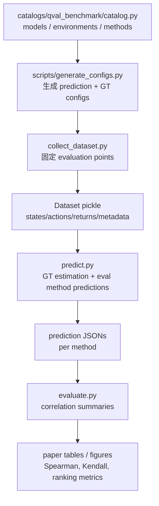

# QVal：在训练长程 Agent 之前，先问 dense supervision 信号值不值得相信

### 元信息

| 字段 | 内容 |
|---|---|
| 论文 | QVal: Cheaply Evaluating Dense Supervision Signals for Long-Horizon LLM Agents |
| 作者 | Sergio Hernandez-Gutierrez, Matteo Merler, Ilze Amanda Auzina, Joschka Struber, Ameya Prabhu, Matthias Bethge |
| 时间 | arXiv v1, 2026-06-30 17:58:23 UTC |
| 链接 | [arXiv](https://arxiv.org/abs/2606.32034), [HTML](https://arxiv.org/html/2606.32034), [PDF](https://arxiv.org/pdf/2606.32034) |
| 项目 | [q-val.com](https://q-val.com/), [GitHub](https://github.com/bethgelab/qval) |
| 分类 | 大模型 Agent / 大模型后训练 |

### TL;DR

- **这篇论文解决什么问题**：长程 LLM Agent 一条轨迹可能有数百到数千个动作，只用最终成功/失败奖励做 RL 后训练太稀疏；但 dense supervision 方法又常常只能通过“把它塞进完整训练管线再看下游成功率”来评估，成本高，也混入优化器、采样、loss 集成和工程细节。
- **QVal 做什么**：它把问题改成训练前的信号诊断。给定同一批 `(state, action, next_state)` 点，QVal 用强参考策略估计参考 `Q(s,a)`，再看候选 dense signal 的打分能否按同样顺序排序动作，也就是是否 **Q-aligned**。
- **核心公式**：如果某个信号 `k(s,a)` 是参考 `Q^pi(s,a)` 的严格单调变换，即 `k(s,a)=phi(Q^pi(s,a))`，它就不会改变动作优劣顺序；实际评估用 Spearman rho 和 Kendall tau 近似这个性质。
- **实验规模**：QVal-v1.0 覆盖 4 个环境：TerminalBench、OpenApps、ALFWorld、FrozenLake；21 种 dense supervision 方法；7 个方法家族；6 个开源模型骨干；超过 1.2K 个评估实验。
- **最反直觉结果**：简单 direct prompting 和 ranking 方法平均最强，许多更复杂的 dense signal 方法没有稳定胜出；direct-single 这种“一点一问”的数值估计在多个环境里已经是很强基线。
- **环境差异**：复杂度不是单调解释变量。codegen 在 FrozenLake 这类小而结构化的环境里可以很强，但到 TerminalBench 这类开放 shell 命令环境会变弱甚至负相关；self-distillation 在简单环境弱，在 TerminalBench 相对更强。
- **稳健性证据**：文本观察通常比图像观察更容易恢复参考价值；Q-value 与 state-value 的方法排序大体保持；TerminalBench 用 GPT-5.5 或 Claude Opus 4.7 做 Max-Value Monte Carlo 标签时，方法相对排序也接近。
- **局限**：QVal 只评估信号和参考价值的排序一致性，不直接证明这个信号一定提升完整 RL；某些探索信号可能与当前目标低相关但仍有训练价值；参考策略质量、环境覆盖和状态抽象方式仍会决定结论边界。

### 研究问题：为什么 dense supervision 需要一个训练前测试床？

论文的出发点不是“再造一个 reward benchmark”，而是抓住长程 Agent 后训练里的一个具体断点：

- Agent 轨迹越来越长：
  - 代码任务里，一个错误 shell 命令可能要几十步后才暴露。
  - 浏览器任务里，一个错误点击可能暂时无害，但改变后续页面状态。
  - ALFWorld 这类具身环境里，拿错物体、走错房间、打开错容器都会影响后续可达性。
- outcome-only reward 太稀疏：
  - 最终 verifier 只告诉你“成功”或“失败”。
  - 它不告诉模型哪一步是关键贡献，哪一步只是凑巧出现在成功轨迹里。
  - 在任务本身超出当前模型能力时，最终成功甚至可能很少出现。
- dense supervision 方法越来越多：
  - 直接让 LLM 给 `(s,a)` 打分。
  - 用 verifier rubric 估计动作质量。
  - 让模型生成 reward / value 函数代码。
  - 用 self-distillation 看动作在“知道结果之后”是否更可能。
  - 用 CLIP、SigLIP、VIP、LIV 这类表征模型估计视觉进展。

问题在于，这些方法过去常常通过完整后训练来比较：

| 传统评估 | 为什么不够干净 |
|---|---|
| 把 dense signal 接进 RL loss | 信号质量和 loss 权重、归一化、优化器、采样策略混在一起 |
| 看最终 pass rate / return | 下游收益可能来自训练 recipe，而不是信号本身 |
| 每个方法用自己的实验设置 | 不同方法之间缺少共同输入、共同标签和共同指标 |
| 只评估某个特定管线 | 无法判断“这个信号本身是否值得继续投入训练预算” |

QVal 的研究问题可以压缩成一句话：

> 在不跑完整后训练的情况下，能不能直接判断一个 dense supervision 信号是否真的在表达“动作之后更可能成功”？

### 论文主张与论证路线

| Claim | Mechanism | Evidence | Boundary |
|---|---|---|---|
| dense signal 应先评估“信号本身” | 固定数据点、固定参考标签、固定模型骨干，只比较 predicted score 与 reference value 的排序相关 | QVal-v1.0 对 21 方法、4 环境、6 backbone 做统一评估 | 排序相关不是完整训练收益，不能替代下游 RL |
| Q-alignment 是合理代理指标 | 如果 `k(s,a)` 与 `Q^pi(s,a)` 单调一致，信号就不会颠倒动作优劣 | Spearman / Kendall 直接度量单调排序一致性 | 参考策略 `pi` 必须足够强；否则标签本身会偏 |
| 简单方法是强基线 | direct prompting / ranking 直接让模型判断动作价值，减少方法特定工程假设 | Figure 2/3 显示 direct 和 ranking 家族平均最高 | direct prompting 仍依赖状态文本抽象和模型理解能力 |
| 方法复杂度不自动带来更好信号 | batched、sequential、direct-16、codegen-avg、sdpo-gt 等复杂化不稳定提升 | 主结果指出 family 内复杂变体通常不稳定超过简单版本 | 某些复杂方法可能在特定训练管线中仍有用 |
| 环境和模态决定信号可读性 | 不同环境的状态、动作空间、可观测性、文本/视觉抽象不同 | codegen 在 FrozenLake 强，在 TerminalBench 弱；文本优于图像 | 不能把视觉弱读成视觉反馈天然无用 |

### 方法机制：QVal 到底怎样构造标签？

QVal 的最小输入是一个 Agent 轨迹中的中间点：

- `s_t`：当前状态。
- `a_t`：候选动作。
- `s_{t+1}`：执行动作后的下一个状态。
- `pi`：参考策略，理想情况下接近最优。
- `G`：从当前点继续执行后的累计回报。

论文把参考标签定义成近似 `Q^pi(s_t,a_t)`：

```text
Q^pi(s_t, a_t)
= E[ return | start at s_t, force first action a_t, then follow pi ]
```

在确定性参考策略里，这个值可以由一次 rollout 得到；在 TerminalBench 这类开放任务里，作者用 Max-Value Monte Carlo：

```text
label(s_t, a_t)
= max_{j in 1..k} G_j

where:
- 每个 G_j 是从同一个 (s_t, a_t) 出发的一个参考策略 continuation return
- TerminalBench 使用 k=16
- max 近似“强参考策略多次尝试下的可达成功价值”
```

这个选择很关键。作者不是想估计“平均模型会怎样”，而是想知道：

- 如果第一步动作已经确定；
- 后面交给一个强参考策略；
- 那么这个动作把任务带向成功的潜力有多大。

这让 dense signal 的目标更接近过程监督：

| 评估对象 | QVal 关心的不是 | QVal 关心的是 |
|---|---|---|
| 单步动作 | 这一动作看起来是否合理 | 它是否提高后续成功的参考价值 |
| 中间状态 | 当前文本是否像成功轨迹 | 从这里继续是否更容易成功 |
| dense score | 绝对数值是否校准 | 是否把高价值动作排在低价值动作前面 |
| 方法家族 | 谁的训练 pipeline 最强 | 谁在共同输入上产生更好的 value ordering |

### 公式：为什么用 Spearman，而不是 MSE？

论文先定义理想情况：

```text
k(s, a) = phi(Q^pi(s, a))
```

变量含义：

- `k(s,a)`：候选 dense supervision 方法给出的分数。
- `Q^pi(s,a)`：在参考策略 `pi` 下的动作价值。
- `phi`：严格递增函数。
- `Q-aligned`：只要 `phi` 严格递增，动作排序就不会变。

这解释了为什么 QVal 不用 MSE：

| 方法类型 | 输出数值的尺度 |
|---|---|
| direct prompting | LLM 生成的任意标量 |
| verifier | rubric 分箱或 logprob 组合 |
| codegen | 生成函数返回的手写启发式值 |
| embedding similarity | 余弦相似度、距离、softmax 概率 |
| self-distillation | action likelihood 或 belief change |

这些数值不能放在同一个绝对尺度上比较。一个方法输出 `0-1`，另一个输出 `-100 到 100`，并不代表后者更有信息。QVal 只问排序：

```text
rho = corr(rank(y_i), rank(y_hat_i))
```

其中：

- `y_i` 是参考 `Q` 标签。
- `y_hat_i` 是方法预测分数。
- `rho = 1` 表示完全同序。
- `rho = 0` 表示没有单调关系。
- `rho = -1` 表示完全反序。

对于 ranking 方法，情况稍不同。它们不输出每个点的标量，而是在同一状态下对 `K` 个候选动作排序。QVal 使用 per-state Spearman：

```text
rho_rank = mean_i rho(sigma_i^*, sigma_i)

where:
- sigma_i^* 是参考 Q 标签诱导出的候选动作排序
- sigma_i 是方法预测排序
- i 遍历至少有两个不同 Q 值的状态
```

这避免把“跨状态数值校准”混进比较，只看同一状态内能不能选对动作。

### QVal-v1.0 的环境设计

论文选择四个环境，不是为了覆盖所有 Agent 任务，而是为了制造不同的状态/动作结构：

| 环境 | 来源 | 模态 | 任务/轨迹设置 | 参考策略 |
|---|---|---|---|---|
| TerminalBench | TBLite easy | text | 19 个任务、118 条轨迹、100 eval points、100 ranking points、40 步 horizon | GPT-5.5, `k=16` MVMC |
| OpenApps | BrowserGym suite | text/image | 8 个网页应用任务、40 条轨迹、94 eval points、94 ranking points、45 步 horizon | scripted optimal |
| ALFWorld | ALFWorld OOD | text/image | 24 个场景、40 条轨迹、100 eval points、100 ranking points、40 步 horizon | expert planner |
| FrozenLake | Gymnasium 8x8 | text/image | 8 张地图、50 条轨迹、100 eval points、100 ranking points、30 步 horizon | scripted optimal |

这张表里最值得注意的是 TerminalBench：

- 它没有最优策略。
- 动作空间是开放 shell 命令。
- 一个“最优”命令可能是很长、难解释、不可泛化的 one-liner。
- 作者因此不用“单步最优命令”做标签，而是让 GPT-5.5 从 forced action 之后继续尝试 `k=16` 次，取最大回报。

这实际表达了一个研究立场：

- QVal 不是追求数学上完美的 `Q*`。
- 它追求一个对训练长程 Agent 有意义的“强参考进展信号”。
- 对 TerminalBench，作者还用 Claude Opus 4.7 做对照，说明方法排序在不同强模型标签下大体稳定。

### 方法族：21 个 dense supervision 信号怎样分组？

论文把 21 个方法分成 7 个家族。这个 taxonomy 很重要，因为主结果之一就是“方法按家族聚类”。

| 家族 | 方法 | 信号直觉 |
|---|---|---|
| Ranking | `ranking` | 让 LLM 直接比较同一状态下多个候选动作 |
| Direct | `direct-single`, `direct-batched`, `direct-sequential`, `direct-16`, `gvl` | 让 LLM/VLM 对一个或多个 `(s,a,s')` 直接输出 value |
| Intrinsic scoring | `verifier`, `Delta belief` | 用模型内部置信、rubric logprob 或成功信念变化做分数 |
| Self-Distillation | `sdpo`, `sdpo-gt` | 看模型在看到 outcome / privileged info 后是否更倾向该动作 |
| Pre-trained | `vip`, `liv-cos`, `liv-l2`, `liv-txt` | 用预训练视觉价值表征估计状态到目标的距离 |
| Embedding | `vlm-rm-cos`, `vlm-rm`, `vlm-sor-softmax`, `vlm-sor` | 用 CLIP/SigLIP 这类图文 embedding 衡量目标进展 |
| Code | `codegen`, `codegen-avg`, `eureka` | 让 LLM 生成一个 Python scoring function，再批量执行 |

几个方法细节值得单独拎出：

- `direct-single`：
  - 一个点一个 prompt。
  - 让模型输出一个 scalar。
  - 结构最简单，却成为强基线。
- `direct-16`：
  - 同一数据点独立采样 16 次。
  - 用平均值减少生成噪声。
  - 论文发现并不稳定压过更简单 direct 版本。
- `codegen`：
  - 让模型一次性生成评分函数。
  - 函数在所有点上执行。
  - 在小而规则明确的环境有优势，但开放环境会暴露抽象失败。
- `sdpo-gt`：
  - 给 teacher 更多 privileged target-policy 信息。
  - 结果并没有稳定改善 `sdpo`。
  - 这说明“更多信息”不等于“更好的排序信号”。

### 实验管线：它不是一篇只有概念的论文

官方 GitHub README 和 docs 显示，QVal 的工程管线围绕一个 registry catalog 展开：



这种设计对后训练研究很实用：

- 新方法只要实现 `evaluate(point) -> float`。
- 排名方法可以实现 `rank_batch` / `score_batch`。
- 新模型通过 backend registry 接入。
- 新环境通过 context YAML、EnvironmentSpec 和 Dataset 接入。
- 每个阶段有明确数据边界，便于重复跑 prediction 或 evaluation。

换句话说，QVal 的贡献不仅是一个指标，还包括一个能让研究者快速问“这个 dense signal 先值得训练吗”的工作流。

### 主结果：简单方法为什么赢？

论文的 Figure 2/3 给出核心结果：

- ranking 和 direct prompting 平均 Q-alignment 最高。
- direct prompting 在多个环境中保持正相关，包括 TerminalBench。
- 方法家族内部结果相似，说明 taxonomy 捕捉到真实信号差异。
- code 方法方差最大，环境依赖强。
- 复杂变体没有稳定带来提升。

可以把这个结果理解成三个层次。

| 层次 | 论文观察 | 研究含义 |
|---|---|---|
| 方法选择 | direct / ranking 是强基线 | 新方法不能只和弱 baseline 比，至少要压过简单 LLM value prompt |
| 方法复杂度 | batched、sequential、16-sample、oracle teacher 都不稳 | 增加 prompt 或 privileged info 可能提高成本，却不提高排序质量 |
| 环境交互 | codegen 在 FrozenLake 强，TerminalBench 弱 | 可程序化规则越清楚，代码评分越有优势；开放任务更依赖语义理解 |

这里最容易误读的是“direct prompting 赢”。它不意味着：

- 后训练只需要 prompt 一个 value。
- verifier、self-distillation、code reward 都没有价值。
- QVal 已经证明 direct prompting 下游训练最好。

更准确的解释是：

- 在共同输入、共同标签、共同指标下；
- 这些复杂方法在“排序参考 Q-value”这件事上没有稳定超过简单 direct baseline；
- 因此未来 dense supervision 论文应该把 direct prompting 当作必须击败的信号质量基线。

### Figure/Table 证据拆解

| 证据位置 | 支撑什么 | 不能证明什么 |
|---|---|---|
| Figure 1 | QVal 的数据流：收集轨迹、采样 state-action、估计参考 Q、评估 Q-alignment | 不能证明 Q-alignment 与所有 RL 收益单调对应 |
| Table 1 | 21 个方法、7 个方法族的覆盖范围 | 不代表这 21 个方法穷尽 dense supervision |
| Figure 2 | direct / ranking 平均最强，方法按家族聚类 | 不能证明每个具体环境里 direct 都第一 |
| Figure 3 | 环境差异显著，复杂度不是单调解释变量 | 不能推出某环境难度越高 dense signal 越差 |
| Figure 4 left | 文本观察普遍优于图像观察 | 不能说明视觉反馈天然无用，只说明本设置下视觉抽象更难 |
| Figure 4 right | Q-value 与 state-value 排名大体稳定 | 不能排除某些方法只适合某一类 value target |
| Figure 5 | TerminalBench 标签在 GPT-5.5 与 Opus 4.7 间相对稳定 | 不能说明所有 frontier model 都会给同样参考价值 |
| Table 2 | 环境规模、eval points、ranking points、参考策略 | 规模仍偏诊断型，不是大规模训练 benchmark |

### 关键数字：哪些结果最值得记住？

| 数字 | 含义 |
|---:|---|
| 4 | QVal-v1.0 的环境数量：TerminalBench、OpenApps、ALFWorld、FrozenLake |
| 21 | 被评估的 dense supervision 方法数量 |
| 7 | 方法家族数量：Ranking、Direct、Intrinsic、Self-Distillation、Pre-trained、Embedding、Code |
| 6 | 开源模型骨干：Qwen3.5 9B/27B/35B-A3B/122B-A10B，Gemma4 26B-A4B/31B |
| 1.2K+ | 总评估实验规模 |
| 100 / 94 / 100 / 100 | TerminalBench / OpenApps / ALFWorld / FrozenLake 的 eval points |
| k=16 | TerminalBench 的 Max-Value Monte Carlo rollout 数 |
| 100% Pass@16 | GPT-5.5 在 TerminalBench 子集上的参考策略能力检查 |
| Spearman 0.83 | ALFWorld expert planner 与 DeepSeek-v3.2 MVMC 在同一评估点上的一致性证据 |

这些数字显示 QVal 的定位：

- 它不是一个海量 leaderboard。
- 它是一个足够多样、可扩展、可复现实验床。
- 它的目标是训练前筛选和诊断，而不是替代完整 agent RL。

### 为什么复杂度没有稳定帮助？

论文没有把原因简单归结为“复杂方法不好”，而是提示 dense signal 的失败可能来自三个来源。

#### 1. 额外上下文不一定能改善排序

以 direct family 为例：

- `direct-batched` 希望多个点放在一个 prompt 里形成共同尺度。
- `direct-sequential` 希望多轮上下文帮助模型比较。
- `direct-16` 希望多采样平均降低噪声。

但结果没有稳定超过 `direct-single`。这说明：

- 对许多状态-动作点，主要瓶颈不是采样噪声。
- 多点上下文可能引入干扰。
- value prompt 本身已经能捕捉相当多的显式任务信息。

#### 2. privileged information 不一定转成好信号

`sdpo-gt` 比 `sdpo` 看见更多参考策略相关信息，却没有稳定更好。可能原因包括：

- teacher 看到的信息更丰富，但它要把这些信息映射到动作排序仍然困难。
- 后验 action likelihood 不等于前向 value。
- “知道结果后更像好动作”可能混入语言先验，而不是任务因果贡献。

#### 3. 可程序化规则有环境边界

codegen 在 FrozenLake 这样的环境表现强，是合理的：

- 状态小。
- 动作离散。
- 目标明确。
- 成功路径可以写成规则。

但 TerminalBench 里：

- shell 命令空间开放。
- 状态包含文件系统、日志、依赖、隐式进程。
- 一个动作是否好常常取决于历史和未来组合。
- 生成的 Python scoring function 很难覆盖这些语义。

所以 codegen 的强弱不是“方法本身优劣”，而是“环境能否被一个静态评分函数压缩”。

### 稳健性分析：文本、图像、Q-value、state-value

论文的稳健性部分回答三个怀疑。

#### 怀疑一：是不是文本 representation 偏爱 LLM prompt 方法？

作者比较同一环境的文本和图像观察。结果是：

- 多数点落在 `y=x` 下方，也就是文本 Spearman 更高。
- 图像输入没有提供稳定收益。
- 但作者没有说视觉 intrinsically inferior。

更合理的边界解释是：

| 文本观察 | 图像观察 |
|---|---|
| 通常包含 task、对象、可用动作、状态摘要 | 像素里有空间和视觉信息，但隐藏状态难读 |
| 更适合 LLM 直接推理 value | 更依赖视觉 grounding 和目标抽象 |
| 可能是人工环境 adapter 的“好抽象” | 更接近通用机器人/GUI 场景，但当前方法未充分利用 |

#### 怀疑二：Q-value 标签是不是太特殊？

作者还提供 OpenApps、ALFWorld、FrozenLake 的 `V(s)` 标签，并比较 Q-value 与 state-value：

- 方法相对排序大体保留。
- code / pre-trained 更偏 state-value。
- direct prompting 更偏 Q-value。

这符合机制直觉：

- code function 容易写“当前状态离目标多近”。
- embedding 方法本来也常常看 state-goal similarity。
- direct prompt 可以明确要求判断某个 action 的后果。

#### 怀疑三：TerminalBench 的 reference model 会不会决定一切？

作者对 TerminalBench 用 GPT-5.5 和 Claude Opus 4.7 两个强模型做 MVMC 标签对照：

- 两者给出的方法相关性排序接近。
- 正相关的方法通常在两个 backbone 下都正相关。
- 负或弱相关的方法也大体保持。

这不证明标签绝对真，但说明：

- QVal 在 TerminalBench 上不是只拟合某一个模型的偶然偏好。
- “下游任务进展”这个参考价值在强模型之间有一定稳定性。

### 伪代码：怎样用 QVal 评估一个新 dense signal？

```text
Input:
  Environment E
  Collected trajectories T
  Candidate dense signal method M
  Reference policy pi
  Evaluation point sampler S
  Rollout count k

State:
  D = []
  Y = []
  Y_hat = []

Procedure:
  1. 从 T 中采样 evaluation points:
       (s_i, a_i, s'_i) = S(T)

  2. 对每个点估计参考标签:
       force a_i at s_i
       for j in 1..k:
           rollout pi from s'_i
           collect return G_j
       y_i = max_j G_j

  3. 让候选方法打分:
       y_hat_i = M(s_i, a_i, s'_i)
       if method fails:
           y_hat_i = NaN

  4. 过滤 NaN:
       keep pairs where y_i and y_hat_i are valid

  5. 计算排序相关:
       Spearman rho(rank(Y), rank(Y_hat))
       Kendall tau(Y, Y_hat)

Output:
  Correlation summary
  Per-method / per-env / per-model comparisons
  Failure and NaN counts

Failure boundaries:
  - pi 太弱会污染参考 Q 标签
  - D 覆盖不足会误判方法能力
  - M 可能和下游训练交互良好，但 Q-alignment 低
```

### 和相关工作的差异

QVal 与 RewardBench、ProcessBench、CriticBench、AgentRewardBench 等工作相邻，但评价对象不同。

| Benchmark 类型 | 常见评价对象 | QVal 的区别 |
|---|---|---|
| Reward model benchmark | response pair preference、聊天质量、安全偏好 | QVal 看交互环境中的中间 state-action value |
| Process reward benchmark | 推理步骤是否错误 | QVal 看一个 action 是否提高后续任务回报 |
| Critic benchmark | 能否批评和修正答案 | QVal 不要求自然语言 critique，只要求 dense scalar / ranking signal |
| Agent trajectory benchmark | 完整轨迹是否成功 | QVal 切到轨迹中间点，诊断过程监督信号 |
| 下游 RL 实验 | 训练后 return / pass rate | QVal 训练前隔离信号质量 |

它最有价值的地方是把问题从：

- “这个完整训练系统最后有没有提升？”

改成：

- “这个信号在还没训练前，是否已经能区分好动作和坏动作？”

这对后训练研究很重要，因为训练预算、环境 rollout、GPU、人工调参都很贵。先用 QVal 排除明显不 Q-aligned 的信号，可以减少盲目跑完整 RL 的成本。

### 对 Agent 后训练的研究启发

#### 1. dense supervision 论文需要更强 baseline

如果一个新方法只比 outcome reward 或随机 reward 好，不够。QVal 暗示至少要回答：

- 它能否超过 `direct-single`？
- 它能否超过简单 ranking prompt？
- 它在哪类环境超过？
- 它的额外成本是否换来更高 Q-alignment？

#### 2. 过程奖励不应只看“是否像专家”

QVal 的标签是 forced first action 后的参考 continuation value。这个设计比“专家是否会这样做”更细：

- 一个非专家动作可能仍然可恢复。
- 一个看起来合理的动作可能把任务带进不可恢复状态。
- 一个成功轨迹中的动作也可能是冗余或误导性的。

这对 Agent RL 的 credit assignment 很关键，因为 long-horizon 任务里，成功轨迹不等于每一步都值得奖励。

#### 3. 训练前诊断和训练后验证要分工

QVal 不能替代完整 RL，但它可以决定哪些信号值得进入训练：

| 阶段 | 应该问的问题 |
|---|---|
| 训练前 | 信号是否 Q-aligned？失败在哪个环境、模态、方法族？ |
| 小规模训练 | 信号和 loss、采样、归一化怎样交互？ |
| 大规模训练 | 是否提高 pass rate、降低奖励黑客、改善泛化？ |
| 部署前 | 是否引入错误偏好、过度优化、环境特定 shortcut？ |

这比直接从“提出 reward 方法”跳到“大规模 RL 成功率”更可控。

### 局限与可复现性边界

论文的边界也很明确。

| 局限 | 为什么重要 |
|---|---|
| Q-alignment 不是完整训练收益 | 一个信号低相关，仍可能通过探索、正则化或 curriculum 帮助训练 |
| 参考策略质量决定标签质量 | TerminalBench 依赖强模型 MVMC，ALFWorld 依赖 expert planner；参考策略偏差会传递给评估 |
| 环境规模仍是诊断型 | 每个环境约百级 eval points，适合方法筛选，不等于大规模 Agent 训练分布 |
| 文本抽象可能偏爱 LLM | text observation 往往是环境 adapter 提供的结构化描述，不能等同真实开放视觉场景 |
| 方法实现细节仍会影响结果 | prompt 模板、NaN 处理、logprob 支持、backend 能力都会改变某些方法表现 |
| 只评估当前 21 方法 | 新一代 process reward、tool-specific critic、trace verifier 仍需要接入后再判断 |

可复现性方面，QVal 的优势是工程结构清楚：

- GitHub 仓库公开。
- registry catalog 作为实验单一事实源。
- 文档提供 getting started、extending、reproducing paper、signal types、architecture。
- pipeline 输出分为 Dataset pickle、prediction JSON、summary JSON。

但也有实践门槛：

- 依赖 Python 3.12、uv、llenvs。
- vLLM 全量 backend 需要 Linux/CUDA。
- macOS 要用 `uv run --no-sync` 避免 Linux-only CUDA wheel 同步问题。
- TerminalBench / OpenApps / ALFWorld 的环境复现成本仍比普通文本 benchmark 高。

### 我的核心判断

QVal 最值得带走的不是“direct prompting 最好”这个表面结论，而是一个更强的方法论约束：

- dense supervision 先要证明自己在共同输入上有 value ordering 能力；
- 再去谈完整 RL 训练收益；
- 否则下游 pass rate 提升很可能被训练工程、采样策略或环境 shortcut 解释掉。

对长程 Agent 后训练来说，这个约束尤其必要。Agent 任务的奖励黑客和错误归因往往发生在中间步骤：

- 成功轨迹里的错误动作被一并奖励。
- 失败轨迹里的正确探索被一并惩罚。
- 稀疏 reward 让模型只学到最终 verifier 的表面偏好。
- 复杂 dense signal 又可能带来昂贵但无效的伪精细监督。

QVal 给出的诊断语言很清楚：

> 先不要问“这个信号能不能把 Agent 训练好”，先问“它在同一批中间动作上，能不能按参考成功价值排对顺序”。

如果一个方法连这个问题都答不好，它进入昂贵后训练管线前就应该被怀疑；如果它答得好，也只是拿到了进入下一轮训练实验的资格，而不是最终胜利。

### 继续追问

- QVal 的 Q-alignment 与真实后训练收益之间，能否在多个 RL 算法、多个 loss 集成方式下建立经验相关？
- 对 reward hacking 风险，是否应该同时评估“任务 Q-alignment”和“安全约束 Q-alignment”，避免一个信号只优化成功率？
- 对代码 Agent，能否把文件系统状态、测试结果、依赖安装日志和工具调用 trace 做成更强的 state abstraction，让 codegen 类信号不在开放环境里崩掉？
- 对视觉/GUI Agent，是否需要把像素、accessibility tree、DOM、action affordance 结合成多视图 QVal，而不是简单比较 text vs image？
- 对 process reward model，QVal 能否成为训练数据筛选器：只保留能在 QVal 上改善排序的 reward signals，再进入大规模 post-training？
