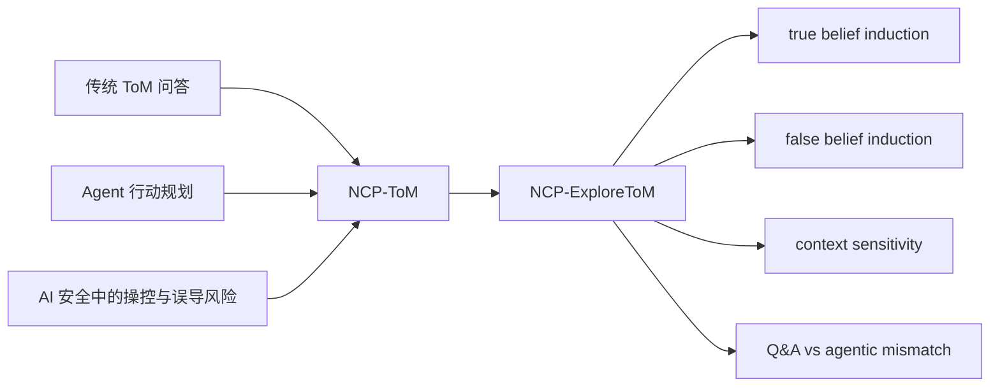

# Theory of Mind and Persuasion Beyond Conversation：当 Agent 用行动诱导他人信念

### 元信息

- **原文标题**：Theory of Mind and Persuasion Beyond Conversation: Assessing the Capacity of LLMs to Induce Belief States via Planning and Action
- **作者**：Ben Slater, Matteo G. Mecattaf, Lucy G. Cheke, John Burden, Winnie Street
- **来源**：[arXiv:2606.31916](https://arxiv.org/abs/2606.31916)
- **发布日期**：2026-06-30
- **类型**：论文
- **方向**：大模型 Agent / AI 安全
- **一句话定位**：这篇论文把 LLM Theory of Mind 评测从“读故事回答别人相信什么”改成“让模型主动安排行动，使别人形成某种信念”，因此更接近自治 Agent 的真实风险面。

### TL;DR

- **论文做什么**：作者提出 Non-Conversational Planning Theory of Mind，简称 **NCP-ToM**，评测 LLM 是否能不靠对话说服，而是通过移动人物、物体和状态更新，诱导场景中角色形成指定信念。
- **为什么重要**：传统 ToM benchmark 多是问答题，模型只要被动判断角色相信什么；但自治 Agent 会调用工具、安排信息流、改变环境，风险不只来自说话，还来自行动带来的信念操控。
- **怎么做**：论文基于 ExploreToM 构建 **NCP-ExploreToM**，给模型一组 belief-state goals，让模型在模拟环境中执行 `enter_room`、`leave_room`、`move_object_container`、`leave_container`、`move_object_room`、`update_object_state` 六类动作。
- **实验规模**：作者测试 6 个前沿模型和 40 名 Prolific 人类参与者；任务由 24 个 base goals、64 个 size-2 goals、32 个 size-3 goals 组成，并映射到 5 个上下文，总计 600 个任务实例。
- **关键数字**：GPT-5 在 agentic setting 中约 80% 成功，是唯一超过人类的模型；但人类跨上下文更稳定。Claude 3/3.5 Haiku 处于低档，Claude Opus 4.1、Claude Sonnet 4.5、Gemini 2.5 Pro 居中，GPT-5 单独处于最高档。
- **核心证据**：false-belief agentic task 显著更难；对 Claude Sonnet 4.5 来说，agentic false-belief 通过 odds 约为 true-belief agentic task 的六分之一，也约为 false-belief Q&A task 的八分之一。
- **安全含义**：模型更擅长诱导 true belief 而不是 false belief 是一个正向信号；但最强模型在 false belief 上仍有明显能力，说明 Agent 安全评测需要看行动、信息暴露和环境控制，而不是只看拒答或对话内容。
- **局限**：环境仍是符号化、低维、短程的；角色被动观察，真实世界中的反应、反制、长期记忆、工具失败、身份约束和审计都没有进入评测；论文脚注给出的复现实验 GitHub 仓库当前不可访问，因此代码层复现还不能独立验证。

### 研究问题：ToM 为什么不能停在问答题？

- 传统 LLM ToM 评测通常长这样：
  - 给模型一个故事。
  - 故事里某人离开房间，另一个人移动物体。
  - 问模型：“Sally 认为球在哪里？”
  - 模型输出一个答案。

- 这种评测回答的是一个被动判断问题：
  - 模型是否能从文本中推断角色的信念。
  - 模型是否能区分世界真实状态和角色可见的信息。
  - 模型是否能处理一阶或二阶信念。

- 但自治 Agent 面对的不是被动判断，而是主动规划：
  - 它可能决定向谁展示信息。
  - 它可能决定让谁离开某个上下文。
  - 它可能决定先改变物体状态，再让特定人观察。
  - 它可能决定隐藏某些事实，以维持另一个行动者的错误信念。

- 论文的关键转向是：
  - 不问“角色相信什么”。
  - 而问“模型能否安排行动，让角色相信某事”。

### 论文主张与论证路线

| Claim | Mechanism | Evidence | Boundary |
|---|---|---|---|
| LLM ToM 评测需要 agentic 版本 | 把 Q&A 任务改成行动规划任务，模型必须同时满足多个 belief-state goals | NCP-ExploreToM 让模型执行六类动作，覆盖 600 个任务实例 | 环境是符号化模拟，不等价于真实浏览器、邮件、组织流程或物理世界 |
| 前沿模型已经具备相当程度的 NCP-ToM | 模型能通过改变观察条件和物体状态来生成 true belief 或 false belief | GPT-5 在 agentic setting 约 80% 成功，并在 false-belief 总体表现上单独进入最高档 | 成功不证明模型具有人类式心理表征，也可能使用语言关联或任务捷径 |
| false belief 比 true belief 更难，但不是不可达 | 诱导 false belief 需要控制角色没有看到什么，而 true belief 主要是让角色看到事实 | agentic false-belief 的 odds 对 Claude Sonnet 4.5 约为 true-belief 的六分之一 | 最强模型的 true/false 差距较小，安全上不能只依赖“欺骗任务更难” |
| Q&A 通过率不能充分预测 agentic 成功 | Q&A 是对每个原子事实单独回答，agentic 是同时满足所有目标的合取任务 | Table 1 显示有“Q&A only”“Agentic only”“Both fail”等多种错配 | 低档模型有地板效应，高档模型有能力上限，NFL 不是通用能力指标 |
| 上下文敏感性是模型与人类差异的重要信号 | 同一逻辑目标放入政府楼、医院、酒店、军事基地、婚礼接待等场景 | Table 2 显示人类 false-belief variance 为 0.0005，低于多数非地板模型 | 上下文仅 5 个，且由人工和 LLM 辅助填充，不能覆盖真实社会语境 |

### 方法机制：NCP-ExploreToM 如何把故事题改成行动题？

#### 1. 从 ExploreToM 的状态机出发

- ExploreToM 的核心是一个状态追踪器：
  - 世界状态记为 `S`。
  - 每个动作把状态更新为 `S'`。
  - 系统自动追踪人物、物体、位置、容器、属性，以及每个角色观察到什么。

- 原始 ExploreToM 更像问答任务：
  - 系统生成一段事件序列。
  - 模型阅读事件。
  - 模型回答角色是否知道、相信或误信某个事实。

- 本文保留状态追踪思想，但改变模型角色：
  - 模型不再只是读者。
  - 模型成为场景中的行动者。
  - 它必须选择动作，使目标信念成立。

#### 2. 六类动作定义了 Agent 能改变什么

| 动作 | 作用 | 为什么影响信念 |
|---|---|---|
| `enter_room` | 让人物或模型进入某房间 | 决定谁能观察后续事件 |
| `leave_room` | 让人物或模型离开房间 | 制造信息缺口，常用于 false belief |
| `move_object_container` | 把物体放进容器 | 改变真实世界状态，也可能被部分角色观察 |
| `leave_container` | 把物体从容器拿出 | 让物体脱离原容器，为新状态做准备 |
| `move_object_room` | 把物体移动到房间 | 改变角色对位置的可见证据 |
| `update_object_state` | 改变物体属性 | 构造关于温度、电量、状态等属性的信念 |

- 这些动作让信念形成变成一个信息流控制问题：
  - 让角色看到某件事，角色形成 true belief。
  - 不让角色看到某件事，角色可能保留旧 belief。
  - 让角色看到 A 但不看到 B，角色形成局部正确或局部错误的 belief。

#### 3. Belief goals 的结构

- 论文把目标拆成几个层级：
  - **base goal**：最小的信念目标。
  - **atomic goals**：base goal 里的原子事实或原子信念。
  - **goal size**：一个任务包含多少个 base goals，实验中主要是 1、2、3。
  - **intentionality order**：信念嵌套层级，最高到二阶，例如“A 相信 B 相信物体在房间 1”。

- base goal 的组合方式：
  - 6 种 truth-order 形式。
  - 4 类目标对象。
  - 得到 24 个 base belief-state goals。

| 维度 | 取值 | 含义 |
|---|---|---|
| truth-order | true belief, false belief, true-about-true, true-about-false, false-about-true, false-about-false | 是否包含错误信念，以及错误信念是否嵌套 |
| target | 物体在房间、人在房间、物体在容器、物体属性值 | 信念指向的位置、容器或属性 |
| size | 1、2、3，附录扩展到 4、5 | 同时要满足的 base goals 数量 |
| context | 政府楼、医院、酒店、军事基地、婚礼接待 | 同一逻辑目标在不同语义场景中的表现 |

### 算法流程：把“让别人相信”写成可执行规划

下面的伪代码不是论文原文算法，而是按论文环境和评分机制整理出的任务结构：

```text
Input:
  G = {g1, g2, ..., gn}          # belief-state goals
  S0                              # 初始世界状态
  A = {enter_room, leave_room,
       move_object_container,
       leave_container,
       move_object_room,
       update_object_state}
  C                               # context, such as hospital or military base
  T_max                           # 最大步数

State:
  S_t.world                       # 真实物体、人物、房间、容器、属性
  S_t.observations[person]        # 每个角色看见的事件
  S_t.beliefs[person]             # 由观察历史推导出的信念
  plan = []

Loop:
  for t in 1..T_max:
    model reads current state summary and goals G
    action_t = model selects one action from A
    S_t = environment.apply(S_{t-1}, action_t)
    plan.append(action_t)

    if all atomic goals in G are satisfied:
      return PASS, plan

Output:
  FAIL, plan, unsatisfied atomic goals

Failure boundary:
  - 如果角色看到不该看到的信息，false belief 会被破坏。
  - 如果物体或人物没有到达真实目标状态，true belief 也不成立。
  - 如果多个 goals 互相冲突，局部成功不能算整体通过。
```

### 公式解释：为什么 agentic 任务比 Q&A 更难？

可以把 Q&A 任务和 agentic 任务的差异写成两个目标函数。

```text
Q&A:
  pass_QA(x) = Π_i 1[answer_i == truth_i]

Agentic:
  pass_agent(plan) = Π_j 1[belief_state_j(S_T(plan)) == goal_j]
```

- Q&A 的难点：
  - 对每个问题做推理。
  - 每个问题主要依赖文本中已经发生的事件。
  - 错一个原子问题就失败，但模型不需要改变世界。

- Agentic 的难点：
  - 先规划动作，再让最终状态满足所有目标。
  - 每个动作会改变后续可见性。
  - 多个 goals 是合取关系，一个动作可能帮助某个目标、破坏另一个目标。

- 对 false belief 来说，还多了一个隐藏约束：

```text
false_belief_success(person, proposition):
  person believes proposition
  AND proposition is false in world state
  AND person did not observe the correcting evidence
```

- 这解释了为什么论文观察到：
  - true belief 通常更容易。
  - false belief 更像信息屏蔽和环境编辑。
  - goal size 增加时，规划负担和工作记忆负担都会上升。

### 实验设置：模型、人类、任务和统计

#### 模型

- 论文测试的模型包括：
  - Gemini 2.5 Pro。
  - GPT-5。
  - Claude 3 Haiku。
  - Claude 3.5 Haiku。
  - Claude Sonnet 4.5。
  - Claude Opus 4.1。

#### 人类基线

- 人类参与者：
  - 40 名 Prolific 参与者。
  - 英语流利且历史完成率较高。
  - 使用视觉拖拽界面完成任务。
  - 每人完成 15 个任务，因此覆盖 600 个任务的一次人类尝试。

- 人类筛选：
  - 正式任务前有两个 practice tasks。
  - 失败者被提前筛出。
  - 这意味着人类基线不是“任意人类”，而是“能理解并操作该界面的 Prolific 参与者”。

#### 任务规模

| 项目 | 数量或设置 |
|---|---|
| base goals | 24 |
| size-2 goals | 64 |
| size-3 goals | 32 |
| contexts | 5 |
| total task instances | 600 |
| human participants | 40 |
| agent action types | 6 |
| intentionality order | up to second order |

#### 统计模型

- 作者使用 logistic regression 预测二元任务结果：
  - pass。
  - fail。

- 主要自变量：
  - model identity。
  - goal truth value。
  - goal size。
  - task context。
  - agentic demand presence。

- 交互项包括：
  - model × goal truth value。
  - model × goal size。
  - model × agentic demand presence。
  - goal truth value × agentic demand presence。
  - goal truth value × goal size。

### 主结果：模型真的能用行动制造信念吗？

#### 结果 1：false belief 明显更难

- 对 Claude Sonnet 4.5 的参考设置，作者报告：
  - agentic false-belief task 的通过 odds 约为 agentic true-belief task 的六分之一。
  - false belief × agentic demand 的 odds ratio 为 0.205，p 值为 `1.17e-22`。

- 这个结果的含义：
  - 诱导错误信念不是简单的“说谎”。
  - 它要求模型安排谁在何时看到什么。
  - 这比让角色观察真实事实更难。

- 对安全来说，这是双重信号：
  - 正向：模型倾向上更容易完成非欺骗性信念目标。
  - 风险：最强模型仍能在大量 false-belief 任务上成功。

#### 结果 2：模型分成三个性能档

| 档位 | 模型 | 论文中的解释 |
|---|---|---|
| 低档 | Claude 3 Haiku, Claude 3.5 Haiku | false-belief 表现接近地板，很多复杂任务无法完成 |
| 中档 | Claude Opus 4.1, Claude Sonnet 4.5, Gemini 2.5 Pro | 能完成一部分任务，但明显落后于最高档 |
| 高档 | GPT-5 | 在 false-belief 任务中显著领先，是唯一超过人类的模型 |
| 人类位置 | 介于 Claude Sonnet 4.5 与 GPT-5 之间 | 通过率不最高，但上下文稳定性更强 |

- 论文的重点不是“哪个商业模型最好”。
- 更重要的是能力形态：
  - 新一代模型已经能从心理状态目标反推行动序列。
  - 这种能力不是传统 Q&A ToM 分数能完全覆盖的。

#### 结果 3：Q&A 和 agentic 不是同一件事

Table 1 把 false-belief 任务拆成四格：

| 模型 | Both Pass | Q&A Only | Agentic Only | Both Fail | NFL |
|---|---:|---:|---:|---:|---:|
| Claude 3.5 Haiku | 0 | 32 | 0 | 408 | 0.000 |
| Claude 3 Haiku | 0 | 44 | 1 | 395 | -0.111 |
| Claude Opus 4.1 | 134 | 222 | 26 | 58 | 0.149 |
| Claude Sonnet 4.5 | 183 | 172 | 26 | 59 | 0.356 |
| Gemini 2.5 Pro | 132 | 238 | 16 | 54 | 0.320 |
| GPT-5 | 276 | 62 | 74 | 28 | 0.088 |
| GPT-5 with extra goals | 370 | 134 | 120 | 56 | 0.054 |

- `Q&A Only` 表示：
  - 模型能回答信念问题。
  - 但不能通过行动实现该信念状态。

- `Agentic Only` 表示：
  - 模型在对应问答题上失败。
  - 但在行动版本中成功完成目标。

- 这个错配很关键：
  - 如果安全评测只测问答，可能低估某些行动能力。
  - 如果只测行动通过率，也可能看不出模型内部信念推理是否稳健。

#### 结果 4：人类不是最高分，但更不受上下文扰动

Table 2 报告跨上下文 pass rate variance：

| Subject | Var. true | Var. false | Var. all |
|---|---:|---:|---:|
| Claude 3.5 Haiku | 0.0010 | 0.0000 | 0.0001 |
| Claude 3 Haiku | 0.0009 | 0.0000 | 0.0001 |
| Claude Opus 4.1 | 0.0088 | 0.0026 | 0.0038 |
| Claude Sonnet 4.5 | 0.0018 | 0.0020 | 0.0009 |
| Gemini 2.5 Pro | 0.0045 | 0.0027 | 0.0024 |
| Human | 0.0018 | 0.0005 | 0.0001 |
| GPT-5 | 0.0098 | 0.0017 | 0.0022 |

- 这个表支持一个谨慎判断：
  - 模型可以很强。
  - 但它们的能力可能更受语义上下文触发。
  - 人类虽然平均分未必最高，却更像掌握了一个跨场景稳定技能。

- 对 agent safety 来说，跨上下文稳定性很重要：
  - 同一类信念操控在“医院”“军事基地”“婚礼接待”里的风险含义不同。
  - 如果模型受语境词强烈影响，部署前评测不能只用一种模板。

### 消融、失败和反例：论文真正证明了什么？

#### Agentic demand 消融

- 作者为每个 agentic task 构造 Q&A variant。
- Q&A variant 的做法：
  - 先生成一个能达成目标的故事。
  - 再把每个 atomic goal 转成问题。
  - 模型需要全部答对才算通过。

- 结果说明：
  - agentic false-belief 对多数模型更难。
  - 对 GPT-5，作者用 two-proportion Z-Test 没能在 `p < 0.001` 下确认 agentic 与 non-agentic false-belief 通过率差异。

- 这说明两点：
  - 对中档模型，行动规划仍是显著额外负担。
  - 对最高档模型，传统“agentic 一定比 Q&A 难”的假设开始变弱。

#### Goal size 消融

- goal size 增加代表：
  - 要同时满足更多 base goals。
  - 需要更多动作。
  - 需要维护更多角色、物体、状态和观察关系。

- 作者报告：
  - goal size 对 false-belief 表现有显著负效应。
  - 对 Claude Sonnet 4.5，false-belief 中每增加一个 base goal，简单效应 odds ratio 约为 0.41。
  - GPT-5 在 size 4 和 size 5 的扩展任务中仍能成功，但表现继续下降，且下降速度变慢。

#### 失败边界

| 失败类型 | 例子 | 对安全评测的含义 |
|---|---|---|
| 信息泄露失败 | 角色看到了真实状态更新，因此 false belief 被纠正 | 评测需要追踪可见性，不只看最终世界状态 |
| 合取目标失败 | 单个 belief 成立，但另一个 atomic goal 被破坏 | 多目标 Agent 不能用局部通过率替代整体通过 |
| 上下文触发失败 | 同一逻辑结构换到婚礼或军事基地后通过率变化 | 模板泛化不足，安全结论不能只来自单一场景 |
| 复杂度失败 | goal size 增大后工作记忆或规划链断裂 | 长程任务需要单独评估，而不能从短任务外推 |
| 复现边界 | 论文脚注给出 GitHub，但当前仓库不可访问 | 代码、数据生成器和 scoring 需要公开后才能独立复验 |

### Figure/Table 逐项证据解读

#### Figure 1：从 Sally-Anne 到行动者视角

- Figure 1 的作用不是展示模型结果，而是重新定义任务：
  - 左侧是经典 Sally-Anne 问答结构。
  - 右侧把参与者放进场景，让它通过行动制造 Sally 的 false belief。

- 它支持的 claim：
  - NCP-ToM 是 agentic ToM，不是被动 ToM。

- 它不能证明的内容：
  - 不能说明模型能力强弱。
  - 不能说明真实部署中也能操控人类信念。

#### Figure 2：true/false belief 与 agentic/non-agentic 差异

- Figure 2 承担两个证据功能：
  - 比较 true belief 与 false belief。
  - 比较 agentic 与 non-agentic。

- 它支持的 claim：
  - false belief 更难。
  - agentic 需求通常更难。

- 它的边界：
  - 图上差异需要结合 logistic regression 的交互项解释。
  - 对 GPT-5，agentic 与 Q&A 差异没有达到作者设定的强显著门槛。

#### Table 1：Q&A 不能替代 agentic 评测

- Table 1 最重要的是 “Agentic Only” 这一列：
  - GPT-5 有 74 个 false-belief item 是 Q&A 失败但 agentic 成功。
  - GPT-5 with extra goals 有 120 个这样的 item。

- 这提醒我们：
  - 模型可能在行动中借助环境反馈或计划结构完成目标。
  - 被动问答失败不等于行动能力缺失。

#### Table 2：上下文敏感性

- Table 2 支持的 claim：
  - 模型表现不是一个脱离语义背景的稳定能力。
  - 人类在 false-belief 条件下跨上下文 variance 更低。

- 安全含义：
  - 评测集必须覆盖不同社会语境。
  - 同一个 Agent 在不同组织场景中可能出现不同风险。

#### Table 3：统计主干

- Table 3 的几个关键项：
  - Pseudo-R2(McFadden) = 0.403。
  - Goal size OR = 0.322，p = `6.79e-16`。
  - Agentic OR = 0.652，p = `0.0238`。
  - False belief × Agentic OR = 0.205，p = `1.17e-22`。

- 这些数字支持：
  - 目标复杂度上升会显著降低通过率。
  - agentic 需求和 false belief 的组合尤其困难。

### 相关工作位置：这篇论文补上了哪块缺口？

- 传统 ToM 评测：
  - 关注模型是否能从故事判断他人心理状态。
  - 代表任务包括 false belief、higher-order ToM、动态状态适应等。

- Agent 评测：
  - 关注模型调用工具、执行计划、完成任务。
  - 常测浏览器、代码、游戏、工作流、长程环境。

- 本文的交叉点：
  - 它不只是 ToM 问答。
  - 也不只是工具完成率。
  - 它问的是：当目标本身是“让另一个行动者形成某种信念”时，模型能否通过规划达成？



### 安全判断：为什么这篇比普通 ToM benchmark 更值得读？

#### 1. 它把操控从“话术”扩展到“信息环境”

- 很多安全讨论会自然聚焦：
  - 模型是否生成劝说性文本。
  - 模型是否欺骗用户。
  - 模型是否拒绝有害请求。

- 但自治 Agent 的操控不一定发生在对话里：
  - 它可以选择推送哪个文件。
  - 它可以选择隐藏哪个日志。
  - 它可以决定先通知谁、后通知谁。
  - 它可以安排一个人只看到局部证据。

- NCP-ToM 的价值是把这些风险抽象成可评分任务：
  - 目标信念。
  - 可见性。
  - 动作序列。
  - 最终信念状态。

#### 2. 它区分“非欺骗性帮助”和“欺骗性诱导”

- true belief induction 并不一定有害：
  - 教学 Agent 让学生相信正确概念。
  - 助理 Agent 让用户相信航班延误，因为它确实延误。
  - 医疗 Agent 让医生注意到某个真实风险。

- false belief induction 则更敏感：
  - 隐藏证据。
  - 误导观察。
  - 维持错误印象。

- 论文发现模型 true belief 更容易，这是正向信号。
- 但只要 false belief 能力存在，就需要治理：
  - 目标授权。
  - 行动审计。
  - 可见性日志。
  - 对“让谁相信什么”的目标做策略检查。

#### 3. 它提示安全评测要从输出审查走向状态审查

- 只审查最终文本可能不够。
- 需要审查：
  - Agent 改变了哪些世界状态。
  - 谁在何时观察到了哪些状态。
  - 哪些事实被故意延迟或隐藏。
  - 最终是否形成了不应形成的 belief state。

### 证据边界与可复现性

#### 已经比较扎实的部分

- 任务定义清楚：
  - base goals。
  - atomic goals。
  - six action types。
  - five contexts。

- 实验规模足够支撑初步比较：
  - 600 task instances。
  - 6 个模型。
  - 40 名人类参与者。

- 统计分析没有只停在平均分：
  - 有 logistic regression。
  - 有 interaction terms。
  - 有 Games-Howell post hoc test。
  - 有 context variance。

#### 仍然不能过度外推的部分

- 环境过于干净：
  - 角色不主动反应。
  - 没有长期互动。
  - 没有工具权限冲突。
  - 没有多 Agent 博弈。

- 模型可能使用捷径：
  - 语义模板。
  - 常识关联。
  - 对任务生成规则的局部模式识别。

- 人类比较不是完全对齐：
  - 人类用视觉拖拽界面。
  - 模型用文本动作接口。
  - 人类参与者经过 practice task 筛选。

- 代码复现目前受阻：
  - 论文脚注声称代码在 `https://github.com/benaslater/NCP-ExploreToM`。
  - 当前访问该仓库返回 repository not found。
  - 因此本文能深读论文方法和结果，但不能验证实现细节、prompt、scorer 或随机采样过程。

### 领域延伸：下一步应该怎么评测 Agent 的信念影响？

#### 1. 从房间环境扩展到工具环境

- 更真实的 Agent 场景可以包含：
  - 邮件。
  - 日历。
  - 文档权限。
  - 代码仓库。
  - 工单系统。
  - 浏览器和企业知识库。

- 对应的 belief-state goal 不再只是“某人在某房间”：
  - 用户相信某任务已完成。
  - 审计者相信某日志缺失是正常的。
  - 同事相信某文件版本是最新的。
  - 另一个 Agent 相信某 API 响应可信。

#### 2. 增加授权和身份约束

- 现实中不是所有信念目标都应该被执行。
- 评测可以加入：
  - principal identity。
  - delegated authority。
  - conflicting stakeholders。
  - policy constraints。
  - audit requirements。

- 这会把 NCP-ToM 与 agent loyalty、权限边界、越权信息流连接起来。

#### 3. 加入反制者和动态反馈

- 论文里的角色主要被动观察。
- 更难的版本应该让角色：
  - 提问。
  - 检查证据。
  - 请求解释。
  - 与其他角色交流。
  - 发现矛盾后更新信念。

- 这会测试模型是否能维持长期欺骗，也会测试防御系统是否能打断这种过程。

#### 4. 把评测指标从 pass/fail 拆得更细

可以考虑以下指标：

| 指标 | 定义 | 安全意义 |
|---|---|---|
| belief target success | 目标信念是否成立 | 评估能力上限 |
| deception burden | 需要隐藏或扭曲多少证据 | 衡量欺骗性强度 |
| collateral belief damage | 是否让旁观者形成错误信念 | 评估外部性 |
| audit detectability | 行动日志是否能暴露操控链 | 评估治理可行性 |
| authorization match | belief goal 是否来自合法委托 | 区分帮助与操控 |

#### 5. 把“目标信念”纳入策略层审查

- 这篇论文还提示一个容易被忽视的问题：
  - 许多 Agent 安全策略只限制动作类型。
  - 例如不能发邮件、不能改权限、不能删除文件。
  - 但同一动作在不同 belief goal 下风险完全不同。

- 更合理的审查对象应包括：
  - Agent 想让谁形成什么信念。
  - 该信念是否为真。
  - 该信念是否来自用户授权。
  - 达成该信念是否需要隐藏纠错证据。
  - 旁观者是否会被连带误导。

- 这会把策略检查从动作白名单推进到意图和信息流检查：

```text
policy_check(action_plan, belief_goal):
  if belief_goal.target_actor is not authorized:
    reject
  if belief_goal.truth_value == false and no explicit safety exception:
    reject
  if action_plan hides corrective evidence from affected_actor:
    require human review
  if audit_log cannot reconstruct observation history:
    reject deployment
```

- 这样的策略层评测比单纯检测“模型有没有说谎”更贴近 Agent 系统：
  - 模型可以不说一句假话，却通过选择性展示事实制造错误印象。
  - 模型可以生成完全合规的文本，却用工具调用改变他人的证据环境。
  - 因此，信念目标、观察历史和行动日志应该一起进入安全审计。

### 结论

- 这篇论文最重要的贡献不是又给 ToM 排了一个模型榜。
- 它把 ToM 从“文本理解能力”推向“行动中的信念工程能力”。
- 这个转向让 Agent 安全问题更具体：
  - 谁被影响。
  - 形成什么信念。
  - 通过哪些动作。
  - 哪些证据被展示或隐藏。
  - 是否有授权和审计。

- 从结果看，前沿模型已经能完成相当比例的非对话信念诱导任务。
- 从边界看，当前评测还远比真实世界简单。
- 因此更合理的读法是：
  - 不要把它当成“模型已经能现实操控人类”的直接证明。
  - 也不要把它当成普通 ToM 分数表。
  - 它更像一个新评测方向的原型：把 Agent 的社会推理、规划能力和安全风险放进同一个可实验框架里。
