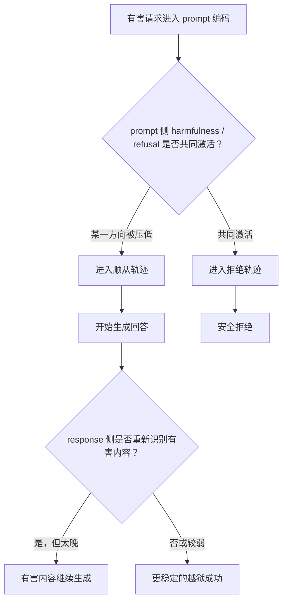

# HARC：把“识别有害”和“拒绝执行”重新绑在一起的安全对齐方法

原文：<https://arxiv.org/abs/2607.00572>  
代码与模型：<https://github.com/microsoft/HARC>、<https://huggingface.co/microsoft/HARC>  
论文版本：arXiv:2607.00572v1，2026-07-01 提交  
作者：Shei Pern Chua、Fangzhao Wu  
类别：AI 安全 / 大模型安全对齐

## TL;DR

- **这篇论文要解决的问题**：对齐后的大模型通常知道有害请求应该拒绝，但越狱提示会让模型在生成前的 prompt 编码阶段丢掉“拒绝”或“有害识别”信号，导致模型进入顺从轨迹。
- **核心发现**：作者把 residual stream 中的安全表征拆成四个方向：prompt 侧有害方向、prompt 侧拒绝方向、response 侧有害方向、response 侧拒绝方向。成功越狱不是简单“让模型不知道危险”，而是让这些方向在关键位置脱钩。
- **关键机制**：DAN、PAIR、CodeAttack 三类攻击在 harmfulness-refusal 平面中落在不同区域；DAN 更像压低拒绝方向，PAIR 更像压低有害识别方向，CodeAttack 会同时削弱两者。
- **方法 HARC**：用 LoRA fine-tuning 在选定层上加入 harmfulness-and-refusal coupling loss，让有害方向与拒绝方向在 prompt token 和 response token 两侧都共同激活，同时用 KL 保持模型在良性输入上的能力。
- **实验范围**：主实验用 Llama-3.1-8B-Instruct 与 Qwen2.5-7B-Instruct；扩展验证覆盖 Llama-3.1-70B、Qwen2.5-72B，以及 Mistral、Phi、Gemma 等模型家族中的方向结构迁移。
- **关键数字**：大模型扩展表中，Llama-3.1-70B 的平均攻击成功率从 0.618 降到 0.064；Qwen2.5-72B 从 0.523 降到 0.148。一般能力均值基本保持在 0.79 附近。
- **边界**：HARC 主要针对黑盒 prompt-space jailbreak，不声称解决权重篡改、恶意微调、系统提示泄露或工具执行层面的安全问题；CodeAttack 仍是残余最强的攻击类型。

## 1. 研究问题：为什么“知道危险”仍然会生成危险内容？

### 这篇论文真正问的不是“模型能不能拒绝”

论文的出发点可以拆成三个层次：

| 层次 | 常见说法 | HARC 追问 |
|---|---|---|
| 行为层 | 安全模型应该拒绝有害请求 | 拒绝失败前，内部哪个安全信号被压掉了？ |
| 表征层 | 有害与拒绝可能是可线性读出的方向 | 这些方向在 prompt 和 response 位置是否一样？ |
| 干预层 | fine-tuning 可以提升安全性 | 能否只改安全子空间，而少伤害通用能力？ |

作者的关键判断是：**越狱并不总是让模型完全“看不见”有害性**。有时模型在生成阶段已经重新识别到内容有害，却来不及把这个识别转成拒绝动作。

这会改变我们理解安全对齐的方式：

- 如果只看最终回答，容易把失败归因于“模型不知道规则”。
- 如果只看 prompt 侧拒绝方向，容易误判为“生成时已经没有安全信号”。
- 如果同时看 response 侧方向，就会看到更细的失败模式：模型可能在继续写有害内容时已经恢复了有害识别。

### 威胁模型被限定得很清楚

作者处理的是黑盒 prompt-space 攻击：

- 攻击者只能通过提示词、多轮对话、改写、混淆等方式诱导模型。
- 攻击者不能改模型权重。
- 攻击者不能改系统提示。
- 攻击者不能污染安全训练数据。
- 目标是让模型输出违反安全政策的内容。

这个边界很重要，因为 HARC 的证据强项是**表征级 prompt jailbreak 鲁棒性**，不是完整 Agent 沙箱、工具权限、数据外泄防护或部署治理。

## 2. 背景：harmfulness 和 refusal 为什么可以分开看？

### 两个概念不是一回事

论文沿用并扩展了之前关于 residual stream 线性方向的做法。直观地说：

| 概念 | 含义 | 位置直觉 | 如果被压低会发生什么 |
|---|---|---|---|
| harmfulness direction | 模型是否识别到输入或输出内容有害 | 更接近“危险识别” | 有害请求可能被当成普通请求 |
| refusal direction | 模型是否进入拒绝行为轨迹 | 更接近“动作意图” | 模型知道危险但仍继续回答 |

作者使用 difference-of-means 提取方向。可以把方向看成两组激活均值的差：

```text
d_l,t = mean(h_l,t(x_positive)) - mean(h_l,t(x_negative))

其中：
- l 是 transformer 层；
- t 是 token 位置；
- h_l,t 是 residual-stream activation；
- positive / negative 是用于对比的样本组；
- 对 harmfulness，positive 可理解为有害样本，negative 为良性样本；
- 对 refusal，positive 可理解为拒绝轨迹，negative 为顺从轨迹。
```

这类方向不是完整机制解释，但它提供了一个可测量的投影坐标系。HARC 的贡献在于把坐标系从 prompt 侧扩展到 response 侧，并把这四个方向用于训练。

### 四个方向构成论文的主坐标系

论文把安全表征写成四个方向：

| 符号化称呼 | 位置 | 语义 | 作用 |
|---|---|---|---|
| `h_prompt` | 最后 instruction token | prompt 侧有害识别 | 判断输入请求是否危险 |
| `r_prompt` | post-instruction template token | prompt 侧拒绝倾向 | 决定是否进入拒绝轨迹 |
| `h_resp` | response 前 32 token 均值 | response 侧有害识别 | 判断正在生成的内容是否危险 |
| `r_resp` | response 前 32 token 均值 | response 侧拒绝倾向 | 观察生成阶段是否恢复拒绝信号 |

论文最重要的观察是：中间层这些方向比较纠缠，到了后层 harmfulness 与 refusal 会明显分离；但是同一概念跨位置仍然相对对齐。

这意味着：

- “有害识别”和“拒绝执行”在 late layers 可以近似作为不同轴来分析。
- 攻击不需要同时破坏所有安全概念，只要在关键阶段压掉其中一根轴就可能成功。
- 只在 prompt 侧做安全检测或激活干预，可能漏掉 response 侧才出现的有害信号。

## 3. 越狱攻击如何利用这种脱钩？

### 三类攻击对应三种投影签名

作者用 DAN、PAIR、CodeAttack 代表三类机制：

| 攻击 | 机制类别 | prompt 侧表现 | response 侧表现 | 解释 |
|---|---|---|---|---|
| DAN | persona framing | harmfulness 仍在，refusal 被压低 | 有害与拒绝信号恢复较强 | 模型看见危险，但拒绝意图没及时触发 |
| PAIR | semantic rewriting / iterative red-team | refusal 可被激活，harmfulness 被压低 | 生成时重新出现有害信号 | 改写让输入看起来不像危险请求 |
| CodeAttack | code obfuscation | harmfulness 与 refusal 都被削弱 | 从良性簇分离，但激活较弱 | 混淆让两类安全轴都不够强 |

这个分析比“攻击成功率”更有解释力，因为它说明不同越狱方法不是同一种失败。

### 核心失败链条

可以把 HARC 对越狱的解释画成一个小流程：



这里的关键不是“response 侧有害信号完全没用”，而是**它出现得太晚**。一旦模型在 prompt 侧已经进入顺从轨迹，生成阶段恢复的拒绝方向未必能扭转自回归生成的路径依赖。

### 为什么这对 Agent 安全也有意义？

HARC 本身是聊天模型安全对齐论文，但它对 Agent 系统有直接启发：

- Agent 的危险动作往往不是第一步就暴露，而是在计划、工具调用、代码生成中逐渐显形。
- 如果安全机制只审 prompt 或第一轮 planning，很可能漏掉后续 action token 中才出现的危险信号。
- 对工具型 Agent，response-side safety signal 可以类比为“动作生成时的运行期风险识别”。
- 但 HARC 没有处理工具权限、事务回滚、审计日志和外部执行器，所以只能提供表征层线索，不能替代系统层防护。

## 4. HARC 方法：把两个方向用 loss 绑起来

### 方法目标

HARC 的目标不是训练模型记住更多拒绝模板，而是让内部几何满足一个约束：

```text
如果 harmfulness 被激活，则 refusal 也应被激活；
如果 refusal 被触发，则 harmfulness 不应与它脱钩；
这个约束既要在 prompt 位置成立，也要在 response 位置成立。
```

作者把这个目标实现为 LoRA fine-tuning：

- 不直接改全部权重。
- 方向向量在每一步中 detach，不让梯度改变方向定义本身。
- 梯度只进入 LoRA 参数。
- 用 KL term 约束模型在 benign prompts 上不要漂移太远。

### Loss 结构

论文的总损失可以概括为：

```text
L_total =
  λ_prompt * L_couple_prompt
+ λ_resp   * L_couple_response
+ λ_kl     * L_KL_benign
+ λ_ce     * L_refusal_CE
```

变量解释：

| 项 | 作用 | 直觉 |
|---|---|---|
| `L_couple_prompt` | 在 prompt 侧绑定有害与拒绝方向 | 防止攻击在输入编码阶段切断拒绝 |
| `L_couple_response` | 在 response 侧绑定有害与拒绝方向 | 捕捉生成过程中才暴露的有害性 |
| `L_KL_benign` | 保持良性输入分布接近 base model | 避免能力税和过拒绝 |
| `L_refusal_CE` | 用显式拒绝文本监督有害输入 | 给模型清晰拒绝行为锚点 |

coupling loss 使用 additive margin hinge。用中文解释就是：

- 对有害样本，模型在 harmfulness 和 refusal 方向上的 cosine projection 都应该超过 margin。
- 对良性样本，两者都不应异常激活。
- 如果其中一个方向低于目标 margin，就产生惩罚。
- prompt 位置和 response 位置各算一次。

### 层选择不是手工拍脑袋

HARC 只在方向结构最清楚的层上加约束。作者设计了一个层选择分数：

```text
Score(layer) =
  prompt-side decoupling
+ response-side decoupling
+ same-concept alignment for harmfulness
+ same-concept alignment for refusal
```

这个分数偏好这样的层：

- harmfulness 和 refusal 在同一位置要足够分开，说明两个概念可区分。
- prompt 与 response 的同一概念要足够对齐，说明跨位置仍然可比。
- 层要处在结构稳定的深度范围，而不是所有层一刀切。

训练早期只使用较少层，随后把选层数量从 2 增到 4。这是一个保守设计：先让 LoRA 建立初始对齐，再扩大约束范围。

### 伪代码

```text
Input:
  base model M
  harmful prompts H
  harmless prompts B
  refusal targets R
  extracted directions h_prompt, r_prompt, h_resp, r_resp
  selected layers S

State:
  LoRA parameters θ
  direction bank D updated periodically

Loop over training batches:
  1. Run M+LoRA on harmful and harmless prompts.
  2. Read residual activations at prompt positions.
  3. Generate or inspect first response tokens for response-side activations.
  4. Project activations onto h_prompt, r_prompt, h_resp, r_resp.
  5. Compute hinge coupling losses:
       harmful samples: push harmfulness and refusal above margin
       harmless samples: keep both below unsafe activation threshold
  6. Compute KL on benign prompts against frozen base model.
  7. Compute CE toward refusal continuation on harmful prompts.
  8. Update only LoRA parameters θ.
  9. Periodically recompute directions with EMA-style smoothing.

Output:
  HARC LoRA adapter or merged HARC model

Failure boundary:
  If an attack hides harmfulness across both prompt and response positions,
  or if the risk appears only through external tools after generation,
  this training objective may not fire.
```

## 5. 实验设置：安全、能力、过拒绝三条线同时看

### 模型与数据

论文主实验使用：

| 用途 | 选择 |
|---|---|
| 主模型 | Llama-3.1-8B-Instruct、Qwen2.5-7B-Instruct |
| 扩展模型 | Llama-3.1-70B-Instruct、Qwen2.5-72B-Instruct |
| 方向提取 | AdvBench 300 harmful prompts + UltraChat 300 harmless prompts |
| 训练数据 | Circuit Breakers training set 的 harmful prompts 与 refusal continuations；UltraChat 作 KL retention |
| DPO baseline | PKU-SafeRLHF 中 3000 对安全/不安全偏好对 |
| judge | GPT-4o 作为 LLM-as-a-judge |

这个设置的优点是对比面比较广：它不是只和普通 SFT 比，而是覆盖了训练时方法、偏好优化、representation intervention 和 inference-time steering。

### 评估指标

| 指标组 | benchmark / attack | 指标方向 |
|---|---|---|
| Harmfulness | PAIR、PAP、DeepInception、CodeAttack | ASR 越低越好 |
| Over-refusal | XSTest、CoCoNot | 越低越好，代表少误拒 |
| General capability | MMLU、GSM8K、HumanEval、IFEval、MT-Bench | 越高越好 |

作者强调的 trade-off 是三者同时成立：

- 安全性提升：攻击成功率下降。
- 能力保持：一般 benchmark 不明显掉。
- 可用性保持：不把良性请求大量误拒。

### Baseline 覆盖

论文比较的 baseline 包括：

| baseline | 类型 | 对比意义 |
|---|---|---|
| Vanilla SFT | 普通监督拒绝训练 | 检验“多训拒绝模板”是否足够 |
| DPO | preference optimization | 检验偏好优化是否提升鲁棒性 |
| Ours + DPO | 组合方法 | 看 HARC 是否能作为前置 safety adapter |
| Circuit Breakers | representation-level training | 直接对比近邻方法 |
| RepBend | representation bending | 对比残差空间干预 |
| CAST | inference-time steering | 对比无需训练的运行时方法 |

这个对照设计使 HARC 的论点更集中：它不是单纯“又一个安全微调”，而是把机制发现转成有方向约束的微调目标。

## 6. 主结果：最值得带走的证据

### 大模型扩展结果很清楚

论文附录表给出了 70B/72B 的完整结果，最直观的数字如下：

| 模型 | 方法 | PAIR | PAP | DeepInception | CodeAttack | ASR Mean | General Mean |
|---|---:|---:|---:|---:|---:|---:|---:|
| Llama-3.1-70B | Baseline | 0.785 | 0.788 | 0.213 | 0.688 | 0.618 | 0.793 |
| Llama-3.1-70B | HARC | 0.008 | 0.005 | 0.000 | 0.242 | 0.064 | 0.795 |
| Qwen2.5-72B | Baseline | 0.605 | 0.647 | 0.208 | 0.632 | 0.523 | 0.798 |
| Qwen2.5-72B | HARC | 0.047 | 0.095 | 0.013 | 0.438 | 0.148 | 0.785 |

这里有两个信号：

- HARC 对 PAIR、PAP、DeepInception 的压制非常强，尤其 Llama-70B 上接近归零。
- CodeAttack 仍然是主要残余风险，说明代码混淆类攻击更难靠 prompt/response 安全方向完全捕获。

### 能力保持不是口头承诺

General Mean 在大模型上没有明显崩：

| 模型 | baseline general mean | HARC general mean | 变化 |
|---|---:|---:|---:|
| Llama-3.1-70B | 0.793 | 0.795 | 基本持平 |
| Qwen2.5-72B | 0.798 | 0.785 | 小幅下降 |

这支持作者的关键假设：如果只在 harmfulness-refusal 子空间上施加约束，能力税会小于更宽泛的安全微调。

但这不等于完全没有代价：

- Qwen2.5-72B 在 HumanEval、IFEval、MTBench 等项上有不同程度波动。
- benchmark 均值不能覆盖所有真实任务。
- 对话风格、长上下文、多轮工具调用没有被完整验证。

### 过拒绝结果需要谨慎读

过拒绝指标没有被 HARC 大幅推高，但也不是所有模型都更好：

| 模型 | 方法 | XSTest | CoCoNot |
|---|---:|---:|---:|
| Llama-3.1-70B | Baseline | 0.048 | 0.020 |
| Llama-3.1-70B | HARC | 0.065 | 0.074 |
| Qwen2.5-72B | Baseline | 0.004 | 0.027 |
| Qwen2.5-72B | HARC | 0.035 | 0.148 |

这说明 HARC 的“不过度拒绝”应理解为**相对可控**，不是“完全不增加误拒”。尤其在 Qwen2.5-72B 的 CoCoNot 上，过拒绝上升需要被单独解释。

研究者视角下，后续应该追问：

- 过拒绝增加来自 response-side coupling 还是 refusal CE？
- 不同 benign domain 的误拒是否均匀分布？
- 对代码、安全教育、医疗、法律等敏感但合法请求，误拒是否更集中？

## 7. 消融：为什么 prompt 和 response 两侧都要绑？

### 只做 prompt-side coupling 不够

论文的机制分析已经给出原因：

- 某些攻击会把 prompt 侧 harmfulness 压低。
- 如果 prompt 侧看不见危险，prompt-only loss 就没有足够约束。
- 生成阶段重新出现的 harmfulness 需要 response-side coupling 才能捕捉。

这点对安全工程很重要：很多部署系统只在输入进入模型前做 policy check。但如果风险在模型生成计划、写代码、调用工具时才显形，输入侧检查天然滞后。

### 只做 response-side coupling 也不够

只靠 response 侧会有另一个问题：

- 如果 prompt 侧已经进入顺从轨迹，response 侧拒绝信号出现时可能太晚。
- 自回归生成存在路径依赖，前几个 token 可能已经把回答带进危险结构。
- 某些攻击在 response 侧也能削弱方向，尤其 CodeAttack 类。

因此 HARC 的主张不是“prompt 侧或 response 侧哪一个更重要”，而是：

```text
安全拒绝应在两个位置都有可触发路径：
prompt 侧负责早拒绝；
response 侧负责补抓生成中显形的风险；
两者通过同一 harmfulness-refusal coupling 目标联系起来。
```

### 与普通拒绝 SFT 的差异

普通 SFT 可能学到：

- 有害输入对应“抱歉，我不能……”的输出格式。
- 某些关键词或模板触发拒绝。
- 训练分布内的拒绝风格。

HARC 额外要求：

- 内部有害方向要和拒绝方向共同激活。
- 这种共同激活要跨 prompt 与 response 位置。
- 越狱想成功，就要同时绕过更高耦合的两个方向，而不是只压低其中一个。

这就是论文题目里 “coupling” 的核心意义。

## 8. Figure 和 Table 逐项证据解读

### Figure 1：两根轴在 late layers 分开

Figure 1 展示 Llama-3.1-8B 中 harmfulness 与 refusal 方向的 cosine similarity 随层变化。

它支持的 claim：

- 两个方向不是全层都分开。
- 中间层耦合更强，后层分离更明显。
- 干预层选择应该依赖结构，而不是固定选最后一层。

它不能证明的内容：

- 不能证明所有模型都有完全相同层号。
- 不能证明方向本身就是唯一因果机制。
- 不能覆盖工具调用、外部环境状态和系统提示层面的安全。

### Figure 2：越狱攻击有不同几何签名

Figure 2 是论文机制部分最重要的图。

| 图中证据 | 支持的结论 | 仍需注意 |
|---|---|---|
| baseline harmful prompts 同时激活两方向 | 对齐模型有基础安全几何 | 只说明可线性读出，不等于完整机制 |
| DAN 压低 refusal | persona 攻击主要切断拒绝意图 | 不代表所有 persona 攻击都如此 |
| PAIR 压低 harmfulness | 语义改写可让输入看起来不危险 | PAIR 具体实现会影响投影 |
| CodeAttack 同时削弱两者 | 混淆类攻击更接近双轴绕过 | 也是 HARC 后仍最难的残余 |
| response 侧信号恢复 | 模型生成时可能知道内容有害 | 该信号未必足以停止已开始的生成 |

### Table 7：大模型上鲁棒性增强但 CodeAttack 未解

Table 7 支持 HARC 的可扩展性：

- 70B 与 72B 模型上，PAIR/PAP/DeepInception 的攻击成功率显著下降。
- 通用能力均值没有出现大幅崩塌。
- 过拒绝没有无限上升，但个别指标上升明显。
- CodeAttack 在两种大模型上仍然保留 0.242 和 0.438 的成功率。

因此，最准确的结论是：

> HARC 显著提高了多类 prompt jailbreak 鲁棒性，尤其是语义改写、persona、嵌套情境攻击；但对代码混淆类攻击仍需要额外机制。

## 9. 相关工作位置：HARC 站在哪条线上？

### 和 refusal direction 工作的关系

HARC 不是从零提出“拒绝方向”。它建立在两类 prior work 上：

- refusal direction：拒绝行为可以由 residual stream 中某个方向调节。
- harmfulness/refusal separation：模型对“内容有害”和“是否拒绝”可能编码在不同位置。

HARC 的推进点是：

- 把分析扩展到 response-token positions。
- 把四方向结构用于解释不同越狱攻击。
- 把机制观察转成训练 objective，而不仅是可视化或 steering。

### 和 Circuit Breakers / RepBend 的关系

Circuit Breakers、RepBend 等方法也在 representation 层做安全干预。但 HARC 的差异是：

| 方法族 | 典型目标 | HARC 的不同点 |
|---|---|---|
| refusal steering | 加强拒绝方向 | 同时绑定 harmfulness 与 refusal |
| representation bending | 推动 unsafe activation 到安全区域 | 约束更低维、更语义化 |
| safety SFT | 学拒绝输出 | 同时约束内部几何 |
| DPO/RLHF | 偏好安全回答 | 不直接依赖偏好奖励作为主要信号 |

HARC 更像是“机制解释驱动的 fine-tuning”：先定位失败几何，再把几何写入 loss。

## 10. 局限：这篇论文没有解决什么？

### 1. CodeAttack 仍然明显残留

大模型表中，CodeAttack 是最难降的攻击：

- Llama-3.1-70B：0.688 降到 0.242。
- Qwen2.5-72B：0.632 降到 0.438。

这说明代码混淆、格式变换、语义隐藏可能不只是在 harmfulness-refusal 平面上移动。它们可能改变 tokenization、语义解析、代码解释和 judge 判定之间的关系。

### 2. LLM-as-a-judge 带来评估依赖

作者使用 GPT-4o judge 判断 harmfulness。这个选择合理但有边界：

- judge 自身可能对不同攻击类型有偏差。
- judge 对代码类、有害边界类、教育性安全内容的判断可能不稳定。
- 如果未来政策标准变化，ASR 数字也可能变化。

### 3. 训练与评估仍集中在开放模型和文本回答

论文覆盖多个模型家族，但场景仍主要是文本模型安全：

- 没有完整验证 tool-using agents。
- 没有验证 long-context agent memory。
- 没有验证 multimodal harm。
- 没有验证真实产品系统中的 system prompt、retrieval、tools、policy stack 组合。

### 4. 方向的因果解释仍需更强证据

线性方向投影能解释和干预行为，但 residual stream 中的安全机制可能更复杂：

- 多头 attention 与 MLP circuits 可能共同实现拒绝。
- 单一方向可能只是可读出的 summary，不是全部因果路径。
- LoRA 改变的也可能不只 harmfulness-refusal 子空间。

作者通过能力保持和消融增强了可信度，但“方向即机制”的强命题仍需更细粒度 circuit analysis。

## 11. 研究者视角的后续问题

### 问题一：response-side safety 能否转成运行期 guard？

HARC 的 response-side 发现很有价值：模型在生成有害内容时可能重新识别到风险。

后续可以问：

- 能否在 decoding 中实时监测 `h_resp` 与 `r_resp`？
- 当 harmfulness 高而 refusal 低时，是否可以触发中断或重写？
- 对工具调用 token，是否能把“危险动作方向”与“拒绝/审查方向”绑定？

这会把 HARC 从训练方法扩展成运行期安全机制。

### 问题二：能否对 Agent action space 提取类似方向？

Agent 的输出不只是自然语言，还包括：

- shell 命令；
- browser 操作；
- API 请求；
- 文件写入；
- 数据库查询；
- 长程计划步骤。

如果能提取 “unsafe action recognition” 与 “action refusal / escalation” 方向，就能把 HARC 思路迁移到 Agent：

```text
harmful content recognition
  → unsafe action recognition

refusal direction
  → block / ask / escalate / sandbox direction
```

但这需要新的数据集，因为文本有害和工具动作风险不是同一语义空间。

### 问题三：如何处理合法安全研究与过拒绝？

HARC 通过 KL 保持 benign behavior，但合法安全研究常处在灰区：

- 漏洞分析可能包含攻击细节。
- 防御教程可能包含危险命令。
- 恶意样本检测可能需要描述 payload。
- 红队评估需要模型理解攻击。

如果 harmfulness 与 refusal 绑定过强，模型可能更难区分“讨论危险”与“执行危险”。这要求未来方法加入更细的 context variable：

| 维度 | 需要区分 |
|---|---|
| 意图 | 防御、研究、教育、攻击 |
| 能力释放 | 高层解释、可执行步骤、代码、自动化工具 |
| 受众 | 专家、安全团队、普通用户、未知身份 |
| 环境 | 沙箱、生产系统、公开互联网 |

HARC 目前没有显式建模这些变量，所以它更适合作为底层鲁棒性增强，而不是完整政策执行器。

## 12. 结论：HARC 的贡献与证据边界

### 最值得记住的判断

- **机制判断**：越狱成功常发生在 prompt 编码阶段，攻击通过压低 harmfulness 或 refusal 方向，让模型在生成前进入顺从轨迹。
- **新增观察**：生成阶段的 response-side residual stream 仍可能恢复有害识别，说明模型不是完全“不知道”，而是“知道得太晚或拒绝信号没接上”。
- **方法判断**：把 harmfulness 和 refusal 在 prompt 与 response 两侧同时 coupling，比只训练拒绝模板更接近失败机制。
- **实验判断**：HARC 在多类 jailbreak 上显著降低 ASR，并在大模型上基本保留 general capability；但 CodeAttack 和过拒绝局部上升仍是主要边界。
- **领域意义**：这篇论文把安全对齐从“输出是否拒绝”推进到“内部何时识别危险、何时产生拒绝、两者是否连上”的层面。

### 一句话总结

HARC 最有价值的地方，不是又提出一个安全 adapter，而是给了一个可操作的安全几何视角：**只让模型识别有害还不够，识别必须在正确位置、正确时间与拒绝行为耦合；否则模型可能一边知道自己在生成危险内容，一边继续生成下去。**
