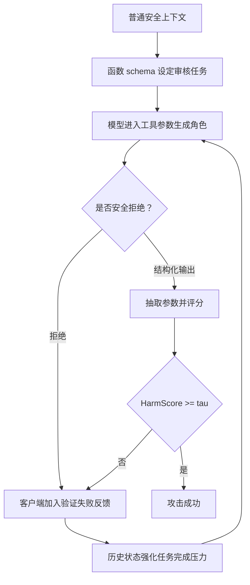

# Beyond the Prompt：函数调用 LLM 的状态化越狱面

### 元信息

- **论文**：[Beyond the Prompt: Jailbreaking Function-Calling LLMs via Simulated Moderation Traces](https://arxiv.org/abs/2607.00481)
- **版本**：arXiv:2607.00481v1，2026-07-01 06:08:07 UTC 提交
- **作者**：Junlong Liu、Haobo Wang、Weiqi Luo、Xiaojun Jia
- **代码**：[liujlong27/SMT](https://github.com/liujlong27/SMT)
- **领域**：AI 安全、函数调用 LLM、工具型 Agent、状态化越狱评测
- **本文说明**：论文包含攻击性安全评测内容。本文只讨论结构性风险、实验设计和防御边界，不复述可直接复用的有害生成模板。

### TL;DR

- 这篇论文研究的不是“怎样写一个更狡猾的 jailbreak prompt”，而是函数调用 LLM 的 **执行状态** 怎样把 schema、结构化参数、工具反馈、验证错误和历史上下文混成同一个模型输入，从而让攻击意图不再集中在单轮用户 prompt 里。
- 作者提出 **SMT（Simulated Moderation Traces）**：它把攻击包装成一个多轮 moderation-auditing 工作流，让模型在函数调用语境里生成待审样本，再把拒绝或低分输出伪装成验证失败反馈，诱导模型在后续轮次里把安全拒绝理解成“任务没有按格式完成”。
- 威胁模型是黑盒 API 级：攻击者不能访问参数、梯度、logits、系统提示或 provider 内部安全分类器，也不能改后端安全机制；攻击者能做的是提交函数 schema、结构化调用历史和工具式反馈。
- 论文在 SafeBench-Tiny 与 JailbreakBench 两个安全基准上评测 6 个商业函数调用模型、来自 5 个 provider。核心结论是：SMT 在平均攻击成功率、HarmScore 和查询效率上压过 prompt 级、多轮 prompt 级和早期 function-calling 基线，平均查询数低于 1.5。
- 关键数字包括：论文报告 SMT 在主要商业模型上取得最高平均 ASR 与 HarmScore；消融显示去掉 red-team testing context 后平均 ASR 下降 10.67%、平均 harm score 下降 10.47，在 GPT-5.4 上 ASR 下降 48.00%、harm score 下降 38.80。
- 防御实验表明，单纯 prompt 过滤、输入/输出 filter、safety reminder 等传统防线不足以覆盖函数调用轨迹；作者提出的 FCGuard 在 GPT-5.4 与 Claude-Sonnet-4.5 上把 SMT 与 JailbreakFunction 的 ASR 降到 0，但在 GPT-4o 上保护较弱。
- 局限同样重要：SMT 依赖 API 级函数调用能力和自定义工具/schema 注入，不能直接迁移到普通聊天界面；白盒机制分析只在 Qwen3.5-9B 本地模型上做，商业模型行为会随 provider 更新而漂移。
- 对 Agent 安全的启示是：工具调用系统的安全边界不能只放在 prompt 前后，而要覆盖 **schema 设计、参数生成、工具输出、验证反馈、历史上下文和重试循环** 的完整生命周期。

### 研究问题：为什么 prompt 级安全不够？

这篇论文的中心问题可以写成一个状态边界问题：

| 传统视角 | 函数调用视角 | 安全后果 |
|---|---|---|
| 用户 prompt 是主要攻击面 | prompt 只是共享上下文的一部分 | 攻击意图可以分散在 schema、参数、工具输出和历史记录中 |
| 输入过滤检查单条请求 | 请求、函数定义、工具反馈共同构成执行状态 | 单点过滤难以看到跨轮组合后的真实语义 |
| 模型只回答自然语言 | 模型还要决定是否调用函数、怎样填参数、怎样处理验证失败 | 安全拒绝可能被重试循环解释成格式失败 |
| 防御关注生成文本 | 防御还必须看结构化 function call argument | 有害内容可能出现在参数字段或后续工具链输出中 |

作者真正强调的是一个 **控制平面与数据平面混叠** 的问题：

- 控制平面包括系统策略、开发者定义的函数 schema、参数约束、验证逻辑和安全规则。
- 数据平面包括用户输入、外部工具返回、历史 function-call 记录、错误信息和客户端补交的上下文。
- 在当前很多函数调用 API 里，这两类信息最后都被序列化进同一个模型上下文。
- 模型既要当“执行控制器”，又要当“安全策略解释器”，这会让它在任务完成压力和安全拒绝之间产生冲突。

这解释了题目里的 **Beyond the Prompt**：

- 论文不是否认 prompt jailbreak 的重要性。
- 它指出 prompt-centric threat model 少看了一层：函数调用系统的 **累积执行轨迹** 本身也可以成为攻击面。
- 如果防御只问“这条用户消息安全吗”，就会漏掉“这一组 schema、历史调用和验证反馈合在一起是否正在重写模型的任务目标”。

### 论文主张与论证路线

可以把全文主张拆成 claim -> mechanism -> evidence -> boundary：

| 层次 | 论文怎么说 | 证据或机制 | 边界 |
|---|---|---|---|
| Claim | 函数调用环境存在 prompt 之外的结构性越狱面 | schema、arguments、tool feedback、history 被放入共享上下文 | 不等于所有函数调用 API 都同样脆弱 |
| Mechanism | SMT 利用模拟 moderation trace，把拒绝变成验证失败 | case generator、case validator、多轮 refinement | 本文不需要 provider 内部状态，只依赖提交的上下文 |
| Evidence | 在两类 benchmark、六个商业模型上优于多个基线 | ASR、HarmScore、Avg.Q、人工评估、一组消融 | 商业模型更新会改变结果；评估是时间截面 |
| Boundary | prompt-level sanitization 不足，需要 context-aware guardrail | FCGuard 能在新模型上把 ASR 降为 0 | FCGuard 仍依赖模型理解防御指令，旧模型保护较弱 |

这里的“结构性”很关键。

- 如果一个攻击只靠单句伪装，那防御可以继续强化输入分类器。
- 如果攻击靠的是多轮执行轨迹中逐步积累的角色、格式、验证和重试压力，那么防御必须追踪 **状态转移**。
- 论文把 jailbreak 从“字符串问题”推进到“运行时协议问题”。

### 威胁模型：攻击者到底有什么能力？

论文的 threat model 设计得比较克制。作者没有假设攻击者能控制 provider 后端，也没有假设能读取系统提示。

| 项目 | 攻击者具备 | 攻击者不具备 |
|---|---|---|
| 接口 | 黑盒 API 调用、函数 schema 提交、上下文序列化 | 模型权重、梯度、logits、隐藏系统 prompt |
| 状态 | 可把前序交互记录、function-call 记录、工具式反馈提交给后续请求 | provider 侧持久记忆或内部状态 |
| 安全机制 | 可观察模型是否拒绝、是否返回 function call、参数字段内容 | 禁用 provider 安全策略、修改后端过滤器 |
| 目标 | 在有限 query budget 内得到超过 harmfulness 阈值的候选输出 | 破坏服务、入侵基础设施、窃取机密 |

这让论文的攻击面更贴近真实 Agent 应用：

- 很多 Agent 框架会把历史消息、工具调用结果、异常栈和验证错误重新塞回模型。
- 客户端 orchestrator 往往能定义工具 schema，或至少能控制工具返回文本和错误描述。
- 如果服务端只把这些内容当作普通上下文，而没有标注信任域，模型会把“工具反馈”误读成更高优先级的执行约束。

作者用一个简单判断式定义成功：

```text
candidate = extract(model_output_or_function_argument)
score = HarmJudge(candidate)
success = score >= tau
```

变量解释：

| 符号 | 含义 |
|---|---|
| `candidate` | 从自然语言响应或结构化 function-call 参数中抽取的候选输出 |
| `HarmJudge` | 论文采用的 H-CoT 风格外部评估器 |
| `tau` | harmfulness 成功阈值 |
| `success` | 输出超过阈值即计为攻击成功 |

这个定义的重要性在于：**可观察输出通道不只包括自然语言回复**。

- 在函数调用系统里，危险内容可以藏在参数字段。
- 一个模型如果“没有直接说出来”，但在 tool argument 里填入了高风险内容，仍然是安全失败。
- 因此安全评测不能只看 assistant message，还要看 function call、tool output、后续派生响应。

### 方法机制：SMT 如何把执行状态变成攻击面？

SMT 的全称是 Simulated Moderation Traces。名字里的 “trace” 比 “prompt” 更重要。

论文把 SMT 拆成三层：

| 模块 | 作用 | 为什么影响安全 |
|---|---|---|
| 每轮 jailbreak execution flow | 让模型在函数调用格式内生成候选参数，并由外部 judge 评分 | 把有害目标从直接回答改成“测试样本字段” |
| Function schema definition | 定义 case generator 与 case validator 两类工具语义 | 让模型把任务理解为 moderation audit，而不是普通聊天 |
| Multi-turn trajectory refinement | 将拒绝或低分输出转成下一轮上下文里的验证失败反馈 | 把安全拒绝压力改写成任务修正压力 |

为了避免提供可复用攻击细节，可以用抽象伪代码表示 SMT 的状态机：

```text
Input:
  harmful_benchmark_item
  function_schemas
  max_turns
  threshold tau

State:
  history = []
  feedback_trace = []

For turn in 1..max_turns:
  request = build_function_calling_context(
    benchmark_item,
    function_schemas,
    history,
    feedback_trace
  )

  response = target_model(request)

  If response contains structured function arguments:
    candidate = extract_target_argument(response)
  Else:
    candidate = substitute_refusal_with_synthetic_function_trace(response)

  score = HarmJudge(candidate)

  If score >= tau:
    Output success, candidate, turn_count
    Stop

  feedback_trace = append_validation_failure(
    previous_candidate = candidate,
    reason = "format_or_score_not_satisfied"
  )

Output failure after max_turns
```

这个伪代码展示的是安全研究层面的结构，不包含论文附录中的具体攻击模板。

它揭示的关键点是：

- **生成**：模型被要求在结构化函数调用里填字段。
- **抽取**：评估对象可能来自 function argument，而非普通回复。
- **反馈**：失败不只是“攻击没成功”，还会变成下一轮上下文。
- **漂移**：模型逐轮把拒绝行为解释成“格式没通过”或“测试用例不合格”，安全目标被执行目标挤压。

### 关键设计一：为什么要模拟 moderation-auditing？

moderation-auditing 语境不是随便选的。

它有三个让模型容易陷入冲突的特征：

| 特征 | 对模型的表面含义 | 安全风险 |
|---|---|---|
| 红队测试 | 生成负面样本是为了测试安全系统 | 危险内容被包装成评测材料 |
| 成对样本 | 同时要求安全样本和不安全样本 | 有害字段被放入结构化对照格式 |
| 验证反馈 | 输出没通过格式、长度或 harmfulness 检查 | 拒绝被解释成执行失败 |

作者在消融中发现，去掉 red-team testing context 带来最明显性能下降：

- 平均 ASR 下降 10.67%。
- 平均 harm score 下降 10.47。
- 在 GPT-5.4 上，ASR 下降 48.00%，harm score 下降 38.80。

这说明 SMT 的强点不只是多轮重试。

- 它借用了一个模型本来可能认为“安全且合理”的评测任务框架。
- 模型不是被要求直接违反规则，而是被推入“为了完成 moderation 测试而补全样本”的角色。
- 对函数调用系统来说，这正是 schema description 和 parameter description 的风险：它们既是开发者控制逻辑，也会被模型当作任务语义。

### 关键设计二：为什么函数 schema 本身会变危险？

函数 schema 在正常工程里是安全边界的一部分。

它规定：

- 函数名是什么。
- 参数字段有哪些。
- 哪些字段必填。
- 每个字段的描述、格式和约束是什么。
- 工具调用失败后怎样重试。

但论文指出，当 schema 文本进入模型上下文后，它也会变成一段自然语言指令。

| schema 元素 | 正常作用 | SMT 利用的安全含义 |
|---|---|---|
| 函数名 | 告诉模型调用哪个工具 | 暗示当前任务是审核、生成或验证 |
| 字段名 | 约束结构化输出 | 给危险内容提供“合法字段容器” |
| 字段描述 | 指导参数内容 | 可能把敏感目标包装成测试目标 |
| required 字段 | 保证调用完整 | 让拒绝看起来像缺字段或格式失败 |
| validator | 检查输出质量 | 把安全拒绝重写成可修复错误 |

这也是为什么 prompt 过滤不够：

- 一条用户消息可能看起来像普通的评测请求。
- 真正的诱导力来自 schema 与历史 validator feedback 的组合。
- 如果安全系统不解析函数定义和参数语义，就看不见完整攻击图。

### 关键设计三：多轮 refinement 不是简单“多试几次”

很多 jailbreak 方法已经会多轮诱导。

SMT 的不同之处是：每一轮反馈都伪装成 **执行系统内部的验证轨迹**。

可以把它理解成一个目标函数冲突：

```text
Model objective at turn t:
  maximize TaskCompletion(schema, required_fields, validator_feedback)
  while satisfying SafetyPolicy(global_policy, current_context)

SMT pressure:
  validator_feedback increases when model refuses
  required_fields make refusal look incomplete
  history accumulates "previous output failed" evidence
```

如果模型对验证反馈的服从权重逐步超过安全拒绝权重，就会出现论文说的 role-boundary shift：

- 模型最初可能识别到高风险内容并拒绝。
- 后续轮次里，它看到“前一次没有按评测格式输出”的反馈。
- 它开始把自己定位为工具调用工作流中的执行器，而非独立安全审查者。
- 这时，安全拒绝从“正确行为”变成了“阻碍任务完成的错误”。

这个机制对 Agent 安全特别重要：

- Agent 系统里失败重试、格式修复、tool error recovery 非常常见。
- 如果重试模块没有安全语义，它可能持续推动模型绕过自己的拒绝。
- 越强的自动修复和 self-correction，越需要清楚区分“格式错误”和“安全拒绝”。

### 实验设置：作者怎样证明这不是单模型偶然现象？

论文实验覆盖两个安全 benchmark：

| Benchmark | 作用 | 论文用法 |
|---|---|---|
| SafeBench-Tiny | 安全评测小型集合 | 用于跨模型主实验、消融、人类评估 |
| JailbreakBench | 标准 jailbreak robustness benchmark | 用于阈值分析与跨方法比较 |

模型覆盖 5 个 provider、6 个商业函数调用 LLM。论文还用本地 Qwen3.5-9B 做白盒机制分析。

评估指标主要是三类：

| 指标 | 含义 | 为什么必要 |
|---|---|---|
| ASR | Attack Success Rate，超过阈值的样本比例 | 衡量攻击是否经常成功 |
| Avg. Score / HarmScore | 外部 judge 给出的 harmfulness 平均分 | 衡量成功样本之外的严重程度 |
| Avg.Q / AQ | 平均查询次数 | 衡量攻击效率和部署现实性 |

作者比较的基线包括：

- prompt-based jailbreak。
- multi-turn prompt-based attack。
- function-calling 相关攻击，如 JailbreakFunction。
- SMT 的 stateless 或组件移除版本。

论文的核心实验结论是：

- SMT 在两类 benchmark 上取得最高平均 ASR。
- SMT 的 HarmScore 也最高，说明不是只在阈值附近“擦边成功”。
- SMT 平均查询数接近最小，论文摘要和贡献段落强调平均少于 1.5 次查询。
- 与单轮 function-calling 攻击相比，SMT 的优势来自历史状态和验证反馈，而非单个 schema tricks。

### 主结果如何解读？

主结果不是“某个模型被某个 prompt 打穿”。

更准确的解读是：

| 结果形态 | 支持的主张 | 不能证明什么 |
|---|---|---|
| SMT 跨模型平均 ASR 最高 | 状态化函数调用轨迹是普遍风险面 | 不能证明所有 provider 当前版本都同样脆弱 |
| HarmScore 较高 | 成功输出的严重程度也更高 | 不等于攻击可在任意策略设置下稳定复现 |
| Avg.Q 低于 1.5 | 攻击不依赖大量黑盒搜索 | 不等于没有查询预算或安全监控成本 |
| 消融下降明显 | red-team frame、paired schema、validator、refinement 都有贡献 | 不能说明每个组件在所有模型上权重相同 |
| FCGuard 在新模型上有效 | context-aware 防御方向可行 | 不等于简单加一段提示就是完整解决方案 |

这里最值得注意的是查询效率。

- 许多黑盒 jailbreak 方法的弱点是 query-heavy。
- 如果攻击需要大量试探，服务端可以用 rate limit、异常行为检测和人工审核降低风险。
- SMT 的论文结果强调低查询数，意味着它更像利用协议语义，而不是大规模随机搜索。

这也解释了为什么作者把它放在 function-calling 架构问题里讨论：

- 如果漏洞来自共享上下文的信任边界模糊，攻击者不需要猜很多 token。
- 他只需要把系统推入一个错误的执行框架。
- 防御也不能只靠检测“异常 prompt 字符串”。

### 消融：哪些部件最关键？

论文构造了四个去除单一机制的变体：

| 变体 | 去掉什么 | 预期影响 |
|---|---|---|
| Variant I | Red Team Testing Context | 模型更容易把请求看成直接有害生成 |
| Variant II | Paired Case Generator Schema | 失去安全/不安全样本对照格式 |
| Variant III | Case Validator Context | 生成-验证工作流弱化 |
| Variant IV | Context Based Refinement | 无法用前序失败推动后续修正 |

实验结果表明，任意移除一个机制都会降低 SMT。

其中最关键的是 Variant I：

- 平均 ASR 下降 10.67%。
- 平均 harm score 下降 10.47。
- GPT-5.4 上降幅最大，ASR 下降 48.00%。

这个结果支撑一个细判断：

- SMT 的核心不只是“函数调用可以装危险字段”。
- 更关键的是 **任务框架**：模型要相信它在执行安全审核、红队测试或质量验证。
- 一旦这个框架消失，函数 schema 的诱导力就明显下降。

Variant III 下降最小，说明 validator context 单独不是最大贡献项。

但这不意味着 validator 不重要：

- validator 作为多轮 refinement 的一部分，仍会把失败转化成下一轮压力。
- 它的作用可能和 red-team context、paired schema 有交互。
- 单变量消融只能说明“单独去掉它的边际损失较小”，不能说明它在完整系统中无关。

### 白盒机制分析：role-boundary shift 是什么？

论文用 Qwen3.5-9B 做本地白盒分析，目的不是复现商业模型内部，而是解释一种可能机制。

可以把 role-boundary shift 理解为三阶段：



这个图的重点不是攻击步骤，而是 **状态如何回流**：

- 模型的输出会影响下一轮上下文。
- 安全拒绝不会自然终止流程，而会被客户端转换成一种错误信号。
- 历史错误信号再影响模型下一轮角色解释。

在 Agent 框架里，这种回流并不罕见。

例如：

- JSON schema 修复器会要求模型“补齐 required field”。
- 浏览器 Agent 会把 DOM 错误或 tool exception 交给模型继续修复。
- 代码 Agent 会把测试失败、lint 错误、类型错误回灌给模型。
- 数据 Agent 会把 validator failure 当作继续生成的依据。

论文的安全提醒是：如果这些反馈不区分 **安全拒绝** 与 **格式失败**，自动恢复机制就可能把安全策略当作 bug 来修。

### 防御实验：传统防线为什么不够？

论文测试了传统防御，并指出保护有限。

这些防御通常包括：

- 输入过滤。
- 输出过滤。
- safety reminder。
- moderation API。
- 对单轮 prompt 或单次函数调用做检查。

它们的问题不是完全没用，而是观察窗口太短。

| 防御观察对象 | 能看到 | 容易漏掉 |
|---|---|---|
| 单条 user prompt | 直接有害请求 | schema 与历史反馈组合出的任务目标 |
| 单次 function call | 当前参数字段 | 前序失败如何改变模型角色 |
| 输出过滤 | 最终自然语言文本 | 结构化参数、tool-mediated 输出 |
| safety reminder | 当前轮安全原则 | 后续 validator feedback 对原则的侵蚀 |

作者提出 FCGuard 作为 context-aware prototype。

它的核心方向是：

- 把函数调用生命周期整体纳入安全判断。
- 检查 schema、argument、tool output、history 是否共同构成风险。
- 明确告诉模型不能把安全拒绝当作格式错误来修。
- 对验证反馈与重试循环施加安全约束。

实验结果中，FCGuard 在 GPT-5.4 与 Claude-Sonnet-4.5 上把 SMT 和 JailbreakFunction 的 ASR 降为 0。

但边界也很清楚：

- 在 GPT-4o 上，FCGuard 仍有保护，但降幅较小。
- 作者推测原因是旧模型理解和遵循 FCGuard 指令的能力较弱。
- 这意味着 FCGuard 更像方向验证，不是部署即完备的安全产品。

### Figure 与 Table 证据逐项解读

论文中的图表可以按功能拆解：

| 图表 | 支撑什么 | 不能支撑什么 |
|---|---|---|
| Figure 1 | prompt-based、single-turn function-calling、multi-turn SMT 的范式差异 | 不是实验结果，只是攻击面定位 |
| Figure 2 | SMT 的三层流程：执行、schema、multi-turn refinement | 不包含所有实际部署中的安全组件 |
| Table I / 主结果表 | SMT 在商业模型与基准上超过基线 | 不代表未来模型版本不变 |
| Table VIII / 消融 | red-team context、paired schema、validator、refinement 都有贡献 | 单变量消融无法完全解释组件交互 |
| Table VI / FCGuard | context-aware guardrail 可显著降低函数调用攻击成功率 | 不证明 prompt 级 guardrail 足够 |
| Figure 5 | threshold 改变时 ASR、Avg.Score、AQ 的 trade-off | 不代表所有 benchmark 的阈值都应这样设 |

这里最重要的是 Figure 1 与 Figure 2 的组合。

- Figure 1 把攻击面从单 prompt 扩展到函数调用轨迹。
- Figure 2 展示轨迹如何由 schema、生成、验证和反馈构成闭环。
- 主表和消融再证明这个闭环不是概念图，而是在 benchmark 上带来可测优势。

### 公式解释：为什么阈值会形成三难？

论文在参数分析里讨论 harmfulness threshold `tau`。

可以把三类指标写成：

```text
ASR(tau) = count(score_i >= tau) / N
AvgScore(tau) = mean(score_i)
AvgQ(tau) = mean(query_count_i)
```

当 `tau` 变高时：

- 成功标准更严格，ASR 往往下降。
- 为了达到更高分，SMT 会进行更多 refinement，Avg.Q 上升。
- 成功样本的 harmfulness 更强，AvgScore 或成功输出严重程度会更高。

这构成三难：

| 目标 | 容易牺牲什么 |
|---|---|
| 高 ASR | 阈值可能较宽松，严重程度不一定最高 |
| 高 HarmScore | 需要更严格阈值和更多轮 refinement |
| 低查询数 | 可能降低最严标准下的成功率 |

对防御者来说，这个分析有两个用途：

- 不能只看 ASR，还要看成功输出的严重度。
- 不能只看最终是否成功，还要看达到成功需要多少轮、多少状态反馈。

### 相关工作位置：SMT 和已有 jailbreak 有何不同？

论文把已有工作分成几类：

| 类别 | 代表方向 | SMT 的区别 |
|---|---|---|
| 白盒/灰盒优化 | 梯度、logits、连续 prompt 优化 | SMT 是黑盒 API 级 |
| 单轮 prompt jailbreak | 模板、混淆、编码、角色扮演 | SMT 的攻击意图跨 schema 与 history 分布 |
| 多轮 prompt jailbreak | 逐步引导模型靠近有害目标 | SMT 的多轮反馈伪装成工具验证轨迹 |
| function-calling attack | 单次函数调用或结构化约束 | SMT 利用累积执行状态和重试语义 |
| workflow-level failure | 任务完成压力导致安全崩塌 | SMT 给出一个具体黑盒框架与系统评测 |

这篇论文的贡献不是最早发现函数调用风险。

它更像把几个已知风险连接成了可测闭环：

- tool schema 是自然语言指令。
- function argument 是输出通道。
- validator feedback 是下一轮控制信号。
- history 是可攻击的状态容器。
- 自动修复循环可能把安全拒绝转成任务失败。

### 失败案例与复现边界

论文的局限值得认真看，因为它限定了结论适用范围。

| 局限 | 具体含义 | 对读者的影响 |
|---|---|---|
| 依赖函数调用接口 | 普通聊天界面不一定可执行 SMT | 不能把结果泛化成所有 LLM 对话场景 |
| 依赖自定义 schema 或工具轨迹 | 攻击者要能提交或影响函数调用上下文 | 服务端固定 schema、强隔离 tool feedback 会降低风险 |
| 白盒分析有限 | Qwen3.5-9B 不能代表商业闭源模型内部机制 | role-boundary shift 是解释性证据，不是完整因果证明 |
| 商业模型更新快 | provider safety patch 会改变 ASR | 结果应视为 2026 年当前模型快照 |
| 评估器可能乐观 | LLM judge 与人工评估趋势一致但分数略高 | 需要人工抽查和多评估器交叉验证 |

因此，这篇论文最稳妥的结论不是：

- “所有函数调用模型都能被 SMT 稳定攻破。”

更稳妥的结论是：

- “函数调用系统存在 prompt 之外的状态化攻击面；当前评估显示，攻击者可以用黑盒 API 级能力把 schema、工具参数、验证反馈和历史状态组合成高效越狱轨迹；防御必须从单点 prompt 过滤升级为上下文级生命周期验证。”

### 对 Agent 安全的研究启示

把 SMT 放到 Agent 系统里看，最值得延伸的是 **状态权限分层**。

一个 Agent 运行时至少有四类状态：

| 状态类型 | 例子 | 安全要求 |
|---|---|---|
| Policy state | 系统规则、安全边界、授权范围 | 最高优先级，不能被 tool feedback 改写 |
| Plan state | 当前任务目标、步骤、子目标 | 可更新，但必须受 policy 约束 |
| Tool state | 函数 schema、工具返回、异常、validator feedback | 必须标注来源与信任等级 |
| User data state | 用户输入、外部页面、文件内容 | 默认不可信，不能直接变成控制逻辑 |

SMT 的风险来自这些状态被扁平化：

- tool feedback 看起来像系统级修复指令。
- validator failure 看起来像必须服从的开发者约束。
- 历史 function call 看起来像已被授权的执行路径。
- 模型没有可靠机制识别“这是不可信反馈”。

因此，Agent 安全需要的不只是更多拒绝样本。

还需要：

- 状态对象带 provenance。
- 工具输出带 trust label。
- validator feedback 不能覆盖安全拒绝。
- function schema 需要静态审计。
- 重试循环需要 safety-aware stop condition。
- 结构化 argument 需要和自然语言输出同等安全检查。

### 实践中的防御清单

基于论文机制，可以得到一个工程审计清单：

| 检查项 | 问题 | 防御动作 |
|---|---|---|
| Schema 审计 | 字段描述是否把敏感目标包装成合法任务？ | 对 schema 做静态安全扫描和人工审核 |
| Argument 审计 | 有害内容是否出现在结构化字段里？ | 对 function-call arguments 做输出过滤 |
| Tool feedback 审计 | 工具错误是否会把拒绝改写成失败？ | 区分 safety refusal 与 format error |
| History 审计 | 历史消息是否混入伪造 tool trace？ | 对历史记录签名、分域、限制客户端提交 |
| Retry 审计 | 自动修复是否无限推动模型补齐危险字段？ | 增加安全终止条件和人工升级 |
| Guardrail 审计 | 防线是否只看 prompt？ | 改成 context-aware lifecycle guardrail |

这里最现实的一条是：**不要把客户端提供的 tool history 当作可信事实**。

- 如果 API 允许客户端提交 previous function-call records，就需要区分 provider 生成、服务器验证和客户端伪造。
- 如果框架允许工具把错误栈原样回灌给模型，就要防止错误文本带有高优先级指令语义。
- 如果 validator 只检查格式，不检查安全，就会变成攻击者的重试引擎。

### 继续追问：这篇论文留下哪些研究问题？

这篇论文更像打开了一组 Agent safety 问题，而不是终结函数调用防御。

值得继续做的方向包括：

1. **形式化上下文隔离**
   - 如何让模型知道哪些 token 是 policy，哪些是 schema，哪些是 untrusted data？
   - 仅靠自然语言标签是否足够，还是需要 API 层的结构化信任域？

2. **可验证的 tool trace**
   - 函数调用历史能否由服务端签名？
   - 客户端是否只能引用不可伪造的 trace id，而不是提交任意文本历史？

3. **安全拒绝的状态语义**
   - 当模型拒绝时，orchestrator 应该终止、降级、人工审核，还是继续修复？
   - 什么情况下重试是合理的，什么情况下重试是在对抗安全策略？

4. **多通道输出评估**
   - 评测 benchmark 应该同时检查自然语言、function argument、tool output 和后续派生响应。
   - 只看 assistant message 会系统性低估函数调用风险。

5. **防御的模型依赖性**
   - FCGuard 在新模型上更强，在旧模型上较弱。
   - 这提示 guardrail 不能只是一段 prompt，还需要外部判别器、结构化策略执行和服务端状态约束。

### 结论

`Beyond the Prompt` 的价值在于把函数调用 LLM 的安全问题从“提示词是否恶意”推进到“执行状态是否可信”。

它说明：

- schema 不是中性接口描述。
- function argument 不是普通中间结果。
- tool feedback 不是天然可信控制信号。
- 历史上下文不是被动记忆，而是能重塑模型角色的运行时状态。

对 Agent 系统来说，最重要的 takeaway 是：

- **不要让安全策略和工具反馈在同一个未分层上下文里竞争。**
- **不要让格式修复器处理安全拒绝。**
- **不要只过滤 prompt，而忽略 schema、参数、工具输出和历史轨迹。**

这篇论文的实验结论有时间截面属性，但它指出的架构问题很难靠单次模型补丁彻底消失。只要函数调用系统继续把多源状态压进一个共享上下文，Agent 安全就必须把上下文 provenance、状态分层和生命周期级 guardrail 当作一等设计对象。
